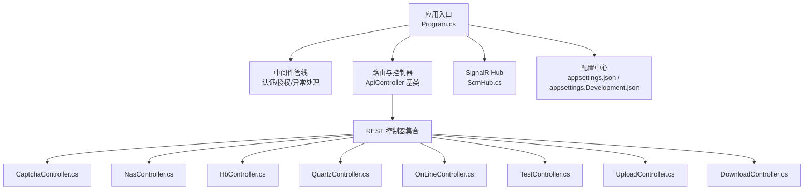
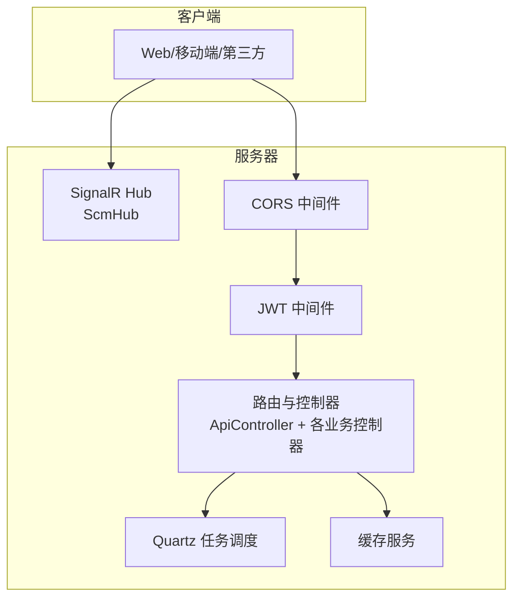
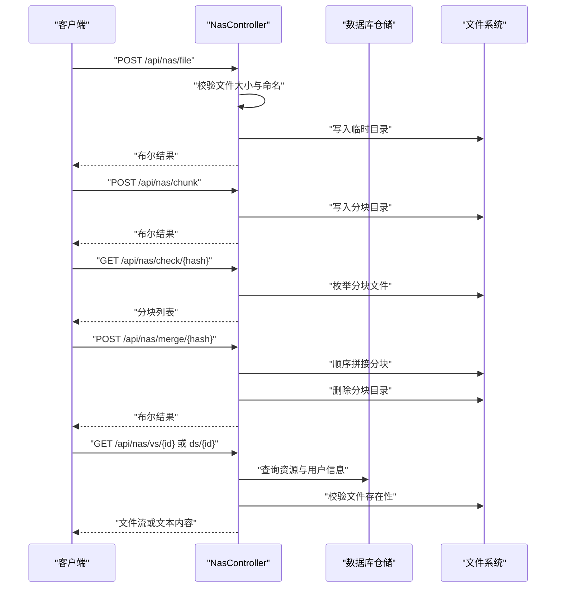
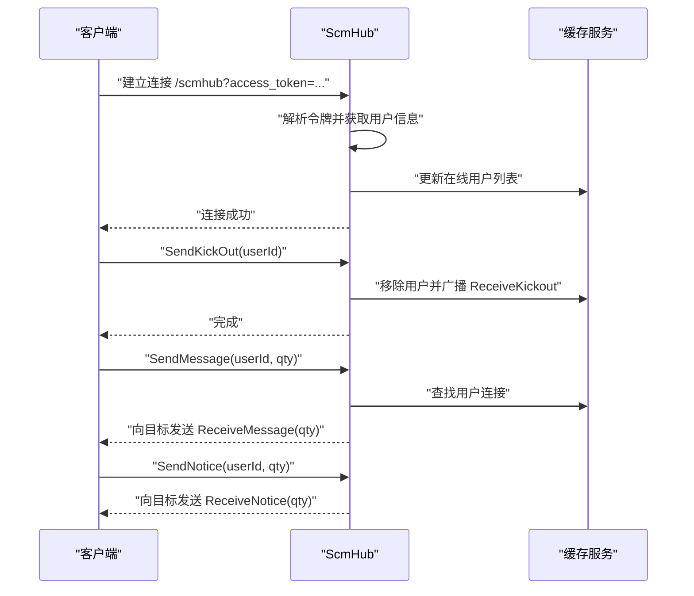
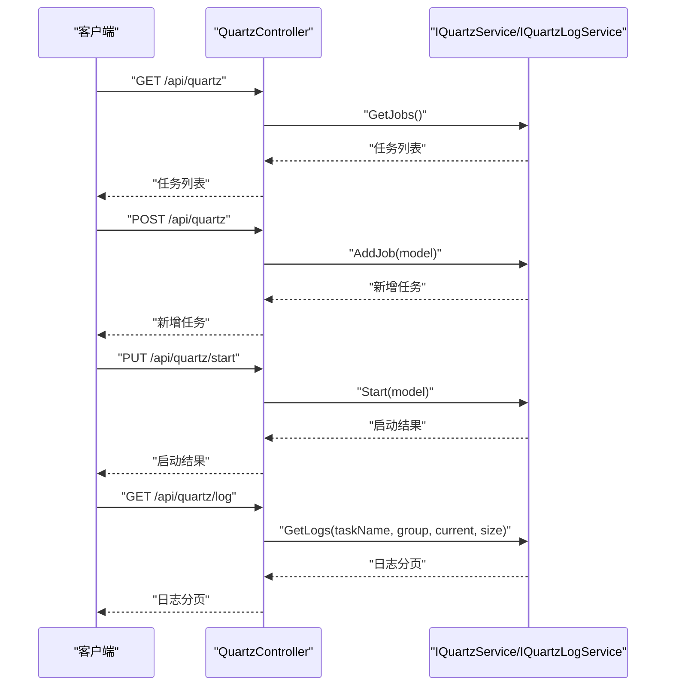
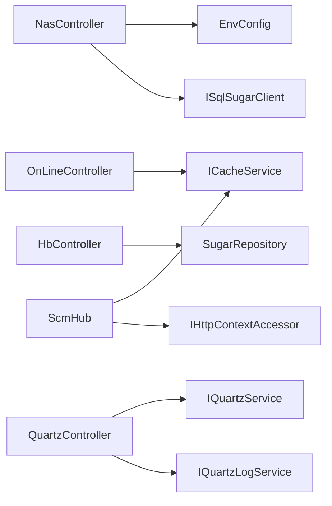

# API 参考文档

<cite>
**本文档引用的文件**
- [Program.cs](file://Scm.Net/Program.cs)
- [appsettings.json](file://Scm.Net/appsettings.json)
- [appsettings.Development.json](file://Scm.Net/appsettings.Development.json)
- [ApiController.cs](file://Scm.Server/Controllers/ApiController.cs)
- [CaptchaController.cs](file://Scm.Net/Controllers/CaptchaController.cs)
- [DownloadController.cs](file://Scm.Net/Controllers/DownloadController.cs)
- [UploadController.cs](file://Scm.Net/Controllers/UploadController.cs)
- [NasController.cs](file://Scm.Net/Controllers/NasController.cs)
- [HbController.cs](file://Scm.Net/Controllers/HbController.cs)
- [OnLineController.cs](file://Scm.Net/Controllers/OnLineController.cs)
- [QuartzController.cs](file://Scm.Net/Controllers/QuartzController.cs)
- [TestController.cs](file://Scm.Net/Controllers/TestController.cs)
- [ScmHub.cs](file://Scm.Server.SignalR/Hubs/ScmHub.cs)
</cite>

## 目录
1. [简介](#简介)
2. [项目结构](#项目结构)
3. [核心组件](#核心组件)
4. [架构总览](#架构总览)
5. [详细组件分析](#详细组件分析)
6. [依赖关系分析](#依赖关系分析)
7. [性能与容量规划](#性能与容量规划)
8. [故障排查指南](#故障排查指南)
9. [结论](#结论)
10. [附录](#附录)

## 简介
本文件为 Scm.Net 的全面 API 参考文档，覆盖 RESTful API 与实时通信 API（SignalR）。内容包括：
- 用户认证相关接口（登录、令牌、会话）
- 文件管理接口（上传、下载、查看、分块上传与合并）
- 实时通信接口（SignalR Hub）
- 任务调度接口（Quartz 任务管理）
- API 版本管理、速率限制、安全与跨域策略
- 常用调用示例、参数说明、返回值解释与调试建议

## 项目结构
Scm.Net 采用 ASP.NET Core 架构，通过 Program.cs 配置服务与中间件，映射控制器与 SignalR Hub，并在开发环境下启用 Swagger 文档。

**图表来源**
- [Program.cs:174-258](file://Scm.Net/Program.cs#L174-L258)
- [ApiController.cs:8-14](file://Scm.Server/Controllers/ApiController.cs#L8-L14)

**章节来源**
- [Program.cs:174-258](file://Scm.Net/Program.cs#L174-L258)
- [appsettings.json:1-127](file://Scm.Net/appsettings.json#L1-127)
- [appsettings.Development.json:139-161](file://Scm.Net/appsettings.Development.json#L139-L161)

## 核心组件
- 基础控制器基类：ApiController.cs 提供统一的路由前缀与分组标记，所有业务控制器继承该基类以自动纳入 API Explorer 分组。
- 配置中心：appsettings.json 与 appsettings.Development.json 提供 JWT、Kestrel、CORS、Quartz、缓存等全局配置。
- 中间件链：Program.cs 中注册了认证、授权、异常处理、跨域、SignalR 映射等。

**章节来源**
- [ApiController.cs:8-14](file://Scm.Server/Controllers/ApiController.cs#L8-L14)
- [Program.cs:147-238](file://Scm.Net/Program.cs#L147-L238)
- [appsettings.json:100-127](file://Scm.Net/appsettings.json#L100-L127)

## 架构总览
Scm.Net 的 API 架构由“HTTP REST 层 + SignalR 实时层”构成，控制器负责对外暴露 REST 接口，SignalR Hub 负责实时推送；JWT 用于认证，CORS 支持跨域访问，Swagger 在开发环境可用。

**图表来源**
- [Program.cs:206-238](file://Scm.Net/Program.cs#L206-L238)
- [ScmHub.cs:9-155](file://Scm.Server.SignalR/Hubs/ScmHub.cs#L9-L155)

## 详细组件分析

### REST API 总览与版本管理
- 路由前缀：所有控制器均继承 ApiController，统一前缀为 api/{controller}。
- API 分组：通过 ApiExplorerSettings(GroupName = "Scm") 对接口进行分组，Swagger 开发配置中包含多个分组与版本信息。
- 版本策略：不同分组具有不同版本（如 Samples v2），建议客户端按分组与版本对接。

**章节来源**
- [ApiController.cs:10-12](file://Scm.Server/Controllers/ApiController.cs#L10-L12)
- [appsettings.Development.json:139-161](file://Scm.Net/appsettings.Development.json#L139-L161)

### 用户认证与会话
- 登录与令牌：项目内置多种登录方式与 OIDC/OAuth/Otp 配置，JWT 中间件与配置位于 Program.cs 与 appsettings.json。
- 会话保持：SignalR 连接时从查询字符串读取 access_token 并解析用户信息，维护在线用户列表。

注意：具体登录接口实现位于 Scm.Core 模块，本文聚焦于与 API 层交互的接入方式与信号通道。

**章节来源**
- [Program.cs:160-164](file://Scm.Net/Program.cs#L160-L164)
- [appsettings.json:100-105](file://Scm.Net/appsettings.json#L100-L105)
- [ScmHub.cs:32-66](file://Scm.Server.SignalR/Hubs/ScmHub.cs#L32-L66)

### 文件管理 API
- 小文件上传：接收二进制文件，校验大小与命名规则，保存至临时目录。
- 大文件分块上传：按 64 位哈希作为目录名，分块命名为序号.chunk，支持断点续传。
- 上传校验：根据哈希列出已上传的 chunk 文件。
- 文件合并：按序拼接 chunk，生成 .nas 文件并清理临时目录。
- 文件查看与下载：支持小文件直接查看/下载与大文件断点续传下载。
- 下载小文件：根据资源表定位用户目录下的文件并返回物理文件流。

**图表来源**
- [NasController.cs:301-339](file://Scm.Net/Controllers/NasController.cs#L301-L339)
- [NasController.cs:349-464](file://Scm.Net/Controllers/NasController.cs#L349-L464)
- [NasController.cs:98-154](file://Scm.Net/Controllers/NasController.cs#L98-L154)
- [NasController.cs:164-296](file://Scm.Net/Controllers/NasController.cs#L164-L296)

**章节来源**
- [NasController.cs:45-90](file://Scm.Net/Controllers/NasController.cs#L45-L90)
- [NasController.cs:301-339](file://Scm.Net/Controllers/NasController.cs#L301-L339)
- [NasController.cs:349-464](file://Scm.Net/Controllers/NasController.cs#L349-L464)
- [NasController.cs:98-154](file://Scm.Net/Controllers/NasController.cs#L98-L154)
- [NasController.cs:164-296](file://Scm.Net/Controllers/NasController.cs#L164-L296)

### 实时通信 API（SignalR）
- Hub 地址：/scmhub
- 连接参数：access_token 查询字符串
- 事件与方法：
  - OnConnectedAsync：建立连接时解析令牌，更新在线用户列表
  - OnDisconnectedAsync：断开连接时移除用户
  - ReceiveKickout/out：向指定用户推送强制下线通知
  - ReceiveMessage：向指定用户推送消息数量变更
  - ReceiveNotice：向指定用户推送通知数量变更

**图表来源**
- [Program.cs:237-238](file://Scm.Net/Program.cs#L237-L238)
- [ScmHub.cs:25-89](file://Scm.Server.SignalR/Hubs/ScmHub.cs#L25-L89)
- [ScmHub.cs:95-134](file://Scm.Server.SignalR/Hubs/ScmHub.cs#L95-L134)

**章节来源**
- [Program.cs:237-238](file://Scm.Net/Program.cs#L237-L238)
- [ScmHub.cs:25-89](file://Scm.Server.SignalR/Hubs/ScmHub.cs#L25-L89)
- [ScmHub.cs:95-134](file://Scm.Server.SignalR/Hubs/ScmHub.cs#L95-L134)

### 任务调度 API（Quartz）
- 获取任务列表：GET /api/quartz
- 新建任务：POST /api/quartz
- 启动任务：PUT /api/quartz/start
- 暂停任务：PUT /api/quartz/pause
- 立即执行：PUT /api/quartz/run
- 更新任务：PUT /api/quartz
- 删除任务：PUT /api/quartz/delete
- 获取任务日志：GET /api/quartz/log

**图表来源**
- [QuartzController.cs:37-120](file://Scm.Net/Controllers/QuartzController.cs#L37-L120)

**章节来源**
- [QuartzController.cs:22-120](file://Scm.Net/Controllers/QuartzController.cs#L22-L120)

### 在线用户 API
- 获取在线用户：GET /api/onLine
- 返回当前缓存中的在线用户列表（包含用户标识、连接 ID、时间戳）

**章节来源**
- [OnLineController.cs:23-33](file://Scm.Net/Controllers/OnLineController.cs#L23-L33)

### 心跳与测试 API
- Echo 测试：GET /api/hb/Echo
- 终端心跳：POST /api/hb/hd
- 三方心跳：POST /api/hb/ts
- 测试 Echo：POST /api/test/Echo
- MIME 测试：POST /api/test/Mime

**章节来源**
- [HbController.cs:29-114](file://Scm.Net/Controllers/HbController.cs#L29-L114)
- [TestController.cs:19-39](file://Scm.Net/Controllers/TestController.cs#L19-L39)

### 图形验证码 API
- 生成图片验证码：GET /api/captcha/cha/{identify}
- 生成验证码 Key：GET /api/captcha/key/{identify}

**章节来源**
- [CaptchaController.cs:28-56](file://Scm.Net/Controllers/CaptchaController.cs#L28-L56)

### 小文件下载 API
- 下载小文件：GET /api/download/ds/{id}
- 依据资源表与用户信息定位文件路径，返回物理文件流

**章节来源**
- [DownloadController.cs:30-67](file://Scm.Net/Controllers/DownloadController.cs#L30-L67)

### 小文件上传 API
- 上传文件：POST /api/upload/file
- 参数：ScmUploadRequest（包含 file 与 file_name）
- 返回：ScmUploadResponse（成功/失败状态）

**章节来源**
- [UploadController.cs:26-70](file://Scm.Net/Controllers/UploadController.cs#L26-L70)

## 依赖关系分析
- 控制器依赖：
  - NasController 依赖 EnvConfig 与 ISqlSugarClient
  - OnLineController 依赖 ICacheService
  - HbController 依赖 SugarRepository<LogHbDao>
  - QuartzController 依赖 IQuartzService 与 IQuartzLogService
- 中间件与服务：
  - Program.cs 注册认证、授权、异常处理、CORS、SignalR、Swagger、JWT、缓存、Quartz 等
- 配置：
  - appsettings.json 提供 JWT、Kestrel、CORS、Quartz、缓存、OIDC、OTP 等配置项

**图表来源**
- [NasController.cs:39-43](file://Scm.Net/Controllers/NasController.cs#L39-L43)
- [OnLineController.cs:18-21](file://Scm.Net/Controllers/OnLineController.cs#L18-L21)
- [HbController.cs:19-22](file://Scm.Net/Controllers/HbController.cs#L19-L22)
- [QuartzController.cs:16-20](file://Scm.Net/Controllers/QuartzController.cs#L16-L20)
- [ScmHub.cs:15-19](file://Scm.Server.SignalR/Hubs/ScmHub.cs#L15-L19)

**章节来源**
- [Program.cs:147-238](file://Scm.Net/Program.cs#L147-L238)
- [appsettings.json:100-127](file://Scm.Net/appsettings.json#L100-L127)

## 性能与容量规划
- 速率限制与并发：
  - Kestrel Limits 中 MaxConcurrentConnections 与 MaxRequestBodySize 可控并发与请求体大小
- 缓存与数据库：
  - 使用 ICacheService 缓存在线用户与验证码等热点数据
  - SqlSugar 仓储访问数据库，建议对高频查询建立索引
- 文件传输：
  - 大文件采用分块上传与断点续传，降低单次传输失败风险
- 实时通信：
  - SignalR 连接数与消息推送频率需结合缓存与网络带宽评估

**章节来源**
- [appsettings.json:34-37](file://Scm.Net/appsettings.json#L34-L37)
- [NasController.cs:349-464](file://Scm.Net/Controllers/NasController.cs#L349-L464)
- [ScmHub.cs:46-66](file://Scm.Server.SignalR/Hubs/ScmHub.cs#L46-L66)

## 故障排查指南
- 认证失败：
  - 检查 access_token 是否正确传递到 /scmhub 查询串
  - 核对 appsettings.json 中 JWT 配置（Security、Issuer、Audience、Expires）
- CORS 问题：
  - 开发环境允许跨域，生产环境需按需配置 AllowedOrigins 与 AllowCredentials
- 文件上传失败：
  - 校验文件大小是否超过限制、命名是否符合规则（64 位哈希.nas 或 序号.chunk）
  - 检查临时目录权限与磁盘空间
- 下载空响应：
  - 确认资源记录存在且用户目录下文件真实存在
- 任务调度异常：
  - 检查 Quartz 配置与作业定义，查看日志接口返回的任务执行记录

**章节来源**
- [ScmHub.cs:32-66](file://Scm.Server.SignalR/Hubs/ScmHub.cs#L32-L66)
- [appsettings.json:100-127](file://Scm.Net/appsettings.json#L100-L127)
- [NasController.cs:304-339](file://Scm.Net/Controllers/NasController.cs#L304-L339)
- [NasController.cs:352-389](file://Scm.Net/Controllers/NasController.cs#L352-L389)
- [NasController.cs:396-421](file://Scm.Net/Controllers/NasController.cs#L396-L421)
- [NasController.cs:429-464](file://Scm.Net/Controllers/NasController.cs#L429-L464)
- [QuartzController.cs:115-120](file://Scm.Net/Controllers/QuartzController.cs#L115-L120)

## 结论
本文档梳理了 Scm.Net 的 REST API 与 SignalR 实时通信接口，明确了各模块职责、调用流程与关键参数约束。建议在生产环境中完善 CORS、限流与审计策略，并结合缓存与数据库优化提升吞吐与稳定性。

## 附录

### API 列表与说明（按模块）
- 文件管理
  - GET /api/nas/info/{id}：获取文件元信息
  - GET /api/nas/vs/{id}：小文件查看（内联）
  - GET /api/nas/ds/{id}：小文件下载
  - GET /api/nas/dl/{id}：大文件断点续传下载
  - POST /api/nas/file：小文件上传
  - POST /api/nas/chunk：分块上传
  - GET /api/nas/check/{hash}：上传校验
  - POST /api/nas/merge/{hash}：文件合并
  - GET /api/download/ds/{id}：小文件下载（独立控制器）
  - POST /api/upload/file：小文件上传（独立控制器）
- 实时通信
  - Hub /scmhub：连接参数 access_token
  - 事件：ReceiveKickout、ReceiveMessage、ReceiveNotice
- 任务调度
  - GET /api/quartz：获取任务列表
  - POST /api/quartz：新建任务
  - PUT /api/quartz/start：启动任务
  - PUT /api/quartz/pause：暂停任务
  - PUT /api/quartz/run：立即执行
  - PUT /api/quartz：更新任务
  - PUT /api/quartz/delete：删除任务
  - GET /api/quartz/log：获取任务日志
- 在线用户
  - GET /api/onLine：获取在线用户列表
- 心跳与测试
  - GET /api/hb/Echo：Echo 测试
  - POST /api/hb/hd：终端心跳
  - POST /api/hb/ts：三方心跳
  - POST /api/test/Echo：测试 Echo
  - POST /api/test/Mime：测试 MIME
- 图形验证码
  - GET /api/captcha/cha/{identify}：生成图片验证码
  - GET /api/captcha/key/{identify}：生成验证码 Key

**章节来源**
- [NasController.cs:50-90](file://Scm.Net/Controllers/NasController.cs#L50-L90)
- [NasController.cs:98-154](file://Scm.Net/Controllers/NasController.cs#L98-L154)
- [NasController.cs:164-296](file://Scm.Net/Controllers/NasController.cs#L164-L296)
- [NasController.cs:301-339](file://Scm.Net/Controllers/NasController.cs#L301-L339)
- [NasController.cs:349-464](file://Scm.Net/Controllers/NasController.cs#L349-L464)
- [DownloadController.cs:30-67](file://Scm.Net/Controllers/DownloadController.cs#L30-L67)
- [UploadController.cs:26-70](file://Scm.Net/Controllers/UploadController.cs#L26-L70)
- [ScmHub.cs:25-134](file://Scm.Server.SignalR/Hubs/ScmHub.cs#L25-L134)
- [QuartzController.cs:37-120](file://Scm.Net/Controllers/QuartzController.cs#L37-L120)
- [OnLineController.cs:27-33](file://Scm.Net/Controllers/OnLineController.cs#L27-L33)
- [HbController.cs:29-114](file://Scm.Net/Controllers/HbController.cs#L29-L114)
- [TestController.cs:19-39](file://Scm.Net/Controllers/TestController.cs#L19-L39)
- [CaptchaController.cs:28-56](file://Scm.Net/Controllers/CaptchaController.cs#L28-L56)