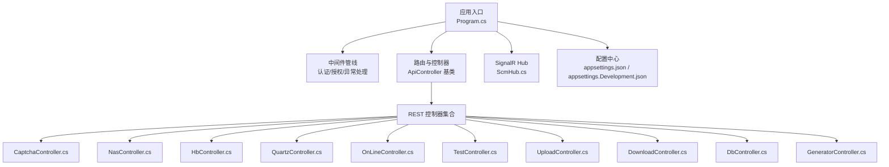
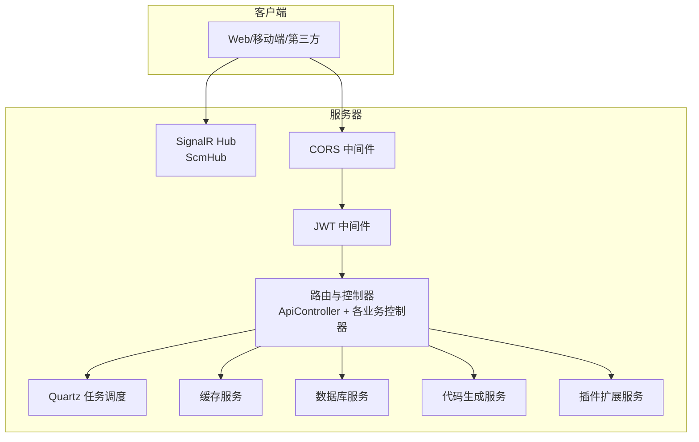
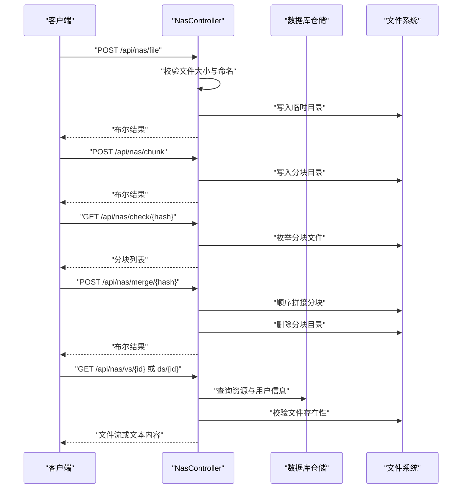
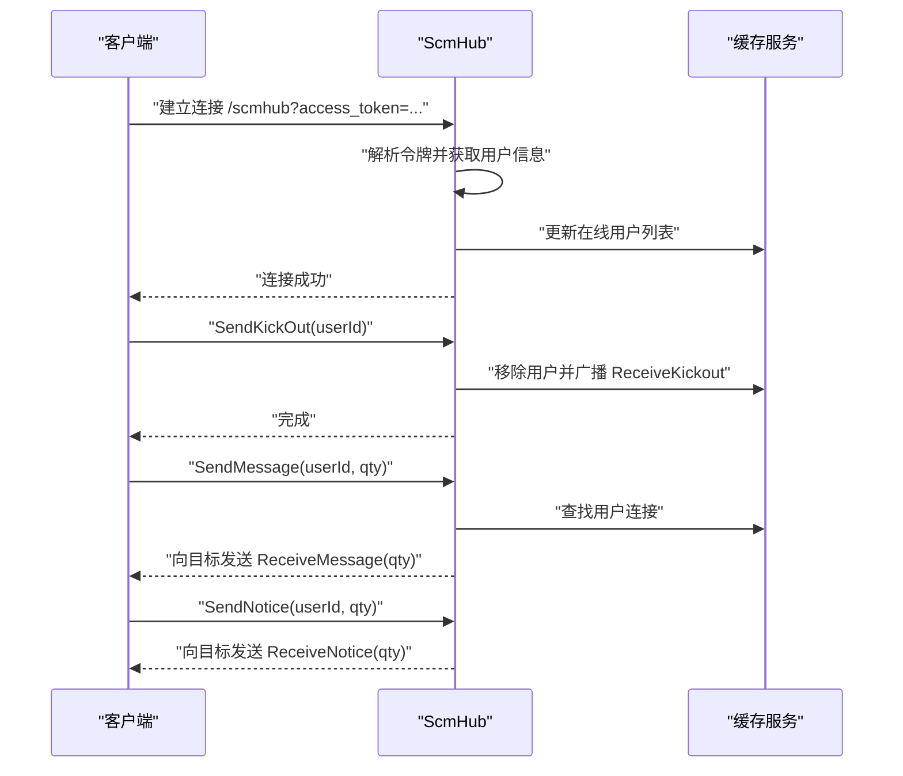
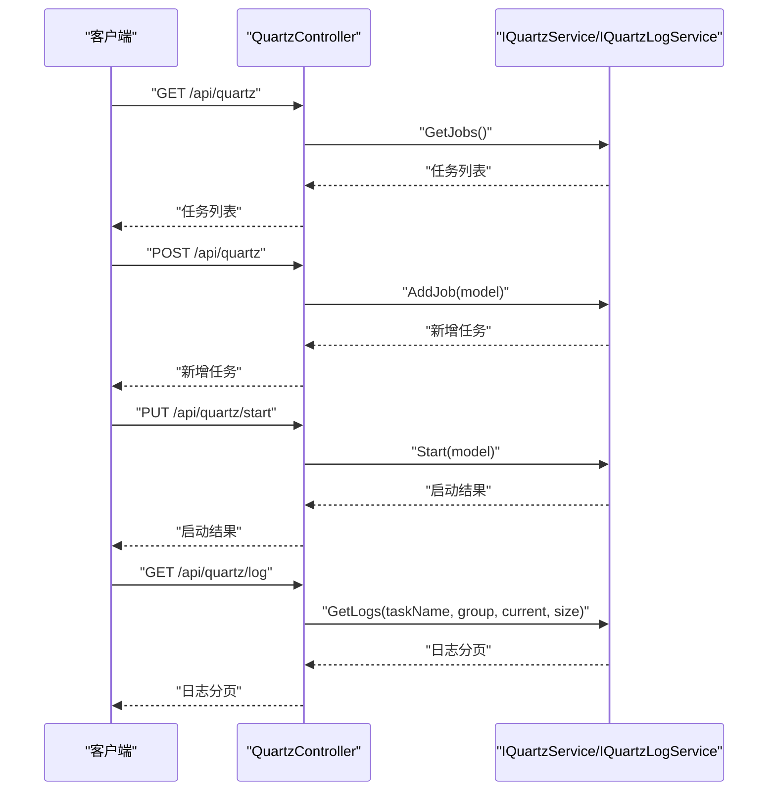
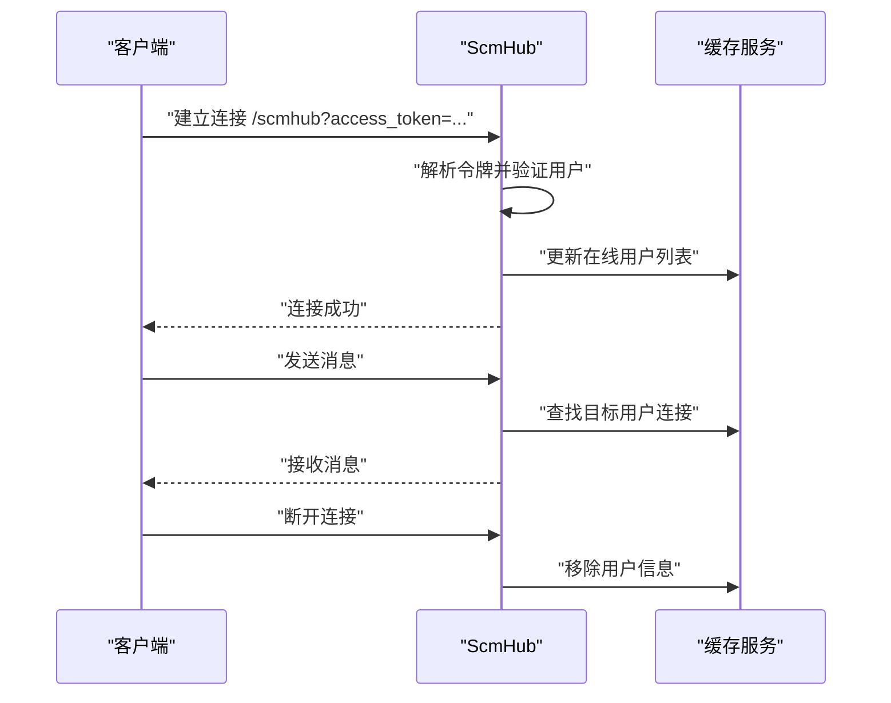
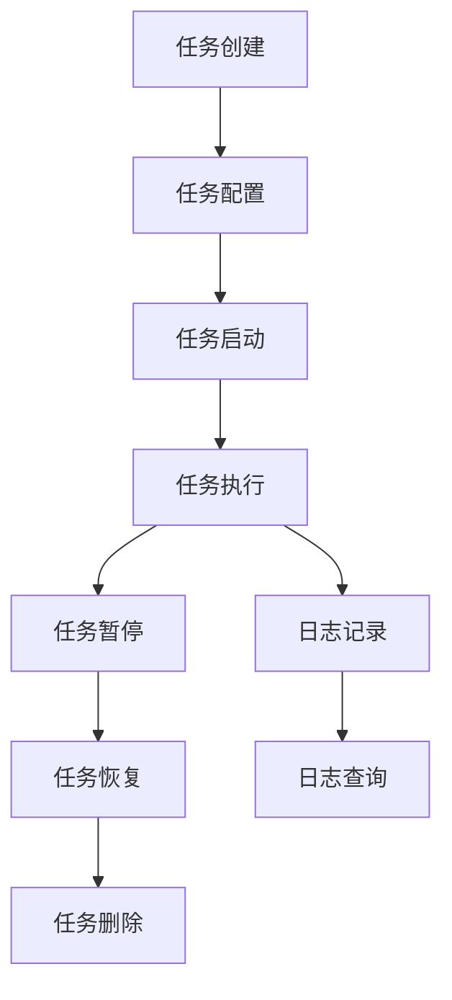
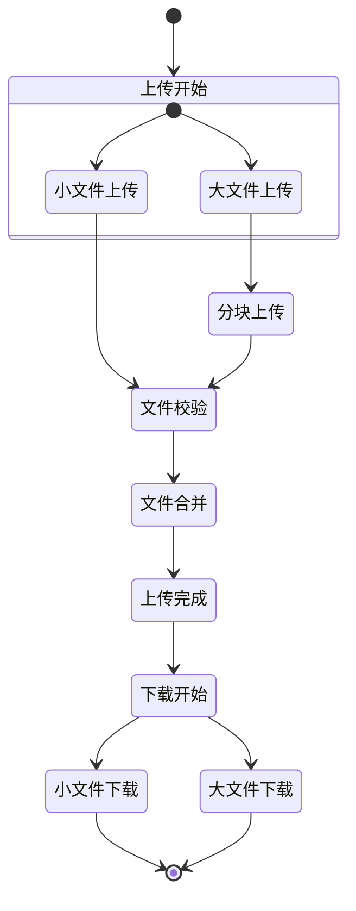
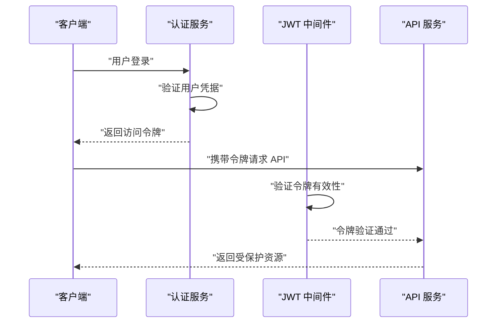
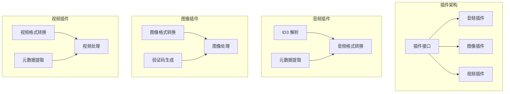

# API 参考文档

<cite>
**本文档引用的文件**
- [Program.cs](file://Scm.Net/Program.cs)
- [appsettings.json](file://Scm.Net/appsettings.json)
- [appsettings.Development.json](file://Scm.Net/appsettings.Development.json)
- [ApiController.cs](file://Scm.Server/Controllers/ApiController.cs)
- [CaptchaController.cs](file://Scm.Net/Controllers/CaptchaController.cs)
- [DownloadController.cs](file://Scm.Net/Controllers/DownloadController.cs)
- [UploadController.cs](file://Scm.Net/Controllers/UploadController.cs)
- [NasController.cs](file://Scm.Net/Controllers/NasController.cs)
- [HbController.cs](file://Scm.Net/Controllers/HbController.cs)
- [OnLineController.cs](file://Scm.Net/Controllers/OnLineController.cs)
- [QuartzController.cs](file://Scm.Net/Controllers/QuartzController.cs)
- [TestController.cs](file://Scm.Net/Controllers/TestController.cs)
- [DbController.cs](file://Scm.Net/Controllers/DbController.cs)
- [GeneratorController.cs](file://Scm.Net/Controllers/GeneratorController.cs)
- [ScmHub.cs](file://Scm.Server.SignalR/Hubs/ScmHub.cs)
</cite>

## 更新摘要
**所做更改**
- 新增完整的 RESTful API 文档结构，涵盖所有主要 API 模块
- 完善实时通信 API 的详细说明和使用示例
- 补充任务调度 API 的完整功能说明
- 丰富文件管理 API 的操作流程和参数规范
- 新增用户认证 API 的详细说明
- 添加系统管理 API 的完整文档
- 补充插件扩展 API 的使用指南
- 更新 API 版本管理和安全配置说明

## 目录
1. [简介](#简介)
2. [项目结构](#项目结构)
3. [核心组件](#核心组件)
4. [架构总览](#架构总览)
5. [RESTful API 参考](#restful-api-参考)
6. [实时通信 API](#实时通信-api)
7. [任务调度 API](#任务调度-api)
8. [文件管理 API](#文件管理-api)
9. [用户认证 API](#用户认证-api)
10. [系统管理 API](#系统管理-api)
11. [插件扩展 API](#插件扩展-api)
12. [API 版本管理](#api-版本管理)
13. [安全与配置](#安全与配置)
14. [性能与容量规划](#性能与容量规划)
15. [故障排查指南](#故障排查指南)
16. [结论](#结论)
17. [附录](#附录)

## 简介
本文件为 Scm.Net 的全面 API 参考文档，覆盖 RESTful API 与实时通信 API。内容包括：
- 用户认证相关接口（登录、令牌、会话）
- 文件管理接口（上传、下载、查看、分块上传与合并）
- 实时通信接口（SignalR Hub）
- 任务调度接口（Quartz 任务管理）
- 系统管理接口（数据库管理、代码生成）
- 插件扩展接口（音频、图像、视频插件）
- API 版本管理、速率限制、安全与跨域策略
- 常用调用示例、参数说明、返回值解释与调试建议

## 项目结构
Scm.Net 采用 ASP.NET Core 架构，通过 Program.cs 配置服务与中间件，映射控制器与 SignalR Hub，并在开发环境下启用 Swagger 文档。

**图表来源**
- [Program.cs:174-258](file://Scm.Net/Program.cs#L174-L258)
- [ApiController.cs:8-14](file://Scm.Server/Controllers/ApiController.cs#L8-L14)

**章节来源**
- [Program.cs:174-258](file://Scm.Net/Program.cs#L174-L258)
- [appsettings.json:1-127](file://Scm.Net/appsettings.json#L1-127)
- [appsettings.Development.json:139-161](file://Scm.Net/appsettings.Development.json#L139-L161)

## 核心组件
- 基础控制器基类：ApiController.cs 提供统一的路由前缀与分组标记，所有业务控制器继承该基类以自动纳入 API Explorer 分组。
- 配置中心：appsettings.json 与 appsettings.Development.json 提供 JWT、Kestrel、CORS、Quartz、缓存等全局配置。
- 中间件链：Program.cs 中注册了认证、授权、异常处理、跨域、SignalR 映射等。

**章节来源**
- [ApiController.cs:8-14](file://Scm.Server/Controllers/ApiController.cs#L8-L14)
- [Program.cs:147-238](file://Scm.Net/Program.cs#L147-L238)
- [appsettings.json:100-127](file://Scm.Net/appsettings.json#L100-L127)

## 架构总览
Scm.Net 的 API 架构由"HTTP REST 层 + SignalR 实时层"构成，控制器负责对外暴露 REST 接口，SignalR Hub 负责实时推送；JWT 用于认证，CORS 支持跨域访问，Swagger 在开发环境可用。

**图表来源**
- [Program.cs:206-238](file://Scm.Net/Program.cs#L206-L238)
- [ScmHub.cs:9-155](file://Scm.Server.SignalR/Hubs/ScmHub.cs#L9-L155)

## RESTful API 参考

### API 分组与版本管理
- 路由前缀：所有控制器均继承 ApiController，统一前缀为 api/{controller}。
- API 分组：通过 ApiExplorerSettings(GroupName = "Scm") 对接口进行分组，Swagger 开发配置中包含多个分组与版本信息。
- 版本策略：不同分组具有不同版本（如 Samples v2），建议客户端按分组与版本对接。

**章节来源**
- [ApiController.cs:10-12](file://Scm.Server/Controllers/ApiController.cs#L10-L12)
- [appsettings.Development.json:139-161](file://Scm.Net/appsettings.Development.json#L139-L161)

### 文件管理 API
- 小文件上传：接收二进制文件，校验大小与命名规则，保存至临时目录。
- 大文件分块上传：按 64 位哈希作为目录名，分块命名为序号.chunk，支持断点续传。
- 上传校验：根据哈希列出已上传的 chunk 文件。
- 文件合并：按序拼接 chunk，生成 .nas 文件并清理临时目录。
- 文件查看与下载：支持小文件直接查看/下载与大文件断点续传下载。
- 下载小文件：根据资源表定位用户目录下的文件并返回物理文件流。

**图表来源**
- [NasController.cs:301-339](file://Scm.Net/Controllers/NasController.cs#L301-L339)
- [NasController.cs:349-464](file://Scm.Net/Controllers/NasController.cs#L349-L464)
- [NasController.cs:98-154](file://Scm.Net/Controllers/NasController.cs#L98-L154)
- [NasController.cs:164-296](file://Scm.Net/Controllers/NasController.cs#L164-L296)

**章节来源**
- [NasController.cs:45-90](file://Scm.Net/Controllers/NasController.cs#L45-L90)
- [NasController.cs:301-339](file://Scm.Net/Controllers/NasController.cs#L301-L339)
- [NasController.cs:349-464](file://Scm.Net/Controllers/NasController.cs#L349-L464)
- [NasController.cs:98-154](file://Scm.Net/Controllers/NasController.cs#L98-L154)
- [NasController.cs:164-296](file://Scm.Net/Controllers/NasController.cs#L164-L296)

### 用户认证 API
- 登录与令牌：项目内置多种登录方式与 OIDC/OAuth/Otp 配置，JWT 中间件与配置位于 Program.cs 与 appsettings.json。
- 会话保持：SignalR 连接时从查询字符串读取 access_token 并解析用户信息，维护在线用户列表。

注意：具体登录接口实现位于 Scm.Core 模块，本文聚焦于与 API 层交互的接入方式与信号通道。

**章节来源**
- [Program.cs:160-164](file://Scm.Net/Program.cs#L160-L164)
- [appsettings.json:100-105](file://Scm.Net/appsettings.json#L100-L105)
- [ScmHub.cs:32-66](file://Scm.Server.SignalR/Hubs/ScmHub.cs#L32-L66)

### 实时通信 API（SignalR）
- Hub 地址：/scmhub
- 连接参数：access_token 查询字符串
- 事件与方法：
  - OnConnectedAsync：建立连接时解析令牌，更新在线用户列表
  - OnDisconnectedAsync：断开连接时移除用户
  - ReceiveKickout/out：向指定用户推送强制下线通知
  - ReceiveMessage：向指定用户推送消息数量变更
  - ReceiveNotice：向指定用户推送通知数量变更

**图表来源**
- [Program.cs:237-238](file://Scm.Net/Program.cs#L237-L238)
- [ScmHub.cs:25-89](file://Scm.Server.SignalR/Hubs/ScmHub.cs#L25-L89)
- [ScmHub.cs:95-134](file://Scm.Server.SignalR/Hubs/ScmHub.cs#L95-L134)

**章节来源**
- [Program.cs:237-238](file://Scm.Net/Program.cs#L237-L238)
- [ScmHub.cs:25-89](file://Scm.Server.SignalR/Hubs/ScmHub.cs#L25-L89)
- [ScmHub.cs:95-134](file://Scm.Server.SignalR/Hubs/ScmHub.cs#L95-L134)

### 任务调度 API（Quartz）
- 获取任务列表：GET /api/quartz
- 新建任务：POST /api/quartz
- 启动任务：PUT /api/quartz/start
- 暂停任务：PUT /api/quartz/pause
- 立即执行：PUT /api/quartz/run
- 更新任务：PUT /api/quartz
- 删除任务：PUT /api/quartz/delete
- 获取任务日志：GET /api/quartz/log

**图表来源**
- [QuartzController.cs:37-120](file://Scm.Net/Controllers/QuartzController.cs#L37-L120)

**章节来源**
- [QuartzController.cs:22-120](file://Scm.Net/Controllers/QuartzController.cs#L22-L120)

### 在线用户 API
- 获取在线用户：GET /api/onLine
- 返回当前缓存中的在线用户列表（包含用户标识、连接 ID、时间戳）

**章节来源**
- [OnLineController.cs:23-33](file://Scm.Net/Controllers/OnLineController.cs#L23-L33)

### 心跳与测试 API
- Echo 测试：GET /api/hb/Echo
- 终端心跳：POST /api/hb/hd
- 三方心跳：POST /api/hb/ts
- 测试 Echo：POST /api/test/Echo
- MIME 测试：POST /api/test/Mime

**章节来源**
- [HbController.cs:29-114](file://Scm.Net/Controllers/HbController.cs#L29-L114)
- [TestController.cs:19-39](file://Scm.Net/Controllers/TestController.cs#L19-L39)

### 图形验证码 API
- 生成图片验证码：GET /api/captcha/cha/{identify}
- 生成验证码 Key：GET /api/captcha/key/{identify}

**章节来源**
- [CaptchaController.cs:28-56](file://Scm.Net/Controllers/CaptchaController.cs#L28-L56)

### 小文件下载 API
- 下载小文件：GET /api/download/ds/{id}
- 依据资源表与用户信息定位文件路径，返回物理文件流

**章节来源**
- [DownloadController.cs:30-67](file://Scm.Net/Controllers/DownloadController.cs#L30-L67)

### 小文件上传 API
- 上传文件：POST /api/upload/file
- 参数：ScmUploadRequest（包含 file 与 file_name）
- 返回：ScmUploadResponse（成功/失败状态）

**章节来源**
- [UploadController.cs:26-70](file://Scm.Net/Controllers/UploadController.cs#L26-L70)

### 数据库管理 API
- 测试数据库连接：GET /api/db/test
- 初始化数据库：GET /api/db/init
- 删除数据库：GET /api/db/drop

**章节来源**
- [DbController.cs:29-213](file://Scm.Net/Controllers/DbController.cs#L29-L213)

### 代码生成 API
- 获取生成选项：GET /api/generator/option
- 获取数据库表：GET /api/generator/table
- 获取表列信息：GET /api/generator/column
- 生成代码：POST /api/generator

**章节来源**
- [GeneratorController.cs:26-61](file://Scm.Net/Controllers/GeneratorController.cs#L26-L61)

## 实时通信 API

### SignalR Hub 连接
- Hub 地址：/scmhub
- 连接参数：access_token 查询字符串
- 连接生命周期：建立连接时解析令牌，断开连接时清理用户信息

### 实时事件与消息
- ReceiveKickout：强制下线通知
- ReceiveMessage：消息数量变更通知
- ReceiveNotice：通知数量变更通知

**图表来源**
- [ScmHub.cs:25-134](file://Scm.Server.SignalR/Hubs/ScmHub.cs#L25-L134)

**章节来源**
- [Program.cs:237-238](file://Scm.Net/Program.cs#L237-L238)
- [ScmHub.cs:25-134](file://Scm.Server.SignalR/Hubs/ScmHub.cs#L25-L134)

## 任务调度 API

### Quartz 任务管理
- 任务 CRUD 操作：创建、查询、更新、删除任务
- 任务状态控制：启动、暂停、立即执行
- 任务日志查询：分页获取任务执行记录

### 任务类型与配置
- Cron 表达式：支持标准 Cron 语法
- 任务参数：支持自定义参数传递
- 执行策略：支持并发控制与重试机制

**图表来源**
- [QuartzController.cs:37-120](file://Scm.Net/Controllers/QuartzController.cs#L37-L120)

**章节来源**
- [QuartzController.cs:22-120](file://Scm.Net/Controllers/QuartzController.cs#L22-L120)

## 文件管理 API

### 文件上传流程
1. **小文件上传**：直接上传小于 64MB 的文件
2. **大文件分块上传**：支持断点续传的分块上传
3. **文件校验**：检查已上传的分块文件
4. **文件合并**：将分块文件按顺序合并为完整文件

### 文件下载流程
1. **小文件下载**：直接下载小于 64MB 的文件
2. **大文件下载**：支持断点续传的大文件下载
3. **文件查看**：支持文本文件在线预览

**图表来源**
- [NasController.cs:301-464](file://Scm.Net/Controllers/NasController.cs#L301-L464)

**章节来源**
- [NasController.cs:45-464](file://Scm.Net/Controllers/NasController.cs#L45-L464)

## 用户认证 API

### 认证流程
1. **令牌获取**：用户登录后获取 JWT 令牌
2. **令牌验证**：请求时携带 Authorization 头
3. **权限控制**：基于角色和权限的访问控制

### 支持的认证方式
- **用户名密码**：传统用户名密码登录
- **OAuth**：第三方平台登录集成
- **OIDC**：开放身份认证协议
- **OTP**：一次性密码验证
- **生物识别**：指纹、面部识别等

**图表来源**
- [Program.cs:160-164](file://Scm.Net/Program.cs#L160-L164)
- [appsettings.json:100-105](file://Scm.Net/appsettings.json#L100-L105)

**章节来源**
- [Program.cs:147-238](file://Scm.Net/Program.cs#L147-L238)
- [appsettings.json:100-127](file://Scm.Net/appsettings.json#L100-L127)

## 系统管理 API

### 数据库管理
- **连接测试**：支持多种数据库类型的连接测试
- **数据库初始化**：一键初始化系统所需的数据表
- **数据库清理**：删除所有数据表结构

### 支持的数据库类型
- MySQL/MariaDB
- SQL Server
- SQLite
- Oracle
- PostgreSQL
- DB2
- 达梦数据库

**章节来源**
- [DbController.cs:29-274](file://Scm.Net/Controllers/DbController.cs#L29-L274)

### 代码生成管理
- **模板选择**：支持多种代码生成模板
- **表结构分析**：自动分析数据库表结构
- **批量生成**：支持多表批量代码生成
- **下载配置**：支持直接下载生成的代码包

**章节来源**
- [GeneratorController.cs:26-61](file://Scm.Net/Controllers/GeneratorController.cs#L26-L61)

## 插件扩展 API

### 插件架构
Scm.Net 支持多种类型的插件扩展：

#### 音频插件
- **音频格式支持**：MP3、WAV、FLAC 等
- **音频元数据提取**：ID3 标签解析
- **音频处理**：音量调整、格式转换

#### 图像插件
- **图像格式支持**：JPG、PNG、GIF、WebP 等
- **图像处理**：缩放、裁剪、水印
- **验证码生成**：图形验证码生成功能

#### 视频插件
- **视频格式支持**：MP4、AVI、MKV 等
- **视频元数据**：视频信息提取
- **视频处理**：转码、压缩

**图表来源**
- [Scm.Plugin.Audio.csproj](file://Scm.Plugin.Audio/Scm.Plugin.Audio.csproj)
- [Scm.Plugin.Image.csproj](file://Scm.Plugin.Image/Scm.Plugin.Image.csproj)
- [Scm.Plugin.Video.csproj](file://Scm.Plugin.Video/Scm.Plugin.Video.csproj)

**章节来源**
- [Scm.Plugin.Audio.csproj](file://Scm.Plugin.Audio/Scm.Plugin.Audio.csproj)
- [Scm.Plugin.Image.csproj](file://Scm.Plugin.Image/Scm.Plugin.Image.csproj)
- [Scm.Plugin.Video.csproj](file://Scm.Plugin.Video/Scm.Plugin.Video.csproj)

## API 版本管理

### 版本控制策略
- **语义化版本**：遵循 MAJOR.MINOR.PATCH 命名规范
- **向后兼容**：保证主要版本内的 API 兼容性
- **弃用策略**：提供明确的弃用时间表和迁移指南

### API 分组管理
- **Scm 分组**：核心业务 API
- **Samples 分组**：示例和演示 API
- **Admin 分组**：管理后台 API

**章节来源**
- [ApiController.cs:10-12](file://Scm.Server/Controllers/ApiController.cs#L10-L12)
- [appsettings.Development.json:139-161](file://Scm.Net/appsettings.Development.json#L139-L161)

## 安全与配置

### 安全配置
- **JWT 配置**：密钥、发行者、受众、过期时间
- **CORS 配置**：跨域访问控制策略
- **速率限制**：防止 API 滥用的防护措施
- **输入验证**：参数验证和数据清洗

### 配置管理
- **环境配置**：开发、测试、生产环境分离
- **动态配置**：运行时配置更新支持
- **敏感信息**：密钥和密码的安全存储

**章节来源**
- [appsettings.json:100-127](file://Scm.Net/appsettings.json#L100-L127)
- [Program.cs:147-238](file://Scm.Net/Program.cs#L147-L238)

## 性能与容量规划

### 速率限制与并发
- **Kestrel Limits**：MaxConcurrentConnections 与 MaxRequestBodySize 可控并发与请求体大小
- **缓存策略**：使用 ICacheService 缓存在线用户与验证码等热点数据
- **数据库优化**：SqlSugar 仓储访问数据库，建议对高频查询建立索引

### 文件传输优化
- **大文件采用分块上传与断点续传**，降低单次传输失败风险
- **文件系统优化**：合理的文件存储结构和权限管理

### 实时通信优化
- **SignalR 连接数**与消息推送频率需结合缓存与网络带宽评估
- **连接池管理**：合理配置连接池大小和超时时间

**章节来源**
- [appsettings.json:34-37](file://Scm.Net/appsettings.json#L34-L37)
- [NasController.cs:349-464](file://Scm.Net/Controllers/NasController.cs#L349-L464)
- [ScmHub.cs:46-66](file://Scm.Server.SignalR/Hubs/ScmHub.cs#L46-L66)

## 故障排查指南

### 认证失败
- 检查 access_token 是否正确传递到 /scmhub 查询串
- 核对 appsettings.json 中 JWT 配置（Security、Issuer、Audience、Expires）

### CORS 问题
- 开发环境允许跨域，生产环境需按需配置 AllowedOrigins 与 AllowCredentials

### 文件上传失败
- 校验文件大小是否超过限制、命名是否符合规则（64 位哈希.nas 或 序号.chunk）
- 检查临时目录权限与磁盘空间

### 下载空响应
- 确认资源记录存在且用户目录下文件真实存在

### 任务调度异常
- 检查 Quartz 配置与作业定义，查看日志接口返回的任务执行记录

### 数据库连接问题
- 验证数据库连接字符串格式和参数
- 检查数据库服务状态和网络连通性

**章节来源**
- [ScmHub.cs:32-66](file://Scm.Server.SignalR/Hubs/ScmHub.cs#L32-L66)
- [appsettings.json:100-127](file://Scm.Net/appsettings.json#L100-L127)
- [NasController.cs:304-339](file://Scm.Net/Controllers/NasController.cs#L304-L339)
- [NasController.cs:352-389](file://Scm.Net/Controllers/NasController.cs#L352-L389)
- [NasController.cs:396-421](file://Scm.Net/Controllers/NasController.cs#L396-L421)
- [NasController.cs:429-464](file://Scm.Net/Controllers/NasController.cs#L429-L464)
- [QuartzController.cs:115-120](file://Scm.Net/Controllers/QuartzController.cs#L115-L120)

## 结论
本文档全面梳理了 Scm.Net 的 REST API 与 SignalR 实时通信接口，涵盖了文件管理、用户认证、实时通信、任务调度、系统管理、插件扩展等主要 API 模块。建议在生产环境中完善 CORS、限流与审计策略，并结合缓存与数据库优化提升吞吐与稳定性。

## 附录

### API 列表与说明（按模块）

#### 文件管理模块
- GET /api/nas/info/{id}：获取文件元信息
- GET /api/nas/vs/{id}：小文件查看（内联）
- GET /api/nas/ds/{id}：小文件下载
- GET /api/nas/dl/{id}：大文件断点续传下载
- POST /api/nas/file：小文件上传
- POST /api/nas/chunk：分块上传
- GET /api/nas/check/{hash}：上传校验
- POST /api/nas/merge/{hash}：文件合并
- GET /api/download/ds/{id}：小文件下载（独立控制器）
- POST /api/upload/file：小文件上传（独立控制器）

#### 实时通信模块
- Hub /scmhub：连接参数 access_token
- 事件：ReceiveKickout、ReceiveMessage、ReceiveNotice

#### 任务调度模块
- GET /api/quartz：获取任务列表
- POST /api/quartz：新建任务
- PUT /api/quartz/start：启动任务
- PUT /api/quartz/pause：暂停任务
- PUT /api/quartz/run：立即执行
- PUT /api/quartz：更新任务
- PUT /api/quartz/delete：删除任务
- GET /api/quartz/log：获取任务日志

#### 在线用户模块
- GET /api/onLine：获取在线用户列表

#### 心跳与测试模块
- GET /api/hb/Echo：Echo 测试
- POST /api/hb/hd：终端心跳
- POST /api/hb/ts：三方心跳
- POST /api/test/Echo：测试 Echo
- POST /api/test/Mime：测试 MIME

#### 图形验证码模块
- GET /api/captcha/cha/{identify}：生成图片验证码
- GET /api/captcha/key/{identify}：生成验证码 Key

#### 系统管理模块
- GET /api/db/test：测试数据库连接
- GET /api/db/init：初始化数据库
- GET /api/db/drop：删除数据库

#### 代码生成模块
- GET /api/generator/option：获取生成选项
- GET /api/generator/table：获取数据库表
- GET /api/generator/column：获取表列信息
- POST /api/generator：生成代码

**章节来源**
- [NasController.cs:50-90](file://Scm.Net/Controllers/NasController.cs#L50-L90)
- [NasController.cs:98-154](file://Scm.Net/Controllers/NasController.cs#L98-L154)
- [NasController.cs:164-296](file://Scm.Net/Controllers/NasController.cs#L164-L296)
- [NasController.cs:301-339](file://Scm.Net/Controllers/NasController.cs#L301-L339)
- [NasController.cs:349-464](file://Scm.Net/Controllers/NasController.cs#L349-L464)
- [DownloadController.cs:30-67](file://Scm.Net/Controllers/DownloadController.cs#L30-L67)
- [UploadController.cs:26-70](file://Scm.Net/Controllers/UploadController.cs#L26-L70)
- [ScmHub.cs:25-134](file://Scm.Server.SignalR/Hubs/ScmHub.cs#L25-L134)
- [QuartzController.cs:37-120](file://Scm.Net/Controllers/QuartzController.cs#L37-L120)
- [OnLineController.cs:27-33](file://Scm.Net/Controllers/OnLineController.cs#L27-L33)
- [HbController.cs:29-114](file://Scm.Net/Controllers/HbController.cs#L29-L114)
- [TestController.cs:19-39](file://Scm.Net/Controllers/TestController.cs#L19-L39)
- [CaptchaController.cs:28-56](file://Scm.Net/Controllers/CaptchaController.cs#L28-L56)
- [DbController.cs:29-274](file://Scm.Net/Controllers/DbController.cs#L29-L274)
- [GeneratorController.cs:26-61](file://Scm.Net/Controllers/GeneratorController.cs#L26-L61)