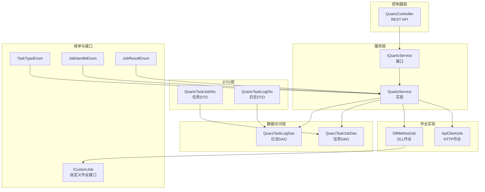
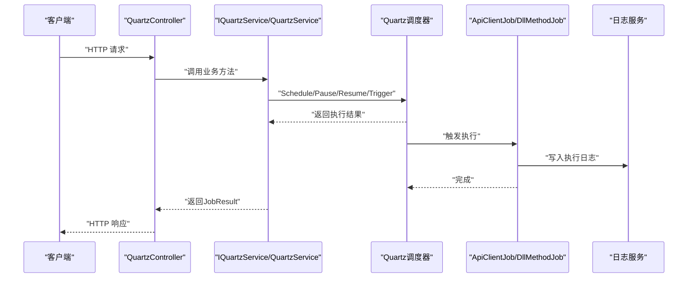
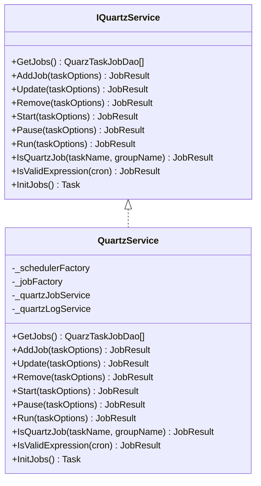
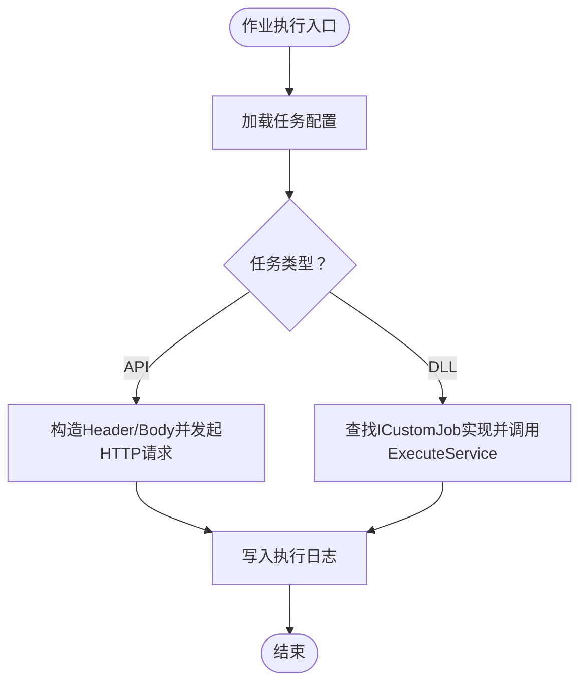
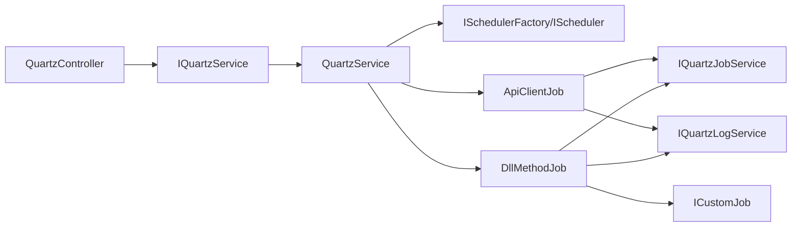

# 任务调度 API

<cite>
**本文引用的文件**
- [QuartzController.cs](file://Scm.Net/Controllers/QuartzController.cs)
- [IQuartzService.cs](file://Scm.Server.Quartz/IQuartzService.cs)
- [QuartzService.cs](file://Scm.Server.Quartz/QuartzService.cs)
- [QuarzTaskJobDao.cs](file://Scm.Server.Quartz/Dao/QuarzTaskJobDao.cs)
- [QuarzTaskLogDao.cs](file://Scm.Server.Quartz/Dao/QuarzTaskLogDao.cs)
- [QuartzTaskJobDto.cs](file://Scm.Server.Quartz/Dto/QuartzTaskJobDto.cs)
- [QuartzTaskLogDto.cs](file://Scm.Server.Quartz/Dto/QuartzTaskLogDto.cs)
- [TaskTypeEnum.cs](file://Scm.Server.Quartz/Enums/TaskTypeEnum.cs)
- [JobHandleEnum.cs](file://Scm.Server.Quartz/Enums/JobHandleEnum.cs)
- [JobResultEnum.cs](file://Scm.Server.Quartz/Enums/JobResultEnum.cs)
- [IClientJob.cs](file://Scm.Server.Quartz/ICustomJob.cs)
- [ApiClientJob.cs](file://Scm.Server.Quartz/Jobs/ApiClientJob.cs)
- [DllMethodJob.cs](file://Scm.Server.Quartz/Jobs/DllMethodJob.cs)
</cite>

## 目录
1. [简介](#简介)
2. [项目结构](#项目结构)
3. [核心组件](#核心组件)
4. [架构总览](#架构总览)
5. [详细组件分析](#详细组件分析)
6. [依赖关系分析](#依赖关系分析)
7. [性能考虑](#性能考虑)
8. [故障排查指南](#故障排查指南)
9. [结论](#结论)
10. [附录：API 规范](#附录api-规范)

## 简介
本文件为基于 Quartz 的任务调度 API 全面文档，覆盖任务的创建、修改、删除、启动/暂停、立即执行、监控与日志查询等能力。文档同时说明两类任务类型（API 客户端任务、DLL 方法任务）的配置要点，Cron 表达式校验、任务状态管理、执行历史记录的 API 使用方式，并给出参数传递、错误处理与重试机制的实现思路与最佳实践。

## 项目结构
围绕任务调度的关键模块分布于以下位置：
- 控制器层：提供 REST API，负责接收请求、调用服务层并返回响应
- 服务层：封装 Quartz 调度器操作，统一任务生命周期管理
- 数据访问层：定义任务与日志的数据模型（DAO）
- DTO 层：对外暴露的传输对象
- 作业实现：具体执行逻辑（HTTP 请求与本地 DLL 方法调用）
- 枚举与接口：任务类型、状态、结果枚举以及自定义作业接口

图表来源
- [QuartzController.cs:10-122](file://Scm.Net/Controllers/QuartzController.cs#L10-L122)
- [IQuartzService.cs:8-78](file://Scm.Server.Quartz/IQuartzService.cs#L8-L78)
- [QuartzService.cs:13-550](file://Scm.Server.Quartz/QuartzService.cs#L13-L550)
- [QuarzTaskJobDao.cs:14-120](file://Scm.Server.Quartz/Dao/QuarzTaskJobDao.cs#L14-L120)
- [QuarzTaskLogDao.cs:13-53](file://Scm.Server.Quartz/Dao/QuarzTaskLogDao.cs#L13-L53)
- [QuartzTaskJobDto.cs:6-83](file://Scm.Server.Quartz/Dto/QuartzTaskJobDto.cs#L6-L83)
- [QuartzTaskLogDto.cs:6-40](file://Scm.Server.Quartz/Dto/QuartzTaskLogDto.cs#L6-L40)
- [ApiClientJob.cs:14-102](file://Scm.Server.Quartz/Jobs/ApiClientJob.cs#L14-L102)
- [DllMethodJob.cs:14-94](file://Scm.Server.Quartz/Jobs/DllMethodJob.cs#L14-L94)
- [TaskTypeEnum.cs:3-16](file://Scm.Server.Quartz/Enums/TaskTypeEnum.cs#L3-L16)
- [JobHandleEnum.cs:5-18](file://Scm.Server.Quartz/Enums/JobHandleEnum.cs#L5-L18)
- [JobResultEnum.cs:3-16](file://Scm.Server.Quartz/Enums/JobResultEnum.cs#L3-L16)
- [IClientJob.cs:6-11](file://Scm.Server.Quartz/ICustomJob.cs#L6-L11)

章节来源
- [QuartzController.cs:10-122](file://Scm.Net/Controllers/QuartzController.cs#L10-L122)
- [IQuartzService.cs:8-78](file://Scm.Server.Quartz/IQuartzService.cs#L8-L78)
- [QuartzService.cs:13-550](file://Scm.Server.Quartz/QuartzService.cs#L13-L550)

## 核心组件
- QuartzController：提供任务 CRUD、启停、立即执行、查询日志等 HTTP 接口
- IQuartzService/QuartzService：封装 Quartz 调度器的增删改查、启停、立即执行、初始化等业务逻辑
- QuarzTaskJobDao/QuarzTaskLogDao：任务与执行日志的持久化模型
- QuartzTaskJobDto/QuartzTaskLogDto：对外传输对象
- ApiClientJob/DllMethodJob：两类任务的具体执行实现
- ICustomJob：本地 DLL 任务的扩展接口
- 枚举：TaskTypeEnum、JobHandleEnum、JobResultEnum

章节来源
- [QuartzController.cs:10-122](file://Scm.Net/Controllers/QuartzController.cs#L10-L122)
- [IQuartzService.cs:8-78](file://Scm.Server.Quartz/IQuartzService.cs#L8-L78)
- [QuartzService.cs:13-550](file://Scm.Server.Quartz/QuartzService.cs#L13-L550)
- [QuarzTaskJobDao.cs:14-120](file://Scm.Server.Quartz/Dao/QuarzTaskJobDao.cs#L14-L120)
- [QuarzTaskLogDao.cs:13-53](file://Scm.Server.Quartz/Dao/QuarzTaskLogDao.cs#L13-L53)
- [QuartzTaskJobDto.cs:6-83](file://Scm.Server.Quartz/Dto/QuartzTaskJobDto.cs#L6-L83)
- [QuartzTaskLogDto.cs:6-40](file://Scm.Server.Quartz/Dto/QuartzTaskLogDto.cs#L6-L40)
- [ApiClientJob.cs:14-102](file://Scm.Server.Quartz/Jobs/ApiClientJob.cs#L14-L102)
- [DllMethodJob.cs:14-94](file://Scm.Server.Quartz/Jobs/DllMethodJob.cs#L14-L94)
- [IClientJob.cs:6-11](file://Scm.Server.Quartz/ICustomJob.cs#L6-L11)
- [TaskTypeEnum.cs:3-16](file://Scm.Server.Quartz/Enums/TaskTypeEnum.cs#L3-L16)
- [JobHandleEnum.cs:5-18](file://Scm.Server.Quartz/Enums/JobHandleEnum.cs#L5-L18)
- [JobResultEnum.cs:3-16](file://Scm.Server.Quartz/Enums/JobResultEnum.cs#L3-L16)

## 架构总览
下图展示从控制器到服务、再到作业执行与日志记录的整体流程。

图表来源
- [QuartzController.cs:37-120](file://Scm.Net/Controllers/QuartzController.cs#L37-L120)
- [IQuartzService.cs:14-78](file://Scm.Server.Quartz/IQuartzService.cs#L14-L78)
- [QuartzService.cs:98-152](file://Scm.Server.Quartz/QuartzService.cs#L98-L152)
- [ApiClientJob.cs:27-95](file://Scm.Server.Quartz/Jobs/ApiClientJob.cs#L27-L95)
- [DllMethodJob.cs:33-87](file://Scm.Server.Quartz/Jobs/DllMethodJob.cs#L33-L87)

## 详细组件分析

### 控制器：QuartzController
- 提供任务列表查询、新增、修改、删除、启动、暂停、立即执行、执行日志查询等接口
- 返回统一的响应结构（由基类提供）

关键接口
- GET /api/quartz：获取任务列表
- POST /api/quartz：新增任务（默认状态为暂停）
- PUT /api/quartz/start：启动任务
- PUT /api/quartz/pause：暂停任务
- PUT /api/quartz/run：立即执行一次
- PUT /api/quartz：修改任务
- PUT /api/quartz/delete：删除任务
- GET /api/quartz/log：按任务名与分组查询执行日志

章节来源
- [QuartzController.cs:37-120](file://Scm.Net/Controllers/QuartzController.cs#L37-L120)

### 服务层：IQuartzService 与 QuartzService
职责
- 任务生命周期管理：新增、修改、删除、启动、暂停、立即执行
- Cron 表达式校验
- 任务初始化加载与调度器启动
- 与 DAO 层交互，维护任务状态与日志

关键方法
- GetJobs：合并 Quartz 调度器与数据库中的任务信息，补充最近运行时间
- AddJob/Update/Remove/Start/Pause/Run/IsQuartzJob/IsValidExpression/InitJobs

图表来源
- [IQuartzService.cs:8-78](file://Scm.Server.Quartz/IQuartzService.cs#L8-L78)
- [QuartzService.cs:13-550](file://Scm.Server.Quartz/QuartzService.cs#L13-L550)

章节来源
- [IQuartzService.cs:8-78](file://Scm.Server.Quartz/IQuartzService.cs#L8-L78)
- [QuartzService.cs:36-550](file://Scm.Server.Quartz/QuartzService.cs#L36-L550)

### 数据模型：QuarzTaskJobDao 与 QuarzTaskLogDao
- 任务模型包含任务类型、分组、Cron 表达式、状态、描述、API/DLL 参数等
- 日志模型包含任务名、分组、开始/结束时间、结果与备注

字段要点
- 任务模型：types、names、group、cron、last_time、handle、result、remark、api_*、dll_* 等
- 日志模型：task、group、begin_time、end_time、result、remark

章节来源
- [QuarzTaskJobDao.cs:14-120](file://Scm.Server.Quartz/Dao/QuarzTaskJobDao.cs#L14-L120)
- [QuarzTaskLogDao.cs:13-53](file://Scm.Server.Quartz/Dao/QuarzTaskLogDao.cs#L13-L53)
- [QuartzTaskJobDto.cs:6-83](file://Scm.Server.Quartz/Dto/QuartzTaskJobDto.cs#L6-L83)
- [QuartzTaskLogDto.cs:6-40](file://Scm.Server.Quartz/Dto/QuartzTaskLogDto.cs#L6-L40)

### 作业实现：ApiClientJob 与 DllMethodJob
- ApiClientJob：根据任务配置发起 HTTP 请求（GET/POST），并将响应或异常写入日志
- DllMethodJob：通过 IServiceProvider 查找 ICustomJob 实现，调用 ExecuteService 并记录日志

图表来源
- [ApiClientJob.cs:27-95](file://Scm.Server.Quartz/Jobs/ApiClientJob.cs#L27-L95)
- [DllMethodJob.cs:33-87](file://Scm.Server.Quartz/Jobs/DllMethodJob.cs#L33-L87)

章节来源
- [ApiClientJob.cs:27-95](file://Scm.Server.Quartz/Jobs/ApiClientJob.cs#L27-L95)
- [DllMethodJob.cs:33-87](file://Scm.Server.Quartz/Jobs/DllMethodJob.cs#L33-L87)
- [IClientJob.cs:6-11](file://Scm.Server.Quartz/ICustomJob.cs#L6-L11)

### Cron 表达式校验与任务状态
- 服务层提供 IsValidExpression 对 Cron 表达式进行有效性校验
- 任务状态使用 JobHandleEnum（Init、Paused、Stoped、Running）管理

章节来源
- [QuartzService.cs:82-96](file://Scm.Server.Quartz/QuartzService.cs#L82-L96)
- [JobHandleEnum.cs:5-18](file://Scm.Server.Quartz/Enums/JobHandleEnum.cs#L5-L18)

### 任务参数传递与配置
- API 类型：api_uri、api_method、api_headers、api_parameter
- DLL 类型：dll_uri（完整类型名）、dll_method、dll_parameter
- DTO 中也包含相应字段，便于前后端交互

章节来源
- [QuarzTaskJobDao.cs:66-117](file://Scm.Server.Quartz/Dao/QuarzTaskJobDao.cs#L66-L117)
- [QuartzTaskJobDto.cs:46-81](file://Scm.Server.Quartz/Dto/QuartzTaskJobDto.cs#L46-L81)

### 执行历史记录与查询
- 通过 QuartzController 的 GET /api/quartz/log 接口查询指定任务的执行日志
- 日志模型包含任务名、分组、起止时间、结果与备注

章节来源
- [QuartzController.cs:115-120](file://Scm.Net/Controllers/QuartzController.cs#L115-L120)
- [QuarzTaskLogDao.cs:13-53](file://Scm.Server.Quartz/Dao/QuarzTaskLogDao.cs#L13-L53)
- [QuartzTaskLogDto.cs:6-40](file://Scm.Server.Quartz/Dto/QuartzTaskLogDto.cs#L6-L40)

## 依赖关系分析
- 控制器依赖 IQuartzService；服务层依赖 Quartz 调度器工厂与作业工厂
- 作业实现依赖 IQuartzJobService 与 IQuartzLogService 获取任务配置与写入日志
- 本地 DLL 任务依赖 IServiceProvider 解析 ICustomJob 实现

图表来源
- [QuartzController.cs:16-20](file://Scm.Net/Controllers/QuartzController.cs#L16-L20)
- [IQuartzService.cs:1-78](file://Scm.Server.Quartz/IQuartzService.cs#L1-L78)
- [QuartzService.cs:15-29](file://Scm.Server.Quartz/QuartzService.cs#L15-L29)
- [ApiClientJob.cs:16-25](file://Scm.Server.Quartz/Jobs/ApiClientJob.cs#L16-L25)
- [DllMethodJob.cs:16-31](file://Scm.Server.Quartz/Jobs/DllMethodJob.cs#L16-L31)
- [IClientJob.cs:6-11](file://Scm.Server.Quartz/ICustomJob.cs#L6-L11)

章节来源
- [QuartzController.cs:16-20](file://Scm.Net/Controllers/QuartzController.cs#L16-L20)
- [QuartzService.cs:15-29](file://Scm.Server.Quartz/QuartzService.cs#L15-L29)

## 性能考虑
- 任务初始化：仅在 handle=Running 时调度并启动调度器，避免无谓占用
- Cron 校验：在新增/更新前验证表达式，减少无效任务进入调度器
- 日志写入：作业执行后异步写入日志，避免阻塞调度线程
- 作业并发：Quartz 默认并发策略需结合业务场景评估，必要时通过触发器或作业属性控制
- 数据库压力：批量查询与写入日志时注意索引与分页，避免长事务

## 故障排查指南
常见问题与定位建议
- 任务未启动：检查 handle 字段与调度器状态；确认 Cron 表达式有效
- API 任务失败：核对 api_uri、api_method、api_headers、api_parameter；查看日志 remark
- DLL 任务失败：确认 dll_uri 对应类型已注册为 ICustomJob；核对 dll_parameter
- 重复任务：新增时若同名同组任务已存在会返回失败消息
- 查询日志：使用 GET /api/quartz/log 指定 taskName 与 groupName，结合分页参数

章节来源
- [QuartzService.cs:160-250](file://Scm.Server.Quartz/QuartzService.cs#L160-L250)
- [ApiClientJob.cs:48-95](file://Scm.Server.Quartz/Jobs/ApiClientJob.cs#L48-L95)
- [DllMethodJob.cs:51-87](file://Scm.Server.Quartz/Jobs/DllMethodJob.cs#L51-L87)
- [QuartzController.cs:115-120](file://Scm.Net/Controllers/QuartzController.cs#L115-L120)

## 结论
该任务调度 API 基于 Quartz 实现，提供了完整的任务生命周期管理与监控能力。通过统一的控制器接口与服务层抽象，支持 API 与本地 DLL 两类任务类型，并内置 Cron 表达式校验与执行日志查询。建议在生产环境中配合完善的监控与告警体系，合理设置并发与重试策略，确保任务稳定可靠运行。

## 附录：API 规范

### 通用说明
- 基础路径：/api/quartz
- 认证：控制器继承自 ApiController，具体认证策略以部署环境为准
- 响应格式：统一由基类提供，包含状态码与数据结构

### 任务管理
- 获取任务列表
  - 方法：GET
  - 路径：/api/quartz
  - 响应：任务列表（含最近运行时间等）
- 新增任务
  - 方法：POST
  - 路径：/api/quartz
  - 请求体：QuarzTaskJobDao 或 QuartzTaskJobDto
  - 响应：JobResult（默认状态为暂停）
- 修改任务
  - 方法：PUT
  - 路径：/api/quartz
  - 请求体：QuarzTaskJobDao 或 QuartzTaskJobDto
  - 响应：JobResult
- 删除任务
  - 方法：PUT /api/quartz/delete
  - 路径：/api/quartz/delete
  - 请求体：QuarzTaskJobDao 或 QuartzTaskJobDto
  - 响应：JobResult
- 启动任务
  - 方法：PUT /api/quartz/start
  - 路径：/api/quartz/start
  - 请求体：QuarzTaskJobDao 或 QuartzTaskJobDto
  - 响应：JobResult
- 暂停任务
  - 方法：PUT /api/quartz/pause
  - 路径：/api/quartz/pause
  - 请求体：QuarzTaskJobDao 或 QuartzTaskJobDto
  - 响应：JobResult
- 立即执行一次
  - 方法：PUT /api/quartz/run
  - 路径：/api/quartz/run
  - 请求体：QuarzTaskJobDao 或 QuartzTaskJobDto
  - 响应：JobResult

### 执行日志查询
- 获取任务执行记录
  - 方法：GET /api/quartz/log
  - 查询参数：taskName、groupName、current、size
  - 响应：日志列表（分页）

章节来源
- [QuartzController.cs:37-120](file://Scm.Net/Controllers/QuartzController.cs#L37-L120)
- [QuarzTaskJobDao.cs:14-120](file://Scm.Server.Quartz/Dao/QuarzTaskJobDao.cs#L14-L120)
- [QuartzTaskJobDto.cs:6-83](file://Scm.Server.Quartz/Dto/QuartzTaskJobDto.cs#L6-L83)
- [QuarzTaskLogDao.cs:13-53](file://Scm.Server.Quartz/Dao/QuarzTaskLogDao.cs#L13-L53)
- [QuartzTaskLogDto.cs:6-40](file://Scm.Server.Quartz/Dto/QuartzTaskLogDto.cs#L6-L40)