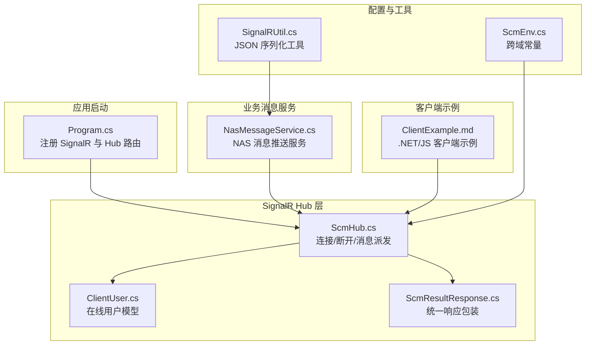
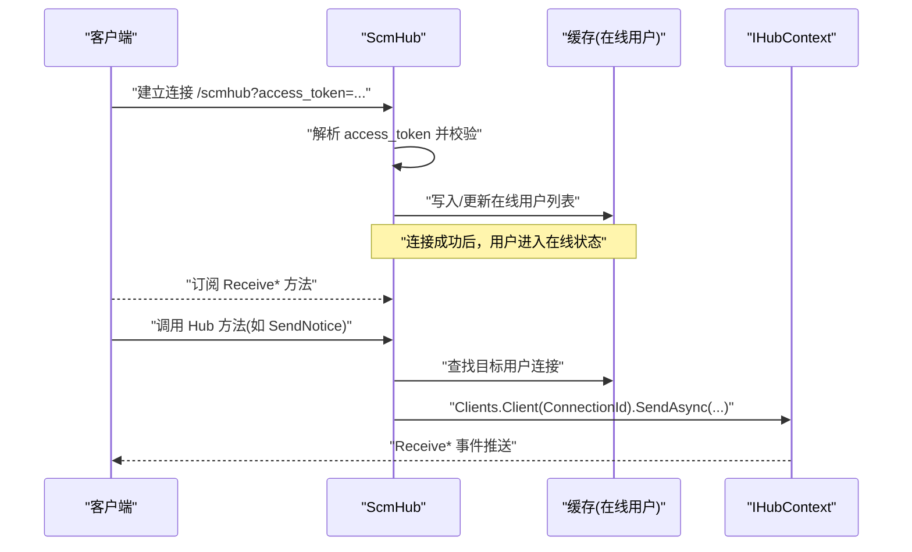
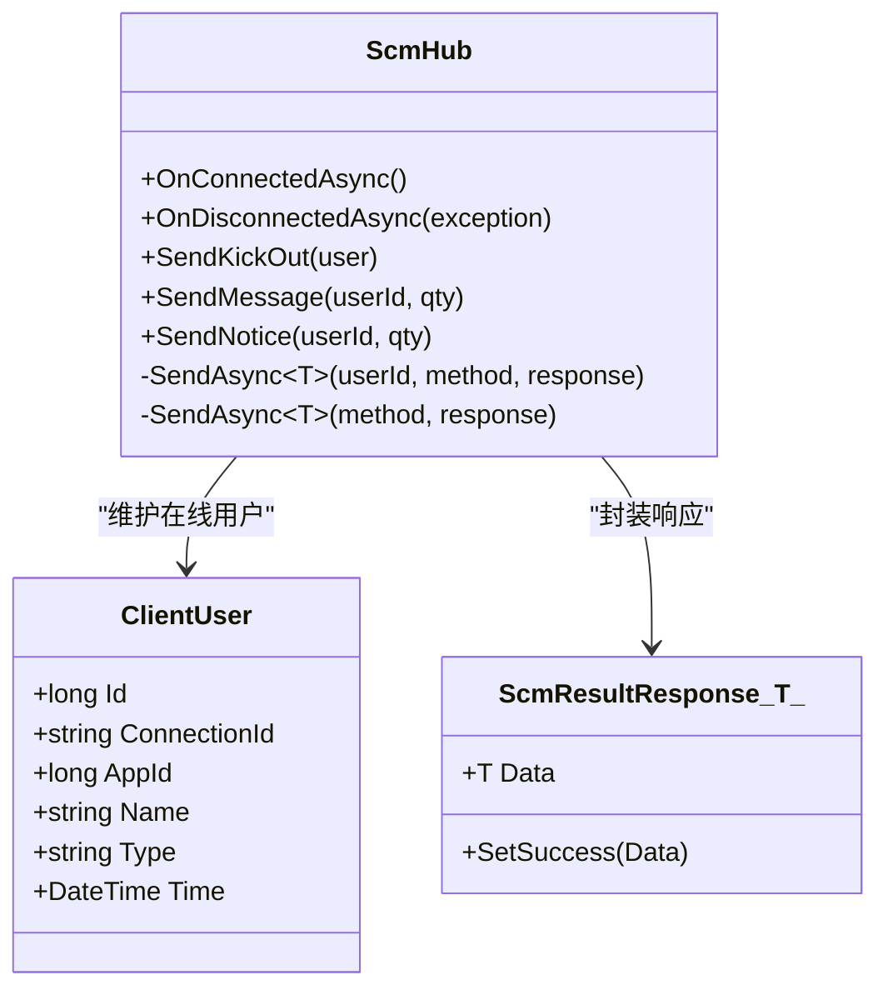
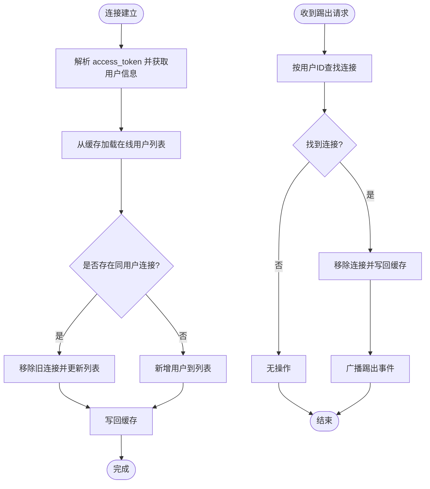
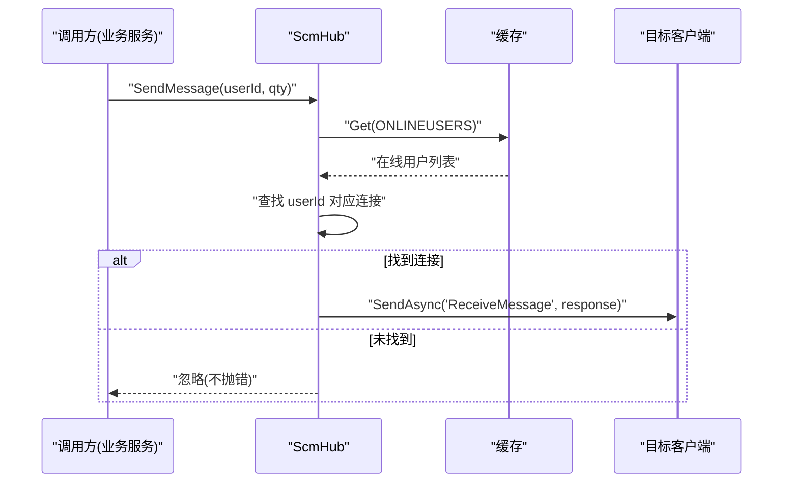
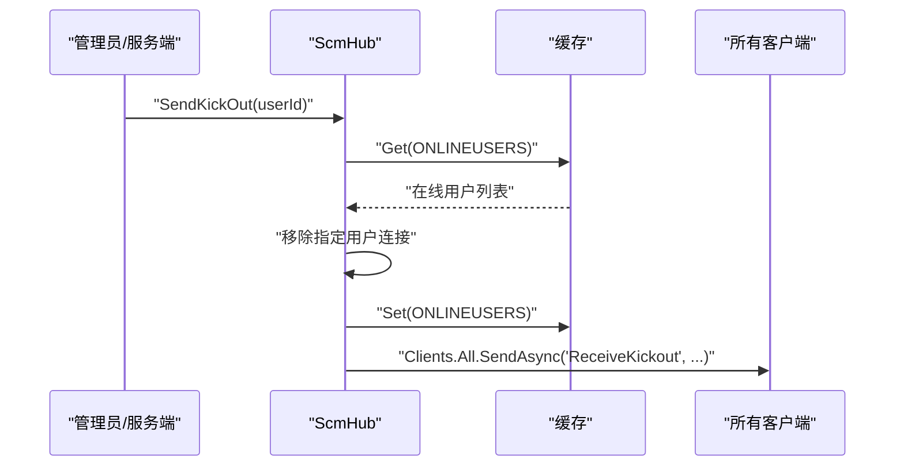
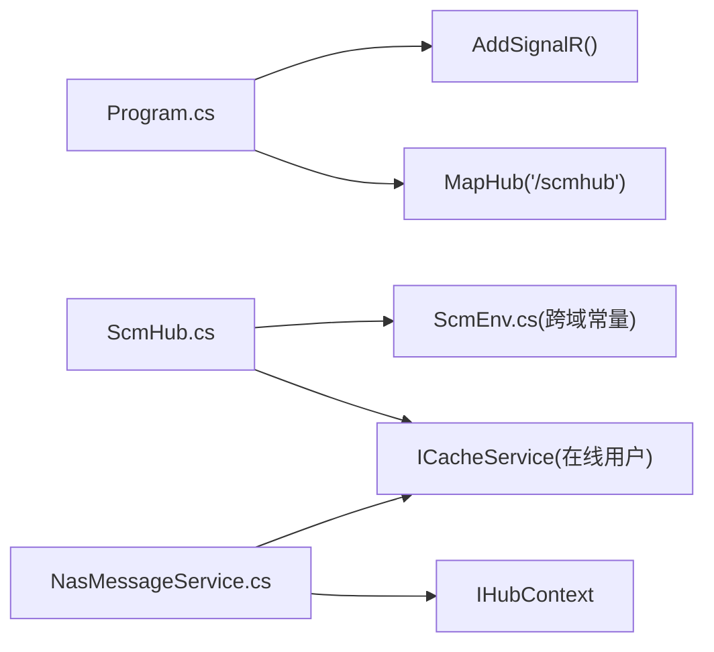

# 实时通信 API

<cite>
**本文引用的文件**
- [ScmHub.cs](file://Scm.Server.SignalR/Hubs/ScmHub.cs)
- [ClientUser.cs](file://Scm.Server.SignalR/Hubs/ClientUser.cs)
- [ScmResultResponse.cs](file://Scm.Server.SignalR/Hubs/ScmResultResponse.cs)
- [NasMessageService.cs](file://Nas.Server/Msg/NasMessageService.cs)
- [Program.cs](file://Scm.Net/Program.cs)
- [ScmEnv.cs](file://Scm.Common/ScmEnv.cs)
- [ClientExample.md](file://Nas.Server/Msg/ClientExample.md)
- [SignalRUtil.cs](file://Scm.Core/Msg/SignalRUtil.cs)
</cite>

## 目录
1. [简介](#简介)
2. [项目结构](#项目结构)
3. [核心组件](#核心组件)
4. [架构总览](#架构总览)
5. [详细组件分析](#详细组件分析)
6. [依赖关系分析](#依赖关系分析)
7. [性能与扩展性](#性能与扩展性)
8. [故障排查指南](#故障排查指南)
9. [结论](#结论)
10. [附录：客户端集成示例](#附录客户端集成示例)

## 简介
本文件面向基于 SignalR 的实时通信 API，覆盖连接建立、消息发送、用户状态管理、房间管理（概念性）、消息路由与会话跟踪、在线用户统计、踢出机制、广播与点对点推送等能力。文档同时提供 .NET、JavaScript、移动端的客户端集成要点，并给出关键流程图与时序图帮助理解。

## 项目结构
围绕实时通信的关键代码分布在如下模块：
- SignalR Hub 层：负责连接生命周期、用户会话跟踪、消息派发
- 业务消息服务层：封装向特定用户或全体用户的推送逻辑
- 应用启动层：注册 SignalR 服务、映射 Hub 路由
- 工具与配置：跨域策略、响应包装模型、序列化工具

图表来源
- [Program.cs:166-238](file://Scm.Net/Program.cs#L166-L238)
- [ScmHub.cs:10-155](file://Scm.Server.SignalR/Hubs/ScmHub.cs#L10-L155)
- [ClientUser.cs:6-38](file://Scm.Server.SignalR/Hubs/ClientUser.cs#L6-L38)
- [ScmResultResponse.cs:5-16](file://Scm.Server.SignalR/Hubs/ScmResultResponse.cs#L5-L16)
- [NasMessageService.cs:9-98](file://Nas.Server/Msg/NasMessageService.cs#L9-L98)
- [ScmEnv.cs:28-30](file://Scm.Common/ScmEnv.cs#L28-L30)
- [ClientExample.md:1-79](file://Nas.Server/Msg/ClientExample.md#L1-L79)
- [SignalRUtil.cs:10-35](file://Scm.Core/Msg/SignalRUtil.cs#L10-L35)

章节来源
- [Program.cs:166-238](file://Scm.Net/Program.cs#L166-L238)
- [ScmHub.cs:10-155](file://Scm.Server.SignalR/Hubs/ScmHub.cs#L10-L155)
- [NasMessageService.cs:9-98](file://Nas.Server/Msg/NasMessageService.cs#L9-L98)
- [ScmEnv.cs:28-30](file://Scm.Common/ScmEnv.cs#L28-L30)
- [ClientExample.md:1-79](file://Nas.Server/Msg/ClientExample.md#L1-L79)
- [SignalRUtil.cs:10-35](file://Scm.Core/Msg/SignalRUtil.cs#L10-L35)

## 核心组件
- ScmHub：SignalR Hub，负责连接建立、断开、用户会话跟踪、消息派发（点对点/广播）
- ClientUser：在线用户会话模型，包含用户标识、连接标识、时间戳等
- ScmResultResponse<T>：统一响应包装，承载数据与状态码
- NasMessageService：业务消息服务，封装向指定用户或全体用户的推送
- Program：注册 SignalR 服务并在路由 /scmhub 上暴露 Hub
- ScmEnv：跨域策略常量
- ClientExample：客户端示例（.NET/JS），演示连接与订阅

章节来源
- [ScmHub.cs:10-155](file://Scm.Server.SignalR/Hubs/ScmHub.cs#L10-L155)
- [ClientUser.cs:6-38](file://Scm.Server.SignalR/Hubs/ClientUser.cs#L6-L38)
- [ScmResultResponse.cs:5-16](file://Scm.Server.SignalR/Hubs/ScmResultResponse.cs#L5-L16)
- [NasMessageService.cs:9-98](file://Nas.Server/Msg/NasMessageService.cs#L9-L98)
- [Program.cs:166-238](file://Scm.Net/Program.cs#L166-L238)
- [ScmEnv.cs:28-30](file://Scm.Common/ScmEnv.cs#L28-L30)
- [ClientExample.md:1-79](file://Nas.Server/Msg/ClientExample.md#L1-L79)

## 架构总览
实时通信采用 Hub 模式，客户端通过 /scmhub 路由接入；服务端以 JWT 作为访问令牌，连接时解析用户信息并维护在线用户列表；消息通过 Hub 或业务服务进行点对点或广播派发。

图表来源
- [Program.cs:238](file://Scm.Net/Program.cs#L238)
- [ScmHub.cs:25-67](file://Scm.Server.SignalR/Hubs/ScmHub.cs#L25-L67)
- [ScmHub.cs:118-134](file://Scm.Server.SignalR/Hubs/ScmHub.cs#L118-L134)

## 详细组件分析

### ScmHub 组件
- 连接建立：解析查询参数中的 access_token，反序列化得到用户标识，构造 ClientUser 并写入缓存的在线用户列表；同一用户重复登录会替换旧连接
- 断开处理：移除在线用户列表中的当前连接
- 消息派发：
  - 点对点：根据用户 ID 查找连接并发送指定方法名的消息
  - 广播：向所有客户端广播
  - 特殊命令：提供名为 SendKickOut 的 Hub 方法，用于服务端触发踢出并广播通知

图表来源
- [ScmHub.cs:10-155](file://Scm.Server.SignalR/Hubs/ScmHub.cs#L10-L155)
- [ClientUser.cs:6-38](file://Scm.Server.SignalR/Hubs/ClientUser.cs#L6-L38)
- [ScmResultResponse.cs:5-16](file://Scm.Server.SignalR/Hubs/ScmResultResponse.cs#L5-L16)

章节来源
- [ScmHub.cs:25-89](file://Scm.Server.SignalR/Hubs/ScmHub.cs#L25-L89)
- [ScmHub.cs:95-134](file://Scm.Server.SignalR/Hubs/ScmHub.cs#L95-L134)
- [ScmHub.cs:136-153](file://Scm.Server.SignalR/Hubs/ScmHub.cs#L136-L153)

### 在线用户管理与会话跟踪
- 使用缓存存储在线用户列表，键为统一常量
- 连接建立时写入或替换同用户最新连接
- 断开时移除对应连接
- 提供踢出接口，支持服务端主动让某用户下线并广播通知

图表来源
- [ScmHub.cs:30-64](file://Scm.Server.SignalR/Hubs/ScmHub.cs#L30-L64)
- [ScmHub.cs:74-89](file://Scm.Server.SignalR/Hubs/ScmHub.cs#L74-L89)
- [ScmHub.cs:95-110](file://Scm.Server.SignalR/Hubs/ScmHub.cs#L95-L110)

章节来源
- [ScmHub.cs:30-89](file://Scm.Server.SignalR/Hubs/ScmHub.cs#L30-L89)
- [ScmHub.cs:95-110](file://Scm.Server.SignalR/Hubs/ScmHub.cs#L95-L110)

### 消息路由与派发
- 点对点：根据用户 ID 查找其连接，向该连接发送指定方法名的消息
- 广播：向所有客户端广播
- 业务服务：NasMessageService 提供向指定用户或全体用户的推送封装，内部复用相同的派发逻辑

图表来源
- [ScmHub.cs:118-134](file://Scm.Server.SignalR/Hubs/ScmHub.cs#L118-L134)
- [ScmHub.cs:136-148](file://Scm.Server.SignalR/Hubs/ScmHub.cs#L136-L148)
- [NasMessageService.cs:26-41](file://Nas.Server/Msg/NasMessageService.cs#L26-L41)

章节来源
- [ScmHub.cs:118-148](file://Scm.Server.SignalR/Hubs/ScmHub.cs#L118-L148)
- [NasMessageService.cs:26-41](file://Nas.Server/Msg/NasMessageService.cs#L26-L41)

### 踢出与广播
- 服务端通过 SendKickOut 触发踢出，先从在线列表移除该用户连接，再向所有客户端广播踢出事件

图表来源
- [ScmHub.cs:95-110](file://Scm.Server.SignalR/Hubs/ScmHub.cs#L95-L110)

章节来源
- [ScmHub.cs:95-110](file://Scm.Server.SignalR/Hubs/ScmHub.cs#L95-L110)

### 统计与状态
- 在线用户统计：通过读取缓存中的在线用户列表长度即可获得当前在线人数
- 状态推送：提供 ReceiveMessage、ReceiveNotice 等方法用于推送数量变化等状态

章节来源
- [ScmHub.cs:118-134](file://Scm.Server.SignalR/Hubs/ScmHub.cs#L118-L134)
- [ScmHub.cs:46-63](file://Scm.Server.SignalR/Hubs/ScmHub.cs#L46-L63)

## 依赖关系分析
- Program 注册 SignalR 服务并映射 /scmhub
- ScmHub 依赖 IHttpContextAccessor 获取 access_token，依赖 ICacheService 维护在线用户
- NasMessageService 依赖 IHubContext<ScmHub> 进行消息派发
- 跨域策略由 ScmEnv.SCM_CORS 提供，ScmHub 使用 EnableCors(ScmEnv.SCM_CORS)

图表来源
- [Program.cs:166-238](file://Scm.Net/Program.cs#L166-L238)
- [ScmHub.cs:9-19](file://Scm.Server.SignalR/Hubs/ScmHub.cs#L9-L19)
- [NasMessageService.cs:11-18](file://Nas.Server/Msg/NasMessageService.cs#L11-L18)
- [ScmEnv.cs:28-30](file://Scm.Common/ScmEnv.cs#L28-L30)

章节来源
- [Program.cs:166-238](file://Scm.Net/Program.cs#L166-L238)
- [ScmHub.cs:9-19](file://Scm.Server.SignalR/Hubs/ScmHub.cs#L9-L19)
- [NasMessageService.cs:11-18](file://Nas.Server/Msg/NasMessageService.cs#L11-L18)
- [ScmEnv.cs:28-30](file://Scm.Common/ScmEnv.cs#L28-L30)

## 性能与扩展性
- 连接与派发复杂度：在线用户列表读写为 O(n) 查找，建议在高并发场景下引入分区缓存或分布式缓存
- 广播成本：向所有客户端广播会放大网络负载，建议结合频道/房间模型进行分组广播
- 序列化：统一使用 JSON 序列化工具，避免循环引用与冗余字段
- 跨域与中间件：启用跨域与认证授权中间件，确保安全与兼容性

[本节为通用指导，无需列出具体文件来源]

## 故障排查指南
- 连接失败
  - 检查 /scmhub 路由是否正确映射
  - 确认 access_token 是否有效且在查询参数中传递
- 无法接收消息
  - 确认客户端已订阅对应 Receive* 方法
  - 检查在线用户列表中是否存在该用户连接
- 踢出无效
  - 确认调用 SendKickOut 的用户 ID 与在线用户一致
  - 检查广播是否被客户端接收

章节来源
- [Program.cs:238](file://Scm.Net/Program.cs#L238)
- [ScmHub.cs:30-64](file://Scm.Server.SignalR/Hubs/ScmHub.cs#L30-L64)
- [ScmHub.cs:95-110](file://Scm.Server.SignalR/Hubs/ScmHub.cs#L95-L110)

## 结论
本方案以 SignalR Hub 为核心，结合缓存实现在线用户管理与消息派发，具备点对点与广播能力，并提供踢出与状态推送等高级功能。通过统一响应包装与客户端示例，便于多端集成与扩展。

[本节为总结性内容，无需列出具体文件来源]

## 附录：客户端集成示例

### .NET 客户端
- 安装包：Microsoft.AspNetCore.SignalR.Client
- 关键步骤
  - 构造 HubConnectionBuilder，WithUrl 指定 /scmhub，并通过 AccessTokenProvider 设置 access_token
  - 注册 On 回调监听 Receive* 事件
  - StartAsync 启动连接
- 示例参考：[ClientExample.md:23-68](file://Nas.Server/Msg/ClientExample.md#L23-L68)

章节来源
- [ClientExample.md:11-14](file://Nas.Server/Msg/ClientExample.md#L11-L14)
- [ClientExample.md:32-39](file://Nas.Server/Msg/ClientExample.md#L32-L39)
- [ClientExample.md:42-67](file://Nas.Server/Msg/ClientExample.md#L42-L67)

### JavaScript 客户端
- 安装包：@microsoft/signalr
- 关键步骤
  - 使用 HubConnectionBuilder.WithUrl 指向 /scmhub
  - 通过 accessTokenFactory 提供 access_token
  - connection.on 订阅 Receive* 事件
  - await connection.start()
- 示例参考：[ClientExample.md:16-19](file://Nas.Server/Msg/ClientExample.md#L16-L19)，[ClientExample.md:32-68](file://Nas.Server/Msg/ClientExample.md#L32-L68)

章节来源
- [ClientExample.md:16-19](file://Nas.Server/Msg/ClientExample.md#L16-L19)
- [ClientExample.md:32-39](file://Nas.Server/Msg/ClientExample.md#L32-L39)
- [ClientExample.md:42-67](file://Nas.Server/Msg/ClientExample.md#L42-L67)

### 移动端（Android/iOS）
- 建议使用各平台 SignalR 官方或社区 SDK
- 步骤与 .NET/JS 类似：构造连接、设置 access_token、订阅 Receive* 事件、启动连接
- 注意：移动端需考虑网络切换、后台限制与重连策略

[本节为通用指导，无需列出具体文件来源]