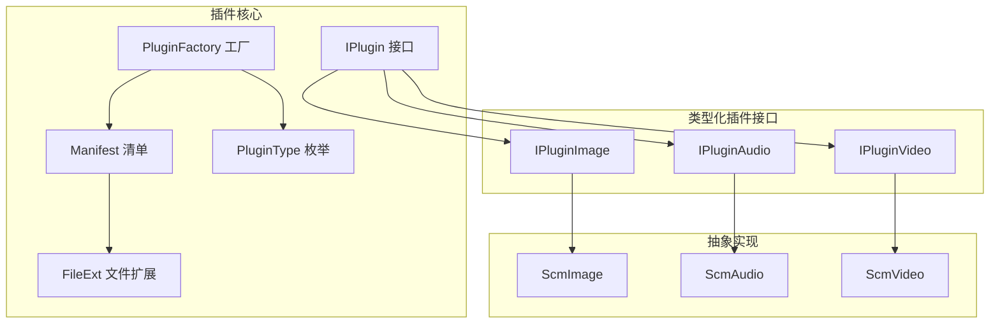
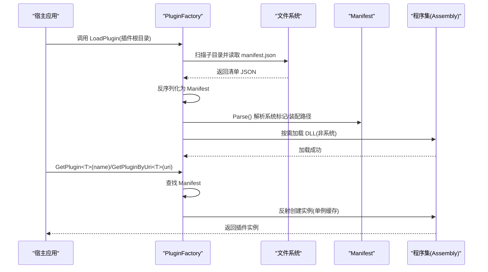
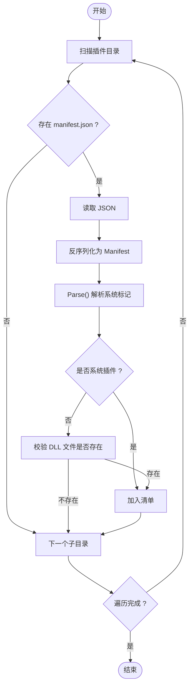
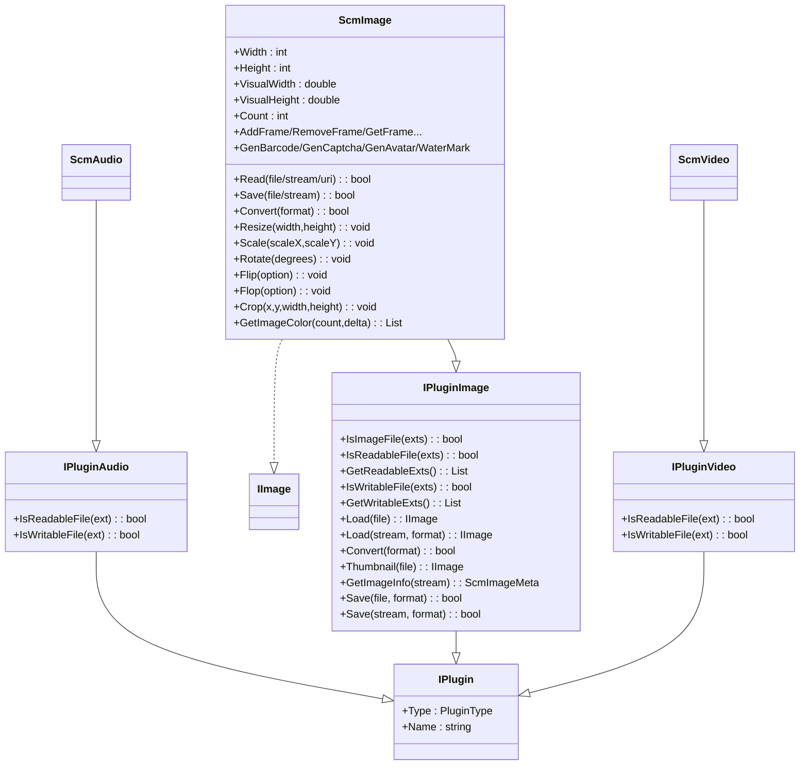

# 插件扩展 API

<cite>
**本文引用的文件**
- [IPlugin.cs](file://Scm.Plugin/IPlugin.cs)
- [Manifest.cs](file://Scm.Plugin/Manifest.cs)
- [PluginFactory.cs](file://Scm.Plugin/PluginFactory.cs)
- [PluginType.cs](file://Scm.Plugin/PluginType.cs)
- [FileExt.cs](file://Scm.Plugin/FileExt.cs)
- [IPluginAudio.cs](file://Scm.Plugin.Audio/IPluginAudio.cs)
- [IPluginImage.cs](file://Scm.Plugin.Image/IPluginImage.cs)
- [IPluginVideo.cs](file://Scm.Plugin.Video/IPluginVideo.cs)
- [ScmImage.cs](file://Scm.Plugin.Image/ScmImage.cs)
- [ScmAudio.cs](file://Scm.Plugin.Audio/ScmAudio.cs)
- [ScmVideo.cs](file://Scm.Plugin.Video/ScmVideo.cs)
</cite>

## 目录
1. [简介](#简介)
2. [项目结构](#项目结构)
3. [核心组件](#核心组件)
4. [架构总览](#架构总览)
5. [组件详解](#组件详解)
6. [依赖关系分析](#依赖关系分析)
7. [性能与并发特性](#性能与并发特性)
8. [故障排查指南](#故障排查指南)
9. [结论](#结论)
10. [附录：开发与集成指南](#附录开发与集成指南)

## 简介
本文件系统化梳理了 Scm.Net 中的插件扩展 API，覆盖插件注册、加载、实例化与调用机制；明确 IPlugin 接口及各类型插件（音频、图像、视频）的实现规范；给出插件配置管理、版本兼容与错误处理策略，并提供自定义插件开发的完整指南与最佳实践。

## 项目结构
围绕插件体系的关键模块如下：
- 核心接口与工厂：IPlugin、PluginFactory、Manifest、PluginType、FileExt
- 类型化插件接口：IPluginAudio、IPluginImage、IPluginVideo
- 抽象实现：ScmImage（图像）、ScmAudio（音频）、ScmVideo（视频）

图表来源
- [IPlugin.cs:1-13](file://Scm.Plugin/IPlugin.cs#L1-L13)
- [Manifest.cs:1-86](file://Scm.Plugin/Manifest.cs#L1-L86)
- [PluginFactory.cs:1-148](file://Scm.Plugin/PluginFactory.cs#L1-L148)
- [PluginType.cs:1-13](file://Scm.Plugin/PluginType.cs#L1-L13)
- [FileExt.cs:1-10](file://Scm.Plugin/FileExt.cs#L1-L10)
- [IPluginAudio.cs:1-10](file://Scm.Plugin.Audio/IPluginAudio.cs#L1-L10)
- [IPluginImage.cs:1-90](file://Scm.Plugin.Image/IPluginImage.cs#L1-L90)
- [IPluginVideo.cs:1-10](file://Scm.Plugin.Video/IPluginVideo.cs#L1-L10)
- [ScmImage.cs:1-234](file://Scm.Plugin.Image/ScmImage.cs#L1-L234)
- [ScmAudio.cs:1-7](file://Scm.Plugin.Audio/ScmAudio.cs#L1-L7)
- [ScmVideo.cs:1-7](file://Scm.Plugin.Video/ScmVideo.cs#L1-L7)

章节来源
- [IPlugin.cs:1-13](file://Scm.Plugin/IPlugin.cs#L1-L13)
- [Manifest.cs:1-86](file://Scm.Plugin/Manifest.cs#L1-L86)
- [PluginFactory.cs:1-148](file://Scm.Plugin/PluginFactory.cs#L1-L148)
- [PluginType.cs:1-13](file://Scm.Plugin/PluginType.cs#L1-L13)
- [FileExt.cs:1-10](file://Scm.Plugin/FileExt.cs#L1-L10)
- [IPluginAudio.cs:1-10](file://Scm.Plugin.Audio/IPluginAudio.cs#L1-L10)
- [IPluginImage.cs:1-90](file://Scm.Plugin.Image/IPluginImage.cs#L1-L90)
- [IPluginVideo.cs:1-10](file://Scm.Plugin.Video/IPluginVideo.cs#L1-L10)
- [ScmImage.cs:1-234](file://Scm.Plugin.Image/ScmImage.cs#L1-L234)
- [ScmAudio.cs:1-7](file://Scm.Plugin.Audio/ScmAudio.cs#L1-L7)
- [ScmVideo.cs:1-7](file://Scm.Plugin.Video/ScmVideo.cs#L1-L7)

## 核心组件
- IPlugin：所有插件的基础接口，统一暴露 Type 与 Name 两个属性，用于类型识别与命名标识。
- Manifest：插件清单模型，描述插件类型、程序集、入口类路径、参数、版本、是否单例、工作目录等，并支持解析系统插件标记。
- PluginFactory：插件加载与获取的核心工厂，负责扫描插件目录、读取 manifest.json、按需加载程序集、按名称或 URI 获取插件实例，并支持单例缓存。
- PluginType：插件类型枚举，涵盖 Text、Image、Audio、Vedio、Media 等分类。
- FileExt：文件扩展名与描述的通用数据载体。
- 类型化插件接口：IPluginAudio、IPluginImage、IPluginVideo 在 IPlugin 基础上扩展具体能力（如可读/可写文件判断、读取/保存、格式转换、缩略图、元信息等）。
- 抽象实现：ScmImage、ScmAudio、ScmVideo 提供通用行为与默认空实现，便于子类聚焦特定能力。

章节来源
- [IPlugin.cs:1-13](file://Scm.Plugin/IPlugin.cs#L1-L13)
- [Manifest.cs:1-86](file://Scm.Plugin/Manifest.cs#L1-L86)
- [PluginFactory.cs:1-148](file://Scm.Plugin/PluginFactory.cs#L1-L148)
- [PluginType.cs:1-13](file://Scm.Plugin/PluginType.cs#L1-L13)
- [FileExt.cs:1-10](file://Scm.Plugin/FileExt.cs#L1-L10)
- [IPluginAudio.cs:1-10](file://Scm.Plugin.Audio/IPluginAudio.cs#L1-L10)
- [IPluginImage.cs:1-90](file://Scm.Plugin.Image/IPluginImage.cs#L1-L90)
- [IPluginVideo.cs:1-10](file://Scm.Plugin.Video/IPluginVideo.cs#L1-L10)
- [ScmImage.cs:1-234](file://Scm.Plugin.Image/ScmImage.cs#L1-L234)
- [ScmAudio.cs:1-7](file://Scm.Plugin.Audio/ScmAudio.cs#L1-L7)
- [ScmVideo.cs:1-7](file://Scm.Plugin.Video/ScmVideo.cs#L1-L7)

## 架构总览
插件系统采用“清单驱动 + 反射实例化”的架构：
- 启动时由工厂扫描插件目录，读取每个子目录下的 manifest.json 并构建 Manifest 列表；
- 通过名称或 URI 查找目标插件，按需加载程序集；
- 支持单例模式缓存实例，避免重复创建；
- 类型化接口统一约束能力边界，抽象实现提供通用能力骨架。

图表来源
- [PluginFactory.cs:12-62](file://Scm.Plugin/PluginFactory.cs#L12-L62)
- [PluginFactory.cs:64-97](file://Scm.Plugin/PluginFactory.cs#L64-L97)
- [PluginFactory.cs:99-132](file://Scm.Plugin/PluginFactory.cs#L99-L132)
- [Manifest.cs:76-84](file://Scm.Plugin/Manifest.cs#L76-L84)

## 组件详解

### IPlugin 接口与插件类型
- 角色：所有插件的最小契约，统一暴露 Type 与 Name。
- 设计要点：Type 用于类型分组与路由，Name 用于同类型多实现的区分。

章节来源
- [IPlugin.cs:1-13](file://Scm.Plugin/IPlugin.cs#L1-L13)
- [PluginType.cs:1-13](file://Scm.Plugin/PluginType.cs#L1-L13)

### Manifest 清单模型
- 字段说明：
  - type/dll/name/title/description：类型、程序集、名称、标题、描述
  - uri/entry：类路径/入口（预留）
  - args/ver：参数/版本
  - singleton：是否单例
  - assembly/dir/sys：运行时字段（非序列化），用于缓存程序集、工作目录、系统插件标记
- 解析逻辑：Parse() 将 dll=system 的标记为系统插件，并直接绑定入口程序集。

章节来源
- [Manifest.cs:1-86](file://Scm.Plugin/Manifest.cs#L1-L86)

### PluginFactory 工厂
- 加载流程：
  - 扫描根目录下子目录，查找 manifest.json
  - 反序列化为 Manifest，执行 Parse()
  - 若非系统插件，校验 DLL 文件存在后加入列表
- 获取流程：
  - 按类型名与名称匹配 Manifest
  - 若未缓存程序集则按 dir+dll 加载
  - 单例模式：首次创建后缓存 instance；非单例：每次创建新实例
  - 支持按 URI 获取（entry 字段），与按名称获取并行

图表来源
- [PluginFactory.cs:12-62](file://Scm.Plugin/PluginFactory.cs#L12-L62)

章节来源
- [PluginFactory.cs:1-148](file://Scm.Plugin/PluginFactory.cs#L1-L148)

### 类型化插件接口

#### IPluginImage（图像）
- 关键能力：
  - 文件扩展判断：IsImageFile、IsReadableFile、IsWritableFile
  - 扩展集合：GetReadableExts、GetWritableExts
  - 读取：Load(文件/流, format)
  - 转换/保存：Convert、Save(文件/流, format)
  - 缩略图：Thumbnail
  - 元信息：GetImageInfo
- 设计要点：面向图像处理的全链路接口，兼顾可读/可写扩展、格式转换与元信息提取。

章节来源
- [IPluginImage.cs:1-90](file://Scm.Plugin.Image/IPluginImage.cs#L1-L90)

#### IPluginAudio（音频）
- 关键能力：
  - 文件扩展判断：IsReadableFile、IsWritableFile
- 设计要点：音频插件以可读/可写能力为核心，便于后续扩展编解码与元数据读取。

章节来源
- [IPluginAudio.cs:1-10](file://Scm.Plugin.Audio/IPluginAudio.cs#L1-L10)

#### IPluginVideo（视频）
- 关键能力：
  - 文件扩展判断：IsReadableFile、IsWritableFile
- 设计要点：视频插件以可读/可写能力为核心，便于后续扩展编解码与元数据读取。

章节来源
- [IPluginVideo.cs:1-10](file://Scm.Plugin.Video/IPluginVideo.cs#L1-L10)

### 抽象实现

#### ScmImage（图像）
- 统一实现 IImage，提供：
  - 基础属性：Count、Width、Height、VisualWidth、VisualHeight、Path、Name、Format
  - 存取：Read/Save（文件/流/URI）
  - 操作：Convert、Resize、Scale、Rotate、Flip、Flop、Crop、GetImageColor
  - 帧操作：Add/Set/Remove、GetFrame/GetFirstFrame/GetDefaultFrame、按尺寸检索帧
  - 应用：生成条码、生成验证码、生成头像、添加水印
- 设计要点：抽象实现集中处理通用流程，子类可按需覆写关键方法。

章节来源
- [ScmImage.cs:1-234](file://Scm.Plugin.Image/ScmImage.cs#L1-L234)

#### ScmAudio（音频）
- 角色：音频插件抽象基类，承载音频相关通用能力与约定。

章节来源
- [ScmAudio.cs:1-7](file://Scm.Plugin.Audio/ScmAudio.cs#L1-L7)

#### ScmVideo（视频）
- 角色：视频插件抽象基类，承载视频相关通用能力与约定。

章节来源
- [ScmVideo.cs:1-7](file://Scm.Plugin.Video/ScmVideo.cs#L1-L7)

## 依赖关系分析

图表来源
- [IPlugin.cs:1-13](file://Scm.Plugin/IPlugin.cs#L1-L13)
- [IPluginImage.cs:1-90](file://Scm.Plugin.Image/IPluginImage.cs#L1-L90)
- [IPluginAudio.cs:1-10](file://Scm.Plugin.Audio/IPluginAudio.cs#L1-L10)
- [IPluginVideo.cs:1-10](file://Scm.Plugin.Video/IPluginVideo.cs#L1-L10)
- [ScmImage.cs:1-234](file://Scm.Plugin.Image/ScmImage.cs#L1-L234)
- [ScmAudio.cs:1-7](file://Scm.Plugin.Audio/ScmAudio.cs#L1-L7)
- [ScmVideo.cs:1-7](file://Scm.Plugin.Video/ScmVideo.cs#L1-L7)

## 性能与并发特性
- 单例缓存：PluginFactory 对非系统插件在首次创建后缓存实例与程序集，减少重复反射开销，提升调用性能。
- 懒加载：仅在首次请求时加载程序集与创建实例，降低启动时资源占用。
- 并发注意：当前实现未显式加锁，若多线程并发首次获取同一插件，可能触发重复加载与实例化。建议在宿主侧进行初始化阶段预热或在工厂层增加线程安全保护。

章节来源
- [PluginFactory.cs:82-96](file://Scm.Plugin/PluginFactory.cs#L82-L96)
- [PluginFactory.cs:117-131](file://Scm.Plugin/PluginFactory.cs#L117-L131)

## 故障排查指南
- 插件未被发现
  - 检查插件目录结构与 manifest.json 是否存在且可读
  - 确认 type 与 name 与调用处一致
- 程序集加载失败
  - 非系统插件需确保 dll 文件存在于插件目录
  - 确认程序集与运行时目标框架兼容
- 实例创建异常
  - 确认 uri/entry 指向的类可被反射创建（公共无参构造）
  - 单例缓存导致的实例复用问题：必要时清理缓存或切换非单例
- 类型不匹配
  - GetPlugin<T>() 会按类型名匹配 Manifest.type，确保命名一致

章节来源
- [PluginFactory.cs:12-62](file://Scm.Plugin/PluginFactory.cs#L12-L62)
- [PluginFactory.cs:64-97](file://Scm.Plugin/PluginFactory.cs#L64-L97)
- [PluginFactory.cs:99-132](file://Scm.Plugin/PluginFactory.cs#L99-L132)
- [Manifest.cs:76-84](file://Scm.Plugin/Manifest.cs#L76-L84)

## 结论
该插件体系以 IPlugin 为统一契约，结合 Manifest 清单与 PluginFactory 实现，提供了清晰的插件注册、加载与调用机制。类型化接口与抽象实现进一步明确了能力边界与通用流程，便于扩展音频、图像、视频等插件族。建议在生产环境中完善并发控制、日志监控与错误回退策略，以获得更稳健的插件生态。

## 附录：开发与集成指南

### 插件开发规范
- 实现 IPlugin 或其类型化接口（如 IPluginImage）
- 在插件目录中提供合法的 manifest.json，包含 type、name、dll、uri/entry、ver、singleton 等字段
- 若为系统插件，设置 dll 为 system；否则确保 dll 文件位于插件目录内
- 使用单例时注意线程安全与资源释放；非单例时确保实例可重复创建

章节来源
- [IPlugin.cs:1-13](file://Scm.Plugin/IPlugin.cs#L1-L13)
- [IPluginImage.cs:1-90](file://Scm.Plugin.Image/IPluginImage.cs#L1-L90)
- [IPluginAudio.cs:1-10](file://Scm.Plugin.Audio/IPluginAudio.cs#L1-L10)
- [IPluginVideo.cs:1-10](file://Scm.Plugin.Video/IPluginVideo.cs#L1-L10)
- [Manifest.cs:1-86](file://Scm.Plugin/Manifest.cs#L1-L86)

### 插件注册与加载
- 宿主应用在启动阶段调用 PluginFactory.LoadPlugin(插件根目录)，扫描并加载可用插件
- 通过 PluginFactory.GetPlugin<T>(name) 或 GetPluginByUri<T>(uri) 获取实例
- 首次获取将触发程序集加载与实例创建；单例模式将缓存实例以复用

章节来源
- [PluginFactory.cs:12-62](file://Scm.Plugin/PluginFactory.cs#L12-L62)
- [PluginFactory.cs:64-97](file://Scm.Plugin/PluginFactory.cs#L64-L97)
- [PluginFactory.cs:99-132](file://Scm.Plugin/PluginFactory.cs#L99-L132)

### 配置管理与版本兼容
- 使用 manifest.json 的 ver 字段声明版本；宿主可在加载前进行版本校验
- args 字段可用于传递插件参数；建议在插件内部进行参数校验与默认值处理
- singleton 字段控制实例生命周期；跨请求共享时需保证线程安全

章节来源
- [Manifest.cs:1-86](file://Scm.Plugin/Manifest.cs#L1-L86)

### 错误处理与最佳实践
- 异常捕获：在反射加载与实例创建处包裹异常，返回默认值或抛出业务异常
- 日志记录：记录插件加载状态、类型匹配结果与程序集加载路径
- 资源释放：非单例插件在使用后及时释放；单例插件需提供显式的释放接口
- 性能优化：优先使用单例；对耗时操作（如大图处理）采用异步或批处理

章节来源
- [PluginFactory.cs:64-97](file://Scm.Plugin/PluginFactory.cs#L64-L97)
- [PluginFactory.cs:99-132](file://Scm.Plugin/PluginFactory.cs#L99-L132)

### 内置插件使用指引
- 图像插件（IPluginImage）
  - 文件扩展：通过 IsImageFile/IsReadableFile/IsWritableFile 判断
  - 读取与保存：Load/Save 支持文件路径与流
  - 转换与缩略图：Convert/Thumbnail
  - 元信息：GetImageInfo
- 音频插件（IPluginAudio）
  - 文件扩展：IsReadableFile/IsWritableFile
- 视频插件（IPluginVideo）
  - 文件扩展：IsReadableFile/IsWritableFile

章节来源
- [IPluginImage.cs:1-90](file://Scm.Plugin.Image/IPluginImage.cs#L1-L90)
- [IPluginAudio.cs:1-10](file://Scm.Plugin.Audio/IPluginAudio.cs#L1-L10)
- [IPluginVideo.cs:1-10](file://Scm.Plugin.Video/IPluginVideo.cs#L1-L10)