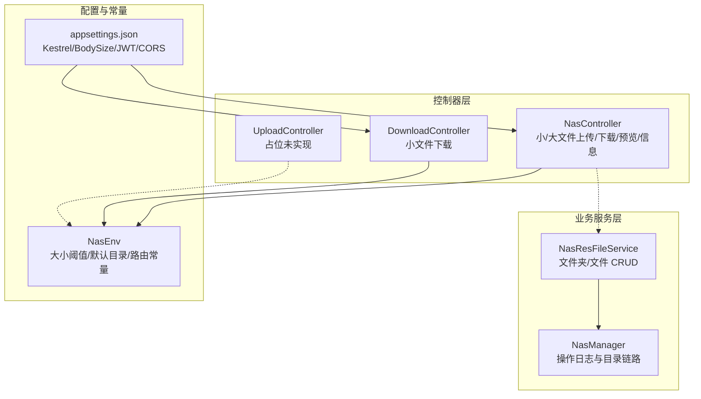
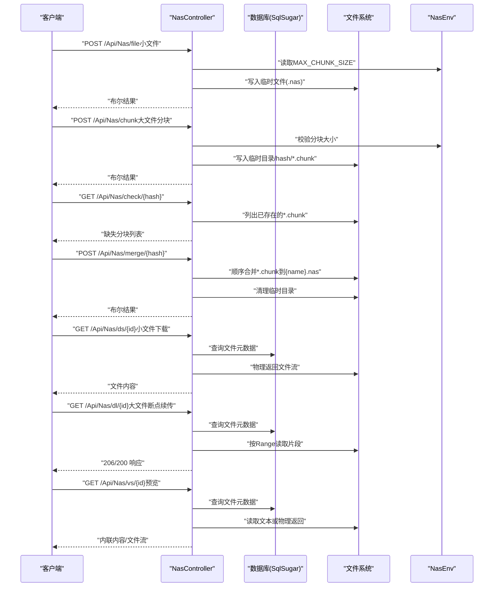
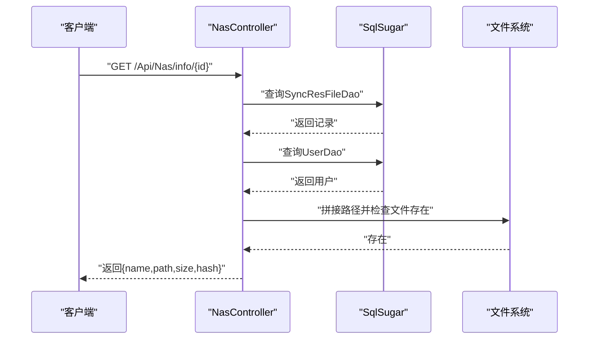
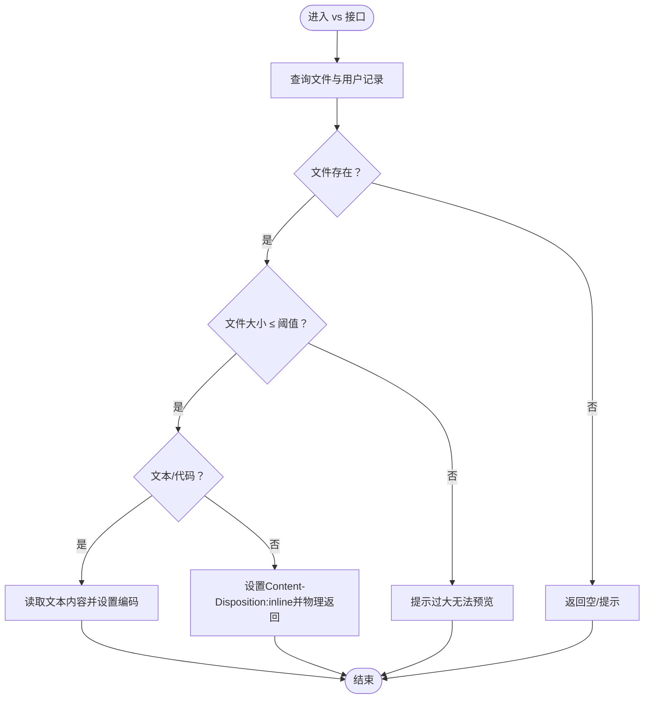
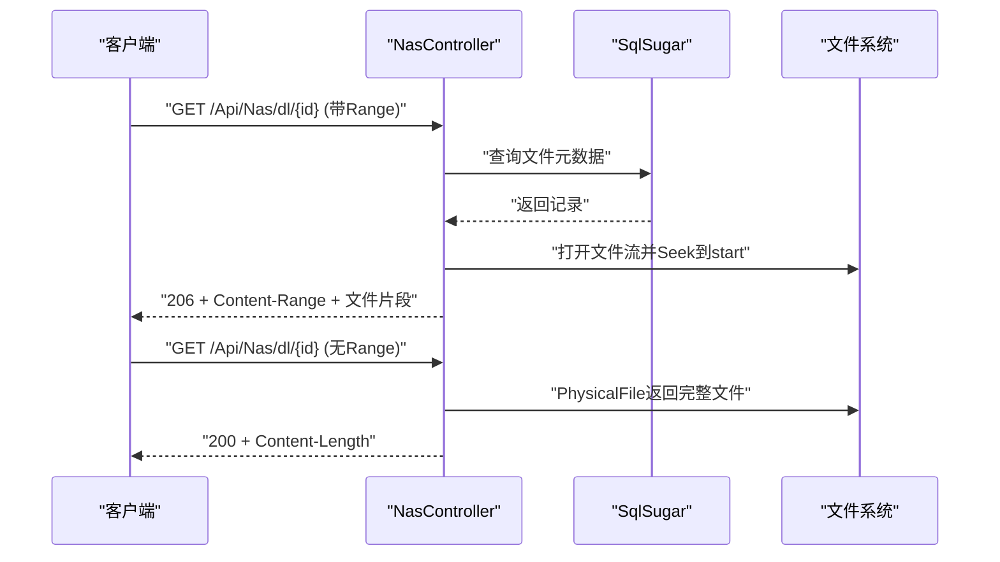
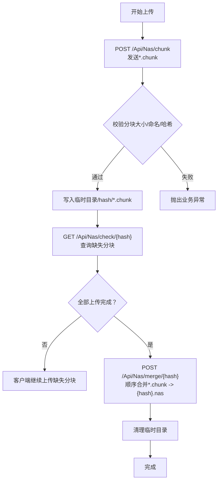
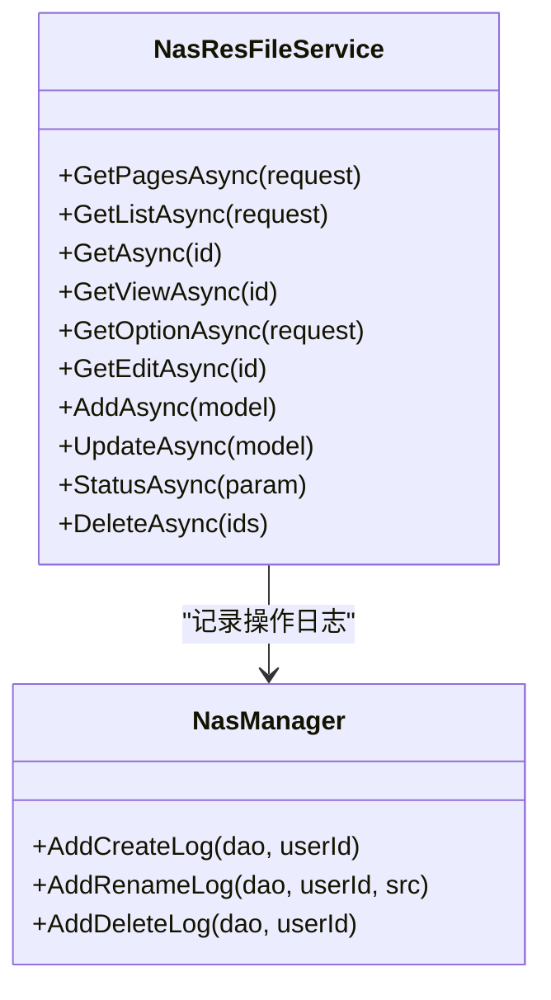
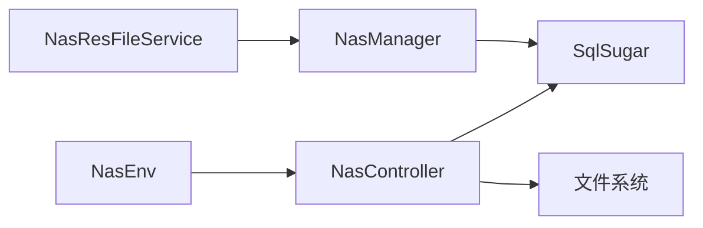

# 文件管理 API

<cite>
**本文引用的文件**
- [NasController.cs](file://Scm.Net/Controllers/NasController.cs)
- [NasEnv.cs](file://Nas.Common/NasEnv.cs)
- [ScmFileDto.cs](file://Scm.Common.Dto/Dto/ScmFileDto.cs)
- [NasResFileService.cs](file://Nas.Server/Res/NasResFileService.cs)
- [NasManager.cs](file://Nas.Server/Res/NasManager.cs)
- [ScmFileEnum.cs](file://Scm.Common/Enums/ScmFileEnum.cs)
- [appsettings.json](file://Scm.Net/appsettings.json)
- [UploadController.cs](file://Scm.Net/Controllers/UploadController.cs)
- [DownloadController.cs](file://Scm.Net/Controllers/DownloadController.cs)
</cite>

## 目录
1. [简介](#简介)
2. [项目结构](#项目结构)
3. [核心组件](#核心组件)
4. [架构总览](#架构总览)
5. [详细组件分析](#详细组件分析)
6. [依赖关系分析](#依赖关系分析)
7. [性能考虑](#性能考虑)
8. [故障排查指南](#故障排查指南)
9. [结论](#结论)
10. [附录](#附录)

## 简介
本文件管理 API 文档面向 NAS 文件管理系统，覆盖文件上传、下载、删除、预览、信息查询、文件夹管理与权限控制等能力。系统同时支持小文件与大文件上传策略：小文件采用一次性上传；大文件采用分块上传、断点续传与合并流程。文档还给出文件类型支持、大小限制、安全验证与错误处理建议，以及完整的请求/响应示例与最佳实践。

## 项目结构
NAS 文件管理由三层组成：
- 控制器层：提供 HTTP 接口，负责路由与参数解析
- 业务服务层：封装文件夹与文件元数据的增删改查、日志记录
- 配置与常量层：定义文件大小阈值、默认目录、URL 路由等

**图表来源**
- [NasController.cs:1-469](file://Scm.Net/Controllers/NasController.cs#L1-L469)
- [NasResFileService.cs:1-259](file://Nas.Server/Res/NasResFileService.cs#L1-L259)
- [NasManager.cs:1-136](file://Nas.Server/Res/NasManager.cs#L1-L136)
- [NasEnv.cs:1-222](file://Nas.Common/NasEnv.cs#L1-L222)
- [appsettings.json:1-127](file://Scm.Net/appsettings.json#L1-L127)

**章节来源**
- [NasController.cs:1-469](file://Scm.Net/Controllers/NasController.cs#L1-L469)
- [NasResFileService.cs:1-259](file://Nas.Server/Res/NasResFileService.cs#L1-L259)
- [NasManager.cs:1-136](file://Nas.Server/Res/NasManager.cs#L1-L136)
- [NasEnv.cs:1-222](file://Nas.Common/NasEnv.cs#L1-L222)
- [appsettings.json:1-127](file://Scm.Net/appsettings.json#L1-L127)

## 核心组件
- NasController：提供文件信息查询、文件预览、小/大文件下载、小/大文件上传、分块上传、上传校验、分块合并等接口
- NasResFileService：文件夹与文件的增删改查、分页检索、下拉选项等
- NasManager：记录创建/重命名/删除等操作日志，并关联到用户配置的文件夹集合
- NasEnv：统一的文件大小阈值、默认目录、路由常量
- appsettings.json：服务器监听端口、请求体大小限制、JWT、CORS 等运行时配置

**章节来源**
- [NasController.cs:45-469](file://Scm.Net/Controllers/NasController.cs#L45-L469)
- [NasResFileService.cs:36-259](file://Nas.Server/Res/NasResFileService.cs#L36-L259)
- [NasManager.cs:16-136](file://Nas.Server/Res/NasManager.cs#L16-L136)
- [NasEnv.cs:46-125](file://Nas.Common/NasEnv.cs#L46-L125)
- [appsettings.json:26-38](file://Scm.Net/appsettings.json#L26-L38)

## 架构总览
NAS 文件管理 API 的调用链路如下：

**图表来源**
- [NasController.cs:164-296](file://Scm.Net/Controllers/NasController.cs#L164-L296)
- [NasController.cs:301-464](file://Scm.Net/Controllers/NasController.cs#L301-L464)
- [NasEnv.cs:46-92](file://Nas.Common/NasEnv.cs#L46-L92)

## 详细组件分析

### 文件信息查询
- 接口：GET /Api/Nas/info/{id}
- 功能：根据文件 ID 查询文件信息（名称、路径、大小、哈希）
- 数据源：数据库查询同步资源表与用户表，拼接实际文件路径并读取系统文件长度
- 错误：文件不存在或用户不存在时抛出业务异常

**图表来源**
- [NasController.cs:50-90](file://Scm.Net/Controllers/NasController.cs#L50-L90)

**章节来源**
- [NasController.cs:50-90](file://Scm.Net/Controllers/NasController.cs#L50-L90)

### 文件预览
- 接口：GET /Api/Nas/vs/{id}
- 功能：对小于等于阈值的小文件进行内联预览；文本/代码类直接读取文本内容；其他类型设置 Content-Disposition 并物理返回
- 限制：超过阈值的文件提示“无法预览”
- MIME 类型：通过扩展名推导

**图表来源**
- [NasController.cs:98-154](file://Scm.Net/Controllers/NasController.cs#L98-L154)

**章节来源**
- [NasController.cs:98-154](file://Scm.Net/Controllers/NasController.cs#L98-L154)

### 小文件下载
- 接口：GET /Api/Nas/ds/{id}
- 功能：对小于等于阈值的文件进行下载，设置 Content-Disposition 为附件并物理返回
- 限制：超过阈值的文件提示“无法下载”

**章节来源**
- [NasController.cs:164-212](file://Scm.Net/Controllers/NasController.cs#L164-L212)

### 大文件下载（断点续传）
- 接口：GET /Api/Nas/dl/{id}
- 功能：支持 Range 请求，按起止位置读取文件片段，返回 206 Partial Content；否则物理返回完整文件
- 响应头：Content-Range、Accept-Ranges、Content-Length、Content-Disposition

**图表来源**
- [NasController.cs:220-296](file://Scm.Net/Controllers/NasController.cs#L220-L296)

**章节来源**
- [NasController.cs:220-296](file://Scm.Net/Controllers/NasController.cs#L220-L296)

### 小文件上传
- 接口：POST /Api/Nas/file
- 功能：接收二进制文件，校验大小不超过阈值，文件名需满足 64 位哈希 + .nas 格式，写入临时目录
- 返回：布尔结果表示是否成功

**章节来源**
- [NasController.cs:301-339](file://Scm.Net/Controllers/NasController.cs#L301-L339)

### 大文件上传（分块/断点续传）
- 分块上传
  - 接口：POST /Api/Nas/chunk
  - 规则：文件名格式为 数字序号.chunk；hash 参数需为 64 位十六进制；每个分块写入临时目录/hash/
- 上传校验
  - 接口：GET /Api/Nas/check/{hash}
  - 功能：返回该 hash 对应的已上传分块列表（*.chunk）
- 分块合并
  - 接口：POST /Api/Nas/merge/{hash}
  - 功能：按文件名排序合并所有 *.chunk 到 {hash}.nas，并清理临时目录

**图表来源**
- [NasController.cs:349-464](file://Scm.Net/Controllers/NasController.cs#L349-L464)

**章节来源**
- [NasController.cs:349-464](file://Scm.Net/Controllers/NasController.cs#L349-L464)

### 文件夹与文件管理（服务层）
- 文件夹/文件查询、分页、下拉列表、编辑读取、添加、更新、批量删除、批量状态变更
- 新增目录时自动校验父级为目录类型，并计算新路径
- 更新时支持重命名，记录重命名日志
- 删除时记录删除日志

**图表来源**
- [NasResFileService.cs:36-259](file://Nas.Server/Res/NasResFileService.cs#L36-L259)
- [NasManager.cs:16-136](file://Nas.Server/Res/NasManager.cs#L16-L136)

**章节来源**
- [NasResFileService.cs:36-259](file://Nas.Server/Res/NasResFileService.cs#L36-L259)
- [NasManager.cs:16-136](file://Nas.Server/Res/NasManager.cs#L16-L136)

### 文件类型与权限控制
- 文件类型枚举：目录、文档、字节/可执行/类库、文本/日志/代码、媒体/图像/音/视、办公、归档、备份/临时/未知
- 权限控制：控制器层使用匿名访问注解，具体鉴权与授权由上层框架或中间件处理（本仓库未在控制器中显式实现）

**章节来源**
- [ScmFileEnum.cs:5-79](file://Scm.Common/Enums/ScmFileEnum.cs#L5-L79)
- [NasController.cs:32-43](file://Scm.Net/Controllers/NasController.cs#L32-L43)

## 依赖关系分析
- NasController 依赖 NasEnv（阈值/路由）、SqlSugar（查询）、文件系统（读写）
- NasResFileService 依赖 SqlSugar 仓储、NasManager 日志
- NasManager 依赖配置文件夹表与父级目录链路，生成日志并关联到用户关注的文件夹集合

**图表来源**
- [NasEnv.cs:46-125](file://Nas.Common/NasEnv.cs#L46-L125)
- [NasController.cs:36-43](file://Scm.Net/Controllers/NasController.cs#L36-L43)
- [NasResFileService.cs:21-34](file://Nas.Server/Res/NasResFileService.cs#L21-L34)
- [NasManager.cs:9-14](file://Nas.Server/Res/NasManager.cs#L9-L14)

**章节来源**
- [NasEnv.cs:46-125](file://Nas.Common/NasEnv.cs#L46-L125)
- [NasController.cs:36-43](file://Scm.Net/Controllers/NasController.cs#L36-L43)
- [NasResFileService.cs:21-34](file://Nas.Server/Res/NasResFileService.cs#L21-L34)
- [NasManager.cs:9-14](file://Nas.Server/Res/NasManager.cs#L9-L14)

## 性能考虑
- 大文件断点续传：通过 Range 读取片段，避免全量传输，降低网络与内存压力
- 临时文件与分块：分块上传减少单次请求体大小，便于失败重试
- 服务器请求体限制：Kestrel 的 MaxRequestBodySize 限制了单次请求体大小，建议与前端分块策略匹配
- 预览与下载：小文件直接内联或物理返回，避免额外拷贝

**章节来源**
- [NasController.cs:255-295](file://Scm.Net/Controllers/NasController.cs#L255-L295)
- [appsettings.json:34-37](file://Scm.Net/appsettings.json#L34-L37)

## 故障排查指南
- 文件不存在
  - 现象：查询/下载/预览返回空或提示不存在
  - 排查：确认文件 ID、用户 ID 是否正确，文件路径是否与数据库记录一致
- 文件过大
  - 现象：预览/小文件下载提示“过大”
  - 排查：确认文件大小是否超过阈值；使用大文件下载接口或分块上传
- 分块校验失败
  - 现象：check 返回缺失分块
  - 排查：确认 hash 与分块命名规则；确保分块按序号递增
- 合并失败
  - 现象：merge 抛出“分块目录不存在”
  - 排查：确认 hash 是否正确，临时目录是否存在且包含 *.chunk
- 上传失败
  - 现象：小文件上传提示“内容过大/文件名无效”
  - 排查：确认文件名格式与大小限制；检查请求体大小是否超过服务器限制

**章节来源**
- [NasController.cs:58-80](file://Scm.Net/Controllers/NasController.cs#L58-L80)
- [NasController.cs:189-211](file://Scm.Net/Controllers/NasController.cs#L189-L211)
- [NasController.cs:317-339](file://Scm.Net/Controllers/NasController.cs#L317-L339)
- [NasController.cs:396-421](file://Scm.Net/Controllers/NasController.cs#L396-L421)
- [NasController.cs:429-464](file://Scm.Net/Controllers/NasController.cs#L429-L464)
- [appsettings.json:34-37](file://Scm.Net/appsettings.json#L34-L37)

## 结论
NAS 文件管理 API 提供了从上传、分块、校验、合并到下载、预览、信息查询的完整能力。通过阈值区分小/大文件，结合断点续传与分块策略，兼顾易用性与可靠性。配合服务层的文件夹/文件管理与日志记录，可满足企业级文件管理需求。建议在生产环境完善鉴权与配额控制，并根据业务场景调整阈值与并发策略。

## 附录

### 接口清单与示例

- 文件信息查询
  - 方法与路径：GET /Api/Nas/info/{id}
  - 请求参数：id（路径参数）
  - 响应：ScmFileDto（name/path/hash/size）
  - 示例响应：见 [ScmFileDto.cs:3-12](file://Scm.Common.Dto/Dto/ScmFileDto.cs#L3-L12)

- 文件预览
  - 方法与路径：GET /Api/Nas/vs/{id}
  - 行为：内联返回文本/代码或物理返回其他类型
  - 响应头：Content-Disposition:inline 或 attachment

- 小文件下载
  - 方法与路径：GET /Api/Nas/ds/{id}
  - 行为：当文件大小 ≤ 阈值时返回文件流
  - 响应头：Content-Disposition:attachment

- 大文件下载（断点续传）
  - 方法与路径：GET /Api/Nas/dl/{id}
  - 请求头：Range: bytes=start-end
  - 响应：206 Partial Content 或 200 OK（含 Content-Range/Content-Length）

- 小文件上传
  - 方法与路径：POST /Api/Nas/file
  - 请求体：multipart/form-data，字段 file，文件名需满足 64 位哈希+.nas
  - 响应：布尔结果

- 大文件上传（分块）
  - 方法与路径：POST /Api/Nas/chunk
  - 请求体：multipart/form-data，字段 file，文件名需满足 数字序号.chunk
  - 查询参数：hash（64 位哈希）
  - 响应：布尔结果

- 上传校验
  - 方法与路径：GET /Api/Nas/check/{hash}
  - 响应：缺失分块列表（文件名数组）

- 分块合并
  - 方法与路径：POST /Api/Nas/merge/{hash}
  - 行为：顺序合并 *.chunk 到 {hash}.nas
  - 响应：布尔结果

- 文件夹/文件管理（服务层）
  - 查询/分页/下拉：见 [NasResFileService.cs:41-137](file://Nas.Server/Res/NasResFileService.cs#L41-L137)
  - 添加/更新/删除：见 [NasResFileService.cs:159-257](file://Nas.Server/Res/NasResFileService.cs#L159-L257)

**章节来源**
- [NasController.cs:50-90](file://Scm.Net/Controllers/NasController.cs#L50-L90)
- [NasController.cs:98-154](file://Scm.Net/Controllers/NasController.cs#L98-L154)
- [NasController.cs:164-212](file://Scm.Net/Controllers/NasController.cs#L164-L212)
- [NasController.cs:220-296](file://Scm.Net/Controllers/NasController.cs#L220-L296)
- [NasController.cs:301-339](file://Scm.Net/Controllers/NasController.cs#L301-L339)
- [NasController.cs:349-464](file://Scm.Net/Controllers/NasController.cs#L349-L464)
- [NasResFileService.cs:41-257](file://Nas.Server/Res/NasResFileService.cs#L41-L257)

### 配置项与限制
- 文件大小阈值：MAX_CHUNK_SIZE（用于区分小/大文件）
- 请求体大小限制：Kestrel.MaxRequestBodySize（建议与分块策略匹配）
- JWT/CORS：用于鉴权与跨域支持
- 默认目录：DEF_DIR_ID（根目录 ID）

**章节来源**
- [NasEnv.cs:46-48](file://Nas.Common/NasEnv.cs#L46-L48)
- [appsettings.json:34-37](file://Scm.Net/appsettings.json#L34-L37)
- [appsettings.json:100-126](file://Scm.Net/appsettings.json#L100-L126)