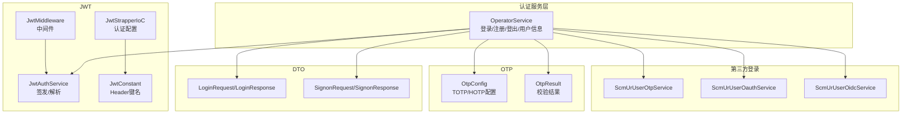
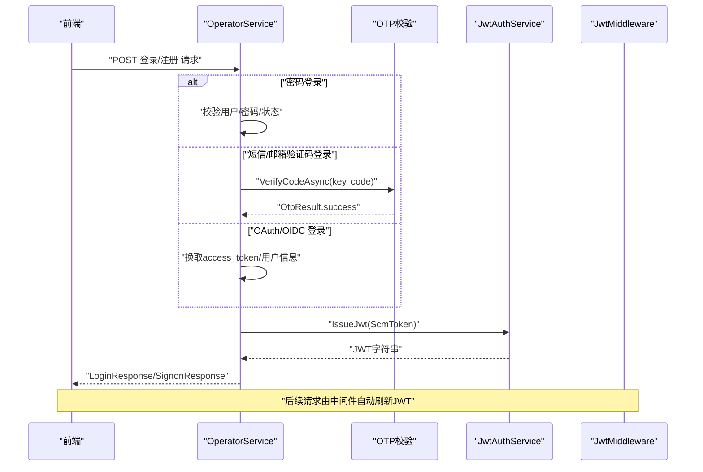
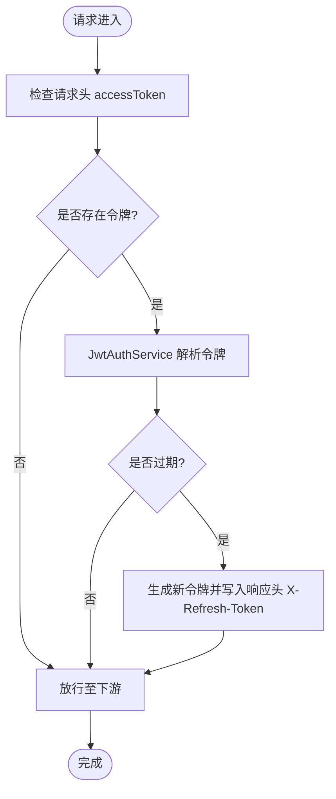
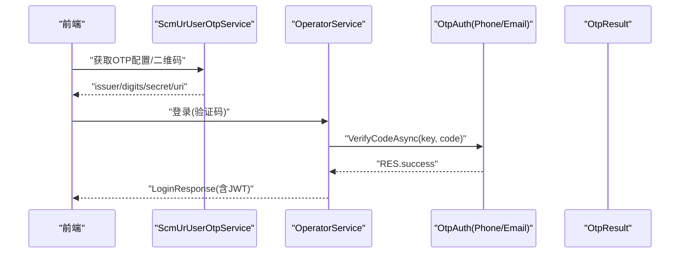
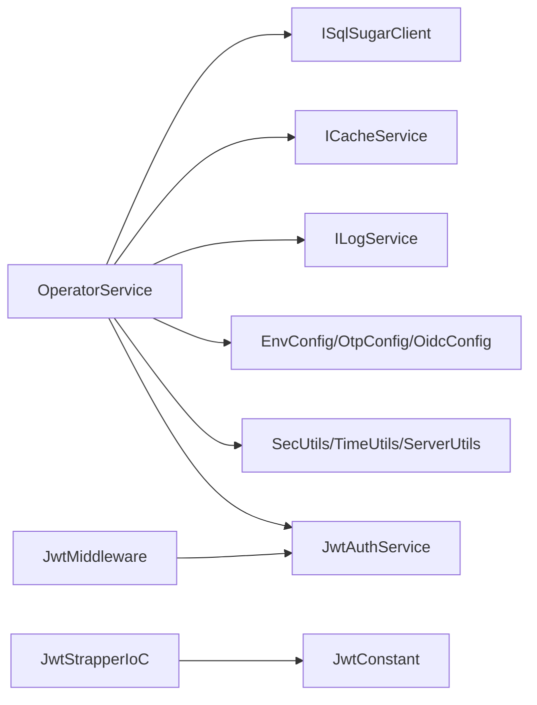

# 用户认证 API

<cite>
**本文引用的文件**
- [OperatorService.cs](file://Scm.Core/Operator/OperatorService.cs)
- [LoginRequest.cs](file://Scm.Core/Operator/Dvo/LoginRequest.cs)
- [LoginResponse.cs](file://Scm.Core/Operator/Dvo/LoginResponse.cs)
- [SignonRequest.cs](file://Scm.Core/Operator/Dvo/SignonRequest.cs)
- [SignonResponse.cs](file://Scm.Core/Operator/Dvo/SignonResponse.cs)
- [ScmLoginModeEnum.cs](file://Scm.Common/Enums/ScmLoginEnum.cs)
- [JwtAuthService.cs](file://Scm.Server.Bearer/JwtAuthService.cs)
- [JwtStrapperIoC.cs](file://Scm.Server.Bearer/JwtStrapperIoC.cs)
- [JwtMiddleware.cs](file://Scm.Core/Configure/Middleware/JwtMiddleware.cs)
- [JwtConstant.cs](file://Scm.Server.Bearer/Jwt/JwtConstant.cs)
- [OtpConfig.cs](file://Scm.Core/Login/Otp/OtpConfig.cs)
- [OtpResult.cs](file://Scm.Core/Login/Otp/OtpResult.cs)
- [ScmUrUserOtpService.cs](file://Scm.Core/Ur/UserOtp/ScmUrUserOtpService.cs)
- [ScmUrUserOauthService.cs](file://Scm.Core/Ur/UserOAuth/ScmUrUserOauthService.cs)
- [ScmUrUserOidcService.cs](file://Scm.Core/Ur/UserOidc/ScmUrUserOidcService.cs)
</cite>

## 目录
1. [简介](#简介)
2. [项目结构](#项目结构)
3. [核心组件](#核心组件)
4. [架构总览](#架构总览)
5. [详细组件分析](#详细组件分析)
6. [依赖关系分析](#依赖关系分析)
7. [性能考虑](#性能考虑)
8. [故障排查指南](#故障排查指南)
9. [结论](#结论)
10. [附录](#附录)

## 简介
本文件面向开发者与集成方，系统化梳理用户认证相关 API，覆盖以下能力：
- 用户登录：密码登录、短信/邮箱 OTP 登录、OAuth/OpenID Connect 登录
- 用户注册：密码注册、第三方联合注册
- 登出与会话管理：登出、JWT 刷新与校验
- 中间件与安全：JWT 中间件、认证策略、安全最佳实践
- 错误码与响应规范：统一响应模型与错误码定义
- 集成示例与流程图：端到端登录/注册/刷新流程示意

## 项目结构
围绕认证的关键模块分布如下：
- 控制器与服务层：登录、注册、登出、用户信息查询由服务类实现
- DTO 定义：登录/注册请求与响应模型
- 枚举：登录模式枚举
- JWT：签发、解析、验证与中间件
- OTP：TOTP/HOTP 配置与结果封装
- 第三方登录：OAuth/OIDC/OTP 相关服务接口

图表来源
- [OperatorService.cs](file://Scm.Core/Operator/OperatorService.cs)
- [LoginRequest.cs](file://Scm.Core/Operator/Dvo/LoginRequest.cs)
- [LoginResponse.cs](file://Scm.Core/Operator/Dvo/LoginResponse.cs)
- [SignonRequest.cs](file://Scm.Core/Operator/Dvo/SignonRequest.cs)
- [SignonResponse.cs](file://Scm.Core/Operator/Dvo/SignonResponse.cs)
- [JwtAuthService.cs](file://Scm.Server.Bearer/JwtAuthService.cs)
- [JwtMiddleware.cs](file://Scm.Core/Configure/Middleware/JwtMiddleware.cs)
- [JwtStrapperIoC.cs](file://Scm.Server.Bearer/JwtStrapperIoC.cs)
- [JwtConstant.cs](file://Scm.Server.Bearer/Jwt/JwtConstant.cs)
- [OtpConfig.cs](file://Scm.Core/Login/Otp/OtpConfig.cs)
- [OtpResult.cs](file://Scm.Core/Login/Otp/OtpResult.cs)
- [ScmUrUserOtpService.cs](file://Scm.Core/Ur/UserOtp/ScmUrUserOtpService.cs)
- [ScmUrUserOauthService.cs](file://Scm.Core/Ur/UserOAuth/ScmUrUserOauthService.cs)
- [ScmUrUserOidcService.cs](file://Scm.Core/Ur/UserOidc/ScmUrUserOidcService.cs)

章节来源
- [OperatorService.cs](file://Scm.Core/Operator/OperatorService.cs)
- [JwtAuthService.cs](file://Scm.Server.Bearer/JwtAuthService.cs)
- [JwtStrapperIoC.cs](file://Scm.Server.Bearer/JwtStrapperIoC.cs)
- [JwtMiddleware.cs](file://Scm.Core/Configure/Middleware/JwtMiddleware.cs)
- [JwtConstant.cs](file://Scm.Server.Bearer/Jwt/JwtConstant.cs)
- [OtpConfig.cs](file://Scm.Core/Login/Otp/OtpConfig.cs)
- [OtpResult.cs](file://Scm.Core/Login/Otp/OtpResult.cs)
- [ScmUrUserOtpService.cs](file://Scm.Core/Ur/UserOtp/ScmUrUserOtpService.cs)
- [ScmUrUserOauthService.cs](file://Scm.Core/Ur/UserOAuth/ScmUrUserOauthService.cs)
- [ScmUrUserOidcService.cs](file://Scm.Core/Ur/UserOidc/ScmUrUserOidcService.cs)

## 核心组件
- 登录服务：集中处理多种登录模式，生成 JWT 并返回用户主题与基础信息
- DTO：标准化请求/响应结构，便于前后端契约一致
- JWT：签发与解析、中间件自动刷新、认证策略
- OTP：TOTP/HOTP 配置与校验结果封装
- 第三方登录：OTP、OAuth、OIDC 服务接口

章节来源
- [OperatorService.cs](file://Scm.Core/Operator/OperatorService.cs)
- [LoginRequest.cs](file://Scm.Core/Operator/Dvo/LoginRequest.cs)
- [LoginResponse.cs](file://Scm.Core/Operator/Dvo/LoginResponse.cs)
- [SignonRequest.cs](file://Scm.Core/Operator/Dvo/SignonRequest.cs)
- [SignonResponse.cs](file://Scm.Core/Operator/Dvo/SignonResponse.cs)
- [JwtAuthService.cs](file://Scm.Server.Bearer/JwtAuthService.cs)
- [JwtStrapperIoC.cs](file://Scm.Server.Bearer/JwtStrapperIoC.cs)
- [JwtMiddleware.cs](file://Scm.Core/Configure/Middleware/JwtMiddleware.cs)
- [OtpConfig.cs](file://Scm.Core/Login/Otp/OtpConfig.cs)
- [OtpResult.cs](file://Scm.Core/Login/Otp/OtpResult.cs)

## 架构总览
认证整体流程：
- 前端发起登录/注册请求，携带相应参数
- 服务端根据登录模式执行校验（密码、验证码、第三方）
- 成功后签发 JWT，并返回用户主题与基础信息
- 中间件拦截请求，自动刷新过期 JWT
- 认证策略基于角色进行授权

图表来源
- [OperatorService.cs](file://Scm.Core/Operator/OperatorService.cs)
- [OtpResult.cs](file://Scm.Core/Login/Otp/OtpResult.cs)
- [JwtAuthService.cs](file://Scm.Server.Bearer/JwtAuthService.cs)
- [JwtMiddleware.cs](file://Scm.Core/Configure/Middleware/JwtMiddleware.cs)

## 详细组件分析

### 登录 API
- 接口路径：由服务类暴露的登录接口（具体路由以实际控制器为准）
- 方法：POST
- 权限：匿名访问
- 请求体：LoginRequest
- 响应体：LoginResponse
- 支持模式：
  - ByPass：密码登录
  - ByPhone/ByEmail：短信/邮箱验证码登录
  - ByOauth/ByOidc：第三方登录
- 参数与约束：
  - mode：登录模式枚举
  - user/pass：用户名与密码（ByPass）
  - phone/email：手机号/邮箱（ByPhone/ByEmail）
  - key/code/time/auto：验证码相关与自动注册开关
  - state：第三方登录状态（ByOauth/ByOidc）
- 成功响应：
  - accessToken：JWT 字符串
  - userInfo：当前用户基础信息
  - userTheme：用户主题配置
- 失败响应：包含错误码与消息

章节来源
- [OperatorService.cs](file://Scm.Core/Operator/OperatorService.cs)
- [LoginRequest.cs](file://Scm.Core/Operator/Dvo/LoginRequest.cs)
- [LoginResponse.cs](file://Scm.Core/Operator/Dvo/LoginResponse.cs)
- [ScmLoginModeEnum.cs](file://Scm.Common/Enums/ScmLoginEnum.cs)

### 注册 API
- 接口路径：由服务类暴露的注册接口
- 方法：POST
- 权限：匿名访问
- 请求体：SignonRequest
- 响应体：SignonResponse
- 支持模式：
  - ByPass：密码注册
  - ByOauth：第三方联合注册
- 参数与约束：
  - mode：注册模式
  - user/pass/user_name/email/phone/system：用户基本信息
  - opt/code：联合注册选项与授权码
- 成功响应：返回 accessToken、userInfo、userTheme
- 失败响应：包含错误码与消息

章节来源
- [OperatorService.cs](file://Scm.Core/Operator/OperatorService.cs)
- [SignonRequest.cs](file://Scm.Core/Operator/Dvo/SignonRequest.cs)
- [SignonResponse.cs](file://Scm.Core/Operator/Dvo/SignonResponse.cs)

### 登出 API
- 接口路径：由服务类暴露的登出接口
- 方法：GET
- 权限：需登录
- 行为：清空上下文中的令牌
- 响应：统一成功响应

章节来源
- [OperatorService.cs](file://Scm.Core/Operator/OperatorService.cs)

### JWT 令牌获取、刷新与验证
- 令牌获取：
  - 登录成功后，服务端调用 JwtAuthService.IssueJwt 生成 JWT
  - 返回 LoginResponse/SignonResponse 中的 accessToken
- 令牌刷新：
  - JwtMiddleware 在请求头中检测 accessToken
  - 若当前时间与令牌时间差超过阈值，服务端通过响应头 X-Refresh-Token 返回新令牌
- 令牌验证：
  - JwtStrapperIoC 配置 JwtBearer 认证，设置 Issuer/Audience/密钥等参数
  - JwtConstant 定义请求头键名为 accessToken
- 角色授权：
  - 通过 AddAuthorization 添加策略（如 App/Admin）

图表来源
- [JwtAuthService.cs](file://Scm.Server.Bearer/JwtAuthService.cs)
- [JwtMiddleware.cs](file://Scm.Core/Configure/Middleware/JwtMiddleware.cs)
- [JwtStrapperIoC.cs](file://Scm.Server.Bearer/JwtStrapperIoC.cs)
- [JwtConstant.cs](file://Scm.Server.Bearer/Jwt/JwtConstant.cs)

章节来源
- [JwtAuthService.cs](file://Scm.Server.Bearer/JwtAuthService.cs)
- [JwtStrapperIoC.cs](file://Scm.Server.Bearer/JwtStrapperIoC.cs)
- [JwtMiddleware.cs](file://Scm.Core/Configure/Middleware/JwtMiddleware.cs)
- [JwtConstant.cs](file://Scm.Server.Bearer/Jwt/JwtConstant.cs)

### OTP 验证登录
- 配置：
  - OtpConfig 提供 Digits、Type、TOTP/HOTP/Phone/Email 等配置
- 流程：
  - 通过 ScmUrUserOtpService 获取 OTP 配置与二维码信息
  - 登录时调用 SignInByOtpAsync，使用 OtpAuth（PhoneAuth/EmailAuth）校验验证码
  - 校验结果由 OtpResult 返回
- 自动注册：
  - 当 auto=true 且用户不存在时，可自动创建临时用户并赋予默认角色

图表来源
- [ScmUrUserOtpService.cs](file://Scm.Core/Ur/UserOtp/ScmUrUserOtpService.cs)
- [OperatorService.cs](file://Scm.Core/Operator/OperatorService.cs)
- [OtpConfig.cs](file://Scm.Core/Login/Otp/OtpConfig.cs)
- [OtpResult.cs](file://Scm.Core/Login/Otp/OtpResult.cs)

章节来源
- [ScmUrUserOtpService.cs](file://Scm.Core/Ur/UserOtp/ScmUrUserOtpService.cs)
- [OperatorService.cs](file://Scm.Core/Operator/OperatorService.cs)
- [OtpConfig.cs](file://Scm.Core/Login/Otp/OtpConfig.cs)
- [OtpResult.cs](file://Scm.Core/Login/Otp/OtpResult.cs)

### 社交登录（OAuth/OIDC）
- OIDC 登录：
  - 服务端通过授权码换取 access_token，并拉取用户信息
  - 校验关联账户是否存在，支持自动注册（auto=true）
- OAuth/OIDC 服务接口：
  - ScmUrUserOauthService 与 ScmUrUserOidcService 提供第三方登录相关能力

章节来源
- [OperatorService.cs](file://Scm.Core/Operator/OperatorService.cs)
- [ScmUrUserOauthService.cs](file://Scm.Core/Ur/UserOAuth/ScmUrUserOauthService.cs)
- [ScmUrUserOidcService.cs](file://Scm.Core/Ur/UserOidc/ScmUrUserOidcService.cs)

## 依赖关系分析
- 登录服务依赖：
  - 数据访问：SqlSugar 客户端
  - 缓存：ICacheService（验证码等）
  - 日志：ILogService
  - 配置：EnvConfig、OtpConfig、OidcConfig
  - 工具：SecUtils、TimeUtils、ServerUtils
- JWT 依赖：
  - JwtAuthService：签发/解析
  - JwtStrapperIoC：认证配置
  - JwtMiddleware：请求拦截与刷新
  - JwtConstant：请求头键名

图表来源
- [OperatorService.cs](file://Scm.Core/Operator/OperatorService.cs)
- [JwtAuthService.cs](file://Scm.Server.Bearer/JwtAuthService.cs)
- [JwtMiddleware.cs](file://Scm.Core/Configure/Middleware/JwtMiddleware.cs)
- [JwtStrapperIoC.cs](file://Scm.Server.Bearer/JwtStrapperIoC.cs)
- [JwtConstant.cs](file://Scm.Server.Bearer/Jwt/JwtConstant.cs)

章节来源
- [OperatorService.cs](file://Scm.Core/Operator/OperatorService.cs)
- [JwtAuthService.cs](file://Scm.Server.Bearer/JwtAuthService.cs)
- [JwtMiddleware.cs](file://Scm.Core/Configure/Middleware/JwtMiddleware.cs)
- [JwtStrapperIoC.cs](file://Scm.Server.Bearer/JwtStrapperIoC.cs)
- [JwtConstant.cs](file://Scm.Server.Bearer/Jwt/JwtConstant.cs)

## 性能考虑
- JWT 过期刷新：中间件按时间阈值自动刷新，避免频繁鉴权失败
- 验证码缓存：验证码存储于缓存，减少数据库压力
- 登录限制：账户锁定/冷却时间避免暴力破解
- 异步操作：数据库写入与第三方接口调用采用异步，提升吞吐

## 故障排查指南
- 常见错误码（节选）
  - 密码登录：验证码错误、无效用户、无效密码、账号被冻结、限制登录时间、不支持的登录方式
  - 验证码登录：无效手机号/邮箱、验证码无效、注册失败
  - 联合登录：OIDC 服务异常、无效联合登录信息、授权过期、不存在关联账户、存在多个关联账户
- 排查步骤
  - 检查请求头 accessToken 是否正确传递
  - 查看响应头 X-Refresh-Token 是否返回新令牌
  - 核对验证码 key/code 与缓存是否匹配
  - 确认用户状态与登录限制
  - 检查第三方授权回调与有效期

章节来源
- [LoginResponse.cs](file://Scm.Core/Operator/Dvo/LoginResponse.cs)
- [SignonResponse.cs](file://Scm.Core/Operator/Dvo/SignonResponse.cs)

## 结论
该认证体系以服务层为核心，统一了多种登录模式与第三方登录能力，配合 JWT 中间件与认证配置，实现了安全、可扩展的认证方案。通过 DTO 与错误码规范化，便于前后端协作与集成。

## 附录

### API 定义与使用示例

- 登录（密码）
  - 请求体字段：mode=ByPass、user、pass、key、code、time、auto
  - 成功响应：accessToken、userInfo、userTheme
  - 示例路径参考：[登录实现](file://Scm.Core/Operator/OperatorService.cs)

- 登录（短信/邮箱验证码）
  - 请求体字段：mode=ByPhone 或 ByEmail、phone/email、key、code、auto
  - 成功响应：accessToken、userInfo、userTheme
  - 示例路径参考：[登录实现](file://Scm.Core/Operator/OperatorService.cs)

- 登录（OAuth/OIDC）
  - 请求体字段：mode=ByOauth 或 ByOidc、code、state、auto
  - 成功响应：accessToken、userInfo、userTheme
  - 示例路径参考：[登录实现](file://Scm.Core/Operator/OperatorService.cs)

- 注册（密码）
  - 请求体字段：mode=ByPass、user、pass、user_name、email、phone、system
  - 成功响应：accessToken、userInfo、userTheme
  - 示例路径参考：[注册实现](file://Scm.Core/Operator/OperatorService.cs)

- 注册（第三方）
  - 请求体字段：mode=ByOauth、opt、code
  - 成功响应：accessToken、userInfo、userTheme
  - 示例路径参考：[注册实现](file://Scm.Core/Operator/OperatorService.cs)

- 登出
  - 请求：GET
  - 成功响应：统一成功
  - 示例路径参考：[登出实现](file://Scm.Core/Operator/OperatorService.cs)

- JWT 使用
  - 请求头：accessToken
  - 刷新：响应头 X-Refresh-Token
  - 示例路径参考：[中间件](file://Scm.Core/Configure/Middleware/JwtMiddleware.cs)、[认证配置](file://Scm.Server.Bearer/JwtStrapperIoC.cs)