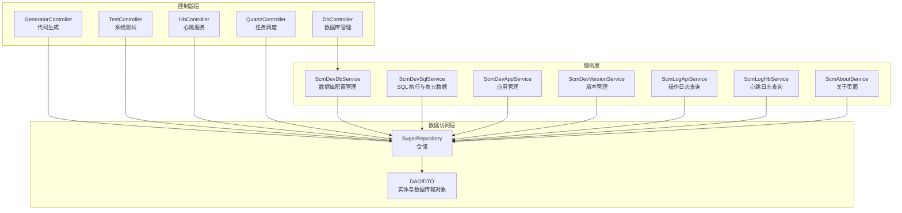
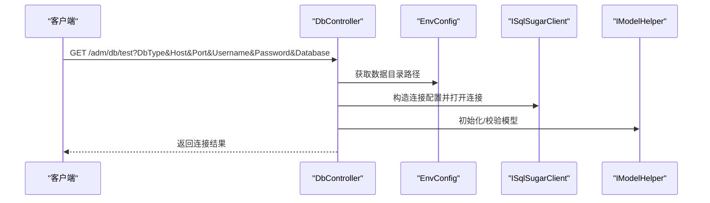
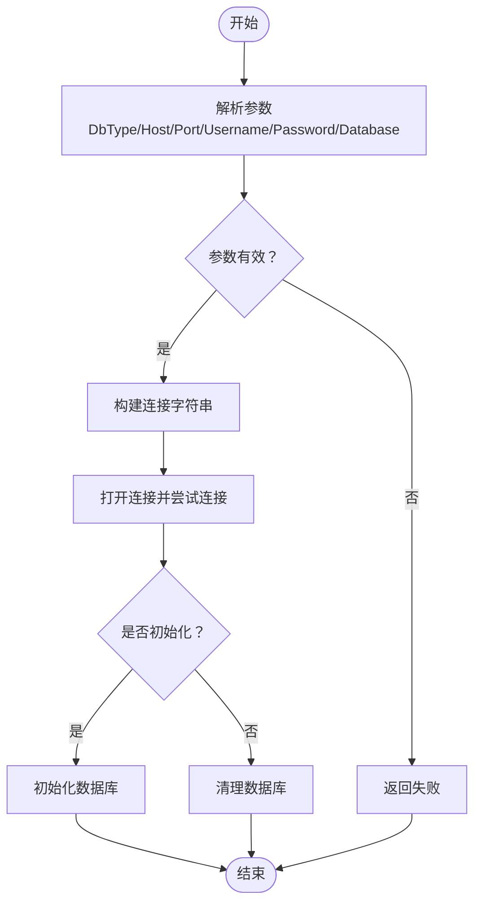
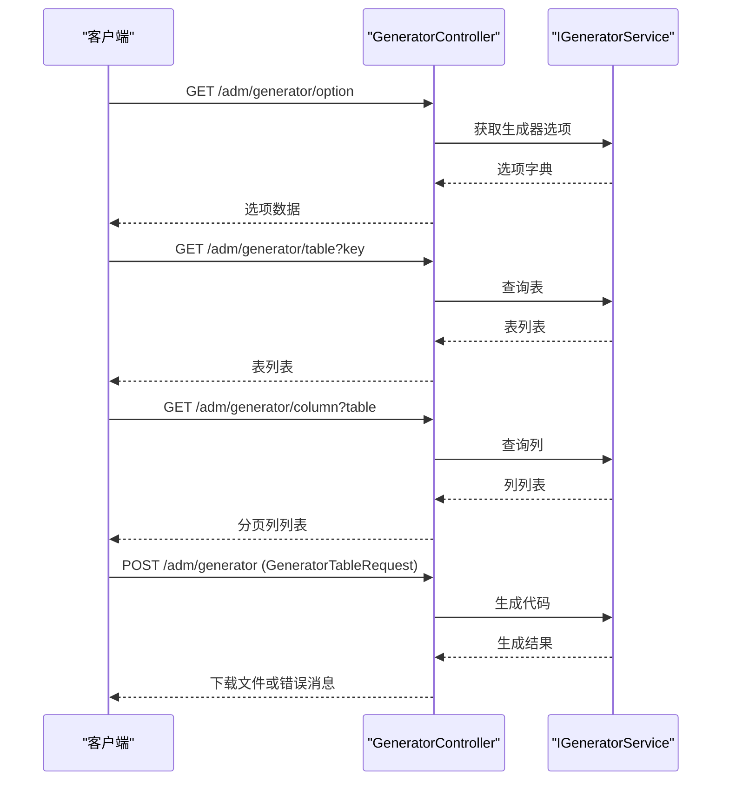
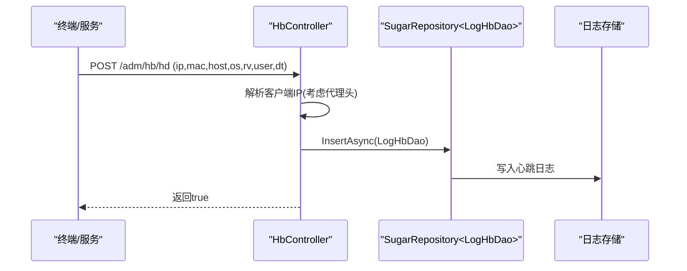
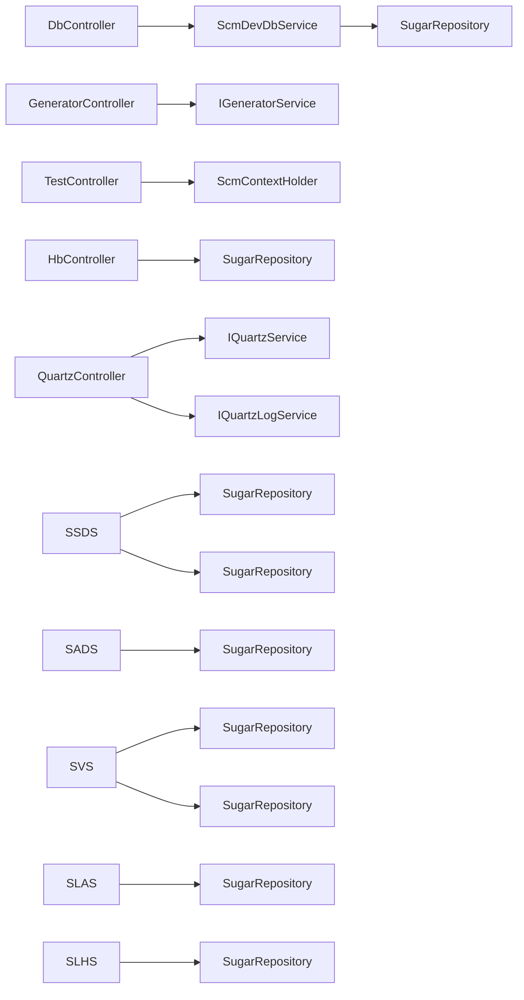

# 系统管理 API

<cite>
**本文引用的文件**
- [Scm.Net\Controllers\DbController.cs](file://Scm.Net/Controllers/DbController.cs)
- [Scm.Net\Controllers\GeneratorController.cs](file://Scm.Net/Controllers/GeneratorController.cs)
- [Scm.Net\Controllers\TestController.cs](file://Scm.Net/Controllers/TestController.cs)
- [Scm.Net\Controllers\HbController.cs](file://Scm.Net/Controllers/HbController.cs)
- [Scm.Net\Controllers\QuartzController.cs](file://Scm.Net/Controllers/QuartzController.cs)
- [Scm.Core\Dev\Db\ScmDevDbService.cs](file://Scm.Core/Dev/Db/ScmDevDbService.cs)
- [Scm.Core\Dev\Sql\ScmDevSqlService.cs](file://Scm.Core/Dev/Sql/ScmDevSqlService.cs)
- [Scm.Core\Dev\App\ScmDevAppService.cs](file://Scm.Core/Dev/App/ScmDevAppService.cs)
- [Scm.Core\Dev\Version\ScmDevVersionService.cs](file://Scm.Core/Dev/Version/ScmDevVersionService.cs)
- [Scm.Core\Log\Api\ScmLogApiService.cs](file://Scm.Core/Log/Api/ScmLogApiService.cs)
- [Scm.Core\Log\Hb\ScmLogHbService.cs](file://Scm.Core/Log/Hb/ScmLogHbService.cs)
- [Scm.Core\About\ScmAboutService.cs](file://Scm.Core/About/ScmAboutService.cs)
- [Nas.Dao\NasDbHelper.cs](file://Nas.Dao/NasDbHelper.cs)
</cite>

## 目录
1. [简介](#简介)
2. [项目结构](#项目结构)
3. [核心组件](#核心组件)
4. [架构总览](#架构总览)
5. [详细组件分析](#详细组件分析)
6. [依赖关系分析](#依赖关系分析)
7. [性能与安全考虑](#性能与安全考虑)
8. [故障排查指南](#故障排查指南)
9. [结论](#结论)
10. [附录](#附录)

## 简介
本文件为 Scm.Net 的“系统管理 API”提供完整、可操作的技术文档，覆盖数据库管理（连接测试、初始化、清理）、代码生成器（选项、表/列查询、生成与打包下载）、系统测试与健康检查（心跳、Echo）、性能与任务调度（Quartz 任务管理与日志）、运维日志查询、应用与版本管理、以及关于页面等能力。文档以接口清单、调用流程、数据模型、错误处理与最佳实践为主线，帮助开发者快速集成与维护。

## 项目结构
系统管理 API 主要由以下层次构成：
- 控制器层：面向外部请求的入口，负责参数解析、鉴权与响应封装
- 服务层：业务逻辑实现，封装数据访问与复杂流程
- 数据访问层：基于 SqlSugar 的仓储与 DAO
- 配置与工具：环境配置、日志、时间、枚举等通用能力

图示来源
- [Scm.Net\Controllers\DbController.cs:13-286](file://Scm.Net/Controllers/DbController.cs#L13-L286)
- [Scm.Net\Controllers\GeneratorController.cs:11-62](file://Scm.Net/Controllers/GeneratorController.cs#L11-L62)
- [Scm.Net\Controllers\TestController.cs:9-41](file://Scm.Net/Controllers/TestController.cs#L9-L41)
- [Scm.Net\Controllers\HbController.cs:11-128](file://Scm.Net/Controllers/HbController.cs#L11-L128)
- [Scm.Net\Controllers\QuartzController.cs:8-121](file://Scm.Net/Controllers/QuartzController.cs#L8-L121)
- [Scm.Core\Dev\Db\ScmDevDbService.cs:10-171](file://Scm.Core/Dev/Db/ScmDevDbService.cs#L10-L171)
- [Scm.Core\Dev\Sql\ScmDevSqlService.cs:10-322](file://Scm.Core/Dev/Sql/ScmDevSqlService.cs#L10-L322)
- [Scm.Core\Dev\App\ScmDevAppService.cs:11-196](file://Scm.Core/Dev/App/ScmDevAppService.cs#L11-L196)
- [Scm.Core\Dev\Version\ScmDevVersionService.cs:8-223](file://Scm.Core/Dev/Version/ScmDevVersionService.cs#L8-L223)
- [Scm.Core\Log\Api\ScmLogApiService.cs:9-159](file://Scm.Core/Log/Api/ScmLogApiService.cs#L9-L159)
- [Scm.Core\Log\Hb\ScmLogHbService.cs:9-125](file://Scm.Core/Log/Hb/ScmLogHbService.cs#L9-L125)
- [Scm.Core\About\ScmAboutService.cs:6-54](file://Scm.Core/About/ScmAboutService.cs#L6-L54)

章节来源
- [Scm.Net\Controllers\DbController.cs:13-286](file://Scm.Net/Controllers/DbController.cs#L13-L286)
- [Scm.Net\Controllers\GeneratorController.cs:11-62](file://Scm.Net/Controllers/GeneratorController.cs#L11-L62)
- [Scm.Net\Controllers\TestController.cs:9-41](file://Scm.Net/Controllers/TestController.cs#L9-L41)
- [Scm.Net\Controllers\HbController.cs:11-128](file://Scm.Net/Controllers/HbController.cs#L11-L128)
- [Scm.Net\Controllers\QuartzController.cs:8-121](file://Scm.Net/Controllers/QuartzController.cs#L8-L121)

## 核心组件
- 数据库管理控制器：提供数据库连接测试、初始化与清理能力
- 代码生成控制器：提供生成器选项、表/列元数据查询与代码生成下载
- 系统测试控制器：提供 Echo/Mime 测试接口
- 心跳控制器：提供终端心跳与第三方服务心跳上报
- 任务调度控制器：提供任务 CRUD、启动/暂停/立即执行、日志查询
- 服务层：封装数据库配置、SQL 执行、应用与版本管理、日志查询、关于页面等业务

章节来源
- [Scm.Net\Controllers\DbController.cs:13-286](file://Scm.Net/Controllers/DbController.cs#L13-L286)
- [Scm.Net\Controllers\GeneratorController.cs:11-62](file://Scm.Net/Controllers/GeneratorController.cs#L11-L62)
- [Scm.Net\Controllers\TestController.cs:9-41](file://Scm.Net/Controllers/TestController.cs#L9-L41)
- [Scm.Net\Controllers\HbController.cs:11-128](file://Scm.Net/Controllers/HbController.cs#L11-L128)
- [Scm.Net\Controllers\QuartzController.cs:8-121](file://Scm.Net/Controllers/QuartzController.cs#L8-L121)
- [Scm.Core\Dev\Db\ScmDevDbService.cs:10-171](file://Scm.Core/Dev/Db/ScmDevDbService.cs#L10-L171)
- [Scm.Core\Dev\Sql\ScmDevSqlService.cs:10-322](file://Scm.Core/Dev/Sql/ScmDevSqlService.cs#L10-L322)
- [Scm.Core\Dev\App\ScmDevAppService.cs:11-196](file://Scm.Core/Dev/App/ScmDevAppService.cs#L11-L196)
- [Scm.Core\Dev\Version\ScmDevVersionService.cs:8-223](file://Scm.Core/Dev/Version/ScmDevVersionService.cs#L8-L223)
- [Scm.Core\Log\Api\ScmLogApiService.cs:9-159](file://Scm.Core/Log/Api/ScmLogApiService.cs#L9-L159)
- [Scm.Core\Log\Hb\ScmLogHbService.cs:9-125](file://Scm.Core/Log/Hb/ScmLogHbService.cs#L9-L125)
- [Scm.Core\About\ScmAboutService.cs:6-54](file://Scm.Core/About/ScmAboutService.cs#L6-L54)

## 架构总览
系统管理 API 采用分层架构，控制器仅负责路由与参数绑定，业务逻辑集中在服务层，数据访问通过仓储抽象统一管理。日志、时间、枚举等通用能力在公共模块中复用。

图示来源
- [Scm.Net\Controllers\DbController.cs:29-213](file://Scm.Net/Controllers/DbController.cs#L29-L213)

## 详细组件分析

### 数据库管理 API
- 接口目标：验证数据库连接、初始化/清理数据库
- 关键点：支持多数据库类型（MySQL、SQLServer、SQLite、Oracle、PostgreSQL、DB2、DM），动态拼接连接字符串，捕获异常并返回友好提示

接口清单
- GET /adm/db/test
  - 功能：测试数据库连接
  - 参数：DbType、Host、Port、Username、Password、Database
  - 响应：成功/失败消息
  - 注意事项：参数校验严格，端口需为整数；不同数据库类型使用不同的连接串格式
  - 参考路径：[DbController.TestAsync:29-213](file://Scm.Net/Controllers/DbController.cs#L29-L213)

- GET /adm/db/init
  - 功能：初始化数据库（含系统、示例、NAS）
  - 参数：无
  - 响应：成功/失败消息
  - 参考路径：[DbController.GetInitAsync:247-274](file://Scm.Net/Controllers/DbController.cs#L247-L274)

- GET /adm/db/drop
  - 功能：清理数据库（含系统、示例、NAS）
  - 参数：无
  - 响应：成功/失败消息
  - 参考路径：[DbController.GetDropAsync:215-242](file://Scm.Net/Controllers/DbController.cs#L215-L242)

图示来源
- [Scm.Net\Controllers\DbController.cs:29-274](file://Scm.Net/Controllers/DbController.cs#L29-L274)

章节来源
- [Scm.Net\Controllers\DbController.cs:29-274](file://Scm.Net/Controllers/DbController.cs#L29-L274)
- [Nas.Dao\NasDbHelper.cs:19-51](file://Nas.Dao/NasDbHelper.cs#L19-L51)

### 代码生成器 API
- 接口目标：提供生成器选项、表/列元数据查询、批量生成并打包下载
- 关键点：支持按表生成代码，生成完成后可直接下载压缩包或返回提示

接口清单
- GET /adm/generator/option
  - 功能：获取生成器可用选项
  - 参数：无
  - 响应：字典结构（键为选项名，值为可选值列表）
  - 参考路径：[GeneratorController.OptionAsync:26-30](file://Scm.Net/Controllers/GeneratorController.cs#L26-L30)

- GET /adm/generator/table?key
  - 功能：按关键字查询数据库中的表
  - 参数：key（可选）
  - 响应：表信息列表
  - 参考路径：[GeneratorController.TableAsync:32-36](file://Scm.Net/Controllers/GeneratorController.cs#L32-L36)

- GET /adm/generator/column?table
  - 功能：查询指定表的列信息
  - 参数：table（表名）
  - 响应：分页包装的列信息列表
  - 参考路径：[GeneratorController.ColumnAsync:39-46](file://Scm.Net/Controllers/GeneratorController.cs#L39-L46)

- POST /adm/generator
  - 功能：生成代码并返回下载链接或提示
  - 请求体：GeneratorTableRequest（包含表名、模板、输出目录等）
  - 响应：下载文件或错误消息
  - 参考路径：[GeneratorController.Post:48-61](file://Scm.Net/Controllers/GeneratorController.cs#L48-L61)

图示来源
- [Scm.Net\Controllers\GeneratorController.cs:26-61](file://Scm.Net/Controllers/GeneratorController.cs#L26-L61)

章节来源
- [Scm.Net\Controllers\GeneratorController.cs:26-61](file://Scm.Net/Controllers/GeneratorController.cs#L26-L61)

### 系统测试 API
- 接口目标：提供简单 Echo/Mime 测试，便于联调与验证
- 关键点：从上下文获取终端标识，返回给客户端

接口清单
- POST /adm/test/Echo
  - 功能：回显终端标识
  - 请求体：ScmRequest
  - 响应：包含 terminal_id 的数据响应
  - 参考路径：[TestController.PostEcho:19-28](file://Scm.Net/Controllers/TestController.cs#L19-L28)

- POST /adm/test/Mime
  - 功能：同上，用于验证 MIME 类型
  - 参考路径：[TestController.MimeAsync:30-39](file://Scm.Net/Controllers/TestController.cs#L30-L39)

章节来源
- [Scm.Net\Controllers\TestController.cs:19-39](file://Scm.Net/Controllers/TestController.cs#L19-L39)

### 心跳服务 API
- 接口目标：接收终端与第三方服务的心跳上报，记录日志
- 关键点：支持匿名访问与审计日志豁免；自动解析客户端 IP（考虑代理头）

接口清单
- GET /adm/hb/Echo?msg
  - 功能：回显消息
  - 参数：msg
  - 响应：原样返回的消息
  - 参考路径：[HbController.GetEcho:29-34](file://Scm.Net/Controllers/HbController.cs#L29-L34)

- POST /adm/hb/hd
  - 功能：终端设备心跳上报
  - 表单参数：ip、ma、hn、os、rv、un、dt
  - 响应：布尔值
  - 参考路径：[HbController.HdAsync:47-74](file://Scm.Net/Controllers/HbController.cs#L47-L74)

- POST /adm/hb/ts
  - 功能：第三方服务心跳上报
  - 表单参数：ip、ma、hn、os、rv、un、dt
  - 响应：布尔值
  - 参考路径：[HbController.TsAsync:87-114](file://Scm.Net/Controllers/HbController.cs#L87-L114)

图示来源
- [Scm.Net\Controllers\HbController.cs:47-74](file://Scm.Net/Controllers/HbController.cs#L47-L74)

章节来源
- [Scm.Net\Controllers\HbController.cs:29-114](file://Scm.Net/Controllers/HbController.cs#L29-L114)

### 任务调度 API（Quartz）
- 接口目标：对定时任务进行增删改查、启动/暂停/立即执行、查询执行日志
- 关键点：任务状态枚举与处理动作分离，日志分页查询

接口清单
- GET /adm/quartz/job
  - 功能：执行任务测试
  - 响应：Success 字符串
  - 参考路径：[QuartzController.TestJob:26-31](file://Scm.Net/Controllers/QuartzController.cs#L26-L31)

- GET /adm/quartz
  - 功能：获取任务列表
  - 响应：任务集合
  - 参考路径：[QuartzController.Get:37-42](file://Scm.Net/Controllers/QuartzController.cs#L37-L42)

- POST /adm/quartz
  - 功能：新建任务
  - 请求体：QuarzTaskJobDao
  - 响应：新增任务数据（默认暂停）
  - 参考路径：[QuartzController.Post:48-54](file://Scm.Net/Controllers/QuartzController.cs#L48-L54)

- PUT /adm/quartz/start
  - 功能：启动任务
  - 请求体：QuarzTaskJobDao
  - 响应：任务状态变更结果
  - 参考路径：[QuartzController.PutStartJob:60-65](file://Scm.Net/Controllers/QuartzController.cs#L60-L65)

- PUT /adm/quartz/pause
  - 功能：暂停任务
  - 请求体：QuarzTaskJobDao
  - 响应：任务状态变更结果
  - 参考路径：[QuartzController.PutPauseJob:71-76](file://Scm.Net/Controllers/QuartzController.cs#L71-L76)

- PUT /adm/quartz/run
  - 功能：立即执行任务
  - 请求体：QuarzTaskJobDao
  - 响应：执行结果
  - 参考路径：[QuartzController.PutRunJob:82-87](file://Scm.Net/Controllers/QuartzController.cs#L82-L87)

- PUT /adm/quartz
  - 功能：修改任务
  - 请求体：QuarzTaskJobDao
  - 响应：更新结果
  - 参考路径：[QuartzController.Put:93-98](file://Scm.Net/Controllers/QuartzController.cs#L93-L98)

- PUT /adm/quartz/delete
  - 功能：删除任务
  - 请求体：QuarzTaskJobDao
  - 响应：删除结果
  - 参考路径：[QuartzController.PutDelete:104-109](file://Scm.Net/Controllers/QuartzController.cs#L104-L109)

- GET /adm/quartz/log?taskName&groupName&current&size
  - 功能：获取任务执行日志
  - 响应：日志分页数据
  - 参考路径：[QuartzController.GetLogAsync:115-120](file://Scm.Net/Controllers/QuartzController.cs#L115-L120)

章节来源
- [Scm.Net\Controllers\QuartzController.cs:26-121](file://Scm.Net/Controllers/QuartzController.cs#L26-L121)

### 运维日志查询 API
- 接口目标：查询操作日志与心跳日志，支持按时间范围、级别、类型过滤，支持清空日志
- 关键点：日志图表统计近 15 天各等级数量趋势

接口清单
- GET /log/api
  - 功能：分页查询操作日志
  - 参数：times、Level、Type、page、limit
  - 响应：分页日志列表（含级别名称映射）
  - 参考路径：[ScmLogApiService.GetPagesAsync:33-57](file://Scm.Core/Log/Api/ScmLogApiService.cs#L33-L57)

- GET /log/api/chart
  - 功能：生成近 15 天日志级别统计图表数据
  - 响应：时间轴与各级别计数数组
  - 参考路径：[ScmLogApiService.GetChartAsync:63-105](file://Scm.Core/Log/Api/ScmLogApiService.cs#L63-L105)

- GET /log/api/{id}
  - 功能：按主键查询操作日志详情
  - 响应：日志详情
  - 参考路径：[ScmLogApiService.GetAsync:112-117](file://Scm.Core/Log/Api/ScmLogApiService.cs#L112-L117)

- DELETE /log/api
  - 功能：删除指定日志（支持批量）
  - 参数：ids（逗号分隔）
  - 响应：删除结果
  - 参考路径：[ScmLogApiService.DeleteAsync:144-148](file://Scm.Core/Log/Api/ScmLogApiService.cs#L144-L148)

- DELETE /log/api/clear
  - 功能：清空所有日志
  - 响应：清空结果
  - 参考路径：[ScmLogApiService.ClearAsync:154-158](file://Scm.Core/Log/Api/ScmLogApiService.cs#L154-L158)

- GET /log/hb
  - 功能：分页查询心跳日志
  - 响应：分页心跳日志列表
  - 参考路径：[ScmLogHbService.GetPagesAsync:35-46](file://Scm.Core/Log/Hb/ScmLogHbService.cs#L35-L46)

- GET /log/hb/{id}
  - 功能：按主键查询心跳日志详情
  - 响应：心跳日志详情
  - 参考路径：[ScmLogHbService.GetAsync:78-83](file://Scm.Core/Log/Hb/ScmLogHbService.cs#L78-L83)

章节来源
- [Scm.Core\Log\Api\ScmLogApiService.cs:33-158](file://Scm.Core/Log/Api/ScmLogApiService.cs#L33-L158)
- [Scm.Core\Log\Hb\ScmLogHbService.cs:35-125](file://Scm.Core/Log/Hb/ScmLogHbService.cs#L35-L125)

### 应用与版本管理 API
- 接口目标：管理开发应用、版本信息，支持分页、下拉选项、设置当前版本等
- 关键点：应用编码/名称唯一性校验，版本当前标记一致性更新

接口清单
- GET /dev/app/option?types
  - 功能：获取应用下拉选项
  - 响应：选项列表
  - 参考路径：[ScmDevAppService.OptionAsync:74-82](file://Scm.Core/Dev/App/ScmDevAppService.cs#L74-L82)

- GET /dev/app/{id}
  - 功能：按主键查询应用详情
  - 响应：应用详情
  - 参考路径：[ScmDevAppService.GetAsync:88-94](file://Scm.Core/Dev/App/ScmDevAppService.cs#L88-L94)

- GET /dev/version
  - 功能：分页查询版本头信息
  - 响应：分页版本列表
  - 参考路径：[ScmDevVersionService.GetPagesAsync:34-45](file://Scm.Core/Dev/Version/ScmDevVersionService.cs#L34-L45)

- GET /dev/version/list?code
  - 功能：按应用编码查询版本列表
  - 响应：版本列表
  - 参考路径：[ScmDevVersionService.GetListAsync:52-76](file://Scm.Core/Dev/Version/ScmDevVersionService.cs#L52-L76)

- GET /dev/version/current/{id}
  - 功能：设置某应用某客户端的当前版本
  - 响应：设置结果
  - 参考路径：[ScmDevVersionService.CurrentAsync:165-178](file://Scm.Core/Dev/Version/ScmDevVersionService.cs#L165-L178)

- GET /dev/version/getver
  - 功能：获取指定应用与客户端的当前版本及明细
  - 响应：版本头及明细
  - 参考路径：[ScmDevVersionService.GetVerAsync:185-201](file://Scm.Core/Dev/Version/ScmDevVersionService.cs#L185-L201)

章节来源
- [Scm.Core\Dev\App\ScmDevAppService.cs:74-196](file://Scm.Core/Dev/App/ScmDevAppService.cs#L74-L196)
- [Scm.Core\Dev\Version\ScmDevVersionService.cs:34-201](file://Scm.Core/Dev/Version/ScmDevVersionService.cs#L34-L201)

### 关于页面 API
- 接口目标：按应用与分区加载静态文本内容
- 关键点：优先加载指定应用下的内容，否则回退到通用分区或默认文件

接口清单
- GET /about/info?code&section
  - 功能：获取关于信息
  - 响应：文本内容
  - 参考路径：[ScmAboutService.GetInfoAsync:29-52](file://Scm.Core/About/ScmAboutService.cs#L29-L52)

章节来源
- [Scm.Core\About\ScmAboutService.cs:29-52](file://Scm.Core/About/ScmAboutService.cs#L29-L52)

## 依赖关系分析
- 控制器依赖服务层；服务层依赖仓储与 DAO；DAO 依赖 SqlSugar 客户端
- 日志服务依赖仓储与时间工具；心跳控制器依赖仓储与 IP 解析工具
- 代码生成器依赖生成器服务与配置；数据库管理依赖环境配置与模型助手

图示来源
- [Scm.Net\Controllers\DbController.cs:16-27](file://Scm.Net/Controllers/DbController.cs#L16-L27)
- [Scm.Net\Controllers\GeneratorController.cs:17-24](file://Scm.Net/Controllers/GeneratorController.cs#L17-L24)
- [Scm.Net\Controllers\HbController.cs:17-22](file://Scm.Net/Controllers/HbController.cs#L17-L22)
- [Scm.Net\Controllers\QuartzController.cs:13-20](file://Scm.Net/Controllers/QuartzController.cs#L13-L20)
- [Scm.Core\Dev\Db\ScmDevDbService.cs:16-27](file://Scm.Core/Dev/Db/ScmDevDbService.cs#L16-L27)
- [Scm.Core\Dev\Sql\ScmDevSqlService.cs:18-29](file://Scm.Core/Dev/Sql/ScmDevSqlService.cs#L18-L29)
- [Scm.Core\Dev\App\ScmDevAppService.cs:19-29](file://Scm.Core/Dev/App/ScmDevAppService.cs#L19-L29)
- [Scm.Core\Dev\Version\ScmDevVersionService.cs:16-27](file://Scm.Core/Dev/Version/ScmDevVersionService.cs#L16-L27)
- [Scm.Core\Log\Api\ScmLogApiService.cs:17-26](file://Scm.Core/Log/Api/ScmLogApiService.cs#L17-L26)
- [Scm.Core\Log\Hb\ScmLogHbService.cs:17-28](file://Scm.Core/Log/Hb/ScmLogHbService.cs#L17-L28)

章节来源
- [Scm.Net\Controllers\DbController.cs:16-27](file://Scm.Net/Controllers/DbController.cs#L16-L27)
- [Scm.Net\Controllers\GeneratorController.cs:17-24](file://Scm.Net/Controllers/GeneratorController.cs#L17-L24)
- [Scm.Net\Controllers\HbController.cs:17-22](file://Scm.Net/Controllers/HbController.cs#L17-L22)
- [Scm.Net\Controllers\QuartzController.cs:13-20](file://Scm.Net/Controllers/QuartzController.cs#L13-L20)
- [Scm.Core\Dev\Db\ScmDevDbService.cs:16-27](file://Scm.Core/Dev/Db/ScmDevDbService.cs#L16-L27)
- [Scm.Core\Dev\Sql\ScmDevSqlService.cs:18-29](file://Scm.Core/Dev/Sql/ScmDevSqlService.cs#L18-L29)
- [Scm.Core\Dev\App\ScmDevAppService.cs:19-29](file://Scm.Core/Dev/App/ScmDevAppService.cs#L19-L29)
- [Scm.Core\Dev\Version\ScmDevVersionService.cs:16-27](file://Scm.Core/Dev/Version/ScmDevVersionService.cs#L16-L27)
- [Scm.Core\Log\Api\ScmLogApiService.cs:17-26](file://Scm.Core/Log/Api/ScmLogApiService.cs#L17-L26)
- [Scm.Core\Log\Hb\ScmLogHbService.cs:17-28](file://Scm.Core/Log/Hb/ScmLogHbService.cs#L17-L28)

## 性能与安全考虑
- 数据库连接
  - 使用 ISqlSugarClient 连接池化配置，避免频繁创建销毁连接
  - 对不同数据库类型采用合适的连接串参数，确保超时与池大小合理
- SQL 执行
  - SELECT 语句自动计算总数并支持分页，避免一次性返回大量数据
  - 对非 SELECT 语句直接返回影响行数，减少内存占用
- 代码生成
  - 生成完成后可直接下载压缩包，避免在内存中堆积大文件
- 心跳与日志
  - 心跳接口允许匿名访问且不写审计日志，降低开销
  - 日志查询支持时间范围与级别过滤，避免全表扫描
- 安全
  - 部分接口标注 AllowAnonymous，谨慎使用于内部管理场景
  - 对外暴露的接口建议配合网关或中间件进行限流与鉴权

[本节为通用指导，无需列出具体文件来源]

## 故障排查指南
- 数据库连接失败
  - 检查 DbType 是否受支持，Host/Port/Username/Database 是否正确
  - 查看异常消息，确认连接串拼接与数据库服务可达性
  - 参考路径：[DbController.TestAsync:199-212](file://Scm.Net/Controllers/DbController.cs#L199-L212)
- SQL 执行异常
  - 确认 SQL 语法与目标库兼容性；SELECT 语句注意 limit/page 的使用
  - 参考路径：[ScmDevSqlService.DoExecute:234-296](file://Scm.Core/Dev/Sql/ScmDevSqlService.cs#L234-L296)
- 代码生成失败
  - 检查表名与模板选择；确认生成器配置与输出目录权限
  - 参考路径：[GeneratorController.Post:48-61](file://Scm.Net/Controllers/GeneratorController.cs#L48-L61)
- 心跳上报异常
  - 检查代理头与客户端 IP 解析；确认日志表结构与字段
  - 参考路径：[HbController.GetClientIP:116-127](file://Scm.Net/Controllers/HbController.cs#L116-L127)
- 任务调度问题
  - 检查任务状态与触发器配置；查看任务日志分页查询
  - 参考路径：[QuartzController.GetLogAsync:115-120](file://Scm.Net/Controllers/QuartzController.cs#L115-L120)

章节来源
- [Scm.Net\Controllers\DbController.cs:199-212](file://Scm.Net/Controllers/DbController.cs#L199-L212)
- [Scm.Core\Dev\Sql\ScmDevSqlService.cs:234-296](file://Scm.Core/Dev/Sql/ScmDevSqlService.cs#L234-L296)
- [Scm.Net\Controllers\GeneratorController.cs:48-61](file://Scm.Net/Controllers/GeneratorController.cs#L48-L61)
- [Scm.Net\Controllers\HbController.cs:116-127](file://Scm.Net/Controllers/HbController.cs#L116-L127)
- [Scm.Net\Controllers\QuartzController.cs:115-120](file://Scm.Net/Controllers/QuartzController.cs#L115-L120)

## 结论
本系统管理 API 提供了数据库管理、代码生成、系统测试、心跳服务、任务调度、日志查询与版本管理等关键运维能力。通过清晰的分层设计与统一的仓储抽象，接口具备良好的扩展性与可维护性。建议在生产环境中结合网关与中间件完善鉴权、限流与审计策略，确保系统稳定与安全。

[本节为总结性内容，无需列出具体文件来源]

## 附录
- 使用示例与注意事项
  - 数据库连接测试：传入 DbType、Host、Port、Username、Password、Database，收到成功/失败消息
  - 代码生成：先调用 option/table/column 获取元数据，再提交生成请求，最后下载压缩包
  - 心跳上报：终端与第三方服务分别调用 hd/ts 接口，携带必要参数
  - 任务管理：先创建任务，再根据需要启动/暂停/立即执行，定期查询日志
  - 日志查询：按时间范围与级别筛选，必要时清空历史日志
- 最佳实践
  - 在开发环境使用 init 初始化数据库，在生产环境谨慎使用 drop
  - 生成代码前先预览表/列信息，避免误操作
  - 心跳与日志接口建议配合监控系统进行可视化展示
  - 版本管理中保持当前版本一致性，避免客户端使用过期版本

[本节为通用指导，无需列出具体文件来源]