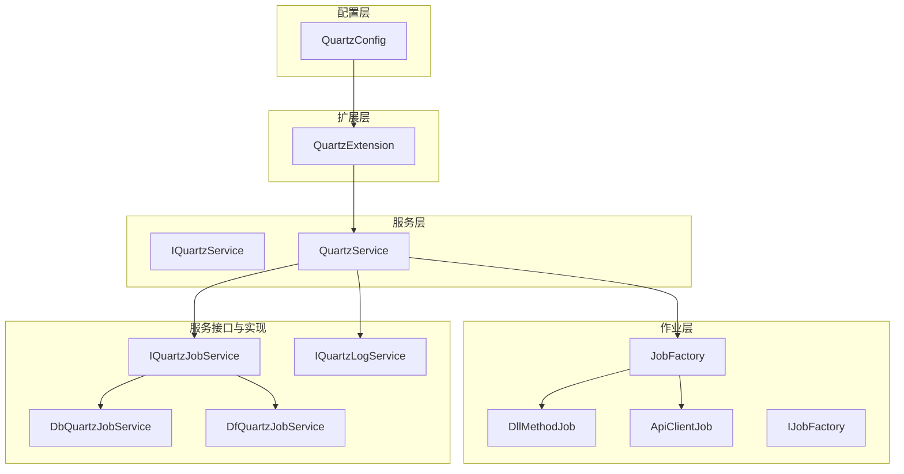
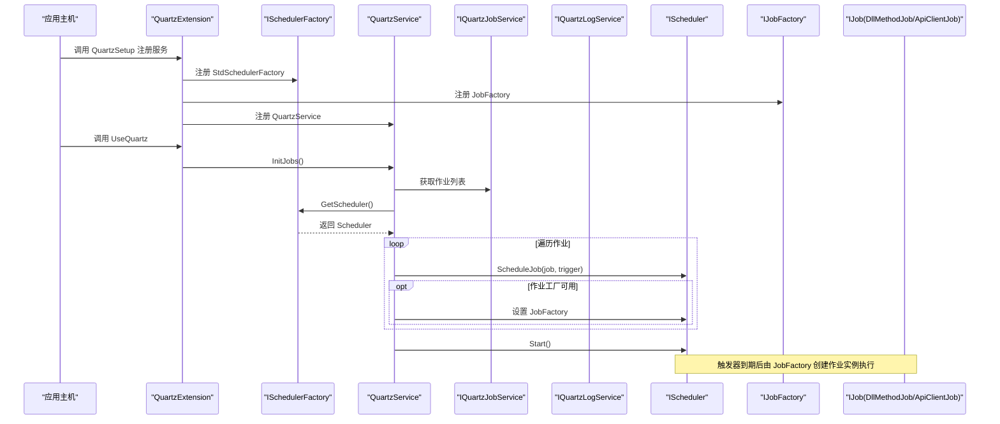
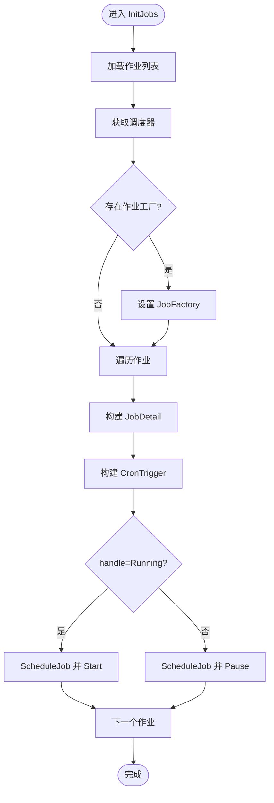
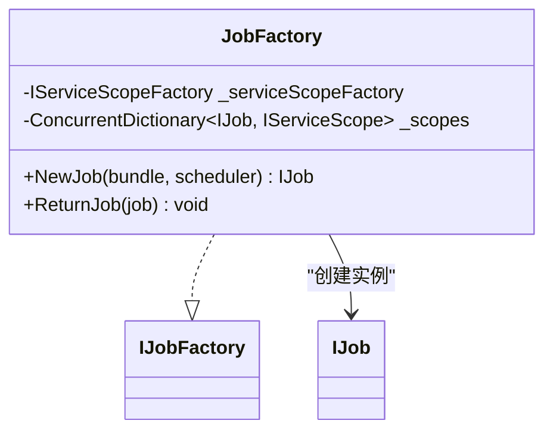
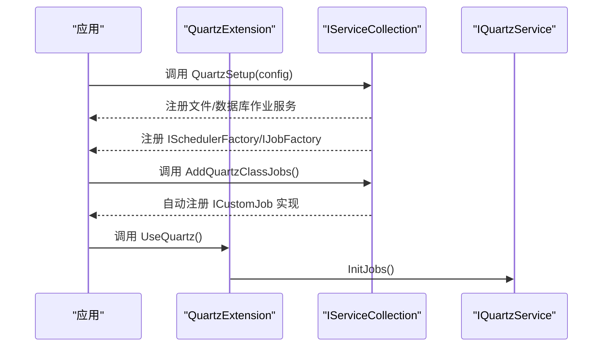
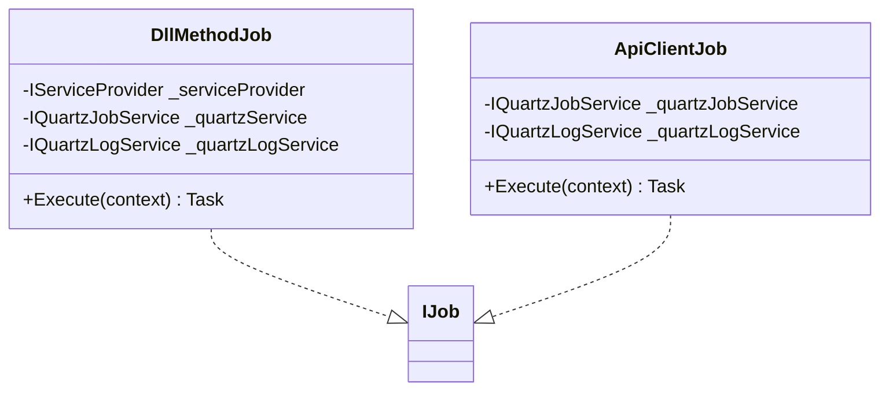
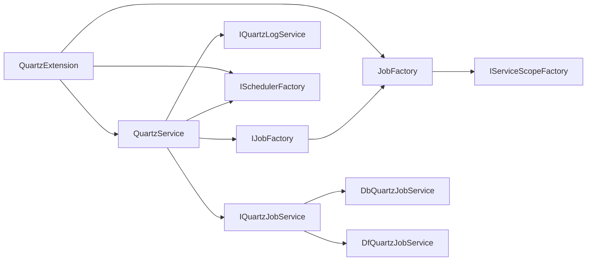

# Quartz 集成架构

<cite>
**本文引用的文件**
- [QuartzService.cs](file://Scm.Server.Quartz/QuartzService.cs)
- [JobFactory.cs](file://Scm.Server.Quartz/JobFactory.cs)
- [QuartzConfig.cs](file://Scm.Server.Quartz/Config/QuartzConfig.cs)
- [QuartzExtension.cs](file://Scm.Server.Quartz/QuartzExtension.cs)
- [IQuartzService.cs](file://Scm.Server.Quartz/IQuartzService.cs)
- [DllMethodJob.cs](file://Scm.Server.Quartz/Jobs/DllMethodJob.cs)
- [ApiClientJob.cs](file://Scm.Server.Quartz/Jobs/ApiClientJob.cs)
- [ICustomJob.cs](file://Scm.Server.Quartz/ICustomJob.cs)
- [JobResult.cs](file://Scm.Server.Quartz/JobResult.cs)
- [IQuartzJobService.cs](file://Scm.Server.Quartz/Service/IQuartzJobService.cs)
- [IQuartzLogService.cs](file://Scm.Server.Quartz/Service/IQuartzLogService.cs)
- [DbQuartzJobService.cs](file://Scm.Server.Quartz/Service/Db/DbQuartzJobService.cs)
- [DfQuartzJobService.cs](file://Scm.Server.Quartz/Service/Df/DfQuartzJobService.cs)
</cite>

## 目录
1. [简介](#简介)
2. [项目结构](#项目结构)
3. [核心组件](#核心组件)
4. [架构总览](#架构总览)
5. [详细组件分析](#详细组件分析)
6. [依赖关系分析](#依赖关系分析)
7. [性能考虑](#性能考虑)
8. [故障排查指南](#故障排查指南)
9. [结论](#结论)
10. [附录](#附录)

## 简介
本文件面向 Scm.Net 中基于 Quartz.NET 的任务调度集成，系统性阐述 QuartzService 服务的核心架构设计、JobFactory 工厂模式的应用、调度器工厂的配置管理等关键组件。重点覆盖调度器初始化流程、作业工厂的依赖注入机制、与 ASP.NET Core 依赖注入容器的集成方式；提供 Quartz 配置参数说明（连接池、线程、持久化等）；总结调度器生命周期管理、作业注册机制与错误处理策略，并给出性能优化建议与最佳实践。

## 项目结构
围绕 Quartz 的集成位于 Scm.Server.Quartz 子项目，主要由以下层次构成：
- 配置层：QuartzConfig 负责解析与准备 Quartz 运行所需路径与文件
- 扩展层：QuartzExtension 提供依赖注入扩展方法，完成服务注册与中间件启动
- 服务层：IQuartzService 接口与 QuartzService 实现，封装调度器操作与作业生命周期管理
- 作业层：DllMethodJob 与 ApiClientJob 实现 IJob，分别执行本地服务与远程 API
- 工厂层：JobFactory 实现 IJobFactory，负责作业实例的生命周期与作用域管理
- 服务接口与实现：IQuartzJobService/IQuartzLogService 及其文件/数据库两种实现
- 辅助类型：JobResult、ICustomJob 等

图表来源
- [QuartzExtension.cs:17-42](file://Scm.Server.Quartz/QuartzExtension.cs#L17-L42)
- [QuartzService.cs:13-29](file://Scm.Server.Quartz/QuartzService.cs#L13-L29)
- [JobFactory.cs:8-40](file://Scm.Server.Quartz/JobFactory.cs#L8-L40)
- [IQuartzJobService.cs:9-38](file://Scm.Server.Quartz/Service/IQuartzJobService.cs#L9-L38)
- [DbQuartzJobService.cs:10-62](file://Scm.Server.Quartz/Service/Db/DbQuartzJobService.cs#L10-L62)
- [DfQuartzJobService.cs:10-122](file://Scm.Server.Quartz/Service/Df/DfQuartzJobService.cs#L10-L122)

章节来源
- [QuartzExtension.cs:17-42](file://Scm.Server.Quartz/QuartzExtension.cs#L17-L42)
- [QuartzConfig.cs:40-79](file://Scm.Server.Quartz/Config/QuartzConfig.cs#L40-L79)

## 核心组件
- QuartzService：调度器与作业生命周期的统一入口，负责初始化、增删改查、启停、立即执行、校验 Cron 表达式等
- JobFactory：实现 IJobFactory，基于 IServiceScopeFactory 为每个作业创建独立作用域，确保 DI 解析与资源释放
- QuartzExtension：提供 QuartzSetup 与 UseQuartz 扩展，完成服务注册与应用启动时的初始化
- QuartzConfig：集中管理 Quartz 的运行参数（类型、连接串、文件/目录等），并负责路径准备
- 作业实现：DllMethodJob（本地服务调用）、ApiClientJob（HTTP 请求）
- 服务接口与实现：IQuartzJobService/IQuartzLogService 及 Db/Df 两套实现

章节来源
- [IQuartzService.cs:8-77](file://Scm.Server.Quartz/IQuartzService.cs#L8-L77)
- [QuartzService.cs:13-152](file://Scm.Server.Quartz/QuartzService.cs#L13-L152)
- [JobFactory.cs:8-40](file://Scm.Server.Quartz/JobFactory.cs#L8-L40)
- [QuartzExtension.cs:17-92](file://Scm.Server.Quartz/QuartzExtension.cs#L17-L92)
- [QuartzConfig.cs:6-79](file://Scm.Server.Quartz/Config/QuartzConfig.cs#L6-L79)
- [DllMethodJob.cs:14-94](file://Scm.Server.Quartz/Jobs/DllMethodJob.cs#L14-L94)
- [ApiClientJob.cs:14-102](file://Scm.Server.Quartz/Jobs/ApiClientJob.cs#L14-L102)
- [IQuartzJobService.cs:9-38](file://Scm.Server.Quartz/Service/IQuartzJobService.cs#L9-L38)
- [IQuartzLogService.cs:8-16](file://Scm.Server.Quartz/Service/IQuartzLogService.cs#L8-L16)

## 架构总览
下图展示从应用启动到调度器初始化、作业注册与执行的关键交互：

图表来源
- [QuartzExtension.cs:17-42](file://Scm.Server.Quartz/QuartzExtension.cs#L17-L42)
- [QuartzService.cs:98-152](file://Scm.Server.Quartz/QuartzService.cs#L98-L152)
- [JobFactory.cs:18-31](file://Scm.Server.Quartz/JobFactory.cs#L18-L31)

## 详细组件分析

### QuartzService：调度器与作业生命周期管理
- 依赖注入：接收 ISchedulerFactory、IJobFactory、IQuartzJobService、IQuartzLogService
- 初始化：从 IQuartzJobService 获取作业，按 Cron 表达式构建 IJobDetail 与 ITrigger，根据 handle 决定是否立即启动
- 作业管理：支持添加、删除、更新、暂停、恢复、立即执行、Cron 表达式校验
- 与日志联动：每次作业执行前后记录日志，便于追踪与审计
- 错误处理：捕获异常并写入日志，保证调度器稳定运行

图表来源
- [QuartzService.cs:98-152](file://Scm.Server.Quartz/QuartzService.cs#L98-L152)

章节来源
- [QuartzService.cs:13-152](file://Scm.Server.Quartz/QuartzService.cs#L13-L152)

### JobFactory：作业工厂与作用域管理
- 通过 IServiceScopeFactory 为每个作业创建独立作用域
- 在 NewJob 时解析作业类型并注入到 IJob 实例
- 在 ReturnJob 时释放作用域，避免内存泄漏
- 与 Quartz 的 IJobFactory 接口对接，确保作业生命周期可控

图表来源
- [JobFactory.cs:8-40](file://Scm.Server.Quartz/JobFactory.cs#L8-L40)

章节来源
- [JobFactory.cs:8-40](file://Scm.Server.Quartz/JobFactory.cs#L8-L40)

### QuartzExtension：依赖注入与启动初始化
- QuartzSetup：根据配置选择文件或数据库模式，注册作业实现与服务接口，注册 ISchedulerFactory、IJobFactory、IQuartzService
- AddQuartzClassJobs：扫描程序集，自动发现并注册实现 ICustomJob 的类型
- UseQuartz：应用启动时创建 IQuartzService 作用域并调用 InitJobs 初始化

图表来源
- [QuartzExtension.cs:17-92](file://Scm.Server.Quartz/QuartzExtension.cs#L17-L92)

章节来源
- [QuartzExtension.cs:17-92](file://Scm.Server.Quartz/QuartzExtension.cs#L17-L92)

### QuartzConfig：配置参数与路径准备
- 支持 Type=file/db 两种模式
- 提供连接串、作业文件、基础目录、数据目录、日志目录等参数
- Prepare 方法根据环境配置生成实际路径并创建目录

章节来源
- [QuartzConfig.cs:6-79](file://Scm.Server.Quartz/Config/QuartzConfig.cs#L6-L79)

### 作业实现：DllMethodJob 与 ApiClientJob
- DllMethodJob：从 IServiceProvider 获取 ICustomJob 实例，按类型全名执行 ExecuteService
- ApiClientJob：读取 api_uri、api_method、api_headers、api_parameter，发起 HTTP 请求并将结果写入日志
- 两者均实现 IJob，由 JobFactory 创建并在触发器到期时执行

图表来源
- [DllMethodJob.cs:14-94](file://Scm.Server.Quartz/Jobs/DllMethodJob.cs#L14-L94)
- [ApiClientJob.cs:14-102](file://Scm.Server.Quartz/Jobs/ApiClientJob.cs#L14-L102)

章节来源
- [DllMethodJob.cs:14-94](file://Scm.Server.Quartz/Jobs/DllMethodJob.cs#L14-L94)
- [ApiClientJob.cs:14-102](file://Scm.Server.Quartz/Jobs/ApiClientJob.cs#L14-L102)

### 服务接口与实现：IQuartzJobService/IQuartzLogService
- IQuartzJobService：定义作业的增删改查
- IQuartzLogService：定义日志查询与写入
- DbQuartzJobService：基于 SqlSugar 的数据库实现
- DfQuartzJobService：基于文件的实现，负责序列化/反序列化与文件写入

章节来源
- [IQuartzJobService.cs:9-38](file://Scm.Server.Quartz/Service/IQuartzJobService.cs#L9-L38)
- [IQuartzLogService.cs:8-16](file://Scm.Server.Quartz/Service/IQuartzLogService.cs#L8-L16)
- [DbQuartzJobService.cs:10-62](file://Scm.Server.Quartz/Service/Db/DbQuartzJobService.cs#L10-L62)
- [DfQuartzJobService.cs:10-122](file://Scm.Server.Quartz/Service/Df/DfQuartzJobService.cs#L10-L122)

### ICustomJob：自定义作业接口
- 用于本地服务调用场景，通过类型全名定位并执行 ExecuteService

章节来源
- [ICustomJob.cs:6-9](file://Scm.Server.Quartz/ICustomJob.cs#L6-L9)

### JobResult：通用返回模型
- 统一返回状态与消息，提供 Success/Failure 工厂方法

章节来源
- [JobResult.cs:3-18](file://Scm.Server.Quartz/JobResult.cs#L3-L18)

## 依赖关系分析
- QuartzService 依赖 IQuartzJobService、IQuartzLogService、ISchedulerFactory、IJobFactory
- JobFactory 依赖 IServiceScopeFactory，为作业创建隔离作用域
- QuartzExtension 将上述组件以单例/作用域方式注册到容器
- 作业实现依赖服务接口与日志接口，最终落地到文件或数据库

图表来源
- [QuartzService.cs:13-29](file://Scm.Server.Quartz/QuartzService.cs#L13-L29)
- [JobFactory.cs:10-16](file://Scm.Server.Quartz/JobFactory.cs#L10-L16)
- [QuartzExtension.cs:36-40](file://Scm.Server.Quartz/QuartzExtension.cs#L36-L40)
- [DbQuartzJobService.cs:10-17](file://Scm.Server.Quartz/Service/Db/DbQuartzJobService.cs#L10-L17)
- [DfQuartzJobService.cs:10-17](file://Scm.Server.Quartz/Service/Df/DfQuartzJobService.cs#L10-L17)

章节来源
- [QuartzService.cs:13-29](file://Scm.Server.Quartz/QuartzService.cs#L13-L29)
- [JobFactory.cs:10-16](file://Scm.Server.Quartz/JobFactory.cs#L10-L16)
- [QuartzExtension.cs:36-40](file://Scm.Server.Quartz/QuartzExtension.cs#L36-L40)

## 性能考虑
- 作用域管理：JobFactory 使用并发字典跟踪作业与作用域映射，及时释放避免内存泄漏
- 异步执行：作业内部使用异步 I/O（HTTP、数据库），减少阻塞
- 触发器批处理：初始化阶段批量 ScheduleJob，避免频繁创建调度器
- 日志写入：日志服务异步写入，降低对主执行流影响
- Cron 表达式校验：在添加/更新前验证表达式有效性，减少无效触发带来的开销

## 故障排查指南
- 作业未执行
  - 检查 handle 状态与调度器是否已 Start
  - 校验 Cron 表达式是否有效
- 本地作业找不到类型
  - 确认 ICustomJob 实现已通过 AddQuartzClassJobs 注册
  - 检查 dll_uri 类型全名是否匹配
- HTTP 作业异常
  - 检查 api_uri、api_method、headers、body 参数
  - 查看日志服务写入是否成功
- 调度器无法启动
  - 确认 ISchedulerFactory 正常注册
  - 检查作业工厂是否正确设置

章节来源
- [QuartzService.cs:82-96](file://Scm.Server.Quartz/QuartzService.cs#L82-L96)
- [DllMethodJob.cs:59-70](file://Scm.Server.Quartz/Jobs/DllMethodJob.cs#L59-L70)
- [ApiClientJob.cs:56-81](file://Scm.Server.Quartz/Jobs/ApiClientJob.cs#L56-L81)
- [QuartzExtension.cs:82-90](file://Scm.Server.Quartz/QuartzExtension.cs#L82-L90)

## 结论
该集成以 QuartzExtension 为核心入口，结合 QuartzService 与 JobFactory，实现了与 ASP.NET Core 依赖注入容器的深度整合。通过文件/数据库双模服务实现，满足不同部署场景的需求；通过 IJobFactory 的作用域管理，确保作业生命周期安全可控；通过完善的日志与错误处理机制，保障调度系统的稳定性与可观测性。

## 附录

### Quartz 配置参数说明
- Type：数据模式（file 或 db）
- ConnectionString：数据库连接串（db 模式）
- JobFile：作业配置文件路径（默认 jobs.json）
- BaseDir/DataDir/LogsDir：基础目录、数据目录、日志目录（自动创建）

章节来源
- [QuartzConfig.cs:13-38](file://Scm.Server.Quartz/Config/QuartzConfig.cs#L13-L38)
- [QuartzConfig.cs:40-79](file://Scm.Server.Quartz/Config/QuartzConfig.cs#L40-L79)

### 调度器生命周期与作业注册要点
- 生命周期：UseQuartz 启动时初始化，随后由 QuartzService 根据作业配置注册并启动
- 作业注册：支持 DllMethodJob 与 ApiClientJob 两类作业；可通过 AddQuartzClassJobs 自动注册 ICustomJob 实现
- 依赖注入：作业通过 IJobFactory 从容器解析，确保可注入服务可用

章节来源
- [QuartzExtension.cs:49-80](file://Scm.Server.Quartz/QuartzExtension.cs#L49-L80)
- [QuartzService.cs:108-152](file://Scm.Server.Quartz/QuartzService.cs#L108-L152)