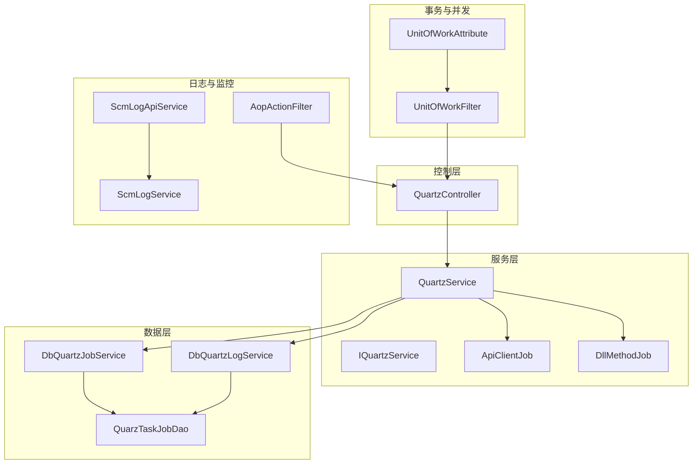
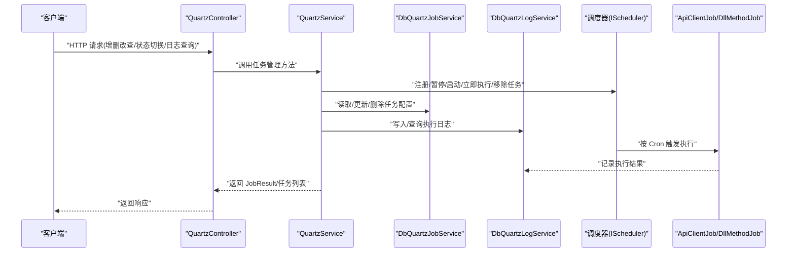
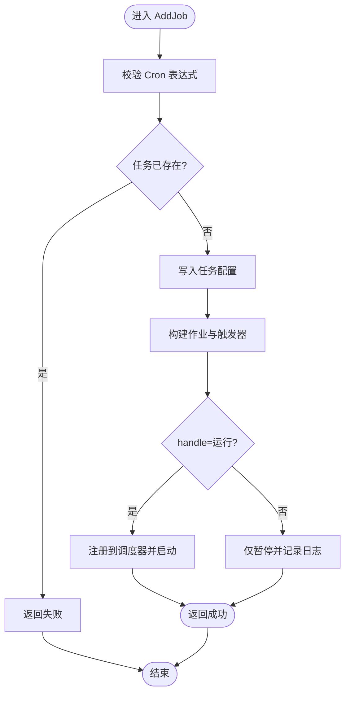
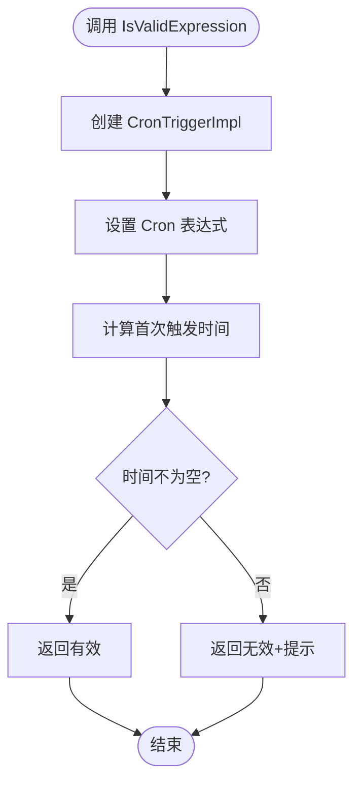
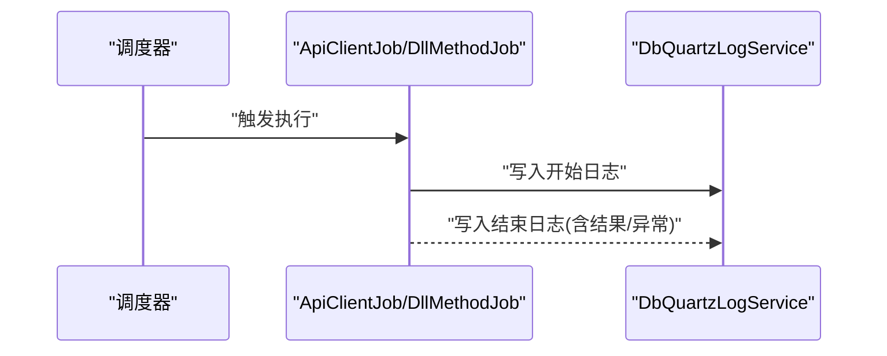
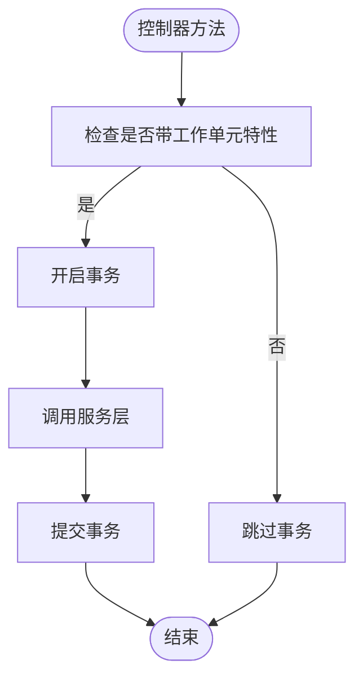
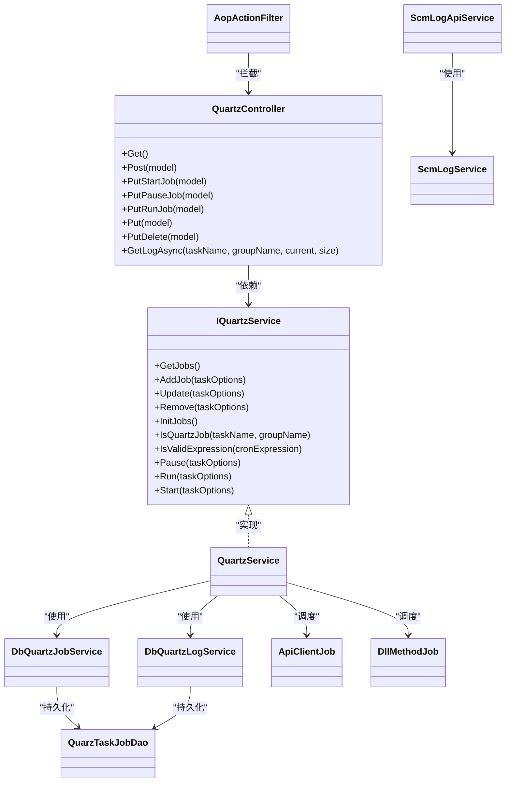

# 任务管理接口

<cite>
**本文引用的文件**
- [Scm.Net\Controllers\QuartzController.cs](file://Scm.Net\Controllers\QuartzController.cs)
- [Scm.Server.Quartz\IQuartzService.cs](file://Scm.Server.Quartz\IQuartzService.cs)
- [Scm.Server.Quartz\QuartzService.cs](file://Scm.Server.Quartz\QuartzService.cs)
- [Scm.Server.Quartz\Dao\QuarzTaskJobDao.cs](file://Scm.Server.Quartz\Dao\QuarzTaskJobDao.cs)
- [Scm.Server.Quartz\Enums\TaskTypeEnum.cs](file://Scm.Server.Quartz\Enums\TaskTypeEnum.cs)
- [Scm.Server.Quartz\Enums\JobHandleEnum.cs](file://Scm.Server.Quartz\Enums\JobHandleEnum.cs)
- [Scm.Server.Quartz\Enums\JobResultEnum.cs](file://Scm.Server.Quartz\Enums\JobResultEnum.cs)
- [Scm.Server.Quartz\Jobs\ApiClientJob.cs](file://Scm.Server.Quartz\Jobs\ApiClientJob.cs)
- [Scm.Server.Quartz\Jobs\DllMethodJob.cs](file://Scm.Server.Quartz\Jobs\DllMethodJob.cs)
- [Scm.Server.Quartz\Service\Db\DbQuartzJobService.cs](file://Scm.Server.Quartz\Service\Db\DbQuartzJobService.cs)
- [Scm.Server.Quartz\Service\Db\DbQuartzLogService.cs](file://Scm.Server.Quartz\Service\Db\DbQuartzLogService.cs)
- [Scm.Server.Quartz\JobResult.cs](file://Scm.Server.Quartz\JobResult.cs)
- [Scm.Dsa.Dba.Sugar\Dsa\Dba\Sugar\UnitOfWork\Attribute\UnitOfWorkAttribute.cs](file://Scm.Dsa.Dba.Sugar\Dsa\Dba\Sugar\UnitOfWork\Attribute\UnitOfWorkAttribute.cs)
- [Scm.Dsa.Dba.Sugar\Dsa\Dba\Sugar\UnitOfWork\Filters\UnitOfWorkFilter.cs](file://Scm.Dsa.Dba.Sugar\Dsa\Dba\Sugar\UnitOfWork\Filters\UnitOfWorkFilter.cs)
- [Scm.Core\Sys\Tasks\ScmSysTaskService.cs](file://Scm.Core\Sys\Tasks\ScmSysTaskService.cs)
- [Scm.Core\Tasks\DataIO\SingleTableExportHandler.cs](file://Scm.Core\Tasks\DataIO\SingleTableExportHandler.cs)
- [Scm.Core\ScmTaskHandler.cs](file://Scm.Core\ScmTaskHandler.cs)
- [Scm.Server.Service\Service\ScmLogService.cs](file://Scm.Server.Service\Service\ScmLogService.cs)
- [Scm.Core\Log\Api\ScmLogApiService.cs](file://Scm.Core\Log\Api\ScmLogApiService.cs)
- [Scm.Core\Configure\Filters\AopActionFilter.cs](file://Scm.Core\Configure\Filters\AopActionFilter.cs)
</cite>

## 目录
1. [简介](#简介)
2. [项目结构](#项目结构)
3. [核心组件](#核心组件)
4. [架构总览](#架构总览)
5. [详细组件分析](#详细组件分析)
6. [依赖关系分析](#依赖关系分析)
7. [性能考虑](#性能考虑)
8. [故障排查指南](#故障排查指南)
9. [结论](#结论)
10. [附录](#附录)

## 简介
本技术文档聚焦 Scm.Net 任务调度系统中的“任务管理接口”，系统性阐述任务 CRUD（创建、查询、更新、删除）与状态管理的实现，覆盖以下关键主题：
- 任务管理接口设计与参数校验
- 事务处理与并发控制
- 任务状态管理（运行中、暂停、停止）
- 调度策略与 Cron 表达式校验、触发器配置与执行计划管理
- 任务执行监控、日志记录与错误处理
- 批量操作、任务导入导出与配置备份恢复
- 安全控制与权限验证机制

## 项目结构
围绕任务管理接口的关键模块分布如下：
- 控制层：QuartzController 提供 REST API，统一暴露任务的增删改查与状态切换、日志查询等能力
- 服务层：IQuartzService/QuartzService 实现任务生命周期管理与调度器交互
- 数据模型：QuarzTaskJobDao 定义任务表结构及 API/DLL 类型参数
- 作业执行：ApiClientJob/DllMethodJob 实现远程 API 调用与本地 DLL 方法执行
- 数据持久化：DbQuartzJobService/DbQuartzLogService 负责任务与日志的数据库存取
- 日志与监控：ScmLogService/ScmLogApiService/AopActionFilter 提供统一日志采集与监控
- 事务与并发：UnitOfWorkAttribute/UnitOfWorkFilter 提供工作单元与事务控制
- 导入导出：ScmTaskHandler/SingleTableExportHandler 支持任务数据的导入导出与备份恢复

图表来源
- [Scm.Net\Controllers\QuartzController.cs:1-122](file://Scm.Net\Controllers\QuartzController.cs#L1-122)
- [Scm.Server.Quartz\IQuartzService.cs:1-78](file://Scm.Server.Quartz\IQuartzService.cs#L1-78)
- [Scm.Server.Quartz\QuartzService.cs:1-550](file://Scm.Server.Quartz\QuartzService.cs#L1-550)
- [Scm.Server.Quartz\Dao\QuarzTaskJobDao.cs:1-120](file://Scm.Server.Quartz\Dao\QuarzTaskJobDao.cs#L1-120)
- [Scm.Server.Quartz\Jobs\ApiClientJob.cs:1-102](file://Scm.Server.Quartz\Jobs\ApiClientJob.cs#L1-102)
- [Scm.Server.Quartz\Jobs\DllMethodJob.cs:1-94](file://Scm.Server.Quartz\Jobs\DllMethodJob.cs#L1-94)
- [Scm.Server.Quartz\Service\Db\DbQuartzJobService.cs:1-63](file://Scm.Server.Quartz\Service\Db\DbQuartzJobService.cs#L1-63)
- [Scm.Server.Quartz\Service\Db\DbQuartzLogService.cs:1-58](file://Scm.Server.Quartz\Service\Db\DbQuartzLogService.cs#L1-58)
- [Scm.Server.Service\Service\ScmLogService.cs:1-26](file://Scm.Server.Service\Service\ScmLogService.cs#L1-26)
- [Scm.Core\Log\Api\ScmLogApiService.cs:92-122](file://Scm.Core\Log\Api\ScmLogApiService.cs#L92-122)
- [Scm.Core\Configure\Filters\AopActionFilter.cs:220-252](file://Scm.Core\Configure\Filters\AopActionFilter.cs#L220-252)
- [Scm.Dsa.Dba.Sugar\Dsa\Dba\Sugar\UnitOfWork\Attribute\UnitOfWorkAttribute.cs:1-35](file://Scm.Dsa.Dba.Sugar\Dsa\Dba\Sugar\UnitOfWork\Attribute\UnitOfWorkAttribute.cs#L1-35)
- [Scm.Dsa.Dba.Sugar\Dsa\Dba\Sugar\UnitOfWork\Filters\UnitOfWorkFilter.cs:1-41](file://Scm.Dsa.Dba.Sugar\Dsa\Dba\Sugar\UnitOfWork\Filters\UnitOfWorkFilter.cs#L1-41)

章节来源
- [Scm.Net\Controllers\QuartzController.cs:1-122](file://Scm.Net\Controllers\QuartzController.cs#L1-122)
- [Scm.Server.Quartz\QuartzService.cs:1-550](file://Scm.Server.Quartz\QuartzService.cs#L1-550)

## 核心组件
- 控制器层：QuartzController 提供 GET/POST/PUT/DELETE 等端点，分别用于获取任务列表、创建任务、启动/暂停/立即执行、更新与删除任务，以及查询任务执行日志
- 服务层接口与实现：IQuartzService 定义任务管理契约；QuartzService 实现任务的生命周期管理、Cron 表达式校验、调度器交互、状态切换与日志记录
- 数据模型：QuarzTaskJobDao 描述任务表字段，区分 API/DLL 两类任务的参数
- 作业执行器：ApiClientJob/DllMethodJob 实现具体执行逻辑，分别对接远程 API 或本地注入的 ICustomJob
- 数据访问：DbQuartzJobService/DbQuartzLogService 提供任务与日志的增删改查
- 日志与监控：ScmLogService/ScmLogApiService/AopActionFilter 提供统一日志采集与接口耗时统计
- 事务与并发：UnitOfWorkAttribute/UnitOfWorkFilter 提供工作单元与事务控制

章节来源
- [Scm.Server.Quartz\IQuartzService.cs:1-78](file://Scm.Server.Quartz\IQuartzService.cs#L1-78)
- [Scm.Server.Quartz\QuartzService.cs:1-550](file://Scm.Server.Quartz\QuartzService.cs#L1-550)
- [Scm.Server.Quartz\Dao\QuarzTaskJobDao.cs:1-120](file://Scm.Server.Quartz\Dao\QuarzTaskJobDao.cs#L1-120)
- [Scm.Server.Quartz\Jobs\ApiClientJob.cs:1-102](file://Scm.Server.Quartz\Jobs\ApiClientJob.cs#L1-102)
- [Scm.Server.Quartz\Jobs\DllMethodJob.cs:1-94](file://Scm.Server.Quartz\Jobs\DllMethodJob.cs#L1-94)
- [Scm.Server.Quartz\Service\Db\DbQuartzJobService.cs:1-63](file://Scm.Server.Quartz\Service\Db\DbQuartzJobService.cs#L1-63)
- [Scm.Server.Quartz\Service\Db\DbQuartzLogService.cs:1-58](file://Scm.Server.Quartz\Service\Db\DbQuartzLogService.cs#L1-58)
- [Scm.Server.Service\Service\ScmLogService.cs:1-26](file://Scm.Server.Service\Service\ScmLogService.cs#L1-26)
- [Scm.Core\Log\Api\ScmLogApiService.cs:92-122](file://Scm.Core\Log\Api\ScmLogApiService.cs#L92-122)
- [Scm.Core\Configure\Filters\AopActionFilter.cs:220-252](file://Scm.Core\Configure\Filters\AopActionFilter.cs#L220-252)
- [Scm.Dsa.Dba.Sugar\Dsa\Dba\Sugar\UnitOfWork\Attribute\UnitOfWorkAttribute.cs:1-35](file://Scm.Dsa.Dba.Sugar\Dsa\Dba\Sugar\UnitOfWork\Attribute\UnitOfWorkAttribute.cs#L1-35)
- [Scm.Dsa.Dba.Sugar\Dsa\Dba\Sugar\UnitOfWork\Filters\UnitOfWorkFilter.cs:1-41](file://Scm.Dsa.Dba.Sugar\Dsa\Dba\Sugar\UnitOfWork\Filters\UnitOfWorkFilter.cs#L1-41)

## 架构总览
下图展示从控制器到服务、作业执行与日志记录的整体交互：

图表来源
- [Scm.Net\Controllers\QuartzController.cs:1-122](file://Scm.Net\Controllers\QuartzController.cs#L1-122)
- [Scm.Server.Quartz\QuartzService.cs:1-550](file://Scm.Server.Quartz\QuartzService.cs#L1-550)
- [Scm.Server.Quartz\Service\Db\DbQuartzJobService.cs:1-63](file://Scm.Server.Quartz\Service\Db\DbQuartzJobService.cs#L1-63)
- [Scm.Server.Quartz\Service\Db\DbQuartzLogService.cs:1-58](file://Scm.Server.Quartz\Service\Db\DbQuartzLogService.cs#L1-58)
- [Scm.Server.Quartz\Jobs\ApiClientJob.cs:1-102](file://Scm.Server.Quartz\Jobs\ApiClientJob.cs#L1-102)
- [Scm.Server.Quartz\Jobs\DllMethodJob.cs:1-94](file://Scm.Server.Quartz\Jobs\DllMethodJob.cs#L1-94)

## 详细组件分析

### 任务 CRUD 与状态管理
- 创建任务
  - 控制器接收任务配置，调用服务层 AddJob
  - 服务层先校验 Cron 表达式，再写入任务配置，按任务类型创建作业并注册触发器
  - 若任务状态为“运行”，则启动调度器；否则仅写入配置并记录日志
- 查询任务
  - 控制器调用 GetJobs，服务层合并数据库配置与调度器当前状态（如最近一次运行时间）
- 更新任务
  - 服务层先暂停旧触发器并移除旧作业，再创建新作业与新触发器，按新 Cron 重新调度
  - 更新数据库配置并根据状态决定是否启动调度器
- 删除任务
  - 服务层先暂停并移除触发器与作业，再删除数据库记录
- 状态管理
  - 支持启动（Resume/Pause）、暂停（Pause）、立即执行（Run）与初始化启动（Init/Running/Stopped）
  - 状态变更同步更新数据库与调度器

图表来源
- [Scm.Server.Quartz\QuartzService.cs:160-250](file://Scm.Server.Quartz\QuartzService.cs#L160-250)
- [Scm.Server.Quartz\IQuartzService.cs:17-21](file://Scm.Server.Quartz\IQuartzService.cs#L17-21)

章节来源
- [Scm.Net\Controllers\QuartzController.cs:48-109](file://Scm.Net\Controllers\QuartzController.cs#L48-109)
- [Scm.Server.Quartz\QuartzService.cs:160-250](file://Scm.Server.Quartz\QuartzService.cs#L160-250)
- [Scm.Server.Quartz\Enums\JobHandleEnum.cs:1-18](file://Scm.Server.Quartz\Enums\JobHandleEnum.cs#L1-18)

### 调度策略与 Cron 验证
- Cron 表达式校验：IsValidExpression 使用 Quartz 的 CronTriggerImpl 计算首次触发时间，确保表达式有效
- 触发器配置：AddJob/Update 中使用 WithCronSchedule 设置 Cron 表达式；启动时 Start/Resume 触发器
- 执行计划管理：GetJobs 合并调度器状态与数据库配置，计算最近一次运行时间

图表来源
- [Scm.Server.Quartz\QuartzService.cs:82-96](file://Scm.Server.Quartz\QuartzService.cs#L82-96)
- [Scm.Server.Quartz\IQuartzService.cs:50-55](file://Scm.Server.Quartz\IQuartzService.cs#L50-55)

章节来源
- [Scm.Server.Quartz\QuartzService.cs:82-96](file://Scm.Server.Quartz\QuartzService.cs#L82-96)
- [Scm.Server.Quartz\IQuartzService.cs:50-55](file://Scm.Server.Quartz\IQuartzService.cs#L50-55)

### 作业执行与监控
- API 类型作业：ApiClientJob 从任务配置读取 API 地址、方法、请求头与参数，发起 HTTP 请求并将结果写入日志
- 本地 DLL 作业：DllMethodJob 通过 IServiceProvider 获取已注入的 ICustomJob 实例并执行，将结果写入日志
- 执行监控：日志服务统一记录执行开始/结束、异常与耗时；AopActionFilter 统计接口耗时与参数

图表来源
- [Scm.Server.Quartz\Jobs\ApiClientJob.cs:27-95](file://Scm.Server.Quartz\Jobs\ApiClientJob.cs#L27-95)
- [Scm.Server.Quartz\Jobs\DllMethodJob.cs:33-87](file://Scm.Server.Quartz\Jobs\DllMethodJob.cs#L33-87)
- [Scm.Server.Quartz\Service\Db\DbQuartzLogService.cs:39-58](file://Scm.Server.Quartz\Service\Db\DbQuartzLogService.cs#L39-58)
- [Scm.Core\Log\Api\ScmLogApiService.cs:92-122](file://Scm.Core\Log\Api\ScmLogApiService.cs#L92-122)
- [Scm.Core\Configure\Filters\AopActionFilter.cs:220-252](file://Scm.Core\Configure\Filters\AopActionFilter.cs#L220-252)

章节来源
- [Scm.Server.Quartz\Jobs\ApiClientJob.cs:27-95](file://Scm.Server.Quartz\Jobs\ApiClientJob.cs#L27-95)
- [Scm.Server.Quartz\Jobs\DllMethodJob.cs:33-87](file://Scm.Server.Quartz\Jobs\DllMethodJob.cs#L33-87)
- [Scm.Server.Quartz\Service\Db\DbQuartzLogService.cs:39-58](file://Scm.Server.Quartz\Service\Db\DbQuartzLogService.cs#L39-58)
- [Scm.Core\Log\Api\ScmLogApiService.cs:92-122](file://Scm.Core\Log\Api\ScmLogApiService.cs#L92-122)
- [Scm.Core\Configure\Filters\AopActionFilter.cs:220-252](file://Scm.Core\Configure\Filters\AopActionFilter.cs#L220-252)

### 参数验证与安全控制
- 参数验证：QuarzTaskJobDao 使用字符串长度等属性进行基本约束；Cron 表达式由服务层显式校验
- 安全控制：控制器与服务层未直接体现细粒度权限校验逻辑，建议结合全局中间件或控制器特性实现鉴权与审计

章节来源
- [Scm.Server.Quartz\Dao\QuarzTaskJobDao.cs:1-120](file://Scm.Server.Quartz\Dao\QuarzTaskJobDao.cs#L1-120)
- [Scm.Server.Quartz\QuartzService.cs:82-96](file://Scm.Server.Quartz\QuartzService.cs#L82-96)

### 事务处理与并发控制
- 工作单元：UnitOfWorkAttribute/UnitOfWorkFilter 提供基于方法特性的事务控制，默认隔离级别可配置
- 并发控制：QuartzService 在更新/删除任务时先暂停触发器并移除旧作业，避免并发冲突；作业执行器内部无显式锁，依赖 Quartz 调度器的并发模型

图表来源
- [Scm.Dsa.Dba.Sugar\Dsa\Dba\Sugar\UnitOfWork\Attribute\UnitOfWorkAttribute.cs:1-35](file://Scm.Dsa.Dba.Sugar\Dsa\Dba\Sugar\UnitOfWork\Attribute\UnitOfWorkAttribute.cs#L1-35)
- [Scm.Dsa.Dba.Sugar\Dsa\Dba\Sugar\UnitOfWork\Filters\UnitOfWorkFilter.cs:1-41](file://Scm.Dsa.Dba.Sugar\Dsa\Dba\Sugar\UnitOfWork\Filters\UnitOfWorkFilter.cs#L1-41)

章节来源
- [Scm.Dsa.Dba.Sugar\Dsa\Dba\Sugar\UnitOfWork\Attribute\UnitOfWorkAttribute.cs:1-35](file://Scm.Dsa.Dba.Sugar\Dsa\Dba\Sugar\UnitOfWork\Attribute\UnitOfWorkAttribute.cs#L1-35)
- [Scm.Dsa.Dba.Sugar\Dsa\Dba\Sugar\UnitOfWork\Filters\UnitOfWorkFilter.cs:1-41](file://Scm.Dsa.Dba.Sugar\Dsa\Dba\Sugar\UnitOfWork\Filters\UnitOfWorkFilter.cs#L1-41)

### 批量操作、导入导出与配置备份恢复
- 批量删除：控制器提供删除端点，服务层通过工作单元保证原子性
- 导入导出：ScmTaskHandler/SingleTableExportHandler 提供 CSV 写入与导出流程模板，可用于任务配置的导出与备份
- 配置备份恢复：DbQuartzJobService 提供任务配置的增删改查，可作为备份/恢复的数据源

章节来源
- [Scm.Net\Controllers\QuartzController.cs:104-109](file://Scm.Net\Controllers\QuartzController.cs#L104-109)
- [Scm.Core\Tasks\DataIO\SingleTableExportHandler.cs:48-80](file://Scm.Core\Tasks\DataIO\SingleTableExportHandler.cs#L48-80)
- [Scm.Core\ScmTaskHandler.cs:1-53](file://Scm.Core\ScmTaskHandler.cs#L1-53)
- [Scm.Server.Quartz\Service\Db\DbQuartzJobService.cs:1-63](file://Scm.Server.Quartz\Service\Db\DbQuartzJobService.cs#L1-63)

### 错误处理策略
- 服务层：JobResult 统一承载状态与消息；各操作捕获异常并返回失败信息
- 作业执行：ApiClientJob/DllMethodJob 捕获异常并记录到日志；调度器异常通过日志服务记录
- 接口日志：AopActionFilter 统计接口耗时与参数，便于问题定位

章节来源
- [Scm.Server.Quartz\JobResult.cs:1-25](file://Scm.Server.Quartz\JobResult.cs#L1-25)
- [Scm.Server.Quartz\QuartzService.cs:144-148](file://Scm.Server.Quartz\QuartzService.cs#L144-148)
- [Scm.Server.Quartz\Jobs\ApiClientJob.cs:77-91](file://Scm.Server.Quartz\Jobs\ApiClientJob.cs#L77-91)
- [Scm.Server.Quartz\Jobs\DllMethodJob.cs:71-86](file://Scm.Server.Quartz\Jobs\DllMethodJob.cs#L71-86)
- [Scm.Core\Configure\Filters\AopActionFilter.cs:220-252](file://Scm.Core\Configure\Filters\AopActionFilter.cs#L220-252)

## 依赖关系分析
- 控制器依赖服务接口 IQuartzService，服务层依赖调度器工厂与作业/日志服务
- 作业执行器依赖注入的服务（如 ICustomJob、日志服务）
- 数据访问层依赖 SqlSugar 客户端
- 日志与监控通过 ScmLogService/ScmLogApiService/AopActionFilter 形成闭环

图表来源
- [Scm.Net\Controllers\QuartzController.cs:1-122](file://Scm.Net\Controllers\QuartzController.cs#L1-122)
- [Scm.Server.Quartz\IQuartzService.cs:1-78](file://Scm.Server.Quartz\IQuartzService.cs#L1-78)
- [Scm.Server.Quartz\QuartzService.cs:1-550](file://Scm.Server.Quartz\QuartzService.cs#L1-550)
- [Scm.Server.Quartz\Dao\QuarzTaskJobDao.cs:1-120](file://Scm.Server.Quartz\Dao\QuarzTaskJobDao.cs#L1-120)
- [Scm.Server.Quartz\Service\Db\DbQuartzJobService.cs:1-63](file://Scm.Server.Quartz\Service\Db\DbQuartzJobService.cs#L1-63)
- [Scm.Server.Quartz\Service\Db\DbQuartzLogService.cs:1-58](file://Scm.Server.Quartz\Service\Db\DbQuartzLogService.cs#L1-58)
- [Scm.Server.Quartz\Jobs\ApiClientJob.cs:1-102](file://Scm.Server.Quartz\Jobs\ApiClientJob.cs#L1-102)
- [Scm.Server.Quartz\Jobs\DllMethodJob.cs:1-94](file://Scm.Server.Quartz\Jobs\DllMethodJob.cs#L1-94)
- [Scm.Server.Service\Service\ScmLogService.cs:1-26](file://Scm.Server.Service\Service\ScmLogService.cs#L1-26)
- [Scm.Core\Log\Api\ScmLogApiService.cs:92-122](file://Scm.Core\Log\Api\ScmLogApiService.cs#L92-122)
- [Scm.Core\Configure\Filters\AopActionFilter.cs:220-252](file://Scm.Core\Configure\Filters\AopActionFilter.cs#L220-252)

章节来源
- [Scm.Server.Quartz\IQuartzService.cs:1-78](file://Scm.Server.Quartz\IQuartzService.cs#L1-78)
- [Scm.Server.Quartz\QuartzService.cs:1-550](file://Scm.Server.Quartz\QuartzService.cs#L1-550)

## 性能考虑
- Cron 表达式校验在创建/更新时执行，避免无效表达式导致调度异常
- 仅在任务状态为“运行”时注册到调度器，减少不必要的调度开销
- 日志写入采用异步持久化，降低对执行路径的影响
- 建议对高频查询增加索引（如 names/group），优化 GetJobs 合并状态的性能

## 故障排查指南
- Cron 表达式无效：检查 IsValidExpression 返回的状态与消息，修正表达式
- 任务未启动：确认 handle 字段与调度器状态一致；查看日志记录的初始化失败原因
- API 作业执行失败：检查 ApiClientJob 的请求头、参数与目标地址；关注日志中的异常信息
- 本地 DLL 作业失败：确认 ICustomJob 注入是否正确；查看日志中的类型未找到提示
- 接口耗时异常：通过 AopActionFilter 输出的接口耗时与参数进行定位

章节来源
- [Scm.Server.Quartz\QuartzService.cs:144-148](file://Scm.Server.Quartz\QuartzService.cs#L144-148)
- [Scm.Server.Quartz\Jobs\ApiClientJob.cs:77-91](file://Scm.Server.Quartz\Jobs\ApiClientJob.cs#L77-91)
- [Scm.Server.Quartz\Jobs\DllMethodJob.cs:71-86](file://Scm.Server.Quartz\Jobs\DllMethodJob.cs#L71-86)
- [Scm.Core\Configure\Filters\AopActionFilter.cs:220-252](file://Scm.Core\Configure\Filters\AopActionFilter.cs#L220-252)

## 结论
该任务管理接口以 Quartz 为核心，结合 SqlSugar 实现了任务的完整生命周期管理，具备完善的参数校验、状态切换、日志记录与错误处理能力。通过工作单元与调度器并发模型，系统在一致性与性能之间取得平衡。建议后续增强权限校验与审计能力，并针对高频场景优化查询与索引。

## 附录
- 任务类型枚举：DLL 与 API 两种执行类型
- 任务状态枚举：初始、暂停、停止、运行
- 任务结果枚举：成功、失败

章节来源
- [Scm.Server.Quartz\Enums\TaskTypeEnum.cs:1-16](file://Scm.Server.Quartz\Enums\TaskTypeEnum.cs#L1-16)
- [Scm.Server.Quartz\Enums\JobHandleEnum.cs:1-18](file://Scm.Server.Quartz\Enums\JobHandleEnum.cs#L1-18)
- [Scm.Server.Quartz\Enums\JobResultEnum.cs:1-16](file://Scm.Server.Quartz\Enums\JobResultEnum.cs#L1-16)