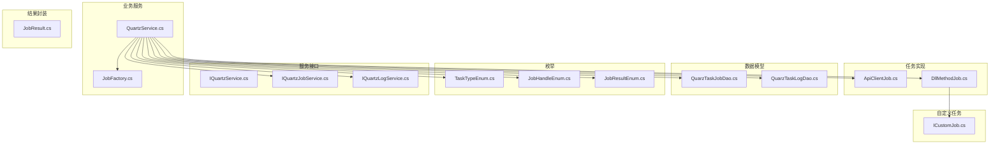
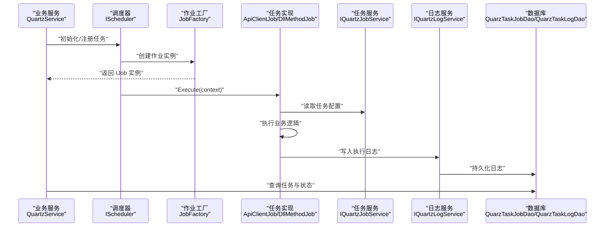
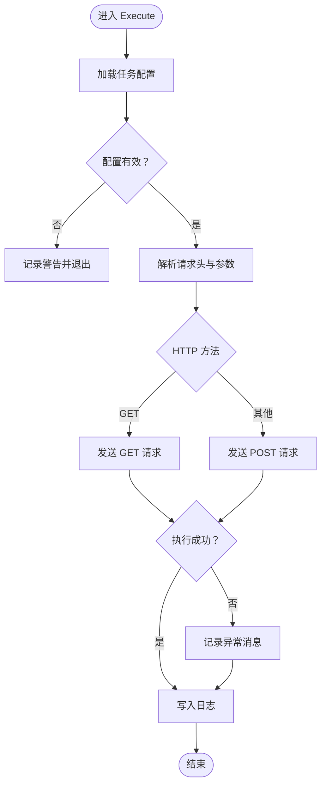
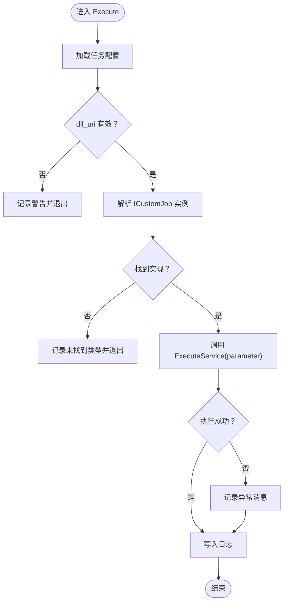
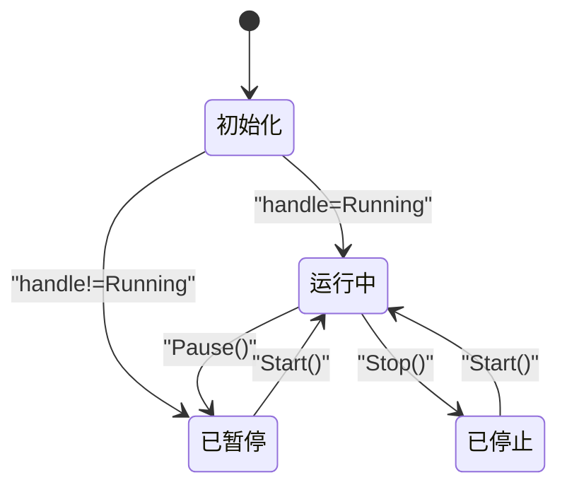
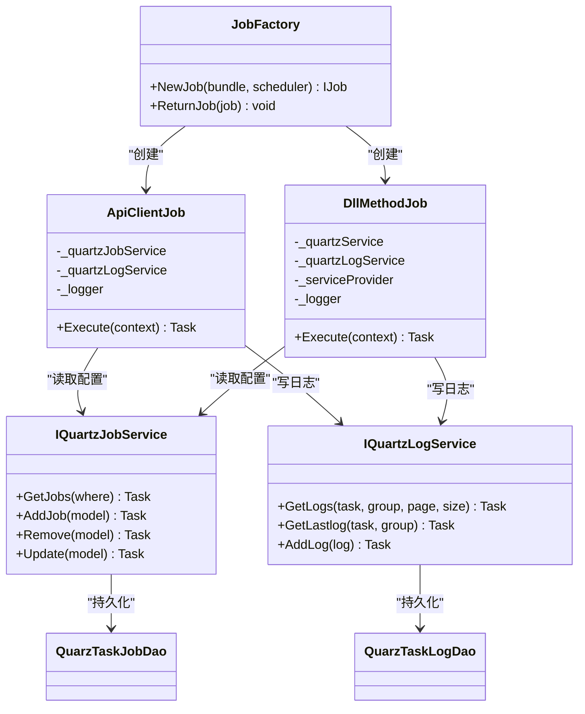
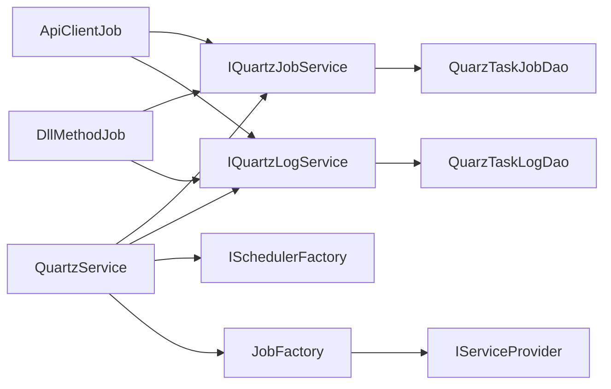

# 任务类型和实现

<cite>
**本文引用的文件**
- [ApiClientJob.cs](file://Scm.Server.Quartz/Jobs/ApiClientJob.cs)
- [DllMethodJob.cs](file://Scm.Server.Quartz/Jobs/DllMethodJob.cs)
- [TaskTypeEnum.cs](file://Scm.Server.Quartz/Enums/TaskTypeEnum.cs)
- [JobHandleEnum.cs](file://Scm.Server.Quartz/Enums/JobHandleEnum.cs)
- [JobResultEnum.cs](file://Scm.Server.Quartz/Enums/JobResultEnum.cs)
- [ICustomJob.cs](file://Scm.Server.Quartz/ICustomJob.cs)
- [QuarzTaskJobDao.cs](file://Scm.Server.Quartz/Dao/QuarzTaskJobDao.cs)
- [QuarzTaskLogDao.cs](file://Scm.Server.Quartz/Dao/QuarzTaskLogDao.cs)
- [IQuartzService.cs](file://Scm.Server.Quartz/IQuartzService.cs)
- [IQuartzJobService.cs](file://Scm.Server.Quartz/Service/IQuartzJobService.cs)
- [IQuartzLogService.cs](file://Scm.Server.Quartz/Service/IQuartzLogService.cs)
- [QuartzService.cs](file://Scm.Server.Quartz/QuartzService.cs)
- [JobFactory.cs](file://Scm.Server.Quartz/JobFactory.cs)
- [JobResult.cs](file://Scm.Server.Quartz/JobResult.cs)
</cite>

## 目录
1. [简介](#简介)
2. [项目结构](#项目结构)
3. [核心组件](#核心组件)
4. [架构总览](#架构总览)
5. [详细组件分析](#详细组件分析)
6. [依赖关系分析](#依赖关系分析)
7. [性能考虑](#性能考虑)
8. [故障排除指南](#故障排除指南)
9. [结论](#结论)
10. [附录](#附录)

## 简介
本文件面向 Scm.Net 任务调度系统中的两类核心任务类型：ApiClientJob（API 客户端任务）与 DllMethodJob（DLL 方法任务）。文档从执行流程、参数传递、异常处理、结果返回、任务状态与生命周期、自定义任务开发、上下文管理与资源清理、性能监控与调试等方面进行系统化说明，并提供可视化图示帮助理解。

## 项目结构
围绕任务调度的关键模块分布于以下命名空间与文件：
- 任务实现：Jobs/ApiClientJob.cs、Jobs/DllMethodJob.cs
- 任务数据模型：Dao/QuarzTaskJobDao.cs、Dao/QuarzTaskLogDao.cs
- 任务枚举：Enums/TaskTypeEnum.cs、Enums/JobHandleEnum.cs、Enums/JobResultEnum.cs
- 服务接口：IQuartzService.cs、IQuartzJobService.cs、IQuartzLogService.cs
- 业务服务：QuartzService.cs（任务注册、启停、查询、日志）
- 依赖注入与作用域：JobFactory.cs
- 自定义任务接口：ICustomJob.cs
- 结果封装：JobResult.cs

图表来源
- [ApiClientJob.cs:1-102](file://Scm.Server.Quartz/Jobs/ApiClientJob.cs#L1-L102)
- [DllMethodJob.cs:1-94](file://Scm.Server.Quartz/Jobs/DllMethodJob.cs#L1-L94)
- [QuartzService.cs:1-550](file://Scm.Server.Quartz/QuartzService.cs#L1-L550)
- [QuarzTaskJobDao.cs:1-120](file://Scm.Server.Quartz/Dao/QuarzTaskJobDao.cs#L1-L120)
- [QuarzTaskLogDao.cs:1-53](file://Scm.Server.Quartz/Dao/QuarzTaskLogDao.cs#L1-L53)
- [TaskTypeEnum.cs:1-16](file://Scm.Server.Quartz/Enums/TaskTypeEnum.cs#L1-L16)
- [JobHandleEnum.cs:1-18](file://Scm.Server.Quartz/Enums/JobHandleEnum.cs#L1-L18)
- [JobResultEnum.cs:1-16](file://Scm.Server.Quartz/Enums/JobResultEnum.cs#L1-L16)
- [IQuartzService.cs:1-78](file://Scm.Server.Quartz/IQuartzService.cs#L1-L78)
- [IQuartzJobService.cs:1-40](file://Scm.Server.Quartz/Service/IQuartzJobService.cs#L1-L40)
- [IQuartzLogService.cs:1-17](file://Scm.Server.Quartz/Service/IQuartzLogService.cs#L1-L17)
- [JobFactory.cs:1-42](file://Scm.Server.Quartz/JobFactory.cs#L1-L42)
- [ICustomJob.cs:1-11](file://Scm.Server.Quartz/ICustomJob.cs#L1-L11)
- [JobResult.cs:1-26](file://Scm.Server.Quartz/JobResult.cs#L1-L26)

章节来源
- [ApiClientJob.cs:1-102](file://Scm.Server.Quartz/Jobs/ApiClientJob.cs#L1-L102)
- [DllMethodJob.cs:1-94](file://Scm.Server.Quartz/Jobs/DllMethodJob.cs#L1-L94)
- [QuartzService.cs:1-550](file://Scm.Server.Quartz/QuartzService.cs#L1-L550)

## 核心组件
- 任务类型枚举：用于区分任务是本地 DLL 调用还是远程 API 请求。
- 任务状态枚举：用于表示任务的运行状态（初始、暂停、停止、运行中）。
- 任务结果枚举：用于标识任务执行结果（成功、失败）。
- 数据模型：QuarzTaskJobDao 描述任务元数据与参数；QuarzTaskLogDao 记录每次执行的日志。
- 服务接口：IQuartzService 提供任务的增删改查、启停、校验表达式、立即执行等能力；IQuartzJobService 负责任务持久化；IQuartzLogService 负责日志持久化。
- 业务服务：QuartzService 实现任务的注册、调度、启停、状态同步与日志写入。
- 依赖注入：JobFactory 基于 ServiceProvider 创建任务实例并管理作用域。
- 自定义任务：ICustomJob 定义可注入的本地任务接口。

章节来源
- [TaskTypeEnum.cs:1-16](file://Scm.Server.Quartz/Enums/TaskTypeEnum.cs#L1-L16)
- [JobHandleEnum.cs:1-18](file://Scm.Server.Quartz/Enums/JobHandleEnum.cs#L1-L18)
- [JobResultEnum.cs:1-16](file://Scm.Server.Quartz/Enums/JobResultEnum.cs#L1-L16)
- [QuarzTaskJobDao.cs:1-120](file://Scm.Server.Quartz/Dao/QuarzTaskJobDao.cs#L1-L120)
- [QuarzTaskLogDao.cs:1-53](file://Scm.Server.Quartz/Dao/QuarzTaskLogDao.cs#L1-L53)
- [IQuartzService.cs:1-78](file://Scm.Server.Quartz/IQuartzService.cs#L1-L78)
- [IQuartzJobService.cs:1-40](file://Scm.Server.Quartz/Service/IQuartzJobService.cs#L1-L40)
- [IQuartzLogService.cs:1-17](file://Scm.Server.Quartz/Service/IQuartzLogService.cs#L1-L17)
- [JobFactory.cs:1-42](file://Scm.Server.Quartz/JobFactory.cs#L1-L42)
- [ICustomJob.cs:1-11](file://Scm.Server.Quartz/ICustomJob.cs#L1-L11)
- [JobResult.cs:1-26](file://Scm.Server.Quartz/JobResult.cs#L1-L26)

## 架构总览
下图展示任务调度系统从“业务服务”到“任务实现”再到“日志与数据”的整体交互：

图表来源
- [QuartzService.cs:98-152](file://Scm.Server.Quartz/QuartzService.cs#L98-L152)
- [JobFactory.cs:18-40](file://Scm.Server.Quartz/JobFactory.cs#L18-L40)
- [ApiClientJob.cs:27-95](file://Scm.Server.Quartz/Jobs/ApiClientJob.cs#L27-L95)
- [DllMethodJob.cs:33-87](file://Scm.Server.Quartz/Jobs/DllMethodJob.cs#L33-L87)
- [IQuartzJobService.cs:1-40](file://Scm.Server.Quartz/Service/IQuartzJobService.cs#L1-L40)
- [IQuartzLogService.cs:1-17](file://Scm.Server.Quartz/Service/IQuartzLogService.cs#L1-L17)
- [QuarzTaskJobDao.cs:1-120](file://Scm.Server.Quartz/Dao/QuarzTaskJobDao.cs#L1-L120)
- [QuarzTaskLogDao.cs:1-53](file://Scm.Server.Quartz/Dao/QuarzTaskLogDao.cs#L1-L53)

## 详细组件分析

### ApiClientJob（API 客户端任务）
- 角色定位：通过 HTTP GET/POST 执行远程 API，适用于跨服务或外部系统集成。
- 关键流程
  - 解析触发器：从上下文中提取任务分组与名称，定位任务配置。
  - 参数解析：从任务配置中读取 API 地址、方法、请求头与请求体参数。
  - 执行调用：根据方法选择 GET 或 POST 发送请求，获取响应文本。
  - 异常处理：捕获执行期异常，记录错误消息。
  - 日志写入：记录开始时间、结束时间与执行结果。
- 参数传递机制
  - api_uri：目标 API 地址（必填）。
  - api_method：HTTP 方法（大小写不敏感），默认 POST。
  - api_headers：JSON 字符串，映射为请求头字典。
  - api_parameter：JSON 字符串，映射为请求体字典。
- 异常处理策略
  - 执行阶段异常：记录异常消息并继续写入日志。
  - 日志写入异常：记录日志写入失败信息。
- 结果返回方式
  - 执行结果以字符串形式写入日志备注字段，便于查询与审计。
- 生命周期控制
  - 由 QuartzService 在初始化时根据 handle 状态决定是否启动任务。
- 性能与监控
  - 建议对频繁调用的 API 设置合理的 cron 表达式与超时控制。
  - 可结合外部监控系统采集日志表数据。

图表来源
- [ApiClientJob.cs:27-95](file://Scm.Server.Quartz/Jobs/ApiClientJob.cs#L27-L95)

章节来源
- [ApiClientJob.cs:1-102](file://Scm.Server.Quartz/Jobs/ApiClientJob.cs#L1-L102)
- [QuarzTaskJobDao.cs:66-93](file://Scm.Server.Quartz/Dao/QuarzTaskJobDao.cs#L66-L93)
- [QuarzTaskLogDao.cs:1-53](file://Scm.Server.Quartz/Dao/QuarzTaskLogDao.cs#L1-L53)
- [IQuartzLogService.cs:1-17](file://Scm.Server.Quartz/Service/IQuartzLogService.cs#L1-L17)

### DllMethodJob（DLL 方法任务）
- 角色定位：通过依赖注入解析自定义任务接口 ICustomJob 的具体实现，执行本地方法。
- 关键流程
  - 解析触发器：定位任务配置。
  - 类型匹配：通过 ServiceProvider 获取所有 ICustomJob 实例，按类型全名匹配 dll_uri。
  - 执行调用：调用 ExecuteService(parameter) 并获取返回结果。
  - 异常处理：捕获执行期异常，记录错误消息。
  - 日志写入：记录开始时间、结束时间与执行结果。
- 参数传递机制
  - dll_uri：自定义任务实现的类型全名（必须与注册类型一致）。
  - dll_method：当前未使用，保留扩展字段。
  - dll_parameter：传给 ExecuteService 的参数字符串。
- 异常处理策略
  - 未找到类型：记录警告并提示需检查依赖注入。
  - 执行阶段异常：记录异常消息并继续写入日志。
  - 日志写入异常：记录日志写入失败信息。
- 结果返回方式
  - 返回字符串写入日志备注字段。
- 生命周期控制
  - 由 QuartzService 在初始化时根据 handle 状态决定是否启动任务。
- 性能与监控
  - 建议对本地任务进行轻量计算，避免阻塞线程池。
  - 可结合外部监控系统采集日志表数据。

图表来源
- [DllMethodJob.cs:33-87](file://Scm.Server.Quartz/Jobs/DllMethodJob.cs#L33-L87)
- [ICustomJob.cs:1-11](file://Scm.Server.Quartz/ICustomJob.cs#L1-L11)

章节来源
- [DllMethodJob.cs:1-94](file://Scm.Server.Quartz/Jobs/DllMethodJob.cs#L1-L94)
- [ICustomJob.cs:1-11](file://Scm.Server.Quartz/ICustomJob.cs#L1-L11)
- [QuarzTaskJobDao.cs:95-117](file://Scm.Server.Quartz/Dao/QuarzTaskJobDao.cs#L95-L117)
- [QuarzTaskLogDao.cs:1-53](file://Scm.Server.Quartz/Dao/QuarzTaskLogDao.cs#L1-L53)
- [IQuartzLogService.cs:1-17](file://Scm.Server.Quartz/Service/IQuartzLogService.cs#L1-L17)

### 任务类型与状态管理
- 任务类型
  - TaskTypeEnum：Dll=1、Api=2，用于在 QuartzService 中选择对应的 Job 类型。
- 任务状态
  - JobHandleEnum：Init、Paused、Stoped、Running，用于控制任务启停与暂停。
- 任务结果
  - JobResultEnum：Failure、Success，用于标识执行结果（当前日志表 result 字段为整数，可映射）。
- 生命周期控制
  - QuartzService.InitJobs：根据 handle 状态决定是否启动任务。
  - QuartzService.Start/Pause：动态启停任务。
  - QuartzService.Run：立即触发一次执行。
  - QuartzService.Remove：移除任务及其触发器。

图表来源
- [JobHandleEnum.cs:1-18](file://Scm.Server.Quartz/Enums/JobHandleEnum.cs#L1-L18)
- [QuartzService.cs:98-152](file://Scm.Server.Quartz/QuartzService.cs#L98-L152)
- [QuartzService.cs:414-469](file://Scm.Server.Quartz/QuartzService.cs#L414-L469)

章节来源
- [TaskTypeEnum.cs:1-16](file://Scm.Server.Quartz/Enums/TaskTypeEnum.cs#L1-L16)
- [JobHandleEnum.cs:1-18](file://Scm.Server.Quartz/Enums/JobHandleEnum.cs#L1-L18)
- [JobResultEnum.cs:1-16](file://Scm.Server.Quartz/Enums/JobResultEnum.cs#L1-L16)
- [QuartzService.cs:98-152](file://Scm.Server.Quartz/QuartzService.cs#L98-L152)
- [QuartzService.cs:373-469](file://Scm.Server.Quartz/QuartzService.cs#L373-L469)

### 任务执行上下文与资源清理
- 上下文获取
  - 通过 IJobExecutionContext 获取触发器信息，进而定位任务配置。
- 依赖注入
  - JobFactory 基于 ServiceProvider 创建作业实例，并在 ReturnJob 时释放作用域，避免内存泄漏。
- 日志与资源
  - 执行前后记录 begin_time/end_time，异常时记录错误消息，确保可观测性。
  - 日志服务负责持久化执行记录，便于后续审计与排查。

图表来源
- [JobFactory.cs:1-42](file://Scm.Server.Quartz/JobFactory.cs#L1-L42)
- [ApiClientJob.cs:1-102](file://Scm.Server.Quartz/Jobs/ApiClientJob.cs#L1-L102)
- [DllMethodJob.cs:1-94](file://Scm.Server.Quartz/Jobs/DllMethodJob.cs#L1-L94)
- [IQuartzJobService.cs:1-40](file://Scm.Server.Quartz/Service/IQuartzJobService.cs#L1-L40)
- [IQuartzLogService.cs:1-17](file://Scm.Server.Quartz/Service/IQuartzLogService.cs#L1-L17)
- [QuarzTaskJobDao.cs:1-120](file://Scm.Server.Quartz/Dao/QuarzTaskJobDao.cs#L1-L120)
- [QuarzTaskLogDao.cs:1-53](file://Scm.Server.Quartz/Dao/QuarzTaskLogDao.cs#L1-L53)

章节来源
- [JobFactory.cs:1-42](file://Scm.Server.Quartz/JobFactory.cs#L1-L42)
- [ApiClientJob.cs:1-102](file://Scm.Server.Quartz/Jobs/ApiClientJob.cs#L1-L102)
- [DllMethodJob.cs:1-94](file://Scm.Server.Quartz/Jobs/DllMethodJob.cs#L1-L94)
- [IQuartzJobService.cs:1-40](file://Scm.Server.Quartz/Service/IQuartzJobService.cs#L1-L40)
- [IQuartzLogService.cs:1-17](file://Scm.Server.Quartz/Service/IQuartzLogService.cs#L1-L17)

### 自定义任务开发指南
- 实现 ICustomJob 接口
  - 在自定义类中实现 ExecuteService(string parameter)，返回字符串作为执行结果。
- 注册与注入
  - 将自定义类注册为 ICustomJob 的实现，确保类型全名与任务配置中的 dll_uri 一致。
- 参数配置
  - 在任务配置中设置 dll_uri 为实现类的类型全名，dll_parameter 为传入的参数字符串。
- 测试方法
  - 单元测试：对 ExecuteService 的输入输出进行断言。
  - 集成测试：通过 QuartzService.AddJob 与 QuartzService.Run 验证任务执行链路。
- 注意事项
  - 避免长时间阻塞，必要时使用异步与超时控制。
  - 对异常进行捕获并返回可读字符串，便于日志审计。

章节来源
- [ICustomJob.cs:1-11](file://Scm.Server.Quartz/ICustomJob.cs#L1-L11)
- [DllMethodJob.cs:57-75](file://Scm.Server.Quartz/Jobs/DllMethodJob.cs#L57-L75)
- [QuartzService.cs:160-250](file://Scm.Server.Quartz/QuartzService.cs#L160-L250)

## 依赖关系分析
- QuartzService 依赖 IQuartzJobService、IQuartzLogService、ISchedulerFactory、IJobFactory。
- 任务实现（ApiClientJob/DllMethodJob）依赖各自的服务接口与日志服务。
- JobFactory 依赖 IServiceScopeFactory，负责作业实例的作用域生命周期管理。
- 数据模型通过 ORM 映射到数据库表，支撑任务与日志的持久化。

图表来源
- [QuartzService.cs:1-550](file://Scm.Server.Quartz/QuartzService.cs#L1-L550)
- [ApiClientJob.cs:1-102](file://Scm.Server.Quartz/Jobs/ApiClientJob.cs#L1-L102)
- [DllMethodJob.cs:1-94](file://Scm.Server.Quartz/Jobs/DllMethodJob.cs#L1-L94)
- [JobFactory.cs:1-42](file://Scm.Server.Quartz/JobFactory.cs#L1-L42)
- [QuarzTaskJobDao.cs:1-120](file://Scm.Server.Quartz/Dao/QuarzTaskJobDao.cs#L1-L120)
- [QuarzTaskLogDao.cs:1-53](file://Scm.Server.Quartz/Dao/QuarzTaskLogDao.cs#L1-L53)

章节来源
- [QuartzService.cs:1-550](file://Scm.Server.Quartz/QuartzService.cs#L1-L550)
- [JobFactory.cs:1-42](file://Scm.Server.Quartz/JobFactory.cs#L1-L42)

## 性能考虑
- 任务粒度：将长耗时任务拆分为多个短周期任务，避免阻塞调度器线程。
- 超时与重试：对外部 API 调用设置合理超时与重试策略，防止任务堆积。
- 日志频率：高频任务建议降低日志写入频率或采用批量写入。
- 内存与连接：注意连接池与对象复用，避免频繁创建销毁导致 GC 压力。
- 监控指标：结合日志表与外部监控系统，关注执行时延、失败率与并发度。

## 故障排除指南
- 任务未找到
  - 现象：日志记录“作业未找到，可能已被移除”。
  - 排查：确认任务配置的分组与名称与触发器一致；检查 QuartzService 是否正确初始化。
- 参数非法
  - 现象：API 任务记录“参数非法或者异常”。
  - 排查：确认 api_uri 非空且合法；核对 api_headers 与 api_parameter 的 JSON 格式。
- 未找到类型
  - 现象：DLL 任务记录“未找到对应类型，请检查是否注入”。
  - 排查：确认自定义类已注册为 ICustomJob 实现；核对 dll_uri 的类型全名。
- 日志写入失败
  - 现象：记录“日志写入失败”。
  - 排查：检查数据库连接与权限；确认日志服务可用。
- 启停异常
  - 现象：任务无法暂停/启动。
  - 排查：确认 QuartzService.IsQuartzJob 返回存在；检查触发器状态与 handle 状态一致性。

章节来源
- [ApiClientJob.cs:40-52](file://Scm.Server.Quartz/Jobs/ApiClientJob.cs#L40-L52)
- [ApiClientJob.cs:77-92](file://Scm.Server.Quartz/Jobs/ApiClientJob.cs#L77-L92)
- [DllMethodJob.cs:44-55](file://Scm.Server.Quartz/Jobs/DllMethodJob.cs#L44-L55)
- [DllMethodJob.cs:65-75](file://Scm.Server.Quartz/Jobs/DllMethodJob.cs#L65-L75)
- [DllMethodJob.cs:83-86](file://Scm.Server.Quartz/Jobs/DllMethodJob.cs#L83-L86)
- [QuartzService.cs:513-547](file://Scm.Server.Quartz/QuartzService.cs#L513-L547)
- [QuartzService.cs:373-406](file://Scm.Server.Quartz/QuartzService.cs#L373-L406)
- [QuartzService.cs:414-469](file://Scm.Server.Quartz/QuartzService.cs#L414-L469)

## 结论
Scm.Net 任务调度系统通过 Quartz 实现了灵活的任务编排，ApiClientJob 与 DllMethodJob 分别覆盖“远程 API 调用”和“本地方法执行”两大场景。借助清晰的数据模型、服务接口与依赖注入机制，系统具备良好的可扩展性与可观测性。建议在生产环境中配合完善的监控与告警体系，持续优化任务粒度与资源配置。

## 附录
- 任务数据模型字段说明
  - 任务表（QuarzTaskJobDao）：包含任务类型、名称、分组、Cron 表达式、最近运行时间、状态、结果、描述以及 API/DLL 专用参数。
  - 日志表（QuarzTaskLogDao）：包含任务名、分组、开始/结束时间、结果与备注。
- 服务接口职责
  - IQuartzService：任务生命周期管理与状态同步。
  - IQuartzJobService：任务配置的增删改查。
  - IQuartzLogService：日志的查询与写入。
- 结果封装
  - JobResult：统一返回状态与消息，支持静态 Success/Failure 工厂方法。

章节来源
- [QuarzTaskJobDao.cs:1-120](file://Scm.Server.Quartz/Dao/QuarzTaskJobDao.cs#L1-L120)
- [QuarzTaskLogDao.cs:1-53](file://Scm.Server.Quartz/Dao/QuarzTaskLogDao.cs#L1-L53)
- [IQuartzService.cs:1-78](file://Scm.Server.Quartz/IQuartzService.cs#L1-L78)
- [IQuartzJobService.cs:1-40](file://Scm.Server.Quartz/Service/IQuartzJobService.cs#L1-L40)
- [IQuartzLogService.cs:1-17](file://Scm.Server.Quartz/Service/IQuartzLogService.cs#L1-L17)
- [JobResult.cs:1-26](file://Scm.Server.Quartz/JobResult.cs#L1-L26)