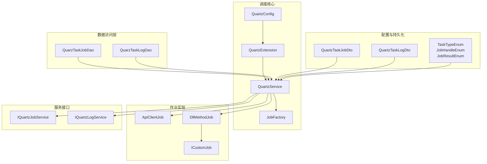
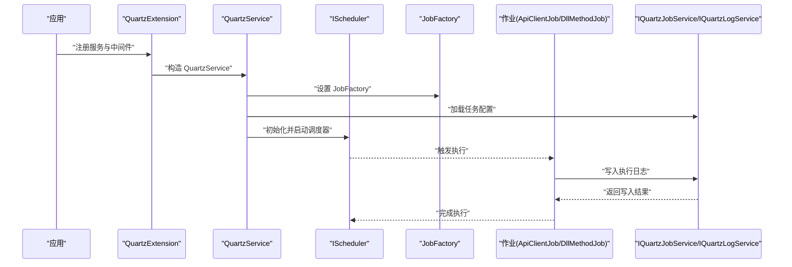
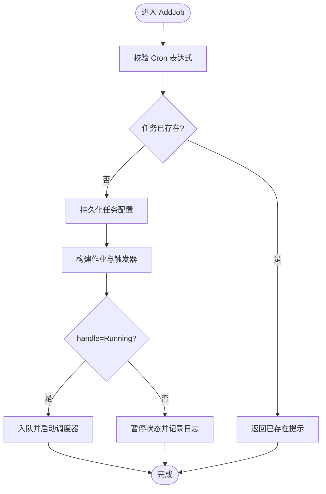
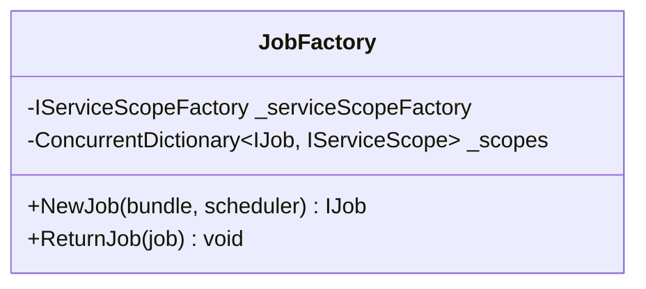
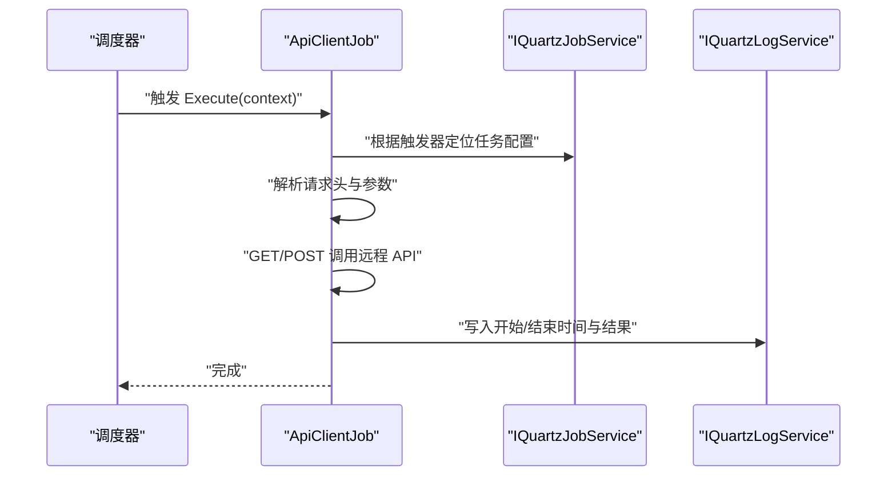
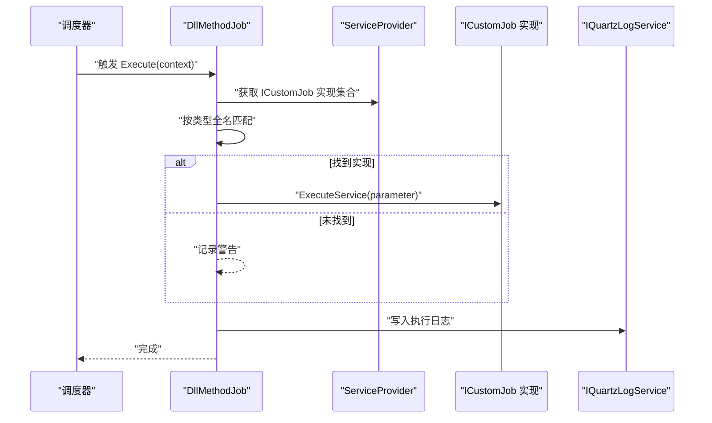
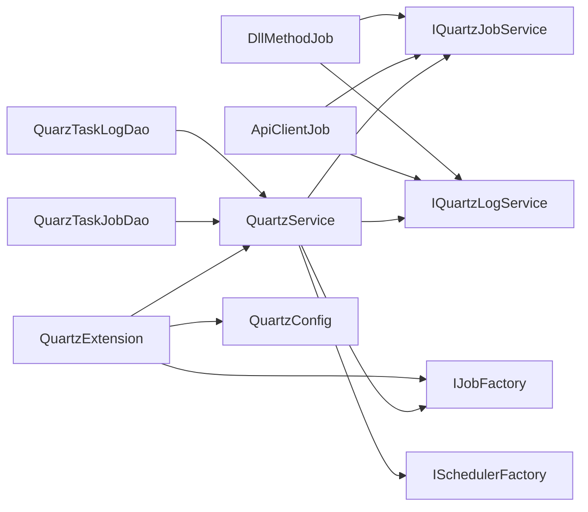

# 任务调度系统

<cite>
**本文引用的文件**
- [Scm.Server.Quartz.csproj](file://Scm.Server.Quartz/Scm.Server.Quartz.csproj)
- [QuartzService.cs](file://Scm.Server.Quartz/QuartzService.cs)
- [JobFactory.cs](file://Scm.Server.Quartz/JobFactory.cs)
- [ICustomJob.cs](file://Scm.Server.Quartz/ICustomJob.cs)
- [ApiClientJob.cs](file://Scm.Server.Quartz/Jobs/ApiClientJob.cs)
- [DllMethodJob.cs](file://Scm.Server.Quartz/Jobs/DllMethodJob.cs)
- [TaskTypeEnum.cs](file://Scm.Server.Quartz/Enums/TaskTypeEnum.cs)
- [JobHandleEnum.cs](file://Scm.Server.Quartz/Enums/JobHandleEnum.cs)
- [JobResultEnum.cs](file://Scm.Server.Quartz/Enums/JobResultEnum.cs)
- [QuartzTaskJobDto.cs](file://Scm.Server.Quartz/Dto/QuartzTaskJobDto.cs)
- [QuartzTaskLogDto.cs](file://Scm.Server.Quartz/Dto/QuartzTaskLogDto.cs)
- [IQuartzService.cs](file://Scm.Server.Quartz/IQuartzService.cs)
- [QuartzExtension.cs](file://Scm.Server.Quartz/QuartzExtension.cs)
- [QuartzConfig.cs](file://Scm.Server.Quartz/Config/QuartzConfig.cs)
- [IQuartzJobService.cs](file://Scm.Server.Quartz/Service/IQuartzJobService.cs)
- [IQuartzLogService.cs](file://Scm.Server.Quartz/Service/IQuartzLogService.cs)
- [QuarzTaskJobDao.cs](file://Scm.Server.Quartz/Dao/QuarzTaskJobDao.cs)
- [QuarzTaskLogDao.cs](file://Scm.Server.Quartz/Dao/QuarzTaskLogDao.cs)
</cite>

## 更新摘要
**所做更改**
- 新增了完整的 Quartz 集成架构文档，包含调度内核、作业工厂、作业实现等核心组件
- 完善了任务管理接口文档，涵盖 CRUD 操作、状态管理和调度控制
- 详细说明了任务类型和实现机制，包括 API 客户端任务和 DLL 方法任务
- 增强了监控和追踪机制说明，包含日志记录、错误处理和性能监控
- 补充了数据访问层和持久化机制的完整说明
- 更新了依赖关系分析和架构图示

## 目录
1. [简介](#简介)
2. [项目结构](#项目结构)
3. [核心组件](#核心组件)
4. [架构总览](#架构总览)
5. [详细组件分析](#详细组件分析)
6. [依赖关系分析](#依赖关系分析)
7. [性能考量](#性能考量)
8. [故障排查指南](#故障排查指南)
9. [结论](#结论)
10. [附录](#附录)

## 简介
本文件面向 Scm.Net 任务调度系统，围绕基于 Quartz.NET 的任务调度架构进行系统化技术文档整理。内容涵盖任务配置与持久化、作业工厂机制、任务生命周期管理、不同作业类型（API 客户端任务、DLL 方法任务、自定义任务开发）、任务管理 API、Cron 表达式校验与调度策略、执行监控与日志、错误处理与重试建议、性能调优与最佳实践。

## 项目结构
该调度模块位于 Scm.Server.Quartz 子项目中，采用分层与职责分离设计：
- 配置层：QuartzConfig 提供数据存储模式（文件/数据库）与路径准备
- 服务层：IQuartzJobService、IQuartzLogService 抽象任务与日志的数据访问
- 核心服务：QuartzService 实现任务的增删改查、启停、立即执行、Cron 校验、初始化加载
- 作业层：ApiClientJob（HTTP API 调用）、DllMethodJob（本地 DLL 方法调用）
- 工厂层：JobFactory 基于 DI 提供作业实例作用域管理
- 扩展层：QuartzExtension 提供依赖注入注册与中间件启动初始化
- 枚举与 DTO：TaskTypeEnum、JobHandleEnum、JobResultEnum、QuartzTaskJobDto、QuartzTaskLogDto
- 数据访问层：QuarzTaskJobDao、QuarzTaskLogDao 提供数据库持久化

**图表来源**
- [QuartzService.cs:13-550](file://Scm.Server.Quartz/QuartzService.cs#L13-L550)
- [JobFactory.cs:8-42](file://Scm.Server.Quartz/JobFactory.cs#L8-L42)
- [QuartzExtension.cs:15-93](file://Scm.Server.Quartz/QuartzExtension.cs#L15-L93)
- [QuartzConfig.cs:6-81](file://Scm.Server.Quartz/Config/QuartzConfig.cs#L6-L81)
- [ApiClientJob.cs:14-102](file://Scm.Server.Quartz/Jobs/ApiClientJob.cs#L14-L102)
- [DllMethodJob.cs:14-94](file://Scm.Server.Quartz/Jobs/DllMethodJob.cs#L14-L94)
- [IQuartzJobService.cs:9-40](file://Scm.Server.Quartz/Service/IQuartzJobService.cs#L9-L40)
- [IQuartzLogService.cs:8-17](file://Scm.Server.Quartz/Service/IQuartzLogService.cs#L8-L17)
- [QuarzTaskJobDao.cs:1-120](file://Scm.Server.Quartz/Dao/QuarzTaskJobDao.cs#L1-L120)
- [QuarzTaskLogDao.cs:1-53](file://Scm.Server.Quartz/Dao/QuarzTaskLogDao.cs#L1-L53)

**章节来源**
- [Scm.Server.Quartz.csproj:1-37](file://Scm.Server.Quartz/Scm.Server.Quartz.csproj#L1-L37)
- [QuartzService.cs:13-550](file://Scm.Server.Quartz/QuartzService.cs#L13-L550)
- [QuartzExtension.cs:15-93](file://Scm.Server.Quartz/QuartzExtension.cs#L15-L93)

## 核心组件
- **QuartzService**：任务生命周期管理与调度控制的核心，负责任务的新增、更新、删除、暂停、启动、立即执行、Cron 表达式校验、初始化加载等
- **JobFactory**：基于 ASP.NET Core 依赖注入的作用域工厂，确保每个作业实例拥有独立的服务作用域
- **作业实现**：
  - **ApiClientJob**：按 Cron 触发，调用远程 API 并记录日志
  - **DllMethodJob**：按 Cron 触发，通过 ICustomJob 注入执行本地方法
- **服务接口**：
  - **IQuartzJobService**：任务数据访问抽象
  - **IQuartzLogService**：日志数据访问抽象
- **配置与扩展**：
  - **QuartzConfig**：文件/数据库模式配置与路径准备
  - **QuartzExtension**：DI 注册与应用启动时初始化
- **数据访问层**：
  - **QuarzTaskJobDao**：任务配置数据访问对象
  - **QuarzTaskLogDao**：任务执行日志数据访问对象

**章节来源**
- [QuartzService.cs:13-550](file://Scm.Server.Quartz/QuartzService.cs#L13-L550)
- [JobFactory.cs:8-42](file://Scm.Server.Quartz/JobFactory.cs#L8-L42)
- [ApiClientJob.cs:14-102](file://Scm.Server.Quartz/Jobs/ApiClientJob.cs#L14-L102)
- [DllMethodJob.cs:14-94](file://Scm.Server.Quartz/Jobs/DllMethodJob.cs#L14-L94)
- [IQuartzJobService.cs:9-40](file://Scm.Server.Quartz/Service/IQuartzJobService.cs#L9-L40)
- [IQuartzLogService.cs:8-17](file://Scm.Server.Quartz/Service/IQuartzLogService.cs#L8-L17)
- [QuartzExtension.cs:15-93](file://Scm.Server.Quartz/QuartzExtension.cs#L15-L93)
- [QuartzConfig.cs:6-81](file://Scm.Server.Quartz/Config/QuartzConfig.cs#L6-L81)
- [QuarzTaskJobDao.cs:1-120](file://Scm.Server.Quartz/Dao/QuarzTaskJobDao.cs#L1-L120)
- [QuarzTaskLogDao.cs:1-53](file://Scm.Server.Quartz/Dao/QuarzTaskLogDao.cs#L1-L53)

## 架构总览
系统采用 Quartz.NET 作为调度内核，结合 ASP.NET Core DI 提供作业实例化与作用域管理；支持两种任务类型与两种持久化模式（文件/数据库），并通过统一的 QuartzService 对外暴露任务管理 API。

**图表来源**
- [QuartzExtension.cs:17-42](file://Scm.Server.Quartz/QuartzExtension.cs#L17-L42)
- [QuartzService.cs:98-152](file://Scm.Server.Quartz/QuartzService.cs#L98-L152)
- [JobFactory.cs:18-31](file://Scm.Server.Quartz/JobFactory.cs#L18-L31)
- [ApiClientJob.cs:27-95](file://Scm.Server.Quartz/Jobs/ApiClientJob.cs#L27-L95)
- [DllMethodJob.cs:33-87](file://Scm.Server.Quartz/Jobs/DllMethodJob.cs#L33-L87)

## 详细组件分析

### QuartzService：任务生命周期与调度控制
- **职责**
  - 任务 CRUD：AddJob、Update、Remove
  - 任务启停与立即执行：Start、Pause、Run
  - Cron 表达式校验：IsValidExpression
  - 初始化加载：InitJobs
  - 任务状态与最近执行时间聚合：GetJobs
- **关键流程**
  - 新增/更新：构建 IJobDetail 与 ITrigger，按 handle 决定是否立即入队与启动
  - 启动/暂停：通过 PauseTrigger/ResumeTrigger 控制触发器
  - 立即执行：TriggerJob 直接触发一次
  - 初始化：遍历持久化任务，按类型创建作业，按 handle 决定启动或暂停

**图表来源**
- [QuartzService.cs:160-250](file://Scm.Server.Quartz/QuartzService.cs#L160-L250)

**章节来源**
- [QuartzService.cs:36-152](file://Scm.Server.Quartz/QuartzService.cs#L36-L152)
- [QuartzService.cs:160-365](file://Scm.Server.Quartz/QuartzService.cs#L160-L365)
- [QuartzService.cs:477-504](file://Scm.Server.Quartz/QuartzService.cs#L477-L504)

### JobFactory：作业工厂与作用域管理
- **职责**
  - 基于 IServiceScopeFactory 为每个作业创建独立作用域
  - 在 ReturnJob 时释放作用域，避免资源泄漏
- **设计要点**
  - 使用 ConcurrentDictionary 维护作业与作用域映射
  - 仅当解析到 IJob 类型时才建立作用域

**图表来源**
- [JobFactory.cs:8-42](file://Scm.Server.Quartz/JobFactory.cs#L8-L42)

**章节来源**
- [JobFactory.cs:8-42](file://Scm.Server.Quartz/JobFactory.cs#L8-L42)

### ApiClientJob：API 客户端任务
- **职责**
  - 按 Cron 触发执行远程 API
  - 支持 GET/POST 参数与请求头
  - 记录执行日志与异常信息
- **关键点**
  - 从上下文提取触发器的组与名称，定位任务配置
  - 解析 api_headers 与 api_parameter 为字典传给 HTTP 工具
  - 异常捕获后写入日志，保证调度器稳定

**图表来源**
- [ApiClientJob.cs:27-95](file://Scm.Server.Quartz/Jobs/ApiClientJob.cs#L27-L95)

**章节来源**
- [ApiClientJob.cs:14-102](file://Scm.Server.Quartz/Jobs/ApiClientJob.cs#L14-L102)

### DllMethodJob：DLL 方法任务
- **职责**
  - 按 Cron 触发执行本地 ICustomJob 实现
  - 通过 ServiceProvider 查找匹配类型并调用 ExecuteService
  - 记录执行日志与异常信息
- **关键点**
  - 通过任务配置中的 dll_uri（完整类型名）匹配 ICustomJob 实现
  - 若未找到类型，记录"未找到对应类型"的警告

**图表来源**
- [DllMethodJob.cs:33-87](file://Scm.Server.Quartz/Jobs/DllMethodJob.cs#L33-L87)

**章节来源**
- [DllMethodJob.cs:14-94](file://Scm.Server.Quartz/Jobs/DllMethodJob.cs#L14-L94)
- [ICustomJob.cs:6-11](file://Scm.Server.Quartz/ICustomJob.cs#L6-L11)

### 自定义任务开发（ICustomJob）
- **开发步骤**
  - 实现 ICustomJob 接口，提供 ExecuteService 方法
  - 使用 QuartzExtension.AddQuartzClassJobs 自动扫描并注册所有 ICustomJob 实现
  - 在任务配置中将 dll_uri 指向该实现的完整类型名
- **注意事项**
  - 类型名需精确匹配（含命名空间）
  - 确保实现类可由 DI 解析（如使用 AddScoped）

**章节来源**
- [ICustomJob.cs:6-11](file://Scm.Server.Quartz/ICustomJob.cs#L6-L11)
- [QuartzExtension.cs:49-80](file://Scm.Server.Quartz/QuartzExtension.cs#L49-L80)

### 任务管理 API（对外接口）
- **IQuartzService 定义的任务管理能力**
  - 查询：GetJobs
  - 新增：AddJob
  - 更新：Update
  - 删除：Remove
  - 初始化：InitJobs
  - 校验：IsValidExpression
  - 暂停：Pause
  - 立即执行：Run
  - 启动：Start
- **返回体**：统一使用 JobResult 包裹状态与消息

**章节来源**
- [IQuartzService.cs:8-78](file://Scm.Server.Quartz/IQuartzService.cs#L8-L78)
- [QuartzService.cs:36-504](file://Scm.Server.Quartz/QuartzService.cs#L36-L504)

### Cron 表达式与调度策略
- **Cron 校验**：IsValidExpression 构造 CronTriggerImpl 并计算首次触发时间
- **触发器构建**：WithCronSchedule 将任务配置的 cron 字段应用到触发器
- **调度策略**
  - handle=Running：立即入队并启动调度器
  - handle=Paused：创建触发器但不启动，后续 Start 可恢复
  - 立即执行：TriggerJob 直接触发一次，不改变任务状态

**章节来源**
- [QuartzService.cs:82-96](file://Scm.Server.Quartz/QuartzService.cs#L82-L96)
- [QuartzService.cs:126-130](file://Scm.Server.Quartz/QuartzService.cs#L126-L130)
- [QuartzService.cs:221-225](file://Scm.Server.Quartz/QuartzService.cs#L221-L225)
- [QuartzService.cs:439-443](file://Scm.Server.Quartz/QuartzService.cs#L439-L443)

### 执行监控与日志
- **日志模型**：QuarzTaskLogDao 包含任务名、分组、开始/结束时间、结果与备注
- **写入策略**
  - 作业执行前后分别记录 begin_time/end_time
  - 异常信息写入 remark，便于问题追踪
- **日志服务**：IQuartzLogService 提供获取最后一条日志与分页查询能力

**章节来源**
- [QuarzTaskLogDao.cs:1-53](file://Scm.Server.Quartz/Dao/QuarzTaskLogDao.cs#L1-L53)
- [IQuartzLogService.cs:8-17](file://Scm.Server.Quartz/Service/IQuartzLogService.cs#L8-L17)
- [ApiClientJob.cs:47-93](file://Scm.Server.Quartz/Jobs/ApiClientJob.cs#L47-L93)
- [DllMethodJob.cs:50-86](file://Scm.Server.Quartz/Jobs/DllMethodJob.cs#L50-L86)

### 错误处理与重试建议
- **当前实现**
  - 作业内部异常被捕获并写入日志，避免中断调度器
  - 未内置自动重试机制
- **建议**
  - 在作业内部增加指数退避重试（如最多 3 次）
  - 对网络类异常（超时、连接失败）区分对待
  - 使用外部队列（如 RabbitMQ）兜底失败任务

**章节来源**
- [ApiClientJob.cs:77-81](file://Scm.Server.Quartz/Jobs/ApiClientJob.cs#L77-L81)
- [DllMethodJob.cs:71-75](file://Scm.Server.Quartz/Jobs/DllMethodJob.cs#L71-L75)

### 数据访问层与持久化
- **任务数据访问**：QuarzTaskJobDao 提供完整的任务配置持久化
- **日志数据访问**：QuarzTaskLogDao 提供任务执行日志持久化
- **服务接口**：IQuartzJobService 和 IQuartzLogService 抽象数据访问
- **持久化模式**：支持文件模式和数据库模式，通过 QuartzConfig 配置

**章节来源**
- [QuarzTaskJobDao.cs:1-120](file://Scm.Server.Quartz/Dao/QuarzTaskJobDao.cs#L1-L120)
- [QuarzTaskLogDao.cs:1-53](file://Scm.Server.Quartz/Dao/QuarzTaskLogDao.cs#L1-L53)
- [IQuartzJobService.cs:1-40](file://Scm.Server.Quartz/Service/IQuartzJobService.cs#L1-L40)
- [IQuartzLogService.cs:1-17](file://Scm.Server.Quartz/Service/IQuartzLogService.cs#L1-L17)

## 依赖关系分析
- **外部依赖**
  - Quartz 与 Quartz.AspNetCore：调度内核与 ASP.NET Core 集成
  - Microsoft.Extensions.Http：HTTP 客户端能力
- **内部依赖**
  - QuartzService 依赖 IQuartzJobService、IQuartzLogService、ISchedulerFactory、IJobFactory
  - 作业依赖 IQuartzJobService、IQuartzLogService、ILogger
  - QuartzExtension 依赖 QuartzConfig，按 Type 选择文件/数据库服务实现
  - 数据访问层依赖 SqlSugar ORM 进行数据库操作

**图表来源**
- [Scm.Server.Quartz.csproj:10-14](file://Scm.Server.Quartz/Scm.Server.Quartz.csproj#L10-L14)
- [QuartzService.cs:15-29](file://Scm.Server.Quartz/QuartzService.cs#L15-L29)
- [ApiClientJob.cs:16-25](file://Scm.Server.Quartz/Jobs/ApiClientJob.cs#L16-L25)
- [DllMethodJob.cs:16-31](file://Scm.Server.Quartz/Jobs/DllMethodJob.cs#L16-L31)
- [QuartzExtension.cs:17-42](file://Scm.Server.Quartz/QuartzExtension.cs#L17-L42)

**章节来源**
- [Scm.Server.Quartz.csproj:10-14](file://Scm.Server.Quartz/Scm.Server.Quartz.csproj#L10-L14)
- [QuartzService.cs:15-29](file://Scm.Server.Quartz/QuartzService.cs#L15-L29)
- [QuartzExtension.cs:17-42](file://Scm.Server.Quartz/QuartzExtension.cs#L17-L42)

## 性能考量
- **作业并发与隔离**
  - 使用 JobFactory 为每个作业创建独立作用域，避免跨作业状态共享导致的锁竞争
- **Cron 表达式优化**
  - 避免过于密集的触发频率；合理拆分任务组，减少同时触发数量
- **日志与 IO**
  - 文件模式下注意磁盘 IO；数据库模式下关注索引与分页查询性能
- **资源释放**
  - 确保作业实现 Dispose，避免内存泄漏；JobFactory 已在 ReturnJob 释放作用域
- **内存管理**
  - 合理配置 Quartz 的线程池大小和作业实例数量
  - 监控作业执行时间，避免长时间阻塞

## 故障排查指南
- **常见问题定位**
  - Cron 表达式无效：使用 IsValidExpression 校验
  - 任务未找到：检查任务名与分组是否与触发器一致
  - API 任务失败：检查 api_uri、api_method、api_headers、api_parameter
  - DLL 任务失败：确认 dll_uri 与 ICustomJob 实现类型名一致，且已注册
- **日志查看**
  - 通过 IQuartzLogService 获取最后执行日志与分页日志
  - 作业执行期间的日志会记录开始/结束时间与异常信息
- **调试建议**
  - 启用详细的日志记录，包括作业执行前后的关键节点
  - 监控 Quartz 调度器的状态和作业队列长度
  - 使用性能监控工具跟踪作业执行时间和资源使用情况

**章节来源**
- [QuartzService.cs:82-96](file://Scm.Server.Quartz/QuartzService.cs#L82-L96)
- [QuartzService.cs:513-547](file://Scm.Server.Quartz/QuartzService.cs#L513-L547)
- [ApiClientJob.cs:48-52](file://Scm.Server.Quartz/Jobs/ApiClientJob.cs#L48-L52)
- [DllMethodJob.cs:51-55](file://Scm.Server.Quartz/Jobs/DllMethodJob.cs#L51-L55)
- [IQuartzLogService.cs:10-14](file://Scm.Server.Quartz/Service/IQuartzLogService.cs#L10-L14)

## 结论
本调度系统以 Quartz.NET 为核心，结合 ASP.NET Core DI 与灵活的持久化模式，提供了完善的任务生命周期管理与监控能力。通过 ApiClientJob 与 DllMethodJob 支持远程与本地两类任务，配合 ICustomJob 可扩展自定义任务类型。系统支持文件和数据库两种持久化模式，具有良好的可扩展性和稳定性。建议在生产环境中完善重试与告警机制，并根据业务负载调整 Cron 策略与资源配额。

## 附录

### 任务类型与枚举
- **任务类型**：TaskTypeEnum（Dll、Api）
- **任务状态**：JobHandleEnum（Init、Paused、Stoped、Running）
- **结果枚举**：JobResultEnum（Failure、Success）

**章节来源**
- [TaskTypeEnum.cs:3-16](file://Scm.Server.Quartz/Enums/TaskTypeEnum.cs#L3-L16)
- [JobHandleEnum.cs:5-18](file://Scm.Server.Quartz/Enums/JobHandleEnum.cs#L5-L18)
- [JobResultEnum.cs:3-16](file://Scm.Server.Quartz/Enums/JobResultEnum.cs#L3-L16)

### 数据模型
- **任务模型**：QuarzTaskJobDao（包含 API/DLL 专用字段）
- **日志模型**：QuarzTaskLogDao
- **DTO 模型**：QuartzTaskJobDto

**章节来源**
- [QuarzTaskJobDao.cs:6-83](file://Scm.Server.Quartz/Dao/QuarzTaskJobDao.cs#L6-L83)
- [QuarzTaskLogDao.cs:6-40](file://Scm.Server.Quartz/Dao/QuarzTaskLogDao.cs#L6-L40)
- [QuartzTaskJobDto.cs:6-83](file://Scm.Server.Quartz/Dto/QuartzTaskJobDto.cs#L6-L83)

### 服务注册与配置
- **依赖注入**：QuartzExtension 提供完整的服务注册
- **自动扫描**：AddQuartzClassJobs 自动发现和注册 ICustomJob 实现
- **配置管理**：QuartzConfig 支持文件和数据库两种持久化模式

**章节来源**
- [QuartzExtension.cs:17-93](file://Scm.Server.Quartz/QuartzExtension.cs#L17-L93)
- [QuartzConfig.cs:6-81](file://Scm.Server.Quartz/Config/QuartzConfig.cs#L6-L81)