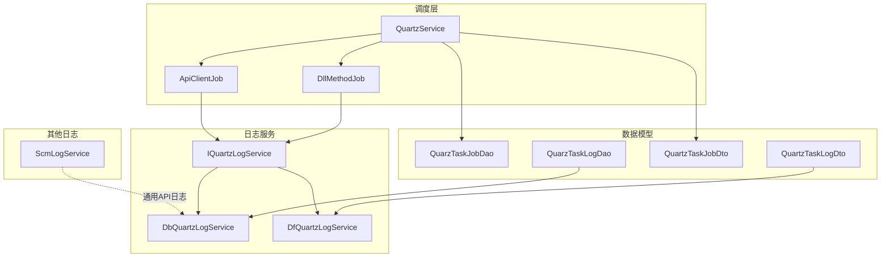
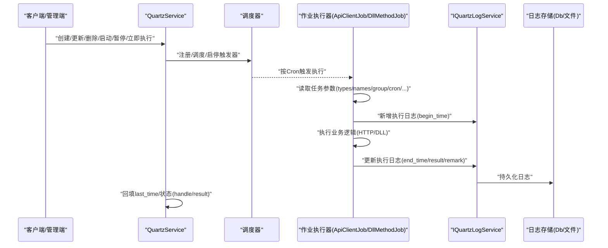
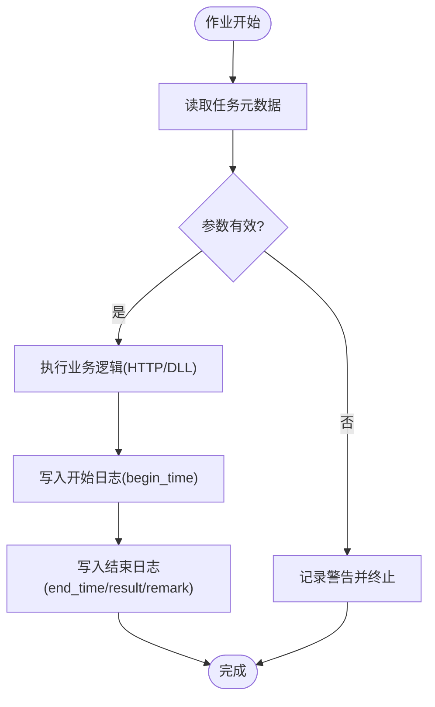
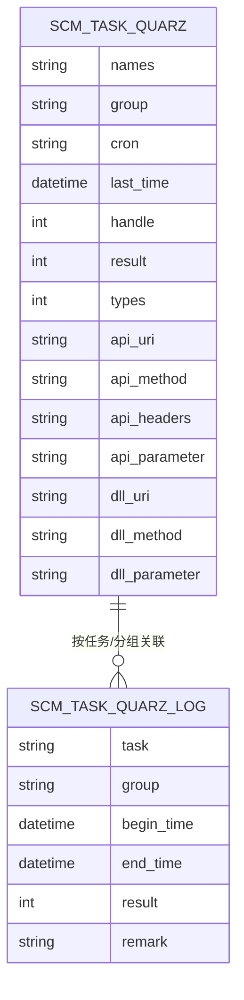
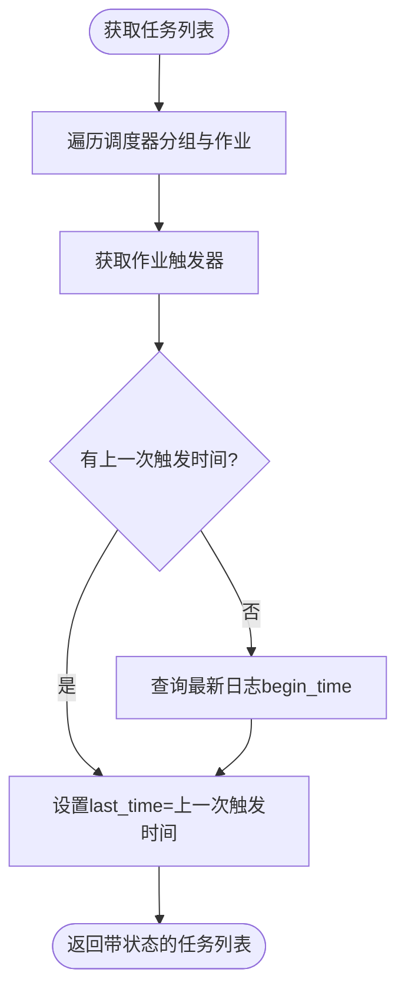
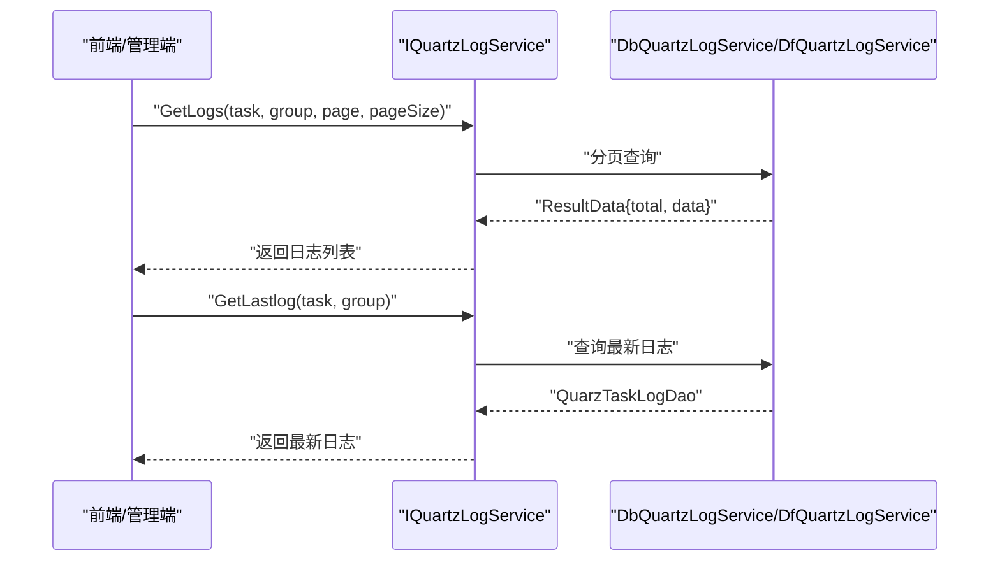
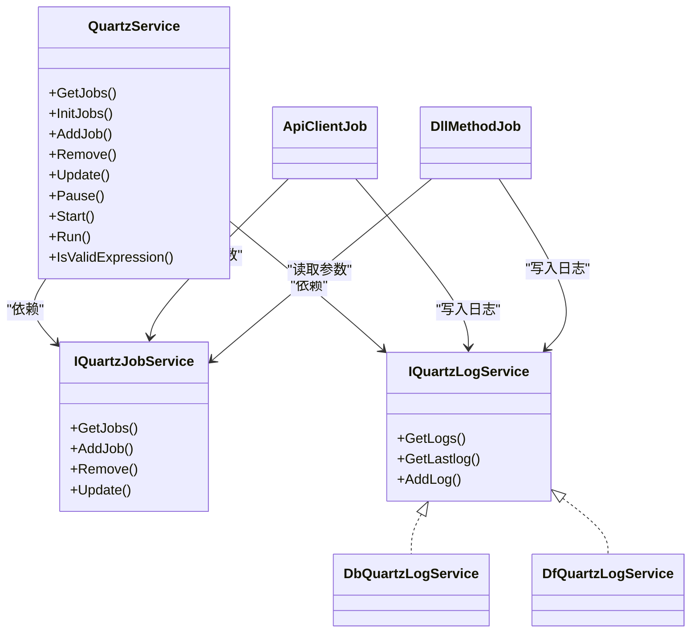

# 监控和追踪机制

<cite>
**本文引用的文件**
- [QuartzService.cs](file://Scm.Server.Quartz/QuartzService.cs)
- [QuarzTaskLogDao.cs](file://Scm.Server.Quartz/Dao/QuarzTaskLogDao.cs)
- [QuartzTaskLogDto.cs](file://Scm.Server.Quartz/Dto/QuartzTaskLogDto.cs)
- [ApiClientJob.cs](file://Scm.Server.Quartz/Jobs/ApiClientJob.cs)
- [DllMethodJob.cs](file://Scm.Server.Quartz/Jobs/DllMethodJob.cs)
- [IQuartzLogService.cs](file://Scm.Server.Quartz/Service/IQuartzLogService.cs)
- [DfQuartzLogService.cs](file://Scm.Server.Quartz/Service/Df/DfQuartzLogService.cs)
- [DbQuartzLogService.cs](file://Scm.Server.Quartz/Service/Db/DbQuartzLogService.cs)
- [QuarzTaskJobDao.cs](file://Scm.Server.Quartz/Dao/QuarzTaskJobDao.cs)
- [QuartzTaskJobDto.cs](file://Scm.Server.Quartz/Dto/QuartzTaskJobDto.cs)
- [JobHandleEnum.cs](file://Scm.Server.Quartz/Enums/JobHandleEnum.cs)
- [JobResultEnum.cs](file://Scm.Server.Quartz/Enums/JobResultEnum.cs)
- [TaskTypeEnum.cs](file://Scm.Server.Quartz/Enums/TaskTypeEnum.cs)
- [ScmLogService.cs](file://Scm.Server.Service/Service/ScmLogService.cs)
</cite>

## 目录
1. [简介](#简介)
2. [项目结构](#项目结构)
3. [核心组件](#核心组件)
4. [架构总览](#架构总览)
5. [详细组件分析](#详细组件分析)
6. [依赖关系分析](#依赖关系分析)
7. [性能考量](#性能考量)
8. [故障排查指南](#故障排查指南)
9. [结论](#结论)
10. [附录](#附录)

## 简介
本文件面向 Scm.Net 任务调度系统的监控与追踪机制，围绕任务执行日志记录、日志数据模型设计、实时监控与告警、日志查询与分析、性能指标统计以及日志清理与归档策略进行系统化技术说明。内容覆盖从任务触发到执行、日志落库或落盘、查询统计与趋势分析的全链路流程，并给出可操作的优化建议与排障指引。

## 项目结构
围绕任务调度与监控追踪，相关代码主要分布在以下模块：
- 任务调度与控制：QuartzService、作业实现（ApiClientJob、DllMethodJob）
- 日志数据模型：QuarzTaskLogDao、QuartzTaskLogDto
- 日志持久化服务：IQuartzLogService 及其数据库/文件实现（DbQuartzLogService、DfQuartzLogService）
- 任务元数据模型：QuarzTaskJobDao、QuartzTaskJobDto
- 枚举与状态：JobHandleEnum、JobResultEnum、TaskTypeEnum
- 其他日志服务：ScmLogService（通用 API 日志）

图表来源
- [QuartzService.cs:13-152](file://Scm.Server.Quartz/QuartzService.cs#L13-L152)
- [ApiClientJob.cs:14-95](file://Scm.Server.Quartz/Jobs/ApiClientJob.cs#L14-L95)
- [DllMethodJob.cs:14-87](file://Scm.Server.Quartz/Jobs/DllMethodJob.cs#L14-L87)
- [IQuartzLogService.cs:8-15](file://Scm.Server.Quartz/Service/IQuartzLogService.cs#L8-L15)
- [DbQuartzLogService.cs:9-41](file://Scm.Server.Quartz/Service/Db/DbQuartzLogService.cs#L9-L41)
- [DfQuartzLogService.cs:8-60](file://Scm.Server.Quartz/Service/Df/DfQuartzLogService.cs#L8-L60)
- [QuarzTaskJobDao.cs:14-118](file://Scm.Server.Quartz/Dao/QuarzTaskJobDao.cs#L14-L118)
- [QuartzTaskJobDto.cs:6-82](file://Scm.Server.Quartz/Dto/QuartzTaskJobDto.cs#L6-L82)
- [QuarzTaskLogDao.cs:13-51](file://Scm.Server.Quartz/Dao/QuarzTaskLogDao.cs#L13-L51)
- [QuartzTaskLogDto.cs:6-39](file://Scm.Server.Quartz/Dto/QuartzTaskLogDto.cs#L6-L39)
- [ScmLogService.cs:7-26](file://Scm.Server.Service/Service/ScmLogService.cs#L7-L26)

章节来源
- [QuartzService.cs:36-80](file://Scm.Server.Quartz/QuartzService.cs#L36-L80)
- [QuarzTaskJobDao.cs:14-118](file://Scm.Server.Quartz/Dao/QuarzTaskJobDao.cs#L14-L118)
- [QuarzTaskLogDao.cs:13-51](file://Scm.Server.Quartz/Dao/QuarzTaskLogDao.cs#L13-L51)

## 核心组件
- 任务调度与控制：QuartzService 提供任务的增删改查、启停、立即执行、校验 Cron 表达式、初始化加载与状态回填等能力；并负责在作业执行前后记录日志。
- 作业执行器：ApiClientJob 与 DllMethodJob 分别处理远程 API 调用与本地 DLL 方法执行，统一在执行前后记录开始与结束时间、结果与备注。
- 日志服务：IQuartzLogService 定义日志接口，DbQuartzLogService 基于数据库持久化，DfQuartzLogService 基于文件持久化；两者均支持新增日志、查询最新日志、分页查询历史日志。
- 数据模型：QuarzTaskJobDao/Dto 描述任务元数据（名称、分组、Cron、状态、类型、参数等）；QuarzTaskLogDao/Dto 描述执行日志（任务名、分组、开始/结束时间、结果、备注）。
- 状态与枚举：JobHandleEnum（初始/暂停/停止/启动）、JobResultEnum（失败/成功）、TaskTypeEnum（DLL/API）用于统一状态与类型标识。

章节来源
- [QuartzService.cs:98-152](file://Scm.Server.Quartz/QuartzService.cs#L98-L152)
- [ApiClientJob.cs:27-95](file://Scm.Server.Quartz/Jobs/ApiClientJob.cs#L27-L95)
- [DllMethodJob.cs:33-87](file://Scm.Server.Quartz/Jobs/DllMethodJob.cs#L33-L87)
- [IQuartzLogService.cs:8-15](file://Scm.Server.Quartz/Service/IQuartzLogService.cs#L8-L15)
- [DbQuartzLogService.cs:17-41](file://Scm.Server.Quartz/Service/Db/DbQuartzLogService.cs#L17-L41)
- [DfQuartzLogService.cs:16-60](file://Scm.Server.Quartz/Service/Df/DfQuartzLogService.cs#L16-L60)
- [QuarzTaskJobDao.cs:14-118](file://Scm.Server.Quartz/Dao/QuarzTaskJobDao.cs#L14-L118)
- [QuarzTaskLogDao.cs:13-51](file://Scm.Server.Quartz/Dao/QuarzTaskLogDao.cs#L13-L51)
- [JobHandleEnum.cs:5-16](file://Scm.Server.Quartz/Enums/JobHandleEnum.cs#L5-L16)
- [JobResultEnum.cs:3-14](file://Scm.Server.Quartz/Enums/JobResultEnum.cs#L3-L14)
- [TaskTypeEnum.cs:3-14](file://Scm.Server.Quartz/Enums/TaskTypeEnum.cs#L3-L14)

## 架构总览
下图展示了从调度器到作业执行再到日志落库/落盘的整体流程，以及与任务元数据的关系。

图表来源
- [QuartzService.cs:98-152](file://Scm.Server.Quartz/QuartzService.cs#L98-L152)
- [ApiClientJob.cs:27-95](file://Scm.Server.Quartz/Jobs/ApiClientJob.cs#L27-L95)
- [DllMethodJob.cs:33-87](file://Scm.Server.Quartz/Jobs/DllMethodJob.cs#L33-L87)
- [IQuartzLogService.cs:8-15](file://Scm.Server.Quartz/Service/IQuartzLogService.cs#L8-L15)
- [DbQuartzLogService.cs:17-41](file://Scm.Server.Quartz/Service/Db/DbQuartzLogService.cs#L17-L41)
- [DfQuartzLogService.cs:16-60](file://Scm.Server.Quartz/Service/Df/DfQuartzLogService.cs#L16-L60)

## 详细组件分析

### 组件一：任务执行日志记录机制
- 记录时机：作业开始时写入一条日志（begin_time），作业结束后补充结束时间、结果与备注（remark）。
- 记录内容：任务名、分组、开始/结束时间、执行结果（成功/失败）、备注（HTTP 返回或异常信息）。
- 写入路径：ApiClientJob 与 DllMethodJob 在执行后调用 IQuartzLogService.AddLog，具体由 DbQuartzLogService 或 DfQuartzLogService 实现。

图表来源
- [ApiClientJob.cs:27-95](file://Scm.Server.Quartz/Jobs/ApiClientJob.cs#L27-L95)
- [DllMethodJob.cs:33-87](file://Scm.Server.Quartz/Jobs/DllMethodJob.cs#L33-L87)
- [IQuartzLogService.cs:8-15](file://Scm.Server.Quartz/Service/IQuartzLogService.cs#L8-L15)
- [DbQuartzLogService.cs:17-41](file://Scm.Server.Quartz/Service/Db/DbQuartzLogService.cs#L17-L41)
- [DfQuartzLogService.cs:16-60](file://Scm.Server.Quartz/Service/Df/DfQuartzLogService.cs#L16-L60)

章节来源
- [ApiClientJob.cs:47-93](file://Scm.Server.Quartz/Jobs/ApiClientJob.cs#L47-L93)
- [DllMethodJob.cs:50-86](file://Scm.Server.Quartz/Jobs/DllMethodJob.cs#L50-L86)
- [IQuartzLogService.cs:10-14](file://Scm.Server.Quartz/Service/IQuartzLogService.cs#L10-L14)

### 组件二：日志数据模型设计
- 表结构与字段
  - scm_task_quarz_log：任务执行日志表
    - 字段示例：task（任务名）、group（分组名）、begin_time（开始时间）、end_time（结束时间，可空）、result（执行结果）、remark（备注）
  - scm_task_quarz：任务表
    - 字段示例：names（任务名）、group（分组名）、cron（Cron 表达式）、last_time（最近一次运行时间）、handle（运行状态）、result（执行结果）、types（任务类型）、api_* / dll_* 参数
- 索引优化建议
  - 建议在 scm_task_quarz_log 上对 task、group、begin_time 建立复合索引，以提升按任务维度查询与时间范围筛选效率。
  - 对 scm_task_quarz 的 names/group/cron 等常用过滤字段建立合适索引，保障任务列表与状态回填查询性能。
- 字段长度与约束
  - 名称类字段限制长度，避免超长键导致索引膨胀。
  - 结束时间 end_time 设为可空，便于记录执行中状态。

图表来源
- [QuarzTaskJobDao.cs:14-118](file://Scm.Server.Quartz/Dao/QuarzTaskJobDao.cs#L14-L118)
- [QuarzTaskLogDao.cs:13-51](file://Scm.Server.Quartz/Dao/QuarzTaskLogDao.cs#L13-L51)

章节来源
- [QuarzTaskJobDao.cs:14-118](file://Scm.Server.Quartz/Dao/QuarzTaskJobDao.cs#L14-L118)
- [QuarzTaskLogDao.cs:13-51](file://Scm.Server.Quartz/Dao/QuarzTaskLogDao.cs#L13-L51)

### 组件三：实时监控与状态回填
- 状态回填：GetJobs 会遍历调度器中的作业与触发器，优先使用上一次触发时间，若无则查询最新日志的开始时间作为 last_time，确保前端展示的“最近一次运行时间”准确。
- 运行状态：handle 字段映射 JobHandleEnum，涵盖初始、暂停、停止、启动等状态；result 字段映射 JobResultEnum，记录成功/失败。
- 异常处理：调度与执行过程均捕获异常并写入日志，便于后续排查。

图表来源
- [QuartzService.cs:36-80](file://Scm.Server.Quartz/QuartzService.cs#L36-L80)

章节来源
- [QuartzService.cs:36-80](file://Scm.Server.Quartz/QuartzService.cs#L36-L80)
- [JobHandleEnum.cs:5-16](file://Scm.Server.Quartz/Enums/JobHandleEnum.cs#L5-L16)
- [JobResultEnum.cs:3-14](file://Scm.Server.Quartz/Enums/JobResultEnum.cs#L3-L14)

### 组件四：日志查询与分析
- 查询接口
  - 获取最新日志：GetLastlog
  - 分页查询历史日志：GetLogs（支持按任务名与分组过滤）
- 文件与数据库两种实现
  - 文件实现：DfQuartzLogService 通过内存集合模拟文件读写，适合小规模场景。
  - 数据库实现：DbQuartzLogService 使用 SqlSugar 直接插入与查询，适合生产环境。
- 历史数据检索与统计
  - 可基于任务名/分组/时间范围进行筛选。
  - 可结合前端展示生成趋势图（按天/小时粒度聚合）。

图表来源
- [IQuartzLogService.cs:10-14](file://Scm.Server.Quartz/Service/IQuartzLogService.cs#L10-L14)
- [DbQuartzLogService.cs:31-41](file://Scm.Server.Quartz/Service/Db/DbQuartzLogService.cs#L31-L41)
- [DfQuartzLogService.cs:33-58](file://Scm.Server.Quartz/Service/Df/DfQuartzLogService.cs#L33-L58)

章节来源
- [IQuartzLogService.cs:10-14](file://Scm.Server.Quartz/Service/IQuartzLogService.cs#L10-L14)
- [DbQuartzLogService.cs:31-41](file://Scm.Server.Quartz/Service/Db/DbQuartzLogService.cs#L31-L41)
- [DfQuartzLogService.cs:33-58](file://Scm.Server.Quartz/Service/Df/DfQuartzLogService.cs#L33-L58)

### 组件五：性能监控指标与展示
- 关键指标
  - 执行时间：end_time - begin_time
  - 成功率/失败率：按任务/分组/时间窗口统计成功/失败次数占比
  - 平均耗时/最大耗时/最小耗时：按任务维度聚合
  - 触发频率：统计单位时间内任务触发次数
- 计算与展示
  - 可通过分页查询日志后在服务端或前端聚合计算。
  - 建议按天/小时/任务维度生成趋势图，辅助容量规划与异常定位。

章节来源
- [QuarzTaskLogDao.cs:28-38](file://Scm.Server.Quartz/Dao/QuarzTaskLogDao.cs#L28-L38)
- [ApiClientJob.cs:83-93](file://Scm.Server.Quartz/Jobs/ApiClientJob.cs#L83-L93)
- [DllMethodJob.cs:77-86](file://Scm.Server.Quartz/Jobs/DllMethodJob.cs#L77-L86)

### 组件六：日志清理策略、归档与存储优化
- 清理策略
  - 基于保留周期：例如仅保留最近 90 天的日志，到期自动清理。
  - 基于大小阈值：当日志总量超过阈值时，按最旧优先策略清理。
- 归档机制
  - 将历史日志导出为压缩文件，迁移至冷存储或独立数据库实例。
  - 归档前进行去重与压缩，降低存储成本。
- 存储优化
  - 数据库存储：对日志表建立合适的索引与分区（按时间分区）。
  - 文件存储：采用滚动文件与压缩，定期合并与清理。

章节来源
- [DbQuartzLogService.cs:17-29](file://Scm.Server.Quartz/Service/Db/DbQuartzLogService.cs#L17-L29)
- [DfQuartzLogService.cs:16-31](file://Scm.Server.Quartz/Service/Df/DfQuartzLogService.cs#L16-L31)

### 组件七：告警与通知机制
- 告警维度
  - 连续失败次数阈值
  - 单次执行超时阈值
  - 任务长时间未运行（超过预期周期）
- 告警示例
  - 失败告警：当任务连续 N 次失败或单次执行异常时，触发通知。
  - 性能告警：执行时间超过阈值时告警。
- 通知渠道
  - 邮件、IM、短信等（需在系统中扩展对应通知服务）。
- 建议实现方式
  - 在日志查询侧增加阈值检测与告警推送；或在作业执行侧根据 result/耗时触发告警。

章节来源
- [ApiClientJob.cs:77-81](file://Scm.Server.Quartz/Jobs/ApiClientJob.cs#L77-L81)
- [DllMethodJob.cs:71-75](file://Scm.Server.Quartz/Jobs/DllMethodJob.cs#L71-L75)
- [IQuartzLogService.cs:10-14](file://Scm.Server.Quartz/Service/IQuartzLogService.cs#L10-L14)

## 依赖关系分析
- QuartzService 依赖 IQuartzJobService 与 IQuartzLogService，负责任务生命周期管理与状态回填。
- 作业执行器依赖 IQuartzJobService 获取任务参数，依赖 IQuartzLogService 写入日志。
- 日志服务接口可替换为数据库或文件实现，保证日志落库一致性。
- 任务元数据模型与日志模型通过 task/group 字段关联，便于按任务维度聚合分析。

图表来源
- [QuartzService.cs:13-29](file://Scm.Server.Quartz/QuartzService.cs#L13-L29)
- [IQuartzJobService.cs:9-39](file://Scm.Server.Quartz/Service/IQuartzJobService.cs#L9-L39)
- [IQuartzLogService.cs:8-15](file://Scm.Server.Quartz/Service/IQuartzLogService.cs#L8-L15)
- [DbQuartzLogService.cs:9-15](file://Scm.Server.Quartz/Service/Db/DbQuartzLogService.cs#L9-L15)
- [DfQuartzLogService.cs:8-14](file://Scm.Server.Quartz/Service/Df/DfQuartzLogService.cs#L8-L14)
- [ApiClientJob.cs:16-25](file://Scm.Server.Quartz/Jobs/ApiClientJob.cs#L16-L25)
- [DllMethodJob.cs:16-31](file://Scm.Server.Quartz/Jobs/DllMethodJob.cs#L16-L31)

章节来源
- [QuartzService.cs:13-29](file://Scm.Server.Quartz/QuartzService.cs#L13-L29)
- [IQuartzJobService.cs:9-39](file://Scm.Server.Quartz/Service/IQuartzJobService.cs#L9-L39)
- [IQuartzLogService.cs:8-15](file://Scm.Server.Quartz/Service/IQuartzLogService.cs#L8-L15)

## 性能考量
- 日志写入
  - 数据库写入：批量插入、异步写入、连接池复用，避免阻塞作业执行。
  - 文件写入：采用缓冲与异步 IO，避免频繁磁盘写入。
- 查询性能
  - 为日志表建立 task/group/begin_time 复合索引，减少扫描。
  - 分页查询时限制 pageSize，避免一次性拉取过多数据。
- 资源占用
  - 控制日志保留周期与归档策略，避免日志表无限增长。
  - 对热点任务可考虑只记录关键日志，降低写入压力。

## 故障排查指南
- 任务未启动/状态异常
  - 检查 handle 字段是否为 Running；查看初始化日志与异常信息。
  - 使用 IsQuartzJob 校验作业是否存在，核对分组与名称。
- 执行异常
  - 查看日志 remark 中的异常信息；关注作业执行器中的异常捕获与日志写入。
- 日志缺失
  - 确认 IQuartzLogService 的实现是否正确；检查数据库连接或文件路径权限。
- 性能问题
  - 检查日志表索引与查询条件；评估归档与清理策略是否到位。

章节来源
- [QuartzService.cs:513-547](file://Scm.Server.Quartz/QuartzService.cs#L513-L547)
- [ApiClientJob.cs:77-92](file://Scm.Server.Quartz/Jobs/ApiClientJob.cs#L77-L92)
- [DllMethodJob.cs:71-86](file://Scm.Server.Quartz/Jobs/DllMethodJob.cs#L71-L86)
- [DbQuartzLogService.cs:17-29](file://Scm.Server.Quartz/Service/Db/DbQuartzLogService.cs#L17-L29)
- [DfQuartzLogService.cs:16-31](file://Scm.Server.Quartz/Service/Df/DfQuartzLogService.cs#L16-L31)

## 结论
Scm.Net 的任务调度监控体系以 Quartz 为核心，结合统一的日志接口与两种存储实现，实现了从任务生命周期管理到执行日志记录、查询与分析的完整闭环。通过合理的索引与清理/归档策略，可在保证可观测性的同时兼顾性能与成本。建议在现有基础上进一步完善告警与通知机制，并持续优化查询与聚合逻辑，以满足更复杂的运维与分析需求。

## 附录
- 通用 API 日志服务：ScmLogService 提供通用日志写入能力，可用于系统级 API 调用记录，便于与任务日志协同分析。

章节来源
- [ScmLogService.cs:7-26](file://Scm.Server.Service/Service/ScmLogService.cs#L7-L26)