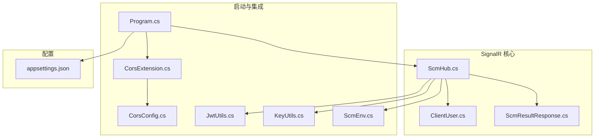
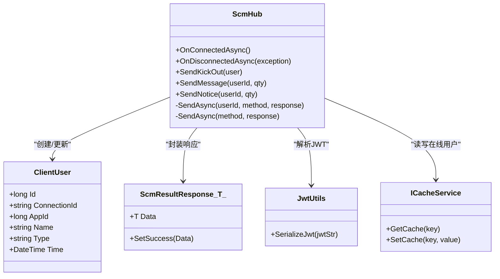
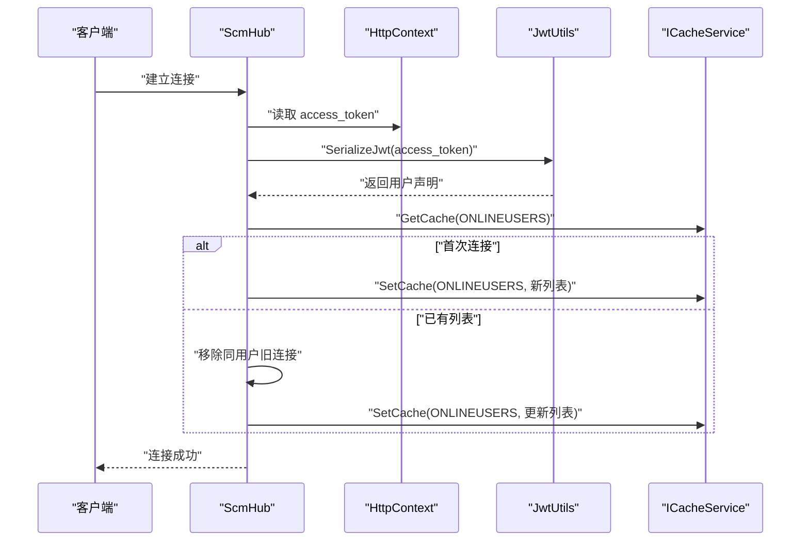
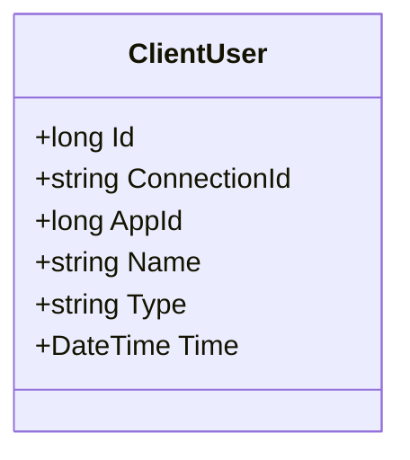
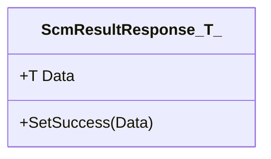
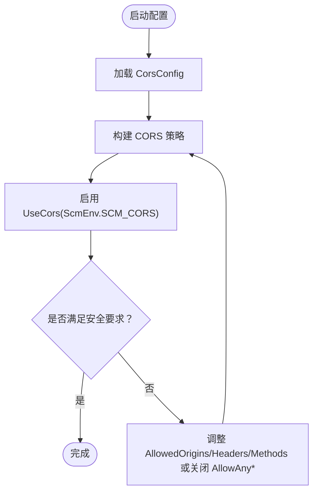
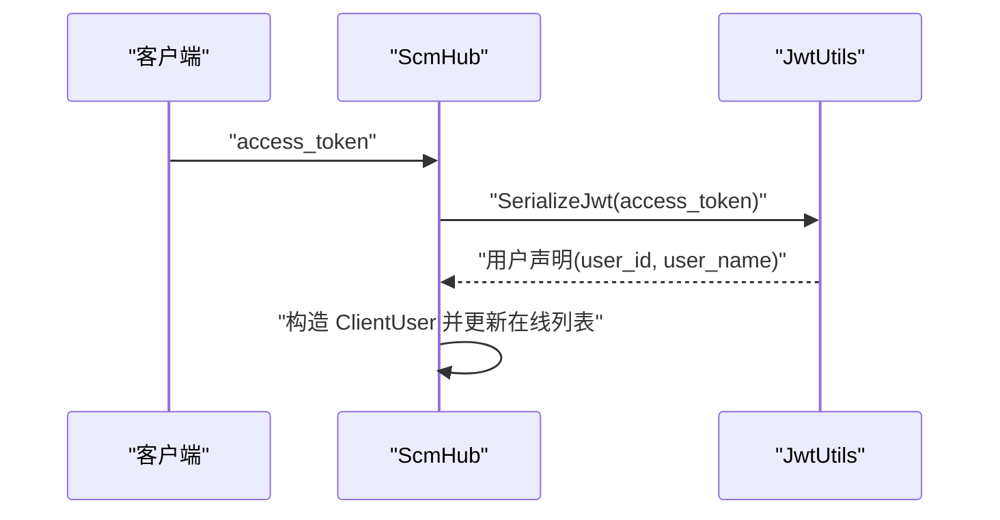
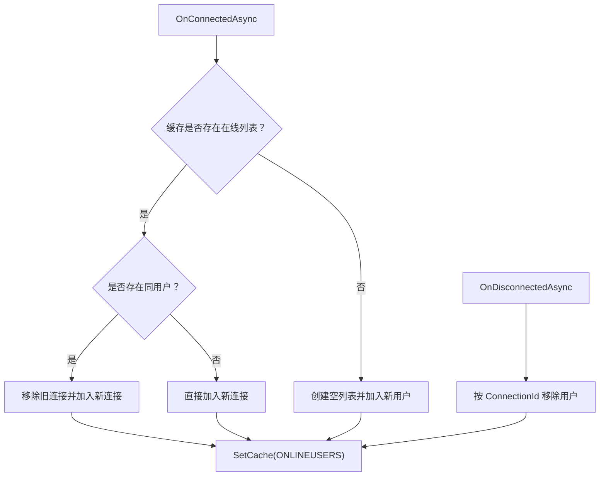
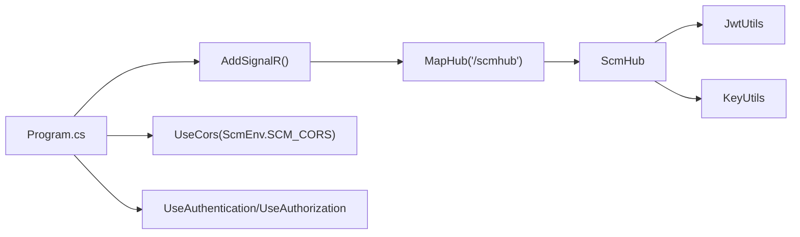

# SignalR 架构设计

<cite>
**本文引用的文件**
- [ScmHub.cs](file://Scm.Server.SignalR/Hubs/ScmHub.cs)
- [ClientUser.cs](file://Scm.Server.SignalR/Hubs/ClientUser.cs)
- [ScmResultResponse.cs](file://Scm.Server.SignalR/Hubs/ScmResultResponse.cs)
- [Program.cs](file://Scm.Net/Program.cs)
- [CorsExtension.cs](file://Scm.Server/Extensions/CorsExtension.cs)
- [CorsConfig.cs](file://Scm.Server/Config/CorsConfig.cs)
- [JwtUtils.cs](file://Scm.Server/Utils/JwtUtils.cs)
- [KeyUtils.cs](file://Scm.Common/Utils/KeyUtils.cs)
- [ScmEnv.cs](file://Scm.Common/ScmEnv.cs)
- [appsettings.json](file://Scm.Net/appsettings.json)
</cite>

## 目录
1. [简介](#简介)
2. [项目结构](#项目结构)
3. [核心组件](#核心组件)
4. [架构总览](#架构总览)
5. [详细组件分析](#详细组件分析)
6. [依赖关系分析](#依赖关系分析)
7. [性能考量](#性能考量)
8. [故障排查指南](#故障排查指南)
9. [结论](#结论)

## 简介
本文面向 SignalR 架构设计，聚焦 ScmHub 的核心实现与运行机制，系统阐述以下主题：
- Hub 继承关系与 SignalR 生命周期钩子
- 连接生命周期管理与用户会话跟踪
- ClientUser 类的数据模型与职责边界
- OnConnectedAsync/OnDisconnectedAsync 的实现原理与安全校验
- CORS 配置策略与安全注意事项
- 关键流程的时序图与架构图，帮助开发者快速理解整体设计

## 项目结构
围绕 SignalR 的关键文件组织如下：
- Hubs 层：ScmHub、ClientUser、ScmResultResponse
- 启动与集成：Program.cs（注册 SignalR、CORS、JWT）
- 配置与扩展：CorsExtension、CorsConfig、JwtUtils、KeyUtils、ScmEnv
- 配置文件：appsettings.json（CORS 参数）

**图表来源**
- [ScmHub.cs:1-155](file://Scm.Server.SignalR/Hubs/ScmHub.cs#L1-L155)
- [ClientUser.cs:1-39](file://Scm.Server.SignalR/Hubs/ClientUser.cs#L1-L39)
- [ScmResultResponse.cs:1-16](file://Scm.Server.SignalR/Hubs/ScmResultResponse.cs#L1-L16)
- [Program.cs:166-238](file://Scm.Net/Program.cs#L166-L238)
- [CorsExtension.cs:1-59](file://Scm.Server/Extensions/CorsExtension.cs#L1-L59)
- [CorsConfig.cs:1-49](file://Scm.Server/Config/CorsConfig.cs#L1-L49)
- [JwtUtils.cs:1-88](file://Scm.Server/Utils/JwtUtils.cs#L1-L88)
- [KeyUtils.cs:1-73](file://Scm.Common/Utils/KeyUtils.cs#L1-L73)
- [ScmEnv.cs:28-30](file://Scm.Common/ScmEnv.cs#L28-L30)
- [appsettings.json:115-126](file://Scm.Net/appsettings.json#L115-L126)

**章节来源**
- [Program.cs:166-238](file://Scm.Net/Program.cs#L166-L238)
- [ScmHub.cs:1-155](file://Scm.Server.SignalR/Hubs/ScmHub.cs#L1-L155)

## 核心组件
- ScmHub：继承自 SignalR Hub，负责连接建立/断开、用户会话缓存、消息派发与踢人控制。
- ClientUser：承载在线用户的标识、连接ID、应用ID、登录名、类型、时间戳等字段。
- ScmResultResponse<T>：统一响应载体，包含业务状态码与泛型数据。
- JwtUtils：JWT 解析工具，从 access_token 提取用户声明并反序列化为 ScmToken。
- KeyUtils：集中式缓存键常量，如 ONLINEUSERS。
- CorsExtension/CorsConfig/ScmEnv：CORS 策略构建与命名常量。

**章节来源**
- [ScmHub.cs:10-19](file://Scm.Server.SignalR/Hubs/ScmHub.cs#L10-L19)
- [ClientUser.cs:6-37](file://Scm.Server.SignalR/Hubs/ClientUser.cs#L6-L37)
- [ScmResultResponse.cs:5-14](file://Scm.Server.SignalR/Hubs/ScmResultResponse.cs#L5-L14)
- [JwtUtils.cs:46-87](file://Scm.Server/Utils/JwtUtils.cs#L46-L87)
- [KeyUtils.cs:59-61](file://Scm.Common/Utils/KeyUtils.cs#L59-L61)
- [CorsExtension.cs:17-54](file://Scm.Server/Extensions/CorsExtension.cs#L17-L54)
- [CorsConfig.cs:24-46](file://Scm.Server/Config/CorsConfig.cs#L24-L46)
- [ScmEnv.cs:30](file://Scm.Common/ScmEnv.cs#L30)

## 架构总览
ScmHub 通过依赖注入获取 HttpContext 与缓存服务，在连接建立时解析 JWT，构造 ClientUser 并写入缓存；在断开时移除对应记录；同时提供基于用户ID的定向消息派发与全局广播能力。

**图表来源**
- [ScmHub.cs:25-153](file://Scm.Server.SignalR/Hubs/ScmHub.cs#L25-L153)
- [ClientUser.cs:6-37](file://Scm.Server.SignalR/Hubs/ClientUser.cs#L6-L37)
- [ScmResultResponse.cs:5-14](file://Scm.Server.SignalR/Hubs/ScmResultResponse.cs#L5-L14)
- [JwtUtils.cs:46-87](file://Scm.Server/Utils/JwtUtils.cs#L46-L87)

## 详细组件分析

### ScmHub：连接生命周期与会话管理
- CORS 策略：通过 [EnableCors(ScmEnv.SCM_CORS)] 对 Hub 启用跨域策略。
- OnConnectedAsync：
  - 从请求查询参数提取 access_token。
  - 使用 JwtUtils 解析 JWT，得到用户标识与名称。
  - 构造 ClientUser，包含 Id、Name、ConnectionId、Time。
  - 从缓存读取在线用户列表，若存在同用户则先移除旧连接，再添加新连接，最后回写缓存。
- OnDisconnectedAsync：
  - 根据当前连接ID从在线用户列表中移除对应项，并更新缓存。
- 消息派发：
  - SendKickOut：按用户ID查找在线连接，移除并广播“被踢出”通知。
  - SendMessage/SendNotice：构造 ScmResultResponse，按 userId 查找连接并定向发送。
  - 内部 SendAsync(userId, ...)：优先定向；内部 SendAsync(method, ...)：广播给所有客户端。

**图表来源**
- [ScmHub.cs:25-67](file://Scm.Server.SignalR/Hubs/ScmHub.cs#L25-L67)
- [JwtUtils.cs:46-87](file://Scm.Server/Utils/JwtUtils.cs#L46-L87)
- [KeyUtils.cs:59-61](file://Scm.Common/Utils/KeyUtils.cs#L59-L61)

**章节来源**
- [ScmHub.cs:9-19](file://Scm.Server.SignalR/Hubs/ScmHub.cs#L9-L19)
- [ScmHub.cs:25-67](file://Scm.Server.SignalR/Hubs/ScmHub.cs#L25-L67)
- [ScmHub.cs:74-89](file://Scm.Server.SignalR/Hubs/ScmHub.cs#L74-L89)
- [ScmHub.cs:95-110](file://Scm.Server.SignalR/Hubs/ScmHub.cs#L95-L110)
- [ScmHub.cs:118-148](file://Scm.Server.SignalR/Hubs/ScmHub.cs#L118-L148)

### ClientUser：用户会话数据模型
- 字段说明：
  - Id：用户唯一标识（长整型）。
  - ConnectionId：SignalR 连接ID。
  - AppId：应用编号（长整型）。
  - Name：登录名（字符串）。
  - Type：操作类型（字符串）。
  - Time：时间戳（DateTime）。
- 用途：作为在线用户列表的元素，用于定位目标连接并进行定向消息派发。

**图表来源**
- [ClientUser.cs:6-37](file://Scm.Server.SignalR/Hubs/ClientUser.cs#L6-L37)

**章节来源**
- [ClientUser.cs:6-37](file://Scm.Server.SignalR/Hubs/ClientUser.cs#L6-L37)

### ScmResultResponse<T>：统一响应载体
- 结构：包含 Code 与 Data 泛型字段。
- 方法：SetSuccess(Data) 设置成功状态与数据。
- 用途：封装业务数据并通过 SignalR 发送给前端。

**图表来源**
- [ScmResultResponse.cs:5-14](file://Scm.Server.SignalR/Hubs/ScmResultResponse.cs#L5-L14)

**章节来源**
- [ScmResultResponse.cs:5-14](file://Scm.Server.SignalR/Hubs/ScmResultResponse.cs#L5-L14)

### CORS 配置与安全
- 策略命名：ScmEnv.SCM_CORS（常量）。
- 策略构建：CorsExtension 根据 CorsConfig 动态配置 AllowAnyOrigin/WithOrigins、AllowAnyMethod/WithMethods、AllowAnyHeader/WithHeaders、AllowCredentials、ExposedHeaders、PreflightMaxAge。
- 启用方式：Program.cs 中通过 app.UseCors(ScmEnv.SCM_CORS) 或全局策略启用。
- 安全要点：
  - 仅在受控环境下允许 AllowAnyOrigin。
  - 明确 AllowedOrigins 与 AllowedHeaders，避免过度放行。
  - AllowCredentials 与 AllowAnyOrigin 不可同时使用（需配合具体 Origins）。
  - PreflightMaxAge 合理设置以减少预检请求频率。

**图表来源**
- [CorsExtension.cs:17-54](file://Scm.Server/Extensions/CorsExtension.cs#L17-L54)
- [CorsConfig.cs:24-46](file://Scm.Server/Config/CorsConfig.cs#L24-L46)
- [ScmEnv.cs:30](file://Scm.Common/ScmEnv.cs#L30)
- [appsettings.json:115-126](file://Scm.Net/appsettings.json#L115-L126)

**章节来源**
- [CorsExtension.cs:8-56](file://Scm.Server/Extensions/CorsExtension.cs#L8-L56)
- [CorsConfig.cs:24-46](file://Scm.Server/Config/CorsConfig.cs#L24-L46)
- [ScmEnv.cs:30](file://Scm.Common/ScmEnv.cs#L30)
- [appsettings.json:115-126](file://Scm.Net/appsettings.json#L115-L126)

### JWT 令牌验证与用户识别
- 令牌来源：客户端连接时携带 access_token 查询参数。
- 解析流程：JwtUtils.SerializeJwt 读取 JWT 并提取用户声明（如 user_id、user_name 等），用于构造 ClientUser。
- 安全建议：
  - 严格校验签名与有效期。
  - 避免在 URL 中长期暴露 access_token，优先通过 Authorization 头或 Cookie。
  - 结合后端黑名单与过期策略，确保令牌撤销即时生效。

**图表来源**
- [ScmHub.cs:30-44](file://Scm.Server.SignalR/Hubs/ScmHub.cs#L30-L44)
- [JwtUtils.cs:46-87](file://Scm.Server/Utils/JwtUtils.cs#L46-L87)

**章节来源**
- [ScmHub.cs:30-44](file://Scm.Server.SignalR/Hubs/ScmHub.cs#L30-L44)
- [JwtUtils.cs:46-87](file://Scm.Server/Utils/JwtUtils.cs#L46-L87)

### 缓存与连接池维护
- 缓存键：KeyUtils.ONLINEUSERS 作为在线用户列表的键。
- 维护策略：
  - OnConnectedAsync：若同用户已在线，先移除旧连接，再添加新连接，保证同一用户仅保留最新连接。
  - OnDisconnectedAsync：根据 ConnectionId 移除对应用户。
  - SendKickOut：按用户ID移除并广播“被踢出”事件。
- 复杂度：列表查找与更新为 O(n)，n 为在线用户数；建议结合更高效的数据结构（如字典）优化。

**图表来源**
- [ScmHub.cs:46-86](file://Scm.Server.SignalR/Hubs/ScmHub.cs#L46-L86)
- [KeyUtils.cs:59-61](file://Scm.Common/Utils/KeyUtils.cs#L59-L61)

**章节来源**
- [ScmHub.cs:46-86](file://Scm.Server.SignalR/Hubs/ScmHub.cs#L46-L86)
- [KeyUtils.cs:59-61](file://Scm.Common/Utils/KeyUtils.cs#L59-L61)

## 依赖关系分析
- ScmHub 依赖：
  - IHttpContextAccessor：读取 access_token。
  - ICacheService：维护在线用户列表。
  - JwtUtils：解析 JWT。
  - ScmEnv：CORS 策略名称。
- 启动阶段依赖注入与中间件顺序：
  - Program.cs 中先注册 SignalR，再启用 CORS、认证与授权，最后映射到 /scmhub。

**图表来源**
- [Program.cs:166-238](file://Scm.Net/Program.cs#L166-L238)
- [ScmHub.cs:9-19](file://Scm.Server.SignalR/Hubs/ScmHub.cs#L9-L19)
- [ScmEnv.cs:30](file://Scm.Common/ScmEnv.cs#L30)

**章节来源**
- [Program.cs:166-238](file://Scm.Net/Program.cs#L166-L238)
- [ScmHub.cs:9-19](file://Scm.Server.SignalR/Hubs/ScmHub.cs#L9-L19)

## 性能考量
- 在线用户列表规模：当前实现以 List<OnlineUser> 存储，查找与更新为 O(n)。建议：
  - 引入 ConcurrentDictionary<long, string>（UserId -> ConnectionId）以支持 O(1) 定位。
  - 引入 ConcurrentDictionary<string, ClientUser>（ConnectionId -> ClientUser）以支持断连快速定位。
- 缓存粒度：将在线用户列表拆分为“用户->连接”和“连接->用户”的双向索引，降低并发冲突概率。
- 广播与定向：SendAsync(userId, ...) 已具备定向能力；广播 SendAsync(method, ...) 可按需限制范围。
- 预检请求：合理设置 PreflightMaxAge，减少 OPTIONS 预检调用频率。

## 故障排查指南
- 连接失败（CORS 错误）
  - 检查 appsettings.json 中的 AllowedOrigins 是否包含客户端域名。
  - 确认 UseCors(ScmEnv.SCM_CORS) 已正确启用。
- 无法解析 JWT
  - 确认 access_token 未过期且签名有效。
  - 检查 JwtUtils 的签名密钥与发行者/受众配置。
- 用户重复登录导致连接丢失
  - OnConnectedAsync 已自动移除旧连接；确认缓存键一致（KeyUtils.ONLINEUSERS）。
- 踢人无效
  - SendKickOut 依赖 userId；确认前端传入的是用户ID字符串。
  - 确认缓存中存在该用户且连接ID匹配。

**章节来源**
- [appsettings.json:115-126](file://Scm.Net/appsettings.json#L115-L126)
- [CorsExtension.cs:17-54](file://Scm.Server/Extensions/CorsExtension.cs#L17-L54)
- [JwtUtils.cs:46-87](file://Scm.Server/Utils/JwtUtils.cs#L46-L87)
- [ScmHub.cs:46-67](file://Scm.Server.SignalR/Hubs/ScmHub.cs#L46-L67)
- [ScmHub.cs:95-110](file://Scm.Server.SignalR/Hubs/ScmHub.cs#L95-L110)

## 结论
ScmHub 通过简洁的 Hub 继承与缓存策略，实现了基于 JWT 的用户会话跟踪与消息派发。其核心优势在于：
- 明确的生命周期钩子与缓存一致性保障；
- 基于用户ID的定向派发与全局广播能力；
- 可配置的 CORS 策略与安全参数。

建议在高并发场景下进一步优化缓存索引结构与连接池管理，以提升性能与稳定性。