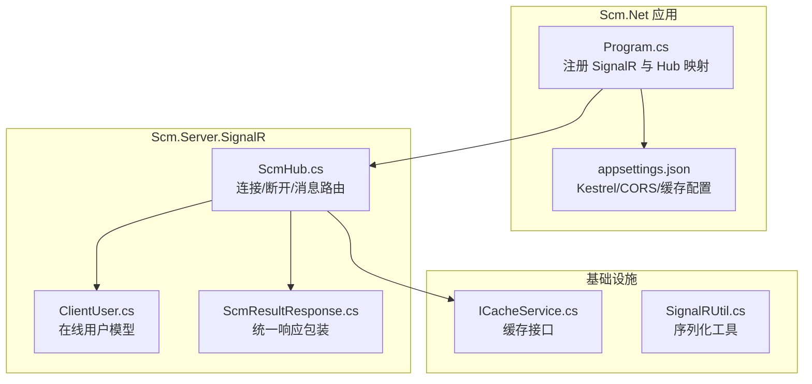
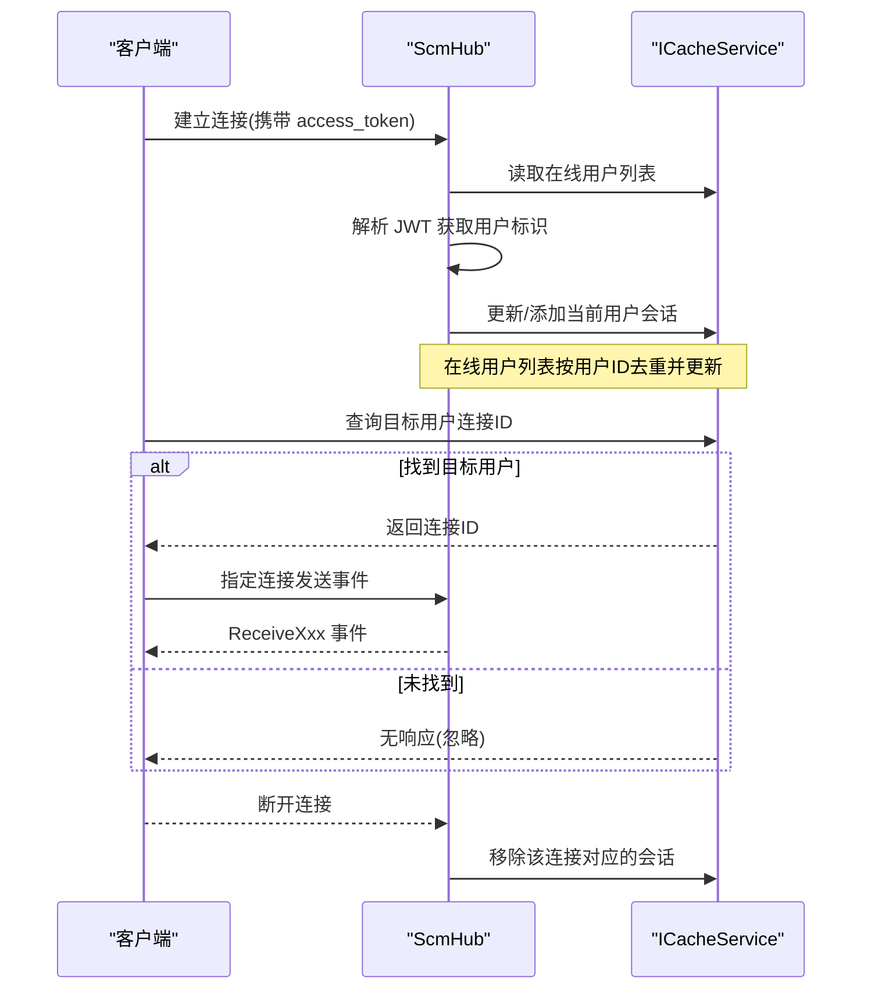
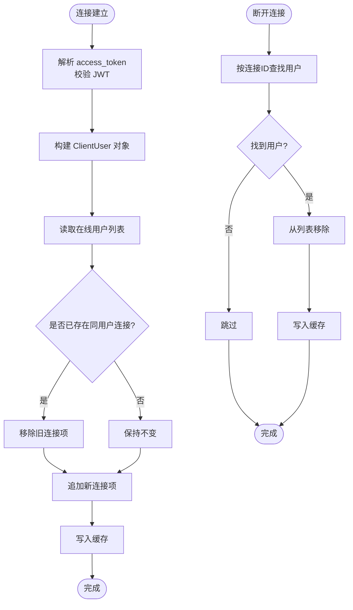
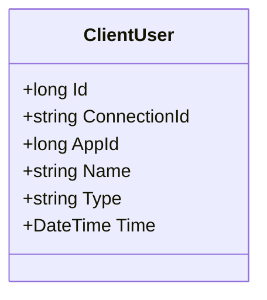
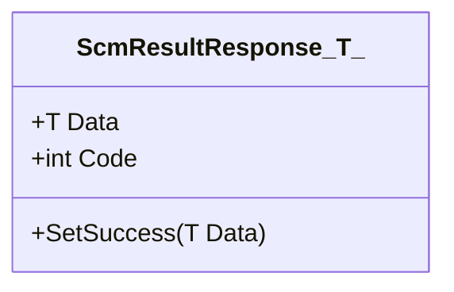
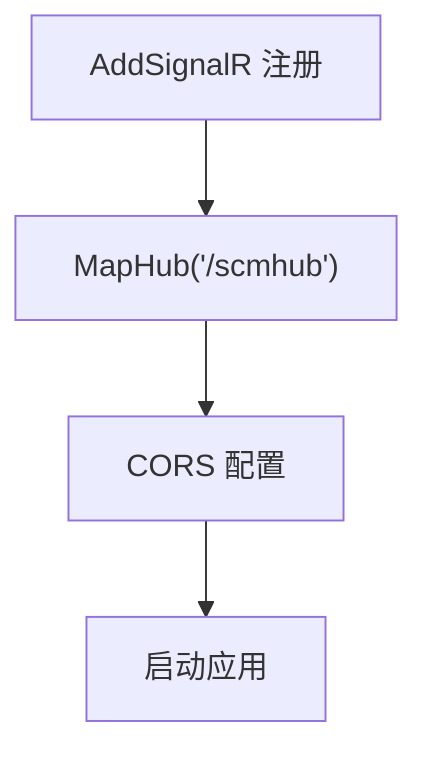
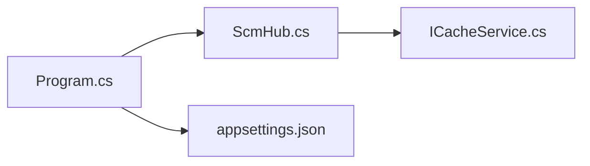

# 实时通信系统

<cite>
**本文引用的文件**
- [ScmHub.cs](file://Scm.Server.SignalR/Hubs/ScmHub.cs)
- [ClientUser.cs](file://Scm.Server.SignalR/Hubs/ClientUser.cs)
- [ScmResultResponse.cs](file://Scm.Server.SignalR/Hubs/ScmResultResponse.cs)
- [Program.cs](file://Scm.Net/Program.cs)
- [appsettings.json](file://Scm.Net/appsettings.json)
- [NasMessageService.cs](file://Nas.Server/Msg/NasMessageService.cs)
- [ClientExample.md](file://Nas.Server/Msg/ClientExample.md)
- [ICacheService.cs](file://Scm.Cache/Cache/ICacheService.cs)
- [SignalRUtil.cs](file://Scm.Core/Msg/SignalRUtil.cs)
</cite>

## 更新摘要
**所做更改**
- 更新了实时通信系统文档以反映Wiki文档系统的重构
- 简化了文档结构，专注于核心SignalR功能说明
- 移除了详细的NAS消息推送相关内容，保留基础架构说明
- 更新了客户端集成示例，反映当前可用的示例文件

## 目录
1. [简介](#简介)
2. [项目结构](#项目结构)
3. [核心组件](#核心组件)
4. [架构总览](#架构总览)
5. [组件详解](#组件详解)
6. [依赖关系分析](#依赖关系分析)
7. [性能与扩展性](#性能与扩展性)
8. [故障排除指南](#故障排除指南)
9. [结论](#结论)
10. [附录](#附录)

## 简介
本技术文档面向 Scm.Net 的实时通信系统，聚焦于基于 SignalR 的实时通信架构。文档详细阐述了 ScmHub 的实现原理、连接管理机制、用户会话跟踪和消息路由流程。系统通过统一的响应包装和缓存策略，实现了可靠的实时通信功能。文档涵盖了服务器端 SignalR Hub 的配置、客户端连接示例以及性能优化建议。

## 项目结构
实时通信相关模块主要分布在以下位置：
- 服务器端 SignalR Hub 与模型：Scm.Server.SignalR/Hubs
- 信号中心注册与运行时配置：Scm.Net/Program.cs
- 配置文件：Scm.Net/appsettings.json
- 缓存接口：Scm.Cache/Cache/ICacheService.cs
- JSON 工具：Scm.Core/Msg/SignalRUtil.cs

**图表来源**
- [Program.cs:166-238](file://Scm.Net/Program.cs#L166-L238)
- [ScmHub.cs:10-155](file://Scm.Server.SignalR/Hubs/ScmHub.cs#L10-L155)
- [ICacheService.cs:6-82](file://Scm.Cache/Cache/ICacheService.cs#L6-L82)
- [SignalRUtil.cs:10-35](file://Scm.Core/Msg/SignalRUtil.cs#L10-L35)

**章节来源**
- [Program.cs:166-238](file://Scm.Net/Program.cs#L166-L238)
- [Scm.Server.SignalR.csproj:1-15](file://Scm.Server.SignalR/Scm.Server.SignalR.csproj#L1-L15)

## 核心组件
- ScmHub：SignalR Hub，负责连接生命周期管理、用户会话跟踪和消息路由。
- ClientUser：在线用户会话模型，记录用户标识、连接标识和时间戳。
- ScmResultResponse<T>：统一响应包装类，承载业务数据与状态码。
- ICacheService：缓存抽象，用于维护在线用户列表与会话元数据。
- Program.cs：注册 SignalR、映射 Hub、配置 CORS、Kestrel 等。
- appsettings.json：提供 Kestrel 并发连接上限、请求体大小限制、缓存类型与参数等。

**章节来源**
- [ScmHub.cs:10-155](file://Scm.Server.SignalR/Hubs/ScmHub.cs#L10-L155)
- [ClientUser.cs:6-38](file://Scm.Server.SignalR/Hubs/ClientUser.cs#L6-L38)
- [ScmResultResponse.cs:5-15](file://Scm.Server.SignalR/Hubs/ScmResultResponse.cs#L5-L15)
- [ICacheService.cs:6-82](file://Scm.Cache/Cache/ICacheService.cs#L6-L82)
- [Program.cs:166-238](file://Scm.Net/Program.cs#L166-L238)
- [appsettings.json:26-38](file://Scm.Net/appsettings.json#L26-L38)

## 架构总览
ScmHub 作为实时通信的核心 Hub，通过 OnConnectedAsync/OnDisconnectedAsync 维护在线用户列表；业务侧通过缓存查询目标用户连接ID后进行消息推送。消息以统一响应对象封装，客户端订阅对应事件名接收实时通知。

**图表来源**
- [ScmHub.cs:25-89](file://Scm.Server.SignalR/Hubs/ScmHub.cs#L25-L89)
- [ScmHub.cs:136-153](file://Scm.Server.SignalR/Hubs/ScmHub.cs#L136-L153)

## 组件详解

### ScmHub：连接管理与消息路由
- 连接建立：从查询参数提取 access_token，解析 JWT 获取用户标识，构造 ClientUser 并写入缓存；若同一用户已有连接则替换旧连接。
- 断开清理：根据连接ID查找并移除对应会话。
- 消息路由：
  - 指定用户：通过缓存中的连接ID向特定客户端发送事件。
  - 全体广播：直接向所有客户端广播。
  - 特殊指令：如"踢出"指令，移除目标用户会话并向所有客户端广播"被踢出"事件。

**图表来源**
- [ScmHub.cs:25-89](file://Scm.Server.SignalR/Hubs/ScmHub.cs#L25-L89)

**章节来源**
- [ScmHub.cs:25-89](file://Scm.Server.SignalR/Hubs/ScmHub.cs#L25-L89)
- [ScmHub.cs:95-110](file://Scm.Server.SignalR/Hubs/ScmHub.cs#L95-L110)
- [ScmHub.cs:118-134](file://Scm.Server.SignalR/Hubs/ScmHub.cs#L118-L134)
- [ScmHub.cs:136-153](file://Scm.Server.SignalR/Hubs/ScmHub.cs#L136-L153)

### ClientUser：用户会话模型
- 字段：用户唯一标识、连接ID、应用ID、登录名、类型、时间戳。
- 用途：作为在线用户列表的元素，支撑按用户精准路由与状态管理。

**图表来源**
- [ClientUser.cs:6-38](file://Scm.Server.SignalR/Hubs/ClientUser.cs#L6-L38)

**章节来源**
- [ClientUser.cs:6-38](file://Scm.Server.SignalR/Hubs/ClientUser.cs#L6-L38)

### ScmResultResponse<T>：统一响应包装
- 字段：业务数据 Data 与状态码 Code。
- 方法：SetSuccess 快速设置成功状态与数据。
- 作用：确保客户端收到一致的消息格式，便于前端处理。

**图表来源**
- [ScmResultResponse.cs:5-15](file://Scm.Server.SignalR/Hubs/ScmResultResponse.cs#L5-L15)

**章节来源**
- [ScmResultResponse.cs:5-15](file://Scm.Server.SignalR/Hubs/ScmResultResponse.cs#L5-L15)

### Program.cs：SignalR 注册与运行时配置
- 注册 SignalR：services.AddSignalR()。
- 映射 Hub：app.MapHub<ScmHub>("/scmhub")。
- CORS：根据配置启用全局或局部跨域。
- Kestrel：并发连接上限、请求体大小限制等。

**图表来源**
- [Program.cs:166-238](file://Scm.Net/Program.cs#L166-L238)

**章节来源**
- [Program.cs:166-238](file://Scm.Net/Program.cs#L166-L238)

### appsettings.json：连接与缓存配置
- Kestrel Limits：MaxConcurrentConnections、MaxRequestBodySize。
- Cache：Type、Text 等缓存参数（用于在线用户列表存储）。

**章节来源**
- [appsettings.json:26-38](file://Scm.Net/appsettings.json#L26-L38)
- [appsettings.json:57-60](file://Scm.Net/appsettings.json#L57-L60)

## 依赖关系分析
- ScmHub 依赖：
  - ICacheService：维护在线用户列表。
  - HttpContextAccessor：从请求中提取 access_token。
- Program.cs 依赖：
  - ScmHub：注册与映射。
  - appsettings.json：Kestrel/CORS/缓存配置。

**图表来源**
- [Program.cs:166-238](file://Scm.Net/Program.cs#L166-L238)
- [ScmHub.cs:10-19](file://Scm.Server.SignalR/Hubs/ScmHub.cs#L10-L19)
- [ICacheService.cs:6-82](file://Scm.Cache/Cache/ICacheService.cs#L6-L82)

**章节来源**
- [Program.cs:166-238](file://Scm.Net/Program.cs#L166-L238)
- [ScmHub.cs:10-19](file://Scm.Server.SignalR/Hubs/ScmHub.cs#L10-L19)
- [ICacheService.cs:6-82](file://Scm.Cache/Cache/ICacheService.cs#L6-L82)

## 性能与扩展性
- 连接限制
  - Kestrel Limits：MaxConcurrentConnections 控制最大并发连接数；MaxRequestBodySize 控制请求体大小，避免资源滥用。
  - 建议：结合业务峰值评估，适当上调并发连接上限，并开启连接空闲超时与心跳检测。
- 缓存策略
  - 在线用户列表存储在 ICacheService 中，建议使用 Redis 等分布式缓存以支持横向扩展。
  - 缓存键：统一使用 KeyUtils.ONLINEUSERS，避免硬编码。
- 序列化
  - 使用 SignalRUtil 的统一 JSON 序列化选项，减少循环引用与冗余字段，提升传输效率。
- 客户端重连
  - 建议客户端实现指数退避重连与断线缓冲，保证在网络抖动场景下的稳定性。

**章节来源**
- [appsettings.json:26-38](file://Scm.Net/appsettings.json#L26-L38)
- [ICacheService.cs:6-82](file://Scm.Cache/Cache/ICacheService.cs#L6-L82)
- [SignalRUtil.cs:19-33](file://Scm.Core/Msg/SignalRUtil.cs#L19-L33)

## 故障排除指南
- 无法连接 Hub
  - 检查 CORS 配置与访问令牌传递是否正确。
  - 确认 appsettings.json 中 Kestrel 端口与防火墙放行。
- 连接后无消息
  - 核查在线用户列表是否写入缓存，确认用户ID与连接ID匹配。
  - 检查事件名是否与客户端订阅一致（如 ReceiveMessage、ReceiveNotice、ReceiveKickout 等）。
- 踢出无效
  - 确认 Hub 的踢出方法被调用且广播事件名正确。
- 性能问题
  - 检查 MaxConcurrentConnections 是否过低，必要时上调。
  - 使用分布式缓存替代内存缓存，避免多实例间的会话不一致。
- 客户端集成
  - .NET 客户端示例参考：[ClientExample.md:21-78](file://Nas.Server/Msg/ClientExample.md#L21-L78)
  - JavaScript 客户端示例参考：[ClientExample.md:16-19](file://Nas.Server/Msg/ClientExample.md#L16-L19)

**章节来源**
- [ScmHub.cs:25-89](file://Scm.Server.SignalR/Hubs/ScmHub.cs#L25-L89)
- [ScmHub.cs:95-110](file://Scm.Server.SignalR/Hubs/ScmHub.cs#L95-L110)
- [ClientExample.md:11-78](file://Nas.Server/Msg/ClientExample.md#L11-L78)

## 结论
Scm.Net 的实时通信系统以 ScmHub 为核心，结合缓存与业务服务实现了可靠的连接管理、用户会话跟踪与消息路由。通过统一响应包装与序列化工具，系统在易用性与性能之间取得平衡。生产环境中建议采用分布式缓存、合理设置连接限制与客户端重连策略，以获得更稳健的实时体验。

## 附录

### 客户端集成示例（路径）
- .NET 客户端
  - 示例路径：[ClientExample.md:21-78](file://Nas.Server/Msg/ClientExample.md#L21-L78)
- JavaScript 客户端
  - 示例路径：[ClientExample.md:16-19](file://Nas.Server/Msg/ClientExample.md#L16-L19)

### 关键配置与常量
- Hub 映射路径：/scmhub
- 事件名示例：ReceiveMessage、ReceiveNotice、ReceiveKickout
- 缓存键：KeyUtils.ONLINEUSERS

**章节来源**
- [Program.cs:238](file://Scm.Net/Program.cs#L238)
- [ScmHub.cs:95-110](file://Scm.Server.SignalR/Hubs/ScmHub.cs#L95-L110)
- [ClientExample.md:16-78](file://Nas.Server/Msg/ClientExample.md#L16-L78)