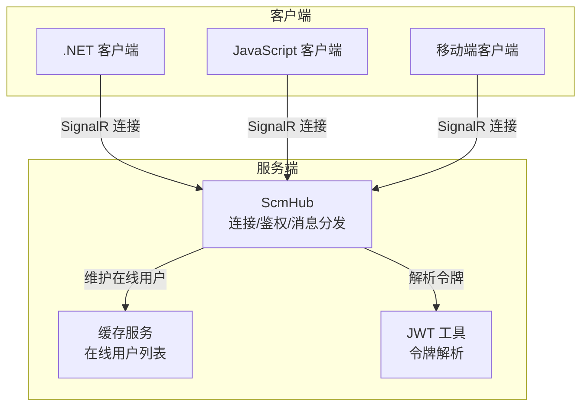
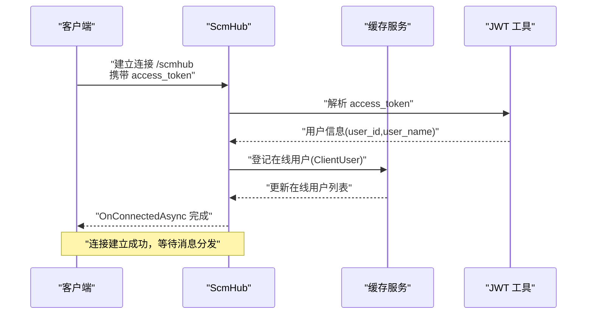
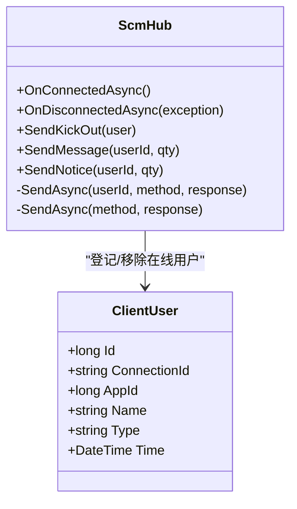
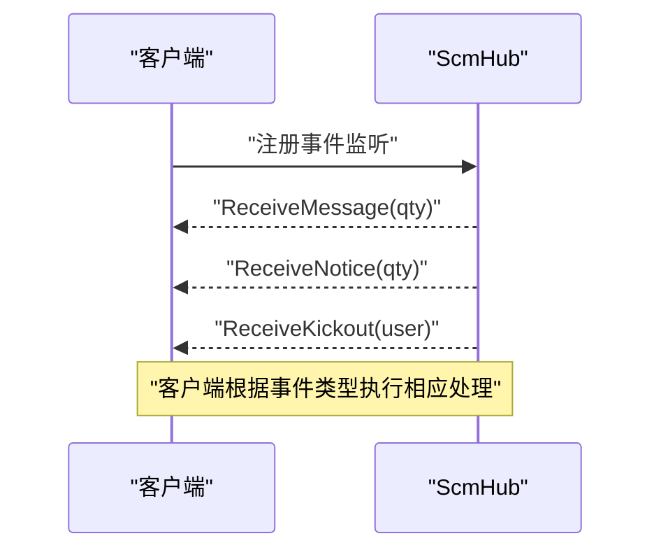
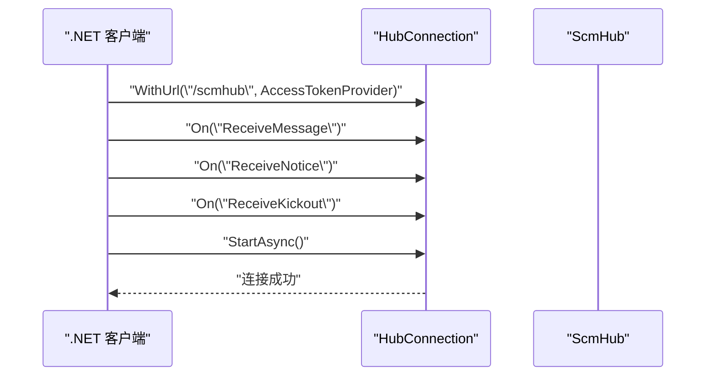
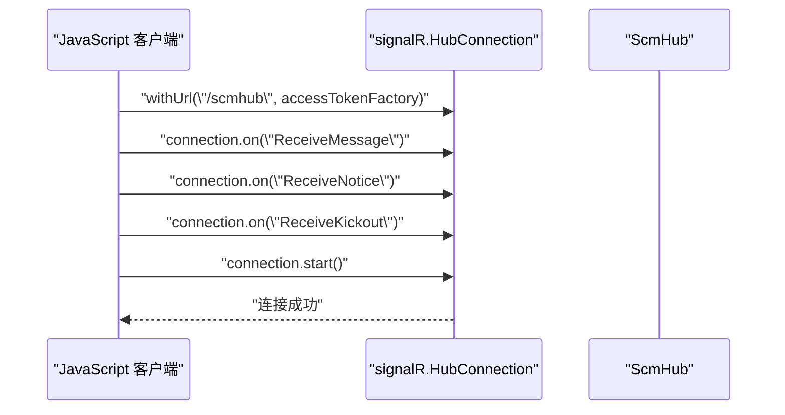
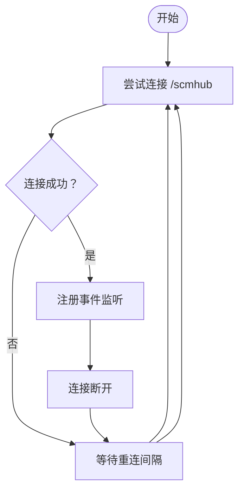
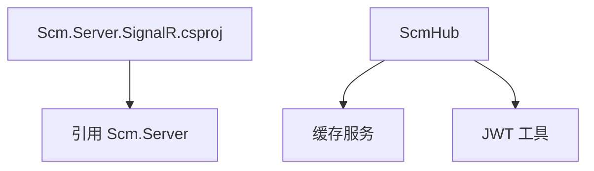

# 客户端集成指南

<cite>
**本文引用的文件**
- [ScmHub.cs](file://Scm.Server.SignalR/Hubs/ScmHub.cs)
- [ClientUser.cs](file://Scm.Server.SignalR/Hubs/ClientUser.cs)
- [SignalRUtil.cs](file://Scm.Core/Msg/SignalRUtil.cs)
- [ClientExample.md](file://Nas.Server/Msg/ClientExample.md)
- [Scm.Server.SignalR.csproj](file://Scm.Server.SignalR/Scm.Server.SignalR.csproj)
- [ScmClientTypeEnum.cs](file://Scm.Common/Enums/ScmClientTypeEnum.cs)
- [HbController.cs](file://Scm.Net/Controllers/HbController.cs)
- [MqttClientService.cs](file://Scm.Server.MQTT/MQTT/Impl/MqttClientService.cs)
</cite>

## 目录
1. [简介](#简介)
2. [项目结构](#项目结构)
3. [核心组件](#核心组件)
4. [架构总览](#架构总览)
5. [详细组件分析](#详细组件分析)
6. [依赖关系分析](#依赖关系分析)
7. [性能考量](#性能考量)
8. [故障排查指南](#故障排查指南)
9. [结论](#结论)
10. [附录](#附录)

## 简介
本指南面向需要在 .NET、JavaScript 与移动端环境中集成实时消息推送的开发者，基于项目中的 SignalR 服务端实现，提供从连接建立、URL 配置、参数传递、认证令牌设置，到事件监听与消息处理（ReceiveMessage、ReceiveNotice、ReceiveKickout）的完整集成步骤，并给出连接状态管理、重连机制与错误处理的最佳实践、配置项与性能优化建议及调试技巧。

## 项目结构
围绕客户端集成的关键模块与文件如下：
- 服务端 SignalR Hub：负责连接生命周期、鉴权、在线用户维护与消息分发
- 客户端示例文档：提供 .NET 与 JavaScript 的完整集成示例
- 工具类：提供统一的 JSON 序列化工具
- 枚举：定义客户端类型，便于区分不同终端
- 控制器：提供心跳接口，辅助诊断连接健康度
- MQTT 客户端：作为对比参考，展示重连与错误处理模式

图表来源
- [ScmHub.cs:10-155](file://Scm.Server.SignalR/Hubs/ScmHub.cs#L10-L155)
- [ClientExample.md:1-203](file://Nas.Server/Msg/ClientExample.md#L1-L203)

章节来源
- [ScmHub.cs:10-155](file://Scm.Server.SignalR/Hubs/ScmHub.cs#L10-L155)
- [ClientExample.md:1-203](file://Nas.Server/Msg/ClientExample.md#L1-L203)

## 核心组件
- ScmHub：SignalR Hub，负责连接建立、鉴权、在线用户登记与消息广播
- ClientUser：在线用户模型，记录用户标识、连接标识与时间戳
- SignalRUtil：统一 JSON 序列化工具，用于服务端消息序列化
- 客户端示例：提供 .NET 与 JavaScript 的连接与事件监听示例
- ScmClientTypeEnum：客户端类型枚举，便于区分 Web/桌面/移动端等
- HbController：心跳接口，辅助诊断连接健康度
- MQTT 客户端：展示重连与错误处理模式，可借鉴到 SignalR 场景

章节来源
- [ScmHub.cs:10-155](file://Scm.Server.SignalR/Hubs/ScmHub.cs#L10-L155)
- [ClientUser.cs:1-39](file://Scm.Server.SignalR/Hubs/ClientUser.cs#L1-L39)
- [SignalRUtil.cs:1-36](file://Scm.Core/Msg/SignalRUtil.cs#L1-L36)
- [ClientExample.md:1-203](file://Nas.Server/Msg/ClientExample.md#L1-L203)
- [ScmClientTypeEnum.cs:1-46](file://Scm.Common/Enums/ScmClientTypeEnum.cs#L1-L46)
- [HbController.cs:44-82](file://Scm.Net/Controllers/HbController.cs#L44-L82)
- [MqttClientService.cs:140-157](file://Scm.Server.MQTT/MQTT/Impl/MqttClientService.cs#L140-L157)

## 架构总览
下图展示了客户端通过 SignalR 连接服务端、鉴权、维护在线用户列表以及消息分发的整体流程。

图表来源
- [ScmHub.cs:25-67](file://Scm.Server.SignalR/Hubs/ScmHub.cs#L25-L67)

章节来源
- [ScmHub.cs:25-67](file://Scm.Server.SignalR/Hubs/ScmHub.cs#L25-L67)

## 详细组件分析

### SignalR Hub 组件分析
- 连接建立与鉴权
  - 在连接建立时，从请求查询字符串中读取 access_token，并解析出用户标识与名称
  - 将当前连接登记为在线用户，若同一用户已有连接则替换旧连接
- 断开处理
  - 连接断开时，从在线用户列表中移除对应连接
- 消息分发
  - SendMessage：向指定用户发送 ReceiveMessage 事件
  - SendNotice：向指定用户发送 ReceiveNotice 事件
  - SendKickOut：向所有客户端广播 ReceiveKickout 事件，并清理该用户的在线状态

图表来源
- [ScmHub.cs:10-155](file://Scm.Server.SignalR/Hubs/ScmHub.cs#L10-L155)
- [ClientUser.cs:1-39](file://Scm.Server.SignalR/Hubs/ClientUser.cs#L1-L39)

章节来源
- [ScmHub.cs:25-155](file://Scm.Server.SignalR/Hubs/ScmHub.cs#L25-L155)
- [ClientUser.cs:1-39](file://Scm.Server.SignalR/Hubs/ClientUser.cs#L1-L39)

### 事件监听与消息处理
- ReceiveMessage：用于接收消息数量变更提醒
- ReceiveNotice：用于接收通知数量变更提醒
- ReceiveKickout：用于接收被踢下线通知

客户端应在连接成功后注册上述事件监听，并在回调中处理业务逻辑（如刷新界面、提示用户等）。

图表来源
- [ScmHub.cs:118-134](file://Scm.Server.SignalR/Hubs/ScmHub.cs#L118-L134)
- [ScmHub.cs:95-110](file://Scm.Server.SignalR/Hubs/ScmHub.cs#L95-L110)

章节来源
- [ScmHub.cs:95-134](file://Scm.Server.SignalR/Hubs/ScmHub.cs#L95-L134)

### 客户端集成示例

#### .NET 客户端
- 依赖安装：Microsoft.AspNetCore.SignalR.Client
- 连接 URL：以 /scmhub 结尾
- 认证令牌：通过 AccessTokenProvider 设置 access_token
- 事件监听：注册 ReceiveMessage、ReceiveNotice、ReceiveKickout 事件
- 断开与释放：停止连接并释放资源

图表来源
- [ClientExample.md:21-79](file://Nas.Server/Msg/ClientExample.md#L21-L79)

章节来源
- [ClientExample.md:11-79](file://Nas.Server/Msg/ClientExample.md#L11-L79)

#### JavaScript 客户端
- 依赖安装：@microsoft/signalr
- 连接 URL：以 /scmhub 结尾
- 认证令牌：通过 accessTokenFactory 设置 access_token
- 事件监听：注册 ReceiveMessage、ReceiveNotice、ReceiveKickout 事件
- 断开与释放：停止连接

图表来源
- [ClientExample.md:81-130](file://Nas.Server/Msg/ClientExample.md#L81-L130)

章节来源
- [ClientExample.md:81-130](file://Nas.Server/Msg/ClientExample.md#L81-L130)

#### 移动端集成方法
- 使用各平台 SignalR 客户端库（iOS/Android）
- 连接 URL 与认证方式同上
- 事件监听同 ReceiveMessage、ReceiveNotice、ReceiveKickout
- 注意处理后台/前台切换、网络变化与系统省电策略对长连接的影响

章节来源
- [ClientExample.md:1-203](file://Nas.Server/Msg/ClientExample.md#L1-L203)

### 连接状态管理与重连机制
- 自动重连：当连接断开时，客户端应实现指数退避或固定间隔重连
- 心跳检测：结合心跳接口（如 HbController）监控连接健康度
- 状态恢复：重连后可请求增量数据或状态同步，保证一致性

图表来源
- [HbController.cs:44-82](file://Scm.Net/Controllers/HbController.cs#L44-L82)
- [MqttClientService.cs:140-157](file://Scm.Server.MQTT/MQTT/Impl/MqttClientService.cs#L140-L157)

章节来源
- [HbController.cs:44-82](file://Scm.Net/Controllers/HbController.cs#L44-L82)
- [MqttClientService.cs:140-157](file://Scm.Server.MQTT/MQTT/Impl/MqttClientService.cs#L140-L157)

### 错误处理最佳实践
- 连接失败：捕获异常，记录日志，触发重连
- 鉴权失败：检查 access_token 是否过期或无效，引导重新登录
- 服务端踢人：收到 ReceiveKickout 后立即断开连接并提示用户重新登录
- 网络抖动：采用指数退避重连，避免频繁重试造成风暴

章节来源
- [ScmHub.cs:74-89](file://Scm.Server.SignalR/Hubs/ScmHub.cs#L74-L89)
- [ScmHub.cs:95-110](file://Scm.Server.SignalR/Hubs/ScmHub.cs#L95-L110)

## 依赖关系分析
- Scm.Server.SignalR 项目引用 Scm.Server，提供 SignalR Hub 与相关扩展
- 客户端通过标准 SignalR 客户端库与服务端交互
- 服务端依赖缓存服务维护在线用户列表，依赖 JWT 工具解析令牌

图表来源
- [Scm.Server.SignalR.csproj:10-12](file://Scm.Server.SignalR/Scm.Server.SignalR.csproj#L10-L12)
- [ScmHub.cs:12-19](file://Scm.Server.SignalR/Hubs/ScmHub.cs#L12-L19)

章节来源
- [Scm.Server.SignalR.csproj:10-12](file://Scm.Server.SignalR/Scm.Server.SignalR.csproj#L10-L12)
- [ScmHub.cs:12-19](file://Scm.Server.SignalR/Hubs/ScmHub.cs#L12-L19)

## 性能考量
- 消息批处理：合并小消息，降低网络与 CPU 开销
- 消息过滤：按需订阅事件，减少无关消息处理
- 连接复用：同一用户多端登录时，服务端仅保留最新连接，避免重复推送
- 序列化优化：使用统一的 JSON 序列化工具，减少序列化成本

章节来源
- [SignalRUtil.cs:19-33](file://Scm.Core/Msg/SignalRUtil.cs#L19-L33)

## 故障排查指南
- 无法连接
  - 检查 URL 是否正确（/scmhub），是否携带 access_token
  - 确认服务端 CORS 配置允许客户端域名
- 鉴权失败
  - 检查 access_token 是否过期或格式错误
  - 确认服务端 JWT 解析逻辑正常
- 推送不到
  - 检查在线用户列表是否包含当前用户
  - 确认目标用户连接标识是否匹配
- 被踢下线
  - 收到 ReceiveKickout 后立即断开连接并提示用户重新登录
- 心跳与健康
  - 使用心跳接口（如 HbController）确认服务端可用性

章节来源
- [ScmHub.cs:25-67](file://Scm.Server.SignalR/Hubs/ScmHub.cs#L25-L67)
- [ScmHub.cs:74-89](file://Scm.Server.SignalR/Hubs/ScmHub.cs#L74-L89)
- [HbController.cs:44-82](file://Scm.Net/Controllers/HbController.cs#L44-L82)

## 结论
通过本指南，您可以在 .NET、JavaScript 与移动端环境中快速集成 SignalR 实时消息推送。遵循连接建立、鉴权、事件监听与消息处理的步骤，并结合重连机制与错误处理最佳实践，可有效提升用户体验与系统稳定性。同时，借助心跳接口与统一 JSON 序列化工具，可进一步增强系统的可观测性与性能表现。

## 附录
- 客户端类型枚举：用于区分 Web/桌面/移动端等终端类型
- 客户端集成示例：提供 .NET 与 JavaScript 的完整实现思路与步骤

章节来源
- [ScmClientTypeEnum.cs:1-46](file://Scm.Common/Enums/ScmClientTypeEnum.cs#L1-L46)
- [ClientExample.md:1-203](file://Nas.Server/Msg/ClientExample.md#L1-L203)