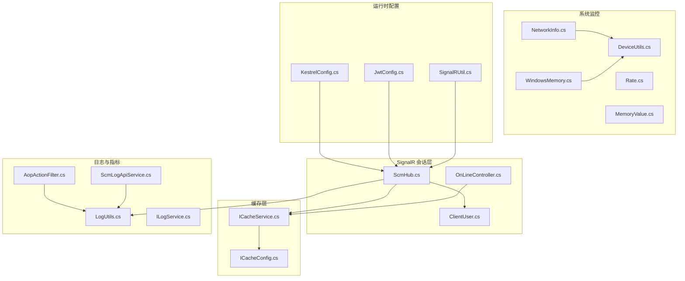
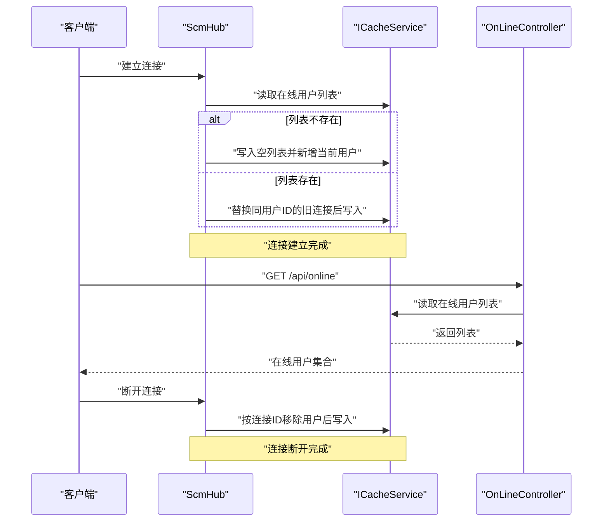
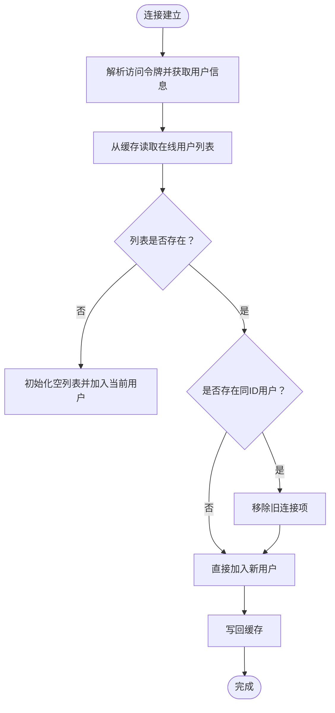
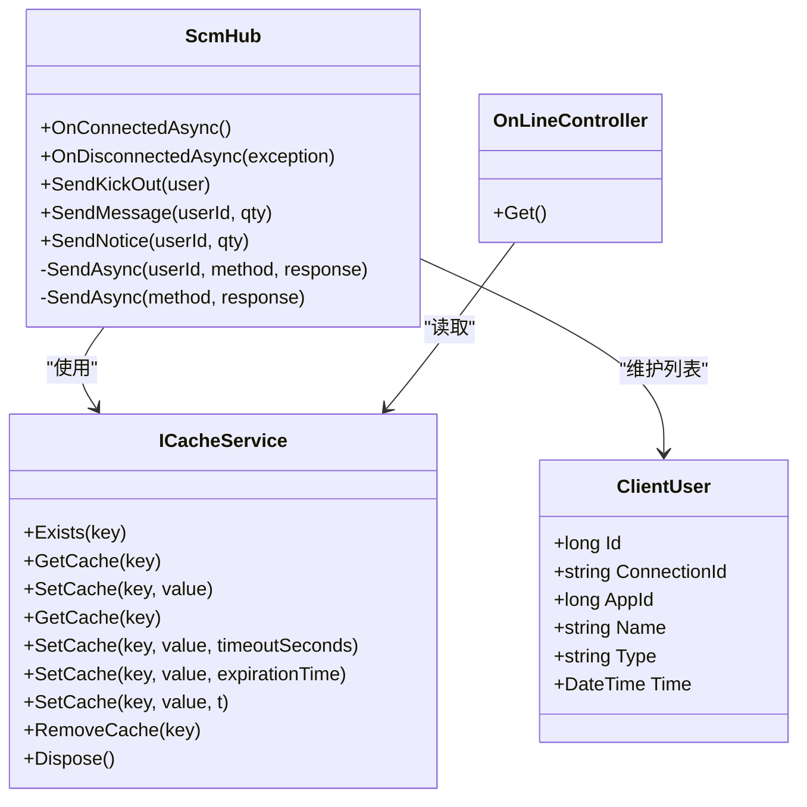
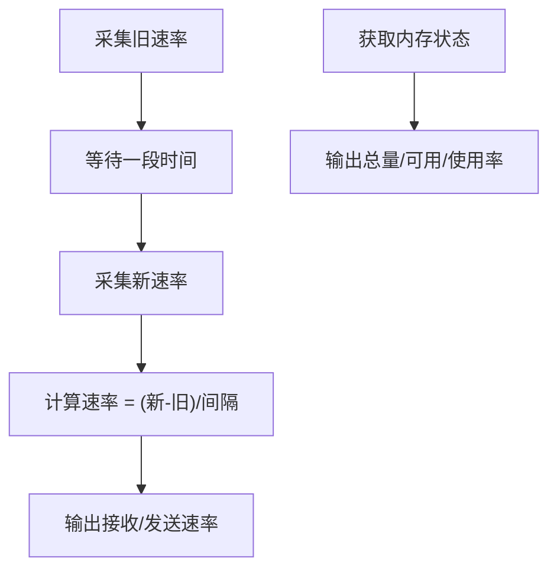
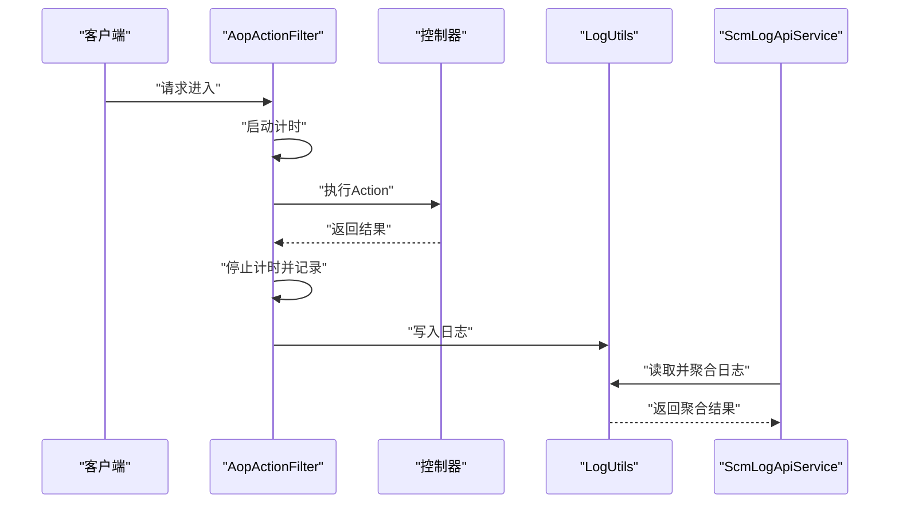
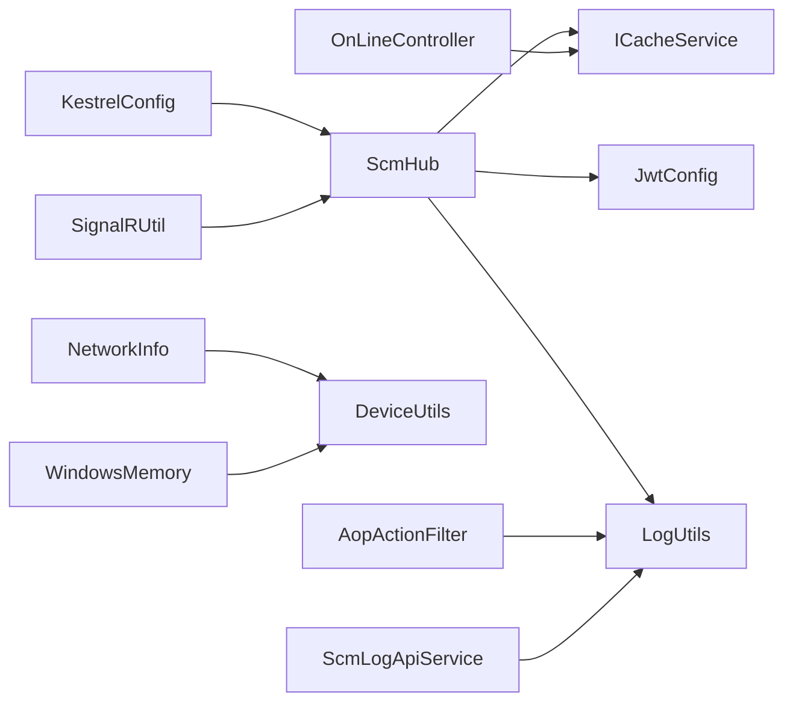

# 性能监控与优化

<cite>
**本文引用的文件**
- [ScmHub.cs](file://Scm.Server.SignalR/Hubs/ScmHub.cs)
- [ClientUser.cs](file://Scm.Server.SignalR/Hubs/ClientUser.cs)
- [OnLineController.cs](file://Scm.Net/Controllers/OnLineController.cs)
- [ICacheService.cs](file://Scm.Cache/Cache/ICacheService.cs)
- [ICacheConfig.cs](file://Scm.Cache/Cache/ICacheConfig.cs)
- [KestrelConfig.cs](file://Scm.Server/Config/KestrelConfig.cs)
- [JwtConfig.cs](file://Scm.Server/Config/JwtConfig.cs)
- [NetworkInfo.cs](file://Scm.Common.Os/OS/Windows/Network/NetworkInfo.cs)
- [Rate.cs](file://Scm.Common.Os/OS/Windows/Network/Rate.cs)
- [WindowsMemory.cs](file://Scm.Common.Os/OS/Windows/Memory/WindowsMemory.cs)
- [MemoryValue.cs](file://Scm.Common.Os/OS/Windows/Memory/MemoryValue.cs)
- [LogUtils.cs](file://Scm.Common.Log/Utils/LogUtils.cs)
- [AopActionFilter.cs](file://Scm.Core/Configure/Filters/AopActionFilter.cs)
- [ScmLogApiService.cs](file://Scm.Core/Log/Api/ScmLogApiService.cs)
- [ILogService.cs](file://Scm.Server/ILogService.cs)
- [DeviceUtils.cs](file://Scm.Common.Os/DeviceUtils.cs)
- [SignalRUtil.cs](file://Scm.Core/Msg/SignalRUtil.cs)
</cite>

## 目录
1. [简介](#简介)
2. [项目结构](#项目结构)
3. [核心组件](#核心组件)
4. [架构总览](#架构总览)
5. [详细组件分析](#详细组件分析)
6. [依赖关系分析](#依赖关系分析)
7. [性能考量](#性能考量)
8. [故障排查指南](#故障排查指南)
9. [结论](#结论)
10. [附录](#附录)

## 简介
本文件面向性能监控与优化，聚焦于 SignalR 连接的性能观测与治理，涵盖连接数统计、内存使用与网络延迟测量，以及缓存策略在用户会话管理中的应用（在线用户列表的缓存与过期）。同时提供连接池配置、消息批量处理、资源清理等优化建议，并阐述日志记录在连接事件、错误与性能指标采集中的作用，最后给出负载测试方法、瓶颈识别与监控仪表板、告警配置的实践指南。

## 项目结构
围绕 SignalR 会话与缓存的关键模块如下：
- SignalR Hub：负责连接生命周期管理、在线用户列表维护与定向/广播消息派发
- 缓存服务：提供键值缓存、过期控制与移除能力
- 控制器：对外暴露在线用户查询接口
- 网络与内存监控：提供网络速率与内存使用度量
- 日志体系：统一日志输出与性能指标采集

图表来源
- [ScmHub.cs:1-155](file://Scm.Server.SignalR/Hubs/ScmHub.cs#L1-L155)
- [ClientUser.cs:1-39](file://Scm.Server.SignalR/Hubs/ClientUser.cs#L1-L39)
- [OnLineController.cs:1-34](file://Scm.Net/Controllers/OnLineController.cs#L1-L34)
- [ICacheService.cs:1-82](file://Scm.Cache/Cache/ICacheService.cs#L1-L82)
- [ICacheConfig.cs:1-9](file://Scm.Cache/Cache/ICacheConfig.cs#L1-L9)
- [NetworkInfo.cs:1-232](file://Scm.Common.Os/OS/Windows/Network/NetworkInfo.cs#L1-L232)
- [Rate.cs:1-29](file://Scm.Common.Os/OS/Windows/Network/Rate.cs#L1-L29)
- [WindowsMemory.cs:1-85](file://Scm.Common.Os/OS/Windows/Memory/WindowsMemory.cs#L1-L85)
- [MemoryValue.cs:1-65](file://Scm.Common.Os/OS/Windows/Memory/MemoryValue.cs#L1-L65)
- [DeviceUtils.cs:47-116](file://Scm.Common.Os/DeviceUtils.cs#L47-L116)
- [LogUtils.cs:37-59](file://Scm.Common.Log/Utils/LogUtils.cs#L37-L59)
- [AopActionFilter.cs:220-252](file://Scm.Core/Configure/Filters/AopActionFilter.cs#L220-L252)
- [ScmLogApiService.cs:70-92](file://Scm.Core/Log/Api/ScmLogApiService.cs#L70-L92)
- [ILogService.cs:54-111](file://Scm.Server/ILogService.cs#L54-L111)
- [KestrelConfig.cs:1-24](file://Scm.Server/Config/KestrelConfig.cs#L1-L24)
- [JwtConfig.cs:1-48](file://Scm.Server/Config/JwtConfig.cs#L1-L48)
- [SignalRUtil.cs:1-35](file://Scm.Core/Msg/SignalRUtil.cs#L1-L35)

章节来源
- [ScmHub.cs:1-155](file://Scm.Server.SignalR/Hubs/ScmHub.cs#L1-L155)
- [OnLineController.cs:1-34](file://Scm.Net/Controllers/OnLineController.cs#L1-L34)
- [ICacheService.cs:1-82](file://Scm.Cache/Cache/ICacheService.cs#L1-L82)
- [NetworkInfo.cs:1-232](file://Scm.Common.Os/OS/Windows/Network/NetworkInfo.cs#L1-L232)
- [WindowsMemory.cs:1-85](file://Scm.Common.Os/OS/Windows/Memory/WindowsMemory.cs#L1-L85)
- [LogUtils.cs:37-59](file://Scm.Common.Log/Utils/LogUtils.cs#L37-L59)
- [AopActionFilter.cs:220-252](file://Scm.Core/Configure/Filters/AopActionFilter.cs#L220-L252)

## 核心组件
- SignalR Hub（会话与消息）
  - 维护在线用户列表，基于缓存进行增删改与持久化
  - 提供定向消息与广播消息派发
- 缓存服务（键值缓存）
  - 支持绝对过期、相对过期与移除
  - 用于在线用户列表的短期缓存与快速查询
- 控制器（对外查询）
  - 提供在线用户列表的只读接口
- 网络与内存监控
  - 网络：基于系统接口统计接收/发送速率
  - 内存：获取物理/虚拟内存总量、可用量与使用率
- 日志与指标
  - 统一日志输出与过滤
  - AOP 过滤器采集接口耗时与返回结果
  - API 日志服务聚合日志趋势

章节来源
- [ScmHub.cs:25-155](file://Scm.Server.SignalR/Hubs/ScmHub.cs#L25-L155)
- [ClientUser.cs:1-39](file://Scm.Server.SignalR/Hubs/ClientUser.cs#L1-L39)
- [ICacheService.cs:1-82](file://Scm.Cache/Cache/ICacheService.cs#L1-L82)
- [OnLineController.cs:1-34](file://Scm.Net/Controllers/OnLineController.cs#L1-L34)
- [NetworkInfo.cs:143-231](file://Scm.Common.Os/OS/Windows/Network/NetworkInfo.cs#L143-L231)
- [WindowsMemory.cs:57-83](file://Scm.Common.Os/OS/Windows/Memory/WindowsMemory.cs#L57-L83)
- [LogUtils.cs:37-59](file://Scm.Common.Log/Utils/LogUtils.cs#L37-L59)
- [AopActionFilter.cs:220-252](file://Scm.Core/Configure/Filters/AopActionFilter.cs#L220-L252)
- [ScmLogApiService.cs:70-92](file://Scm.Core/Log/Api/ScmLogApiService.cs#L70-L92)

## 架构总览
SignalR 连接生命周期与缓存协同工作，形成“连接建立/断开更新在线列表、消息派发基于缓存定位”的闭环；控制器提供只读查询入口；系统监控与日志贯穿运行时观测。

图表来源
- [ScmHub.cs:25-89](file://Scm.Server.SignalR/Hubs/ScmHub.cs#L25-L89)
- [OnLineController.cs:27-33](file://Scm.Net/Controllers/OnLineController.cs#L27-L33)
- [ICacheService.cs:35-51](file://Scm.Cache/Cache/ICacheService.cs#L35-L51)

## 详细组件分析

### SignalR Hub 组件
- 连接建立
  - 从请求参数提取访问令牌，解析用户身份
  - 将用户信息（ID、名称、连接ID、时间）写入在线用户列表缓存
  - 若同一用户已有连接，先移除旧连接再写入新连接
- 连接断开
  - 依据连接ID从在线用户列表中移除对应用户
- 消息派发
  - 定向消息：根据用户ID查找其连接ID后定向发送
  - 广播消息：向所有客户端广播
- 踢人功能
  - 通过 Hub 方法查询并移除指定用户，随后广播踢人事件

图表来源
- [ScmHub.cs:25-66](file://Scm.Server.SignalR/Hubs/ScmHub.cs#L25-L66)

章节来源
- [ScmHub.cs:25-155](file://Scm.Server.SignalR/Hubs/ScmHub.cs#L25-L155)
- [ClientUser.cs:1-39](file://Scm.Server.SignalR/Hubs/ClientUser.cs#L1-L39)

### 在线用户缓存策略
- 数据结构
  - 使用键值缓存存储在线用户列表，元素为用户模型
- 更新策略
  - 连接建立：若无列表则初始化，否则替换同ID旧连接后写入
  - 连接断开：按连接ID移除
- 过期策略
  - 接口支持绝对过期、相对过期与指定到期时间
  - 建议结合业务设置合理过期时间，避免长期占用内存
- 查询策略
  - 控制器提供只读接口，便于前端展示与运维查询

图表来源
- [ClientUser.cs:1-39](file://Scm.Server.SignalR/Hubs/ClientUser.cs#L1-L39)
- [ICacheService.cs:1-82](file://Scm.Cache/Cache/ICacheService.cs#L1-L82)
- [ScmHub.cs:1-155](file://Scm.Server.SignalR/Hubs/ScmHub.cs#L1-L155)
- [OnLineController.cs:1-34](file://Scm.Net/Controllers/OnLineController.cs#L1-L34)

章节来源
- [ICacheService.cs:1-82](file://Scm.Cache/Cache/ICacheService.cs#L1-L82)
- [OnLineController.cs:1-34](file://Scm.Net/Controllers/OnLineController.cs#L1-L34)

### 网络与内存监控
- 网络监控
  - 基于系统接口统计网卡接收/发送字节数，计算时间窗口内的速率
  - 支持 IPv4 与 IPv6 统计
- 内存监控
  - 获取物理内存总量、可用量与使用率，以及虚拟内存相关信息
  - 适用于 Windows 环境下的内存状态查询

图表来源
- [NetworkInfo.cs:143-231](file://Scm.Common.Os/OS/Windows/Network/NetworkInfo.cs#L143-L231)
- [Rate.cs:1-29](file://Scm.Common.Os/OS/Windows/Network/Rate.cs#L1-L29)
- [WindowsMemory.cs:57-83](file://Scm.Common.Os/OS/Windows/Memory/WindowsMemory.cs#L57-L83)
- [MemoryValue.cs:1-65](file://Scm.Common.Os/OS/Windows/Memory/MemoryValue.cs#L1-L65)

章节来源
- [NetworkInfo.cs:1-232](file://Scm.Common.Os/OS/Windows/Network/NetworkInfo.cs#L1-L232)
- [WindowsMemory.cs:1-85](file://Scm.Common.Os/OS/Windows/Memory/WindowsMemory.cs#L1-L85)
- [MemoryValue.cs:1-65](file://Scm.Common.Os/OS/Windows/Memory/MemoryValue.cs#L1-L65)

### 日志与性能指标采集
- 日志输出
  - 统一通过日志工具输出至控制台与按位置分类的文件
- 接口耗时采集
  - AOP 过滤器在 Action 执行前后计时，记录返回结果与参数
- API 日志聚合
  - 按日期聚合不同级别日志数量，支撑趋势分析

图表来源
- [AopActionFilter.cs:220-252](file://Scm.Core/Configure/Filters/AopActionFilter.cs#L220-L252)
- [LogUtils.cs:37-59](file://Scm.Common.Log/Utils/LogUtils.cs#L37-L59)
- [ScmLogApiService.cs:70-92](file://Scm.Core/Log/Api/ScmLogApiService.cs#L70-L92)
- [ILogService.cs:54-111](file://Scm.Server/ILogService.cs#L54-L111)

章节来源
- [LogUtils.cs:37-59](file://Scm.Common.Log/Utils/LogUtils.cs#L37-L59)
- [AopActionFilter.cs:220-252](file://Scm.Core/Configure/Filters/AopActionFilter.cs#L220-L252)
- [ScmLogApiService.cs:70-92](file://Scm.Core/Log/Api/ScmLogApiService.cs#L70-L92)
- [ILogService.cs:54-111](file://Scm.Server/ILogService.cs#L54-L111)

## 依赖关系分析
- 组件耦合
  - Hub 依赖缓存服务与上下文访问器
  - 控制器依赖缓存服务提供只读查询
  - 网络/内存监控与设备信息相互配合
- 外部依赖
  - Kestrel 配置影响监听端点
  - JWT 配置影响令牌签发与校验
  - SignalRUtil 提供序列化工具

图表来源
- [ScmHub.cs:1-155](file://Scm.Server.SignalR/Hubs/ScmHub.cs#L1-L155)
- [OnLineController.cs:1-34](file://Scm.Net/Controllers/OnLineController.cs#L1-L34)
- [ICacheService.cs:1-82](file://Scm.Cache/Cache/ICacheService.cs#L1-L82)
- [JwtConfig.cs:1-48](file://Scm.Server/Config/JwtConfig.cs#L1-L48)
- [KestrelConfig.cs:1-24](file://Scm.Server/Config/KestrelConfig.cs#L1-L24)
- [NetworkInfo.cs:1-232](file://Scm.Common.Os/OS/Windows/Network/NetworkInfo.cs#L1-L232)
- [WindowsMemory.cs:1-85](file://Scm.Common.Os/OS/Windows/Memory/WindowsMemory.cs#L1-L85)
- [DeviceUtils.cs:47-116](file://Scm.Common.Os/DeviceUtils.cs#L47-L116)
- [LogUtils.cs:37-59](file://Scm.Common.Log/Utils/LogUtils.cs#L37-L59)
- [AopActionFilter.cs:220-252](file://Scm.Core/Configure/Filters/AopActionFilter.cs#L220-L252)
- [ScmLogApiService.cs:70-92](file://Scm.Core/Log/Api/ScmLogApiService.cs#L70-L92)
- [SignalRUtil.cs:1-35](file://Scm.Core/Msg/SignalRUtil.cs#L1-L35)

章节来源
- [ScmHub.cs:1-155](file://Scm.Server.SignalR/Hubs/ScmHub.cs#L1-L155)
- [OnLineController.cs:1-34](file://Scm.Net/Controllers/OnLineController.cs#L1-L34)
- [ICacheService.cs:1-82](file://Scm.Cache/Cache/ICacheService.cs#L1-L82)
- [NetworkInfo.cs:1-232](file://Scm.Common.Os/OS/Windows/Network/NetworkInfo.cs#L1-L232)
- [WindowsMemory.cs:1-85](file://Scm.Common.Os/OS/Windows/Memory/WindowsMemory.cs#L1-L85)
- [LogUtils.cs:37-59](file://Scm.Common.Log/Utils/LogUtils.cs#L37-L59)
- [AopActionFilter.cs:220-252](file://Scm.Core/Configure/Filters/AopActionFilter.cs#L220-L252)
- [ScmLogApiService.cs:70-92](file://Scm.Core/Log/Api/ScmLogApiService.cs#L70-L92)
- [KestrelConfig.cs:1-24](file://Scm.Server/Config/KestrelConfig.cs#L1-L24)
- [JwtConfig.cs:1-48](file://Scm.Server/Config/JwtConfig.cs#L1-L48)
- [SignalRUtil.cs:1-35](file://Scm.Core/Msg/SignalRUtil.cs#L1-L35)

## 性能考量
- 连接数统计
  - 通过在线用户列表缓存长度即可近似统计当前活跃连接数
  - 建议在高并发场景下对缓存读写加锁或采用原子更新，避免竞态
- 内存使用
  - 使用内存监控接口获取物理/虚拟内存使用率，结合 GC 与托管堆大小观察整体内存压力
  - 对在线用户列表采用短 TTL，防止长期驻留导致内存膨胀
- 网络延迟与吞吐
  - 基于网络接口统计速率，识别异常高/低速率，辅助判断链路质量
  - 对消息派发路径进行采样，结合日志耗时评估端到端延迟
- 缓存过期策略
  - 建议为在线用户列表设置“最近一次心跳”或“会话超时”过期时间
  - 对频繁变动的列表采用“滑动过期”，减少热点失效
- 连接池与消息处理
  - 合理配置 Kestrel 的连接限制与缓冲区大小
  - 对高频消息采用批量合并策略，降低网络包数量
- 资源清理
  - 在断开连接时及时清理 Context.Items 与缓存中的用户条目
  - 对长时间无活动的连接主动剔除，释放资源

章节来源
- [ScmHub.cs:74-89](file://Scm.Server.SignalR/Hubs/ScmHub.cs#L74-L89)
- [ICacheService.cs:45-70](file://Scm.Cache/Cache/ICacheService.cs#L45-L70)
- [NetworkInfo.cs:143-231](file://Scm.Common.Os/OS/Windows/Network/NetworkInfo.cs#L143-L231)
- [WindowsMemory.cs:57-83](file://Scm.Common.Os/OS/Windows/Memory/WindowsMemory.cs#L57-L83)
- [KestrelConfig.cs:1-24](file://Scm.Server/Config/KestrelConfig.cs#L1-L24)

## 故障排查指南
- 连接事件追踪
  - 在连接/断开钩子中记录连接ID、用户ID与时间戳，便于定位异常断开
- 错误日志
  - 使用日志工具输出错误日志，按位置分类落盘，定期归档
- 性能指标采集
  - 通过 AOP 过滤器记录接口耗时与返回状态，结合 API 日志服务生成趋势图
- 常见问题
  - 在线列表不一致：检查缓存写入顺序与并发更新
  - 内存持续上涨：检查缓存过期策略与对象生命周期
  - 网络异常：对比速率与丢包统计，排查链路与防火墙

章节来源
- [ScmHub.cs:25-89](file://Scm.Server.SignalR/Hubs/ScmHub.cs#L25-L89)
- [LogUtils.cs:37-59](file://Scm.Common.Log/Utils/LogUtils.cs#L37-L59)
- [AopActionFilter.cs:220-252](file://Scm.Core/Configure/Filters/AopActionFilter.cs#L220-L252)
- [ScmLogApiService.cs:70-92](file://Scm.Core/Log/Api/ScmLogApiService.cs#L70-L92)

## 结论
通过将 SignalR 连接生命周期与缓存策略结合，可实现对在线用户列表的高效维护与查询；配合网络与内存监控、统一日志与性能指标采集，可形成完整的性能观测闭环。建议在生产环境落实合理的缓存过期策略、连接池配置与消息批处理，持续优化资源利用率与用户体验。

## 附录

### 监控仪表板与告警配置建议
- 仪表板指标
  - 连接数曲线、在线用户数、平均/峰值内存使用率、网络收发速率
  - 接口耗时分布（P50/P95/P99）、错误率与重试次数
- 告警阈值
  - 连接数异常波动、内存使用率超阈、网络速率骤降、接口耗时突增
- 数据来源
  - 在线用户列表来自缓存读取
  - 内存与网络来自系统接口
  - 接口耗时与错误来自日志聚合

章节来源
- [OnLineController.cs:27-33](file://Scm.Net/Controllers/OnLineController.cs#L27-L33)
- [WindowsMemory.cs:57-83](file://Scm.Common.Os/OS/Windows/Memory/WindowsMemory.cs#L57-L83)
- [NetworkInfo.cs:143-231](file://Scm.Common.Os/OS/Windows/Network/NetworkInfo.cs#L143-L231)
- [AopActionFilter.cs:220-252](file://Scm.Core/Configure/Filters/AopActionFilter.cs#L220-L252)
- [ScmLogApiService.cs:70-92](file://Scm.Core/Log/Api/ScmLogApiService.cs#L70-L92)