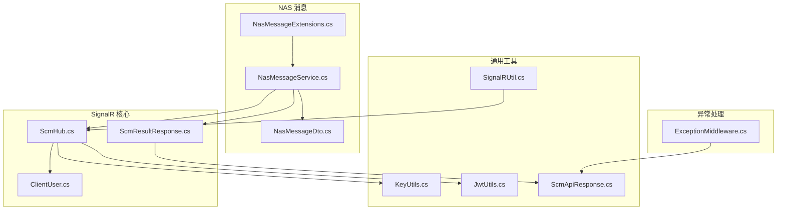
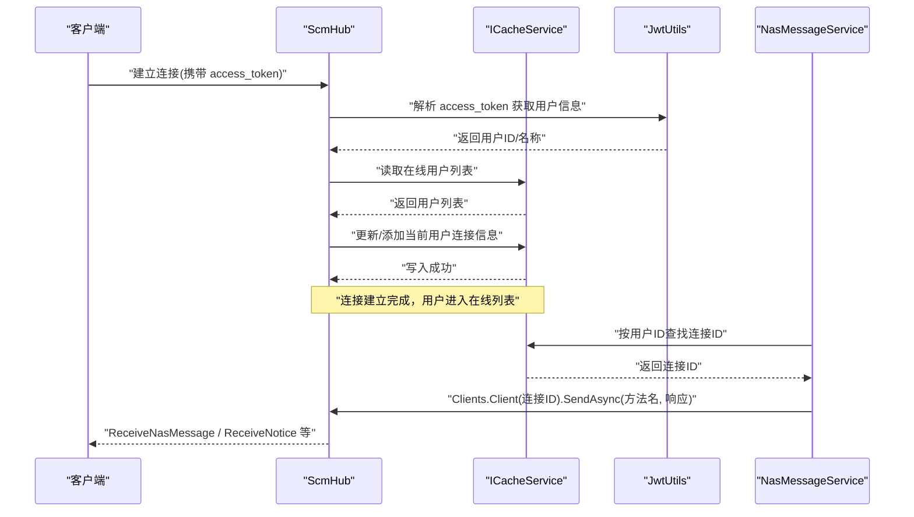
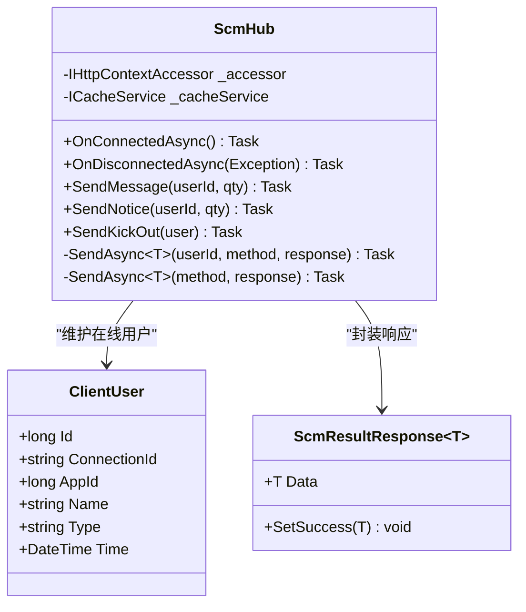
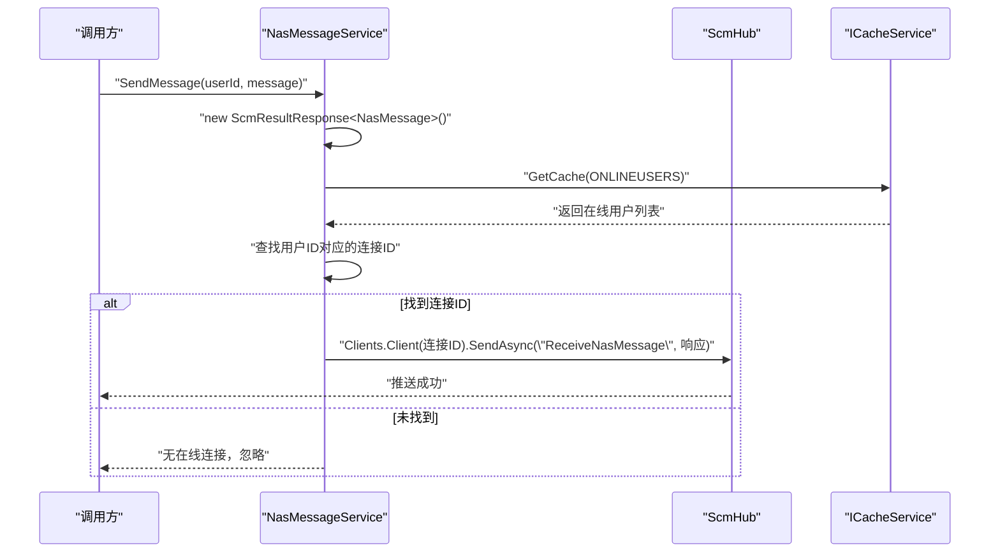
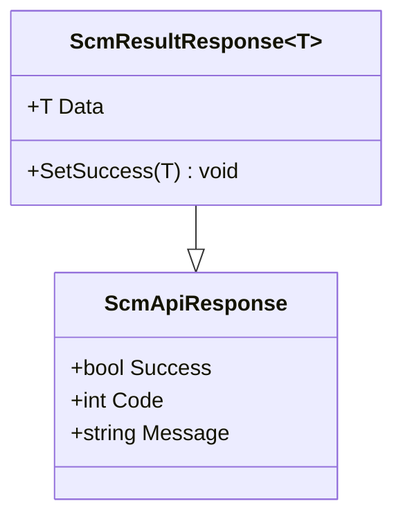
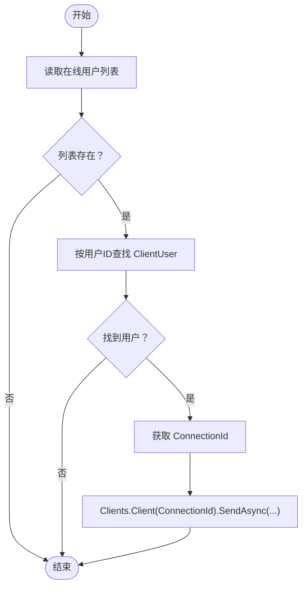
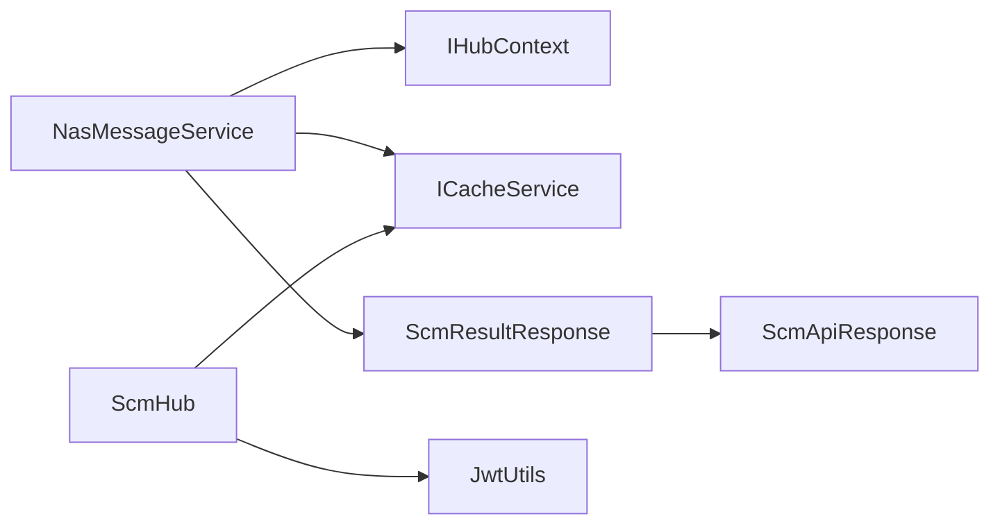

# 消息路由机制

<cite>
**本文引用的文件**
- [ScmHub.cs](file://Scm.Server.SignalR/Hubs/ScmHub.cs)
- [ScmResultResponse.cs](file://Scm.Server.SignalR/Hubs/ScmResultResponse.cs)
- [ClientUser.cs](file://Scm.Server.SignalR/Hubs/ClientUser.cs)
- [KeyUtils.cs](file://Scm.Common/Utils/KeyUtils.cs)
- [JwtUtils.cs](file://Scm.Server/Utils/JwtUtils.cs)
- [ScmApiResponse.cs](file://Scm.Common.Dto/Response/ScmApiResponse.cs)
- [NasMessageService.cs](file://Nas.Server/Msg/NasMessageService.cs)
- [NasMessageDto.cs](file://Nas.Dto/Msg/NasMessageDto.cs)
- [NasMessageExtensions.cs](file://Nas.Server/Msg/NasMessageExtensions.cs)
- [ExceptionMiddleware.cs](file://Scm.Core/Configure/Middleware/ExceptionMiddleware.cs)
- [SignalRUtil.cs](file://Scm.Core/Msg/SignalRUtil.cs)
</cite>

## 目录
1. [简介](#简介)
2. [项目结构](#项目结构)
3. [核心组件](#核心组件)
4. [架构总览](#架构总览)
5. [详细组件分析](#详细组件分析)
6. [依赖关系分析](#依赖关系分析)
7. [性能考量](#性能考量)
8. [故障排查指南](#故障排查指南)
9. [结论](#结论)
10. [附录](#附录)

## 简介
本文件系统性阐述 ScmHub 的消息路由机制与推送实现，重点覆盖以下主题：
- SendMessage 与 SendNotice 的工作原理与差异
- 消息路由算法：用户ID查找、连接ID映射、目标客户端定位
- SendAsync 的重载实现：单用户推送与广播推送的区别
- ScmResultResponse 泛型响应类的设计与使用方法
- 消息类型定义、事件命名约定与参数传递规范
- 错误处理机制与异常情况的处理策略

## 项目结构
围绕消息路由与推送的关键文件分布如下：
- SignalR 核心：ScmHub、ScmResultResponse、ClientUser
- 缓存与键值：KeyUtils
- 认证与上下文：JwtUtils
- 响应基类：ScmApiResponse
- NAS 消息服务：NasMessageService、NasMessageDto、NasMessageExtensions
- 异常中间件：ExceptionMiddleware
- JSON 工具：SignalRUtil

图表来源
- [ScmHub.cs:1-155](file://Scm.Server.SignalR/Hubs/ScmHub.cs#L1-L155)
- [ScmResultResponse.cs:1-16](file://Scm.Server.SignalR/Hubs/ScmResultResponse.cs#L1-L16)
- [ClientUser.cs:1-39](file://Scm.Server.SignalR/Hubs/ClientUser.cs#L1-L39)
- [KeyUtils.cs:1-73](file://Scm.Common/Utils/KeyUtils.cs#L1-L73)
- [JwtUtils.cs:1-88](file://Scm.Server/Utils/JwtUtils.cs#L1-L88)
- [ScmApiResponse.cs:1-21](file://Scm.Common.Dto/Response/ScmApiResponse.cs#L1-L21)
- [NasMessageService.cs:1-100](file://Nas.Server/Msg/NasMessageService.cs#L1-L100)
- [NasMessageDto.cs:1-170](file://Nas.Dto/Msg/NasMessageDto.cs#L1-L170)
- [NasMessageExtensions.cs:1-18](file://Nas.Server/Msg/NasMessageExtensions.cs#L1-L18)
- [ExceptionMiddleware.cs:1-41](file://Scm.Core/Configure/Middleware/ExceptionMiddleware.cs#L1-L41)
- [SignalRUtil.cs:1-35](file://Scm.Core/Msg/SignalRUtil.cs#L1-L35)

章节来源
- [ScmHub.cs:1-155](file://Scm.Server.SignalR/Hubs/ScmHub.cs#L1-L155)
- [NasMessageService.cs:1-100](file://Nas.Server/Msg/NasMessageService.cs#L1-L100)

## 核心组件
- ScmHub：SignalR Hub，负责连接生命周期管理、在线用户登记、消息分发与广播
- ScmResultResponse<T>：泛型响应包装器，承载业务数据与统一响应字段
- ClientUser：在线用户模型，包含用户ID、连接ID、时间戳等
- KeyUtils：集中式缓存键值定义，如在线用户列表键
- JwtUtils：JWT 解析，从请求查询字符串提取用户信息
- ScmApiResponse：响应基类，提供 Success、Code、Message 字段
- NasMessageService：NAS 消息服务，封装单用户与广播推送
- NasMessageDto：NAS 消息类型与数据模型定义
- NasMessageExtensions：服务注册扩展
- ExceptionMiddleware：全局异常捕获并返回标准化响应
- SignalRUtil：JSON 序列化选项配置（用于 SignalR 场景）

章节来源
- [ScmHub.cs:1-155](file://Scm.Server.SignalR/Hubs/ScmHub.cs#L1-L155)
- [ScmResultResponse.cs:1-16](file://Scm.Server.SignalR/Hubs/ScmResultResponse.cs#L1-L16)
- [ClientUser.cs:1-39](file://Scm.Server.SignalR/Hubs/ClientUser.cs#L1-L39)
- [KeyUtils.cs:1-73](file://Scm.Common/Utils/KeyUtils.cs#L1-L73)
- [JwtUtils.cs:1-88](file://Scm.Server/Utils/JwtUtils.cs#L1-L88)
- [ScmApiResponse.cs:1-21](file://Scm.Common.Dto/Response/ScmApiResponse.cs#L1-L21)
- [NasMessageService.cs:1-100](file://Nas.Server/Msg/NasMessageService.cs#L1-L100)
- [NasMessageDto.cs:1-170](file://Nas.Dto/Msg/NasMessageDto.cs#L1-L170)
- [NasMessageExtensions.cs:1-18](file://Nas.Server/Msg/NasMessageExtensions.cs#L1-L18)
- [ExceptionMiddleware.cs:1-41](file://Scm.Core/Configure/Middleware/ExceptionMiddleware.cs#L1-L41)
- [SignalRUtil.cs:1-35](file://Scm.Core/Msg/SignalRUtil.cs#L1-L35)

## 架构总览
ScmHub 的消息路由采用“连接ID映射用户ID”的方式，通过缓存维护在线用户列表，实现精准路由与广播。

图表来源
- [ScmHub.cs:25-89](file://Scm.Server.SignalR/Hubs/ScmHub.cs#L25-L89)
- [JwtUtils.cs:46-87](file://Scm.Server/Utils/JwtUtils.cs#L46-L87)
- [NasMessageService.cs:85-97](file://Nas.Server/Msg/NasMessageService.cs#L85-L97)
- [KeyUtils.cs:59-61](file://Scm.Common/Utils/KeyUtils.cs#L59-L61)

## 详细组件分析

### ScmHub：连接与消息分发
- 连接建立：解析 access_token，构造 ClientUser，写入缓存在线用户列表
- 断开清理：移除对应连接ID的用户记录
- 单用户推送：通过用户ID在在线列表中定位连接ID，向该连接发送消息
- 广播推送：直接向所有客户端广播

图表来源
- [ScmHub.cs:10-155](file://Scm.Server.SignalR/Hubs/ScmHub.cs#L10-L155)
- [ClientUser.cs:6-37](file://Scm.Server.SignalR/Hubs/ClientUser.cs#L6-L37)
- [ScmResultResponse.cs:5-14](file://Scm.Server.SignalR/Hubs/ScmResultResponse.cs#L5-L14)

章节来源
- [ScmHub.cs:25-153](file://Scm.Server.SignalR/Hubs/ScmHub.cs#L25-L153)

### NasMessageService：消息推送入口
- SendMessage：单用户推送，构造 ScmResultResponse<NasMessage>，调用内部 SendAsync
- SendMessageToAll：广播推送，直接向所有客户端发送
- SendSyncStatus / SendFolderChange：针对 NAS 同步与文件夹变更的专用推送

图表来源
- [NasMessageService.cs:26-97](file://Nas.Server/Msg/NasMessageService.cs#L26-L97)
- [ScmHub.cs:136-148](file://Scm.Server.SignalR/Hubs/ScmHub.cs#L136-L148)
- [KeyUtils.cs](file://Scm.Common/Utils/KeyUtils.cs#L61)

章节来源
- [NasMessageService.cs:26-97](file://Nas.Server/Msg/NasMessageService.cs#L26-L97)

### ScmResultResponse 泛型响应类
- 设计目的：统一响应结构，承载业务数据与状态码
- 关键字段：Data（泛型）、Code（继承自 ScmApiResponse）
- 使用方式：构造响应对象，填充 Data，调用 SendAsync 或直接广播

图表来源
- [ScmApiResponse.cs:3-19](file://Scm.Common.Dto/Response/ScmApiResponse.cs#L3-L19)
- [ScmResultResponse.cs:5-14](file://Scm.Server.SignalR/Hubs/ScmResultResponse.cs#L5-L14)

章节来源
- [ScmResultResponse.cs:1-16](file://Scm.Server.SignalR/Hubs/ScmResultResponse.cs#L1-L16)
- [ScmApiResponse.cs:1-21](file://Scm.Common.Dto/Response/ScmApiResponse.cs#L1-L21)

### 消息路由算法与数据流
- 用户ID查找：从缓存 KeyUtils.ONLINEUSERS 中读取在线用户列表，按 Id 匹配
- 连接ID映射：获取 ClientUser.ConnectionId
- 目标客户端定位：Clients.Client(连接ID) 或 Clients.All
- 广播推送：Clients.All.SendAsync(方法名, 响应)

图表来源
- [ScmHub.cs:136-148](file://Scm.Server.SignalR/Hubs/ScmHub.cs#L136-L148)
- [KeyUtils.cs](file://Scm.Common/Utils/KeyUtils.cs#L61)

章节来源
- [ScmHub.cs:136-148](file://Scm.Server.SignalR/Hubs/ScmHub.cs#L136-L148)

### 事件命名约定与参数传递规范
- 事件命名：以 Receive 前缀开头，区分不同业务场景（如 ReceiveNasMessage、ReceiveNotice、ReceiveMessage）
- 参数传递：统一使用 ScmResultResponse<T> 封装，包含 Data 字段与标准响应头（Success/Code/Message）
- 方法签名：单用户推送使用 SendAsync(userId, method, response)，广播使用 SendAsync(method, response)

章节来源
- [ScmHub.cs:118-153](file://Scm.Server.SignalR/Hubs/ScmHub.cs#L118-L153)
- [NasMessageService.cs:26-41](file://Nas.Server/Msg/NasMessageService.cs#L26-L41)
- [ScmResultResponse.cs:5-14](file://Scm.Server.SignalR/Hubs/ScmResultResponse.cs#L5-L14)

### 消息类型定义
- NasMessageType：系统通知、文件操作、同步状态、错误提示、警告
- NasSyncStatus：同步中、同步完成、同步失败、暂停
- NasFolderChangeType：创建、修改、删除、重命名
- NasMessage：包含 Id、Type、Title、Content、Path、Timestamp、RequireConfirmation 等字段

章节来源
- [NasMessageDto.cs:6-28](file://Nas.Dto/Msg/NasMessageDto.cs#L6-L28)
- [NasMessageDto.cs:80-98](file://Nas.Dto/Msg/NasMessageDto.cs#L80-L98)
- [NasMessageDto.cs:129-147](file://Nas.Dto/Msg/NasMessageDto.cs#L129-L147)
- [NasMessageDto.cs:33-75](file://Nas.Dto/Msg/NasMessageDto.cs#L33-L75)

### SendAsync 重载实现对比
- 单用户推送（私有）：SendAsync(userId, method, response)
  - 作用：根据用户ID定位连接ID，向指定客户端发送消息
  - 适用：SendMessage、SendNotice、SendSyncStatus、SendFolderChange 等
- 广播推送（私有）：SendAsync(method, response)
  - 作用：向所有在线客户端广播消息
  - 适用：SendMessageToAll 等

章节来源
- [ScmHub.cs:136-153](file://Scm.Server.SignalR/Hubs/ScmHub.cs#L136-L153)
- [NasMessageService.cs:37-41](file://Nas.Server/Msg/NasMessageService.cs#L37-L41)

### SendMessage 与 SendNotice 的工作原理
- SendMessage：构造 ScmResultResponse<int>，方法名为 ReceiveMessage，按用户ID推送
- SendNotice：构造 ScmResultResponse<int>，方法名为 ReceiveNotice，按用户ID推送
- 两者均通过内部 SendAsync 完成路由与发送

章节来源
- [ScmHub.cs:118-134](file://Scm.Server.SignalR/Hubs/ScmHub.cs#L118-L134)

## 依赖关系分析
- ScmHub 依赖：
  - ICacheService：维护在线用户列表
  - JwtUtils：解析 access_token 获取用户信息
  - SignalR Clients：进行单用户或广播推送
- NasMessageService 依赖：
  - IHubContext<ScmHub>：访问 Hub 上下文
  - ICacheService：路由用户ID到连接ID
  - ScmResultResponse<T>：封装响应数据
- 响应体系：
  - ScmResultResponse<T> 继承 ScmApiResponse，统一 Success/Code/Message

图表来源
- [NasMessageService.cs:11-18](file://Nas.Server/Msg/NasMessageService.cs#L11-L18)
- [ScmHub.cs:12-19](file://Scm.Server.SignalR/Hubs/ScmHub.cs#L12-L19)
- [ScmResultResponse.cs:5-14](file://Scm.Server.SignalR/Hubs/ScmResultResponse.cs#L5-L14)
- [ScmApiResponse.cs:3-19](file://Scm.Common.Dto/Response/ScmApiResponse.cs#L3-L19)

章节来源
- [NasMessageService.cs:1-100](file://Nas.Server/Msg/NasMessageService.cs#L1-L100)
- [ScmHub.cs:1-155](file://Scm.Server.SignalR/Hubs/ScmHub.cs#L1-L155)

## 性能考量
- 在线用户列表缓存：使用 KeyUtils.ONLINEUSERS 作为键，减少数据库/存储压力
- 连接生命周期：连接建立时去重旧连接，断开时清理，避免重复连接占用
- 广播与单播：优先使用单播，仅在必要时广播，降低带宽与客户端处理压力
- JSON 序列化：SignalRUtil 提供统一序列化选项，避免循环引用与多余字段

## 故障排查指南
- 连接无法建立
  - 检查 access_token 是否有效，JwtUtils 是否能正确解析
  - 查看 ScmHub.OnConnectedAsync 是否成功写入在线用户列表
- 消息未送达
  - 确认用户是否在线：检查 KeyUtils.ONLINEUSERS 中是否存在该用户
  - 确认连接ID是否正确：核对 ClientUser.ConnectionId
- 广播无效
  - 检查 SendAsync(method, response) 是否被调用
  - 确认客户端是否订阅了对应 Receive* 事件
- 异常处理
  - 全局异常由 ExceptionMiddleware 捕获并返回标准化响应
  - 服务端日志记录有助于定位问题

章节来源
- [JwtUtils.cs:46-87](file://Scm.Server/Utils/JwtUtils.cs#L46-L87)
- [ScmHub.cs:25-89](file://Scm.Server.SignalR/Hubs/ScmHub.cs#L25-L89)
- [ExceptionMiddleware.cs:17-39](file://Scm.Core/Configure/Middleware/ExceptionMiddleware.cs#L17-L39)

## 结论
ScmHub 的消息路由机制通过“用户ID → 连接ID”的映射，结合缓存与 SignalR 的 Clients API，实现了高效、可靠的单用户与广播推送。ScmResultResponse<T> 提供统一响应封装，配合明确的事件命名约定，使前后端协作清晰稳定。异常中间件与日志记录进一步增强了系统的可观测性与可维护性。

## 附录
- 服务注册：通过 NasMessageExtensions.AddNasMessageService 将服务注册到 DI 容器
- JSON 序列化：SignalRUtil 提供统一的序列化选项，适用于 SignalR 场景

章节来源
- [NasMessageExtensions.cs:12-16](file://Nas.Server/Msg/NasMessageExtensions.cs#L12-L16)
- [SignalRUtil.cs:19-33](file://Scm.Core/Msg/SignalRUtil.cs#L19-L33)