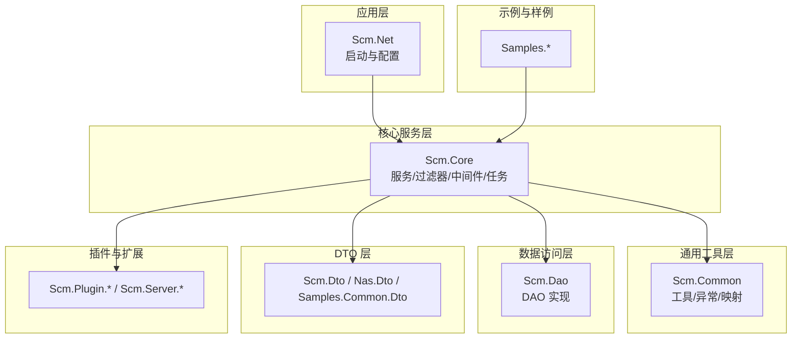
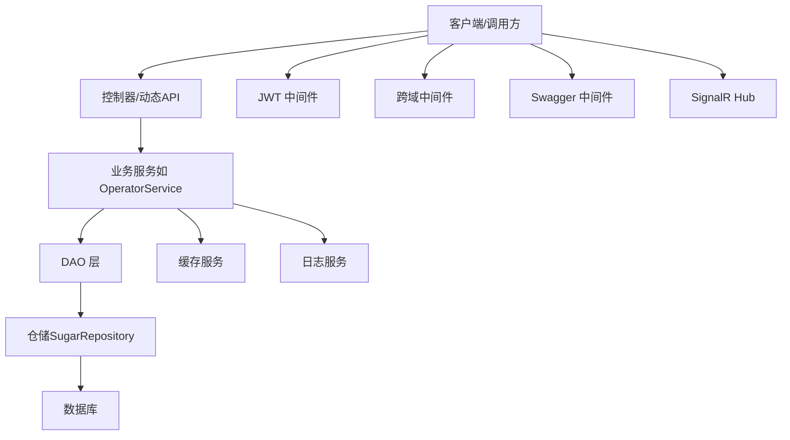
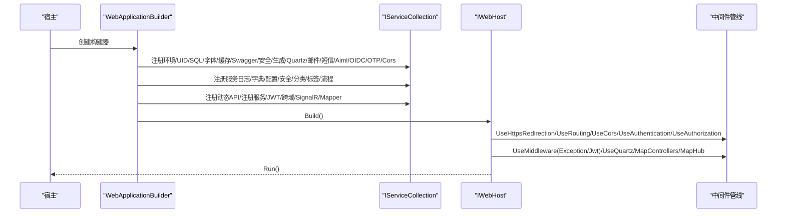
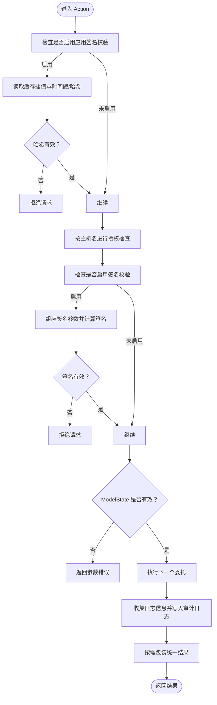
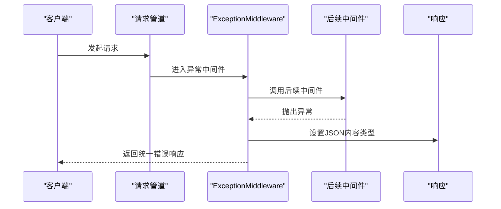
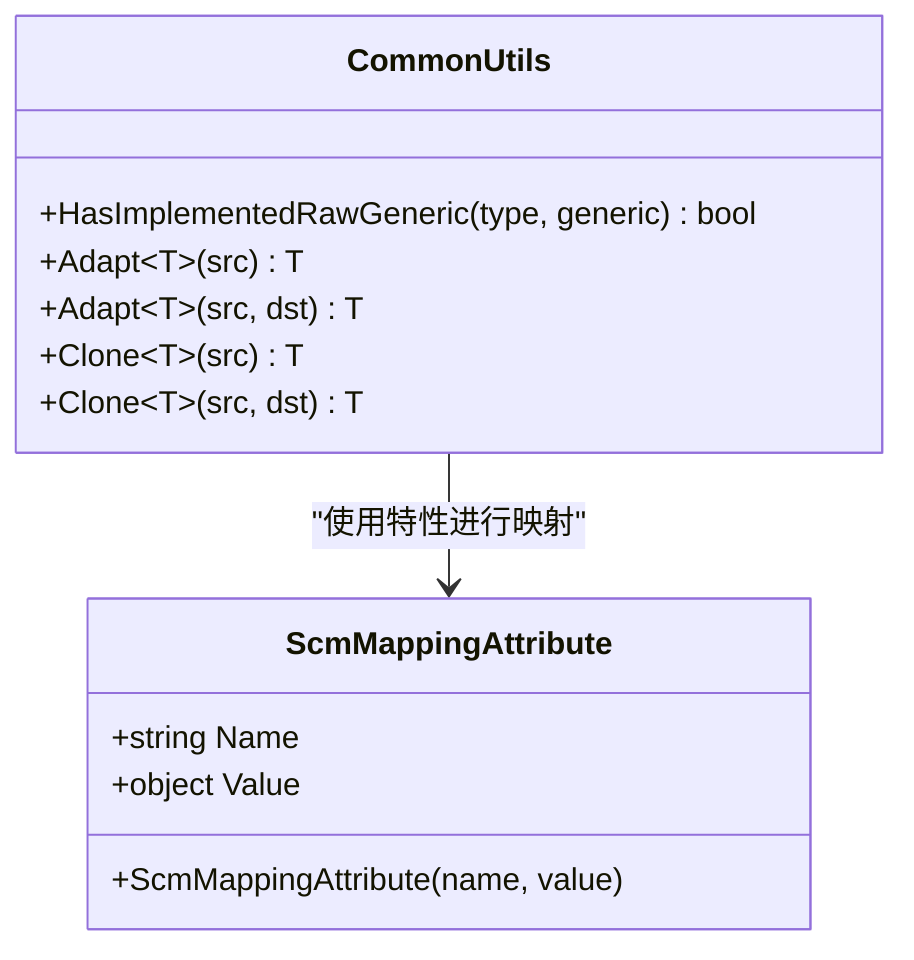
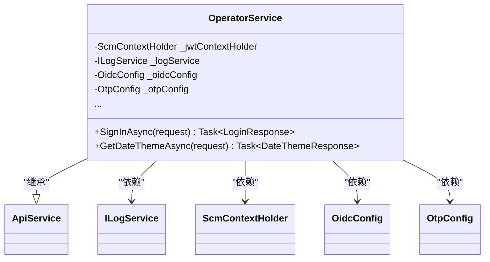
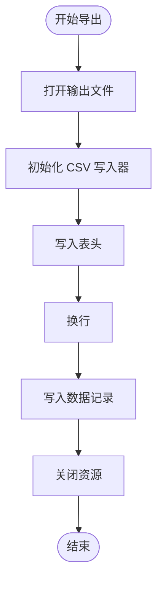
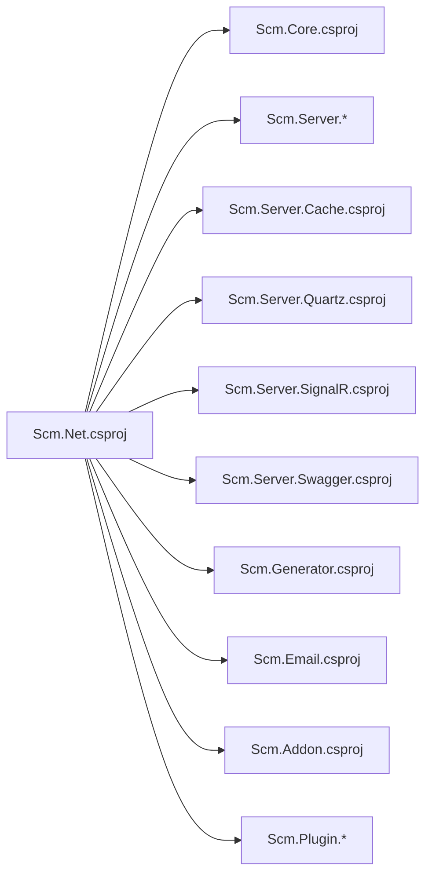

# 代码规范与最佳实践

<cite>
**本文引用的文件**   
- [Scm.Net/Program.cs](file://Scm.Net/Program.cs)
- [Scm.Net/appsettings.json](file://Scm.Net/appsettings.json)
- [Scm.Net/Scm.Net.csproj](file://Scm.Net/Scm.Net.csproj)
- [Scm.Core/Configure/Filters/AopActionFilter.cs](file://Scm.Core/Configure/Filters/AopActionFilter.cs)
- [Scm.Core/Configure/Middleware/ExceptionMiddleware.cs](file://Scm.Core/Configure/Middleware/ExceptionMiddleware.cs)
- [Scm.Common/Scm.Common.csproj](file://Scm.Common/Scm.Common.csproj)
- [Scm.Common/Utils/CommonUtils.cs](file://Scm.Common/Utils/CommonUtils.cs)
- [Scm.Common/Exceptions/BusinessException.cs](file://Scm.Common/Exceptions/BusinessException.cs)
- [Scm.Core/Operator/OperatorService.cs](file://Scm.Core/Operator/OperatorService.cs)
- [Scm.Core/ScmTaskHandler.cs](file://Scm.Core/ScmTaskHandler.cs)
- [Scm.Server.Api/DynamicWebApi/Helpers/ExtensionMethods.cs](file://Scm.Server.Api/DynamicWebApi/Helpers/ExtensionMethods.cs)
- [Scm.Dao/Res/App/ScmResAppDao.cs](file://Scm.Dao/Res/App/ScmResAppDao.cs)
- [Samples.Server/Book/Dvo/BookDvo.cs](file://Samples.Server/Book/Dvo/BookDvo.cs)
- [Scm.Plugin.Audio/ID3/V2/ID3v2Frames.cs](file://Scm.Plugin.Audio/ID3/V2/ID3v2Frames.cs)
</cite>

## 目录
1. [引言](#引言)
2. [项目结构](#项目结构)
3. [核心组件](#核心组件)
4. [架构总览](#架构总览)
5. [详细组件分析](#详细组件分析)
6. [依赖关系分析](#依赖关系分析)
7. [性能考虑](#性能考虑)
8. [故障排查指南](#故障排查指南)
9. [结论](#结论)
10. [附录](#附录)

## 引言
本指南面向 Scm.Net 项目全体开发者，旨在建立统一的 C# 编码规范、架构设计原则、注释标准、单元测试实践、性能优化与安全编码规范。文档以现有代码库为依据，提炼最佳实践，并通过图示帮助不同技术背景的读者快速理解与落地。

## 项目结构
Scm.Net 采用多项目分层组织方式，核心分为：
- 应用层：Scm.Net（ASP.NET Core 启动与配置）
- 核心服务层：Scm.Core（业务服务、过滤器、中间件、任务处理器）
- 通用工具层：Scm.Common（公共工具、异常、枚举、扩展）
- 数据访问层：Scm.Dao（DAO 实现）
- DTO 层：Scm.Dto、Nas.Dto、Samples.Common.Dto 等
- 插件与扩展：Scm.Plugin.*、Scm.Server.*（缓存、定时任务、信号、Swagger、JWT 等）
- 示例与样例：Samples.*（演示与集成）

**章节来源**
- [Scm.Net/Scm.Net.csproj:1-86](file://Scm.Net/Scm.Net.csproj#L1-L86)
- [Scm.Net/Program.cs:33-258](file://Scm.Net/Program.cs#L33-L258)

## 核心组件
- 启动与配置：在应用入口集中注册服务、中间件、过滤器、Swagger、JWT、跨域、文件服务、SignalR、定时任务等。
- 过滤器与中间件：全局 AOP 行为过滤器负责签名校验、参数校验、审计日志、统一结果包装；异常中间件统一捕获异常并返回标准响应。
- 服务层：OperatorService 等业务服务通过依赖注入获取 SQL、缓存、日志、配置等能力，遵循最小暴露与职责单一。
- 工具与映射：CommonUtils 提供对象浅/深拷贝与泛型接口检测；ScmMappingAttribute 支持属性映射定制。
- 任务处理：ScmTaskHandler 抽象导出任务写入 CSV 的流程，便于扩展。

**章节来源**
- [Scm.Net/Program.cs:44-258](file://Scm.Net/Program.cs#L44-L258)
- [Scm.Core/Configure/Filters/AopActionFilter.cs:20-419](file://Scm.Core/Configure/Filters/AopActionFilter.cs#L20-L419)
- [Scm.Core/Configure/Middleware/ExceptionMiddleware.cs:8-41](file://Scm.Core/Configure/Middleware/ExceptionMiddleware.cs#L8-L41)
- [Scm.Common/Utils/CommonUtils.cs:11-185](file://Scm.Common/Utils/CommonUtils.cs#L11-L185)
- [Scm.Core/Operator/OperatorService.cs:39-200](file://Scm.Core/Operator/OperatorService.cs#L39-L200)
- [Scm.Core/ScmTaskHandler.cs:10-115](file://Scm.Core/ScmTaskHandler.cs#L10-L115)

## 架构总览
Scm.Net 采用分层架构与依赖注入组合：
- 表现层：控制器与动态 Web API（由 Scm.Server.Api 提供支持）
- 业务层：服务类（如 OperatorService）封装业务逻辑
- 数据访问层：DAO + SqlSugar（仓储 SugarRepository）
- 基础设施：缓存、日志、定时任务、JWT、跨域、Swagger、SignalR
- 插件体系：图像、音频、视频等插件模块

**图表来源**
- [Scm.Net/Program.cs:147-238](file://Scm.Net/Program.cs#L147-L238)
- [Scm.Core/Operator/OperatorService.cs:68-84](file://Scm.Core/Operator/OperatorService.cs#L68-L84)

**章节来源**
- [Scm.Net/Program.cs:147-238](file://Scm.Net/Program.cs#L147-L238)
- [Scm.Core/Operator/OperatorService.cs:68-84](file://Scm.Core/Operator/OperatorService.cs#L68-L84)

## 详细组件分析

### 组件一：启动与配置（Program.cs）
- 服务注册：集中注册环境、UID、SQL、字体、缓存、Swagger、安全、代码生成、Quartz、邮件、短信、Aiml、OIDC、OTP、Cors、服务、JWT、跨域、SignalR、Mapper。
- 中间件管线：HTTPS、静态文件、路由、跨域、认证、授权、异常中间件、JWT 中间件、Quartz、映射控制器与 Hub。
- 数据库初始化：SqlSugarScope 初始化、模型加载、数据库初始化、单例注册与仓储注册。
- 文件与字体：根据环境配置重命名初始文件，加载字体与默认字体名。

**图表来源**
- [Scm.Net/Program.cs:33-258](file://Scm.Net/Program.cs#L33-L258)

**章节来源**
- [Scm.Net/Program.cs:33-258](file://Scm.Net/Program.cs#L33-L258)

### 组件二：全局过滤器（AopActionFilter）
- 功能要点：
  - 请求校验：基于缓存盐值与时间戳的签名校验（可开关）。
  - 忽略列表：对特定路径（上传、验证码、SignalR、登录）跳过校验。
  - 参数校验：ModelState 不合法时统一返回错误。
  - 审计日志：记录操作用户、IP、UA、URL、耗时、参数与结果摘要。
  - 统一结果：将 ActionResult 包装为统一 JSON 结果（可按特性跳过）。
  - 授权校验：按主机名与白名单策略进行授权检查。
- 特性支持：支持通过特性跳过审计、跳过日志、跳过统一结果。

**图表来源**
- [Scm.Core/Configure/Filters/AopActionFilter.cs:61-276](file://Scm.Core/Configure/Filters/AopActionFilter.cs#L61-L276)

**章节来源**
- [Scm.Core/Configure/Filters/AopActionFilter.cs:20-419](file://Scm.Core/Configure/Filters/AopActionFilter.cs#L20-L419)

### 组件三：异常中间件（ExceptionMiddleware）
- 功能要点：
  - 捕获管道内未处理异常。
  - 返回统一的 JSON 响应结构（包含状态码与消息）。
  - 保持响应内容类型为 JSON。

**图表来源**
- [Scm.Core/Configure/Middleware/ExceptionMiddleware.cs:17-39](file://Scm.Core/Configure/Middleware/ExceptionMiddleware.cs#L17-L39)

**章节来源**
- [Scm.Core/Configure/Middleware/ExceptionMiddleware.cs:8-41](file://Scm.Core/Configure/Middleware/ExceptionMiddleware.cs#L8-L41)

### 组件四：通用工具与映射（CommonUtils、ScmMappingAttribute）
- 对象映射与克隆：
  - 支持浅拷贝与深拷贝，自动匹配属性名或使用自定义映射属性。
  - 支持通过特性指定源属性名与默认值。
- 泛型接口检测：判断类型是否实现指定泛型接口。
- 适用场景：DTO 与 Dvo 之间的字段映射、对象复制与转换。

**图表来源**
- [Scm.Common/Utils/CommonUtils.cs:11-185](file://Scm.Common/Utils/CommonUtils.cs#L11-L185)
- [Scm.Common/Attributes/ScmMappingAttribute.cs](file://Scm.Common/Attributes/ScmMappingAttribute.cs)

**章节来源**
- [Scm.Common/Utils/CommonUtils.cs:11-185](file://Scm.Common/Utils/CommonUtils.cs#L11-L185)

### 组件五：业务服务（OperatorService）
- 角色定位：核心业务服务，封装登录、主题、用户信息等业务流程。
- 依赖注入：SQL 客户端、环境配置、缓存、JWT 上下文、日志、OIDC/OTP 配置。
- 设计要点：
  - 使用特性标注 API 分组与匿名访问。
  - 严格区分登录模式（密码、手机/邮箱 OTP、OAuth/OIDC），并分别处理。
  - 登录成功后记录审计日志与用户日志。
  - 返回统一响应结构。

**图表来源**
- [Scm.Core/Operator/OperatorService.cs:39-84](file://Scm.Core/Operator/OperatorService.cs#L39-L84)

**章节来源**
- [Scm.Core/Operator/OperatorService.cs:39-200](file://Scm.Core/Operator/OperatorService.cs#L39-L200)

### 组件六：任务处理器（ScmTaskHandler）
- 抽象基类：定义导出 CSV 的通用流程（写表头、写数据）。
- 可扩展点：针对固定列清单与对象字段映射的自定义写入逻辑。
- 适用场景：批量导出、报表生成等。

**图表来源**
- [Scm.Core/ScmTaskHandler.cs:15-48](file://Scm.Core/ScmTaskHandler.cs#L15-L48)

**章节来源**
- [Scm.Core/ScmTaskHandler.cs:10-115](file://Scm.Core/ScmTaskHandler.cs#L10-L115)

### 组件七：动态 API 辅助（ExtensionMethods）
- 字符串拆分与首词提取：支持驼峰/帕斯卡大小写识别，提取首词。
- 用途：动态 API 路由命名、模块识别等。

**章节来源**
- [Scm.Server.Api/DynamicWebApi/Helpers/ExtensionMethods.cs:114-189](file://Scm.Server.Api/DynamicWebApi/Helpers/ExtensionMethods.cs#L114-L189)

### 组件八：数据访问与 DTO（DAO、Dvo）
- DAO：示例中包含基础 PrepareCreate、GetCode/GetName 等方法，体现数据访问层的职责。
- Dvo：示例中包含字段注释与属性命名，体现 DTO 的清晰表达。

**章节来源**
- [Scm.Dao/Res/App/ScmResAppDao.cs:51-79](file://Scm.Dao/Res/App/ScmResAppDao.cs#L51-L79)
- [Samples.Server/Book/Dvo/BookDvo.cs:1-41](file://Samples.Server/Book/Dvo/BookDvo.cs#L1-L41)

### 组件九：插件与扩展（ID3 帧）
- 验证逻辑：提供货币与数值有效性校验，体现插件层的数据校验与健壮性。

**章节来源**
- [Scm.Plugin.Audio/ID3/V2/ID3v2Frames.cs:97-147](file://Scm.Plugin.Audio/ID3/V2/ID3v2Frames.cs#L97-L147)

## 依赖关系分析
- 项目引用：Scm.Net 引用多个子项目（核心、服务、缓存、定时、信号、Swagger、示例等），形成清晰的分层依赖。
- 外部包：Serilog 日志、ImageSharp 图像处理、NewtonsoftJson、SqlSugar 等。
- 配置驱动：appsettings.json 驱动 Kestrel、环境、SQL、缓存、JWT、安全、跨域等。

**图表来源**
- [Scm.Net/Scm.Net.csproj:37-49](file://Scm.Net/Scm.Net.csproj#L37-L49)

**章节来源**
- [Scm.Net/Scm.Net.csproj:1-86](file://Scm.Net/Scm.Net.csproj#L1-L86)
- [Scm.Net/appsettings.json:1-127](file://Scm.Net/appsettings.json#L1-L127)

## 性能考虑
- 数据库连接与事务：
  - 使用 SqlSugarScope 单例注册与仓储模式，减少连接开销。
  - 在 Aop 中对 SQL 执行前事件进行日志替换（调试用途），生产环境建议关闭或降级。
- 缓存与签名：
  - 使用缓存存储盐值，避免重复计算签名成本。
- IO 与文件：
  - 导出 CSV 使用流式写入，避免大对象内存驻留。
- 中间件顺序：
  - 将认证/授权置于路由之后、异常中间件之前，确保异常可被统一处理。
- 日志与监控：
  - 使用 Serilog 控制台与文件输出，结合最小日志级别，平衡可观测性与性能。

**章节来源**
- [Scm.Net/Program.cs:282-356](file://Scm.Net/Program.cs#L282-L356)
- [Scm.Core/Configure/Filters/AopActionFilter.cs:325-339](file://Scm.Core/Configure/Filters/AopActionFilter.cs#L325-L339)
- [Scm.Core/ScmTaskHandler.cs:15-48](file://Scm.Core/ScmTaskHandler.cs#L15-L48)

## 故障排查指南
- 统一异常处理：
  - 异常中间件捕获未处理异常，返回统一 JSON 结构，便于前端与监控系统解析。
- 审计与日志：
  - AOP 过滤器记录请求参数、耗时、结果摘要与用户信息，便于问题回溯。
- 配置检查：
  - appsettings.json 中的 JWT、安全、跨域、Kestrel、SQL、缓存等配置项直接影响运行行为。
- 业务异常：
  - 业务异常通过 BusinessException 抛出，便于上层统一处理。

**章节来源**
- [Scm.Core/Configure/Middleware/ExceptionMiddleware.cs:29-39](file://Scm.Core/Configure/Middleware/ExceptionMiddleware.cs#L29-L39)
- [Scm.Core/Configure/Filters/AopActionFilter.cs:230-268](file://Scm.Core/Configure/Filters/AopActionFilter.cs#L230-L268)
- [Scm.Common/Exceptions/BusinessException.cs:8-22](file://Scm.Common/Exceptions/BusinessException.cs#L8-L22)
- [Scm.Net/appsettings.json:100-127](file://Scm.Net/appsettings.json#L100-L127)

## 结论
本指南基于 Scm.Net 现有实现总结了编码规范、架构设计、注释标准、测试与性能优化建议。建议团队在开发过程中遵循本文档，持续完善统一的开发体验与质量保障。

## 附录

### A. 命名约定（基于现有代码）
- 类名：帕斯卡命名（如 OperatorService、AopActionFilter、ExceptionMiddleware）。
- 方法名：帕斯卡命名（如 SignInAsync、GetDateThemeAsync、SaveByRaw）。
- 变量名：驼峰命名（如 userId、sqlConfig、envConfig）。
- 接口名：以 I 开头（如 ILogService、ISqlSugarClient、ICacheService）。
- 枚举与 DTO：帕斯卡命名（如 LoginRequest、LoginResponse、BookDvo）。
- 插件与扩展：模块前缀 + 功能（如 Scm.Plugin.Image、Scm.Server.Quartz）。

**章节来源**
- [Scm.Core/Operator/OperatorService.cs:39-200](file://Scm.Core/Operator/OperatorService.cs#L39-L200)
- [Scm.Core/Configure/Filters/AopActionFilter.cs:20-419](file://Scm.Core/Configure/Filters/AopActionFilter.cs#L20-L419)
- [Scm.Core/Configure/Middleware/ExceptionMiddleware.cs:8-41](file://Scm.Core/Configure/Middleware/ExceptionMiddleware.cs#L8-L41)
- [Scm.Core/ScmTaskHandler.cs:10-115](file://Scm.Core/ScmTaskHandler.cs#L10-L115)
- [Samples.Server/Book/Dvo/BookDvo.cs:1-41](file://Samples.Server/Book/Dvo/BookDvo.cs#L1-L41)

### B. 代码缩进与格式化（基于现有代码）
- 缩进：统一使用 4 空格缩进。
- 大括号：控制块与方法体的大括号另起一行。
- 行长度：尽量不超过 120 列，超长时分行。
- 空行：方法之间保留空行，逻辑段落之间适当空行。
- using：按命名空间分组，保持整洁。

**章节来源**
- [Scm.Net/Program.cs:33-258](file://Scm.Net/Program.cs#L33-L258)
- [Scm.Core/Operator/OperatorService.cs:39-200](file://Scm.Core/Operator/OperatorService.cs#L39-L200)

### C. 注释规范（XML 注释与字段注释）
- XML 注释：
  - 类、方法、属性、参数、返回值均应提供清晰说明。
  - 使用摘要、参数、返回值等标准标签。
- 字段注释：
  - DTO 与 Dvo 字段使用中文注释说明含义与用途。
- 示例参考：
  - Dvo 字段注释与业务含义说明。
  - 插件帧类的 ToString 与 IsValid 说明。

**章节来源**
- [Samples.Server/Book/Dvo/BookDvo.cs:8-40](file://Samples.Server/Book/Dvo/BookDvo.cs#L8-L40)
- [Scm.Plugin.Audio/ID3/V2/ID3v2Frames.cs:99-147](file://Scm.Plugin.Audio/ID3/V2/ID3v2Frames.cs#L99-L147)

### D. 单元测试编写指南
- 测试用例设计原则：
  - 覆盖正常路径、边界条件与异常路径。
  - 使用特性标注（如 [Fact] 或 [Theory]）组织测试。
- Mock 对象：
  - 使用 Moq 等框架模拟外部依赖（如 ILogService、ICacheService、ISqlSugarClient）。
- 测试覆盖率：
  - 建议关键业务逻辑覆盖率不低于 80%，核心服务不低于 90%。
- 断言与清理：
  - 使用断言验证返回值、异常与副作用。
  - 清理临时文件与数据库状态，避免测试污染。

[本节为通用指导，不直接分析具体文件]

### E. 性能优化建议
- 数据库：
  - 合理使用仓储与查询缓存，避免 N+1 查询。
  - 对高频查询添加索引与分页。
- 缓存：
  - 对热点数据使用分布式缓存，设置合理过期策略。
- IO：
  - 大文件导出使用流式写入，避免一次性加载至内存。
- 中间件：
  - 仅启用必要中间件，避免多余开销。
- 日志：
  - 生产环境降低日志级别，避免频繁 IO。

[本节为通用指导，不直接分析具体文件]

### F. 安全编码规范
- 输入校验：
  - 使用模型绑定与验证，拒绝非法参数。
- 签名与时间戳：
  - 借鉴 AOP 过滤器中的签名机制，校验 appkey、timestamp、signature。
- 跨域与认证：
  - 明确允许来源与方法，启用 HTTPS 与强认证。
- 异常处理：
  - 不向客户端泄露内部异常细节，使用统一错误响应。

**章节来源**
- [Scm.Core/Configure/Filters/AopActionFilter.cs:90-208](file://Scm.Core/Configure/Filters/AopActionFilter.cs#L90-L208)
- [Scm.Core/Configure/Middleware/ExceptionMiddleware.cs:29-39](file://Scm.Core/Configure/Middleware/ExceptionMiddleware.cs#L29-L39)
- [Scm.Net/appsettings.json:106-127](file://Scm.Net/appsettings.json#L106-L127)