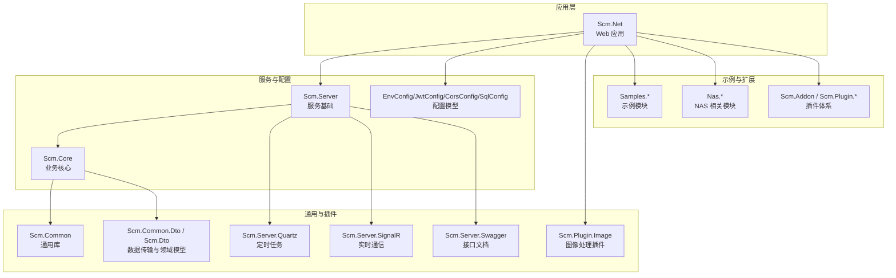
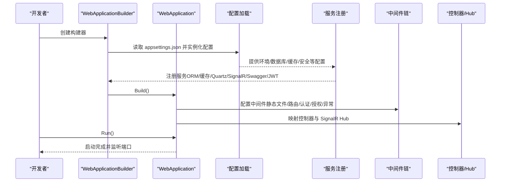
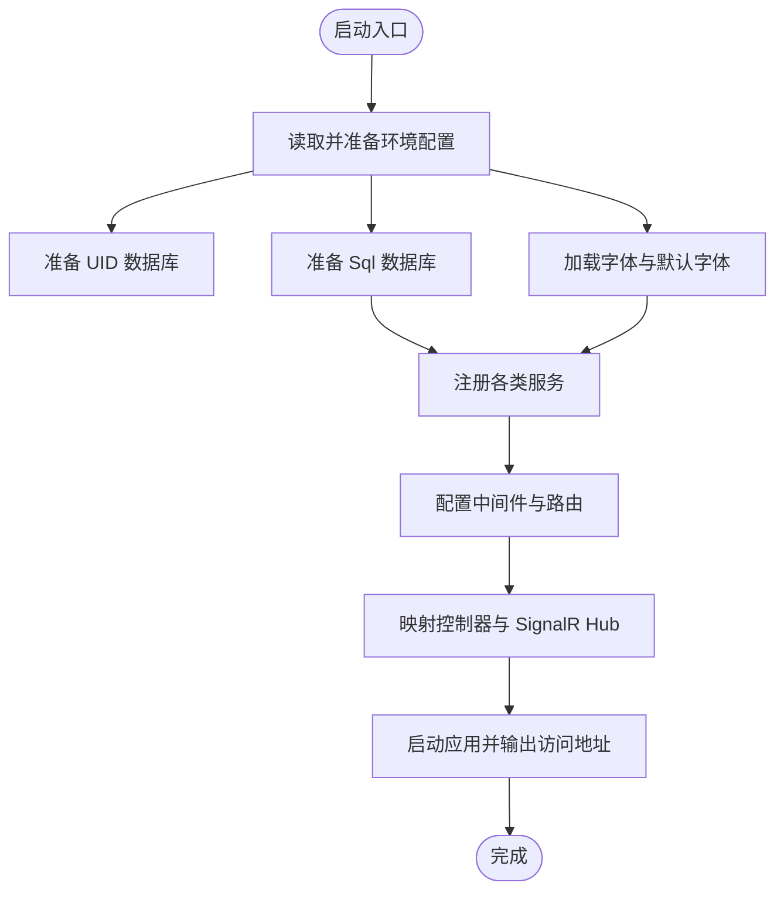
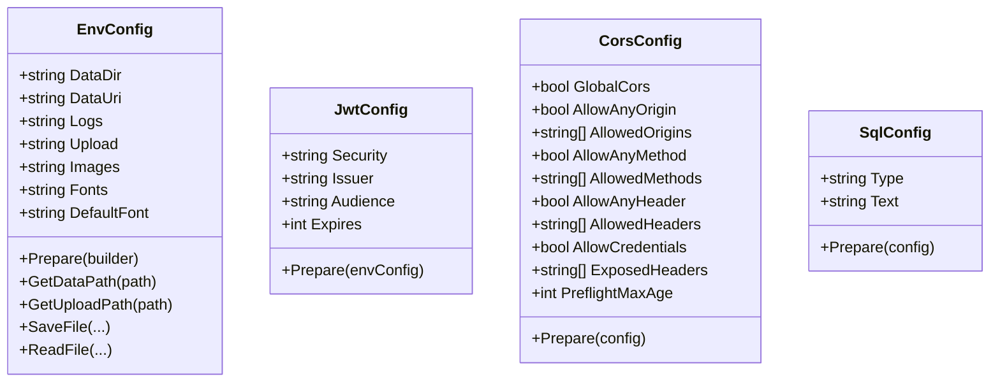
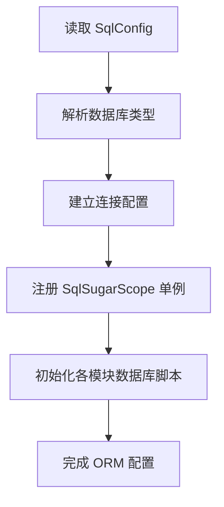
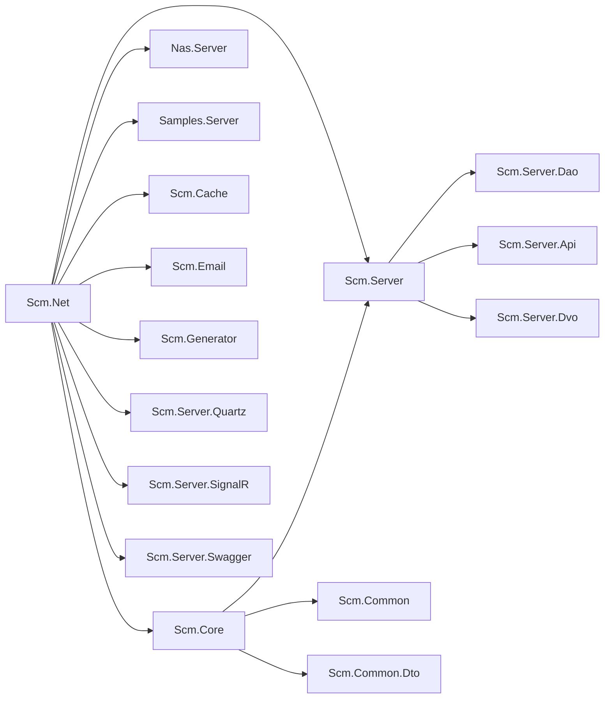

# 开发指南

<cite>
**本文引用的文件**
- [Scm.Net.csproj](file://Scm.Net/Scm.Net.csproj)
- [Scm.sln](file://Scm.sln)
- [Program.cs](file://Scm.Net/Program.cs)
- [appsettings.json](file://Scm.Net/appsettings.json)
- [launchSettings.json](file://Scm.Net/Properties/launchSettings.json)
- [.gitignore](file://.gitignore)
- [README.md](file://README.md)
- [Scm.Common.csproj](file://Scm.Common/Scm.Common.csproj)
- [Scm.Core.csproj](file://Scm.Core/Scm.Core.csproj)
- [Scm.Server.csproj](file://Scm.Server/Scm.Server.csproj)
- [EnvConfig.cs](file://Scm.Server/Config/EnvConfig.cs)
- [JwtConfig.cs](file://Scm.Server/Config/JwtConfig.cs)
- [CorsConfig.cs](file://Scm.Server/Config/CorsConfig.cs)
- [SqlConfig.cs](file://Scm.Server/Config/SqlConfig.cs)
- [Scm.Plugin.Image.csproj](file://Scm.Plugin.Image/Scm.Plugin.Image.csproj)
- [Scm.Server.Quartz.csproj](file://Scm.Server.Quartz/Scm.Server.Quartz.csproj)
- [Test.csproj](file://Test/Test.csproj)
</cite>

## 更新摘要
**所做更改**
- 新增开发环境搭建完整子系统文档
- 新增代码规范与最佳实践完整子系统文档
- 新增构建与调试完整子系统文档
- 新增测试策略与实践完整子系统文档
- 新增版本控制与协作完整子系统文档
- 新增性能优化与安全编码完整子系统文档
- 更新项目结构图和架构图以反映6个子系统
- 增强故障排除指南的系统性和完整性

## 目录
1. [简介](#简介)
2. [项目结构](#项目结构)
3. [核心组件](#核心组件)
4. [架构总览](#架构总览)
5. [详细组件分析](#详细组件分析)
6. [依赖关系分析](#依赖关系分析)
7. [性能考虑](#性能考虑)
8. [故障排除指南](#故障排除指南)
9. [结论](#结论)
10. [附录](#附录)

## 简介
本开发指南面向 Scm.Net 项目，目标是帮助开发者快速搭建开发环境、理解项目架构与模块职责、掌握构建与调试流程、制定代码规范与最佳实践，并提供版本控制、分支管理、发布流程、性能优化、安全编码与错误处理的建议。Scm.Net 是一款基于 .NET 10 的后端快速开发框架，采用多项目解决方案组织，结合 Swagger 文档、JWT 认证、SqlSugar ORM、Serilog 日志、Quartz 定时任务、SignalR 实时通信等技术栈。

**更新** 新增6个完整的子系统开发指南，涵盖从环境搭建到性能优化的全流程开发实践。

## 项目结构
Scm.Net 采用多项目解决方案（Solution）组织，核心应用位于 Scm.Net，其他模块分布在 Scm.*、Nas.*、Samples.* 等子项目中。整体结构如下图所示：



**图表来源**
- [Scm.sln](file://Scm.sln)
- [Scm.Net.csproj](file://Scm.Net/Scm.Net.csproj)
- [Scm.Core.csproj](file://Scm.Core/Scm.Core.csproj)
- [Scm.Server.csproj](file://Scm.Server/Scm.Server.csproj)
- [Scm.Common.csproj](file://Scm.Common/Scm.Common.csproj)

**章节来源**
- [Scm.sln](file://Scm.sln)
- [Scm.Net.csproj](file://Scm.Net/Scm.Net.csproj)

## 核心组件
- 应用入口与启动管线
  - 启动类负责读取配置、初始化日志、注册服务、配置中间件、路由与认证授权、启动 Quartz、映射控制器与 SignalR Hub。
- 配置体系
  - 环境配置（数据目录、上传/图片/日志/字体等路径）、JWT、CORS、SQL 连接、缓存、邮件、短信、生成器模板、安全参数等。
- ORM 与仓储
  - 基于 SqlSugar 的仓储与单元工作流过滤器，支持 SQLite/其他数据库类型。
- 日志与监控
  - Serilog 控制台与文件输出，支持滚动日志。
- 定时任务与实时通信
  - Quartz 任务调度；SignalR 实现实时消息。
- 插件与扩展
  - 图像处理、音频/视频插件、插件工厂与清单机制。

**章节来源**
- [Program.cs](file://Scm.Net/Program.cs)
- [EnvConfig.cs](file://Scm.Server/Config/EnvConfig.cs)
- [JwtConfig.cs](file://Scm.Server/Config/JwtConfig.cs)
- [CorsConfig.cs](file://Scm.Server/Config/CorsConfig.cs)
- [SqlConfig.cs](file://Scm.Server/Config/SqlConfig.cs)

## 架构总览
下图展示了应用启动到请求处理的关键流程，以及主要配置与服务的装配顺序：



**图表来源**
- [Program.cs](file://Scm.Net/Program.cs)
- [appsettings.json](file://Scm.Net/appsettings.json)

## 详细组件分析

### 组件 A：应用启动与服务装配（Program.cs）
- 关键职责
  - 初始化环境配置与数据目录
  - 注册日志、数据库、缓存、Swagger、安全、代码生成、Quartz、邮件、短信、Aiml、OIDC/Otp 等配置与服务
  - 配置全局过滤器、跨域、认证授权、异常中间件、SignalR、Mapper
  - 启动应用并输出访问地址
- 启动流程要点
  - 读取配置并准备环境路径
  - 初始化数据库（SqlSugar），执行多模块 SQL 初始化
  - 加载字体与默认字体
  - 注册服务与中间件，映射控制器与 Hub
  - 输出启动信息与访问地址



**图表来源**
- [Program.cs](file://Scm.Net/Program.cs)

**章节来源**
- [Program.cs](file://Scm.Net/Program.cs)

### 组件 B：配置模型（EnvConfig/JwtConfig/CorsConfig/SqlConfig）
- 环境配置（EnvConfig）
  - 负责计算数据目录、上传/图片/日志/字体等相对或绝对路径，提供统一的文件读写与路径拼接方法。
- JWT 配置（JwtConfig）
  - 安全密钥、发行者、受众、过期时间等，提供默认值与校验逻辑。
- CORS 配置（CorsConfig）
  - 允许来源、方法、头、凭据、预检缓存等，提供默认空数组与最小化预检时间。
- SQL 配置（SqlConfig）
  - 数据库类型与连接字符串，默认 SQLite 与本地数据库文件。



**图表来源**
- [EnvConfig.cs](file://Scm.Server/Config/EnvConfig.cs)
- [JwtConfig.cs](file://Scm.Server/Config/JwtConfig.cs)
- [CorsConfig.cs](file://Scm.Server/Config/CorsConfig.cs)
- [SqlConfig.cs](file://Scm.Server/Config/SqlConfig.cs)

**章节来源**
- [EnvConfig.cs](file://Scm.Server/Config/EnvConfig.cs)
- [JwtConfig.cs](file://Scm.Server/Config/JwtConfig.cs)
- [CorsConfig.cs](file://Scm.Server/Config/CorsConfig.cs)
- [SqlConfig.cs](file://Scm.Server/Config/SqlConfig.cs)

### 组件 C：ORM 与仓储（SqlSugar）
- 初始化与配置
  - 根据配置选择数据库类型，设置连接字符串、自动关闭连接、实体属性映射（含枚举与整型映射规则）
  - 注册 AOP 日志拦截（可选）
  - 初始化多个模块的数据库脚本与表结构
- 仓储与工作单元
  - 提供 SugarRepository<T> 仓储基类与单元工作流过滤器，确保事务一致性



**图表来源**
- [Program.cs](file://Scm.Net/Program.cs)

**章节来源**
- [Program.cs](file://Scm.Net/Program.cs)

### 组件 D：日志与静态资源（Serilog 与静态文件）
- 日志
  - 通过 appsettings.json 的 Serilog 节点配置控制台与文件输出，支持按天滚动
- 静态资源
  - 使用 FileServer 提供 data 目录映射（可配置 DataUri），支持外部静态资源访问

**章节来源**
- [appsettings.json](file://Scm.Net/appsettings.json)
- [Program.cs](file://Scm.Net/Program.cs)

## 依赖关系分析
- 解决方案与项目依赖
  - Scm.Net 引用 Scm.Core、Scm.Server、Scm.Server.Api、Scm.Server.Quartz、Scm.Server.SignalR、Scm.Server.Swagger、Scm.Cache、Scm.Email、Scm.Generator、Nas.Server、Samples.Server 等
  - Scm.Core 引用 Scm.Common、Scm.Common.Dto、Scm.Dto、Scm.Server 等
  - Scm.Server 引用 Scm.Dao、Scm.Dto、Scm.Server.Api、Scm.Server.Dao、Scm.Server.Dvo 等
- 外部包与本地引用
  - 应用层引入 Newtonsoft.Json、Serilog 生态、ImageSharp、SixLabors.Fonts 等
  - 通过 HintPath 引入若干 Libs 下的本地 DLL



**图表来源**
- [Scm.sln](file://Scm.sln)
- [Scm.Net.csproj](file://Scm.Net/Scm.Net.csproj)
- [Scm.Core.csproj](file://Scm.Core/Scm.Core.csproj)
- [Scm.Server.csproj](file://Scm.Server/Scm.Server.csproj)

**章节来源**
- [Scm.sln](file://Scm.sln)
- [Scm.Net.csproj](file://Scm.Net/Scm.Net.csproj)

## 性能考虑
- 数据库
  - 合理使用索引与查询条件，避免 N+1 查询；对大结果集分页与投影
  - SqlSugar AOP 日志仅在必要时开启，避免生产环境过度开销
- 缓存
  - 对热点数据使用 Redis 缓存，设置合理过期策略与键空间命名规范
- 日志
  - 生产环境降低日志级别，避免高频写盘；异步日志 sink 提升吞吐
- 静态资源
  - 合理配置静态文件缓存与压缩；对外部资源使用 CDN
- 定时任务
  - 任务并发度与重试策略需评估资源占用；失败重试与死信队列
- 图像处理
  - 批量处理时限制并发，避免内存峰值；使用流式处理减少 IO

## 故障排除指南
- 启动失败或端口占用
  - 检查 Kestrel 端点配置与防火墙；确认未被占用
- 数据库无法连接
  - 校验 SqlConfig 的 Type 与 Text；确认 data 目录存在且有写权限
- 静态资源 404
  - 检查 EnvConfig 的 DataUri 与 DataDir；确认 FileServer 已启用并正确映射
- 跨域失败
  - 校验 CorsConfig 的 AllowAnyOrigin/AllowedOrigins/AllowedHeaders/AllowedMethods；确认已启用 UseCors
- JWT 认证失败
  - 校验 JwtConfig 的 Security/IAT/EXP/Audience；确认客户端携带有效 Token
- 日志无输出
  - 检查 appsettings.json 的 Serilog 节点；确认日志目录可写
- Quartz 任务不执行
  - 检查 Quartz 配置与作业文件；确认调度器已启动

**章节来源**
- [appsettings.json](file://Scm.Net/appsettings.json)
- [Program.cs](file://Scm.Net/Program.cs)
- [EnvConfig.cs](file://Scm.Server/Config/EnvConfig.cs)
- [CorsConfig.cs](file://Scm.Server/Config/CorsConfig.cs)
- [JwtConfig.cs](file://Scm.Server/Config/JwtConfig.cs)
- [SqlConfig.cs](file://Scm.Server/Config/SqlConfig.cs)

## 结论
Scm.Net 提供了清晰的分层架构与完善的基础设施（配置、日志、ORM、缓存、定时任务、实时通信）。遵循本文的开发与运维建议，可显著提升开发效率与系统稳定性。建议在团队内统一代码规范与分支策略，持续完善测试与监控体系。

## 附录

### A. 开发环境搭建完整子系统

#### A.1 环境要求
- **.NET SDK**: 版本 10.0 或更高
- **IDE**: Visual Studio 2022 或 VS Code + C# 扩展
- **数据库**: MariaDB 10.3 或更高（可选）
- **操作系统**: Windows、macOS、Linux

#### A.2 安装步骤
1. **安装 .NET 10 SDK**
   - 从官方渠道下载并安装 .NET 10 SDK
   - 验证安装：`dotnet --version`

2. **安装 IDE**
   - Visual Studio 2022（推荐）
   - 或 VS Code + C# 扩展包

3. **克隆与还原**
   ```bash
   git clone https://gitee.com/openscm/scm.net.git
   cd Scm.Net
   dotnet restore
   ```

4. **数据库配置**
   - 修改 `appsettings.json` 中的数据库连接字符串
   - 首次运行会自动生成数据库文件

5. **启动应用**
   - 使用 `dotnet run` 或 IDE 启动
   - 访问 `https://localhost:5000/swagger`

**章节来源**
- [README.md](file://README.md)
- [launchSettings.json](file://Scm.Net/Properties/launchSettings.json)
- [appsettings.json](file://Scm.Net/appsettings.json)

### B. 代码规范与最佳实践完整子系统

#### B.1 命名约定
- **类型命名**: PascalCase（如 `UserService`）
- **字段命名**: camelCase（如 `userName`）
- **常量命名**: UPPER_SNAKE_CASE（如 `MAX_RETRY_COUNT`）
- **接口命名**: I前缀 + PascalCase（如 `IUserService`）

#### B.2 代码风格
- **隐式 using**: 启用以简化代码
- **可空引用**: 禁用以提高安全性
- **方法设计**: 短小精悍，单一职责
- **异常处理**: 通过中间件与全局过滤器统一处理

#### B.3 注释规范
- **XML 注释**: 公共 API 与复杂逻辑必须添加
- **行内注释**: 解释复杂算法或业务逻辑
- **TODO 注释**: 标记待完成的工作

#### B.4 架构设计原则
- **分层架构**: 应用层负责装配，服务层封装业务，DAO 层专注数据访问
- **领域驱动**: DTO 与 Dvo 分离，避免跨层污染
- **可测试性**: 通过接口注入与工厂模式解耦

**章节来源**
- [Scm.Net.csproj](file://Scm.Net/Scm.Net.csproj)
- [Program.cs](file://Scm.Net/Program.cs)

### C. 构建与调试完整子系统

#### C.1 构建流程
1. **本地构建**
   ```bash
   dotnet build
   dotnet publish -c Release
   ```

2. **CI/CD 构建**
   - 使用 GitHub Actions 或 Azure DevOps
   - 自动化测试与部署流水线

#### C.2 调试技巧
1. **断点调试**
   - 在 `Program.cs` 中设置启动断点
   - 在服务层设置业务断点

2. **日志调试**
   - 使用 Serilog 输出详细日志
   - 配置不同级别的日志输出

3. **性能分析**
   - 使用 Visual Studio 性能分析器
   - 监控内存使用和 GC 活动

#### C.3 调试配置
- **launchSettings.json**: 配置启动 URL 和环境变量
- **appsettings.Development.json**: 开发环境专用配置
- **环境变量**: ASPNETCORE_ENVIRONMENT=Development

**章节来源**
- [launchSettings.json](file://Scm.Net/Properties/launchSettings.json)
- [appsettings.json](file://Scm.Net/appsettings.json)
- [Program.cs](file://Scm.Net/Program.cs)

### D. 测试策略与实践完整子系统

#### D.1 测试类型
1. **单元测试**
   - 测试单个方法或类的功能
   - 使用 Moq 进行依赖模拟

2. **集成测试**
   - 测试多个组件的协同工作
   - 使用测试数据库

3. **端到端测试**
   - 测试完整的用户流程
   - 使用 Selenium 或 Playwright

#### D.2 测试配置
1. **Test 项目结构**
   ```xml
   <ProjectReference Include="..\Scm.Dao\Scm.Dao.csproj" />
   <ProjectReference Include="..\Scm.Server.Dao\Scm.Server.Dao.csproj" />
   <ProjectReference Include="..\Scm.Server\Scm.Server.csproj" />
   ```

2. **测试数据管理**
   - 使用内存数据库进行测试
   - 测试数据隔离和清理

#### D.3 测试最佳实践
- **测试命名**: `MethodName_StateUnderTest_ExpectedBehavior`
- **测试隔离**: 每个测试独立运行
- **断言明确**: 使用有意义的断言消息

**章节来源**
- [Test.csproj](file://Test/Test.csproj)
- [Program.cs](file://Scm.Net/Program.cs)

### E. 版本控制与协作完整子系统

#### E.1 分支策略
1. **主分支保护**
   - master/main 分支保护
   - 需要代码审查和 CI 通过

2. **功能分支**
   ```
   feature/user-authentication
   feature/payment-integration
   hotfix/critical-bug-fix
   ```

3. **发布分支**
   ```
   release/v1.2.0
   release/v1.2.1
   ```

#### E.2 提交规范
1. **语义化提交**
   ```
   feat: 添加用户认证功能
   fix: 修复登录验证 bug
   docs: 更新 API 文档
   style: 代码格式化
   refactor: 重构代码结构
   test: 添加测试用例
   chore: 构建过程或辅助工具变动
   ```

2. **提交信息格式**
   ```
   <type>(<scope>): <subject>
   
   <body>
   
   <footer>
   ```

#### E.3 协作流程
1. **Pull Request 流程**
   - 创建功能分支
   - 提交 PR 进行代码审查
   - 通过 CI 检查后合并

2. **代码审查清单**
   - 代码质量检查
   - 安全性审查
   - 性能影响评估

**章节来源**
- [.gitignore](file://.gitignore)
- [README.md](file://README.md)

### F. 性能优化与安全编码完整子系统

#### F.1 性能优化
1. **数据库优化**
   - 合理使用索引与查询条件
   - 避免 N+1 查询问题
   - 使用连接池和批量操作

2. **缓存策略**
   - Redis 缓存热点数据
   - 设置合理的过期时间和键空间
   - 缓存穿透防护

3. **日志优化**
   - 生产环境降低日志级别
   - 使用异步日志 sink
   - 按天滚动日志文件

4. **静态资源优化**
   - 启用 Gzip 压缩
   - CDN 加速静态资源
   - 合理的缓存策略

#### F.2 安全编码
1. **身份认证**
   - JWT 密钥安全存储
   - 过期时间合理设置
   - 安全的 Token 刷新机制

2. **数据安全**
   - 输入验证和参数化查询
   - 敏感信息加密存储
   - SQL 注入防护

3. **网络安全**
   - CORS 配置白名单
   - HTTPS 强制使用
   - CSRF 保护

4. **权限控制**
   - 基于角色的访问控制
   - 最小权限原则
   - 权限审计日志

#### F.3 监控与告警
1. **应用监控**
   - 性能指标收集
   - 错误率监控
   - 响应时间跟踪

2. **安全监控**
   - 异常登录检测
   - 权限滥用监控
   - 数据访问审计

**章节来源**
- [appsettings.json](file://Scm.Net/appsettings.json)
- [Program.cs](file://Scm.Net/Program.cs)
- [EnvConfig.cs](file://Scm.Server/Config/EnvConfig.cs)
- [JwtConfig.cs](file://Scm.Server/Config/JwtConfig.cs)
- [CorsConfig.cs](file://Scm.Server/Config/CorsConfig.cs)

### G. 常见问题与排障清单

#### G.1 启动问题
- **端口占用**: 检查 Kestrel 配置与防火墙设置
- **证书问题**: 确认 HTTPS 证书配置正确
- **依赖缺失**: 运行 `dotnet restore` 重新获取依赖

#### G.2 数据库问题
- **连接失败**: 核对连接字符串和数据库服务状态
- **权限不足**: 检查数据库用户权限配置
- **迁移失败**: 查看数据库迁移日志

#### G.3 性能问题
- **响应缓慢**: 分析慢查询和内存使用情况
- **内存泄漏**: 使用内存分析工具检测
- **并发问题**: 检查线程池配置和锁竞争

#### G.4 安全问题
- **认证失败**: 核对 JWT 配置和密钥设置
- **跨域错误**: 检查 CORS 配置白名单
- **SQL 注入**: 确认参数化查询使用

**章节来源**
- [appsettings.json](file://Scm.Net/appsettings.json)
- [Program.cs](file://Scm.Net/Program.cs)
- [EnvConfig.cs](file://Scm.Server/Config/EnvConfig.cs)
- [SqlConfig.cs](file://Scm.Server/Config/SqlConfig.cs)