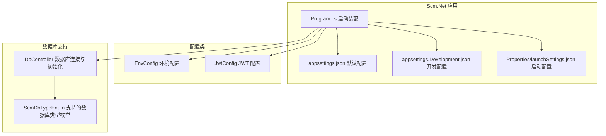
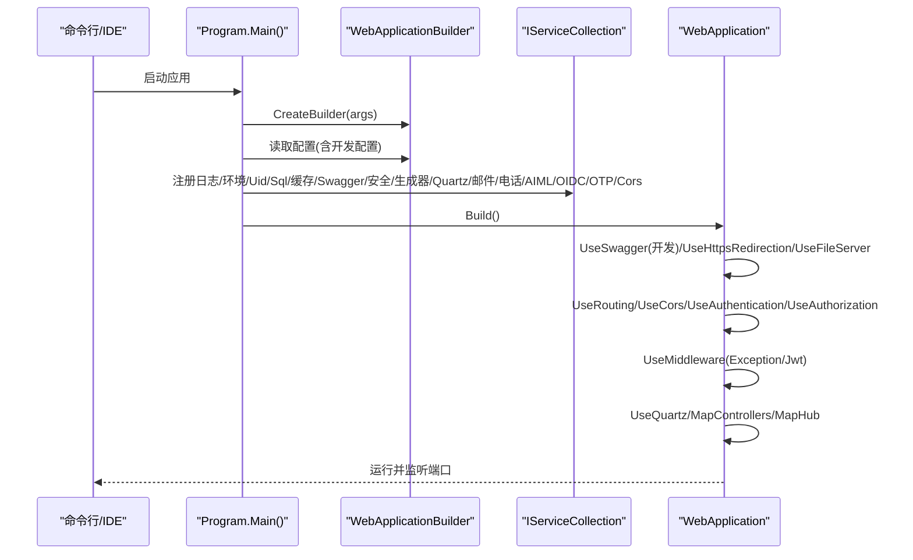
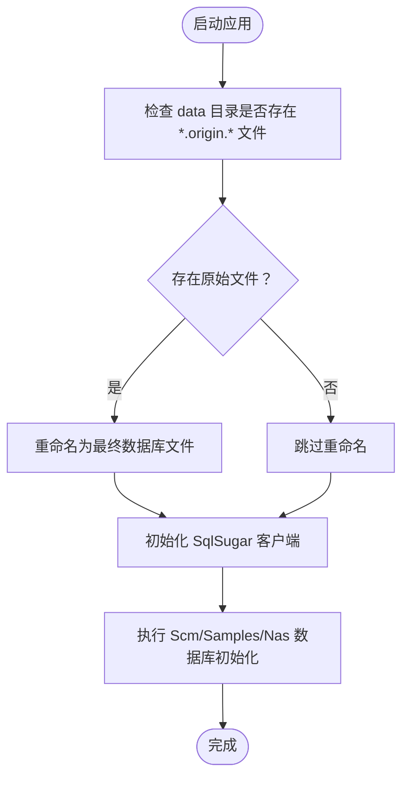
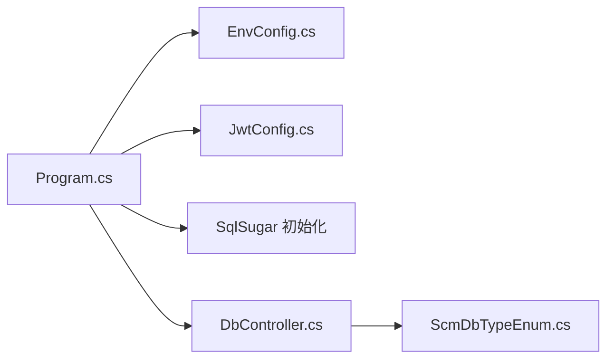

# 开发环境搭建

<cite>
**本文引用的文件**
- [Scm.Net.csproj](file://Scm.Net/Scm.Net.csproj)
- [appsettings.json](file://Scm.Net/appsettings.json)
- [appsettings.Development.json](file://Scm.Net/appsettings.Development.json)
- [launchSettings.json](file://Scm.Net/Properties/launchSettings.json)
- [Program.cs](file://Scm.Net/Program.cs)
- [EnvConfig.cs](file://Scm.Server/Config/EnvConfig.cs)
- [JwtConfig.cs](file://Scm.Server/Config/JwtConfig.cs)
- [DbController.cs](file://Scm.Net/Controllers/DbController.cs)
- [ScmDbTypeEnum.cs](file://Scm.Common/Enums/ScmDbTypeEnum.cs)
- [dotnet-tools.json](file://Scm.Net/.config/dotnet-tools.json)
- [readme.txt](file://Scm.Net/readme.txt)
</cite>

## 目录
1. [简介](#简介)
2. [项目结构](#项目结构)
3. [核心组件](#核心组件)
4. [架构总览](#架构总览)
5. [详细组件分析](#详细组件分析)
6. [依赖分析](#依赖分析)
7. [性能考虑](#性能考虑)
8. [故障排查指南](#故障排查指南)
9. [结论](#结论)
10. [附录](#附录)

## 简介
本指南面向 Scm.Net 项目的开发者，提供从零开始搭建开发环境的完整流程，涵盖 .NET 10 SDK 安装与版本要求、IDE 推荐配置（Visual Studio、VS Code、JetBrains Rider）、数据库环境准备（SQLite 与其他数据库支持）、NuGet 包与本地 DLL 依赖管理、关键环境变量与配置项说明，以及常见问题排查建议。文档以仓库中的实际配置文件与代码为依据，确保每一步都可落地实施。

## 项目结构
Scm.Net 采用多项目解决方案，核心 Web 应用位于 Scm.Net，其余模块按领域与职责拆分至独立项目。Web 应用通过 Program.cs 进行启动装配，读取 appsettings.*.json 进行配置注入，并通过 EnvConfig、JwtConfig 等配置类统一管理运行时参数。

**图示来源**
- [Program.cs:33-258](file://Scm.Net/Program.cs#L33-L258)
- [appsettings.json:1-127](file://Scm.Net/appsettings.json#L1-L127)
- [appsettings.Development.json:1-162](file://Scm.Net/appsettings.Development.json#L1-L162)
- [launchSettings.json:1-31](file://Scm.Net/Properties/launchSettings.json#L1-L31)
- [EnvConfig.cs:1-280](file://Scm.Server/Config/EnvConfig.cs#L1-L280)
- [JwtConfig.cs:1-48](file://Scm.Server/Config/JwtConfig.cs#L1-L48)
- [DbController.cs:45-286](file://Scm.Net/Controllers/DbController.cs#L45-L286)
- [ScmDbTypeEnum.cs:1-23](file://Scm.Common/Enums/ScmDbTypeEnum.cs#L1-L23)

**章节来源**
- [Scm.Net.csproj:1-86](file://Scm.Net/Scm.Net.csproj#L1-L86)
- [Program.cs:33-258](file://Scm.Net/Program.cs#L33-L258)
- [appsettings.json:1-127](file://Scm.Net/appsettings.json#L1-L127)
- [appsettings.Development.json:1-162](file://Scm.Net/appsettings.Development.json#L1-L162)
- [launchSettings.json:1-31](file://Scm.Net/Properties/launchSettings.json#L1-L31)

## 核心组件
- .NET 版本与 SDK
  - 目标框架为 net10.0，需安装 .NET 10 SDK。
  - 项目使用 Microsoft.NET.Sdk.Web，适用于 Web 应用。
- 配置体系
  - 默认配置来自 appsettings.json，开发环境配置来自 appsettings.Development.json。
  - 启动配置由 Properties/launchSettings.json 提供，包含 ASPNETCORE_ENVIRONMENT、端口与浏览器启动行为。
- 环境与数据目录
  - EnvConfig 负责解析 DataDir、DataUri、Upload、Images、Logs、Fonts 等路径，并提供路径拼接与文件读写辅助。
- 安全与认证
  - JwtConfig 提供 Security、Issuer、Audience、Expires 等参数，用于 JWT 签发与校验。
- 数据库支持
  - DbController 支持多种数据库类型（SqlServer、Sqlite、MySql、Oracle、PostgreSQL、DB2、DM 等），并根据输入动态构造连接串。
  - ScmDbTypeEnum 列举了受支持的数据库类型。

**章节来源**
- [Scm.Net.csproj:3-10](file://Scm.Net/Scm.Net.csproj#L3-L10)
- [appsettings.json:39-126](file://Scm.Net/appsettings.json#L39-L126)
- [appsettings.Development.json:39-138](file://Scm.Net/appsettings.Development.json#L39-L138)
- [launchSettings.json:7-11](file://Scm.Net/Properties/launchSettings.json#L7-L11)
- [EnvConfig.cs:10-102](file://Scm.Server/Config/EnvConfig.cs#L10-L102)
- [JwtConfig.cs:7-47](file://Scm.Server/Config/JwtConfig.cs#L7-L47)
- [DbController.cs:45-160](file://Scm.Net/Controllers/DbController.cs#L45-L160)
- [ScmDbTypeEnum.cs:3-22](file://Scm.Common/Enums/ScmDbTypeEnum.cs#L3-L22)

## 架构总览
下图展示了应用启动时的关键装配流程：读取配置、准备环境、初始化数据库、注册服务与中间件、启用静态文件与路由、映射控制器与 SignalR Hub。

**图示来源**
- [Program.cs:33-258](file://Scm.Net/Program.cs#L33-L258)
- [appsettings.Development.json:26-181](file://Scm.Net/appsettings.Development.json#L26-L181)

## 详细组件分析

### .NET 10 SDK 安装与版本要求
- 目标框架 net10.0，必须安装 .NET 10 SDK。
- 项目使用 Microsoft.NET.Sdk.Web，适用于 Web 应用开发与调试。
- 建议同时安装相应版本的 ASP.NET Core 运行时，以便在无 SDK 的环境中运行。

**章节来源**
- [Scm.Net.csproj:3-10](file://Scm.Net/Scm.Net.csproj#L3-L10)

### IDE 推荐配置
- Visual Studio
  - 使用解决方案文件打开工程，选择“Scm.Net”启动配置，自动设置 ASPNETCORE_ENVIRONMENT 为 Development。
  - 启动后自动打开 Swagger 页面，便于接口测试。
- VS Code
  - 安装 C# 扩展与 .NET 扩展，确保 IntelliSense 与调试能力。
  - 在 launchSettings.json 的基础上，可在 VS Code 的 launch.json 中复用环境变量与启动参数。
- JetBrains Rider
  - 直接打开解决方案，选择 Scm.Net 作为启动项目，Rider 将自动识别 .NET 10 SDK 并加载项目。

**章节来源**
- [launchSettings.json:7-11](file://Scm.Net/Properties/launchSettings.json#L7-L11)

### 数据库环境配置
- 默认使用 SQLite
  - appsettings.json 中 Sql.Type 为 Sqlite，连接串指向 data/scm.db。
  - 启动时 Program 会重命名 data 目录下的 scm-origin.db 为 scm.db，并初始化数据库模型。
- 其他数据库支持
  - DbController 支持 SqlServer、MySql、Oracle、PostgreSQL、DB2、DM 等类型，按输入动态拼接连接串。
  - ScmDbTypeEnum 明确列出受支持的数据库类型。
- 初始化流程
  - Program 会调用 SqlSetup，基于 SqlConfig.Type 与 SqlConfig.Text 初始化 SqlSugar 客户端，并执行 ScmDbHelper、SamplesDbHelper、NasDbHelper 的数据库初始化。
  - 若未找到原始数据库文件，程序会尝试重命名 data 目录下的 *.origin.* 文件为最终文件名。

**图示来源**
- [Program.cs:261-276](file://Scm.Net/Program.cs#L261-L276)
- [Program.cs:282-356](file://Scm.Net/Program.cs#L282-L356)

**章节来源**
- [appsettings.json:48-51](file://Scm.Net/appsettings.json#L48-L51)
- [appsettings.Development.json:48-51](file://Scm.Net/appsettings.Development.json#L48-L51)
- [DbController.cs:45-160](file://Scm.Net/Controllers/DbController.cs#L45-L160)
- [ScmDbTypeEnum.cs:3-22](file://Scm.Common/Enums/ScmDbTypeEnum.cs#L3-L22)
- [Program.cs:261-276](file://Scm.Net/Program.cs#L261-L276)
- [Program.cs:282-356](file://Scm.Net/Program.cs#L282-L356)

### 项目依赖项管理（NuGet 与本地 DLL）
- NuGet 包
  - Scm.Net.csproj 引入 NewtonsoftJson、Serilog 生态、ImageSharp 及其 Drawing 组件等。
  - 通过 PackageReference 管理版本，建议使用包还原机制进行依赖安装。
- 本地 DLL 依赖
  - 通过 Reference 引入 Libs 下的若干 .NET Standard 与 .NET 10 组件，如 Scm.Common.File、Scm.Common.Http、Scm.Uid、Scm.Plugin.Image.ImageSharp 等。
  - 请确保对应 DLL 已存在于指定路径，否则编译或运行时会报错。

**章节来源**
- [Scm.Net.csproj:52-83](file://Scm.Net/Scm.Net.csproj#L52-L83)

### 环境变量与关键配置项
- 环境与数据目录
  - EnvConfig.DataDir、DataUri、Upload、Images、Logs、Fonts 等由 appsettings.json/Development.json 提供。
  - EnvConfig.Prepare 会将相对路径转为绝对路径并创建缺失目录。
- 数据库连接
  - Sql.Type 与 Sql.Text 决定数据库类型与连接串；开发配置中可覆盖默认值。
- 缓存与任务调度
  - Cache.Type 与 Text 控制 Redis 缓存；Quartz 的 BaseDir、DataDir、LogsDir、JobFile 等决定调度器工作目录。
- 安全与认证
  - Jwt.Security、Issuer、Audience、Expires 用于签发与验证令牌。
- CORS
  - Cors.GlobalCors、AllowedOrigins、AllowedMethods、AllowedHeaders 等控制跨域策略。
- Swagger
  - Swagger.DllXmls 与 ApiDocs 用于生成接口文档。
- OIDC/OTP/邮件/短信
  - Oidc、Otp、Email、Phone 等模块均有独立配置节点，按需启用。

**章节来源**
- [appsettings.json:39-126](file://Scm.Net/appsettings.json#L39-L126)
- [appsettings.Development.json:39-161](file://Scm.Net/appsettings.Development.json#L39-L161)
- [EnvConfig.cs:10-102](file://Scm.Server/Config/EnvConfig.cs#L10-L102)
- [JwtConfig.cs:7-47](file://Scm.Server/Config/JwtConfig.cs#L7-L47)

### 启动与访问
- 默认启动端口与页面
  - launchSettings.json 指定 HTTPS 端口与 Swagger 启动页。
  - 开发环境下 Program 会输出可访问地址提示。
- 首次运行准备
  - readme.txt 指导复制 data 目录下的原始数据库文件为最终文件名，并提供初始用户名与密码。

**章节来源**
- [launchSettings.json:11-11](file://Scm.Net/Properties/launchSettings.json#L11-L11)
- [Program.cs:240-254](file://Scm.Net/Program.cs#L240-L254)
- [readme.txt:4-9](file://Scm.Net/readme.txt#L4-L9)

## 依赖分析
- 项目对 .NET 10 的强依赖体现在目标框架与部分本地 DLL 的版本匹配上。
- 数据库层通过 SqlSugar 抽象统一访问，DbController 与 ScmDbTypeEnum 提供多数据库支持。
- 配置层通过 EnvConfig、JwtConfig 等集中管理，Program 在启动阶段完成装配。

**图示来源**
- [Program.cs:33-258](file://Scm.Net/Program.cs#L33-L258)
- [EnvConfig.cs:1-280](file://Scm.Server/Config/EnvConfig.cs#L1-L280)
- [JwtConfig.cs:1-48](file://Scm.Server/Config/JwtConfig.cs#L1-L48)
- [DbController.cs:45-160](file://Scm.Net/Controllers/DbController.cs#L45-L160)
- [ScmDbTypeEnum.cs:1-23](file://Scm.Common/Enums/ScmDbTypeEnum.cs#L1-L23)

**章节来源**
- [Program.cs:33-258](file://Scm.Net/Program.cs#L33-L258)
- [DbController.cs:45-160](file://Scm.Net/Controllers/DbController.cs#L45-L160)
- [ScmDbTypeEnum.cs:1-23](file://Scm.Common/Enums/ScmDbTypeEnum.cs#L1-L23)

## 性能考虑
- Kestrel 限制
  - appsettings.json/Development.json 中设置了并发连接上限与请求体大小限制，可根据部署环境调整。
- 日志与文件
  - Serilog 输出到控制台与文件，建议在生产环境调整最小日志级别与滚动策略。
- 数据库连接池
  - 不同数据库的连接串已做基本优化，如禁用 SSL、移除池化参数注释等，实际部署时可按需开启池化与超时设置。

**章节来源**
- [appsettings.json:26-38](file://Scm.Net/appsettings.json#L26-L38)
- [appsettings.Development.json:26-38](file://Scm.Net/appsettings.Development.json#L26-L38)

## 故障排查指南
- 无法启动或端口占用
  - 检查 launchSettings.json 中的 applicationUrl 与 IIS Express sslPort，确认未被占用。
  - 如使用 IIS Express，确认 iisSettings 中的 sslPort 设置。
- 数据库文件不存在或无法初始化
  - 确认 data 目录下存在 scm-origin.db 与 uid-origin.db，启动时会自动重命名为 scm.db 与 uid.db。
  - 若自定义数据库类型，请在 DbController 输入参数中正确填写 Host、Port、Username、Password、Database。
- JWT 密钥或过期时间异常
  - 检查 appsettings.json/Development.json 中 Jwt.Security、Issuer、Audience、Expires 的配置。
- 静态资源无法访问
  - 确认 EnvConfig.DataUri 与 DataDir 配置正确，且 UseFileServer 已启用。
- 跨域请求失败
  - 检查 Cors.GlobalCors、AllowedOrigins、AllowedMethods、AllowedHeaders 等配置是否符合前端域名与方法要求。
- EF 工具不可用
  - dotnet-tools.json 中声明了 dotnet-ef 7.0.10，若本地未安装，可通过 dotnet tool restore 安装。

**章节来源**
- [launchSettings.json:11-29](file://Scm.Net/Properties/launchSettings.json#L11-L29)
- [Program.cs:194-201](file://Scm.Net/Program.cs#L194-L201)
- [appsettings.json:100-105](file://Scm.Net/appsettings.json#L100-L105)
- [appsettings.Development.json:112-117](file://Scm.Net/appsettings.Development.json#L112-L117)
- [DbController.cs:45-160](file://Scm.Net/Controllers/DbController.cs#L45-L160)
- [dotnet-tools.json:1-12](file://Scm.Net/.config/dotnet-tools.json#L1-L12)

## 结论
按照本指南完成 .NET 10 SDK 安装、IDE 配置、数据库准备与依赖管理后，即可顺利启动 Scm.Net 项目。开发配置与默认配置分离，便于在不同环境灵活切换。遇到问题时，优先检查配置文件、数据库初始化流程与启动参数，通常可快速定位并解决。

## 附录
- 快速检查清单
  - 已安装 .NET 10 SDK 且可正常编译。
  - data 目录包含 scm-origin.db 与 uid-origin.db，启动后自动重命名。
  - appsettings.Development.json 中的数据库连接、JWT、CORS、Swagger 等配置符合预期。
  - 启动项目后访问 https://localhost:5000/swagger/index.html 查看接口文档。
  - 如需使用其他数据库，请在 DbController 提供的输入参数中正确填写连接信息。