# 性能优化与安全编码

<cite>
**本文引用的文件**
- [Scm.Net/appsettings.json](file://Scm.Net/appsettings.json)
- [Scm.Net/appsettings.Development.json](file://Scm.Net/appsettings.Development.json)
- [Scm.Net/Program.cs](file://Scm.Net/Program.cs)
- [Scm.Core/Configure/Middleware/JwtMiddleware.cs](file://Scm.Core/Configure/Middleware/JwtMiddleware.cs)
- [Scm.Core/Configure/Middleware/ExceptionMiddleware.cs](file://Scm.Core/Configure/Middleware/ExceptionMiddleware.cs)
- [Scm.Server/Config/CorsConfig.cs](file://Scm.Server/Config/CorsConfig.cs)
- [Scm.Server/Config/SecurityConfig.cs](file://Scm.Server/Config/SecurityConfig.cs)
- [Scm.Server/Config/JwtConfig.cs](file://Scm.Server/Config/JwtConfig.cs)
- [Scm.Server/Config/SqlConfig.cs](file://Scm.Server/Config/SqlConfig.cs)
- [Scm.Server/Config/KestrelConfig.cs](file://Scm.Server/Config/KestrelConfig.cs)
- [Scm.Cache/Cache/ICacheService.cs](file://Scm.Cache/Cache/ICacheService.cs)
- [Scm.Cache/Cache/ICacheConfig.cs](file://Scm.Cache/Cache/ICacheConfig.cs)
- [Scm.Common/Utils/SecUtils.cs](file://Scm.Common/Utils/SecUtils.cs)
- [Scm.Common/Exceptions/BusinessException.cs](file://Scm.Common/Exceptions/BusinessException.cs)
- [Scm.Core/Dev/Sql/ScmDevSqlService.cs](file://Scm.Core/Dev/Sql/ScmDevSqlService.cs)
- [Scm.Net/Controllers/DbController.cs](file://Scm.Net/Controllers/DbController.cs)
- [Scm.Net/Controllers/HbController.cs](file://Scm.Net/Controllers/HbController.cs)
- [Scm.Server.RabbitMQ/RabbitMQ/Impl/ScmConsumer.cs](file://Scm.Server.RabbitMQ/RabbitMQ/Impl/ScmConsumer.cs)
- [Scm.Core/Sys/Safety/ScmSysSafetyService.cs](file://Scm.Core/Sys/Safety/ScmSysSafetyService.cs)
</cite>

## 目录
1. [引言](#引言)
2. [项目结构](#项目结构)
3. [核心组件](#核心组件)
4. [架构总览](#架构总览)
5. [详细组件分析](#详细组件分析)
6. [依赖关系分析](#依赖关系分析)
7. [性能考虑](#性能考虑)
8. [故障排查指南](#故障排查指南)
9. [结论](#结论)
10. [附录](#附录)

## 引言
本指南面向 Scm.Net 的性能优化与安全编码，聚焦数据库查询优化、缓存策略、异步编程最佳实践、内存使用优化、安全编码实践（输入验证、SQL 注入防护、XSS 防范、CSRF 保护）、性能监控与分析、安全审计与应急响应。文档以仓库现有实现为依据，结合配置与中间件，给出可操作的建议与图示。

## 项目结构
Scm.Net 采用多项目分层组织，核心运行入口位于 Scm.Net，配置与中间件集中在 Scm.Server 与 Scm.Core，数据库访问通过 SqlSugar，缓存抽象在 Scm.Cache，安全相关配置在 Scm.Server.Config。

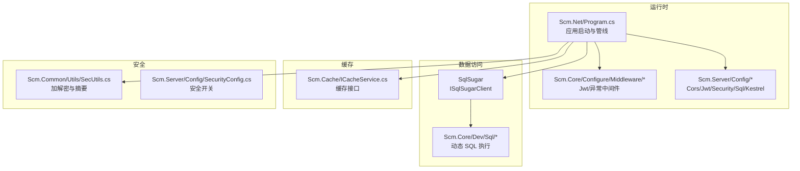

图表来源
- [Scm.Net/Program.cs:1-366](file://Scm.Net/Program.cs#L1-L366)
- [Scm.Core/Configure/Middleware/JwtMiddleware.cs:1-180](file://Scm.Core/Configure/Middleware/JwtMiddleware.cs#L1-L180)
- [Scm.Core/Configure/Middleware/ExceptionMiddleware.cs:1-41](file://Scm.Core/Configure/Middleware/ExceptionMiddleware.cs#L1-L41)
- [Scm.Server/Config/CorsConfig.cs:1-49](file://Scm.Server/Config/CorsConfig.cs#L1-L49)
- [Scm.Server/Config/SecurityConfig.cs:1-44](file://Scm.Server/Config/SecurityConfig.cs#L1-L44)
- [Scm.Server/Config/JwtConfig.cs:1-48](file://Scm.Server/Config/JwtConfig.cs#L1-L48)
- [Scm.Server/Config/SqlConfig.cs:1-23](file://Scm.Server/Config/SqlConfig.cs#L1-L23)
- [Scm.Server/Config/KestrelConfig.cs:1-24](file://Scm.Server/Config/KestrelConfig.cs#L1-L24)
- [Scm.Cache/Cache/ICacheService.cs:47-82](file://Scm.Cache/Cache/ICacheService.cs#L47-L82)
- [Scm.Common/Utils/SecUtils.cs:1-144](file://Scm.Common/Utils/SecUtils.cs#L1-L144)
- [Scm.Core/Dev/Sql/ScmDevSqlService.cs:170-280](file://Scm.Core/Dev/Sql/ScmDevSqlService.cs#L170-L280)

章节来源
- [Scm.Net/Program.cs:1-366](file://Scm.Net/Program.cs#L1-L366)

## 核心组件
- 运行时与中间件管线：负责认证授权、异常处理、跨域、静态资源、路由与控制器映射。
- 配置体系：Kestrel、Cors、Jwt、Security、Sql 等集中配置，支持开发与生产差异化。
- 数据访问：SqlSugar 初始化、仓储注册、动态 SQL 执行与分页计数。
- 缓存：统一缓存接口，支持多种过期策略。
- 安全工具：AES 加解密、MD5/SHA256 摘要等通用安全工具。

章节来源
- [Scm.Net/Program.cs:174-258](file://Scm.Net/Program.cs#L174-L258)
- [Scm.Server/Config/CorsConfig.cs:1-49](file://Scm.Server/Config/CorsConfig.cs#L1-L49)
- [Scm.Server/Config/JwtConfig.cs:1-48](file://Scm.Server/Config/JwtConfig.cs#L1-L48)
- [Scm.Server/Config/SecurityConfig.cs:1-44](file://Scm.Server/Config/SecurityConfig.cs#L1-L44)
- [Scm.Server/Config/SqlConfig.cs:1-23](file://Scm.Server/Config/SqlConfig.cs#L1-L23)
- [Scm.Cache/Cache/ICacheService.cs:47-82](file://Scm.Cache/Cache/ICacheService.cs#L47-L82)
- [Scm.Common/Utils/SecUtils.cs:1-144](file://Scm.Common/Utils/SecUtils.cs#L1-L144)

## 架构总览
下图展示请求从进入 Kestrel 到路由到控制器，期间经过中间件、认证授权、异常处理与跨域配置的整体流程。

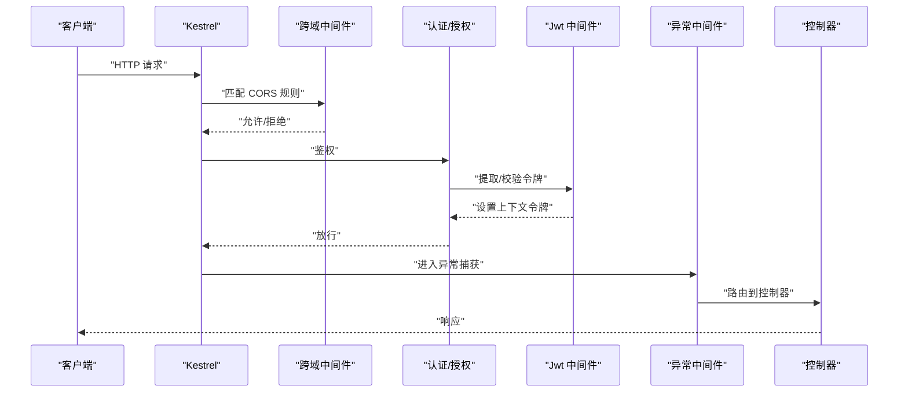

图表来源
- [Scm.Net/Program.cs:203-238](file://Scm.Net/Program.cs#L203-L238)
- [Scm.Core/Configure/Middleware/JwtMiddleware.cs:42-97](file://Scm.Core/Configure/Middleware/JwtMiddleware.cs#L42-L97)
- [Scm.Core/Configure/Middleware/ExceptionMiddleware.cs:17-39](file://Scm.Core/Configure/Middleware/ExceptionMiddleware.cs#L17-L39)
- [Scm.Server/Config/CorsConfig.cs:24-46](file://Scm.Server/Config/CorsConfig.cs#L24-L46)

## 详细组件分析

### JWT 中间件与认证流程
- 忽略路径：对特定路径（如 swagger、SignalR、上传）跳过校验。
- 支持两种令牌：网页 API 令牌与应用绑定令牌；后者进行 Base64 解码与字段解析。
- 会话续签：若令牌接近过期，返回新令牌头用于前端刷新。

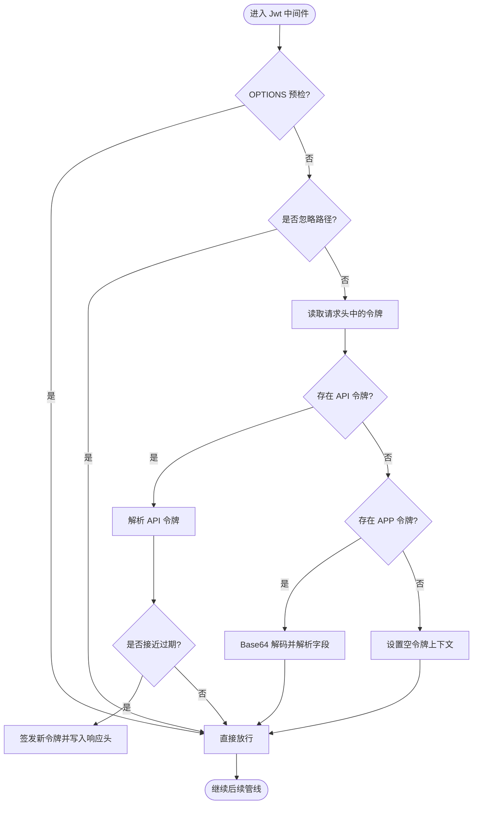

图表来源
- [Scm.Core/Configure/Middleware/JwtMiddleware.cs:42-138](file://Scm.Core/Configure/Middleware/JwtMiddleware.cs#L42-L138)

章节来源
- [Scm.Core/Configure/Middleware/JwtMiddleware.cs:1-180](file://Scm.Core/Configure/Middleware/JwtMiddleware.cs#L1-L180)

### 异常中间件与统一错误响应
- 捕获控制器与中间件抛出的异常，统一序列化为标准响应格式，避免敏感堆栈泄露。

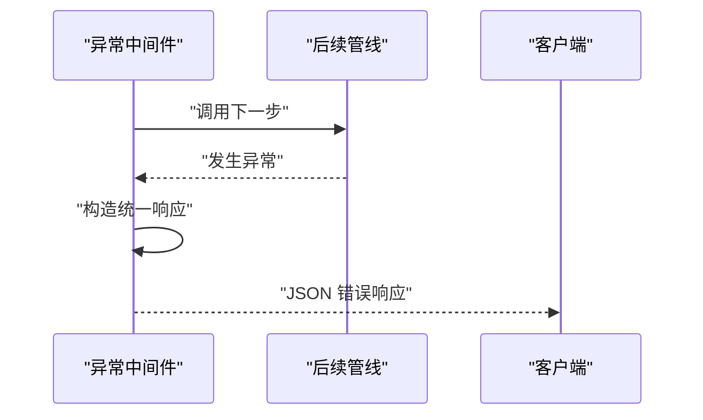

图表来源
- [Scm.Core/Configure/Middleware/ExceptionMiddleware.cs:17-39](file://Scm.Core/Configure/Middleware/ExceptionMiddleware.cs#L17-L39)

章节来源
- [Scm.Core/Configure/Middleware/ExceptionMiddleware.cs:1-41](file://Scm.Core/Configure/Middleware/ExceptionMiddleware.cs#L1-L41)

### 跨域配置与策略
- 支持全局跨域与按需启用；允许 Origin/Method/Header 自定义，支持凭据与预检缓存。

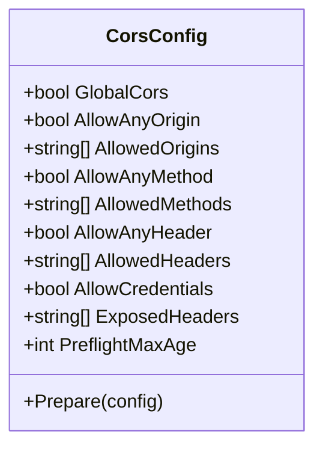

图表来源
- [Scm.Server/Config/CorsConfig.cs:1-49](file://Scm.Server/Config/CorsConfig.cs#L1-L49)

章节来源
- [Scm.Server/Config/CorsConfig.cs:1-49](file://Scm.Server/Config/CorsConfig.cs#L1-L49)

### 安全配置与密钥管理
- SecurityConfig 提供安全开关与密钥占位，便于扩展签名校验与 IP 限制。
- JwtConfig 提供 Issuer/Audience/Expires 等参数准备逻辑，确保默认值与最小有效期约束。

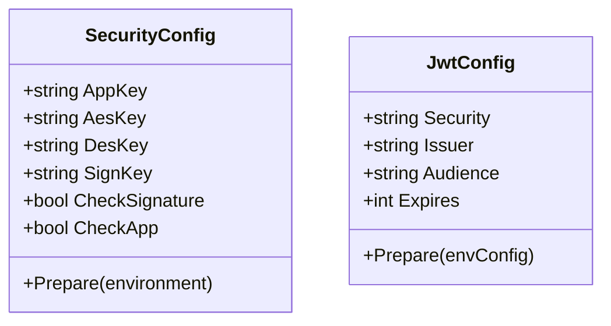

图表来源
- [Scm.Server/Config/SecurityConfig.cs:1-44](file://Scm.Server/Config/SecurityConfig.cs#L1-L44)
- [Scm.Server/Config/JwtConfig.cs:1-48](file://Scm.Server/Config/JwtConfig.cs#L1-L48)

章节来源
- [Scm.Server/Config/SecurityConfig.cs:1-44](file://Scm.Server/Config/SecurityConfig.cs#L1-L44)
- [Scm.Server/Config/JwtConfig.cs:1-48](file://Scm.Server/Config/JwtConfig.cs#L1-L48)

### 数据库配置与动态 SQL 执行
- SqlConfig 提供数据库类型与连接字符串默认值。
- 动态 SQL 执行包含分页计数、SQL 类型判断与异步执行，注意大结果集的分页与限制。

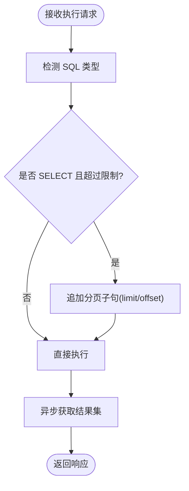

图表来源
- [Scm.Core/Dev/Sql/ScmDevSqlService.cs:207-280](file://Scm.Core/Dev/Sql/ScmDevSqlService.cs#L207-L280)

章节来源
- [Scm.Server/Config/SqlConfig.cs:1-23](file://Scm.Server/Config/SqlConfig.cs#L1-L23)
- [Scm.Core/Dev/Sql/ScmDevSqlService.cs:170-280](file://Scm.Core/Dev/Sql/ScmDevSqlService.cs#L170-L280)

### 缓存接口与策略
- ICacheService 提供多种过期策略（绝对/相对/移除），便于在服务层进行热点数据缓存与失效控制。

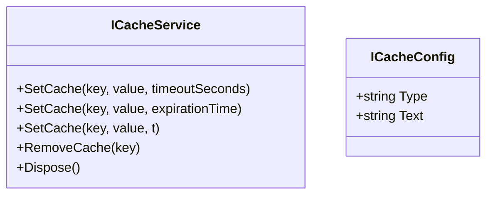

图表来源
- [Scm.Cache/Cache/ICacheService.cs:47-82](file://Scm.Cache/Cache/ICacheService.cs#L47-L82)
- [Scm.Cache/Cache/ICacheConfig.cs:1-8](file://Scm.Cache/Cache/ICacheConfig.cs#L1-L8)

章节来源
- [Scm.Cache/Cache/ICacheService.cs:47-82](file://Scm.Cache/Cache/ICacheService.cs#L47-L82)
- [Scm.Cache/Cache/ICacheConfig.cs:1-8](file://Scm.Cache/Cache/ICacheConfig.cs#L1-L8)

### 安全工具与业务异常
- SecUtils 提供 AES 加解密与 MD5/SHA256 摘要，可用于敏感数据与签名场景。
- BusinessException 作为业务异常基类，便于统一捕获与处理。

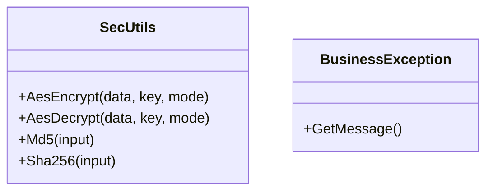

图表来源
- [Scm.Common/Utils/SecUtils.cs:1-144](file://Scm.Common/Utils/SecUtils.cs#L1-L144)
- [Scm.Common/Exceptions/BusinessException.cs:1-22](file://Scm.Common/Exceptions/BusinessException.cs#L1-L22)

章节来源
- [Scm.Common/Utils/SecUtils.cs:1-144](file://Scm.Common/Utils/SecUtils.cs#L1-L144)
- [Scm.Common/Exceptions/BusinessException.cs:1-22](file://Scm.Common/Exceptions/BusinessException.cs#L1-L22)

### 安全设置与系统安全策略
- ScmSysSafetyService 通过缓存读取/保存系统安全设置，便于集中管理安全策略。

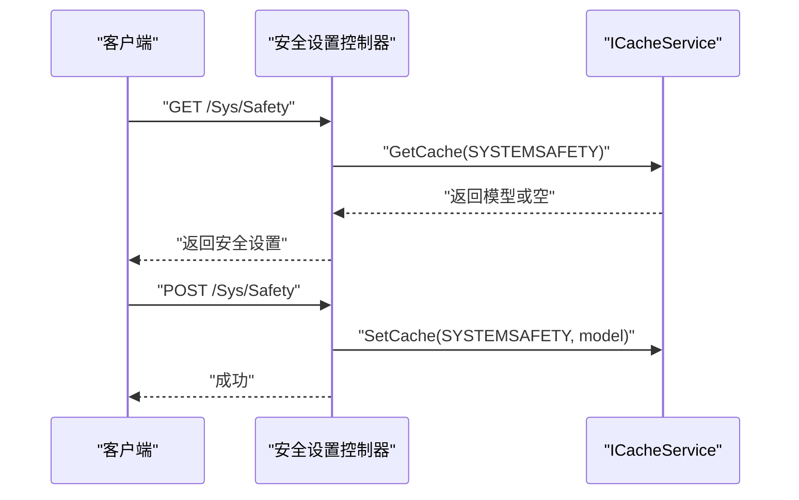

图表来源
- [Scm.Core/Sys/Safety/ScmSysSafetyService.cs:28-42](file://Scm.Core/Sys/Safety/ScmSysSafetyService.cs#L28-L42)

章节来源
- [Scm.Core/Sys/Safety/ScmSysSafetyService.cs:1-43](file://Scm.Core/Sys/Safety/ScmSysSafetyService.cs#L1-L43)

## 依赖关系分析
- 运行时依赖：Program.cs 注入配置、中间件、服务注册与管线装配。
- 中间件依赖：JwtMiddleware 依赖 Jwt 工具与上下文持有者；ExceptionMiddleware 统一异常处理。
- 配置依赖：各 Config 类 Prepare 方法确保默认值与最小约束。
- 数据访问依赖：SqlSugar 初始化与仓储注册，动态 SQL 服务依赖连接对象。
- 缓存依赖：服务层通过 ICacheService 抽象访问缓存实现。
- 安全依赖：SecurityConfig 与 SecUtils 提供安全能力扩展点。

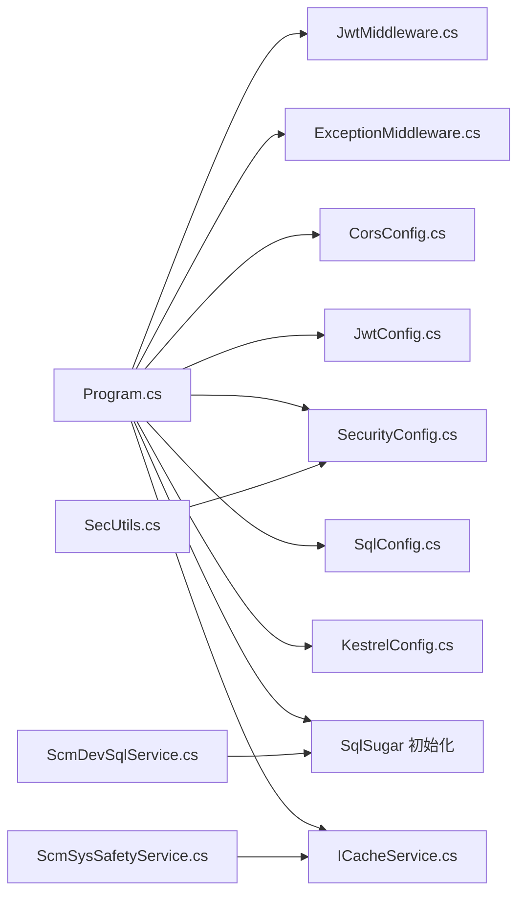

图表来源
- [Scm.Net/Program.cs:174-258](file://Scm.Net/Program.cs#L174-L258)
- [Scm.Core/Configure/Middleware/JwtMiddleware.cs:1-180](file://Scm.Core/Configure/Middleware/JwtMiddleware.cs#L1-L180)
- [Scm.Core/Configure/Middleware/ExceptionMiddleware.cs:1-41](file://Scm.Core/Configure/Middleware/ExceptionMiddleware.cs#L1-L41)
- [Scm.Server/Config/CorsConfig.cs:1-49](file://Scm.Server/Config/CorsConfig.cs#L1-L49)
- [Scm.Server/Config/JwtConfig.cs:1-48](file://Scm.Server/Config/JwtConfig.cs#L1-L48)
- [Scm.Server/Config/SecurityConfig.cs:1-44](file://Scm.Server/Config/SecurityConfig.cs#L1-L44)
- [Scm.Server/Config/SqlConfig.cs:1-23](file://Scm.Server/Config/SqlConfig.cs#L1-L23)
- [Scm.Server/Config/KestrelConfig.cs:1-24](file://Scm.Server/Config/KestrelConfig.cs#L1-L24)
- [Scm.Cache/Cache/ICacheService.cs:47-82](file://Scm.Cache/Cache/ICacheService.cs#L47-L82)
- [Scm.Common/Utils/SecUtils.cs:1-144](file://Scm.Common/Utils/SecUtils.cs#L1-L144)
- [Scm.Core/Dev/Sql/ScmDevSqlService.cs:170-280](file://Scm.Core/Dev/Sql/ScmDevSqlService.cs#L170-L280)
- [Scm.Core/Sys/Safety/ScmSysSafetyService.cs:1-43](file://Scm.Core/Sys/Safety/ScmSysSafetyService.cs#L1-L43)

## 性能考虑

### 数据库查询优化
- 分页与计数：动态 SQL 在大数据量时应优先计算总数并限制分页范围，避免全表扫描。
- 参数化与索引：确保查询条件走索引，避免隐式转换与函数包裹导致的索引失效。
- 连接池与生命周期：SqlSugar 默认自动关闭连接，注意长事务与批量操作的连接复用。

章节来源
- [Scm.Core/Dev/Sql/ScmDevSqlService.cs:207-280](file://Scm.Core/Dev/Sql/ScmDevSqlService.cs#L207-L280)

### 缓存策略
- 热点数据缓存：对高频读取的配置、字典、菜单等使用 ICacheService 设置合理过期时间。
- 缓存穿透与雪崩：对空值与冷键设置短 TTL 并引入互斥锁；对批量失效设置随机偏移。
- 缓存更新：采用写后失效或写时更新策略，保证一致性与性能平衡。

章节来源
- [Scm.Cache/Cache/ICacheService.cs:47-82](file://Scm.Cache/Cache/ICacheService.cs#L47-L82)

### 异步编程最佳实践
- I/O 密集：数据库与文件操作使用异步 API（如 GetDataTableAsync、异步文件读写）。
- 控制并发：限制并发度与超时，避免线程饥饿与资源争用。
- 取消令牌：对外部调用与长任务传入取消令牌，及时响应取消请求。

章节来源
- [Scm.Core/Dev/Sql/ScmDevSqlService.cs:263-266](file://Scm.Core/Dev/Sql/ScmDevSqlService.cs#L263-L266)

### 内存使用优化
- 对象池与复用：对频繁创建的对象（如缓冲区、StringBuilder）进行池化。
- 流式处理：大文件与大结果集采用流式读取与分块处理，降低峰值内存占用。
- 及时释放：实现 IDisposable 的资源在 finally 或 using 中释放。

章节来源
- [Scm.Net/Program.cs:352-356](file://Scm.Net/Program.cs#L352-L356)

### Kestrel 与网络性能
- 连接限制：根据服务器资源设置 MaxConcurrentConnections 与请求体大小上限。
- 端口与协议：生产环境启用 HTTPS，避免明文传输。

章节来源
- [Scm.Net/appsettings.json:34-37](file://Scm.Net/appsettings.json#L34-L37)
- [Scm.Net/appsettings.Development.json:34-37](file://Scm.Net/appsettings.Development.json#L34-L37)
- [Scm.Net/Program.cs:240-254](file://Scm.Net/Program.cs#L240-L254)

### 性能监控与分析
- 指标采集：结合日志与埋点统计请求耗时、错误率、缓存命中率、数据库慢查询。
- 瓶颈定位：利用分布式追踪与火焰图定位 CPU/内存/GC 瓶颈。
- 压力测试：对关键接口进行并发与容量测试，评估最大吞吐与稳定性。

[本节为通用指导，无需具体文件引用]

## 故障排查指南

### 异常处理与日志
- 使用 ExceptionMiddleware 统一捕获异常，避免内部错误细节泄露。
- 日志级别：开发环境使用 Debug，生产使用 Information，并输出到控制台与文件。

章节来源
- [Scm.Core/Configure/Middleware/ExceptionMiddleware.cs:17-39](file://Scm.Core/Configure/Middleware/ExceptionMiddleware.cs#L17-L39)
- [Scm.Net/appsettings.json:5-24](file://Scm.Net/appsettings.json#L5-L24)
- [Scm.Net/appsettings.Development.json:5-24](file://Scm.Net/appsettings.Development.json#L5-L24)

### 跨域问题
- 确认 AllowedOrigins/Methods/Headers 与前端一致；预检缓存时间是否过短。
- 开启 AllowCredentials 时，Origin 不能为通配符。

章节来源
- [Scm.Server/Config/CorsConfig.cs:24-46](file://Scm.Server/Config/CorsConfig.cs#L24-L46)
- [Scm.Net/Program.cs:207-217](file://Scm.Net/Program.cs#L207-L217)

### JWT 与认证
- 检查请求头中令牌命名与前缀是否正确；确认 Issuer/Audience/Expires 配置。
- 对 OPTIONS 预检请求放行，避免跨域预检失败。

章节来源
- [Scm.Core/Configure/Middleware/JwtMiddleware.cs:10-40](file://Scm.Core/Configure/Middleware/JwtMiddleware.cs#L10-L40)
- [Scm.Server/Config/JwtConfig.cs:28-47](file://Scm.Server/Config/JwtConfig.cs#L28-L47)

### 数据库初始化与连接
- 确认 SqlConfig 的 Type 与 Text，默认值与实际路径一致。
- 初始化过程中出现异常，检查数据库文件权限与路径。

章节来源
- [Scm.Server/Config/SqlConfig.cs:10-20](file://Scm.Server/Config/SqlConfig.cs#L10-L20)
- [Scm.Net/Controllers/DbController.cs:251-274](file://Scm.Net/Controllers/DbController.cs#L251-L274)

### 安全设置与密钥
- SecurityConfig 的密钥与签名开关留待业务扩展；确保生产环境密钥不为空。
- 使用 SecUtils 进行必要加解密与摘要时，注意密钥长度与模式选择。

章节来源
- [Scm.Server/Config/SecurityConfig.cs:12-37](file://Scm.Server/Config/SecurityConfig.cs#L12-L37)
- [Scm.Common/Utils/SecUtils.cs:23-89](file://Scm.Common/Utils/SecUtils.cs#L23-L89)

### 网络与代理
- HbController 中的 IP 获取逻辑考虑了代理头，部署在反向代理后端时需确保代理正确透传客户端真实 IP。

章节来源
- [Scm.Net/Controllers/HbController.cs:116-127](file://Scm.Net/Controllers/HbController.cs#L116-L127)

## 结论
本指南基于 Scm.Net 现有配置与中间件，总结了性能优化与安全编码的关键实践：以配置为中心的可调优性、以中间件为核心的可观测性、以缓存与异步提升吞吐、以安全工具与策略保障数据与通信安全。建议在生产环境中进一步完善 HTTPS、CORS 最小暴露面、JWT 安全参数、数据库索引与分页策略、缓存一致性与失效策略，并建立完善的监控与应急响应机制。

## 附录

### HTTPS 与安全头配置要点
- HTTPS：生产环境必须启用 HTTPS，避免明文传输。
- 安全头：建议设置 HSTS、CSP、X-Content-Type-Options、X-Frame-Options 等。
- CORS：仅允许必要的 Origin/Method/Headers，避免通配符与凭据混用。

章节来源
- [Scm.Net/Program.cs:183-183](file://Scm.Net/Program.cs#L183-L183)
- [Scm.Server/Config/CorsConfig.cs:24-46](file://Scm.Server/Config/CorsConfig.cs#L24-L46)

### CSRF 保护建议
- 使用 SameSite Cookie 与 Anti-Forgery Token。
- 对关键写操作启用令牌校验，避免 GET 产生副作用。

[本节为通用指导，无需具体文件引用]

### 安全审计与漏洞评估
- 代码扫描：定期对第三方依赖进行漏洞扫描与升级。
- 依赖检查：锁定关键依赖版本，关注 CVE 与安全公告。
- 渗透测试：对核心接口与认证流程进行渗透测试。

[本节为通用指导，无需具体文件引用]

### 应急响应流程
- 快速隔离：发现异常立即降级或熔断，阻断风险扩散。
- 证据保全：保留日志、请求与响应样本，便于溯源。
- 修复与回滚：快速修复并回滚到稳定版本，发布补丁。
- 复盘与改进：复盘事件原因，完善监控与告警。

[本节为通用指导，无需具体文件引用]