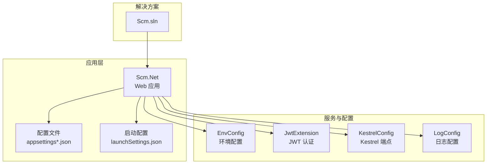
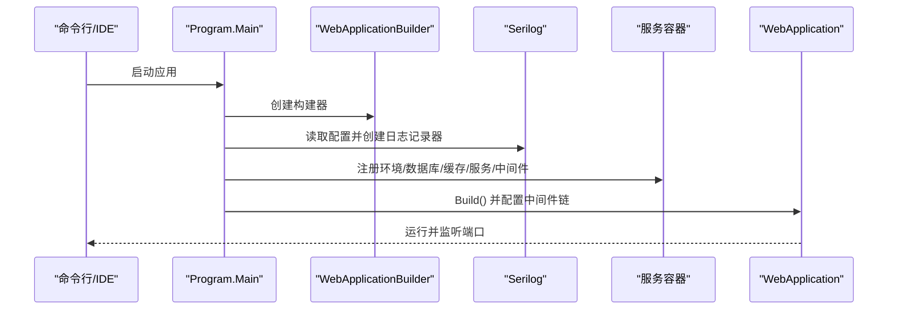
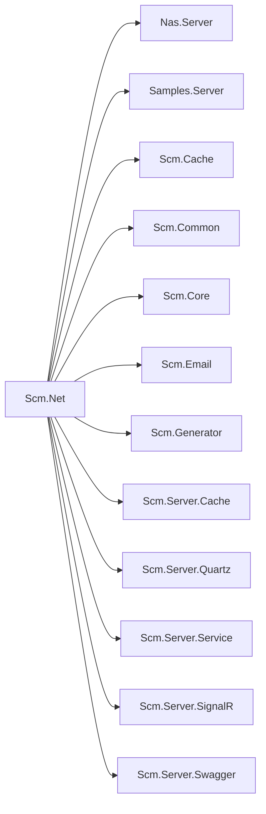

# 构建与调试

<cite>
**本文引用的文件**
- [Scm.Net.csproj](file://Scm.Net/Scm.Net.csproj)
- [appsettings.json](file://Scm.Net/appsettings.json)
- [appsettings.Development.json](file://Scm.Net/appsettings.Development.json)
- [launchSettings.json](file://Scm.Net/Properties/launchSettings.json)
- [Program.cs](file://Scm.Net/Program.cs)
- [EnvConfig.cs](file://Scm.Server/Config/EnvConfig.cs)
- [KestrelConfig.cs](file://Scm.Server/Config/KestrelConfig.cs)
- [LogConfig.cs](file://Scm.Server/Config/LogConfig.cs)
- [JwtExtension.cs](file://Scm.Server/Extensions/JwtExtension.cs)
- [Scm.sln](file://Scm.sln)
</cite>

## 目录
1. [简介](#简介)
2. [项目结构](#项目结构)
3. [核心组件](#核心组件)
4. [架构总览](#架构总览)
5. [详细组件分析](#详细组件分析)
6. [依赖关系分析](#依赖关系分析)
7. [性能考量](#性能考量)
8. [故障排查指南](#故障排查指南)
9. [结论](#结论)
10. [附录](#附录)

## 简介
本指南面向 Scm.Net 项目的构建与调试，覆盖命令行构建、IDE 内置构建、以及基于 .NET SDK 的 CI/CD 流程；同时提供调试配置（启动配置、断点、变量监视、调用堆栈）、多环境配置管理（开发/测试/生产）、日志配置与输出（Serilog）、性能分析工具使用建议，以及常见构建问题的诊断与解决方法。

## 项目结构
Scm.Net 采用多项目解决方案，核心 Web 应用位于 Scm.Net，其他模块通过项目引用集成。关键构建与运行配置集中在应用项目文件、配置文件与启动入口中。

图表来源
- [Scm.sln:1-341](file://Scm.sln#L1-L341)
- [Scm.Net.csproj:1-86](file://Scm.Net/Scm.Net.csproj#L1-L86)
- [appsettings.json:1-127](file://Scm.Net/appsettings.json#L1-L127)
- [appsettings.Development.json:1-162](file://Scm.Net/appsettings.Development.json#L1-L162)
- [launchSettings.json:1-31](file://Scm.Net/Properties/launchSettings.json#L1-L31)
- [Program.cs:1-366](file://Scm.Net/Program.cs#L1-L366)
- [EnvConfig.cs:1-280](file://Scm.Server/Config/EnvConfig.cs#L1-L280)
- [JwtExtension.cs:1-73](file://Scm.Server/Extensions/JwtExtension.cs#L1-L73)
- [KestrelConfig.cs:1-24](file://Scm.Server/Config/KestrelConfig.cs#L1-L24)
- [LogConfig.cs:1-8](file://Scm.Server/Config/LogConfig.cs#L1-L8)

章节来源
- [Scm.sln:1-341](file://Scm.sln#L1-L341)
- [Scm.Net.csproj:1-86](file://Scm.Net/Scm.Net.csproj#L1-L86)

## 核心组件
- 应用项目与包依赖：应用项目声明 .NET 10 目标框架、启用隐式 using、禁用可空引用，并引入 Serilog 系列包与图像处理库，同时通过项目引用集成多个子模块。
- 配置体系：通过 appsettings.json 与 appsettings.Development.json 提供环境化配置，支持 Serilog、Kestrel、Env、Sql、Uid、Cache、Quartz、Jwt、Security、Cors 等模块配置。
- 启动入口：Program.cs 负责构建 WebApplicationBuilder、读取配置、初始化 Serilog、注册服务与中间件、配置路由与静态文件、启用 Swagger（开发环境）并运行应用。
- 环境配置：EnvConfig 统一管理数据、日志、上传、图片、头像、字体等目录路径，支持相对/绝对路径与 URI 映射。
- 认证与授权：JwtExtension 基于配置注册 JWT Bearer 认证与授权策略。
- Kestrel 端点：KestrelConfig 定义 HTTP 端点 URL，Program.cs 在开发环境会替换通配符并输出访问提示。

章节来源
- [Scm.Net.csproj:1-86](file://Scm.Net/Scm.Net.csproj#L1-L86)
- [appsettings.json:1-127](file://Scm.Net/appsettings.json#L1-L127)
- [appsettings.Development.json:1-162](file://Scm.Net/appsettings.Development.json#L1-L162)
- [Program.cs:1-366](file://Scm.Net/Program.cs#L1-L366)
- [EnvConfig.cs:1-280](file://Scm.Server/Config/EnvConfig.cs#L1-L280)
- [JwtExtension.cs:1-73](file://Scm.Server/Extensions/JwtExtension.cs#L1-L73)
- [KestrelConfig.cs:1-24](file://Scm.Server/Config/KestrelConfig.cs#L1-L24)

## 架构总览
下图展示从启动到请求处理的关键流程与配置交互：

图表来源
- [Program.cs:31-258](file://Scm.Net/Program.cs#L31-L258)
- [appsettings.json:3-25](file://Scm.Net/appsettings.json#L3-L25)
- [appsettings.Development.json:3-25](file://Scm.Net/appsettings.Development.json#L3-L25)

## 详细组件分析

### 构建流程与命令行构建
- 目标框架与特性：应用目标 .NET 10，启用隐式 using，禁用可空引用，便于快速开发与统一风格。
- 包依赖：Serilog 生态（Console、File、Async、Settings.Configuration）用于日志输出与配置驱动；图像处理库用于图片与字体相关能力。
- 项目引用：通过项目引用集成 Nas.Server、Samples.Server、Scm.Cache、Scm.Common、Scm.Core、Scm.Email、Scm.Generator、Scm.Server.Cache、Scm.Server.Quartz、Scm.Server.Service、Scm.Server.SignalR、Scm.Server.Swagger 等模块。
- 本地构建建议：
  - 使用 dotnet build 或 dotnet run 在 Scm.Net 目录执行。
  - 使用 Visual Studio 打开解决方案，选择 Scm.Net 作为启动项目进行调试。
  - 如需发布，可在 Scm.Net 目录执行 dotnet publish，结合发布配置文件进行部署准备。

章节来源
- [Scm.Net.csproj:1-86](file://Scm.Net/Scm.Net.csproj#L1-L86)
- [Scm.sln:1-341](file://Scm.sln#L1-L341)

### IDE 内置构建与调试
- 启动配置：launchSettings.json 设置了两个配置文件，均将 ASPNETCORE_ENVIRONMENT 设为 Development，并指定启动浏览器与 Swagger 页面。
- 端口与 URL：开发环境默认使用 https://localhost:5000，IIS Express 使用 sslPort 44306。
- 环境变量：通过环境变量切换配置文件，实现开发/测试/生产的差异化加载。

章节来源
- [launchSettings.json:1-31](file://Scm.Net/Properties/launchSettings.json#L1-L31)

### CI/CD 构建（基于 .NET SDK）
- 通用流程：在 CI 环境中，通常执行 dotnet restore、dotnet build（或 dotnet test）、dotnet publish 等步骤；结合 appsettings.*.json 实现不同环境的配置注入。
- 本仓库未包含 GitHub Actions 工作流文件，建议在 .github/workflows 下新增工作流，按以下要点组织：
  - 触发条件：push 到主分支、PR 等。
  - 步骤：安装 .NET SDK、还原依赖、构建、单元测试、打包发布。
  - 环境配置：通过 secrets 和环境变量注入敏感配置，避免硬编码。

章节来源
- [Scm.Net.csproj:1-86](file://Scm.Net/Scm.Net.csproj#L1-L86)
- [appsettings.json:1-127](file://Scm.Net/appsettings.json#L1-L127)
- [appsettings.Development.json:1-162](file://Scm.Net/appsettings.Development.json#L1-L162)

### 调试配置与断点设置
- 启动配置：在 Visual Studio 中，确保 Scm.Net 为启动项目，运行配置选择“Scm.Net”或“IIS Express”，以便自动打开 Swagger 并加载 Development 配置。
- 断点位置建议：
  - Program.cs 的 Main 入口处，观察配置加载与服务注册顺序。
  - 中间件链关键节点（如 UseRouting、UseAuthentication、UseAuthorization、异常中间件）前后，检查请求上下文与鉴权状态。
  - 业务服务注册处（如 AddScoped、AddSingleton），确认依赖注入是否正确。
- 变量监视：关注 Configuration、Services、App、EnvConfig、JwtConfig、KestrelConfig 等对象的值，验证路径、端口、最小日志级别等。
- 调用堆栈：在异常断点或自定义异常中间件处，查看堆栈以定位问题来源。

章节来源
- [Program.cs:1-366](file://Scm.Net/Program.cs#L1-L366)
- [launchSettings.json:1-31](file://Scm.Net/Properties/launchSettings.json#L1-L31)

### 多环境配置管理
- 环境切换：通过 ASPNETCORE_ENVIRONMENT 指定环境，系统会优先加载 appsettings.<Environment>.json。
- 关键配置项：
  - Serilog：控制最小日志级别、输出模板、滚动策略与输出目标（控制台/文件）。
  - Kestrel：定义 HTTP 端点 URL 与连接限制。
  - Env：数据目录、上传/图片/日志/字体等路径与 URI 映射。
  - Sql/UId/Cache/Quartz/Jwt/Security/Cors：各模块的连接字符串、类型与行为配置。
- 开发环境差异：Development 配置通常提高日志级别、调整端口、开启 CORS 与 Swagger，并提供 OIDC/Otp/Email 等示例配置。

章节来源
- [appsettings.json:1-127](file://Scm.Net/appsettings.json#L1-L127)
- [appsettings.Development.json:1-162](file://Scm.Net/appsettings.Development.json#L1-L162)
- [EnvConfig.cs:1-280](file://Scm.Server/Config/EnvConfig.cs#L1-L280)
- [KestrelConfig.cs:1-24](file://Scm.Server/Config/KestrelConfig.cs#L1-L24)

### 日志配置与输出（Serilog）
- 配置来源：Serilog 通过 appsettings.json 与 appsettings.Development.json 的 Serilog 节点进行配置，支持 Console 与 File 输出，并设置最小日志级别。
- 运行时初始化：Program.cs 中使用 ReadFrom.Configuration 将配置注入 Serilog，随后通过 LogUtils（若使用）或 Serilog API 记录日志。
- 日志文件管理：File 输出采用按天滚动策略，路径由配置决定；EnvConfig 提供统一的数据目录与路径拼接能力，便于集中管理日志与数据文件。

章节来源
- [appsettings.json:3-25](file://Scm.Net/appsettings.json#L3-L25)
- [appsettings.Development.json:3-25](file://Scm.Net/appsettings.Development.json#L3-L25)
- [Program.cs:37-40](file://Scm.Net/Program.cs#L37-L40)
- [EnvConfig.cs:122-177](file://Scm.Server/Config/EnvConfig.cs#L122-L177)

### 性能分析工具使用建议
- 内存分析：使用 .NET 内置的性能计数器与 Visual Studio 性能探查器，关注 GC 压力、分配热点与长尾请求。
- CPU/线程分析：在高并发场景下，结合 Kestrel 连接限制与中间件链路，定位阻塞与锁竞争。
- I/O 与数据库：关注 SqlSugar 的 OnLogExecuting 事件与 SQL 执行细节，结合数据库连接池与事务边界优化。
- 建议实践：
  - 在 Development 环境开启更详细的日志与中间件链路追踪。
  - 对关键服务（如图片处理、文件上传、定时任务）单独打点与采样。
  - 结合 Kestrel Limits 与系统资源监控，评估并发上限与资源瓶颈。

章节来源
- [appsettings.json:26-38](file://Scm.Net/appsettings.json#L26-L38)
- [Program.cs:326-335](file://Scm.Net/Program.cs#L326-L335)

## 依赖关系分析
应用项目对模块的依赖关系如下：

图表来源
- [Scm.Net.csproj:36-49](file://Scm.Net/Scm.Net.csproj#L36-L49)

章节来源
- [Scm.Net.csproj:1-86](file://Scm.Net/Scm.Net.csproj#L1-L86)

## 性能考量
- Kestrel 连接限制：根据并发与资源情况调整 MaxConcurrentConnections 与请求体大小限制，避免过载。
- 日志吞吐：Serilog File 采用异步写入，但大量高频日志仍可能造成 I/O 压力，建议在生产环境适度降低日志级别或拆分输出通道。
- 数据库与 ORM：SqlSugar 的实体映射与 OnLogExecuting 事件可用于诊断慢查询与类型转换成本，结合连接池大小与事务边界优化。
- 图像处理：图像与字体加载在启动阶段完成，确保字体目录与默认字体配置正确，避免运行时额外开销。

章节来源
- [appsettings.json:26-38](file://Scm.Net/appsettings.json#L26-L38)
- [Program.cs:358-364](file://Scm.Net/Program.cs#L358-L364)

## 故障排查指南
- 启动失败（端口占用）
  - 现象：应用无法绑定到指定端口。
  - 排查：检查 Kestrel 配置中的 Url 是否被占用；在 Program.cs 中确认端口替换逻辑与输出信息。
  - 参考：KestrelConfig、Program.cs 中的端口输出与替换逻辑。
- 静态资源无法访问
  - 现象：上传/图片/字体等资源返回 404。
  - 排查：确认 EnvConfig 的 DataDir、DataUri 与实际目录映射；检查 UseFileServer 与自定义映射配置。
  - 参考：EnvConfig 的路径拼接与 URI 映射方法。
- 认证失败
  - 现象：请求返回 401/403。
  - 排查：核对 JwtConfig 的 Issuer、Audience、Security 与 TokenValidationParameters；检查中间件顺序与授权策略。
  - 参考：JwtExtension 的认证与授权配置。
- 日志无输出或路径错误
  - 现象：控制台无日志或日志文件未生成。
  - 排查：确认 Serilog 配置的 WriteTo 与最小级别；检查 EnvConfig 的日志目录路径与权限。
  - 参考：appsettings.json 的 Serilog 节点与 EnvConfig 的日志路径拼接。
- 跨域问题
  - 现象：前端请求被拦截。
  - 排查：检查 Cors 配置与全局开关；确认允许的 Origin/Method/Header 与 Credentials。
  - 参考：appsettings.json 的 Cors 节点与 Program.cs 中的跨域中间件启用逻辑。

章节来源
- [KestrelConfig.cs:1-24](file://Scm.Server/Config/KestrelConfig.cs#L1-L24)
- [Program.cs:240-254](file://Scm.Net/Program.cs#L240-L254)
- [EnvConfig.cs:122-177](file://Scm.Server/Config/EnvConfig.cs#L122-L177)
- [JwtExtension.cs:14-71](file://Scm.Server/Extensions/JwtExtension.cs#L14-L71)
- [appsettings.json:115-126](file://Scm.Net/appsettings.json#L115-L126)

## 结论
Scm.Net 的构建与调试围绕 .NET 10 与 ASP.NET Core 6+ 展开，通过清晰的配置体系与模块化项目结构实现可维护与可扩展的后端服务。建议在开发环境充分利用 Serilog 与 Swagger，在 CI/CD 中通过 appsettings.*.json 实现环境隔离，并结合性能分析工具持续优化关键路径与资源使用。

## 附录
- 常用命令
  - dotnet build：构建项目
  - dotnet run：运行应用（受 launchSettings.json 影响）
  - dotnet publish：发布应用
- 关键配置参考
  - Serilog：控制台与文件输出、最小级别、滚动策略
  - Kestrel：HTTP 端点与连接限制
  - Env：数据/日志/上传/图片/字体目录与 URI 映射
  - Jwt：签发者、受众、密钥与生命周期验证
  - Cors：全局开关与允许的 Origin/Method/Header/Credentials