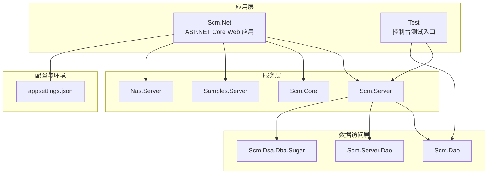
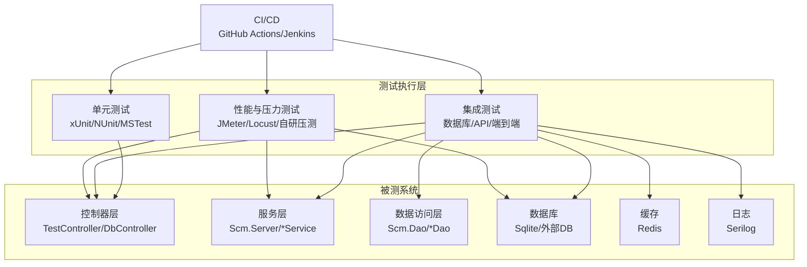
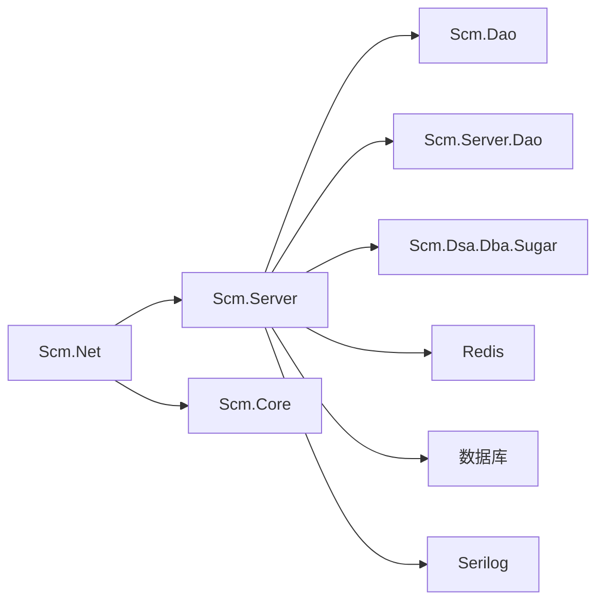

# 测试策略与实践

<cite>
**本文引用的文件**
- [Scm.Net.csproj](file://Scm.Net/Scm.Net.csproj)
- [Test.csproj](file://Test/Test.csproj)
- [Program.cs](file://Test/Program.cs)
- [DbController.cs](file://Scm.Net/Controllers/DbController.cs)
- [TestController.cs](file://Scm.Net/Controllers/TestController.cs)
- [appsettings.json](file://Scm.Net/appsettings.json)
- [ScmTestDao.cs](file://Scm.Dao/ScmTestDao.cs)
- [ILogService.cs](file://Scm.Server/ILogService.cs)
- [UnitOfWorkFilter.cs](file://Scm.Dsa.Dba.Sugar/Dsa/Dba/Sugar/UnitOfWork/Filters/UnitOfWorkFilter.cs)
</cite>

## 目录
1. [引言](#引言)
2. [项目结构](#项目结构)
3. [核心组件](#核心组件)
4. [架构总览](#架构总览)
5. [详细组件分析](#详细组件分析)
6. [依赖关系分析](#依赖关系分析)
7. [性能考量](#性能考量)
8. [故障排查指南](#故障排查指南)
9. [结论](#结论)
10. [附录](#附录)

## 引言
本指南面向 Scm.Net 项目的测试策略与实践，目标是帮助团队建立从单元测试到集成测试、再到端到端测试与性能测试的完整体系，并在持续集成中落地自动化测试与覆盖率度量。内容涵盖：
- 单元测试的设计原则、Mock 使用、测试数据准备与清理
- 集成测试策略：数据库测试、API 测试、端到端测试
- 测试框架选择与配置建议（xUnit、NUnit、MSTest）
- 覆盖率测量与报告生成
- 自动化测试在 CI 中的执行、结果分析与反馈
- 性能与压力测试方法及工具使用

## 项目结构
Scm.Net 采用多项目解决方案，核心后端应用位于 Scm.Net，测试相关能力分布在以下位置：
- 应用层：Scm.Net（ASP.NET Core Web 应用）
- 测试入口：Test（独立控制台应用，用于快速验证与演示）
- 数据访问层：Scm.Dao、Scm.Server.Dao、Scm.Dsa.Dba.Sugar
- 服务层：Scm.Server、Scm.Core、Samples.Server
- 配置与环境：Scm.Net/appsettings.json 提供数据库、缓存、日志等配置

图表来源
- [Scm.Net.csproj:36-49](file://Scm.Net/Scm.Net.csproj#L36-L49)
- [Test.csproj:16-20](file://Test/Test.csproj#L16-L20)
- [appsettings.json:48-60](file://Scm.Net/appsettings.json#L48-L60)

章节来源
- [Scm.Net.csproj:36-49](file://Scm.Net/Scm.Net.csproj#L36-L49)
- [Test.csproj:16-20](file://Test/Test.csproj#L16-L20)
- [appsettings.json:48-60](file://Scm.Net/appsettings.json#L48-L60)

## 核心组件
- 控制器与 API 表面：TestController 提供简单接口用于验证令牌与终端信息；DbController 提供数据库初始化与销毁接口，便于测试环境准备与清理。
- 数据模型与 DAO：ScmTestDao 作为测试表映射示例，展示实体属性与约束定义。
- 日志与审计：ILogService 定义了日志记录的关键字段，可用于测试断言与回归验证。
- 事务与工作单元：UnitOfWorkFilter 基于特性标记自动开启/提交/回滚事务，确保测试隔离与一致性。

章节来源
- [TestController.cs:19-39](file://Scm.Net/Controllers/TestController.cs#L19-L39)
- [DbController.cs:215-274](file://Scm.Net/Controllers/DbController.cs#L215-L274)
- [ScmTestDao.cs:7-23](file://Scm.Dao/ScmTestDao.cs#L7-L23)
- [ILogService.cs:54-111](file://Scm.Server/ILogService.cs#L54-L111)
- [UnitOfWorkFilter.cs:30-41](file://Scm.Dsa.Dba.Sugar/Dsa/Dba/Sugar/UnitOfWork/Filters/UnitOfWorkFilter.cs#L30-L41)

## 架构总览
下图展示了测试策略在系统中的位置与交互：

图表来源
- [TestController.cs:19-39](file://Scm.Net/Controllers/TestController.cs#L19-L39)
- [DbController.cs:215-274](file://Scm.Net/Controllers/DbController.cs#L215-L274)
- [appsettings.json:48-60](file://Scm.Net/appsettings.json#L48-L60)

## 详细组件分析

### 单元测试策略
- 设计原则
  - 每个测试聚焦单一行为，使用 AAA（Arrange-Act-Assert）模式
  - 使用最小依赖与高内聚，避免跨模块耦合
  - 优先断言业务语义而非实现细节
- Mock 对象
  - 使用 Moq 或 NSubstitute 替换外部依赖（如数据库连接、缓存、HTTP 客户端）
  - 对服务层接口进行接口隔离，仅对必要方法进行模拟
- 测试数据准备与清理
  - 使用工厂类或构建器生成 DTO/实体对象
  - 在测试前插入最小化数据集，在测试后删除或回滚
  - 对于事务性 DAO，结合工作单元特性确保测试隔离
- 示例路径
  - 控制器行为验证：参考 [TestController.cs:19-39](file://Scm.Net/Controllers/TestController.cs#L19-L39)
  - 工作单元过滤器：参考 [UnitOfWorkFilter.cs:30-41](file://Scm.Dsa.Dba.Sugar/Dsa/Dba/Sugar/UnitOfWork/Filters/UnitOfWorkFilter.cs#L30-L41)

章节来源
- [TestController.cs:19-39](file://Scm.Net/Controllers/TestController.cs#L19-L39)
- [UnitOfWorkFilter.cs:30-41](file://Scm.Dsa.Dba.Sugar/Dsa/Dba/Sugar/UnitOfWork/Filters/UnitOfWorkFilter.cs#L30-L41)

### 集成测试策略
- 数据库测试
  - 利用 DbController 的初始化与销毁接口准备/清理测试数据库
  - 使用 Sqlite 进行本地快速测试，外部数据库用于关键场景
  - 参考：[DbController.cs:215-274](file://Scm.Net/Controllers/DbController.cs#L215-L274)
- API 测试
  - 使用 ASP.NET Core TestHost 或 WebApplicationFactory 启动应用，构造 HttpClient 发起请求
  - 验证响应状态码、响应体结构与令牌解析逻辑
  - 参考：[TestController.cs:19-39](file://Scm.Net/Controllers/TestController.cs#L19-L39)
- 端到端测试
  - 结合前端或 Postman/Newman，覆盖用户登录、资源上传下载、消息推送等主流程
  - 使用 Serilog 输出日志，便于定位问题
  - 参考：[appsettings.json:3-25](file://Scm.Net/appsettings.json#L3-L25)

章节来源
- [DbController.cs:215-274](file://Scm.Net/Controllers/DbController.cs#L215-L274)
- [TestController.cs:19-39](file://Scm.Net/Controllers/TestController.cs#L19-L39)
- [appsettings.json:3-25](file://Scm.Net/appsettings.json#L3-L25)

### 测试数据模型与日志
- 测试数据模型
  - ScmTestDao 展示了实体属性、长度限制与可空性约束，适合用于单元测试的数据构造
  - 参考：[ScmTestDao.cs:7-23](file://Scm.Dao/ScmTestDao.cs#L7-L23)
- 日志与审计
  - ILogService 定义了日志字段（URL、消息、内容、耗时、状态等），可用于断言 API 行为与异常处理
  - 参考：[ILogService.cs:54-111](file://Scm.Server/ILogService.cs#L54-L111)

章节来源
- [ScmTestDao.cs:7-23](file://Scm.Dao/ScmTestDao.cs#L7-L23)
- [ILogService.cs:54-111](file://Scm.Server/ILogService.cs#L54-L111)

### 测试框架选择与配置
- 推荐框架
  - xUnit：默认推荐，生态完善，适合并发执行与参数化测试
  - NUnit：灵活的断言与丰富的扩展
  - MSTest：与 Visual Studio 集成度高
- 配置要点
  - 使用 TestHost/WebApplicationFactory 启动应用，注入内存数据库与 Mock 服务
  - 配置 Serilog 输出到文件或控制台，便于 CI 查看
  - 参考：[appsettings.json:3-25](file://Scm.Net/appsettings.json#L3-L25)

章节来源
- [appsettings.json:3-25](file://Scm.Net/appsettings.json#L3-L25)

### 测试覆盖率测量与提升
- 工具集成
  - 使用 Coverlet 收集覆盖率，输出 Cobertura/XML 报告
  - 在 CI 中上传覆盖率到 SonarQube/GitHub CodeQL
- 报告生成
  - 将覆盖率报告嵌入发布工件，设置阈值触发失败
- 提升方法
  - 优先补齐关键分支与异常路径
  - 对 DAO 与服务层进行充分参数化测试
  - 使用伪随机数据与边界值驱动测试

[本节为通用指导，无需列出具体文件来源]

### 自动化测试与 CI
- CI 流程
  - 触发条件：push/pr 触发构建与测试
  - 步骤：还原包、编译、运行单元测试、运行集成测试、收集覆盖率、上传报告
  - 失败策略：测试失败或覆盖率低于阈值时中断流水线
- 结果分析与反馈
  - 在 PR 中显示测试摘要与覆盖率变化
  - 将失败详情与日志归档至 CI 平台

[本节为通用指导，无需列出具体文件来源]

### 性能测试与压力测试
- 负载测试
  - 使用 JMeter/Locust/K6 对关键 API（如上传、搜索、导出）施加并发负载
  - 关注响应时间、吞吐量、错误率与资源占用
- 压力测试
  - 渐进式加压至系统瓶颈，记录最大并发与延迟拐点
- 结果分析
  - 对比不同数据库配置（Sqlite/外部DB）、缓存策略（Redis 开关）下的表现
  - 参考：[appsettings.json:48-60](file://Scm.Net/appsettings.json#L48-L60)

[本节为通用指导，无需列出具体文件来源]

## 依赖关系分析
- 组件耦合
  - Scm.Net 通过项目引用依赖多个子模块，测试时应尽量隔离外部依赖
- 直接与间接依赖
  - 控制器依赖服务层；服务层依赖 DAO；DAO 依赖数据库与缓存
- 外部依赖与集成点
  - 数据库：Sqlite（开发）与外部数据库（生产/集成）
  - 缓存：Redis
  - 日志：Serilog 控制台与文件输出

图表来源
- [Scm.Net.csproj:36-49](file://Scm.Net/Scm.Net.csproj#L36-L49)
- [appsettings.json:48-60](file://Scm.Net/appsettings.json#L48-L60)

章节来源
- [Scm.Net.csproj:36-49](file://Scm.Net/Scm.Net.csproj#L36-L49)
- [appsettings.json:48-60](file://Scm.Net/appsettings.json#L48-L60)

## 性能考量
- 测试环境与数据规模
  - 使用小数据集进行快速回归，大数据集用于性能专项
- 资源监控
  - 结合系统指标（CPU、内存、磁盘、网络）评估 API 与服务层开销
- 缓存与数据库优化
  - 通过开关 Redis 与调整数据库连接池观察性能差异

[本节为通用指导，无需列出具体文件来源]

## 故障排查指南
- 常见问题
  - 数据库未初始化：调用 DbController 的初始化接口，确认连接字符串正确
  - 事务未回滚：检查是否使用了工作单元特性与过滤器
  - 日志缺失：确认 Serilog 配置与最小日志级别
- 定位手段
  - 使用 TestController 的 Echo/Mime 接口验证令牌与终端信息
  - 检查 ILogService 字段以确认日志记录完整性

章节来源
- [DbController.cs:215-274](file://Scm.Net/Controllers/DbController.cs#L215-L274)
- [TestController.cs:19-39](file://Scm.Net/Controllers/TestController.cs#L19-L39)
- [ILogService.cs:54-111](file://Scm.Server/ILogService.cs#L54-L111)
- [appsettings.json:3-25](file://Scm.Net/appsettings.json#L3-L25)

## 结论
通过建立完善的单元测试、集成测试与端到端测试体系，并结合覆盖率度量与持续集成自动化，Scm.Net 可以显著提升质量与交付效率。同时，配合性能与压力测试，能够提前发现瓶颈并优化系统整体表现。

[本节为总结性内容，无需列出具体文件来源]

## 附录
- 快速开始建议
  - 使用 xUnit/NUnit/MSTest 任一框架，统一断言风格
  - 以 TestController 与 DbController 为切入点，先完成 API 与数据库测试
  - 引入 Coverlet 收集覆盖率，逐步提升关键路径覆盖
- 参考文件路径
  - 应用配置：[appsettings.json:48-60](file://Scm.Net/appsettings.json#L48-L60)
  - 测试入口程序：[Program.cs:1-11](file://Test/Program.cs#L1-L11)
  - 测试 DAO 模型：[ScmTestDao.cs:7-23](file://Scm.Dao/ScmTestDao.cs#L7-23)

章节来源
- [appsettings.json:48-60](file://Scm.Net/appsettings.json#L48-L60)
- [Program.cs:1-11](file://Test/Program.cs#L1-L11)
- [ScmTestDao.cs:7-23](file://Scm.Dao/ScmTestDao.cs#L7-L23)