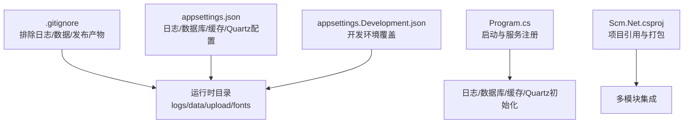
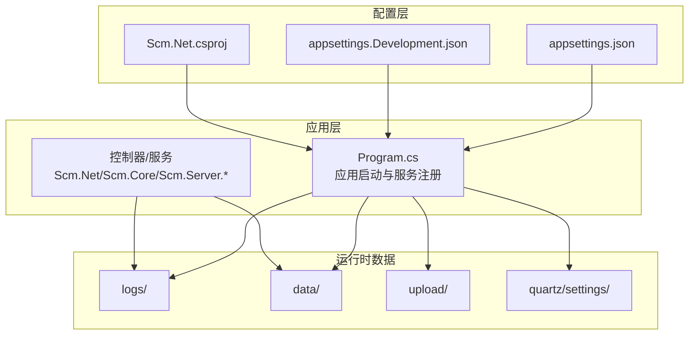
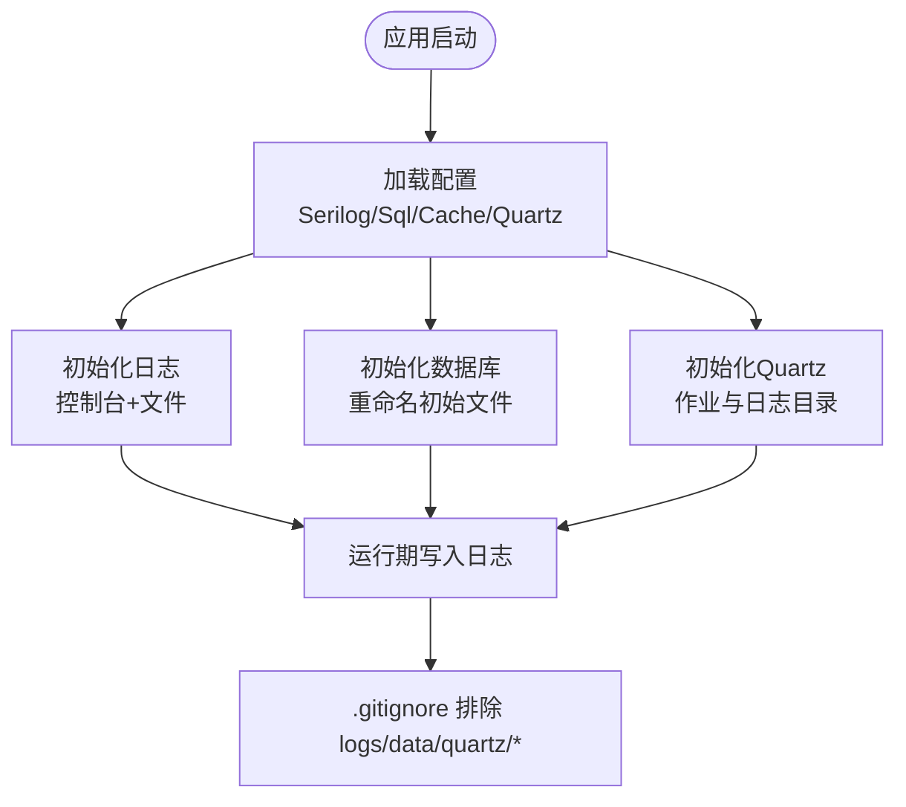
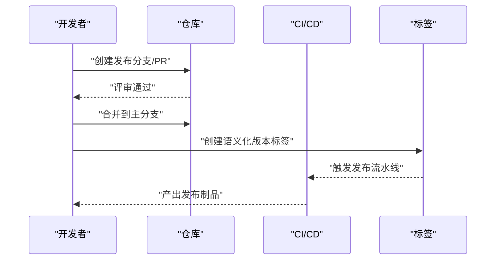
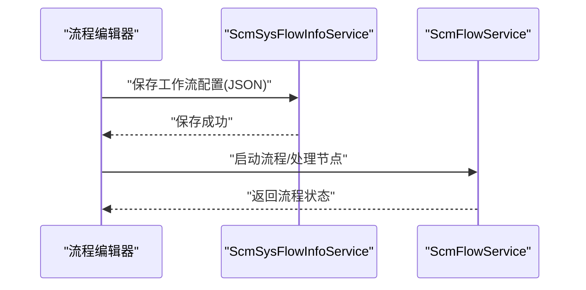
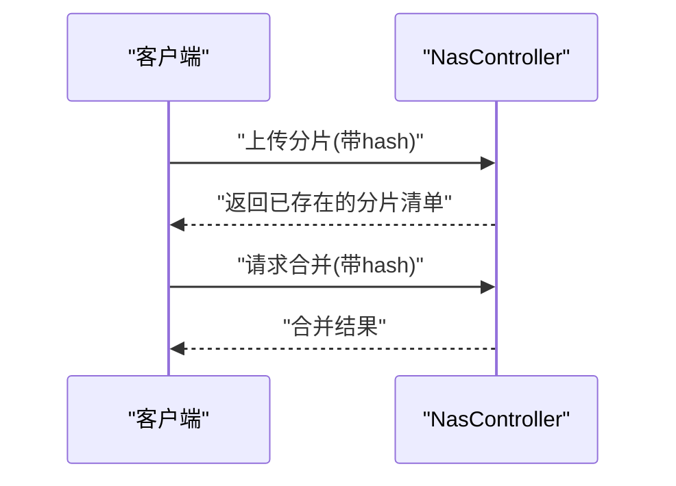
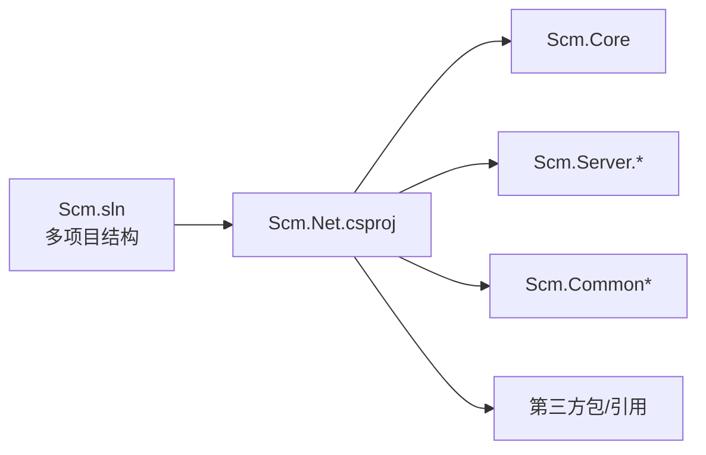

# 版本控制与协作

<cite>
**本文引用的文件**
- [.gitignore](file://.gitignore)
- [README.en.md](file://README.en.md)
- [Scm.Net/appsettings.json](file://Scm.Net/appsettings.json)
- [Scm.Net/appsettings.Development.json](file://Scm.Net/appsettings.Development.json)
- [Scm.Net/Program.cs](file://Scm.Net/Program.cs)
- [Scm.Net/readme.txt](file://Scm.Net/readme.txt)
- [Scm.Net/Scm.Net.csproj](file://Scm.Net/Scm.Net.csproj)
- [Scm.sln](file://Scm.sln)
- [Scm.Core/Dev/Version/ScmDevVersionService.cs](file://Scm.Core/Dev/Version/ScmDevVersionService.cs)
- [Scm.Server.Service/Service/ScmFlowService.cs](file://Scm.Server.Service/Service/ScmFlowService.cs)
- [Scm.Core/Sys/FlowInfo/ScmSysFlowInfoService.cs](file://Scm.Core/Sys/FlowInfo/ScmSysFlowInfoService.cs)
- [Scm.Common.Log/Utils/LogUtils.cs](file://Scm.Common.Log/Utils/LogUtils.cs)
- [Scm.Server.Quartz/Service/Df/QuartzFileHelper.cs](file://Scm.Server.Quartz/Service/Df/QuartzFileHelper.cs)
- [Scm.Net/Controllers/NasController.cs](file://Scm.Net/Controllers/NasController.cs)
</cite>

## 目录
1. [简介](#简介)
2. [项目结构与版本控制配置](#项目结构与版本控制配置)
3. [核心组件与版本控制实践](#核心组件与版本控制实践)
4. [架构总览](#架构总览)
5. [详细组件分析](#详细组件分析)
6. [依赖关系分析](#依赖关系分析)
7. [性能与存储特性](#性能与存储特性)
8. [故障排查指南](#故障排查指南)
9. [结论](#结论)
10. [附录](#附录)

## 简介
本指南面向 Scm.Net 团队，提供一套完整的版本控制与协作实践，覆盖 Git 基础与进阶、分支模型、合并冲突解决、标签管理、项目结构中的版本控制配置（含 .gitignore、大型文件处理）、代码审查流程（Pull Request）与发布管理（版本号、发布标签、变更日志），以及与 GitHub Issues、Project Board 等协作工具的结合建议。文档同时给出与代码库实际实现相映射的架构视图与流程图，帮助不同技术背景的成员快速上手并规范协作。

## 项目结构与版本控制配置
Scm.Net 采用多项目解决方案组织，前端资源与后端服务共存于 Scm.Net 项目中，日志、数据、上传等运行时目录在配置中明确指向。版本控制层面，通过 .gitignore 明确排除了编译产物、日志、开发数据、发布产物等非源码类文件，确保仓库整洁与安全。

- 关键配置要点
  - 日志输出路径：Serilog 在配置中指定日志文件路径，便于统一管理与归档。
  - 运行时数据目录：Sqlite 数据库、UID 文件、Quartz 作业与日志目录均在配置中声明，避免误提交。
  - 开发环境差异化：开发配置覆盖了日志级别、数据库连接、跨域策略等，便于本地调试。
  - 项目引用与打包：Scm.Net.csproj 引用多个业务与服务模块，构建时自动包含所需资源。

**图表来源**
- [.gitignore:1-34](file://.gitignore#L1-L34)
- [Scm.Net/appsettings.json:1-127](file://Scm.Net/appsettings.json#L1-L127)
- [Scm.Net/appsettings.Development.json:1-162](file://Scm.Net/appsettings.Development.json#L1-L162)
- [Scm.Net/Program.cs:1-366](file://Scm.Net/Program.cs#L1-L366)
- [Scm.Net/Scm.Net.csproj:1-86](file://Scm.Net/Scm.Net.csproj#L1-L86)

**章节来源**
- [.gitignore:1-34](file://.gitignore#L1-L34)
- [Scm.Net/appsettings.json:1-127](file://Scm.Net/appsettings.json#L1-L127)
- [Scm.Net/appsettings.Development.json:1-162](file://Scm.Net/appsettings.Development.json#L1-L162)
- [Scm.Net/Program.cs:1-366](file://Scm.Net/Program.cs#L1-L366)
- [Scm.Net/Scm.Net.csproj:1-86](file://Scm.Net/Scm.Net.csproj#L1-L86)

## 核心组件与版本控制实践
- 分支与标签
  - 使用语义化版本（SemVer）管理发布标签，例如 v1.2.3，配合变更日志维护发布说明。
  - 主分支保护策略：仅允许通过评审后的 Pull Request 合并到主干，避免直接推送。
- 提交与审查
  - 提交信息遵循约定式提交（如 feat/fix/docs/chore），并在 PR 描述中引用 Issue 编号。
  - 代码审查至少一名合作者批准，确保质量与一致性。
- 大型文件与敏感数据
  - 将数据库文件、日志、上传目录纳入 .gitignore 或使用 LFS 管理大文件。
  - 敏感配置通过环境变量或密钥管理服务注入，不在仓库中保留明文凭据。
- 发布与回滚
  - 发布前打标签并生成变更日志；回滚时以标签为基准进行版本回退。

**章节来源**
- [README.en.md:21-27](file://README.en.md#L21-L27)

## 架构总览
Scm.Net 作为 ASP.NET Core 应用，启动时按配置初始化日志、数据库、缓存、Quartz、邮件、短信、OIDC/OAuth、跨域与中间件等服务。运行时产生的日志、数据与上传文件由配置决定存放位置，避免被纳入版本控制。

**图表来源**
- [Scm.Net/Program.cs:1-366](file://Scm.Net/Program.cs#L1-L366)
- [Scm.Net/appsettings.json:1-127](file://Scm.Net/appsettings.json#L1-L127)
- [Scm.Net/appsettings.Development.json:1-162](file://Scm.Net/appsettings.Development.json#L1-L162)
- [Scm.Net/Scm.Net.csproj:1-86](file://Scm.Net/Scm.Net.csproj#L1-L86)

## 详细组件分析

### 组件一：日志与运行时数据（版本控制与存储）
- 日志管理
  - Serilog 在配置中定义控制台与文件输出，按天滚动；LogUtils 支持按类别写入不同子目录，便于检索与归档。
  - 建议将 logs 目录加入 .gitignore，避免提交运行时日志。
- 运行时数据
  - Sqlite 数据库与 UID 文件在启动时重命名并初始化，数据目录由配置决定。
  - Quartz 任务日志与作业文件也位于配置指定目录，应纳入忽略范围。

**图表来源**
- [Scm.Net/Program.cs:1-366](file://Scm.Net/Program.cs#L1-L366)
- [Scm.Net/appsettings.json:1-127](file://Scm.Net/appsettings.json#L1-L127)
- [Scm.Common.Log/Utils/LogUtils.cs:1-59](file://Scm.Common.Log/Utils/LogUtils.cs#L1-L59)
- [Scm.Server.Quartz/Service/Df/QuartzFileHelper.cs:116-153](file://Scm.Server.Quartz/Service/Df/QuartzFileHelper.cs#L116-L153)

**章节来源**
- [Scm.Net/appsettings.json:1-127](file://Scm.Net/appsettings.json#L1-L127)
- [Scm.Net/appsettings.Development.json:1-162](file://Scm.Net/appsettings.Development.json#L1-L162)
- [Scm.Net/Program.cs:1-366](file://Scm.Net/Program.cs#L1-L366)
- [Scm.Common.Log/Utils/LogUtils.cs:1-59](file://Scm.Common.Log/Utils/LogUtils.cs#L1-L59)
- [Scm.Server.Quartz/Service/Df/QuartzFileHelper.cs:116-153](file://Scm.Server.Quartz/Service/Df/QuartzFileHelper.cs#L116-L153)

### 组件二：版本与发布（语义化版本与标签）
- 版本服务
  - ScmDevVersionService 提供版本头信息的增删改查与设置当前版本能力，适合在发布流程中调用以标记当前版本。
- 发布标签
  - 建议在合并到主分支后创建对应语义化版本标签，如 v1.2.3，并在变更日志中标注本次发布内容。

**图表来源**
- [Scm.Core/Dev/Version/ScmDevVersionService.cs:119-164](file://Scm.Core/Dev/Version/ScmDevVersionService.cs#L119-L164)

**章节来源**
- [Scm.Core/Dev/Version/ScmDevVersionService.cs:119-164](file://Scm.Core/Dev/Version/ScmDevVersionService.cs#L119-L164)

### 组件三：工作流与审批（流程配置与节点）
- 流程配置
  - ScmSysFlowInfoService 提供工作流配置的读取与保存，支持将流程配置持久化为 JSON 文件，便于版本化管理流程定义。
- 审批流程
  - ScmFlowService 提供启动流程、处理分支节点与结束节点等逻辑，配合前端工作流编辑器使用。

**图表来源**
- [Scm.Core/Sys/FlowInfo/ScmSysFlowInfoService.cs:157-203](file://Scm.Core/Sys/FlowInfo/ScmSysFlowInfoService.cs#L157-L203)
- [Scm.Server.Service/Service/ScmFlowService.cs:47-82](file://Scm.Server.Service/Service/ScmFlowService.cs#L47-L82)

**章节来源**
- [Scm.Core/Sys/FlowInfo/ScmSysFlowInfoService.cs:157-203](file://Scm.Core/Sys/FlowInfo/ScmSysFlowInfoService.cs#L157-L203)
- [Scm.Server.Service/Service/ScmFlowService.cs:47-82](file://Scm.Server.Service/Service/ScmFlowService.cs#L47-L82)

### 组件四：文件上传与断点续传（大文件处理）
- 上传检查与合并
  - NasController 提供基于哈希的分片上传检查与合并接口，适合大文件传输场景。
- 大文件策略
  - 建议将上传目录纳入 .gitignore；若需版本化模板或配置，使用 LFS 或独立配置仓库管理。

**图表来源**
- [Scm.Net/Controllers/NasController.cs:396-436](file://Scm.Net/Controllers/NasController.cs#L396-L436)

**章节来源**
- [Scm.Net/Controllers/NasController.cs:396-436](file://Scm.Net/Controllers/NasController.cs#L396-L436)

## 依赖关系分析
- 解决方案与项目引用
  - Scm.sln 展示了多项目结构，Scm.Net 作为入口项目引用多个服务与模块，形成清晰的分层与职责划分。
- 运行时依赖
  - Program.cs 中的服务注册顺序体现了应用启动的关键依赖链：配置 → 日志 → 数据库 → 缓存 → Quartz → 中间件 → 控制器路由。

**图表来源**
- [Scm.sln:1-341](file://Scm.sln#L1-L341)
- [Scm.Net/Scm.Net.csproj:1-86](file://Scm.Net/Scm.Net.csproj#L1-L86)

**章节来源**
- [Scm.sln:1-341](file://Scm.sln#L1-L341)
- [Scm.Net/Scm.Net.csproj:1-86](file://Scm.Net/Scm.Net.csproj#L1-L86)

## 性能与存储特性
- 日志滚动与异步写入
  - Serilog 使用异步文件写入与按天滚动，降低 IO 压力并提升稳定性。
- 数据库与缓存
  - Sqlite 适合作为开发与轻量生产场景的数据存储；Redis 用于缓存，提高响应速度。
- Quartz 任务日志
  - 通过文件辅助读取最近日志条目，便于问题定位与监控。

**章节来源**
- [Scm.Net/appsettings.json:1-127](file://Scm.Net/appsettings.json#L1-L127)
- [Scm.Common.Log/Utils/LogUtils.cs:1-59](file://Scm.Common.Log/Utils/LogUtils.cs#L1-L59)
- [Scm.Server.Quartz/Service/Df/QuartzFileHelper.cs:116-153](file://Scm.Server.Quartz/Service/Df/QuartzFileHelper.cs#L116-L153)

## 故障排查指南
- 启动失败
  - 检查 data 目录下的 scm-origin.db 与 uid 文件是否已按 readme.txt 提示重命名为 scm.db 与 scm.uid。
  - 确认 appsettings.json 与 appsettings.Development.json 中的数据库连接字符串与日志路径正确。
- 日志定位
  - 使用 LogUtils 的分类输出（db/api/error）区分日志来源，结合 Serilog 的文件滚动定位问题时间点。
- Quartz 任务异常
  - 通过 QuartzFileHelper 读取最近日志条目，确认任务执行状态与错误堆栈。

**章节来源**
- [Scm.Net/readme.txt:1-14](file://Scm.Net/readme.txt#L1-L14)
- [Scm.Net/appsettings.json:1-127](file://Scm.Net/appsettings.json#L1-L127)
- [Scm.Common.Log/Utils/LogUtils.cs:1-59](file://Scm.Common.Log/Utils/LogUtils.cs#L1-L59)
- [Scm.Server.Quartz/Service/Df/QuartzFileHelper.cs:116-153](file://Scm.Server.Quartz/Service/Df/QuartzFileHelper.cs#L116-L153)

## 结论
通过规范的 .gitignore、严格的提交与审查流程、语义化版本与标签管理、以及对日志与运行时数据的合理配置，Scm.Net 可以在保证安全性与可维护性的前提下高效协作。结合工作流与审批组件，团队可以进一步提升交付质量与发布节奏的可控性。

## 附录
- 分支模型建议
  - 快速迭代：GitHub Flow（以主分支为主，小步快跑，PR+评审+自动化测试）。
  - 稳定发布：Git Flow（长期分支+发布分支+热修复分支），适合有固定发布周期的场景。
- 代码审查清单
  - 功能正确性、边界条件、异常处理、日志与错误信息、性能影响、安全风险、兼容性与回归测试。
- 发布流程建议
  - 规划版本号 → 写变更日志 → 打标签 → CI 构建与制品归档 → 回归测试 → 发布公告 → 监控与回滚预案。