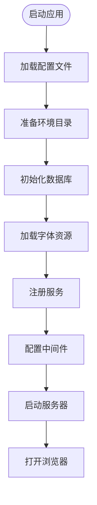
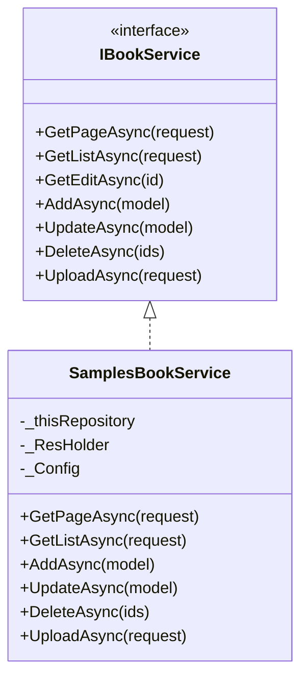
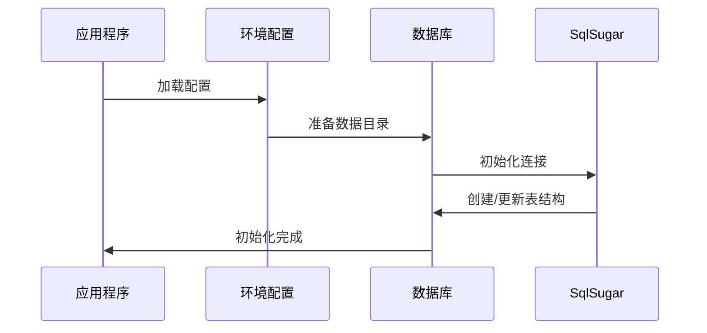
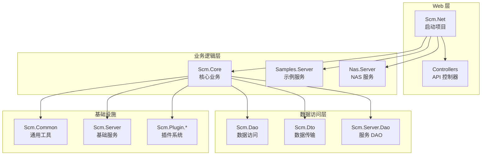

# 快速开始

<cite>
**本文引用的文件**   
- [Scm.Net/Program.cs](file://Scm.Net/Program.cs)
- [Scm.Net/appsettings.json](file://Scm.Net/appsettings.json)
- [Scm.Net/appsettings.Development.json](file://Scm.Net/appsettings.Development.json)
- [Scm.Net/Properties/launchSettings.json](file://Scm.Net/Properties/launchSettings.json)
- [Scm.Net/Scm.Net.csproj](file://Scm.Net/Scm.Net.csproj)
- [Scm.Core/Scm.Core.csproj](file://Scm.Core/Scm.Core.csproj)
- [Scm.Server/Controllers/ApiController.cs](file://Scm.Server/Controllers/ApiController.cs)
- [Scm.Net/Controllers/TestController.cs](file://Scm.Net/Controllers/TestController.cs)
- [Samples.Server/SamplesUtils.cs](file://Samples.Server/SamplesUtils.cs)
- [Samples.Server/Book/IBookService.cs](file://Samples.Server/Book/IBookService.cs)
- [Samples.Server/Book/SamplesBookService.cs](file://Samples.Server/Book/SamplesBookService.cs)
- [README.md](file://README.md)
- [README.en.md](file://README.en.md)
- [Scm.Server/Config/EnvConfig.cs](file://Scm.Server/Config/EnvConfig.cs)
- [Scm.Server/Config/SqlConfig.cs](file://Scm.Server/Config/SqlConfig.cs)
- [Scm.Net/Controllers/DbController.cs](file://Scm.Net/Controllers/DbController.cs)
- [Scm.Net/data/unit-origin.json](file://Scm.Net/data/unit-origin.json)
- [Scm.Net/data/sql/ddl.sql](file://Scm.Net/data/sql/ddl.sql)
- [Scm.Net/data/sql/dml.sql](file://Scm.Net/data/sql/dml.sql)
- [Scm.Net/data/sql/dml-nas.sql](file://Scm.Net/data/sql/dml-nas.sql)
</cite>

## 更新摘要
**所做更改**
- 重构了快速开始章节，完全按照 README.md 和 README.en.md 中的新结构编写
- 更新了环境准备的具体要求，包括 .NET SDK 10.0+、Visual Studio 2026+、MariaDB/MySQL 10.3+
- 重新设计了项目克隆、配置、启动的完整流程
- 新增了数据库初始化和前端启动的详细说明
- 更新了配置文件示例和验证步骤
- 修正了端口配置和启动方式的描述

## 目录
1. [简介](#简介)
2. [开发环境要求](#开发环境要求)
3. [项目克隆与配置](#项目克隆与配置)
4. [构建与运行](#构建与运行)
5. [第一个 Hello World 示例](#第一个-hello-world-示例)
6. [核心功能体验](#核心功能体验)
7. [数据库配置与初始化](#数据库配置与初始化)
8. [常见问题排查](#常见问题排查)
9. [项目结构概览](#项目结构概览)
10. [后续学习路径](#后续学习路径)

## 简介
Scm.Net 是一款基于 .NET 10.0 及 Vue 3.0 构建的企业级中后台管理系统快速开发框架。本"快速开始"指南旨在帮助新开发者在最短时间内完成环境准备、项目运行，并通过一个"Hello World"级示例理解框架的核心能力。

### 框架特色
- **多平台支持**：可在 Windows、macOS、Linux 等平台开发与运行
- **模块化设计**：功能模块化拆分，可根据需要灵活引入
- **多数据库支持**：支持 SQLite、MySQL、SQL Server、Oracle、MariaDB、PostgreSQL 等主流数据库
- **多缓存机制**：支持 MemoryCache、Map、Redis 等缓存方案
- **丰富的认证方式**：支持账户、手机、邮件、第三方等多种登录方式
- **代码自动生成**：集成代码生成器，支持自定义模板

## 开发环境要求

### 系统要求
- **操作系统**：Windows 10/11、macOS 10.15+、Linux
- **.NET 版本**：.NET 10.0 或更高版本
- **数据库**：SQLite（默认）、MySQL、SQL Server、Oracle 等
- **开发工具**：Visual Studio 2026 或更高版本

### 必需软件安装

#### 1. 安装 .NET 10 SDK
```bash
# 下载地址：https://dotnet.microsoft.com/download/dotnet/10.0
# 验证安装
dotnet --version
```

#### 2. 安装 Visual Studio 2026
- 下载地址：https://visualstudio.microsoft.com/
- 建议安装工作负载：.NET 桌面开发、ASP.NET 和 Web 开发

#### 3. 可选：安装数据库
- **SQLite**：默认使用，无需额外安装
- **MariaDB**：版本 10.3 或更高
- **其他数据库**：根据需求选择对应版本

## 项目克隆与配置

### 克隆项目
```bash
# 使用 Git 克隆
git clone https://gitee.com/openscm/scm.net.git
cd Scm.Net
```

### 项目结构说明
```
Scm.Net/
├── Scm.Net/                    # Web 启动项目
├── Scm.Core/                   # 核心业务模块
├── Scm.Server/                 # 基础服务层
├── Samples.Server/             # 示例服务模块
├── Nas.Server/                 # NAS 服务模块
├── Scm.Dao/                    # 数据访问层
├── Scm.Dto/                    # 数据传输对象
├── Scm.Common/                 # 通用工具类
└── 其他功能模块...
```

### 配置文件说明

#### 主配置文件 (appsettings.json)
```json
{
  "Serilog": {
    "MinimumLevel": "Information",
    "WriteTo": [
      {"Name": "Console"},
      {"Name": "File", "Args": {"path": "Logs/log.txt"}}
    ]
  },
  "Kestrel": {
    "Endpoints": {
      "Http": {"Url": "http://*:9999"}
    }
  },
  "Env": {
    "dataUri": "/data",
    "dataDir": "data",
    "upload": "upload",
    "images": "images"
  },
  "Sql": {
    "Type": "Sqlite",
    "Text": "Data Source=data/scm.db;"
  },
  "Cache": {
    "Type": "Redis",
    "Text": "127.0.0.1,defaultDatabase=5,poolsize=10"
  }
}
```

#### 开发环境配置 (appsettings.Development.json)
```json
{
  "Serilog": {"MinimumLevel": "Debug"},
  "Kestrel": {"Endpoints": {"Http": {"Url": "http://*:5000"}}},
  "Env": {
    "dataDir": "D:/data",
    "upload": "upload",
    "images": "images"
  }
}
```

## 构建与运行

### 方式一：使用 Visual Studio
1. 打开解决方案文件 `Scm.sln`
2. 设置启动项目为 `Scm.Net`
3. 按 F5 或点击运行按钮启动

### 方式二：使用命令行
```bash
# 进入项目根目录
cd Scm.Net

# 恢复 NuGet 包
dotnet restore

# 构建项目
dotnet build

# 运行项目
dotnet run --project Scm.Net/Scm.Net.csproj
```

### 启动配置
项目启动时会自动执行以下初始化流程：



**图表来源**
- [Scm.Net/Program.cs:33-258](file://Scm.Net/Program.cs#L33-L258)

## 第一个 Hello World 示例

### 验证服务链路
1. **启动应用**：确保项目成功运行
2. **访问 Swagger**：默认打开 `https://localhost:5000/swagger/index.html`
3. **查找测试接口**：在 Swagger 中搜索 `TestController`
4. **调用 Echo 接口**：
   - 方法：POST `/api/test/Echo`
   - 请求体：`{"key": "value"}`
   - 预期响应：包含当前终端标识的 JSON 数据

### 代码示例
```csharp
// TestController.cs
[HttpPost("Echo")]
public ScmApiResponse PostEcho(ScmRequest request)
{
    var token = _ScmHolder.GetToken();
    var response = new ScmApiDataResponse<long>();
    response.Data = token.terminal_id;
    response.SetSuccess();
    return response;
}
```

**章节来源**
- [Scm.Net/Controllers/TestController.cs:19-39](file://Scm.Net/Controllers/TestController.cs#L19-L39)
- [Scm.Server/Controllers/ApiController.cs:8-14](file://Scm.Server/Controllers/ApiController.cs#L8-L14)

## 核心功能体验

### 示例服务：图书管理
框架提供了完整的示例服务，展示典型的企业级功能：



**图表来源**
- [Samples.Server/Book/IBookService.cs:1-12](file://Samples.Server/Book/IBookService.cs#L1-L12)
- [Samples.Server/Book/SamplesBookService.cs:20-38](file://Samples.Server/Book/SamplesBookService.cs#L20-L38)

### 主要功能特性
- **数据访问**：基于 SqlSugar 的 ORM 操作
- **分页查询**：支持复杂条件的分页查询
- **文件上传**：支持图片、文档等文件上传
- **导入导出**：Excel 导入导出功能
- **状态管理**：批量状态变更操作
- **缓存机制**：智能缓存策略优化性能

**章节来源**
- [Samples.Server/Book/SamplesBookService.cs:45-241](file://Samples.Server/Book/SamplesBookService.cs#L45-L241)

## 数据库配置与初始化

### 数据库配置
框架支持多种数据库类型，默认使用 SQLite：

```json
{
  "Sql": {
    "Type": "Sqlite",
    "Text": "Data Source=data/scm.db;"
  },
  "Uid": {
    "Type": "Compose",
    "DbType": "file",
    "DbText": "Data Source=data/uid.db;"
  }
}
```

### 数据库初始化流程
项目启动时会自动执行数据库初始化：



**图表来源**
- [Scm.Net/Program.cs:282-356](file://Scm.Net/Program.cs#L282-L356)

### 数据库管理接口
框架提供了数据库管理接口：

- **初始化数据库**：`GET /api/db/init`
- **删除数据库**：`GET /api/db/drop`
- **重置数据库**：`GET /api/db/reset`

### 初始数据导入
项目包含初始数据文件，启动时会自动处理：

- **单位信息**：`data/unit-origin.json`
- **数据库结构**：`data/sql/ddl.sql`
- **基础数据**：`data/sql/dml.sql`
- **NAS 数据**：`data/sql/dml-nas.sql`

**章节来源**
- [Scm.Net/Controllers/DbController.cs:207-254](file://Scm.Net/Controllers/DbController.cs#L207-L254)
- [Scm.Net/data/unit-origin.json:1-1](file://Scm.Net/data/unit-origin.json#L1-L1)

## 常见问题排查

### 端口冲突
**问题**：端口 9999 或 5000 被占用
**解决**：
```json
// 修改 appsettings.json
{
  "Kestrel": {
    "Endpoints": {
      "Http": {"Url": "http://*:8080"}
    }
  }
}
```

### 数据库初始化失败
**问题**：首次运行无法创建数据库
**解决**：
1. 确认 `data` 目录有写入权限
2. 检查连接字符串配置
3. 确保 SQLite 文件权限正确

### 跨域问题
**问题**：前端无法访问后端 API
**解决**：
```json
// 开发环境启用全局跨域
{
  "Cors": {
    "GlobalCors": true,
    "AllowedOrigins": ["http://localhost:2800"]
  }
}
```

### Swagger 文档不显示
**问题**：Swagger 页面空白
**解决**：
1. 确认开发环境配置
2. 检查 `launchSettings.json` 中的启动 URL
3. 验证 `appsettings.Development.json` 中的 Swagger 配置

### 性能优化建议
- **数据库索引**：为常用查询字段建立索引
- **缓存策略**：合理使用 Redis 缓存热点数据
- **分页查询**：大数据量时使用分页避免内存溢出
- **文件存储**：图片等大文件使用 CDN 或分布式存储

## 项目结构概览

### 核心模块架构


**图表来源**
- [Scm.Net/Scm.Net.csproj:36-49](file://Scm.Net/Scm.Net.csproj#L36-L49)
- [Scm.Core/Scm.Core.csproj:10-25](file://Scm.Core/Scm.Core.csproj#L10-L25)

### 依赖关系分析
项目采用清晰的分层架构，各模块职责明确：

- **Scm.Net**：Web 应用入口，负责配置加载和中间件装配
- **Scm.Core**：核心业务逻辑，提供通用能力和服务
- **Scm.Server**：基础服务层，包含各种服务接口和实现
- **Scm.Dao/Dto**：数据访问层，提供数据持久化和数据传输对象
- **Scm.Common**：通用工具类，提供公共功能

**章节来源**
- [Scm.Net/Scm.Net.csproj:1-86](file://Scm.Net/Scm.Net.csproj#L1-L86)
- [Scm.Core/Scm.Core.csproj:1-69](file://Scm.Core/Scm.Core.csproj#L1-L69)

## 后续学习路径

### 学习建议
1. **深入理解项目结构**：先掌握整体架构，再深入具体模块
2. **实践示例代码**：通过 Samples.Server 的示例快速上手
3. **学习核心概念**：理解 DTO、DAO、Service 的设计模式
4. **探索插件系统**：了解 Scm.Plugin.* 的扩展机制
5. **掌握部署流程**：学习生产环境部署和配置

### 进阶主题
- **自定义服务开发**：基于现有模式开发业务服务
- **插件开发**：创建自定义插件扩展功能
- **性能优化**：数据库优化、缓存策略、并发处理
- **安全加固**：身份认证、授权控制、数据加密
- **监控运维**：日志收集、性能监控、故障排查

### 参考资源
- **官方文档**：https://gitee.com/openscm/scm.net/wikis
- **更新日志**：https://gitee.com/openscm/scm.net/wikis/更新日志
- **示例代码**：Samples.Server 模块
- **社区支持**：QQ 交流群 415872667

通过本快速开始指南，您应该能够成功运行 Scm.Net 项目并理解其核心架构。建议继续深入学习示例服务和核心模块，逐步掌握框架的高级功能和最佳实践。

**章节来源**
- [README.md:86-92](file://README.md#L86-L92)
- [README.en.md:15-19](file://README.en.md#L15-L19)