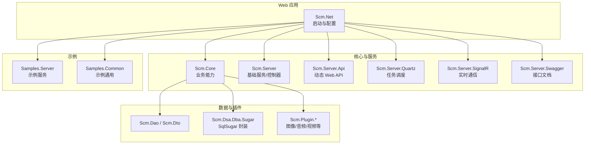
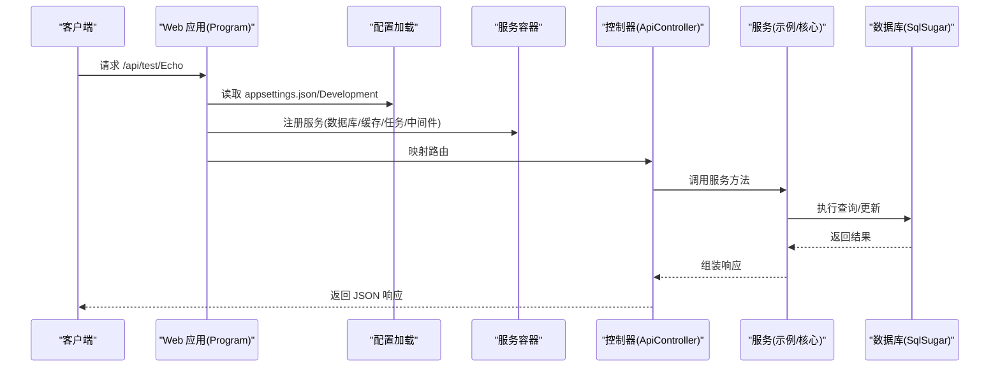
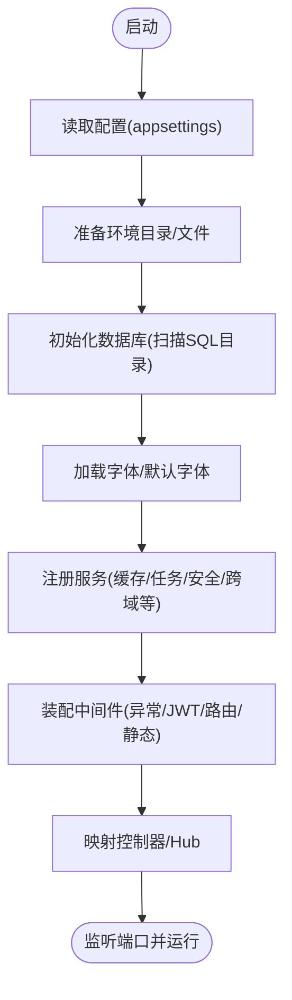
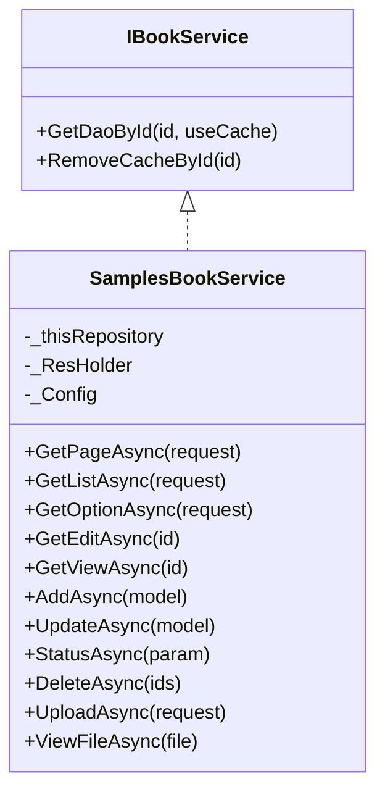
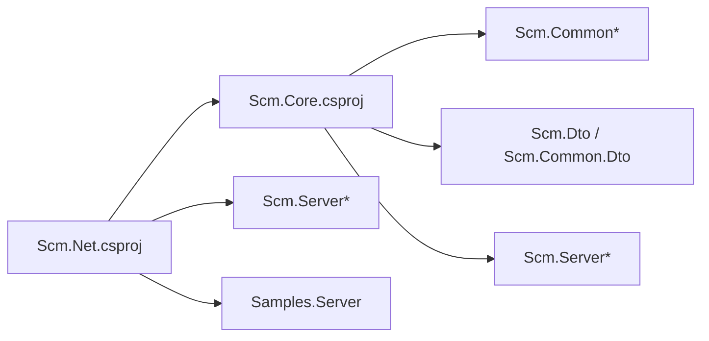

# 快速开始

<cite>
**本文引用的文件**   
- [Scm.Net/Program.cs](file://Scm.Net/Program.cs)
- [Scm.Net/appsettings.json](file://Scm.Net/appsettings.json)
- [Scm.Net/appsettings.Development.json](file://Scm.Net/appsettings.Development.json)
- [Scm.Net/Properties/launchSettings.json](file://Scm.Net/Properties/launchSettings.json)
- [Scm.Net/Scm.Net.csproj](file://Scm.Net/Scm.Net.csproj)
- [Scm.Core/Scm.Core.csproj](file://Scm.Core/Scm.Core.csproj)
- [Scm.Server/IApiService.cs](file://Scm.Server/IApiService.cs)
- [Scm.Server/Controllers/ApiController.cs](file://Scm.Server/Controllers/ApiController.cs)
- [Scm.Net/Controllers/TestController.cs](file://Scm.Net/Controllers/TestController.cs)
- [Samples.Server/SamplesUtils.cs](file://Samples.Server/SamplesUtils.cs)
- [Samples.Server/Book/IBookService.cs](file://Samples.Server/Book/IBookService.cs)
- [Samples.Server/Book/SamplesBookService.cs](file://Samples.Server/Book/SamplesBookService.cs)
- [README.en.md](file://README.en.md)
</cite>

## 目录
1. [简介](#简介)
2. [项目结构](#项目结构)
3. [核心组件](#核心组件)
4. [架构总览](#架构总览)
5. [详细组件分析](#详细组件分析)
6. [依赖关系分析](#依赖关系分析)
7. [性能注意事项](#性能注意事项)
8. [故障排查指南](#故障排查指南)
9. [结论](#结论)
10. [附录](#附录)

## 简介
本“快速开始”旨在帮助新开发者在最短时间内完成 Scm.Net 框架的环境准备、项目克隆、构建与运行，并通过一个“Hello World”级示例理解框架的核心能力。文档覆盖以下要点：
- 前置条件：.NET 10 SDK、数据库与缓存、依赖项安装
- 配置文件设置：appsettings.json 与开发环境配置
- 初始数据导入：数据库与资源文件的自动准备流程
- 第一个示例：调用内置测试接口验证运行链路
- 常见问题排查与解决方案

## 项目结构
Scm.Net 采用多项目解决方案，核心由 Web 启动项目、核心业务模块、服务层、DAO 层、DTO 层以及若干插件与工具组成。Web 启动项目负责应用生命周期、配置加载、服务注册与中间件装配；核心模块提供通用能力；示例模块演示典型业务场景。

图示来源
- [Scm.Net/Scm.Net.csproj:36-49](file://Scm.Net/Scm.Net.csproj#L36-L49)
- [Scm.Core/Scm.Core.csproj:10-25](file://Scm.Core/Scm.Core.csproj#L10-L25)

章节来源
- [Scm.Net/Scm.Net.csproj:1-86](file://Scm.Net/Scm.Net.csproj#L1-L86)
- [Scm.Core/Scm.Core.csproj:1-69](file://Scm.Core/Scm.Core.csproj#L1-L69)

## 核心组件
- Web 启动与配置
  - 启动入口负责读取配置、初始化日志、注册各类服务（数据库、缓存、任务调度、邮件、短信、JWT、跨域、Swagger、SignalR 等），并装配中间件与路由。
- 动态 Web API
  - 通过特性标记的服务接口自动映射为 REST 接口，简化控制器编写。
- 示例服务
  - 提供示例业务服务（如图书）演示数据访问、分页查询、导入导出、上传下载等常见操作。

章节来源
- [Scm.Net/Program.cs:31-258](file://Scm.Net/Program.cs#L31-L258)
- [Scm.Server/IApiService.cs:1-15](file://Scm.Server/IApiService.cs#L1-L15)
- [Scm.Server/Controllers/ApiController.cs:1-14](file://Scm.Server/Controllers/ApiController.cs#L1-L14)
- [Samples.Server/SamplesUtils.cs:1-13](file://Samples.Server/SamplesUtils.cs#L1-L13)

## 架构总览
下图展示了从请求进入应用到服务处理的关键路径，以及关键配置与服务的装配关系。

图示来源
- [Scm.Net/Program.cs:33-258](file://Scm.Net/Program.cs#L33-L258)
- [Scm.Net/Controllers/TestController.cs:19-39](file://Scm.Net/Controllers/TestController.cs#L19-L39)
- [Scm.Server/Controllers/ApiController.cs:8-14](file://Scm.Server/Controllers/ApiController.cs#L8-L14)

## 详细组件分析

### 环境与前置条件
- .NET 10 SDK
  - 目标框架为 net10.0，需安装 .NET 10 SDK。
- 数据库
  - 默认使用 SQLite，连接字符串指向 data/scm.db；首次运行会自动准备数据库与表结构。
- 缓存
  - 默认 Redis，可通过配置切换或禁用。
- 其他依赖
  - 图像处理、Serilog 日志、Newtonsoft.Json 支持、SignalR、Swagger 等。

章节来源
- [Scm.Net/Scm.Net.csproj:3-10](file://Scm.Net/Scm.Net.csproj#L3-L10)
- [Scm.Net/appsettings.json:48-60](file://Scm.Net/appsettings.json#L48-L60)
- [Scm.Net/Program.cs:282-356](file://Scm.Net/Program.cs#L282-L356)

### 配置文件设置
- 生产配置
  - appsettings.json：定义日志、Kestrel 端口、环境目录、数据库、UID、缓存、任务调度、JWT、安全、跨域等。
- 开发配置
  - appsettings.Development.json：覆盖开发环境下的目录、数据库连接、OIDC/OPT、跨域策略、Swagger 文档等。
- 启动配置
  - launchSettings.json：指定开发环境变量、启动 URL、浏览器打开 Swagger。

章节来源
- [Scm.Net/appsettings.json:1-127](file://Scm.Net/appsettings.json#L1-L127)
- [Scm.Net/appsettings.Development.json:1-162](file://Scm.Net/appsettings.Development.json#L1-L162)
- [Scm.Net/Properties/launchSettings.json:1-31](file://Scm.Net/Properties/launchSettings.json#L1-L31)

### 初始化与数据准备流程
- 程序启动时会：
  - 读取并准备环境配置，重命名初始数据库与 UID 文件（如不存在）。
  - 初始化数据库：扫描 SQL 目录并执行建表/初始化脚本。
  - 加载字体与默认字体名称。
  - 注册服务（缓存、Swagger、安全、任务调度、邮件、短信、Aiml、Oidc、Otp、跨域、SignalR、Mapper 等）。
  - 装配中间件（异常、JWT、路由、静态文件、跨域）。
  - 映射控制器与 SignalR Hub。

图示来源
- [Scm.Net/Program.cs:33-258](file://Scm.Net/Program.cs#L33-L258)

章节来源
- [Scm.Net/Program.cs:31-258](file://Scm.Net/Program.cs#L31-L258)

### 第一个 Hello World 示例
目标：调用内置测试接口，返回当前终端标识，验证服务链路可用。

- 步骤
  1) 在开发环境下启动应用（IDE 或命令行），默认会打开 Swagger 页面。
  2) 在 Swagger 中找到 Test 控制器，选择 POST /api/test/Echo。
  3) 准备一个 ScmRequest 对象（请求体），点击“Try it out”执行。
  4) 观察返回值中的 Data 字段，应为当前终端标识（示例中为 long 类型）。

- 关键点
  - 测试控制器继承自 ApiController，路由前缀为 api/test。
  - Echo 方法通过上下文持有者获取令牌信息并返回。

章节来源
- [Scm.Net/Controllers/TestController.cs:1-42](file://Scm.Net/Controllers/TestController.cs#L1-L42)
- [Scm.Server/Controllers/ApiController.cs:1-14](file://Scm.Server/Controllers/ApiController.cs#L1-L14)

### 示例服务：图书管理
该示例演示了典型的增删改查、分页、状态变更、批量删除、文件上传与导入、本地文件读取等能力。

图示来源
- [Samples.Server/Book/IBookService.cs:1-12](file://Samples.Server/Book/IBookService.cs#L1-L12)
- [Samples.Server/Book/SamplesBookService.cs:20-38](file://Samples.Server/Book/SamplesBookService.cs#L20-L38)

章节来源
- [Samples.Server/Book/IBookService.cs:1-12](file://Samples.Server/Book/IBookService.cs#L1-L12)
- [Samples.Server/Book/SamplesBookService.cs:45-241](file://Samples.Server/Book/SamplesBookService.cs#L45-L241)

## 依赖关系分析
- 启动项目对核心模块与服务模块的引用，体现了“以服务为中心”的设计。
- 核心模块进一步引用通用组件、DTO、服务器基础能力与插件生态。

图示来源
- [Scm.Net/Scm.Net.csproj:36-49](file://Scm.Net/Scm.Net.csproj#L36-L49)
- [Scm.Core/Scm.Core.csproj:10-25](file://Scm.Core/Scm.Core.csproj#L10-L25)

章节来源
- [Scm.Net/Scm.Net.csproj:1-86](file://Scm.Net/Scm.Net.csproj#L1-L86)
- [Scm.Core/Scm.Core.csproj:1-69](file://Scm.Core/Scm.Core.csproj#L1-L69)

## 性能注意事项
- 数据库
  - 使用 SqlSugar 进行 ORM 访问，建议合理使用索引与分页，避免一次性加载大结果集。
- 缓存
  - 默认 Redis，注意键空间与过期策略，避免内存膨胀。
- 文件与静态资源
  - 静态文件服务按需启用，上传目录与图片目录需结合实际容量规划。
- 日志
  - 生产环境建议调整最小日志级别，避免过多 IO。

## 故障排查指南
- 端口占用
  - 若 9999/5000 端口被占用，可在 Kestrel 配置中修改端口，或在 launchSettings.json 中调整启动 URL。
- 数据库无法初始化
  - 检查 data/scm.db 是否可写；确认连接字符串正确；首次运行会自动准备数据库与表结构。
- 跨域问题
  - 开发环境可开启全局跨域；生产环境请明确 AllowedOrigins 与 AllowCredentials。
- Swagger 不显示
  - 开发环境会自动启用 Swagger；若未显示，请检查 Swagger 配置与环境变量。
- JWT 未生效
  - 确认 JWT 配置项完整且与前端一致；检查中间件顺序与授权策略。
- 图片/字体相关错误
  - 确认字体目录与默认字体名称配置正确；确保字体文件存在。

章节来源
- [Scm.Net/appsettings.json:26-38](file://Scm.Net/appsettings.json#L26-L38)
- [Scm.Net/appsettings.Development.json:26-38](file://Scm.Net/appsettings.Development.json#L26-L38)
- [Scm.Net/Program.cs:178-238](file://Scm.Net/Program.cs#L178-L238)

## 结论
通过本指南，你已经完成了 Scm.Net 的环境准备、项目运行与第一次“Hello World”体验。建议继续探索示例服务与核心模块，逐步掌握动态 API、数据访问、任务调度与实时通信等能力。

## 附录
- 参考文档与仓库说明
  - 仓库提供了英文 README，可作为补充背景阅读。

章节来源
- [README.en.md:1-38](file://README.en.md#L1-L38)