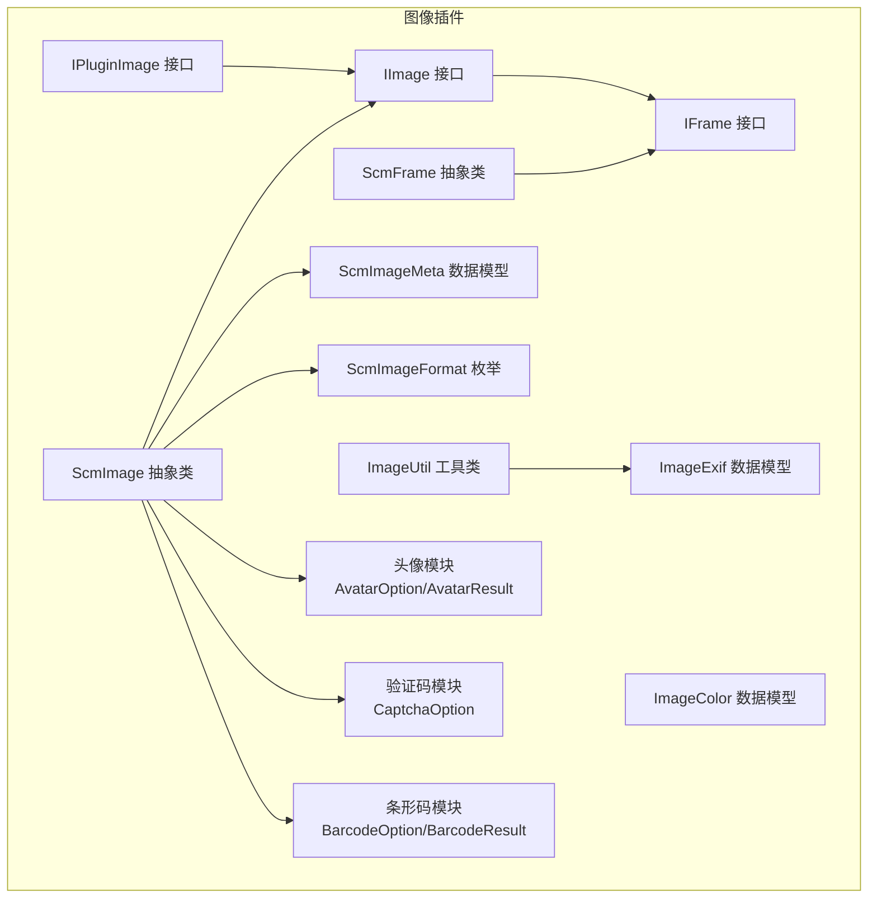
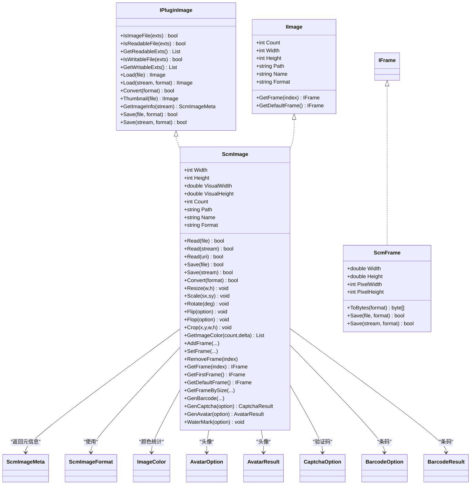
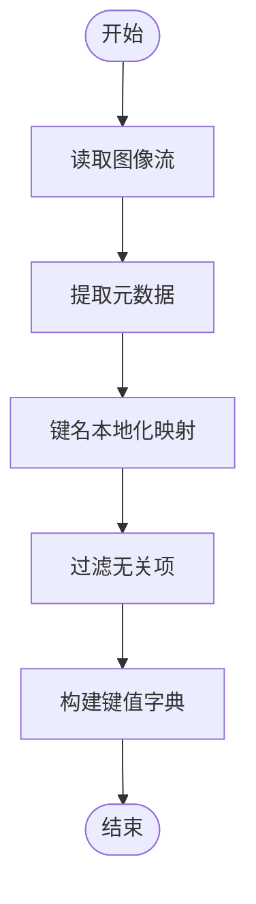
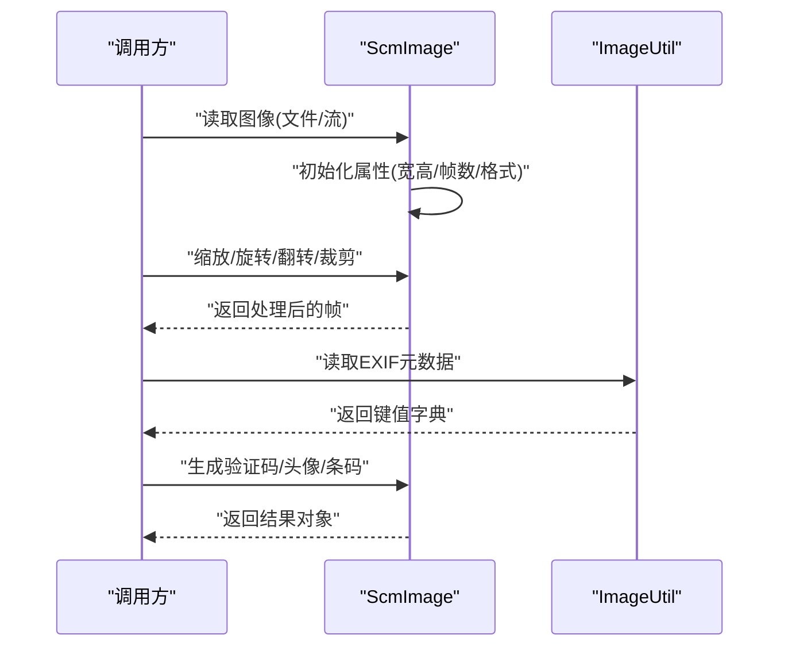
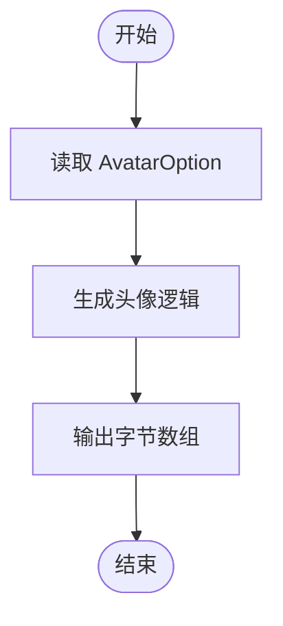
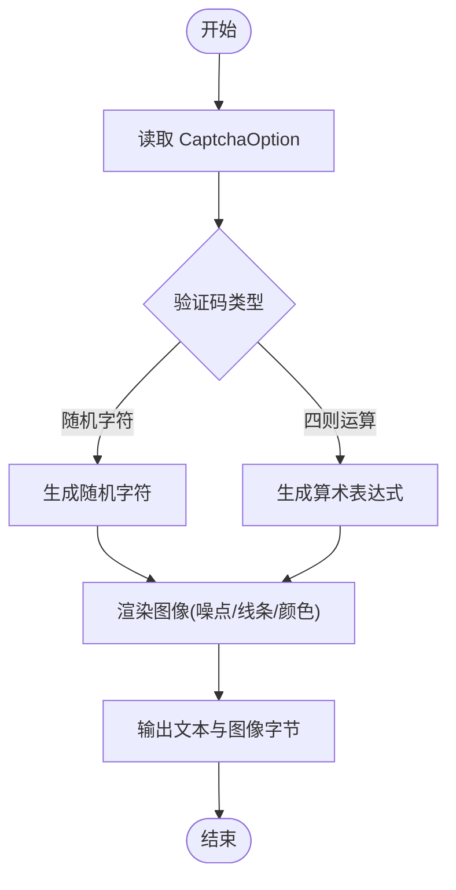
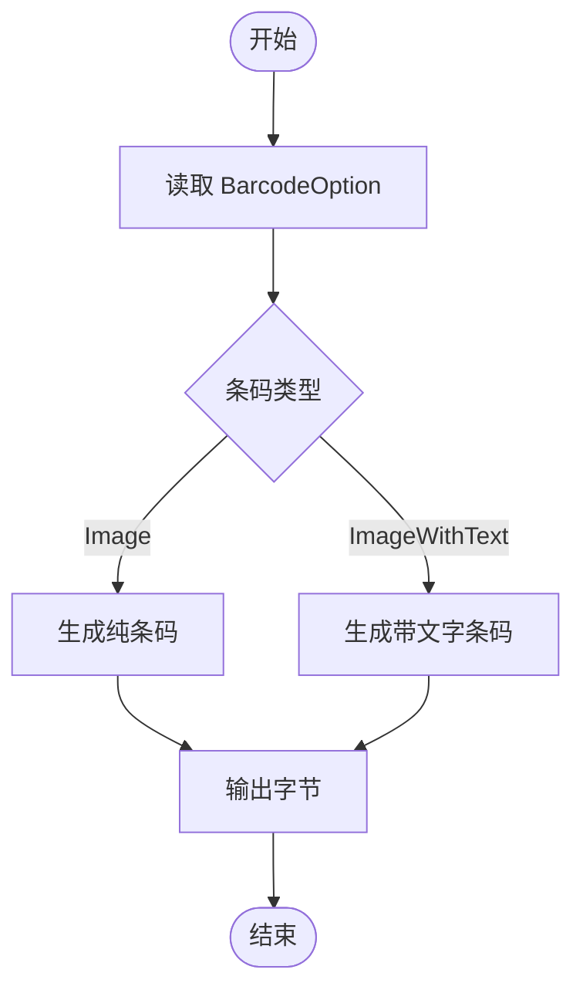
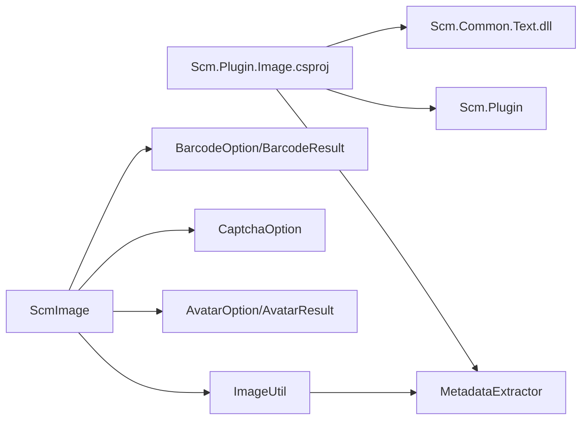

# 图像插件系统

<cite>
**本文引用的文件**
- [Scm.Plugin.Image.csproj](file://Scm.Plugin.Image/Scm.Plugin.Image.csproj)
- [IPluginImage.cs](file://Scm.Plugin.Image/IPluginImage.cs)
- [IImage.cs](file://Scm.Plugin.Image/IImage.cs)
- [IFrame.cs](file://Scm.Plugin.Image/IFrame.cs)
- [ScmImage.cs](file://Scm.Plugin.Image/ScmImage.cs)
- [ScmFrame.cs](file://Scm.Plugin.Image/ScmFrame.cs)
- [ScmImageMeta.cs](file://Scm.Plugin.Image/ScmImageMeta.cs)
- [ScmImageFormat.cs](file://Scm.Plugin.Image/ScmImageFormat.cs)
- [ImageUtil.cs](file://Scm.Plugin.Image/ImageUtil.cs)
- [ImageExif.cs](file://Scm.Plugin.Image/Exif/ImageExif.cs)
- [ImageColor.cs](file://Scm.Plugin.Image/ImageColor.cs)
- [AvatarOption.cs](file://Scm.Plugin.Image/Avatar/AvatarOption.cs)
- [AvatarResult.cs](file://Scm.Plugin.Image/Avatar/AvatarResult.cs)
- [BarcodeOption.cs](file://Scm.Plugin.Image/Barcode/BarcodeOption.cs)
- [BarcodeResult.cs](file://Scm.Plugin.Image/Barcode/BarcodeResult.cs)
- [CaptchaOption.cs](file://Scm.Plugin.Image/Captcha/CaptchaOption.cs)
</cite>

## 目录
1. [简介](#简介)
2. [项目结构](#项目结构)
3. [核心组件](#核心组件)
4. [架构总览](#架构总览)
5. [详细组件分析](#详细组件分析)
6. [依赖关系分析](#依赖关系分析)
7. [性能考虑](#性能考虑)
8. [故障排查指南](#故障排查指南)
9. [结论](#结论)
10. [附录](#附录)

## 简介
本技术文档面向 Scm.Net 的图像插件系统，系统性阐述图像插件的功能特性与实现机制，覆盖以下主题：
- 图像格式支持与可读写扩展
- 元数据提取（EXIF）与地理信息处理
- 图像处理算法：缩略图生成、缩放、旋转、翻转、裁剪、颜色提取
- 滤镜效果与水印叠加
- 格式转换与压缩策略
- 头像生成、验证码生成、条形码处理
- 配置选项、性能优化与内存管理
- 实际应用场景与使用建议

## 项目结构
图像插件位于 Scm.Plugin.Image 工程中，采用接口抽象与抽象基类分层设计，结合若干领域模型（如头像、验证码、条形码）实现具体能力。

图表来源
- [IPluginImage.cs:1-90](file://Scm.Plugin.Image/IPluginImage.cs#L1-L90)
- [IImage.cs:1-42](file://Scm.Plugin.Image/IImage.cs#L1-L42)
- [IFrame.cs:1-7](file://Scm.Plugin.Image/IFrame.cs#L1-L7)
- [ScmImage.cs:1-234](file://Scm.Plugin.Image/ScmImage.cs#L1-L234)
- [ScmFrame.cs:1-22](file://Scm.Plugin.Image/ScmFrame.cs#L1-L22)
- [ScmImageMeta.cs:1-36](file://Scm.Plugin.Image/ScmImageMeta.cs#L1-L36)
- [ScmImageFormat.cs:1-14](file://Scm.Plugin.Image/ScmImageFormat.cs#L1-L14)
- [ImageUtil.cs:1-138](file://Scm.Plugin.Image/ImageUtil.cs#L1-L138)
- [ImageExif.cs:1-255](file://Scm.Plugin.Image/Exif/ImageExif.cs#L1-L255)
- [ImageColor.cs:1-21](file://Scm.Plugin.Image/ImageColor.cs#L1-L21)
- [AvatarOption.cs:1-8](file://Scm.Plugin.Image/Avatar/AvatarOption.cs#L1-L8)
- [AvatarResult.cs:1-8](file://Scm.Plugin.Image/Avatar/AvatarResult.cs#L1-L8)
- [BarcodeOption.cs:1-80](file://Scm.Plugin.Image/Barcode/BarcodeOption.cs#L1-L80)
- [BarcodeResult.cs:1-9](file://Scm.Plugin.Image/Barcode/BarcodeResult.cs#L1-L9)
- [CaptchaOption.cs:1-160](file://Scm.Plugin.Image/Captcha/CaptchaOption.cs#L1-L160)

章节来源
- [Scm.Plugin.Image.csproj:1-30](file://Scm.Plugin.Image/Scm.Plugin.Image.csproj#L1-L30)

## 核心组件
- 插件接口层：IPluginImage 定义图像插件的文件识别、加载、保存、转换、缩略图生成、元信息读取等能力，并声明可读写扩展集合。
- 图像抽象层：ScmImage 抽象类实现 IImage，统一定义图像属性（宽高、可视尺寸、帧数、路径、名称、格式）、读写存取、变换操作（缩放、旋转、翻转、裁剪、颜色提取）、帧管理、应用能力（条码、验证码、头像、水印）。
- 帧抽象层：ScmFrame 抽象类实现 IFrame，统一定义帧的像素与物理尺寸、字节序列化与保存。
- 元数据与工具：ImageUtil 提供 EXIF 元数据读取与键名本地化；ImageExif 定义 EXIF 字段的数据模型；ScmImageMeta 定义通用图像元信息。
- 领域模型：AvatarOption/AvatarResult、CaptchaOption、BarcodeOption/BarcodeResult 定义各功能的输入输出结构。
- 枚举与颜色：ScmImageFormat 定义支持的图像格式；ImageColor 表示颜色统计结果。

章节来源
- [IPluginImage.cs:1-90](file://Scm.Plugin.Image/IPluginImage.cs#L1-L90)
- [IImage.cs:1-42](file://Scm.Plugin.Image/IImage.cs#L1-L42)
- [IFrame.cs:1-7](file://Scm.Plugin.Image/IFrame.cs#L1-L7)
- [ScmImage.cs:1-234](file://Scm.Plugin.Image/ScmImage.cs#L1-L234)
- [ScmFrame.cs:1-22](file://Scm.Plugin.Image/ScmFrame.cs#L1-L22)
- [ScmImageMeta.cs:1-36](file://Scm.Plugin.Image/ScmImageMeta.cs#L1-L36)
- [ScmImageFormat.cs:1-14](file://Scm.Plugin.Image/ScmImageFormat.cs#L1-L14)
- [ImageUtil.cs:1-138](file://Scm.Plugin.Image/ImageUtil.cs#L1-L138)
- [ImageExif.cs:1-255](file://Scm.Plugin.Image/Exif/ImageExif.cs#L1-L255)
- [ImageColor.cs:1-21](file://Scm.Plugin.Image/ImageColor.cs#L1-L21)
- [AvatarOption.cs:1-8](file://Scm.Plugin.Image/Avatar/AvatarOption.cs#L1-L8)
- [AvatarResult.cs:1-8](file://Scm.Plugin.Image/Avatar/AvatarResult.cs#L1-L8)
- [BarcodeOption.cs:1-80](file://Scm.Plugin.Image/Barcode/BarcodeOption.cs#L1-L80)
- [BarcodeResult.cs:1-9](file://Scm.Plugin.Image/Barcode/BarcodeResult.cs#L1-L9)
- [CaptchaOption.cs:1-160](file://Scm.Plugin.Image/Captcha/CaptchaOption.cs#L1-L160)

## 架构总览
图像插件采用“接口抽象 + 抽象基类 + 领域模型”的分层架构，通过 IPluginImage 将上层调用与底层实现解耦；ScmImage 统一承载图像处理能力；ImageUtil 与 ImageExif 提供 EXIF 元数据支撑；各功能模块（头像、验证码、条形码）以独立 Option/Result 结构注入到 ScmImage 的应用能力中。

图表来源
- [IPluginImage.cs:1-90](file://Scm.Plugin.Image/IPluginImage.cs#L1-L90)
- [IImage.cs:1-42](file://Scm.Plugin.Image/IImage.cs#L1-L42)
- [IFrame.cs:1-7](file://Scm.Plugin.Image/IFrame.cs#L1-L7)
- [ScmImage.cs:1-234](file://Scm.Plugin.Image/ScmImage.cs#L1-L234)
- [ScmFrame.cs:1-22](file://Scm.Plugin.Image/ScmFrame.cs#L1-L22)
- [ScmImageMeta.cs:1-36](file://Scm.Plugin.Image/ScmImageMeta.cs#L1-L36)
- [ScmImageFormat.cs:1-14](file://Scm.Plugin.Image/ScmImageFormat.cs#L1-L14)
- [ImageColor.cs:1-21](file://Scm.Plugin.Image/ImageColor.cs#L1-L21)
- [AvatarOption.cs:1-8](file://Scm.Plugin.Image/Avatar/AvatarOption.cs#L1-L8)
- [AvatarResult.cs:1-8](file://Scm.Plugin.Image/Avatar/AvatarResult.cs#L1-L8)
- [BarcodeOption.cs:1-80](file://Scm.Plugin.Image/Barcode/BarcodeOption.cs#L1-L80)
- [BarcodeResult.cs:1-9](file://Scm.Plugin.Image/Barcode/BarcodeResult.cs#L1-L9)
- [CaptchaOption.cs:1-160](file://Scm.Plugin.Image/Captcha/CaptchaOption.cs#L1-L160)

## 详细组件分析

### EXIF 元数据读取与处理
- ImageUtil 提供 GetExifInfo 方法，基于外部库读取图像元数据，并将英文标签映射为中文显示名称，便于前端展示与二次加工。
- ImageExif 定义了完整的 EXIF 字段集合，涵盖基础信息、来源、图像、相机、镜头、位置等维度，便于后续扩展解析与存储。

图表来源
- [ImageUtil.cs:10-91](file://Scm.Plugin.Image/ImageUtil.cs#L10-L91)

章节来源
- [ImageUtil.cs:1-138](file://Scm.Plugin.Image/ImageUtil.cs#L1-L138)
- [ImageExif.cs:1-255](file://Scm.Plugin.Image/Exif/ImageExif.cs#L1-L255)

### 图像处理算法与操作
- 变换操作：缩放（Resize、Scale）、旋转（Rotate）、翻转（Flip、Flop）、裁剪（Crop）。
- 颜色统计：GetImageColor 返回颜色直方统计，支持指定采样精度与聚类阈值。
- 帧管理：Add/Set/RemoveFrame，按尺寸检索帧，获取首帧与默认帧。
- 应用能力：生成条码、验证码、头像、水印。

图表来源
- [ScmImage.cs:70-231](file://Scm.Plugin.Image/ScmImage.cs#L70-L231)
- [ImageUtil.cs:10-91](file://Scm.Plugin.Image/ImageUtil.cs#L10-L91)

章节来源
- [ScmImage.cs:1-234](file://Scm.Plugin.Image/ScmImage.cs#L1-L234)

### 头像生成
- 输入：AvatarOption，包含尺寸 Size。
- 输出：AvatarResult，包含生成的图像字节数组。
- 实现要点：根据输入尺寸生成符合要求的头像，可结合颜色统计与背景填充策略。

图表来源
- [AvatarOption.cs:1-8](file://Scm.Plugin.Image/Avatar/AvatarOption.cs#L1-L8)
- [AvatarResult.cs:1-8](file://Scm.Plugin.Image/Avatar/AvatarResult.cs#L1-L8)
- [ScmImage.cs:220-224](file://Scm.Plugin.Image/ScmImage.cs#L220-L224)

章节来源
- [AvatarOption.cs:1-8](file://Scm.Plugin.Image/Avatar/AvatarOption.cs#L1-L8)
- [AvatarResult.cs:1-8](file://Scm.Plugin.Image/Avatar/AvatarResult.cs#L1-L8)
- [ScmImage.cs:220-224](file://Scm.Plugin.Image/ScmImage.cs#L220-L224)

### 验证码生成
- 输入：CaptchaOption，包含验证码类型、字符集、字体、图片尺寸、前景/背景噪点与线条、旋转角度、自动适配等。
- 输出：验证码结果（文本与图像字节）。
- 实现要点：支持随机字符与四则运算两种模式，具备丰富的视觉干扰与颜色策略。

图表来源
- [CaptchaOption.cs:1-160](file://Scm.Plugin.Image/Captcha/CaptchaOption.cs#L1-L160)
- [ScmImage.cs:214-217](file://Scm.Plugin.Image/ScmImage.cs#L214-L217)

章节来源
- [CaptchaOption.cs:1-160](file://Scm.Plugin.Image/Captcha/CaptchaOption.cs#L1-L160)
- [ScmImage.cs:214-217](file://Scm.Plugin.Image/ScmImage.cs#L214-L217)

### 条形码处理
- 输入：BarcodeOption，包含文本、图标、字体、尺寸、文本位置、条码类型等。
- 输出：BarcodeResult，包含文本与图像字节。
- 实现要点：支持纯条码与带文字的条码组合，支持多种位置布局。

图表来源
- [BarcodeOption.cs:1-80](file://Scm.Plugin.Image/Barcode/BarcodeOption.cs#L1-L80)
- [BarcodeResult.cs:1-9](file://Scm.Plugin.Image/Barcode/BarcodeResult.cs#L1-L9)
- [ScmImage.cs:192-211](file://Scm.Plugin.Image/ScmImage.cs#L192-L211)

章节来源
- [BarcodeOption.cs:1-80](file://Scm.Plugin.Image/Barcode/BarcodeOption.cs#L1-L80)
- [BarcodeResult.cs:1-9](file://Scm.Plugin.Image/Barcode/BarcodeResult.cs#L1-L9)
- [ScmImage.cs:192-211](file://Scm.Plugin.Image/ScmImage.cs#L192-L211)

### 水印叠加
- 输入：WaterMarkOption（由水印模块提供），用于控制水印文本/图标、透明度、位置、尺寸等。
- 实现要点：在图像帧上叠加水印，支持多位置布局与透明度混合。

章节来源
- [ScmImage.cs:226-230](file://Scm.Plugin.Image/ScmImage.cs#L226-L230)

## 依赖关系分析
- 外部依赖：通过 NuGet 引入 MetadataExtractor 用于 EXIF 元数据读取。
- 内部依赖：ScmImage 继承 IImage 并实现 IPluginImage；ScmFrame 继承 IFrame；ImageUtil 依赖 MetadataExtractor；各功能模块通过 Option/Result 与 ScmImage 解耦对接。

图表来源
- [Scm.Plugin.Image.csproj:15-27](file://Scm.Plugin.Image/Scm.Plugin.Image.csproj#L15-L27)
- [ImageUtil.cs:1-4](file://Scm.Plugin.Image/ImageUtil.cs#L1-L4)
- [ScmImage.cs:1-12](file://Scm.Plugin.Image/ScmImage.cs#L1-L12)

章节来源
- [Scm.Plugin.Image.csproj:1-30](file://Scm.Plugin.Image/Scm.Plugin.Image.csproj#L1-L30)

## 性能考虑
- 元数据读取：EXIF 解析为 I/O 密集型操作，建议对同一图像多次访问时缓存键值字典，避免重复解析。
- 图像处理：缩放、旋转、翻转、裁剪等操作应优先在内存中进行，避免频繁磁盘 IO；对于超大图像，建议分块或限制最大处理尺寸。
- 颜色统计：GetImageColor 的采样精度与聚类阈值影响计算复杂度，建议根据业务需求动态调整。
- 帧管理：多帧图像（如 GIF）在 Add/Set/Remove 帧时注意内存占用，及时释放不再使用的帧资源。
- 格式转换：转换前先判断是否需要转换，避免无意义的重复转换；选择合适的输出格式与质量参数以平衡体积与清晰度。
- 并发与线程：图像处理通常为 CPU 密集型，可结合异步与并发策略提升吞吐，但需注意线程安全与共享状态。

## 故障排查指南
- EXIF 读取失败：检查输入流有效性与图像格式是否受支持；确认 MetadataExtractor 版本兼容性。
- 图像无法加载：确认文件路径/流可用且格式在可读扩展列表中；检查读取方法重载是否正确传参。
- 处理后图像异常：核对缩放/旋转/翻转参数是否合理；检查裁剪区域是否越界。
- 颜色统计偏差：调整采样精度与聚类阈值；确保图像预处理（去噪、对比度）一致。
- 头像/验证码/条码输出为空：检查输入 Option 参数是否完整；确认生成流程未被提前中断。
- 水印不生效：核对水印位置与透明度设置；确认叠加顺序与图像格式兼容性。

## 结论
图像插件系统通过清晰的接口与抽象层设计，提供了从元数据读取到图像处理再到应用功能（头像、验证码、条形码）的完整能力矩阵。借助可扩展的帧管理与颜色统计，系统能够满足多样化的图像处理场景。建议在生产环境中重视性能与内存管理，结合缓存与并发策略提升整体效率。

## 附录
- 支持的图像格式：JPG、PNG、GIF、BMP、ICO、WebP。
- 关键流程参考路径：
  - EXIF 读取：[ImageUtil.GetExifInfo:10-91](file://Scm.Plugin.Image/ImageUtil.cs#L10-L91)
  - 图像变换：[ScmImage.Resize/Scale/Rotate/Flip/Flop/Crop:80-116](file://Scm.Plugin.Image/ScmImage.cs#L80-L116)
  - 颜色统计：[ScmImage.GetImageColor](file://Scm.Plugin.Image/ScmImage.cs#L125)
  - 帧管理：[ScmImage 帧相关方法:160-189](file://Scm.Plugin.Image/ScmImage.cs#L160-L189)
  - 应用能力：[ScmImage 生成条码/验证码/头像/水印:191-230](file://Scm.Plugin.Image/ScmImage.cs#L191-L230)
- 配置项参考：
  - 验证码：[CaptchaOption:1-160](file://Scm.Plugin.Image/Captcha/CaptchaOption.cs#L1-L160)
  - 条形码：[BarcodeOption:1-80](file://Scm.Plugin.Image/Barcode/BarcodeOption.cs#L1-L80)
  - 头像：[AvatarOption:1-8](file://Scm.Plugin.Image/Avatar/AvatarOption.cs#L1-L8)