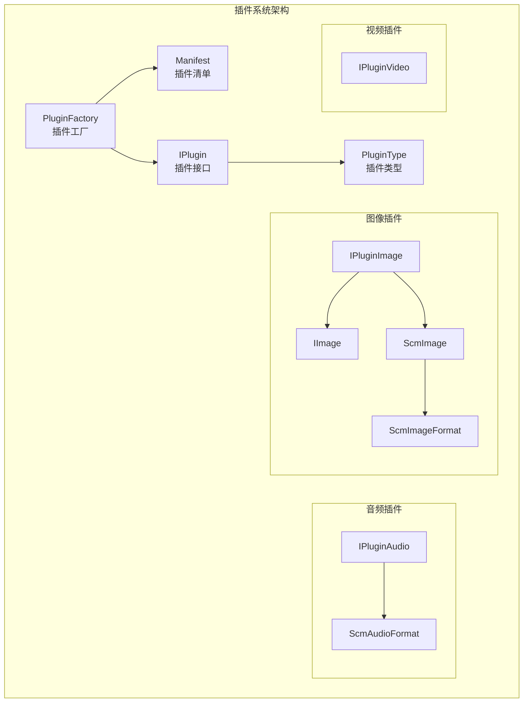
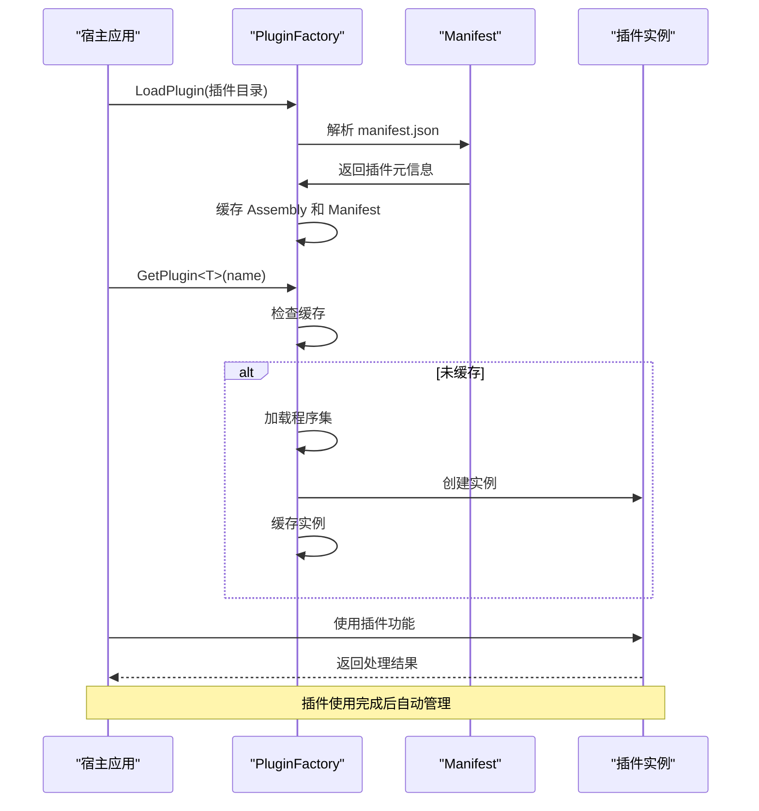
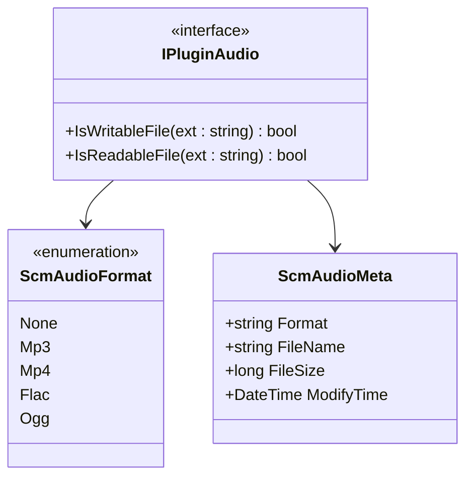
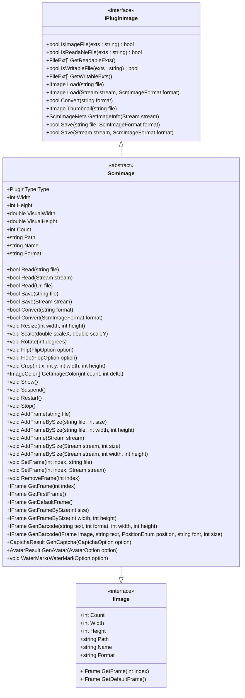
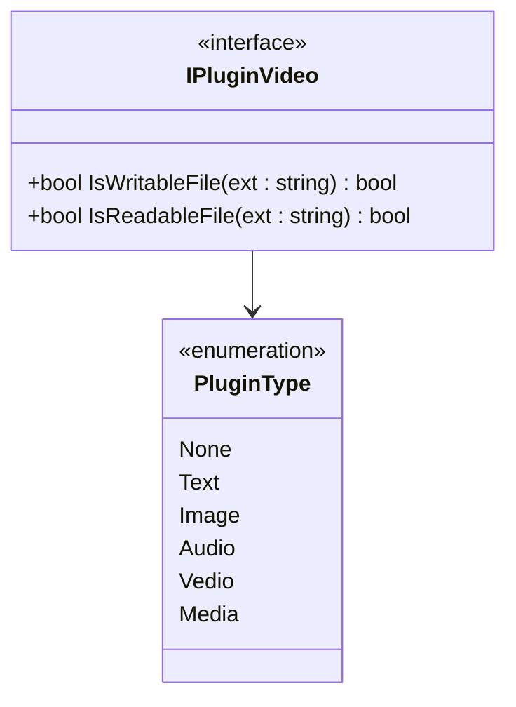
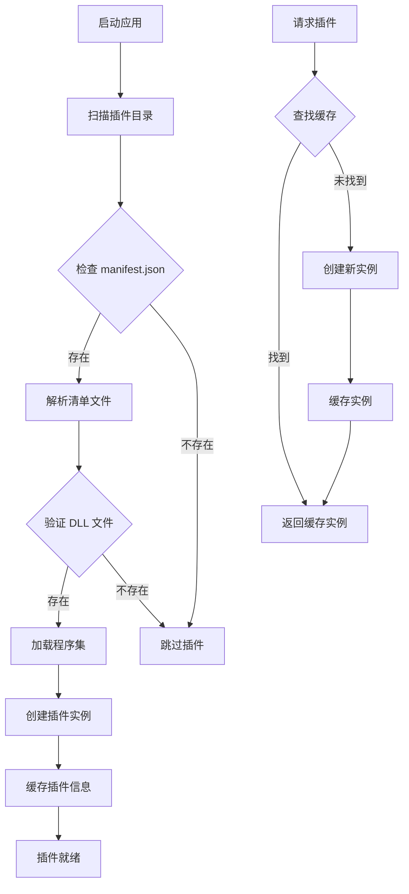

# 插件扩展系统

<cite>
**本文引用的文件**
- [Scm.Plugin/IPlugin.cs](file://Scm.Plugin/IPlugin.cs)
- [Scm.Plugin/PluginFactory.cs](file://Scm.Plugin/PluginFactory.cs)
- [Scm.Plugin/Manifest.cs](file://Scm.Plugin/Manifest.cs)
- [Scm.Plugin/PluginType.cs](file://Scm.Plugin/PluginType.cs)
- [Scm.Plugin/FileExt.cs](file://Scm.Plugin/FileExt.cs)
- [Scm.Plugin.Audio/IPluginAudio.cs](file://Scm.Plugin.Audio/IPluginAudio.cs)
- [Scm.Plugin.Audio/ScmAudioFormat.cs](file://Scm.Plugin.Audio/ScmAudioFormat.cs)
- [Scm.Plugin.Audio/ScmAudioMeta.cs](file://Scm.Plugin.Audio/ScmAudioMeta.cs)
- [Scm.Plugin.Audio/ScmAudio.cs](file://Scm.Plugin.Audio/ScmAudio.cs)
- [Scm.Plugin.Image/IPluginImage.cs](file://Scm.Plugin.Image/IPluginImage.cs)
- [Scm.Plugin.Image/IImage.cs](file://Scm.Plugin.Image/IImage.cs)
- [Scm.Plugin.Image/IFrame.cs](file://Scm.Plugin.Image/IFrame.cs)
- [Scm.Plugin.Image/ScmImage.cs](file://Scm.Plugin.Image/ScmImage.cs)
- [Scm.Plugin.Image/ScmImageFormat.cs](file://Scm.Plugin.Image/ScmImageFormat.cs)
- [Scm.Plugin.Video/IPluginVideo.cs](file://Scm.Plugin.Video/IPluginVideo.cs)
- [Scm.Plugin.Video/ScmVideo.cs](file://Scm.Plugin.Video/ScmVideo.cs)
</cite>

## 更新摘要
**所做更改**
- 更新插件架构设计章节，反映简化的插件系统结构
- 修订音频插件系统文档，移除过时的元数据处理章节
- 更新图像插件系统文档，简化接口说明和功能列表
- 修订视频插件系统文档，保持基础接口说明
- 更新插件注册与发现机制，反映当前实现细节
- 修订自定义插件开发指南，提供更实用的开发建议

## 目录
1. [简介](#简介)
2. [插件架构设计](#插件架构设计)
3. [音频插件系统](#音频插件系统)
4. [图像插件系统](#图像插件系统)
5. [视频插件系统](#视频插件系统)
6. [自定义插件开发指南](#自定义插件开发指南)
7. [插件注册与发现机制](#插件注册与发现机制)
8. [性能优化与并发控制](#性能优化与并发控制)
9. [故障排查与调试](#故障排查与调试)
10. [安全考虑与最佳实践](#安全考虑与最佳实践)
11. [总结与展望](#总结与展望)

## 简介
Scm.Net 插件扩展系统是一个高度模块化的架构，旨在为应用程序提供灵活的扩展能力。系统采用统一的插件接口设计、智能的工厂加载机制和可配置的清单模型，支持音频、图像、视频等多种媒体类型的处理能力。本文档将深入解析插件系统的架构设计理念、实现机制和使用方法，为开发者提供完整的插件开发指南。

## 插件架构设计

### 整体架构理念
插件系统采用分层架构设计，通过统一的接口契约和工厂模式实现松耦合的插件管理。系统的核心设计理念包括：

- **统一接口契约**：所有插件实现 IPlugin 接口，确保类型安全和一致性
- **工厂模式**：PluginFactory 负责插件的发现、加载和实例化管理
- **清单驱动**：通过 manifest.json 配置插件元信息，支持动态加载
- **类型安全**：PluginType 枚举确保插件分类的类型安全



**图表来源**
- [Scm.Plugin/PluginFactory.cs:8-148](file://Scm.Plugin/PluginFactory.cs#L8-L148)
- [Scm.Plugin/Manifest.cs:5-86](file://Scm.Plugin/Manifest.cs#L5-L86)
- [Scm.Plugin/IPlugin.cs:6-12](file://Scm.Plugin/IPlugin.cs#L6-L12)
- [Scm.Plugin/PluginType.cs:3-12](file://Scm.Plugin/PluginType.cs#L3-L12)

### 插件生命周期管理
插件系统实现了完整的生命周期管理，包括加载、初始化、使用和销毁阶段：



**图表来源**
- [Scm.Plugin/PluginFactory.cs:12-62](file://Scm.Plugin/PluginFactory.cs#L12-L62)
- [Scm.Plugin/PluginFactory.cs:64-97](file://Scm.Plugin/PluginFactory.cs#L64-L97)
- [Scm.Plugin/PluginFactory.cs:99-132](file://Scm.Plugin/PluginFactory.cs#L99-L132)

**章节来源**
- [Scm.Plugin/PluginFactory.cs:1-148](file://Scm.Plugin/PluginFactory.cs#L1-L148)
- [Scm.Plugin/Manifest.cs:1-86](file://Scm.Plugin/Manifest.cs#L1-L86)
- [Scm.Plugin/PluginType.cs:1-13](file://Scm.Plugin/PluginType.cs#L1-L13)

## 音频插件系统

### 接口设计与功能特性
音频插件系统基于 IPluginAudio 接口设计，提供基础的音频文件处理能力：

- **格式检测**：支持扩展名级别的可读/可写文件判断
- **基础音频处理**：提供音频文件的基本操作接口



**图表来源**
- [Scm.Plugin.Audio/IPluginAudio.cs:3-10](file://Scm.Plugin.Audio/IPluginAudio.cs#L3-L10)
- [Scm.Plugin.Audio/ScmAudioFormat.cs:3-12](file://Scm.Plugin.Audio/ScmAudioFormat.cs#L3-L12)
- [Scm.Plugin.Audio/ScmAudioMeta.cs:5-27](file://Scm.Plugin.Audio/ScmAudioMeta.cs#L5-L27)

### 音频格式支持矩阵
系统支持以下音频格式：

| 格式 | 扩展名 | 特性 | 用途 |
|------|--------|------|------|
| MP3 | .mp3 | 有损压缩 | 流媒体、存储 |
| MP4 | .mp4 | 多媒体容器 | 视频音频混合 |
| FLAC | .flac | 无损压缩 | 高质量音频 |
| OGG | .ogg | 开源格式 | 自由软件 |

**章节来源**
- [Scm.Plugin.Audio/IPluginAudio.cs:1-10](file://Scm.Plugin.Audio/IPluginAudio.cs#L1-L10)
- [Scm.Plugin.Audio/ScmAudioFormat.cs:1-12](file://Scm.Plugin.Audio/ScmAudioFormat.cs#L1-L12)
- [Scm.Plugin.Audio/ScmAudioMeta.cs:1-27](file://Scm.Plugin.Audio/ScmAudioMeta.cs#L1-L27)

## 图像插件系统

### 接口设计与功能特性
图像插件系统基于 IPluginImage 接口设计，提供完整的图像文件处理能力：

- **格式检测**：支持扩展名级别的可读/可写文件判断
- **图像加载**：支持从文件和流加载图像
- **图像保存**：支持多种格式的图像保存
- **基础处理**：提供缩略图生成和格式转换功能



**图表来源**
- [Scm.Plugin.Image/IPluginImage.cs:8-90](file://Scm.Plugin.Image/IPluginImage.cs#L8-L90)
- [Scm.Plugin.Image/IImage.cs:3-42](file://Scm.Plugin.Image/IImage.cs#L3-L42)
- [Scm.Plugin.Image/ScmImage.cs:12-234](file://Scm.Plugin.Image/ScmImage.cs#L12-L234)

### 图像格式支持矩阵
系统支持以下图像格式：

| 格式 | 扩展名 | 特性 | 应用场景 |
|------|--------|------|----------|
| JPEG | .jpg, .jpeg | 有损压缩，高压缩比 | 网络传输、照片存储 |
| PNG | .png | 无损压缩，支持透明 | 图标、图形设计 |
| GIF | .gif | 支持动画，有限色彩 | 简单动画、图标 |
| BMP | .bmp | 无压缩，质量最好 | 图像处理中间格式 |
| ICO | .ico | 图标格式 | 系统图标 |
| WebP | .webp | 新兴格式，更好的压缩 | 现代Web应用 |

### 高级图像处理功能
ScmImage 提供丰富的图像处理能力：

#### 几何变换
- **缩放**：支持等比例和指定尺寸缩放
- **旋转**：支持任意角度旋转
- **翻转/水平翻转**：支持垂直和水平方向翻转
- **裁剪**：支持矩形区域裁剪

#### 颜色处理
- **颜色提取**：支持主要颜色提取和色彩统计

#### 多帧处理
- **帧管理**：支持多帧图像的添加、删除、替换
- **帧尺寸**：支持按尺寸获取特定帧

#### 特效功能
- **条码生成**：支持多种条码格式生成
- **验证码生成**：支持多种验证码样式
- **头像生成**：支持个性化头像制作
- **水印添加**：支持文字和图片水印

**章节来源**
- [Scm.Plugin.Image/IPluginImage.cs:1-90](file://Scm.Plugin.Image/IPluginImage.cs#L1-L90)
- [Scm.Plugin.Image/IImage.cs:1-42](file://Scm.Plugin.Image/IImage.cs#L1-L42)
- [Scm.Plugin.Image/IFrame.cs:1-7](file://Scm.Plugin.Image/IFrame.cs#L1-L7)
- [Scm.Plugin.Image/ScmImage.cs:1-234](file://Scm.Plugin.Image/ScmImage.cs#L1-L234)
- [Scm.Plugin.Image/ScmImageFormat.cs:1-14](file://Scm.Plugin.Image/ScmImageFormat.cs#L1-L14)

## 视频插件系统

### 接口设计与扩展点
视频插件系统基于 IPluginVideo 接口设计，提供视频文件的基础处理能力：



**图表来源**
- [Scm.Plugin.Video/IPluginVideo.cs:3-10](file://Scm.Plugin.Video/IPluginVideo.cs#L3-L10)
- [Scm.Plugin/PluginType.cs:3-12](file://Scm.Plugin/PluginType.cs#L3-L12)

### 视频处理能力规划
当前版本提供视频插件的基础接口，后续可扩展以下功能：

- **格式支持**：支持主流视频格式的解码和编码
- **元数据提取**：提取视频分辨率、时长、帧率等信息
- **转码功能**：支持视频格式转换和质量调整
- **截图功能**：支持关键帧截图和指定时间截图
- **播放控制**：支持视频播放、暂停、快进等控制

**章节来源**
- [Scm.Plugin.Video/IPluginVideo.cs:1-10](file://Scm.Plugin.Video/IPluginVideo.cs#L1-L10)

## 自定义插件开发指南

### 开发环境准备
在开始插件开发之前，需要准备以下开发环境：

1. **开发工具**：Visual Studio 或 VS Code
2. **.NET Framework**：符合目标平台要求
3. **插件开发包**：引用 Scm.Plugin 相关程序集
4. **测试环境**：准备测试用的媒体文件

### 插件接口实现步骤

#### 第一步：创建插件类
```csharp
using Com.Scm.Plugin;
using Com.Scm.Plugin.Image; // 根据插件类型选择合适的命名空间

public class MyImagePlugin : IPluginImage
{
    public PluginType Type => PluginType.Image;
    
    public string Name => "MyImagePlugin";
    
    // 实现 IPluginImage 接口的所有方法
}
```

#### 第二步：实现核心功能
根据插件类型实现相应的接口方法：

**音频插件示例**：
```csharp
public bool IsReadableFile(string ext)
{
    var readableExts = new[] { ".mp3", ".wav", ".flac" };
    return readableExts.Contains(ext.ToLower());
}

public bool IsWritableFile(string ext)
{
    var writableExts = new[] { ".mp3", ".wav" };
    return writableExts.Contains(ext.ToLower());
}
```

**图像插件示例**：
```csharp
public IImage Load(string file)
{
    // 实现图像加载逻辑
    return new MyImageImplementation();
}

public bool Save(string file, ScmImageFormat format)
{
    // 实现图像保存逻辑
    return true;
}
```

#### 第三步：配置插件清单
创建 `manifest.json` 文件：

```json
{
    "type": "image",
    "dll": "MyPlugin.dll",
    "name": "MyImagePlugin",
    "title": "我的图像插件",
    "description": "这是一个自定义图像处理插件",
    "uri": "Com.MyCompany.MyImagePlugin",
    "entry": "",
    "args": "",
    "ver": "1.0.0",
    "singleton": true
}
```

### 插件开发最佳实践

#### 1. 接口实现规范
- **类型安全**：确保 Type 属性返回正确的 PluginType
- **命名规范**：Name 属性使用有意义的插件标识符
- **异常处理**：妥善处理文件不存在、格式不支持等异常情况

#### 2. 性能优化建议
- **延迟加载**：只在需要时才加载和初始化资源
- **内存管理**：及时释放图像、音频等大对象的内存
- **并发安全**：确保插件实例在多线程环境下安全使用

#### 3. 错误处理策略
```csharp
public IImage Load(string file)
{
    try
    {
        if (!File.Exists(file))
            throw new FileNotFoundException("文件不存在", file);
            
        // 处理逻辑
        return image;
    }
    catch (Exception ex)
    {
        // 记录日志
        throw new BusinessException($"图像加载失败: {ex.Message}", ex);
    }
}
```

### 插件配置管理

#### 清单配置详解
| 配置项 | 类型 | 必填 | 说明 |
|--------|------|------|------|
| type | string | 是 | 插件类型，对应 PluginType |
| dll | string | 是 | 插件程序集文件名 |
| name | string | 是 | 插件唯一标识符 |
| title | string | 否 | 插件显示名称 |
| description | string | 否 | 插件功能描述 |
| uri | string | 否 | 插件类的完整类型名 |
| entry | string | 否 | 入口类名（预留） |
| args | string | 否 | 初始化参数 |
| ver | string | 否 | 插件版本号 |
| singleton | boolean | 否 | 是否单例模式 |

#### 动态配置支持
插件可以支持运行时配置，通过 args 参数传递配置信息：

```csharp
// 在清单中配置
{
    "args": "quality=high&format=webp"
}

// 在插件中解析配置
public void Initialize(string config)
{
    var params = HttpUtility.ParseQueryString(config);
    var quality = params["quality"];
    var format = params["format"];
}
```

**章节来源**
- [Scm.Plugin/IPlugin.cs:1-13](file://Scm.Plugin/IPlugin.cs#L1-L13)
- [Scm.Plugin/PluginType.cs:1-13](file://Scm.Plugin/PluginType.cs#L1-L13)
- [Scm.Plugin/Manifest.cs:1-86](file://Scm.Plugin/Manifest.cs#L1-L86)

## 插件注册与发现机制

### 自动注册流程
插件系统实现了自动化的注册和发现机制：



**图表来源**
- [Scm.Plugin/PluginFactory.cs:12-62](file://Scm.Plugin/PluginFactory.cs#L12-L62)
- [Scm.Plugin/PluginFactory.cs:64-97](file://Scm.Plugin/PluginFactory.cs#L64-L97)

### 插件发现策略
系统采用以下策略进行插件发现：

1. **目录扫描**：遍历插件根目录下的所有子目录
2. **清单验证**：检查每个目录是否存在有效的 manifest.json
3. **程序集验证**：验证指定的 DLL 文件是否存在且有效
4. **类型匹配**：根据 type 和 name 字段进行插件匹配

### 实例化管理
插件实例化采用智能缓存策略：

- **单例模式**：适合无状态的纯函数式插件
- **多实例模式**：适合有状态或需要隔离的插件
- **延迟创建**：首次使用时才创建插件实例
- **自动回收**：系统自动管理插件实例的生命周期

**章节来源**
- [Scm.Plugin/PluginFactory.cs:1-148](file://Scm.Plugin/PluginFactory.cs#L1-L148)
- [Scm.Plugin/Manifest.cs:1-86](file://Scm.Plugin/Manifest.cs#L1-L86)

## 性能优化与并发控制

### 性能优化策略

#### 1. 程序集加载优化
- **延迟加载**：只在需要时才加载 DLL 文件
- **缓存机制**：缓存已加载的程序集和插件实例
- **预加载策略**：对于高频使用的插件可考虑预加载

#### 2. 内存管理优化
- **大对象池**：对于图像、音频等大对象使用对象池
- **及时释放**：确保及时释放非托管资源
- **内存监控**：定期监控插件的内存使用情况

#### 3. I/O 操作优化
- **异步处理**：使用异步 API 处理文件 I/O
- **流式处理**：对于大文件使用流式处理方式
- **批量操作**：支持批量文件处理以提高效率

### 并发控制机制

#### 线程安全设计
插件系统采用以下线程安全措施：

```csharp
public class ThreadSafePlugin
{
    private readonly object _lockObject = new object();
    private static volatile Dictionary<string, object> _cache;
    
    public T GetPlugin<T>(string name)
    {
        lock (_lockObject)
        {
            // 线程安全的插件获取逻辑
        }
    }
}
```

#### 异步处理支持
现代插件应支持异步操作：

```csharp
public async Task<IImage> LoadAsync(string file)
{
    return await Task.Run(() => Load(file));
}

public async Task<bool> SaveAsync(string file, ScmImageFormat format)
{
    return await Task.Run(() => Save(file, format));
}
```

### 性能监控指标
建议监控以下性能指标：

- **插件加载时间**：从发现到可用的时间
- **内存使用量**：插件实例的内存占用
- **CPU 使用率**：处理媒体文件时的 CPU 占用
- **I/O 操作次数**：文件读写的频率
- **错误率**：插件执行失败的比例

**章节来源**
- [Scm.Plugin/PluginFactory.cs:1-148](file://Scm.Plugin/PluginFactory.cs#L1-L148)

## 故障排查与调试

### 常见问题诊断

#### 1. 插件加载失败
**症状**：插件无法被发现或加载
**可能原因**：
- manifest.json 文件缺失或格式错误
- DLL 文件路径不正确或文件损坏
- 类型不匹配或程序集版本冲突

**解决方案**：
```csharp
// 检查插件目录结构
try
{
    var manifestPath = Path.Combine(pluginDir, "manifest.json");
    if (!File.Exists(manifestPath))
    {
        throw new FileNotFoundException("缺少清单文件", manifestPath);
    }
    
    var manifest = JsonConvert.DeserializeObject<Manifest>(File.ReadAllText(manifestPath));
    if (manifest == null)
    {
        throw new InvalidDataException("清单文件格式错误");
    }
}
catch (Exception ex)
{
    // 记录详细的错误信息
    Logger.LogError($"插件加载失败: {ex.Message}");
}
```

#### 2. 插件实例化失败
**症状**：插件被发现但无法创建实例
**可能原因**：
- 插件类没有实现必要的接口
- 插件构造函数抛出异常
- 插件依赖的外部库缺失

**解决方案**：
```csharp
public static T CreatePluginInstance<T>(Manifest manifest)
{
    try
    {
        var assembly = Assembly.LoadFrom(Path.Combine(manifest.dir, manifest.dll));
        var type = assembly.GetType(manifest.uri);
        var instance = Activator.CreateInstance(type);
        return (T)instance;
    }
    catch (Exception ex)
    {
        Logger.LogError($"插件实例化失败: {ex.Message}");
        return default(T);
    }
}
```

#### 3. 性能问题诊断
**症状**：插件处理速度慢或内存占用高
**诊断方法**：
- 使用性能分析工具监控插件性能
- 检查是否存在内存泄漏
- 分析 I/O 操作的瓶颈

### 调试技巧

#### 1. 日志记录
建议在插件中添加详细的日志记录：

```csharp
public class DebuggablePlugin
{
    private static readonly ILogger Logger = LoggerFactory.CreateLogger<DebuggablePlugin>();
    
    public bool ProcessFile(string file)
    {
        Logger.LogInformation($"开始处理文件: {file}");
        
        try
        {
            // 处理逻辑
            Logger.LogInformation($"文件处理完成: {file}");
            return true;
        }
        catch (Exception ex)
        {
            Logger.LogError($"文件处理失败: {ex.Message}");
            return false;
        }
    }
}
```

#### 2. 性能监控
实现简单的性能监控：

```csharp
public class MonitoredPlugin
{
    public Stopwatch Stopwatch { get; private set; } = new Stopwatch();
    
    public T Measure<T>(Func<T> operation)
    {
        Stopwatch.Restart();
        try
        {
            return operation();
        }
        finally
        {
            Stopwatch.Stop();
            Logger.LogInformation($"操作耗时: {Stopwatch.ElapsedMilliseconds}ms");
        }
    }
}
```

**章节来源**
- [Scm.Plugin/PluginFactory.cs:12-62](file://Scm.Plugin/PluginFactory.cs#L12-L62)
- [Scm.Plugin/PluginFactory.cs:64-97](file://Scm.Plugin/PluginFactory.cs#L64-L97)

## 安全考虑与最佳实践

### 安全威胁防护

#### 1. 路径遍历攻击
防止恶意用户通过特殊路径访问系统文件：

```csharp
public static string ValidateFilePath(string inputPath)
{
    // 移除路径遍历字符
    var cleanPath = inputPath.Replace("..", "").Replace("//", "/");
    
    // 验证路径是否在允许的范围内
    var absolutePath = Path.GetFullPath(cleanPath);
    var allowedBase = Path.GetFullPath(AppDomain.CurrentDomain.BaseDirectory);
    
    if (!absolutePath.StartsWith(allowedBase))
    {
        throw new SecurityException("访问的路径超出允许范围");
    }
    
    return absolutePath;
}
```

#### 2. 文件类型验证
严格验证文件扩展名和 MIME 类型：

```csharp
private static readonly HashSet<string> AllowedExtensions = new HashSet<string>
{
    ".jpg", ".jpeg", ".png", ".gif", ".bmp", ".webp"
};

public static bool ValidateFileType(string fileName)
{
    var extension = Path.GetExtension(fileName)?.ToLower();
    return AllowedExtensions.Contains(extension);
}
```

#### 3. 内存安全
防止大文件导致的内存溢出：

```csharp
public static void SafeProcessLargeFile(string filePath)
{
    const long MaxFileSize = 100 * 1024 * 1024; // 100MB
    
    var fileInfo = new FileInfo(filePath);
    if (fileInfo.Length > MaxFileSize)
    {
        throw new ArgumentException("文件过大，超过允许的最大大小");
    }
    
    // 使用流式处理大文件
    using (var stream = new FileStream(filePath, FileMode.Open, FileAccess.Read))
    {
        ProcessStream(stream);
    }
}
```

### 最佳实践指南

#### 1. 错误处理
实现健壮的错误处理机制：

```csharp
public class RobustPlugin
{
    public Result ProcessFile(string file)
    {
        try
        {
            // 主要处理逻辑
            return Result.Success();
        }
        catch (UnauthorizedAccessException)
        {
            return Result.Failure("权限不足");
        }
        catch (FileNotFoundException)
        {
            return Result.Failure("文件不存在");
        }
        catch (OutOfMemoryException)
        {
            return Result.Failure("内存不足");
        }
        catch (Exception ex)
        {
            Logger.LogError($"未知错误: {ex.Message}");
            return Result.Failure("处理失败");
        }
    }
}
```

#### 2. 资源管理
确保所有资源得到正确释放：

```csharp
public class ResourceManagedPlugin
{
    public void ProcessWithResource(string file)
    {
        FileStream fileStream = null;
        try
        {
            fileStream = new FileStream(file, FileMode.Open);
            // 处理逻辑
        }
        finally
        {
            fileStream?.Dispose();
        }
    }
}
```

#### 3. 配置安全
安全地处理敏感配置信息：

```csharp
public class SecureConfigPlugin
{
    private static readonly IConfiguration Configuration = 
        new ConfigurationBuilder()
            .AddJsonFile("appsettings.json")
            .AddEnvironmentVariables()
            .Build();
    
    public string GetSecureSetting(string key)
    {
        var value = Configuration[key];
        if (string.IsNullOrEmpty(value))
        {
            throw new InvalidOperationException($"配置项 {key} 不存在");
        }
        return value;
    }
}
```

### 安全审计清单

#### 开发阶段
- [ ] 实现输入验证和清理
- [ ] 添加适当的异常处理
- [ ] 实现资源管理和释放
- [ ] 添加日志记录和监控
- [ ] 实现单元测试和集成测试

#### 部署阶段
- [ ] 验证文件权限设置
- [ ] 检查依赖库版本
- [ ] 配置安全审计日志
- [ ] 实施访问控制
- [ ] 准备应急响应计划

**章节来源**
- [Scm.Plugin/PluginFactory.cs:1-148](file://Scm.Plugin/PluginFactory.cs#L1-L148)

## 总结与展望

### 系统优势总结
Scm.Net 插件扩展系统具有以下显著优势：

1. **架构清晰**：采用分层设计，接口契约明确
2. **扩展性强**：支持多种媒体类型的处理能力
3. **性能优秀**：智能缓存和延迟加载机制
4. **安全可靠**：完善的错误处理和安全防护
5. **易于使用**：简单直观的 API 设计

### 技术特色亮点
- **统一接口设计**：所有插件实现一致的接口契约
- **智能工厂模式**：自动发现、加载和管理插件
- **类型安全保证**：通过枚举和泛型确保类型安全
- **灵活的生命周期**：支持单例和多实例模式
- **完善的错误处理**：提供详细的错误信息和恢复机制

### 未来发展方向
1. **更多媒体格式支持**：扩展对新格式的支持
2. **云服务集成**：支持云端存储和处理
3. **AI 能力增强**：集成机器学习和深度学习能力
4. **微服务架构**：支持分布式插件部署
5. **实时处理**：支持流式和实时媒体处理

### 开发者建议
- 严格按照接口契约实现插件功能
- 注重性能优化和资源管理
- 实现完善的错误处理和日志记录
- 进行充分的测试和安全审计
- 关注插件的可维护性和可扩展性

通过遵循本文档的指导原则和最佳实践，开发者可以快速构建高质量的插件，为 Scm.Net 应用程序提供强大的扩展能力。