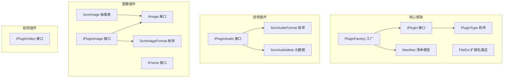
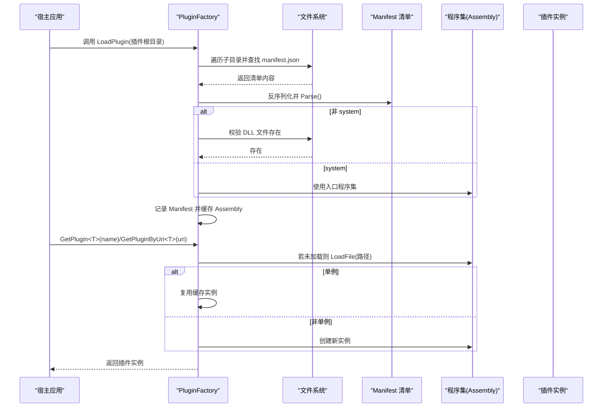
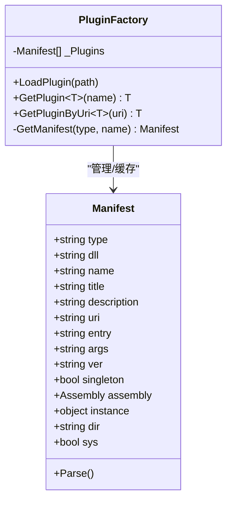
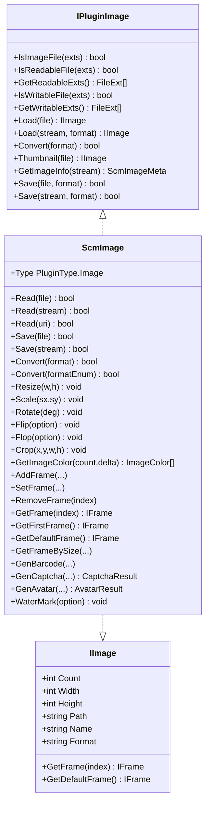
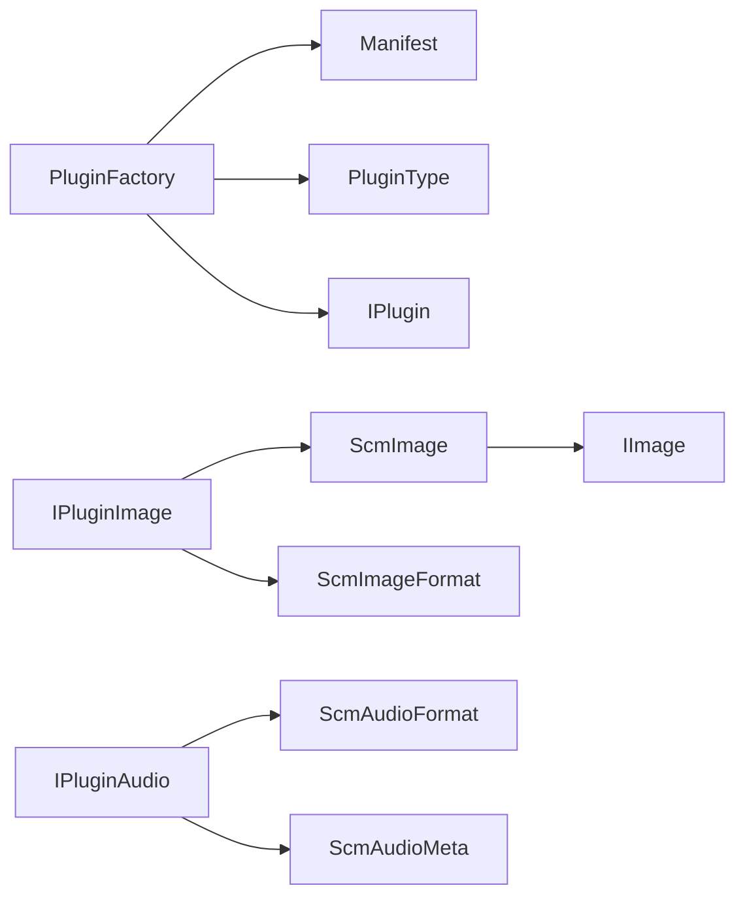

# 插件扩展系统

<cite>
**本文引用的文件**
- [Scm.Plugin/IPlugin.cs](file://Scm.Plugin/IPlugin.cs)
- [Scm.Plugin/PluginFactory.cs](file://Scm.Plugin/PluginFactory.cs)
- [Scm.Plugin/Manifest.cs](file://Scm.Plugin/Manifest.cs)
- [Scm.Plugin/PluginType.cs](file://Scm.Plugin/PluginType.cs)
- [Scm.Plugin/FileExt.cs](file://Scm.Plugin/FileExt.cs)
- [Scm.Plugin.Audio/IPluginAudio.cs](file://Scm.Plugin.Audio/IPluginAudio.cs)
- [Scm.Plugin.Audio/ScmAudioFormat.cs](file://Scm.Plugin.Audio/ScmAudioFormat.cs)
- [Scm.Plugin.Audio/ScmAudioMeta.cs](file://Scm.Plugin.Audio/ScmAudioMeta.cs)
- [Scm.Plugin.Image/IPluginImage.cs](file://Scm.Plugin.Image/IPluginImage.cs)
- [Scm.Plugin.Image/IImage.cs](file://Scm.Plugin.Image/IImage.cs)
- [Scm.Plugin.Image/IFrame.cs](file://Scm.Plugin.Image/IFrame.cs)
- [Scm.Plugin.Image/ScmImage.cs](file://Scm.Plugin.Image/ScmImage.cs)
- [Scm.Plugin.Image/ScmImageFormat.cs](file://Scm.Plugin.Image/ScmImageFormat.cs)
- [Scm.Plugin.Video/IPluginVideo.cs](file://Scm.Plugin.Video/IPluginVideo.cs)
</cite>

## 目录
1. [简介](#简介)
2. [项目结构](#项目结构)
3. [核心组件](#核心组件)
4. [架构总览](#架构总览)
5. [组件详解](#组件详解)
6. [依赖关系分析](#依赖关系分析)
7. [性能与并发](#性能与并发)
8. [故障排查指南](#故障排查指南)
9. [结论](#结论)
10. [附录：自定义插件开发指南](#附录自定义插件开发指南)

## 简介
本文件面向 Scm.Net 的插件扩展系统，系统性阐述插件接口设计、插件工厂与动态加载机制、音频/图像/视频插件的能力边界与使用方式，并提供自定义插件的开发步骤、最佳实践、性能与安全建议，以及可直接定位到源码的参考路径。

## 项目结构
插件体系由“核心插件框架”和“具体插件实现”两部分组成：
- 核心框架位于 Scm.Plugin，提供统一的插件接口、类型枚举、清单模型与工厂加载器。
- 具体插件实现分别在 Scm.Plugin.Audio、Scm.Plugin.Image、Scm.Plugin.Video 下，按领域划分职责。

图表来源
- [Scm.Plugin/IPlugin.cs:1-13](file://Scm.Plugin/IPlugin.cs#L1-L13)
- [Scm.Plugin/PluginType.cs:1-13](file://Scm.Plugin/PluginType.cs#L1-L13)
- [Scm.Plugin/Manifest.cs:1-86](file://Scm.Plugin/Manifest.cs#L1-L86)
- [Scm.Plugin/PluginFactory.cs:1-148](file://Scm.Plugin/PluginFactory.cs#L1-L148)
- [Scm.Plugin/FileExt.cs:1-10](file://Scm.Plugin/FileExt.cs#L1-L10)
- [Scm.Plugin.Audio/IPluginAudio.cs:1-10](file://Scm.Plugin.Audio/IPluginAudio.cs#L1-L10)
- [Scm.Plugin.Audio/ScmAudioFormat.cs:1-12](file://Scm.Plugin.Audio/ScmAudioFormat.cs#L1-L12)
- [Scm.Plugin.Audio/ScmAudioMeta.cs:1-27](file://Scm.Plugin.Audio/ScmAudioMeta.cs#L1-L27)
- [Scm.Plugin.Image/IPluginImage.cs:1-90](file://Scm.Plugin.Image/IPluginImage.cs#L1-L90)
- [Scm.Plugin.Image/IImage.cs:1-42](file://Scm.Plugin.Image/IImage.cs#L1-L42)
- [Scm.Plugin.Image/IFrame.cs:1-7](file://Scm.Plugin.Image/IFrame.cs#L1-L7)
- [Scm.Plugin.Image/ScmImage.cs:1-234](file://Scm.Plugin.Image/ScmImage.cs#L1-L234)
- [Scm.Plugin.Image/ScmImageFormat.cs:1-14](file://Scm.Plugin.Image/ScmImageFormat.cs#L1-L14)
- [Scm.Plugin.Video/IPluginVideo.cs](file://Scm.Plugin.Video/IPluginVideo.cs)

章节来源
- [Scm.Plugin/IPlugin.cs:1-13](file://Scm.Plugin/IPlugin.cs#L1-L13)
- [Scm.Plugin/PluginFactory.cs:1-148](file://Scm.Plugin/PluginFactory.cs#L1-L148)
- [Scm.Plugin/Manifest.cs:1-86](file://Scm.Plugin/Manifest.cs#L1-L86)
- [Scm.Plugin/PluginType.cs:1-13](file://Scm.Plugin/PluginType.cs#L1-L13)
- [Scm.Plugin/FileExt.cs:1-10](file://Scm.Plugin/FileExt.cs#L1-L10)

## 核心组件
- 插件接口 IPlugin：统一声明 Type 与 Name，作为所有插件的最小契约。
- 插件类型 PluginType：定义插件分类（如 Image、Audio、Vedio、Media 等）。
- 清单 Manifest：描述插件的元信息、程序集、入口类、是否单例等；支持解析“system”内置场景。
- 插件工厂 PluginFactory：负责扫描插件目录、解析 manifest.json、按需加载程序集、缓存 Assembly 与实例、支持按名称或 URI 获取插件实例。
- 扩展名 FileExt：用于描述可读/可写文件类型的扩展名与描述。

章节来源
- [Scm.Plugin/IPlugin.cs:1-13](file://Scm.Plugin/IPlugin.cs#L1-L13)
- [Scm.Plugin/PluginType.cs:1-13](file://Scm.Plugin/PluginType.cs#L1-L13)
- [Scm.Plugin/Manifest.cs:1-86](file://Scm.Plugin/Manifest.cs#L1-L86)
- [Scm.Plugin/PluginFactory.cs:1-148](file://Scm.Plugin/PluginFactory.cs#L1-L148)
- [Scm.Plugin/FileExt.cs:1-10](file://Scm.Plugin/FileExt.cs#L1-L10)

## 架构总览
下图展示从“插件目录扫描”到“按需实例化”的完整流程，以及插件接口与实现之间的关系。

图表来源
- [Scm.Plugin/PluginFactory.cs:12-62](file://Scm.Plugin/PluginFactory.cs#L12-L62)
- [Scm.Plugin/PluginFactory.cs:64-97](file://Scm.Plugin/PluginFactory.cs#L64-L97)
- [Scm.Plugin/PluginFactory.cs:99-132](file://Scm.Plugin/PluginFactory.cs#L99-L132)
- [Scm.Plugin/Manifest.cs:76-84](file://Scm.Plugin/Manifest.cs#L76-L84)

章节来源
- [Scm.Plugin/PluginFactory.cs:1-148](file://Scm.Plugin/PluginFactory.cs#L1-L148)
- [Scm.Plugin/Manifest.cs:1-86](file://Scm.Plugin/Manifest.cs#L1-L86)

## 组件详解

### 插件接口与类型
- IPlugin：所有插件必须实现 Type 与 Name，便于工厂按类型与名称匹配。
- PluginType：对插件进行分类，当前包含 None、Text、Image、Audio、Vedio、Media。

章节来源
- [Scm.Plugin/IPlugin.cs:1-13](file://Scm.Plugin/IPlugin.cs#L1-L13)
- [Scm.Plugin/PluginType.cs:1-13](file://Scm.Plugin/PluginType.cs#L1-L13)

### 清单模型 Manifest
- 字段覆盖：type、dll、name、title、description、uri、entry、args、ver、singleton。
- 运行时字段：assembly、instance、dir、sys；其中 sys 标记决定是否使用入口程序集。
- Parse()：将“system”标记解析为使用入口程序集，避免额外 DLL 加载。

章节来源
- [Scm.Plugin/Manifest.cs:1-86](file://Scm.Plugin/Manifest.cs#L1-L86)

### 插件工厂 PluginFactory
- LoadPlugin(path)：扫描插件目录，解析每个子目录下的 manifest.json，校验 DLL 存在性，记录 Manifest 并缓存 Assembly。
- GetPlugin<T>(name) / GetPluginByUri<T>(uri)：根据类型名与名称/URI 查找 Manifest，按需加载程序集，支持单例与多例两种模式，缓存实例以复用。

图表来源
- [Scm.Plugin/Manifest.cs:5-84](file://Scm.Plugin/Manifest.cs#L5-L84)
- [Scm.Plugin/PluginFactory.cs:8-146](file://Scm.Plugin/PluginFactory.cs#L8-L146)

章节来源
- [Scm.Plugin/PluginFactory.cs:1-148](file://Scm.Plugin/PluginFactory.cs#L1-L148)
- [Scm.Plugin/Manifest.cs:1-86](file://Scm.Plugin/Manifest.cs#L1-L86)

### 音频插件
- IPluginAudio：继承 IPlugin，声明可读/可写扩展判断能力，用于判定扩展名是否受支持。
- ScmAudioFormat：枚举支持的音频格式（如 Mp3、Mp4、Flac、Ogg）。
- ScmAudioMeta：提供音频元数据字段（格式、文件名、大小、修改时间）。

章节来源
- [Scm.Plugin.Audio/IPluginAudio.cs:1-10](file://Scm.Plugin.Audio/IPluginAudio.cs#L1-L10)
- [Scm.Plugin.Audio/ScmAudioFormat.cs:1-12](file://Scm.Plugin.Audio/ScmAudioFormat.cs#L1-L12)
- [Scm.Plugin.Audio/ScmAudioMeta.cs:1-27](file://Scm.Plugin.Audio/ScmAudioMeta.cs#L1-L27)

### 图像插件
- IPluginImage：继承 IPlugin，提供图像文件的可读/可写扩展判断、读取、转换、缩略图、信息提取、保存等能力；支持多种格式枚举。
- IImage：抽象图像对象的帧数、尺寸、路径、名称、格式等属性与基本存取。
- IFrame：帧抽象接口（具体实现位于图像模块内部命名空间）。
- ScmImage：抽象图像类，实现 IImage，提供读取/保存、格式转换、缩放/旋转/翻转/裁剪、颜色提取、多帧管理、条码/验证码/头像/水印等高级操作。
- ScmImageFormat：枚举支持的图像格式（如 Jpg、Png、Gif、Bmp、Ico、WebP）。

图表来源
- [Scm.Plugin.Image/IPluginImage.cs:1-90](file://Scm.Plugin.Image/IPluginImage.cs#L1-L90)
- [Scm.Plugin.Image/IImage.cs:1-42](file://Scm.Plugin.Image/IImage.cs#L1-L42)
- [Scm.Plugin.Image/ScmImage.cs:1-234](file://Scm.Plugin.Image/ScmImage.cs#L1-L234)
- [Scm.Plugin.Image/ScmImageFormat.cs:1-14](file://Scm.Plugin.Image/ScmImageFormat.cs#L1-L14)

章节来源
- [Scm.Plugin.Image/IPluginImage.cs:1-90](file://Scm.Plugin.Image/IPluginImage.cs#L1-L90)
- [Scm.Plugin.Image/IImage.cs:1-42](file://Scm.Plugin.Image/IImage.cs#L1-L42)
- [Scm.Plugin.Image/IFrame.cs:1-7](file://Scm.Plugin.Image/IFrame.cs#L1-L7)
- [Scm.Plugin.Image/ScmImage.cs:1-234](file://Scm.Plugin.Image/ScmImage.cs#L1-L234)
- [Scm.Plugin.Image/ScmImageFormat.cs:1-14](file://Scm.Plugin.Image/ScmImageFormat.cs#L1-L14)

### 视频插件
- IPluginVideo：继承 IPlugin，作为视频插件的统一接口契约（当前文件仅声明接口，具体实现与能力由各视频插件实现提供）。

章节来源
- [Scm.Plugin.Video/IPluginVideo.cs](file://Scm.Plugin.Video/IPluginVideo.cs)

## 依赖关系分析
- 插件工厂依赖清单模型与程序集加载；通过 Manifest 的 type/name/uri 等字段完成插件定位与实例化。
- 图像插件实现 IPluginImage，并以 ScmImage 抽象类承载通用图像处理能力；IImage 作为图像对象的最小契约。
- 音频插件以 IPluginAudio 为契约，结合 ScmAudioFormat、ScmAudioMeta 提供格式与元数据支撑。
- 视频插件以 IPluginVideo 为契约，后续可扩展具体能力。

图表来源
- [Scm.Plugin/PluginFactory.cs:1-148](file://Scm.Plugin/PluginFactory.cs#L1-L148)
- [Scm.Plugin/Manifest.cs:1-86](file://Scm.Plugin/Manifest.cs#L1-L86)
- [Scm.Plugin/PluginType.cs:1-13](file://Scm.Plugin/PluginType.cs#L1-L13)
- [Scm.Plugin/IPlugin.cs:1-13](file://Scm.Plugin/IPlugin.cs#L1-L13)
- [Scm.Plugin.Image/IPluginImage.cs:1-90](file://Scm.Plugin.Image/IPluginImage.cs#L1-L90)
- [Scm.Plugin.Image/ScmImage.cs:1-234](file://Scm.Plugin.Image/ScmImage.cs#L1-L234)
- [Scm.Plugin.Image/IImage.cs:1-42](file://Scm.Plugin.Image/IImage.cs#L1-L42)
- [Scm.Plugin.Image/ScmImageFormat.cs:1-14](file://Scm.Plugin.Image/ScmImageFormat.cs#L1-L14)
- [Scm.Plugin.Audio/IPluginAudio.cs:1-10](file://Scm.Plugin.Audio/IPluginAudio.cs#L1-L10)
- [Scm.Plugin.Audio/ScmAudioFormat.cs:1-12](file://Scm.Plugin.Audio/ScmAudioFormat.cs#L1-L12)
- [Scm.Plugin.Audio/ScmAudioMeta.cs:1-27](file://Scm.Plugin.Audio/ScmAudioMeta.cs#L1-L27)

章节来源
- [Scm.Plugin/PluginFactory.cs:1-148](file://Scm.Plugin/PluginFactory.cs#L1-L148)
- [Scm.Plugin/Manifest.cs:1-86](file://Scm.Plugin/Manifest.cs#L1-L86)
- [Scm.Plugin/PluginType.cs:1-13](file://Scm.Plugin/PluginType.cs#L1-L13)
- [Scm.Plugin/IPlugin.cs:1-13](file://Scm.Plugin/IPlugin.cs#L1-L13)
- [Scm.Plugin.Image/IPluginImage.cs:1-90](file://Scm.Plugin.Image/IPluginImage.cs#L1-L90)
- [Scm.Plugin.Image/ScmImage.cs:1-234](file://Scm.Plugin.Image/ScmImage.cs#L1-L234)
- [Scm.Plugin.Image/IImage.cs:1-42](file://Scm.Plugin.Image/IImage.cs#L1-L42)
- [Scm.Plugin.Image/ScmImageFormat.cs:1-14](file://Scm.Plugin.Image/ScmImageFormat.cs#L1-L14)
- [Scm.Plugin.Audio/IPluginAudio.cs:1-10](file://Scm.Plugin.Audio/IPluginAudio.cs#L1-L10)
- [Scm.Plugin.Audio/ScmAudioFormat.cs:1-12](file://Scm.Plugin.Audio/ScmAudioFormat.cs#L1-L12)
- [Scm.Plugin.Audio/ScmAudioMeta.cs:1-27](file://Scm.Plugin.Audio/ScmAudioMeta.cs#L1-L27)

## 性能与并发
- 单例与实例复用：工厂在单例模式下缓存实例，减少重复创建开销；非单例模式按需创建，适合有状态场景。
- 程序集延迟加载：首次请求时才加载 DLL 并缓存 Assembly，降低启动时延。
- 扫描策略：按目录扫描并解析 manifest.json，建议将插件按功能拆分到独立子目录，避免过多 IO 开销。
- I/O 密集：图像/音频处理通常涉及大量磁盘与内存操作，建议在高并发场景中限制同时处理的任务数量，或采用异步/队列化策略。

## 故障排查指南
- 清单缺失：若插件目录缺少 manifest.json 或内容无法反序列化，工厂会跳过该插件。
- DLL 不存在：非 system 插件需确保 dll 字段指向的文件存在，否则跳过。
- 类型不匹配：GetPlugin<T> 依赖 type/name 匹配，若类型名不一致或名称不匹配，返回默认值。
- 单例/多例误用：确认 Manifest 中 singleton 标志，避免在需要多实例的场景误用单例缓存。
- 系统插件：当 dll 为“system”时，使用入口程序集，确保宿主应用已正确发布所需类型。

章节来源
- [Scm.Plugin/PluginFactory.cs:12-62](file://Scm.Plugin/PluginFactory.cs#L12-L62)
- [Scm.Plugin/PluginFactory.cs:64-97](file://Scm.Plugin/PluginFactory.cs#L64-L97)
- [Scm.Plugin/PluginFactory.cs:99-132](file://Scm.Plugin/PluginFactory.cs#L99-L132)
- [Scm.Plugin/Manifest.cs:76-84](file://Scm.Plugin/Manifest.cs#L76-L84)

## 结论
Scm.Net 的插件系统以清晰的接口契约、可配置的清单模型与灵活的工厂加载机制为核心，既支持系统内建插件，也支持外部插件扩展。图像与音频插件提供了完善的格式支持与元数据能力，为上层业务提供稳定可靠的媒体处理基础。遵循本文的开发与集成指南，可快速构建高质量的自定义插件。

## 附录：自定义插件开发指南

### 一、接口与类型约定
- 插件类需实现 IPlugin，至少提供 Type 与 Name。
- 在 PluginType 中选择合适的分类（如 Image、Audio、Vedio、Media）。
- 若为系统内建插件，清单中的 dll 设置为“system”，否则指向实际 DLL 文件。

章节来源
- [Scm.Plugin/IPlugin.cs:1-13](file://Scm.Plugin/IPlugin.cs#L1-L13)
- [Scm.Plugin/PluginType.cs:1-13](file://Scm.Plugin/PluginType.cs#L1-L13)
- [Scm.Plugin/Manifest.cs:76-84](file://Scm.Plugin/Manifest.cs#L76-L84)

### 二、清单与目录结构
- 在插件根目录下，为每个插件创建一个子目录，并在其中放置 manifest.json。
- manifest.json 必须包含 type、dll、name、title、description、uri、entry、args、ver、singleton 等字段。
- 非 system 插件需确保 dll 指向的文件存在于同一目录。

章节来源
- [Scm.Plugin/PluginFactory.cs:12-62](file://Scm.Plugin/PluginFactory.cs#L12-L62)
- [Scm.Plugin/Manifest.cs:1-86](file://Scm.Plugin/Manifest.cs#L1-L86)

### 三、注册、发现与加载
- 宿主应用调用 PluginFactory.LoadPlugin(插件根目录)，扫描并解析清单，缓存 Assembly。
- 通过 PluginFactory.GetPlugin<T>(name) 或 GetPluginByUri<T>(uri) 获取插件实例。
- 单例模式下复用缓存实例；非单例模式每次创建新实例。

章节来源
- [Scm.Plugin/PluginFactory.cs:12-62](file://Scm.Plugin/PluginFactory.cs#L12-L62)
- [Scm.Plugin/PluginFactory.cs:64-97](file://Scm.Plugin/PluginFactory.cs#L64-L97)
- [Scm.Plugin/PluginFactory.cs:99-132](file://Scm.Plugin/PluginFactory.cs#L99-L132)

### 四、音频插件开发要点
- 实现 IPluginAudio，提供扩展名可读/可写判断。
- 使用 ScmAudioFormat 与 ScmAudioMeta 描述格式与元数据。
- 在 manifest.json 中设置 type 对应音频类型，entry 指向插件入口类。

章节来源
- [Scm.Plugin.Audio/IPluginAudio.cs:1-10](file://Scm.Plugin.Audio/IPluginAudio.cs#L1-L10)
- [Scm.Plugin.Audio/ScmAudioFormat.cs:1-12](file://Scm.Plugin.Audio/ScmAudioFormat.cs#L1-L12)
- [Scm.Plugin.Audio/ScmAudioMeta.cs:1-27](file://Scm.Plugin.Audio/ScmAudioMeta.cs#L1-L27)

### 五、图像插件开发要点
- 实现 IPluginImage，提供可读/可写扩展集合、读取/保存/转换/缩略图/信息提取等能力。
- 若基于 ScmImage 抽象类，可直接获得丰富的图像处理方法与多帧管理能力。
- 使用 ScmImageFormat 描述支持的图像格式。

章节来源
- [Scm.Plugin.Image/IPluginImage.cs:1-90](file://Scm.Plugin.Image/IPluginImage.cs#L1-L90)
- [Scm.Plugin.Image/ScmImage.cs:1-234](file://Scm.Plugin.Image/ScmImage.cs#L1-L234)
- [Scm.Plugin.Image/ScmImageFormat.cs:1-14](file://Scm.Plugin.Image/ScmImageFormat.cs#L1-L14)

### 六、视频插件开发要点
- 实现 IPluginVideo，作为视频插件的统一接口契约。
- 后续可扩展具体能力，如格式支持、元数据提取、转码等。

章节来源
- [Scm.Plugin.Video/IPluginVideo.cs](file://Scm.Plugin.Video/IPluginVideo.cs)

### 七、最佳实践
- 将不同功能的插件拆分为独立子目录，便于维护与按需加载。
- 在清单中明确 singleton 标志，避免共享状态导致的竞态问题。
- 对大文件处理采用异步与流式读写，避免阻塞主线程。
- 对外暴露能力尽量幂等与可重入，提升并发安全性。

### 八、安全注意事项
- 严格校验输入文件路径与扩展名，防止路径穿越与非法文件加载。
- 对第三方 DLL 的来源与完整性进行验证，避免加载恶意程序集。
- 控制插件权限范围，避免越权访问系统资源。