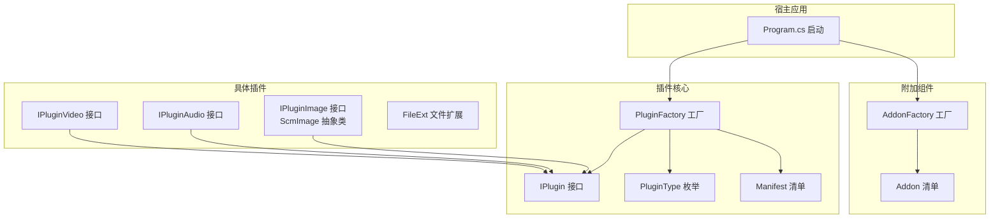
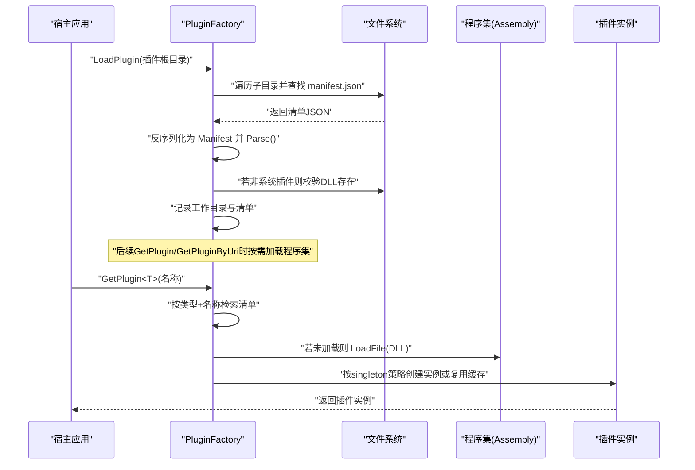
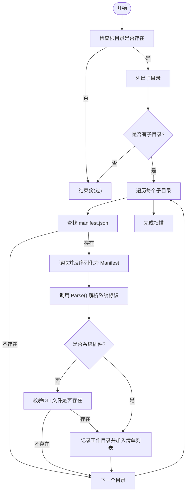
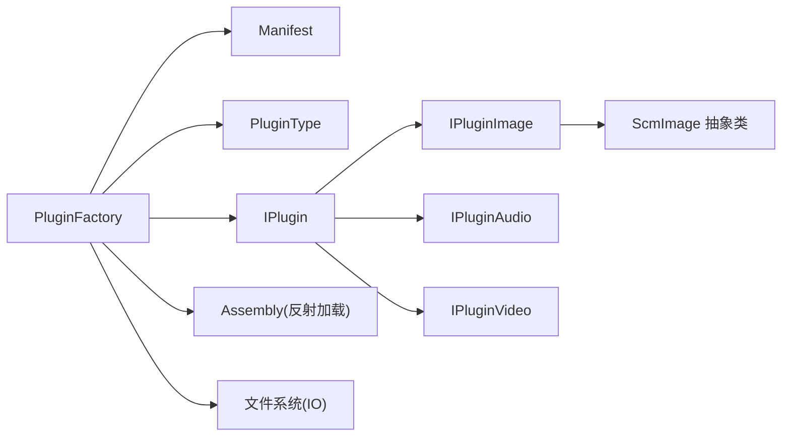

# 插件架构设计

<cite>
**本文引用的文件**
- [IPlugin.cs](file://Scm.Plugin/IPlugin.cs)
- [PluginFactory.cs](file://Scm.Plugin/PluginFactory.cs)
- [Manifest.cs](file://Scm.Plugin/Manifest.cs)
- [PluginType.cs](file://Scm.Plugin/PluginType.cs)
- [FileExt.cs](file://Scm.Plugin/FileExt.cs)
- [IPluginAudio.cs](file://Scm.Plugin.Audio/IPluginAudio.cs)
- [IPluginImage.cs](file://Scm.Plugin.Image/IPluginImage.cs)
- [IPluginVideo.cs](file://Scm.Plugin.Video/IPluginVideo.cs)
- [ScmImage.cs](file://Scm.Plugin.Image/ScmImage.cs)
- [Program.cs](file://Scm.Net/Program.cs)
- [AddonFactory.cs](file://Scm.Addon/AddonFactory.cs)
- [Manifest.cs](file://Scm.Addon/Manifest.cs)
</cite>

## 目录
1. [引言](#引言)
2. [项目结构](#项目结构)
3. [核心组件](#核心组件)
4. [架构总览](#架构总览)
5. [详细组件分析](#详细组件分析)
6. [依赖分析](#依赖分析)
7. [性能考虑](#性能考虑)
8. [故障排查指南](#故障排查指南)
9. [结论](#结论)
10. [附录](#附录)

## 引言
本文件面向 Scm.Net 的插件架构设计，系统化阐述插件系统的核心理念与实现细节，包括 IPlugin 接口的职责边界、PluginFactory 工厂模式的加载与实例化机制、插件类型体系与清单（Manifest）规范、生命周期与注册流程、动态加载策略、版本与依赖管理建议，以及扩展性与最佳实践。文档同时提供架构图与关键流程图，帮助读者快速理解并正确使用该插件框架。

## 项目结构
Scm.Net 将插件能力抽象在独立的库中，并通过工厂与清单驱动运行时装配；同时保留“附加组件”（Addon）体系作为另一种扩展形态。核心模块分布如下：
- 插件核心：Scm.Plugin（接口、工厂、清单、类型枚举）
- 具体插件实现：Scm.Plugin.Image、Scm.Plugin.Audio、Scm.Plugin.Video 等
- 附加组件：Scm.Addon（与插件体系并行）
- 启动入口：Scm.Net/Program.cs（应用启动与服务注册）

图表来源
- [IPlugin.cs:1-12](file://Scm.Plugin/IPlugin.cs#L1-L12)
- [PluginFactory.cs:1-147](file://Scm.Plugin/PluginFactory.cs#L1-L147)
- [Manifest.cs:1-86](file://Scm.Plugin/Manifest.cs#L1-L86)
- [PluginType.cs:1-12](file://Scm.Plugin/PluginType.cs#L1-L12)
- [IPluginImage.cs:1-90](file://Scm.Plugin.Image/IPluginImage.cs#L1-L90)
- [ScmImage.cs:1-234](file://Scm.Plugin.Image/ScmImage.cs#L1-L234)
- [IPluginAudio.cs:1-10](file://Scm.Plugin.Audio/IPluginAudio.cs#L1-L10)
- [IPluginVideo.cs:1-10](file://Scm.Plugin.Video/IPluginVideo.cs#L1-L10)
- [FileExt.cs:1-10](file://Scm.Plugin/FileExt.cs#L1-L10)
- [AddonFactory.cs:1-145](file://Scm.Addon/AddonFactory.cs#L1-L145)
- [Manifest.cs:1-85](file://Scm.Addon/Manifest.cs#L1-L85)
- [Program.cs:1-366](file://Scm.Net/Program.cs#L1-L366)

章节来源
- [Program.cs:1-366](file://Scm.Net/Program.cs#L1-L366)

## 核心组件
- IPlugin 接口：定义插件的基本属性（类型、名称），作为所有插件实现的统一契约。
- PluginFactory 工厂：负责扫描插件目录、解析清单、按需加载程序集、缓存程序集与实例、支持单例与多例两种生命周期。
- Manifest 清单：描述插件元数据（类型、DLL、名称、标题、说明、类路径、入口、参数、版本、是否单例、系统标识等），并提供解析逻辑以识别系统级插件。
- PluginType 枚举：对插件进行分类（如 Image、Audio、Vedio、Media 等），用于工厂按类型检索。
- 具体插件接口与实现：如 IPluginImage、IPluginAudio、IPluginVideo，以及 ScmImage 抽象类，体现不同领域插件的能力边界与通用行为。
- 附加组件（Addon）：与插件体系并行存在，采用类似的清单与工厂机制，便于区分“功能型插件”与“附加型扩展”。

章节来源
- [IPlugin.cs:1-12](file://Scm.Plugin/IPlugin.cs#L1-L12)
- [PluginFactory.cs:1-147](file://Scm.Plugin/PluginFactory.cs#L1-L147)
- [Manifest.cs:1-86](file://Scm.Plugin/Manifest.cs#L1-L86)
- [PluginType.cs:1-12](file://Scm.Plugin/PluginType.cs#L1-L12)
- [IPluginImage.cs:1-90](file://Scm.Plugin.Image/IPluginImage.cs#L1-L90)
- [ScmImage.cs:1-234](file://Scm.Plugin.Image/ScmImage.cs#L1-L234)
- [IPluginAudio.cs:1-10](file://Scm.Plugin.Audio/IPluginAudio.cs#L1-L10)
- [IPluginVideo.cs:1-10](file://Scm.Plugin.Video/IPluginVideo.cs#L1-L10)
- [FileExt.cs:1-10](file://Scm.Plugin/FileExt.cs#L1-L10)
- [AddonFactory.cs:1-145](file://Scm.Addon/AddonFactory.cs#L1-L145)
- [Manifest.cs:1-85](file://Scm.Addon/Manifest.cs#L1-L85)

## 架构总览
下图展示插件系统从发现到使用的端到端流程，包括清单解析、程序集加载、实例创建与缓存、以及按类型/名称/URI 的检索路径。

图表来源
- [PluginFactory.cs:12-62](file://Scm.Plugin/PluginFactory.cs#L12-L62)
- [PluginFactory.cs:64-97](file://Scm.Plugin/PluginFactory.cs#L64-L97)
- [PluginFactory.cs:99-132](file://Scm.Plugin/PluginFactory.cs#L99-L132)
- [Manifest.cs:76-83](file://Scm.Plugin/Manifest.cs#L76-L83)

## 详细组件分析

### IPlugin 接口与职责
- 角色定位：所有插件实现必须遵循的最小契约，提供类型与名称两个关键维度，便于工厂按类型与名称检索。
- 设计要点：接口保持极简，避免过早绑定具体能力，确保扩展性与低耦合。

章节来源
- [IPlugin.cs:1-12](file://Scm.Plugin/IPlugin.cs#L1-L12)

### PluginFactory 工厂模式与动态加载
- 发现机制：扫描指定根目录下的每个子目录，期望存在 manifest.json；解析后调用 Parse() 以识别系统插件。
- 加载策略：
  - 非系统插件：校验 DLL 文件存在后，按需通过 LoadFile 动态加载程序集。
  - 系统插件：dll 指定为 system 时，直接使用入口程序集（即宿主程序集）。
- 实例化策略：
  - 单例：首次创建后缓存实例，后续直接返回缓存对象。
  - 多例：每次创建新实例，适合无状态或轻量级操作。
- 检索接口：
  - GetPlugin<T>(name)：按接口类型名与插件名称匹配。
  - GetPluginByUri<T>(uri)：按接口类型名与类路径（uri）匹配。
- 错误处理：当目录不存在、清单无效、DLL 缺失或实例创建失败时，工厂会跳过该插件并继续处理其他插件。

图表来源
- [PluginFactory.cs:12-62](file://Scm.Plugin/PluginFactory.cs#L12-L62)
- [Manifest.cs:76-83](file://Scm.Plugin/Manifest.cs#L76-L83)

章节来源
- [PluginFactory.cs:1-147](file://Scm.Plugin/PluginFactory.cs#L1-L147)
- [Manifest.cs:1-86](file://Scm.Plugin/Manifest.cs#L1-L86)

### Manifest 清单与配置项
- 关键字段：
  - type：插件类型（与 PluginType 对应）
  - dll：程序集文件名；当值为 system 时表示系统插件
  - name/title/description：插件标识与描述
  - uri：类的完整类型路径（用于实例化）
  - entry：入口预留字段（当前与 uri 行为类似）
  - args：参数（预留）
  - ver：版本号（建议使用 semver）
  - singleton：是否单例
  - sys：Parse() 后的系统标识
  - assembly/dir/instance：运行时缓存字段（非序列化）
- 解析逻辑：Parse() 将 dll 与 system 比较，若相等则标记为系统插件，并将 assembly 指向入口程序集。

章节来源
- [Manifest.cs:1-86](file://Scm.Plugin/Manifest.cs#L1-L86)
- [Manifest.cs:1-85](file://Scm.Addon/Manifest.cs#L1-L85)

### 插件类型体系与分类
- PluginType 枚举：None、Text、Image、Audio、Vedio、Media，用于区分插件领域与能力边界。
- 具体插件接口：
  - IPluginImage：图片读写、格式转换、缩略图、验证码、头像、水印等能力。
  - IPluginAudio：音频可读/可写扩展判断。
  - IPluginVideo：视频可读/可写扩展判断。
- 抽象实现：如 ScmImage 实现 IImage 并继承自 IPlugin，统一暴露 Type 与 Name，并提供丰富的图像处理能力。

章节来源
- [PluginType.cs:1-12](file://Scm.Plugin/PluginType.cs#L1-L12)
- [IPluginImage.cs:1-90](file://Scm.Plugin.Image/IPluginImage.cs#L1-L90)
- [ScmImage.cs:1-234](file://Scm.Plugin.Image/ScmImage.cs#L1-L234)
- [IPluginAudio.cs:1-10](file://Scm.Plugin.Audio/IPluginAudio.cs#L1-L10)
- [IPluginVideo.cs:1-10](file://Scm.Plugin.Video/IPluginVideo.cs#L1-L10)

### 生命周期管理与注册流程
- 生命周期：
  - 发现阶段：LoadPlugin 扫描并解析清单，不立即实例化。
  - 使用阶段：GetPlugin/GetPluginByUri 按需加载程序集并创建实例；单例缓存于清单对象中。
- 注册流程（建议）：
  - 在应用启动早期调用 LoadPlugin，传入插件根目录路径。
  - 通过 GetPlugin<T>(name) 或 GetPluginByUri<T>(uri) 获取所需插件实例。
  - 若插件为系统插件，无需额外 DLL 文件，直接使用宿主程序集。
- 可观测性：可在工厂内部增加日志记录，以便追踪清单缺失、DLL 不存在、实例创建失败等情况。

章节来源
- [PluginFactory.cs:12-62](file://Scm.Plugin/PluginFactory.cs#L12-L62)
- [PluginFactory.cs:64-97](file://Scm.Plugin/PluginFactory.cs#L64-L97)
- [PluginFactory.cs:99-132](file://Scm.Plugin/PluginFactory.cs#L99-L132)
- [Manifest.cs:76-83](file://Scm.Plugin/Manifest.cs#L76-L83)

### 插件清单（Manifest）的作用与配置方式
- 作用：
  - 描述插件元信息与运行参数（类型、DLL、类路径、版本、单例等）。
  - 控制加载策略（系统插件 vs 外部插件）。
  - 提供检索依据（按 type/name 或 type/uri 匹配）。
- 配置方式：
  - 在插件目录下放置 manifest.json，包含上述字段。
  - 通过工厂的 LoadPlugin 调用自动发现与注册。
- 版本与依赖：
  - 建议在清单中维护 ver 字段，配合外部依赖声明（如 DLL 版本）进行兼容性控制。
  - 可在 Parse() 或工厂扩展中增加版本校验与依赖解析逻辑。

章节来源
- [Manifest.cs:1-86](file://Scm.Plugin/Manifest.cs#L1-L86)
- [PluginFactory.cs:12-62](file://Scm.Plugin/PluginFactory.cs#L12-L62)

### 扩展性设计与最佳实践
- 分层解耦：
  - IPlugin 仅定义最小契约；具体能力通过领域接口（如 IPluginImage）扩展。
  - PluginFactory 与 Manifest 与具体插件实现解耦，便于新增插件类型。
- 动态加载与热插拔：
  - 通过 LoadFile 动态加载 DLL，支持插件目录热更新（需重启应用以重新扫描）。
  - 单例缓存提升性能，多例适用于无状态场景。
- 清单驱动：
  - 以清单为中心的配置，便于集中管理插件元信息与运行参数。
- 版本与依赖：
  - 建议在清单中维护 ver，并在工厂扩展中增加版本校验与依赖解析。
- 安全与稳定性：
  - 对清单与 DLL 的存在性进行严格校验，避免运行时异常。
  - 对系统插件与外部插件分别处理，防止误加载不受信任的程序集。

章节来源
- [IPlugin.cs:1-12](file://Scm.Plugin/IPlugin.cs#L1-L12)
- [PluginFactory.cs:1-147](file://Scm.Plugin/PluginFactory.cs#L1-L147)
- [Manifest.cs:1-86](file://Scm.Plugin/Manifest.cs#L1-L86)

### 附加组件（Addon）对比
- 结构相似：AddonFactory 与 PluginFactory 在发现、解析、加载、实例化方面具有相同的流程与策略。
- 用途差异：Addon 作为另一类扩展机制，可与插件体系并行使用，满足不同扩展场景的需求。
- 统一管理：建议在宿主应用中统一调用 LoadPlugin 与 LoadAddon，并在检索时区分来源。

章节来源
- [AddonFactory.cs:1-145](file://Scm.Addon/AddonFactory.cs#L1-L145)
- [Manifest.cs:1-85](file://Scm.Addon/Manifest.cs#L1-L85)

## 依赖分析
- 内部依赖：
  - PluginFactory 依赖 Manifest、PluginType、IPlugin 与具体插件接口。
  - 具体插件实现（如 ScmImage）实现 IPlugin 并继承抽象基类。
- 外部依赖：
  - 反射与程序集加载（Assembly.LoadFile）。
  - 文件系统 IO（读取 manifest.json 与 DLL）。
- 耦合度评估：
  - 工厂与插件实现通过接口解耦，耦合度较低。
  - 清单作为唯一契约载体，降低硬编码风险。

图表来源
- [PluginFactory.cs:1-147](file://Scm.Plugin/PluginFactory.cs#L1-L147)
- [Manifest.cs:1-86](file://Scm.Plugin/Manifest.cs#L1-L86)
- [PluginType.cs:1-12](file://Scm.Plugin/PluginType.cs#L1-L12)
- [IPlugin.cs:1-12](file://Scm.Plugin/IPlugin.cs#L1-L12)
- [IPluginImage.cs:1-90](file://Scm.Plugin.Image/IPluginImage.cs#L1-L90)
- [ScmImage.cs:1-234](file://Scm.Plugin.Image/ScmImage.cs#L1-L234)
- [IPluginAudio.cs:1-10](file://Scm.Plugin.Audio/IPluginAudio.cs#L1-L10)
- [IPluginVideo.cs:1-10](file://Scm.Plugin.Video/IPluginVideo.cs#L1-L10)

## 性能考虑
- 程序集加载成本：首次按需加载 DLL，后续通过缓存复用，减少重复开销。
- 单例策略：优先使用单例以降低频繁实例化的成本，适合有状态或重资源插件。
- 清单预检：在加载前校验 manifest.json 与 DLL 存在性，避免无效尝试。
- I/O 优化：批量扫描与一次性解析清单，避免频繁磁盘访问。

## 故障排查指南
- 症状：插件未被发现
  - 检查插件根目录是否存在且包含子目录。
  - 确认子目录内存在 manifest.json 且格式有效。
- 症状：插件被发现但无法实例化
  - 检查清单中的 dll 与 uri 是否正确。
  - 确认 DLL 文件存在且可被 LoadFile 加载。
- 症状：系统插件异常
  - 确认清单中 dll 设置为 system，并确保入口程序集可用。
- 症状：单例/多例行为不符合预期
  - 检查清单中 singleton 字段设置。
  - 确认工厂缓存逻辑未被意外清空。

章节来源
- [PluginFactory.cs:12-62](file://Scm.Plugin/PluginFactory.cs#L12-L62)
- [PluginFactory.cs:64-97](file://Scm.Plugin/PluginFactory.cs#L64-L97)
- [PluginFactory.cs:99-132](file://Scm.Plugin/PluginFactory.cs#L99-L132)
- [Manifest.cs:76-83](file://Scm.Plugin/Manifest.cs#L76-L83)

## 结论
Scm.Net 的插件架构以清单驱动与工厂模式为核心，通过最小接口契约与清晰的生命周期策略，实现了对多领域插件（图像、音频、视频等）的统一管理与动态加载。结合单例/多例策略、系统插件识别与严格的错误处理，该体系具备良好的扩展性与运行时稳定性。建议在实际工程中完善版本与依赖管理、增强可观测性，并在宿主应用中统一加载与检索流程，以获得更佳的开发与运维体验。

## 附录
- 启动集成建议：在应用启动早期调用 LoadPlugin，随后在业务层通过 GetPlugin<T>(name) 获取插件实例，确保插件可用性与性能。
- 清单字段参考：type、dll、name、title、description、uri、entry、args、ver、singleton、sys 等。
- 文件扩展：FileExt 用于描述文件扩展名与描述，便于插件侧进行可读/可写扩展判断。

章节来源
- [Program.cs:1-366](file://Scm.Net/Program.cs#L1-L366)
- [FileExt.cs:1-10](file://Scm.Plugin/FileExt.cs#L1-L10)