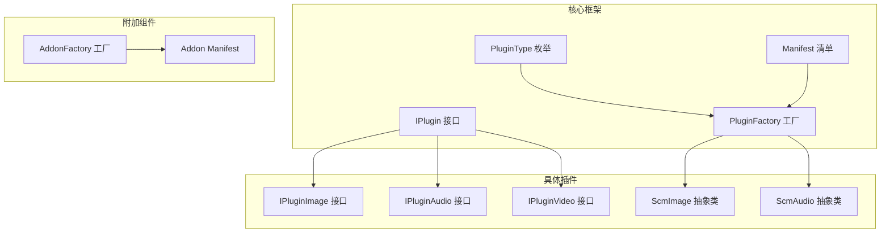
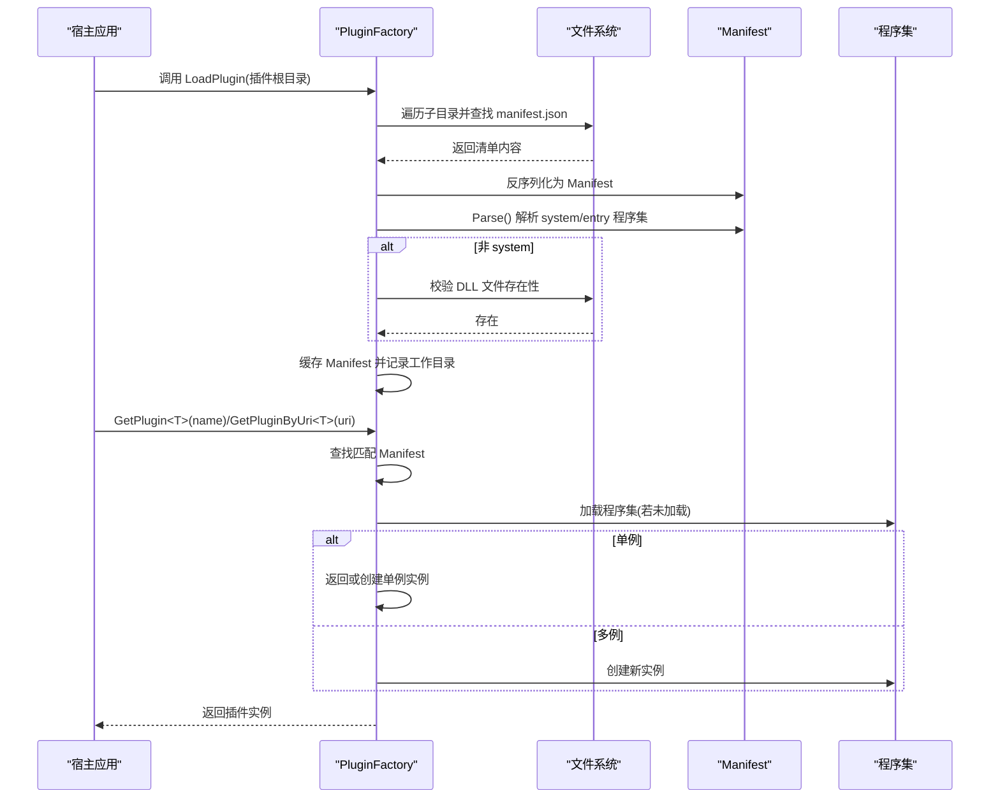
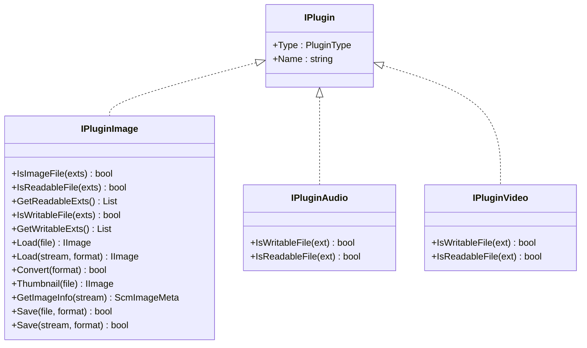
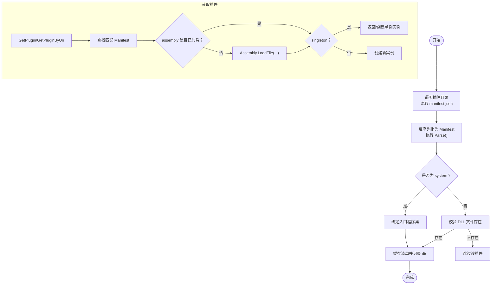
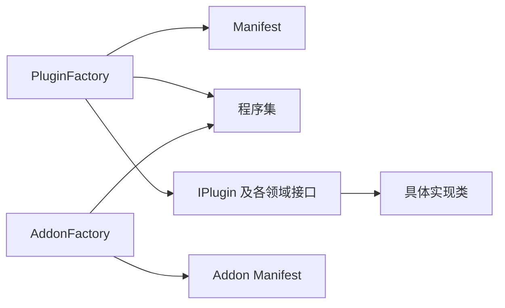

# 自定义插件开发

<cite>
**本文引用的文件**
- [Scm.Plugin/IPlugin.cs](file://Scm.Plugin/IPlugin.cs)
- [Scm.Plugin/Manifest.cs](file://Scm.Plugin/Manifest.cs)
- [Scm.Plugin/PluginFactory.cs](file://Scm.Plugin/PluginFactory.cs)
- [Scm.Plugin/PluginType.cs](file://Scm.Plugin/PluginType.cs)
- [Scm.Plugin/FileExt.cs](file://Scm.Plugin/FileExt.cs)
- [Scm.Plugin.Audio/IPluginAudio.cs](file://Scm.Plugin.Audio/IPluginAudio.cs)
- [Scm.Plugin.Audio/ScmAudio.cs](file://Scm.Plugin.Audio/ScmAudio.cs)
- [Scm.Plugin.Image/IPluginImage.cs](file://Scm.Plugin.Image/IPluginImage.cs)
- [Scm.Plugin.Image/ScmImage.cs](file://Scm.Plugin.Image/ScmImage.cs)
- [Scm.Plugin.Video/IPluginVideo.cs](file://Scm.Plugin.Video/IPluginVideo.cs)
- [Scm.Addon/Manifest.cs](file://Scm.Addon/Manifest.cs)
- [Scm.Addon/AddonFactory.cs](file://Scm.Addon/AddonFactory.cs)
- [Scm.Common/Utils/CommonExts.cs](file://Scm.Common/Utils/CommonExts.cs)
- [Scm.Common/Utils/ScmUtils.cs](file://Scm.Common/Utils/ScmUtils.cs)
- [Scm.Server/ISecService.cs](file://Scm.Server/ISecService.cs)
- [Scm.Server.Service/Service/ScmSecService.cs](file://Scm.Server.Service/Service/ScmSecService.cs)
</cite>

## 目录
1. [简介](#简介)
2. [项目结构](#项目结构)
3. [核心组件](#核心组件)
4. [架构总览](#架构总览)
5. [详细组件分析](#详细组件分析)
6. [依赖关系分析](#依赖关系分析)
7. [性能考量](#性能考量)
8. [故障排查指南](#故障排查指南)
9. [结论](#结论)
10. [附录](#附录)

## 简介
本指南面向希望在 Scm.Net 中开发自定义插件的开发者，围绕 IPlugin 接口、插件清单（Manifest）、工厂加载与生命周期控制进行系统讲解。文档覆盖插件注册、发现与动态加载流程，提供清单字段规范、最佳实践、调试与测试方法、部署流程以及与主系统的集成与依赖管理策略，并给出安全与权限控制建议。

## 项目结构
Scm.Net 的插件体系由“核心插件框架”和“具体插件实现”两部分组成：
- 核心框架位于 Scm.Plugin：定义通用接口 IPlugin、插件类型枚举 PluginType、清单 Manifest、工厂 PluginFactory。
- 具体插件实现位于 Scm.Plugin.* 命名空间下，如 Scm.Plugin.Image、Scm.Plugin.Audio、Scm.Plugin.Video，它们通过各自命名空间下的接口扩展 IPlugin。
- 扩展点与插件类似的概念也存在于 Scm.Addon，其 Manifest 与 AddonFactory 结构与 PluginFactory 高度一致，表明系统同时支持“插件”和“附加组件”的扩展模式。

图表来源
- [Scm.Plugin/IPlugin.cs:1-13](file://Scm.Plugin/IPlugin.cs#L1-L13)
- [Scm.Plugin/PluginType.cs:1-13](file://Scm.Plugin/PluginType.cs#L1-L13)
- [Scm.Plugin/Manifest.cs:1-86](file://Scm.Plugin/Manifest.cs#L1-L86)
- [Scm.Plugin/PluginFactory.cs:1-148](file://Scm.Plugin/PluginFactory.cs#L1-L148)
- [Scm.Plugin.Image/IPluginImage.cs:1-90](file://Scm.Plugin.Image/IPluginImage.cs#L1-L90)
- [Scm.Plugin.Image/ScmImage.cs:1-234](file://Scm.Plugin.Image/ScmImage.cs#L1-L234)
- [Scm.Plugin.Audio/IPluginAudio.cs:1-10](file://Scm.Plugin.Audio/IPluginAudio.cs#L1-L10)
- [Scm.Plugin.Audio/ScmAudio.cs:1-7](file://Scm.Plugin.Audio/ScmAudio.cs#L1-L7)
- [Scm.Plugin.Video/IPluginVideo.cs:1-10](file://Scm.Plugin.Video/IPluginVideo.cs#L1-L10)
- [Scm.Addon/Manifest.cs:1-86](file://Scm.Addon/Manifest.cs#L1-L86)
- [Scm.Addon/AddonFactory.cs:1-145](file://Scm.Addon/AddonFactory.cs#L1-L145)

章节来源
- [Scm.Plugin/IPlugin.cs:1-13](file://Scm.Plugin/IPlugin.cs#L1-L13)
- [Scm.Plugin/PluginFactory.cs:1-148](file://Scm.Plugin/PluginFactory.cs#L1-L148)
- [Scm.Plugin/Manifest.cs:1-86](file://Scm.Plugin/Manifest.cs#L1-L86)
- [Scm.Plugin/PluginType.cs:1-13](file://Scm.Plugin/PluginType.cs#L1-L13)
- [Scm.Plugin/Image/IPluginImage.cs:1-90](file://Scm.Plugin.Image/IPluginImage.cs#L1-L90)
- [Scm.Plugin/Audio/IPluginAudio.cs:1-10](file://Scm.Plugin.Audio/IPluginAudio.cs#L1-L10)
- [Scm.Plugin/Video/IPluginVideo.cs:1-10](file://Scm.Plugin.Video/IPluginVideo.cs#L1-L10)
- [Scm.Addon/AddonFactory.cs:1-145](file://Scm.Addon/AddonFactory.cs#L1-L145)
- [Scm.Addon/Manifest.cs:1-86](file://Scm.Addon/Manifest.cs#L1-L86)

## 核心组件
- IPlugin：插件最小接口，要求暴露 Type 与 Name，用于区分插件类型与标识。
- PluginType：插件类型枚举，涵盖 None、Text、Image、Audio、Vedio、Media 等。
- Manifest：插件清单，描述插件元数据、程序集、入口类路径、是否单例、工作目录等；包含 Parse() 逻辑以识别 system 内置程序集。
- PluginFactory：插件工厂，负责扫描插件目录、解析 manifest.json、按需加载程序集、创建实例（支持单例与多例）。
- FileExt：文件扩展名与描述的简单模型，常用于声明可读写扩展名集合。

章节来源
- [Scm.Plugin/IPlugin.cs:1-13](file://Scm.Plugin/IPlugin.cs#L1-L13)
- [Scm.Plugin/PluginType.cs:1-13](file://Scm.Plugin/PluginType.cs#L1-L13)
- [Scm.Plugin/Manifest.cs:1-86](file://Scm.Plugin/Manifest.cs#L1-L86)
- [Scm.Plugin/PluginFactory.cs:1-148](file://Scm.Plugin/PluginFactory.cs#L1-L148)
- [Scm.Plugin/FileExt.cs:1-10](file://Scm.Plugin/FileExt.cs#L1-L10)

## 架构总览
插件系统采用“清单驱动 + 反射实例化”的架构：
- 启动时由 PluginFactory 遍历插件根目录，读取每个子目录中的 manifest.json 并反序列化为 Manifest。
- Manifest.Parse() 会根据 dll 字段判断是否为 system 内置程序集，若是则直接绑定到入口程序集。
- 若非 system，则校验目标 DLL 文件是否存在，随后缓存清单并保留工作目录路径。
- 获取插件时，PluginFactory 依据 Manifest 中的 uri 或 entry 字段，结合 singleton 标记决定是返回缓存实例还是新建实例。

图表来源
- [Scm.Plugin/PluginFactory.cs:12-62](file://Scm.Plugin/PluginFactory.cs#L12-L62)
- [Scm.Plugin/PluginFactory.cs:64-97](file://Scm.Plugin/PluginFactory.cs#L64-L97)
- [Scm.Plugin/PluginFactory.cs:99-132](file://Scm.Plugin/PluginFactory.cs#L99-L132)
- [Scm.Plugin/Manifest.cs:76-84](file://Scm.Plugin/Manifest.cs#L76-L84)

章节来源
- [Scm.Plugin/PluginFactory.cs:1-148](file://Scm.Plugin/PluginFactory.cs#L1-L148)
- [Scm.Plugin/Manifest.cs:1-86](file://Scm.Plugin/Manifest.cs#L1-L86)

## 详细组件分析

### IPlugin 接口与派生接口
- IPlugin：统一约束插件的类型与名称，便于工厂按类型与名称检索。
- IPluginImage/IPluginAudio/IPluginVideo：在 IPlugin 基础上扩展媒体能力，如文件可读写判定、读取/保存、格式转换、缩略图、水印、验证码、条形码等。

图表来源
- [Scm.Plugin/IPlugin.cs:1-13](file://Scm.Plugin/IPlugin.cs#L1-L13)
- [Scm.Plugin.Image/IPluginImage.cs:1-90](file://Scm.Plugin.Image/IPluginImage.cs#L1-L90)
- [Scm.Plugin.Audio/IPluginAudio.cs:1-10](file://Scm.Plugin.Audio/IPluginAudio.cs#L1-L10)
- [Scm.Plugin.Video/IPluginVideo.cs:1-10](file://Scm.Plugin.Video/IPluginVideo.cs#L1-L10)

章节来源
- [Scm.Plugin/IPlugin.cs:1-13](file://Scm.Plugin/IPlugin.cs#L1-L13)
- [Scm.Plugin.Image/IPluginImage.cs:1-90](file://Scm.Plugin.Image/IPluginImage.cs#L1-L90)
- [Scm.Plugin.Audio/IPluginAudio.cs:1-10](file://Scm.Plugin.Audio/IPluginAudio.cs#L1-L10)
- [Scm.Plugin.Video/IPluginVideo.cs:1-10](file://Scm.Plugin.Video/IPluginVideo.cs#L1-L10)

### Manifest 清单与清单解析
- 字段说明（摘自清单定义）：type、dll、name、title、description、uri、entry、args、ver、singleton。
- 非序列化字段：assembly、instance、dir、sys。assembly 与 instance 由工厂在运行时填充；dir 记录插件工作目录；sys 标识是否为 system 内置程序集。
- Parse()：当 dll 为 system 时，assembly 绑定到入口程序集，避免从磁盘加载。

章节来源
- [Scm.Plugin/Manifest.cs:1-86](file://Scm.Plugin/Manifest.cs#L1-L86)
- [Scm.Addon/Manifest.cs:1-86](file://Scm.Addon/Manifest.cs#L1-L86)

### PluginFactory 工厂与生命周期
- LoadPlugin：扫描插件根目录，逐个子目录读取 manifest.json，校验 DLL 存在性，缓存清单。
- GetPlugin<T>/GetPluginByUri<T>：按类型与名称或 URI 查找清单，按需加载程序集，依据 singleton 决定实例复用策略。
- 生命周期：单例模式下首次创建后缓存 instance；多例模式每次创建新实例。

图表来源
- [Scm.Plugin/PluginFactory.cs:12-62](file://Scm.Plugin/PluginFactory.cs#L12-L62)
- [Scm.Plugin/PluginFactory.cs:64-97](file://Scm.Plugin/PluginFactory.cs#L64-L97)
- [Scm.Plugin/PluginFactory.cs:99-132](file://Scm.Plugin/PluginFactory.cs#L99-L132)
- [Scm.Plugin/Manifest.cs:76-84](file://Scm.Plugin/Manifest.cs#L76-L84)

章节来源
- [Scm.Plugin/PluginFactory.cs:1-148](file://Scm.Plugin/PluginFactory.cs#L1-L148)
- [Scm.Plugin/Manifest.cs:1-86](file://Scm.Plugin/Manifest.cs#L1-L86)

### 具体插件实现示例
- ScmImage：作为 IImage 的抽象实现，集中定义了图像读取、保存、转换、缩放、裁剪、帧操作、水印、验证码、条形码等能力，并通过 Type 属性返回 PluginType.Image，满足 IPlugin 约束。
- ScmAudio：作为音频抽象基类，提供音频处理能力的扩展点。

章节来源
- [Scm.Plugin.Image/ScmImage.cs:1-234](file://Scm.Plugin.Image/ScmImage.cs#L1-L234)
- [Scm.Plugin.Audio/ScmAudio.cs:1-7](file://Scm.Plugin.Audio/ScmAudio.cs#L1-L7)

## 依赖关系分析
- 插件接口族与实现：IPlugin 为统一契约，各功能域（图像、音频、视频）通过各自命名空间的接口扩展能力；实现类（如 ScmImage、ScmAudio）继承抽象基类并实现具体行为。
- 工厂与清单：PluginFactory 依赖 Manifest 进行发现与加载；Manifest 的 assembly/instance/dir/sys 字段在运行时由工厂填充与维护。
- 附加组件：AddonFactory 与 Addon Manifest 与 PluginFactory/Manifest 结构一致，表明系统同时支持两类扩展点。

图表来源
- [Scm.Plugin/PluginFactory.cs:1-148](file://Scm.Plugin/PluginFactory.cs#L1-L148)
- [Scm.Plugin/Manifest.cs:1-86](file://Scm.Plugin/Manifest.cs#L1-L86)
- [Scm.Addon/AddonFactory.cs:1-145](file://Scm.Addon/AddonFactory.cs#L1-L145)
- [Scm.Addon/Manifest.cs:1-86](file://Scm.Addon/Manifest.cs#L1-L86)

章节来源
- [Scm.Plugin/PluginFactory.cs:1-148](file://Scm.Plugin/PluginFactory.cs#L1-L148)
- [Scm.Plugin/Manifest.cs:1-86](file://Scm.Plugin/Manifest.cs#L1-L86)
- [Scm.Addon/AddonFactory.cs:1-145](file://Scm.Addon/AddonFactory.cs#L1-L145)
- [Scm.Addon/Manifest.cs:1-86](file://Scm.Addon/Manifest.cs#L1-L86)

## 性能考量
- 单例模式：对于重型资源占用或初始化成本高的插件，建议设置 singleton 为 true，减少重复创建带来的开销。
- 延迟加载：PluginFactory 在首次请求时才加载程序集与创建实例，有助于启动阶段的快速响应。
- 文件 I/O：manifest.json 读取与 DLL 校验发生在加载阶段，应确保插件目录结构清晰、文件命名规范，避免不必要的 IO 开销。
- 反射调用：通过 Manifest.uri/entry 定位类型并创建实例，属于运行时反射，建议在设计上尽量减少频繁反射调用次数。

[本节为通用性能建议，不直接分析特定文件]

## 故障排查指南
- 清单缺失或格式错误：PluginFactory 在扫描时若无法读取或反序列化 manifest.json，将跳过该插件。请检查 manifest.json 的完整性与 JSON 格式。
- DLL 文件缺失：当 dll 非 system 时，若对应 DLL 文件不存在，插件将被忽略。请确认插件目录结构与 DLL 路径正确。
- 程序集加载失败：若程序集不可加载或类型创建失败，GetPlugin* 方法将返回默认值。请检查程序集版本、依赖与强名称签名。
- 单例/多例混淆：若期望多例但设置了 singleton=true，会导致实例复用问题；反之亦然。请根据业务需求正确设置 singleton。
- 安全与权限：系统提供安全配置接口与服务，建议在插件中对敏感操作进行权限校验与白名单限制，避免越权访问。

章节来源
- [Scm.Plugin/PluginFactory.cs:12-62](file://Scm.Plugin/PluginFactory.cs#L12-L62)
- [Scm.Plugin/PluginFactory.cs:64-97](file://Scm.Plugin/PluginFactory.cs#L64-L97)
- [Scm.Plugin/PluginFactory.cs:99-132](file://Scm.Plugin/PluginFactory.cs#L99-L132)
- [Scm.Server/ISecService.cs:1-25](file://Scm.Server/ISecService.cs#L1-L25)
- [Scm.Server.Service/Service/ScmSecService.cs:1-13](file://Scm.Server.Service/Service/ScmSecService.cs#L1-L13)

## 结论
Scm.Net 的插件系统以 IPlugin 为核心契约，配合 Manifest 清单与 PluginFactory 工厂，实现了清晰的发现、加载与生命周期管理。通过扩展 IPlugin 的领域接口与抽象实现类，开发者可以快速构建图像、音频、视频等多媒体插件。建议在开发中遵循清单字段规范、命名规范、错误处理与性能优化原则，并结合系统提供的安全配置进行权限控制与白名单管理。

[本节为总结性内容，不直接分析特定文件]

## 附录

### 插件清单（Manifest）字段规范
- type：插件类型，通常与接口类型名称一致（如 Image/Audio/Video 等）。
- dll：插件程序集文件名；当为 system 时，表示使用宿主入口程序集。
- name：插件唯一名称，用于工厂检索。
- title/description：插件标题与说明。
- uri：插件实现类的完全限定类型名（含命名空间），用于反射创建实例。
- entry：预留入口字段，当前工厂实现优先使用 uri。
- args：参数字符串（可选）。
- ver：版本号（可选）。
- singleton：是否单例（true/false）。
- 非序列化字段：assembly、instance、dir、sys，由运行时填充。

章节来源
- [Scm.Plugin/Manifest.cs:1-86](file://Scm.Plugin/Manifest.cs#L1-L86)
- [Scm.Addon/Manifest.cs:1-86](file://Scm.Addon/Manifest.cs#L1-L86)

### 插件开发最佳实践
- 命名规范：接口以 IPluginXxx 命名，实现类以 ScmXxx 命名；type 与 name 保持稳定且语义明确。
- 错误处理：在插件内部捕获并记录异常，避免抛出未处理异常影响宿主；在工厂层对加载失败进行降级处理。
- 性能优化：对耗时操作进行缓存与延迟初始化；合理使用单例；避免在热路径中频繁反射。
- 配置管理：通过 manifest.json 管理插件元数据与运行参数；必要时引入外部配置文件并进行校验。
- 安全与权限：对输入文件与参数进行白名单校验；对敏感操作进行权限校验；参考系统安全配置接口进行统一管控。

章节来源
- [Scm.Plugin/IPlugin.cs:1-13](file://Scm.Plugin/IPlugin.cs#L1-L13)
- [Scm.Plugin/PluginFactory.cs:1-148](file://Scm.Plugin/PluginFactory.cs#L1-L148)
- [Scm.Server/ISecService.cs:1-25](file://Scm.Server/ISecService.cs#L1-L25)
- [Scm.Server.Service/Service/ScmSecService.cs:1-13](file://Scm.Server.Service/Service/ScmSecService.cs#L1-L13)

### 插件调试与测试
- 调试技巧：在 PluginFactory 的加载与实例化路径设置断点，观察 Manifest 字段与 assembly/instance 的变化；对反射创建失败的情况输出详细日志。
- 测试方法：编写单元测试验证清单解析、程序集加载与接口实现；对关键算法（如图像处理、音频解码）进行独立测试。
- 部署流程：将插件目录放置于插件根目录下，确保 manifest.json 与 DLL 正确；启动时调用 PluginFactory.LoadPlugin 进行加载；通过 GetPlugin* 获取并验证功能。

章节来源
- [Scm.Plugin/PluginFactory.cs:12-62](file://Scm.Plugin/PluginFactory.cs#L12-L62)
- [Scm.Plugin/PluginFactory.cs:64-97](file://Scm.Plugin/PluginFactory.cs#L64-L97)
- [Scm.Plugin/PluginFactory.cs:99-132](file://Scm.Plugin/PluginFactory.cs#L99-L132)

### 插件与主系统的集成与依赖管理
- 集成方式：通过 IPlugin 接口与 Manifest 清单，插件以“能力扩展”的形式接入主系统；工厂负责生命周期管理。
- 依赖管理：插件 DLL 应包含运行所需的所有依赖；避免与宿主版本冲突；可通过版本号（ver）进行版本管理。

章节来源
- [Scm.Plugin/IPlugin.cs:1-13](file://Scm.Plugin/IPlugin.cs#L1-L13)
- [Scm.Plugin/Manifest.cs:1-86](file://Scm.Plugin/Manifest.cs#L1-L86)
- [Scm.Plugin/PluginFactory.cs:1-148](file://Scm.Plugin/PluginFactory.cs#L1-L148)

### 完整开发示例与模板代码
以下为“模板步骤”，请按步骤在本地工程中实现：
- 新建类库项目，实现 IPlugin 接口（或领域接口，如 IPluginImage）。
- 在插件根目录创建 manifest.json，填写 type、dll、name、title、description、uri、singleton 等字段。
- 实现插件抽象基类（如 ScmImage/ScmAudio）并完成核心能力。
- 在宿主应用启动时调用 PluginFactory.LoadPlugin 加载插件目录。
- 使用 PluginFactory.GetPlugin<T>(name) 或 GetPluginByUri<T>(uri) 获取插件实例并调用其能力。

章节来源
- [Scm.Plugin/IPlugin.cs:1-13](file://Scm.Plugin/IPlugin.cs#L1-L13)
- [Scm.Plugin/Manifest.cs:1-86](file://Scm.Plugin/Manifest.cs#L1-L86)
- [Scm.Plugin/PluginFactory.cs:1-148](file://Scm.Plugin/PluginFactory.cs#L1-L148)
- [Scm.Plugin.Image/ScmImage.cs:1-234](file://Scm.Plugin.Image/ScmImage.cs#L1-L234)
- [Scm.Plugin.Audio/ScmAudio.cs:1-7](file://Scm.Plugin.Audio/ScmAudio.cs#L1-L7)

### 安全考虑与权限控制
- 白名单与敏感词：参考系统安全配置接口与服务，对上传文件类型、敏感词与 IP 黑名单进行统一管理。
- 权限校验：在插件中对用户身份与操作权限进行校验，避免越权访问。
- 输入校验：对文件扩展名、路径与参数进行严格校验，防止注入与越界访问。

章节来源
- [Scm.Server/ISecService.cs:1-25](file://Scm.Server/ISecService.cs#L1-L25)
- [Scm.Server.Service/Service/ScmSecService.cs:1-13](file://Scm.Server.Service/Service/ScmSecService.cs#L1-L13)
- [Scm.Common/Utils/ScmUtils.cs:67-79](file://Scm.Common/Utils/ScmUtils.cs#L67-L79)