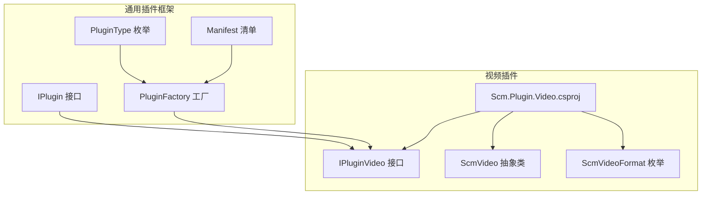
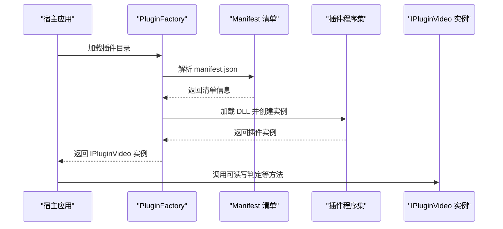
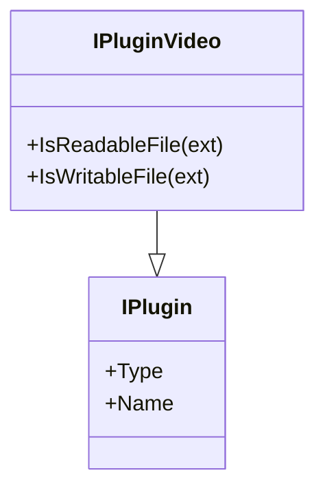
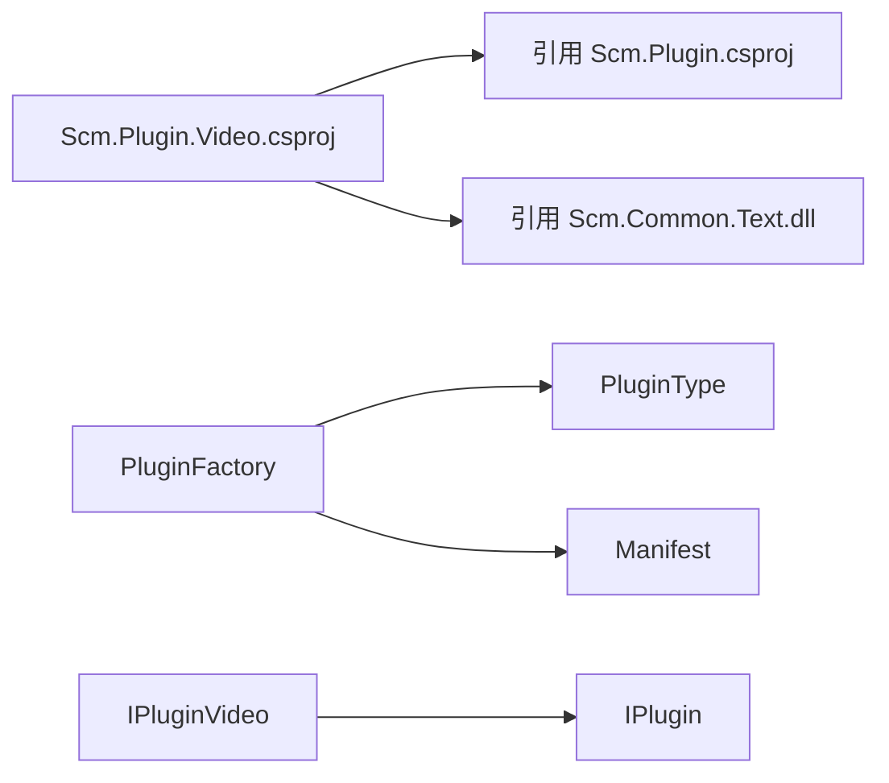

# 视频插件系统

<cite>
**本文引用的文件**
- [Scm.Plugin.Video.csproj](file://Scm.Plugin.Video/Scm.Plugin.Video.csproj)
- [IPluginVideo.cs](file://Scm.Plugin.Video/IPluginVideo.cs)
- [ScmVideo.cs](file://Scm.Plugin.Video/ScmVideo.cs)
- [ScmVideoFormat.cs](file://Scm.Plugin.Video/ScmVideoFormat.cs)
- [PluginType.cs](file://Scm.Plugin/PluginType.cs)
- [IPlugin.cs](file://Scm.Plugin/IPlugin.cs)
- [Manifest.cs](file://Scm.Plugin/Manifest.cs)
- [PluginFactory.cs](file://Scm.Plugin/PluginFactory.cs)
- [ScmImage.cs](file://Scm.Plugin.Image/ScmImage.cs)
- [ScmAudioFormat.cs](file://Scm.Plugin.Audio/ScmAudioFormat.cs)
</cite>

## 目录
1. [引言](#引言)
2. [项目结构](#项目结构)
3. [核心组件](#核心组件)
4. [架构总览](#架构总览)
5. [详细组件分析](#详细组件分析)
6. [依赖关系分析](#依赖关系分析)
7. [性能考虑](#性能考虑)
8. [故障排查指南](#故障排查指南)
9. [结论](#结论)
10. [附录](#附录)

## 引言
本文件面向 Scm.Net 的视频插件系统，基于当前仓库中已提供的视频插件骨架与通用插件框架，系统化阐述视频插件在格式识别、可读写判定、扩展点设计以及与整体插件体系的集成方式。由于视频插件当前仍处于基础抽象层（仅定义接口与枚举），本文同时给出面向未来扩展的实现建议、性能优化策略与常见问题排查要点，帮助开发者快速落地视频处理能力。

## 项目结构
视频插件位于独立的工程中，并通过通用插件框架进行加载与实例化。其关键文件如下：
- 插件工程：Scm.Plugin.Video
  - IPluginVideo.cs：视频插件接口，继承通用插件接口，提供可读写判定能力
  - ScmVideo.cs：视频抽象基类（当前为空）
  - ScmVideoFormat.cs：视频格式枚举（当前为空）
  - Scm.Plugin.Video.csproj：工程文件，引用通用插件库并配置根命名空间
- 通用插件框架：Scm.Plugin
  - IPlugin.cs：所有插件的基础接口
  - Manifest.cs：插件清单模型，描述插件元信息与装配参数
  - PluginFactory.cs：插件加载与实例化工厂
  - PluginType.cs：插件类型枚举，包含 Video 类型

**图表来源**
- [Scm.Plugin.Video.csproj:1-21](file://Scm.Plugin.Video/Scm.Plugin.Video.csproj#L1-L21)
- [IPluginVideo.cs:1-10](file://Scm.Plugin.Video/IPluginVideo.cs#L1-L10)
- [ScmVideo.cs:1-7](file://Scm.Plugin.Video/ScmVideo.cs#L1-L7)
- [ScmVideoFormat.cs:1-7](file://Scm.Plugin.Video/ScmVideoFormat.cs#L1-L7)
- [PluginType.cs:1-13](file://Scm.Plugin/PluginType.cs#L1-L13)
- [IPlugin.cs:1-13](file://Scm.Plugin/IPlugin.cs#L1-L13)
- [Manifest.cs:1-86](file://Scm.Plugin/Manifest.cs#L1-L86)
- [PluginFactory.cs:1-148](file://Scm.Plugin/PluginFactory.cs#L1-L148)

**章节来源**
- [Scm.Plugin.Video.csproj:1-21](file://Scm.Plugin.Video/Scm.Plugin.Video.csproj#L1-L21)
- [IPluginVideo.cs:1-10](file://Scm.Plugin.Video/IPluginVideo.cs#L1-L10)
- [ScmVideo.cs:1-7](file://Scm.Plugin.Video/ScmVideo.cs#L1-L7)
- [ScmVideoFormat.cs:1-7](file://Scm.Plugin.Video/ScmVideoFormat.cs#L1-L7)
- [PluginType.cs:1-13](file://Scm.Plugin/PluginType.cs#L1-L13)
- [IPlugin.cs:1-13](file://Scm.Plugin/IPlugin.cs#L1-L13)
- [Manifest.cs:1-86](file://Scm.Plugin/Manifest.cs#L1-L86)
- [PluginFactory.cs:1-148](file://Scm.Plugin/PluginFactory.cs#L1-L148)

## 核心组件
- 插件类型与接口
  - PluginType：统一标识插件类别，视频插件类型为 Video
  - IPlugin：所有插件的基础契约，包含 Type 与 Name
  - IPluginVideo：视频插件接口，继承 IPlugin，新增可读写判定方法
- 视频抽象与格式
  - ScmVideo：视频抽象基类（当前为空，为后续扩展预留）
  - ScmVideoFormat：视频格式枚举（当前为空，用于未来扩展）
- 插件清单与工厂
  - Manifest：描述插件的元信息（类型、DLL、入口、参数等）
  - PluginFactory：负责扫描插件目录、解析清单、按需加载与实例化

**章节来源**
- [PluginType.cs:1-13](file://Scm.Plugin/PluginType.cs#L1-L13)
- [IPlugin.cs:1-13](file://Scm.Plugin/IPlugin.cs#L1-L13)
- [IPluginVideo.cs:1-10](file://Scm.Plugin.Video/IPluginVideo.cs#L1-L10)
- [ScmVideo.cs:1-7](file://Scm.Plugin.Video/ScmVideo.cs#L1-L7)
- [ScmVideoFormat.cs:1-7](file://Scm.Plugin.Video/ScmVideoFormat.cs#L1-L7)
- [Manifest.cs:1-86](file://Scm.Plugin/Manifest.cs#L1-L86)
- [PluginFactory.cs:1-148](file://Scm.Plugin/PluginFactory.cs#L1-L148)

## 架构总览
视频插件遵循 Scm.Net 的通用插件架构：通过 Manifest 描述插件元信息，PluginFactory 扫描插件目录并加载对应程序集，最终根据类型与名称获取具体插件实例。视频插件接口 IPluginVideo 继承自 IPlugin，因此具备统一的类型识别与命名规范。

**图表来源**
- [PluginFactory.cs:12-62](file://Scm.Plugin/PluginFactory.cs#L12-L62)
- [Manifest.cs:76-83](file://Scm.Plugin/Manifest.cs#L76-L83)
- [IPluginVideo.cs:3-8](file://Scm.Plugin.Video/IPluginVideo.cs#L3-L8)

**章节来源**
- [PluginFactory.cs:1-148](file://Scm.Plugin/PluginFactory.cs#L1-L148)
- [Manifest.cs:1-86](file://Scm.Plugin/Manifest.cs#L1-L86)
- [IPluginVideo.cs:1-10](file://Scm.Plugin.Video/IPluginVideo.cs#L1-L10)

## 详细组件分析

### 视频插件接口 IPluginVideo
- 继承关系：IPluginVideo → IPlugin
- 关键职责
  - 可读性判定：IsReadableFile(ext)
  - 可写性判定：IsWritableFile(ext)
- 设计意义
  - 为视频插件提供统一的“文件扩展名”维度的能力开关
  - 便于上层根据扩展名快速筛选可用的视频插件

**图表来源**
- [IPlugin.cs:1-13](file://Scm.Plugin/IPlugin.cs#L1-L13)
- [IPluginVideo.cs:1-10](file://Scm.Plugin.Video/IPluginVideo.cs#L1-L10)

**章节来源**
- [IPluginVideo.cs:1-10](file://Scm.Plugin.Video/IPluginVideo.cs#L1-L10)
- [IPlugin.cs:1-13](file://Scm.Plugin/IPlugin.cs#L1-L13)

### 插件工厂与清单
- PluginFactory
  - LoadPlugin：扫描插件目录，解析 manifest.json，缓存清单
  - GetPlugin/GetPluginByUri：按类型与名称或 URI 创建插件实例；支持单例与多例
- Manifest
  - 描述插件类型、DLL 文件、入口类路径、参数、版本等
  - 提供 Parse：解析系统内置标记并定位程序集

**图表来源**
- [PluginFactory.cs:12-62](file://Scm.Plugin/PluginFactory.cs#L12-L62)
- [Manifest.cs:76-83](file://Scm.Plugin/Manifest.cs#L76-L83)

**章节来源**
- [PluginFactory.cs:1-148](file://Scm.Plugin/PluginFactory.cs#L1-L148)
- [Manifest.cs:1-86](file://Scm.Plugin/Manifest.cs#L1-L86)

### 视频抽象与格式扩展点
- ScmVideo：当前为空，建议作为未来视频处理的抽象基类，承载通用属性与方法（如时长、分辨率、封面提取等）
- ScmVideoFormat：当前为空，建议定义常用视频格式枚举，配合 IPluginVideo 的扩展名判定使用

对比图像与音频插件的设计，可参考其抽象类与格式枚举的组织方式，以便视频插件在未来实现时保持一致的 API 风格与扩展性。

**章节来源**
- [ScmVideo.cs:1-7](file://Scm.Plugin.Video/ScmVideo.cs#L1-L7)
- [ScmVideoFormat.cs:1-7](file://Scm.Plugin.Video/ScmVideoFormat.cs#L1-L7)
- [ScmImage.cs:1-234](file://Scm.Plugin.Image/ScmImage.cs#L1-L234)
- [ScmAudioFormat.cs:1-12](file://Scm.Plugin.Audio/ScmAudioFormat.cs#L1-L12)

## 依赖关系分析
- 视频插件工程依赖
  - 通用插件库：Scm.Plugin.csproj
  - 文本工具库：Scm.Common.Text.dll（通过引用配置）
- 插件类型与工厂耦合
  - PluginType 为视频插件提供统一类型标识
  - PluginFactory 依据类型与名称解析并创建实例
- 与其他插件类型的对比
  - 图像插件与音频插件均提供抽象基类与格式枚举，视频插件可借鉴其设计以提升一致性

**图表来源**
- [Scm.Plugin.Video.csproj:10-18](file://Scm.Plugin.Video/Scm.Plugin.Video.csproj#L10-L18)
- [PluginType.cs:1-13](file://Scm.Plugin/PluginType.cs#L1-L13)
- [PluginFactory.cs:1-148](file://Scm.Plugin/PluginFactory.cs#L1-L148)
- [IPluginVideo.cs:1-10](file://Scm.Plugin.Video/IPluginVideo.cs#L1-L10)
- [IPlugin.cs:1-13](file://Scm.Plugin/IPlugin.cs#L1-L13)

**章节来源**
- [Scm.Plugin.Video.csproj:1-21](file://Scm.Plugin.Video/Scm.Plugin.Video.csproj#L1-L21)
- [PluginType.cs:1-13](file://Scm.Plugin/PluginType.cs#L1-L13)
- [PluginFactory.cs:1-148](file://Scm.Plugin/PluginFactory.cs#L1-L148)
- [IPluginVideo.cs:1-10](file://Scm.Plugin.Video/IPluginVideo.cs#L1-L10)
- [IPlugin.cs:1-13](file://Scm.Plugin/IPlugin.cs#L1-L13)

## 性能考虑
- 插件加载与实例化
  - 使用单例模式可降低重复创建开销；多例模式适合无状态、高并发场景
  - PluginFactory 支持按名称或 URI 获取实例，建议结合业务场景选择合适策略
- 文件扩展名判定
  - IPluginVideo 的可读写判定基于扩展名，建议在上层缓存判定结果，减少重复 IO 与字符串处理
- 与图像/音频插件的对比
  - 图像插件提供多种操作（缩放、裁剪、帧处理等），视频插件可借鉴其抽象与方法组织方式，在保证扩展性的同时控制内存占用与 CPU 开销

[本节为通用性能建议，不直接分析具体文件，故无章节来源]

## 故障排查指南
- 插件未被加载
  - 检查插件目录是否存在 manifest.json
  - 确认 Manifest 中的类型、DLL 与入口类路径正确
  - 若为系统内置插件，确认标记与程序集解析逻辑
- 实例化失败
  - 确认程序集可加载且入口类路径有效
  - 单例模式下检查实例缓存是否正确
- 可读写判定异常
  - 核对扩展名大小写与白名单
  - 在上层增加日志记录扩展名与判定结果

**章节来源**
- [PluginFactory.cs:12-62](file://Scm.Plugin/PluginFactory.cs#L12-L62)
- [Manifest.cs:76-83](file://Scm.Plugin/Manifest.cs#L76-L83)
- [IPluginVideo.cs:5-7](file://Scm.Plugin.Video/IPluginVideo.cs#L5-L7)

## 结论
当前视频插件处于基础抽象阶段，通过 IPluginVideo 与通用插件框架实现了可读写判定与统一类型标识。建议在后续迭代中完善 ScmVideo 抽象类与 ScmVideoFormat 枚举，借鉴图像与音频插件的设计经验，逐步实现视频格式识别、元数据提取、转码与压缩、封面提取、时长与时序处理等核心能力，并配套完善的配置项、性能优化与并发处理策略。

[本节为总结性内容，不直接分析具体文件，故无章节来源]

## 附录
- 术语
  - 插件：遵循统一接口与清单规范的可扩展模块
  - 清单：描述插件元信息的 JSON 配置
  - 工厂：负责插件发现、加载与实例化的组件
- 参考实现风格
  - 图像插件：提供丰富的图像操作与帧处理接口
  - 音频插件：提供格式枚举与元数据访问能力

[本节为概念性内容，不直接分析具体文件，故无章节来源]