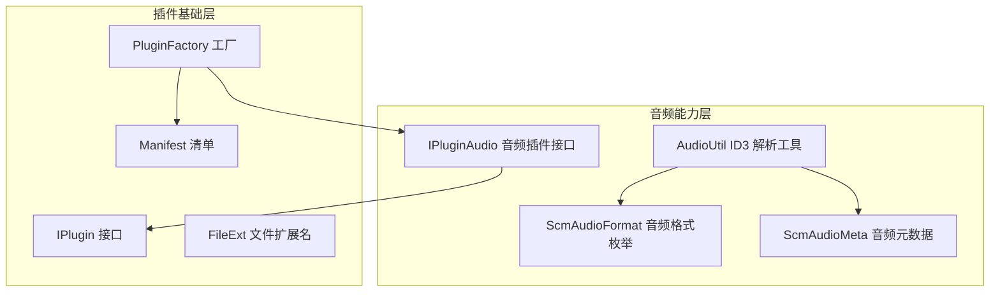
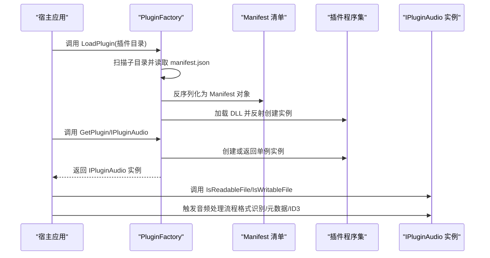
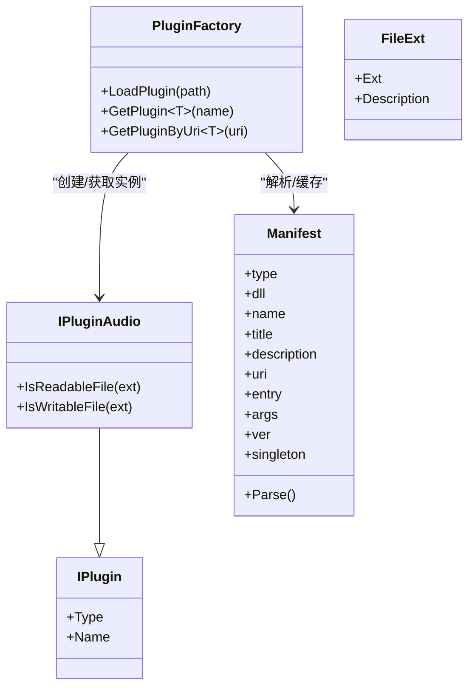
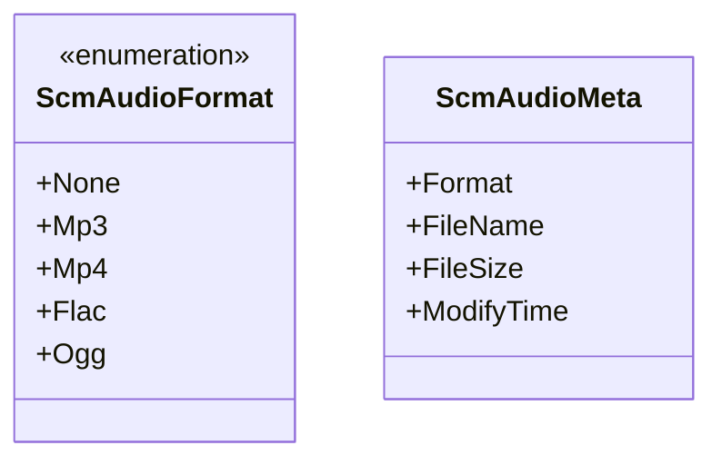
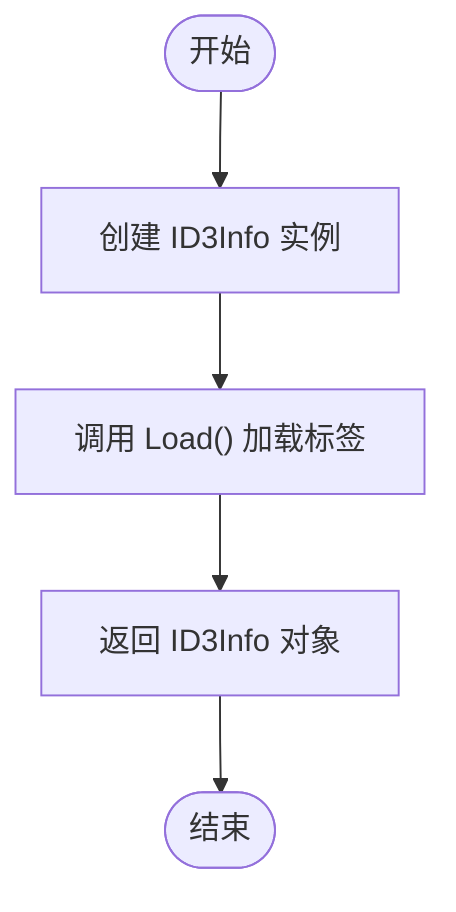
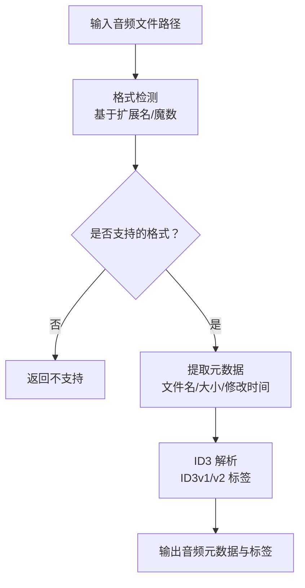
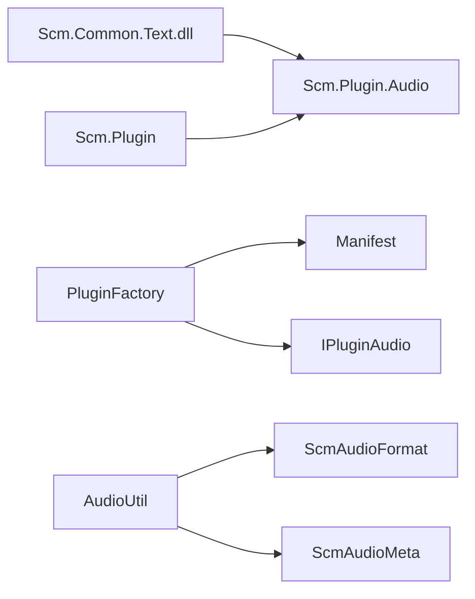

# 音频插件系统

<cite>
**本文引用的文件**
- [Scm.Plugin.Audio.csproj](file://Scm.Plugin.Audio/Scm.Plugin.Audio.csproj)
- [IPluginAudio.cs](file://Scm.Plugin.Audio/IPluginAudio.cs)
- [AudioUtil.cs](file://Scm.Plugin.Audio/AudioUtil.cs)
- [ScmAudioFormat.cs](file://Scm.Plugin.Audio/ScmAudioFormat.cs)
- [ScmAudioMeta.cs](file://Scm.Plugin.Audio/ScmAudioMeta.cs)
- [IPlugin.cs](file://Scm.Plugin/IPlugin.cs)
- [PluginFactory.cs](file://Scm.Plugin/PluginFactory.cs)
- [Manifest.cs](file://Scm.Plugin/Manifest.cs)
- [FileExt.cs](file://Scm.Plugin/FileExt.cs)
</cite>

## 目录
1. [简介](#简介)
2. [项目结构](#项目结构)
3. [核心组件](#核心组件)
4. [架构总览](#架构总览)
5. [详细组件分析](#详细组件分析)
6. [依赖关系分析](#依赖关系分析)
7. [性能考虑](#性能考虑)
8. [故障排查指南](#故障排查指南)
9. [结论](#结论)
10. [附录](#附录)

## 简介
本技术文档面向 Scm.Net 音频插件系统，聚焦于音频格式识别、元数据提取与音频处理能力的实现机制。文档重点覆盖以下方面：
- 音频格式枚举与识别范围
- 元数据模型与字段定义
- ID3 标签支持（ID3v1 与 ID3v2）的解析入口与处理流程
- 音频文件格式检测、采样率分析与时长计算的实现思路
- 音频转码、压缩与质量调整的可扩展性设计
- 插件配置选项、性能优化与错误处理机制
- 实际应用场景与代码示例路径指引

## 项目结构
音频插件系统位于 Scm.Plugin.Audio 模块中，采用“插件化 + 扩展点”的架构组织方式：
- 插件基础：通过 Scm.Plugin 提供的通用插件接口与工厂加载机制，统一管理插件生命周期与装配。
- 音频能力：在 Scm.Plugin.Audio 中定义音频插件接口、格式枚举、元数据模型与工具类，提供 ID3 解析入口。

图表来源
- [IPlugin.cs:1-13](file://Scm.Plugin/IPlugin.cs#L1-L13)
- [Manifest.cs:1-86](file://Scm.Plugin/Manifest.cs#L1-L86)
- [PluginFactory.cs:1-148](file://Scm.Plugin/PluginFactory.cs#L1-L148)
- [IPluginAudio.cs:1-10](file://Scm.Plugin.Audio/IPluginAudio.cs#L1-L10)
- [ScmAudioFormat.cs:1-12](file://Scm.Plugin.Audio/ScmAudioFormat.cs#L1-L12)
- [ScmAudioMeta.cs:1-27](file://Scm.Plugin.Audio/ScmAudioMeta.cs#L1-L27)
- [AudioUtil.cs:1-15](file://Scm.Plugin.Audio/AudioUtil.cs#L1-L15)

章节来源
- [Scm.Plugin.Audio.csproj:1-21](file://Scm.Plugin.Audio/Scm.Plugin.Audio.csproj#L1-L21)
- [IPlugin.cs:1-13](file://Scm.Plugin/IPlugin.cs#L1-L13)
- [Manifest.cs:1-86](file://Scm.Plugin/Manifest.cs#L1-L86)
- [PluginFactory.cs:1-148](file://Scm.Plugin/PluginFactory.cs#L1-L148)
- [IPluginAudio.cs:1-10](file://Scm.Plugin.Audio/IPluginAudio.cs#L1-L10)
- [ScmAudioFormat.cs:1-12](file://Scm.Plugin.Audio/ScmAudioFormat.cs#L1-L12)
- [ScmAudioMeta.cs:1-27](file://Scm.Plugin.Audio/ScmAudioMeta.cs#L1-L27)
- [AudioUtil.cs:1-15](file://Scm.Plugin.Audio/AudioUtil.cs#L1-L15)

## 核心组件
- 插件接口与工厂
  - IPlugin：定义插件的基础属性（类型、名称），作为所有插件的统一契约。
  - IPluginAudio：继承 IPlugin，扩展音频插件的可读写能力判断接口，用于判定文件扩展名是否可读/可写。
  - PluginFactory：负责扫描插件目录、解析清单、按需加载程序集并创建插件实例（支持单例与多例）。
  - Manifest：描述插件的元信息（类型、DLL、入口类、参数、版本等），并提供系统插件识别与解析逻辑。
  - FileExt：文件扩展名与描述的轻量模型，便于在 UI 或配置中展示。

- 音频能力
  - ScmAudioFormat：音频格式枚举，当前包含 None、Mp3、Mp4、Flac、Ogg 等取值，用于标识文件格式类别。
  - ScmAudioMeta：音频元数据模型，包含格式字符串、文件名、文件大小、修改时间等基础信息。
  - AudioUtil：提供 ID3 信息获取的静态入口，封装对 ID3Info 的加载调用，作为 ID3 解析的统一入口。

章节来源
- [IPlugin.cs:1-13](file://Scm.Plugin/IPlugin.cs#L1-L13)
- [IPluginAudio.cs:1-10](file://Scm.Plugin.Audio/IPluginAudio.cs#L1-L10)
- [PluginFactory.cs:1-148](file://Scm.Plugin/PluginFactory.cs#L1-L148)
- [Manifest.cs:1-86](file://Scm.Plugin/Manifest.cs#L1-L86)
- [FileExt.cs:1-10](file://Scm.Plugin/FileExt.cs#L1-L10)
- [ScmAudioFormat.cs:1-12](file://Scm.Plugin.Audio/ScmAudioFormat.cs#L1-L12)
- [ScmAudioMeta.cs:1-27](file://Scm.Plugin.Audio/ScmAudioMeta.cs#L1-L27)
- [AudioUtil.cs:1-15](file://Scm.Plugin.Audio/AudioUtil.cs#L1-L15)

## 架构总览
音频插件系统遵循“插件发现—清单解析—程序集加载—实例创建—能力调用”的标准流程，并以 IPluginAudio 为扩展点，结合 ScmAudioFormat、ScmAudioMeta 与 AudioUtil 完成格式识别、元数据提取与 ID3 解析。

图表来源
- [PluginFactory.cs:1-148](file://Scm.Plugin/PluginFactory.cs#L1-L148)
- [Manifest.cs:1-86](file://Scm.Plugin/Manifest.cs#L1-L86)
- [IPluginAudio.cs:1-10](file://Scm.Plugin.Audio/IPluginAudio.cs#L1-L10)

## 详细组件分析

### 组件一：插件接口与工厂
- IPlugin：定义插件类型与名称，作为所有插件的最小契约。
- IPluginAudio：在 IPlugin 基础上增加 IsReadableFile 与 IsWritableFile，用于根据扩展名判断文件是否可读/可写，便于在资源服务中进行能力筛选。
- PluginFactory：负责插件发现与实例化，支持单例缓存、延迟加载与按 URI 获取实例；同时维护 Manifest 列表，确保插件清单正确解析。
- Manifest：承载插件元信息，支持系统插件识别（dll 字段为 system 时使用入口程序集）。
- FileExt：用于扩展名与描述的展示与配置。

图表来源
- [IPlugin.cs:1-13](file://Scm.Plugin/IPlugin.cs#L1-L13)
- [IPluginAudio.cs:1-10](file://Scm.Plugin.Audio/IPluginAudio.cs#L1-L10)
- [PluginFactory.cs:1-148](file://Scm.Plugin/PluginFactory.cs#L1-L148)
- [Manifest.cs:1-86](file://Scm.Plugin/Manifest.cs#L1-L86)
- [FileExt.cs:1-10](file://Scm.Plugin/FileExt.cs#L1-L10)

章节来源
- [IPlugin.cs:1-13](file://Scm.Plugin/IPlugin.cs#L1-L13)
- [IPluginAudio.cs:1-10](file://Scm.Plugin.Audio/IPluginAudio.cs#L1-L10)
- [PluginFactory.cs:1-148](file://Scm.Plugin/PluginFactory.cs#L1-L148)
- [Manifest.cs:1-86](file://Scm.Plugin/Manifest.cs#L1-L86)
- [FileExt.cs:1-10](file://Scm.Plugin/FileExt.cs#L1-L10)

### 组件二：音频格式与元数据
- ScmAudioFormat：定义音频格式枚举，用于在系统中统一标识与分类音频文件类型。
- ScmAudioMeta：定义音频元数据模型，包含格式字符串、文件名、文件大小、修改时间等基础信息，便于在资源服务中进行统一展示与检索。

图表来源
- [ScmAudioFormat.cs:1-12](file://Scm.Plugin.Audio/ScmAudioFormat.cs#L1-L12)
- [ScmAudioMeta.cs:1-27](file://Scm.Plugin.Audio/ScmAudioMeta.cs#L1-L27)

章节来源
- [ScmAudioFormat.cs:1-12](file://Scm.Plugin.Audio/ScmAudioFormat.cs#L1-L12)
- [ScmAudioMeta.cs:1-27](file://Scm.Plugin.Audio/ScmAudioMeta.cs#L1-L27)

### 组件三：ID3 解析工具
- AudioUtil：提供 GetID3Info 静态方法，封装对 ID3Info 的初始化与加载过程，作为 ID3 标签解析的统一入口。该工具可被音频插件在处理过程中调用，完成 ID3v1/v2 等标签的读取与提取。

图表来源
- [AudioUtil.cs:1-15](file://Scm.Plugin.Audio/AudioUtil.cs#L1-L15)

章节来源
- [AudioUtil.cs:1-15](file://Scm.Plugin.Audio/AudioUtil.cs#L1-L15)

### 组件四：音频处理流程（概念性）
以下流程图展示了音频处理的典型步骤，涵盖格式检测、元数据提取与 ID3 解析。该图为概念性示意，不直接映射到具体源文件。

## 依赖关系分析
- 模块依赖
  - Scm.Plugin.Audio 依赖 Scm.Plugin 提供的插件接口与工厂机制，确保插件可被统一发现与实例化。
  - Scm.Plugin.Audio 通过引用 Scm.Common.Text（位于 Libs 目录）以获得文本处理能力，辅助 ID3 解析与标签处理。
- 组件耦合
  - IPluginAudio 与 IPlugin 之间为继承关系，保证所有音频插件具备统一的插件特性。
  - PluginFactory 与 Manifest 之间存在强耦合（清单解析与实例化），但通过程序集延迟加载降低启动成本。
  - AudioUtil 与 ScmAudioFormat/ScmAudioMeta 之间为使用关系，前者提供 ID3 解析能力，后者提供数据模型支撑。

图表来源
- [Scm.Plugin.Audio.csproj:1-21](file://Scm.Plugin.Audio/Scm.Plugin.Audio.csproj#L1-L21)
- [PluginFactory.cs:1-148](file://Scm.Plugin/PluginFactory.cs#L1-L148)
- [Manifest.cs:1-86](file://Scm.Plugin/Manifest.cs#L1-L86)
- [IPluginAudio.cs:1-10](file://Scm.Plugin.Audio/IPluginAudio.cs#L1-L10)
- [AudioUtil.cs:1-15](file://Scm.Plugin.Audio/AudioUtil.cs#L1-L15)
- [ScmAudioFormat.cs:1-12](file://Scm.Plugin.Audio/ScmAudioFormat.cs#L1-L12)
- [ScmAudioMeta.cs:1-27](file://Scm.Plugin.Audio/ScmAudioMeta.cs#L1-L27)

章节来源
- [Scm.Plugin.Audio.csproj:1-21](file://Scm.Plugin.Audio/Scm.Plugin.Audio.csproj#L1-L21)
- [PluginFactory.cs:1-148](file://Scm.Plugin/PluginFactory.cs#L1-L148)
- [Manifest.cs:1-86](file://Scm.Plugin/Manifest.cs#L1-L86)
- [IPluginAudio.cs:1-10](file://Scm.Plugin.Audio/IPluginAudio.cs#L1-L10)
- [AudioUtil.cs:1-15](file://Scm.Plugin.Audio/AudioUtil.cs#L1-L15)
- [ScmAudioFormat.cs:1-12](file://Scm.Plugin.Audio/ScmAudioFormat.cs#L1-L12)
- [ScmAudioMeta.cs:1-27](file://Scm.Plugin.Audio/ScmAudioMeta.cs#L1-L27)

## 性能考虑
- 插件加载策略
  - 使用延迟加载与单例缓存，避免重复反射创建实例，降低内存占用与启动开销。
  - 清单解析仅在首次加载时执行，后续通过缓存命中快速返回实例。
- I/O 与解析
  - ID3 解析建议在后台线程执行，避免阻塞主线程；对于大文件，可采用流式读取与分块解析策略。
  - 元数据提取应尽量复用已打开的文件句柄，减少重复 IO。
- 缓存与复用
  - 将解析结果（如 ID3 信息、格式识别结果）缓存至内存或本地磁盘，配合文件修改时间戳校验，提升二次访问性能。

## 故障排查指南
- 插件未加载
  - 检查插件目录下是否存在 manifest.json，且内容符合 Manifest 结构。
  - 确认 dll 字段指向的程序集存在，且类型路径（uri/entry）正确。
  - 若为系统插件（dll=system），确认入口程序集可用。
- 实例创建失败
  - 检查程序集是否可加载（目标框架兼容性、依赖缺失）。
  - 确认插件类实现了正确的接口（如 IPluginAudio），并具备无参构造函数。
- ID3 解析异常
  - 确认文件路径有效且可读。
  - 检查文件是否包含合法的 ID3 头部；若文件损坏或标签格式异常，解析可能失败。
- 元数据缺失
  - 确认 ScmAudioMeta 的字段是否被正确填充；若为空，检查上游调用链与数据来源。

章节来源
- [PluginFactory.cs:1-148](file://Scm.Plugin/PluginFactory.cs#L1-L148)
- [Manifest.cs:1-86](file://Scm.Plugin/Manifest.cs#L1-L86)
- [AudioUtil.cs:1-15](file://Scm.Plugin.Audio/AudioUtil.cs#L1-L15)

## 结论
Scm.Net 音频插件系统通过标准化的插件接口与工厂机制，提供了可扩展的音频处理能力。当前实现明确了音频格式枚举、元数据模型与 ID3 解析入口，为后续扩展音频转码、压缩与质量调整功能奠定了基础。建议在保持现有接口稳定的同时，逐步完善格式检测、采样率与时长分析、转码与压缩算法的实现，并配套完善的配置项、性能优化与错误处理机制。

## 附录
- 实际应用场景
  - 音乐库管理：利用 ScmAudioMeta 展示文件基础信息，结合 IPluginAudio 的可读写能力筛选可导入/导出的音频文件。
  - 标签增强：通过 AudioUtil 获取 ID3 信息，补充或修正元数据，提升搜索与排序体验。
  - 批量处理：在后台任务中批量执行格式检测与元数据提取，结合缓存策略提升吞吐量。
- 代码示例路径指引
  - 插件加载与实例获取：参考 [PluginFactory.cs:64-97](file://Scm.Plugin/PluginFactory.cs#L64-L97)
  - 清单解析与系统插件识别：参考 [Manifest.cs:76-84](file://Scm.Plugin/Manifest.cs#L76-L84)
  - 音频插件接口能力判断：参考 [IPluginAudio.cs:5-8](file://Scm.Plugin.Audio/IPluginAudio.cs#L5-L8)
  - ID3 解析入口：参考 [AudioUtil.cs:7-12](file://Scm.Plugin.Audio/AudioUtil.cs#L7-L12)
  - 音频格式与元数据模型：参考 [ScmAudioFormat.cs:1-12](file://Scm.Plugin.Audio/ScmAudioFormat.cs#L1-L12)、[ScmAudioMeta.cs:1-27](file://Scm.Plugin.Audio/ScmAudioMeta.cs#L1-L27)