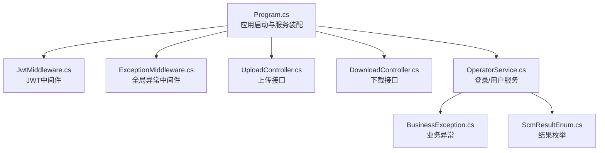
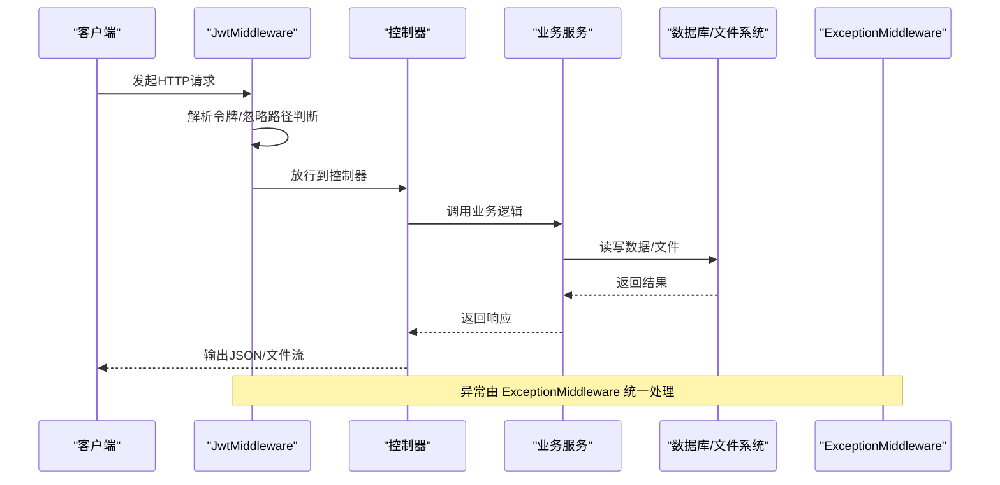
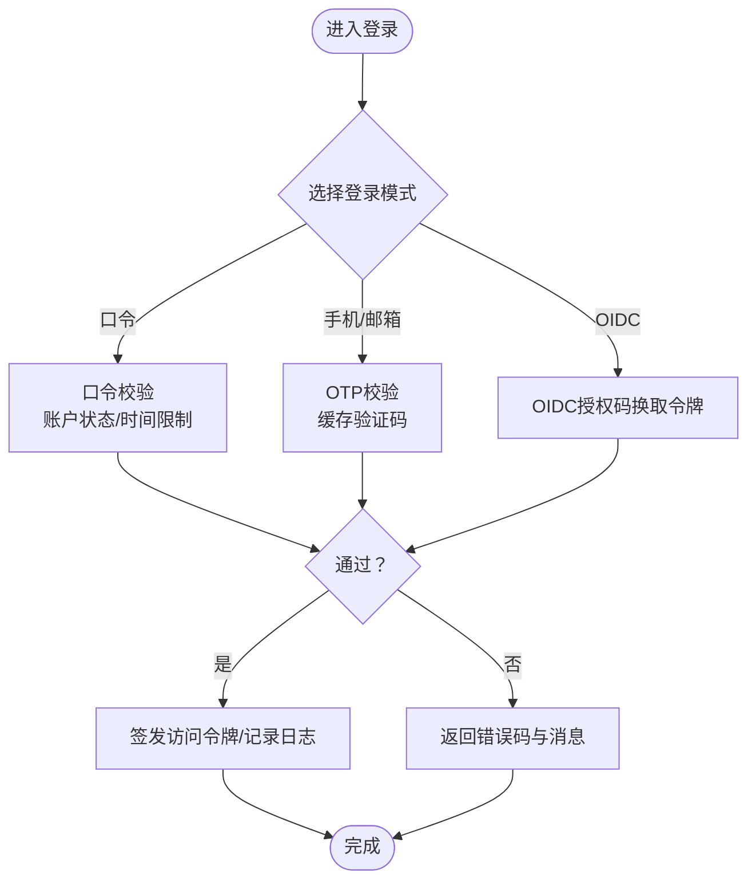
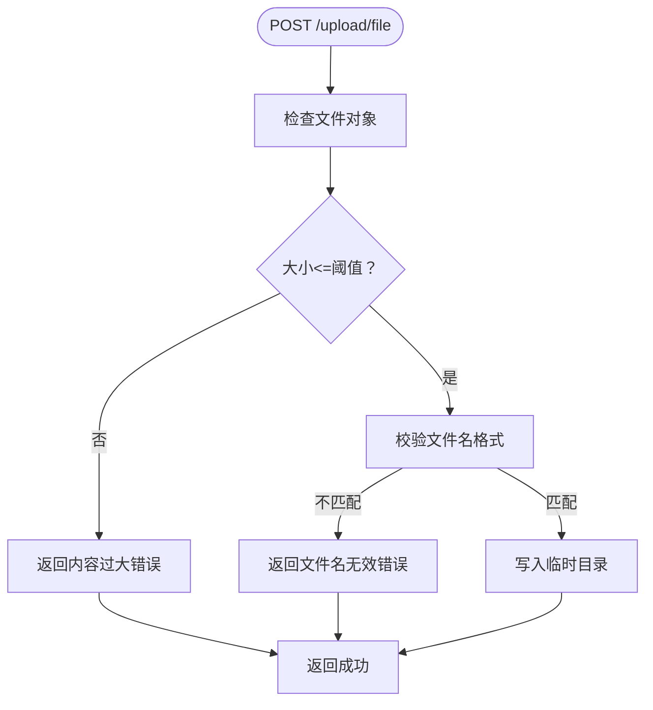
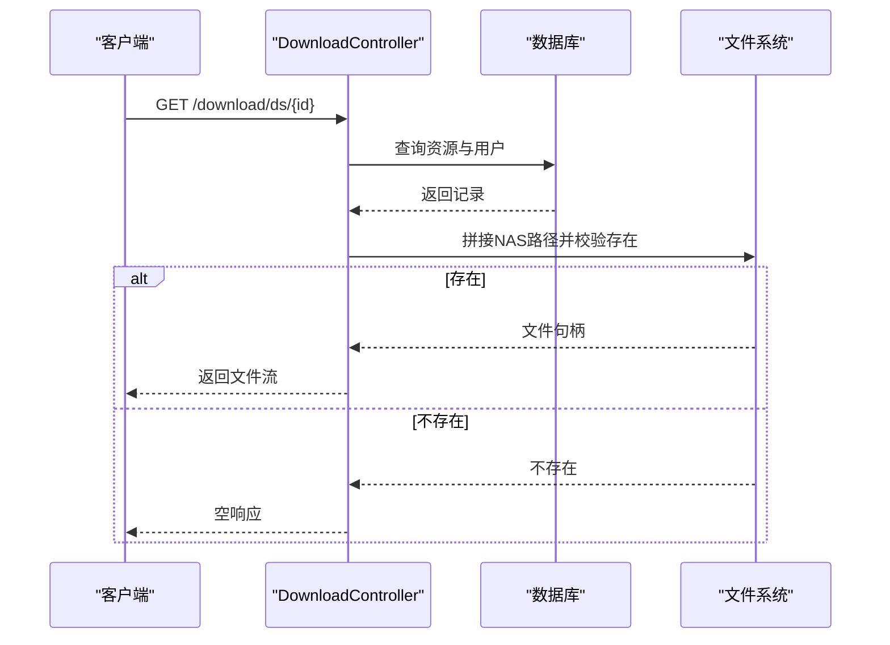
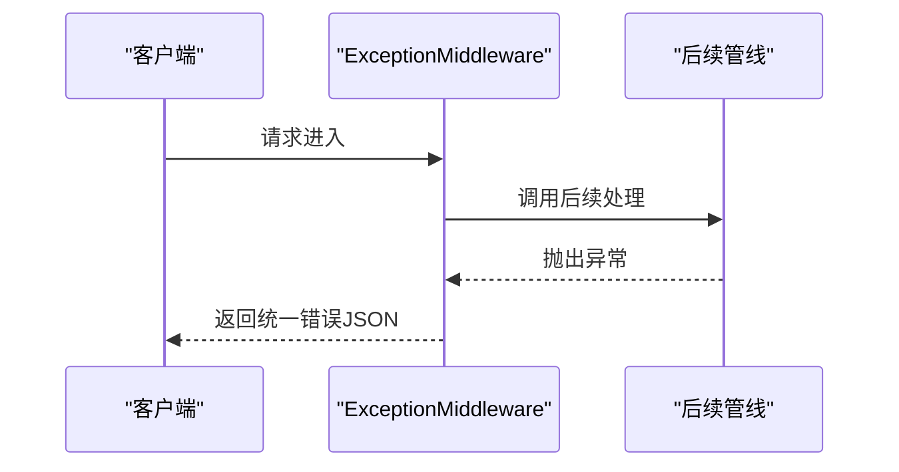
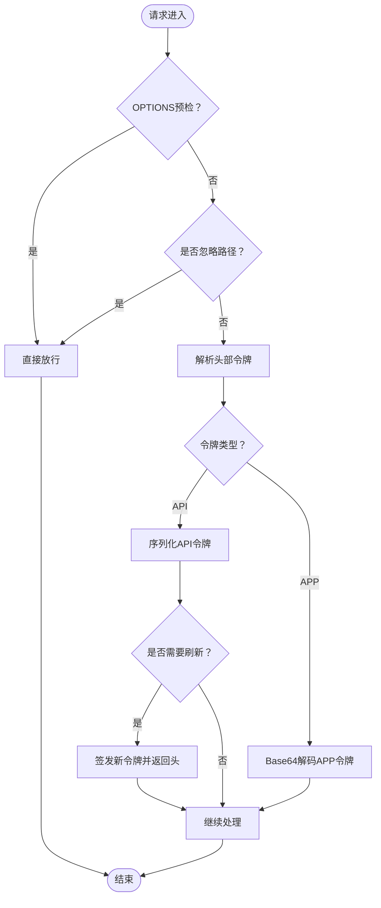
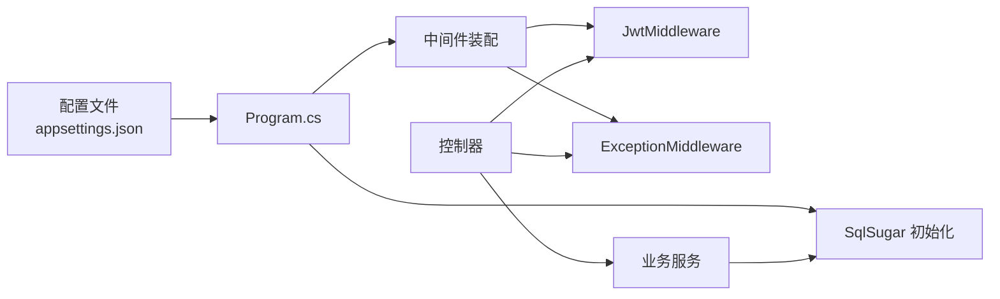

# 常见问题诊断

<cite>
**本文引用的文件**
- [Program.cs](file://Scm.Net/Program.cs)
- [appsettings.json](file://Scm.Net/appsettings.json)
- [appsettings.Development.json](file://Scm.Net/appsettings.Development.json)
- [JwtMiddleware.cs](file://Scm.Core/Configure/Middleware/JwtMiddleware.cs)
- [ExceptionMiddleware.cs](file://Scm.Core/Configure/Middleware/ExceptionMiddleware.cs)
- [UploadController.cs](file://Scm.Net/Controllers/UploadController.cs)
- [DownloadController.cs](file://Scm.Net/Controllers/DownloadController.cs)
- [BusinessException.cs](file://Scm.Common/Exceptions/BusinessException.cs)
- [OperatorService.cs](file://Scm.Core/Operator/OperatorService.cs)
- [ScmResultEnum.cs](file://Scm.Common/Enums/ScmResultEnum.cs)
</cite>

## 目录
1. [简介](#简介)
2. [项目结构](#项目结构)
3. [核心组件](#核心组件)
4. [架构总览](#架构总览)
5. [详细组件分析](#详细组件分析)
6. [依赖关系分析](#依赖关系分析)
7. [性能与容量考虑](#性能与容量考虑)
8. [故障排查指南](#故障排查指南)
9. [结论](#结论)
10. [附录](#附录)

## 简介
本指南面向 Scm.Net 的运维与开发人员，聚焦于常见问题的“症状—原因—解决”三段式诊断流程，覆盖认证失败、文件上传错误、数据库连接问题、权限不足等典型场景。文档提供问题分类表、自检清单、快速排查步骤，并结合错误代码与异常信息定位根因，同时给出针对用户认证、文件管理、数据库等组件的专项诊断方法。

## 项目结构
Scm.Net 采用 ASP.NET Core 主机 + 多模块分层架构：
- 启动与配置：Program.cs 负责环境、数据库、缓存、Swagger、跨域、JWT、异常中间件、控制器映射等装配。
- 配置文件：appsettings.json 提供生产默认配置；appsettings.Development.json 提供开发环境覆盖项。
- 中间件：JwtMiddleware 实现请求级令牌解析与刷新策略；ExceptionMiddleware 统一异常输出。
- 控制器：UploadController 提供文件上传入口；DownloadController 提供文件下载入口。
- 业务与通用：OperatorService 负责登录/登出与用户信息；BusinessException 用于业务异常封装；枚举 ScmResultEnum 表达结果状态。

图表来源
- [Program.cs:1-366](file://Scm.Net/Program.cs#L1-L366)
- [JwtMiddleware.cs:1-180](file://Scm.Core/Configure/Middleware/JwtMiddleware.cs#L1-L180)
- [ExceptionMiddleware.cs:1-41](file://Scm.Core/Configure/Middleware/ExceptionMiddleware.cs#L1-L41)
- [UploadController.cs:1-109](file://Scm.Net/Controllers/UploadController.cs#L1-L109)
- [DownloadController.cs:1-70](file://Scm.Net/Controllers/DownloadController.cs#L1-L70)
- [OperatorService.cs:1-800](file://Scm.Core/Operator/OperatorService.cs#L1-L800)
- [BusinessException.cs:1-22](file://Scm.Common/Exceptions/BusinessException.cs#L1-L22)
- [ScmResultEnum.cs:1-15](file://Scm.Common/Enums/ScmResultEnum.cs#L1-L15)

章节来源
- [Program.cs:1-366](file://Scm.Net/Program.cs#L1-L366)
- [appsettings.json:1-127](file://Scm.Net/appsettings.json#L1-L127)
- [appsettings.Development.json:1-162](file://Scm.Net/appsettings.Development.json#L1-L162)

## 核心组件
- 应用启动与配置：负责环境变量、数据库初始化、缓存、Swagger、跨域、JWT、SignalR、Mapper、控制器路由与中间件链路装配。
- JWT 中间件：对特定忽略路径放行，解析并注入令牌上下文，支持会话刷新头返回。
- 异常中间件：捕获未处理异常，统一返回 JSON 结构的错误响应。
- 上传/下载控制器：提供文件上传与下载能力，包含基础校验与路径拼接。
- 登录服务：支持口令、短信/邮箱一次性验证码、OIDC 联合登录等多种模式，内置多类错误码与日志记录。
- 业务异常与结果枚举：标准化业务异常消息与操作结果表达。

章节来源
- [Program.cs:146-258](file://Scm.Net/Program.cs#L146-L258)
- [JwtMiddleware.cs:42-178](file://Scm.Core/Configure/Middleware/JwtMiddleware.cs#L42-L178)
- [ExceptionMiddleware.cs:17-39](file://Scm.Core/Configure/Middleware/ExceptionMiddleware.cs#L17-L39)
- [UploadController.cs:25-70](file://Scm.Net/Controllers/UploadController.cs#L25-L70)
- [DownloadController.cs:24-67](file://Scm.Net/Controllers/DownloadController.cs#L24-L67)
- [OperatorService.cs:141-200](file://Scm.Core/Operator/OperatorService.cs#L141-L200)
- [BusinessException.cs:8-21](file://Scm.Common/Exceptions/BusinessException.cs#L8-L21)
- [ScmResultEnum.cs:5-13](file://Scm.Common/Enums/ScmResultEnum.cs#L5-L13)

## 架构总览
下图展示请求在系统中的流转：客户端 → 中间件链 → 控制器 → 业务服务 → 数据库/外部资源。

图表来源
- [JwtMiddleware.cs:42-178](file://Scm.Core/Configure/Middleware/JwtMiddleware.cs#L42-L178)
- [ExceptionMiddleware.cs:17-39](file://Scm.Core/Configure/Middleware/ExceptionMiddleware.cs#L17-L39)
- [UploadController.cs:25-70](file://Scm.Net/Controllers/UploadController.cs#L25-L70)
- [DownloadController.cs:24-67](file://Scm.Net/Controllers/DownloadController.cs#L24-L67)
- [OperatorService.cs:141-200](file://Scm.Core/Operator/OperatorService.cs#L141-L200)

## 详细组件分析

### 认证与授权组件（OperatorService）
- 登录模式：口令、手机/邮箱 OTP、OIDC 联合登录。
- 校验与限流：用户名/密码格式、账户状态、登录时间限制、错误次数清零。
- 日志与审计：登录日志、用户登录日志、OIDC 令牌交换日志。
- 错误码：登录响应中包含多种错误码，便于前端提示与定位。

图表来源
- [OperatorService.cs:141-200](file://Scm.Core/Operator/OperatorService.cs#L141-L200)
- [OperatorService.cs:225-302](file://Scm.Core/Operator/OperatorService.cs#L225-L302)
- [OperatorService.cs:310-419](file://Scm.Core/Operator/OperatorService.cs#L310-L419)
- [OperatorService.cs:427-554](file://Scm.Core/Operator/OperatorService.cs#L427-L554)

章节来源
- [OperatorService.cs:141-200](file://Scm.Core/Operator/OperatorService.cs#L141-L200)
- [OperatorService.cs:225-302](file://Scm.Core/Operator/OperatorService.cs#L225-L302)
- [OperatorService.cs:310-419](file://Scm.Core/Operator/OperatorService.cs#L310-L419)
- [OperatorService.cs:427-554](file://Scm.Core/Operator/OperatorService.cs#L427-L554)

### 文件上传组件（UploadController）
- 小文件上传：校验文件对象、大小阈值、命名规则（64字符哈希+“.nas”），写入临时目录。
- 大文件上传：预留分片上传、校验与合并接口（当前实现占位）。

图表来源
- [UploadController.cs:25-70](file://Scm.Net/Controllers/UploadController.cs#L25-L70)

章节来源
- [UploadController.cs:25-70](file://Scm.Net/Controllers/UploadController.cs#L25-L70)

### 文件下载组件（DownloadController）
- 小文件下载：根据 id 查询资源与用户，拼接 NAS 目录下的物理路径，校验文件存在性，返回二进制流。
- 注意：当前实现返回 octet-stream，未设置 Content-Disposition 下载文件名头。

图表来源
- [DownloadController.cs:24-67](file://Scm.Net/Controllers/DownloadController.cs#L24-L67)

章节来源
- [DownloadController.cs:24-67](file://Scm.Net/Controllers/DownloadController.cs#L24-L67)

### 异常处理与中间件（ExceptionMiddleware）
- 捕获控制器与业务层未处理异常，统一返回 JSON 结构的错误响应，包含状态码与消息。

图表来源
- [ExceptionMiddleware.cs:17-39](file://Scm.Core/Configure/Middleware/ExceptionMiddleware.cs#L17-L39)

章节来源
- [ExceptionMiddleware.cs:17-39](file://Scm.Core/Configure/Middleware/ExceptionMiddleware.cs#L17-L39)

### JWT 中间件（JwtMiddleware）
- 忽略路径：swagger、/scmhub、/api-config、/upload/ 等。
- 令牌解析：支持网页口令令牌与应用绑定令牌，必要时刷新并返回 X-Refresh-Token 头。

图表来源
- [JwtMiddleware.cs:42-178](file://Scm.Core/Configure/Middleware/JwtMiddleware.cs#L42-L178)

章节来源
- [JwtMiddleware.cs:42-178](file://Scm.Core/Configure/Middleware/JwtMiddleware.cs#L42-L178)

## 依赖关系分析
- 启动装配依赖配置文件与环境变量，数据库通过 SqlSugar 初始化并注册为单例，仓储层以泛型 SugarRepository<> 提供。
- 控制器依赖环境配置与数据库客户端，业务服务依赖 SqlSugar、缓存、日志与第三方 OIDC/Otp 配置。
- 中间件链路：路由 → 跨域 → 认证 → 授权 → 自定义中间件 → 控制器 → 异常中间件。

图表来源
- [Program.cs:282-356](file://Scm.Net/Program.cs#L282-L356)
- [appsettings.json:48-51](file://Scm.Net/appsettings.json#L48-L51)

章节来源
- [Program.cs:282-356](file://Scm.Net/Program.cs#L282-L356)
- [appsettings.json:48-51](file://Scm.Net/appsettings.json#L48-L51)

## 性能与容量考虑
- 上传限制：小文件大小阈值与命名规则限制，避免异常体积与非预期命名导致的磁盘与解析压力。
- 数据库：SqlSugar 在执行 SQL 前会进行日志替换与调试输出，建议在生产关闭或降低日志级别。
- 跨域与中间件：全局跨域与中间件链路应按需开启，减少不必要的处理开销。
- 下载：直接物理文件返回，注意大文件并发下载对磁盘 IO 的影响。

[本节为通用指导，无需列出具体文件来源]

## 故障排查指南

### 问题分类与自检清单
- 认证失败
  - 症状：登录接口返回错误码、无法获取访问令牌、前端无用户信息。
  - 自检要点：登录模式是否正确、验证码/口令/手机/邮箱是否符合要求、账户状态是否正常、是否触发登录限制。
  - 关联组件：OperatorService、JwtMiddleware、ExceptionMiddleware。
- 文件上传错误
  - 症状：上传接口返回失败、文件未落盘、命名不合法、体积超限。
  - 自检要点：文件对象是否为空、大小是否超过阈值、文件名是否满足 64 字符哈希+.nas 规则、临时目录权限。
  - 关联组件：UploadController、Environment 配置。
- 数据库连接问题
  - 症状：启动时报数据库初始化失败、查询/更新报错、SQL 日志异常。
  - 自检要点：连接字符串是否正确、数据库文件是否存在、SQLite 路径是否可写、SqlSugar 初始化是否成功。
  - 关联组件：Program.cs 的 SqlSetup、appsettings.json 的 Sql 节点。
- 权限不足
  - 症状：401/403、无法访问受保护接口、JWT 刷新头缺失。
  - 自检要点：请求头是否包含有效令牌、是否命中忽略路径、是否正确设置跨域与授权策略。
  - 关联组件：JwtMiddleware、ExceptionMiddleware、Program.cs 的路由与授权。

### 问题自检清单（按问题类型）
- 认证失败
  - 是否选择了正确的登录模式？
  - 验证码/口令/手机号/邮箱是否通过格式校验？
  - 账户是否被冻结或受限登录？
  - 是否触发了登录错误计数与时间限制？
- 文件上传错误
  - 上传文件对象是否为空？
  - 文件大小是否超过阈值？
  - 文件名是否满足 64 字符哈希+.nas 规则？
  - 临时目录是否存在且可写？
- 数据库连接问题
  - 连接字符串是否指向正确的数据库文件？
  - 数据库文件是否存在且可读写？
  - SqlSugar 初始化日志是否报错？
  - 开发/生产配置文件中的路径是否一致？
- 权限不足
  - 请求头是否包含有效的令牌？
  - 是否命中忽略路径（如 /upload/）？
  - 跨域与授权中间件是否正确装配？

### 通过错误代码与异常信息定位根因
- 登录错误码（来源于登录响应的错误码字段）
  - 示例：口令登录错误、验证码错误、账户不存在、账户冻结、登录受限等。
  - 定位路径：登录主流程与各子流程的错误分支。
- 业务异常
  - BusinessException 用于抛出明确的业务错误消息，便于前端展示与定位。
  - 定位路径：业务调用处抛出异常的位置。
- 统一异常响应
  - ExceptionMiddleware 将未处理异常包装为统一 JSON 响应，包含状态码与消息。
  - 定位路径：异常发生点与中间件处理逻辑。

章节来源
- [OperatorService.cs:141-200](file://Scm.Core/Operator/OperatorService.cs#L141-L200)
- [OperatorService.cs:225-302](file://Scm.Core/Operator/OperatorService.cs#L225-L302)
- [OperatorService.cs:310-419](file://Scm.Core/Operator/OperatorService.cs#L310-L419)
- [OperatorService.cs:427-554](file://Scm.Core/Operator/OperatorService.cs#L427-L554)
- [BusinessException.cs:8-21](file://Scm.Common/Exceptions/BusinessException.cs#L8-L21)
- [ExceptionMiddleware.cs:29-39](file://Scm.Core/Configure/Middleware/ExceptionMiddleware.cs#L29-L39)

### 针对不同组件的专项诊断方法
- 用户认证（OperatorService）
  - 使用登录接口前，先核对登录模式与参数；若为口令登录，检查账户状态与时间限制；若为 OTP 或 OIDC，检查缓存与第三方服务可用性。
  - 查看登录日志与用户登录日志，确认错误码与原因描述。
- 文件管理（UploadController / DownloadController）
  - 上传：确认文件大小与命名规则；检查临时目录权限；查看日志中“上传文件为空/内容过大/文件名无效”的记录。
  - 下载：确认资源记录与用户归属；核对 NAS 路径拼接与文件存在性；检查返回 MIME 类型与空响应情况。
- 数据库（Program.cs SqlSetup / appsettings.json Sql）
  - 核对连接字符串与数据库文件路径；确保数据库文件存在且可读写；在开发环境启用更详细的日志以观察初始化过程。
- JWT 与权限（JwtMiddleware / Program.cs 授权）
  - 确认请求头是否包含有效令牌；检查是否命中忽略路径；核对跨域与授权中间件顺序；关注 X-Refresh-Token 头是否返回。

章节来源
- [UploadController.cs:25-70](file://Scm.Net/Controllers/UploadController.cs#L25-L70)
- [DownloadController.cs:24-67](file://Scm.Net/Controllers/DownloadController.cs#L24-L67)
- [Program.cs:282-356](file://Scm.Net/Program.cs#L282-L356)
- [appsettings.json:48-51](file://Scm.Net/appsettings.json#L48-L51)
- [JwtMiddleware.cs:42-178](file://Scm.Core/Configure/Middleware/JwtMiddleware.cs#L42-L178)

## 结论
通过将问题归类、建立自检清单、结合错误码与异常信息、并针对认证、文件、数据库与权限等关键组件进行专项诊断，可显著提升问题定位效率与修复速度。建议在开发与生产环境中分别完善日志级别与监控告警，以便快速发现与响应异常。

## 附录

### 常见问题分类表
- 认证失败
  - 口令登录错误、验证码错误、账户不存在、账户冻结、登录受限、OIDC 授权失败
- 文件上传错误
  - 文件对象为空、内容过大、文件名不合法、临时目录不可写
- 数据库连接问题
  - 连接字符串错误、数据库文件不存在、初始化失败、权限不足
- 权限不足
  - 未携带令牌、令牌无效、跨域/授权配置不当、被忽略路径误判

### 快速排查步骤
- 认证失败
  - 1) 确认登录模式与参数；2) 检查账户状态与登录限制；3) 核对验证码/口令/OIDC 配置；4) 查看登录日志与错误码。
- 文件上传错误
  - 1) 检查文件对象与大小；2) 校验文件名格式；3) 确认临时目录权限；4) 查看上传日志。
- 数据库连接问题
  - 1) 核对连接字符串与路径；2) 确认数据库文件存在；3) 检查初始化日志；4) 对比开发/生产配置。
- 权限不足
  - 1) 检查请求头令牌；2) 确认是否命中忽略路径；3) 校验跨域与授权中间件；4) 关注 X-Refresh-Token 头。