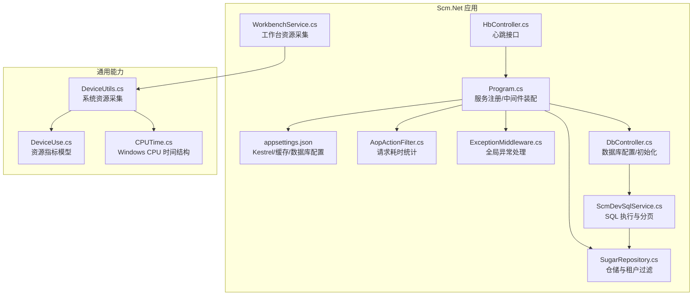
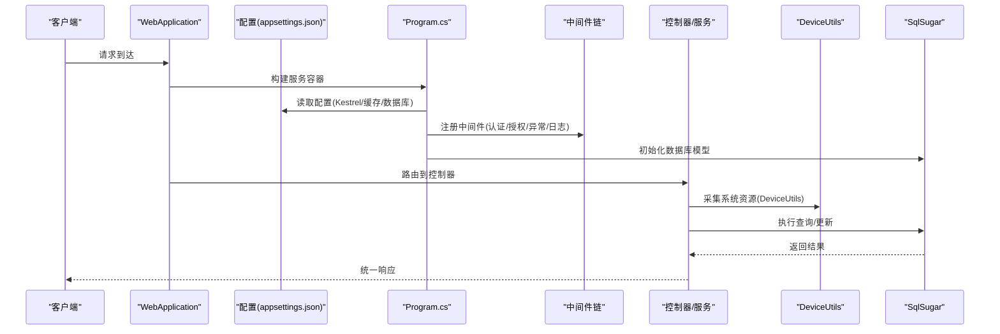
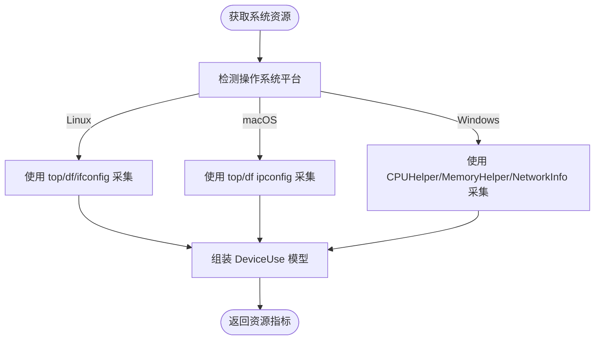
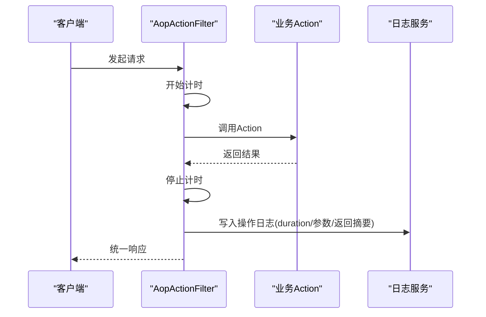
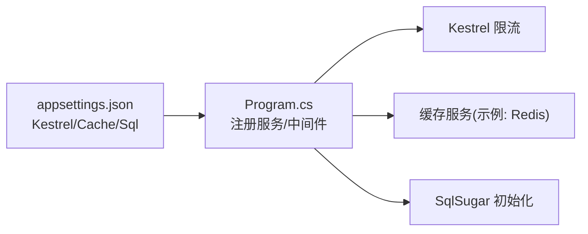
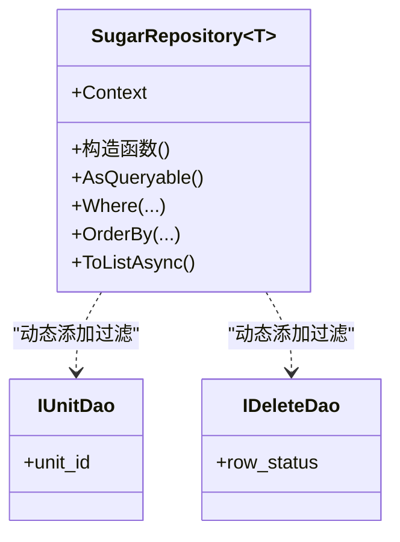
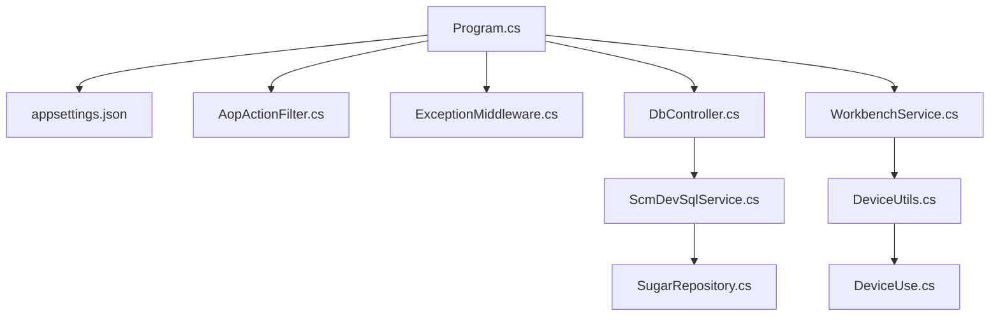

# 性能监控和优化

<cite>
**本文引用的文件**   
- [Program.cs](file://Scm.Net/Program.cs)
- [appsettings.json](file://Scm.Net/appsettings.json)
- [DeviceUtils.cs](file://Scm.Common.Os/DeviceUtils.cs)
- [DeviceUse.cs](file://Scm.Common.Os/DeviceUse.cs)
- [CPUTime.cs](file://Scm.Common.Os/OS/Windows/Cpu/CPUTime.cs)
- [WorkbenchService.cs](file://Scm.Core/Operator/WorkbenchService.cs)
- [AopActionFilter.cs](file://Scm.Core/Configure/Filters/AopActionFilter.cs)
- [ExceptionMiddleware.cs](file://Scm.Core/Configure/Middleware/ExceptionMiddleware.cs)
- [ICacheService.cs](file://Scm.Cache/Cache/ICacheService.cs)
- [DbController.cs](file://Scm.Net/Controllers/DbController.cs)
- [ScmDevSqlService.cs](file://Scm.Core/Dev/Sql/ScmDevSqlService.cs)
- [SugarRepository.cs](file://Scm.Dsa.Dba.Sugar/SugarRepository.cs)
- [HbController.cs](file://Scm.Net/Controllers/HbController.cs)
</cite>

## 目录
1. [简介](#简介)
2. [项目结构](#项目结构)
3. [核心组件](#核心组件)
4. [架构总览](#架构总览)
5. [详细组件分析](#详细组件分析)
6. [依赖关系分析](#依赖关系分析)
7. [性能考量与优化建议](#性能考量与优化建议)
8. [故障排查指南](#故障排查指南)
9. [结论](#结论)
10. [附录](#附录)

## 简介
本指南面向 Scm.Net 的性能监控与优化，围绕系统运行指标采集（CPU、内存、磁盘 I/O、网络）、慢查询与并发问题诊断、数据库与缓存优化、代码性能优化、负载与压力测试方法，以及高可用与扩容最佳实践展开。文档结合仓库中的实际实现，给出可落地的监控方案与优化路径。

## 项目结构
Scm.Net 采用 ASP.NET Core 主机，通过 Program.cs 进行服务注册与中间件装配；系统通过配置文件 appsettings.json 控制 Kestrel、缓存、数据库等关键参数；性能相关能力由通用模块 Scm.Common.Os 提供系统资源采集，核心服务通过 AOP 过滤器记录耗时与日志，仓储层基于 SqlSugar 实现数据访问。

**图表来源**
- [Program.cs:174-258](file://Scm.Net/Program.cs#L174-L258)
- [appsettings.json:26-60](file://Scm.Net/appsettings.json#L26-L60)
- [DeviceUtils.cs:131-244](file://Scm.Common.Os/DeviceUtils.cs#L131-L244)
- [DeviceUse.cs:1-25](file://Scm.Common.Os/DeviceUse.cs#L1-L25)
- [CPUTime.cs:6-28](file://Scm.Common.Os/OS/Windows/Cpu/CPUTime.cs#L6-L28)
- [WorkbenchService.cs:26-38](file://Scm.Core/Operator/WorkbenchService.cs#L26-L38)
- [AopActionFilter.cs:223-276](file://Scm.Core/Configure/Filters/AopActionFilter.cs#L223-L276)
- [ExceptionMiddleware.cs:17-39](file://Scm.Core/Configure/Middleware/ExceptionMiddleware.cs#L17-L39)
- [DbController.cs:251-274](file://Scm.Net/Controllers/DbController.cs#L251-L274)
- [ScmDevSqlService.cs:207-295](file://Scm.Core/Dev/Sql/ScmDevSqlService.cs#L207-L295)
- [SugarRepository.cs:13-37](file://Scm.Dsa.Dba.Sugar/SugarRepository.cs#L13-L37)
- [HbController.cs:1-45](file://Scm.Net/Controllers/HbController.cs#L1-L45)

**章节来源**
- [Program.cs:174-258](file://Scm.Net/Program.cs#L174-L258)
- [appsettings.json:26-60](file://Scm.Net/appsettings.json#L26-L60)

## 核心组件
- 系统资源采集：DeviceUtils 提供跨平台 CPU、内存、磁盘、网络指标采集；WorkbenchService 对外暴露资源使用查询接口。
- 请求性能采集：AopActionFilter 在 Action 前后计时，记录接口耗时与日志，便于慢请求定位。
- 异常与稳定性：ExceptionMiddleware 统一异常处理，避免未捕获异常影响服务稳定性。
- 数据库与缓存：Program.cs 注册 SqlSugar 与缓存服务；appsettings.json 提供 Kestrel 并发与请求体限制、缓存与数据库配置。
- SQL 执行与分页：ScmDevSqlService 动态解析 SQL，自动注入 count(*) 计数并按 limit/page 生成分页查询。
- 仓储与租户：SugarRepository 注入表级查询过滤，支持多租户隔离。

**章节来源**
- [DeviceUtils.cs:131-244](file://Scm.Common.Os/DeviceUtils.cs#L131-L244)
- [WorkbenchService.cs:26-38](file://Scm.Core/Operator/WorkbenchService.cs#L26-L38)
- [AopActionFilter.cs:223-276](file://Scm.Core/Configure/Filters/AopActionFilter.cs#L223-L276)
- [ExceptionMiddleware.cs:17-39](file://Scm.Core/Configure/Middleware/ExceptionMiddleware.cs#L17-L39)
- [Program.cs:72-73](file://Scm.Net/Program.cs#L72-L73)
- [appsettings.json:26-60](file://Scm.Net/appsettings.json#L26-L60)
- [ScmDevSqlService.cs:247-266](file://Scm.Core/Dev/Sql/ScmDevSqlService.cs#L247-L266)
- [SugarRepository.cs:29-37](file://Scm.Dsa.Dba.Sugar/SugarRepository.cs#L29-L37)

## 架构总览
下图展示 Scm.Net 启动流程、中间件链路、资源采集与数据库初始化的关键交互。

**图表来源**
- [Program.cs:33-258](file://Scm.Net/Program.cs#L33-L258)
- [appsettings.json:26-60](file://Scm.Net/appsettings.json#L26-L60)
- [DeviceUtils.cs:131-244](file://Scm.Common.Os/DeviceUtils.cs#L131-L244)
- [DbController.cs:251-274](file://Scm.Net/Controllers/DbController.cs#L251-L274)

## 详细组件分析

### 系统资源监控与采集
- 跨平台采集：DeviceUtils 在 Linux、macOS、Windows 上分别通过命令行与系统 API 采集 CPU、内存、磁盘与网络指标，并封装为 DeviceUse 模型。
- 工作台集成：WorkbenchService 直接调用 DeviceUtils 获取实时资源使用情况，便于前端展示与告警联动。
- 指标含义：
  - CpuRate：CPU 使用率
  - MemoryRate：内存使用率
  - DiskRate：磁盘使用率
  - NetWorkUp/NetWorkDown：网络上/下行包计数
  - RunTime：进程运行时长

**图表来源**
- [DeviceUtils.cs:138-243](file://Scm.Common.Os/DeviceUtils.cs#L138-L243)
- [DeviceUse.cs:1-25](file://Scm.Common.Os/DeviceUse.cs#L1-L25)

**章节来源**
- [DeviceUtils.cs:131-244](file://Scm.Common.Os/DeviceUtils.cs#L131-L244)
- [DeviceUse.cs:1-25](file://Scm.Common.Os/DeviceUse.cs#L1-L25)
- [WorkbenchService.cs:26-38](file://Scm.Core/Operator/WorkbenchService.cs#L26-L38)

### 请求耗时与慢查询定位
- AOP 计时：AopActionFilter 在 Action 执行前后使用 Stopwatch 计时，记录 duration 并写入操作日志，便于识别慢接口。
- 日志字段：包含模块、方法、URL、参数、耗时、返回内容摘要等，支持后续聚合分析。
- SQL 执行：ScmDevSqlService 自动为 SELECT 语句注入 count(*) 计数，结合 page/limit 生成分页查询，避免一次性拉取大量数据导致延迟。

**图表来源**
- [AopActionFilter.cs:223-276](file://Scm.Core/Configure/Filters/AopActionFilter.cs#L223-L276)
- [ScmDevSqlService.cs:247-266](file://Scm.Core/Dev/Sql/ScmDevSqlService.cs#L247-L266)

**章节来源**
- [AopActionFilter.cs:223-276](file://Scm.Core/Configure/Filters/AopActionFilter.cs#L223-L276)
- [ScmDevSqlService.cs:247-266](file://Scm.Core/Dev/Sql/ScmDevSqlService.cs#L247-L266)

### 数据库与缓存配置
- Kestrel 并发与请求体限制：appsettings.json 中 Limits.MaxConcurrentConnections 与 MaxRequestBodySize 控制并发与上传体积，避免资源被突发请求打满。
- 缓存配置：Cache.Type/Text 指定 Redis 连接参数，Program.cs 注册缓存服务，便于热点数据加速与会话存储。
- 数据库连接：Program.cs 基于 SqlSugar 初始化数据库模型与连接，支持多库扩展。

**图表来源**
- [appsettings.json:26-60](file://Scm.Net/appsettings.json#L26-L60)
- [Program.cs:72-73](file://Scm.Net/Program.cs#L72-L73)
- [Program.cs:282-356](file://Scm.Net/Program.cs#L282-L356)

**章节来源**
- [appsettings.json:26-60](file://Scm.Net/appsettings.json#L26-L60)
- [Program.cs:72-73](file://Scm.Net/Program.cs#L72-L73)
- [Program.cs:282-356](file://Scm.Net/Program.cs#L282-L356)

### 仓储与租户过滤
- 表级过滤：SugarRepository 在构造时根据 DAO 类型动态添加查询过滤器，实现多租户隔离与软删除过滤，减少不必要数据扫描。
- 适用场景：IUnitDao/IStatusDao 等接口标记的 DAO 自动生效，降低业务层重复过滤逻辑。

**图表来源**
- [SugarRepository.cs:13-37](file://Scm.Dsa.Dba.Sugar/SugarRepository.cs#L13-L37)

**章节来源**
- [SugarRepository.cs:13-37](file://Scm.Dsa.Dba.Sugar/SugarRepository.cs#L13-L37)

### 心跳与健康检查
- HbController 提供 Echo 与终端心跳接口，便于外部探活与设备上报。
- 可结合工作台资源采集接口与日志聚合，形成完整的健康度画像。

**章节来源**
- [HbController.cs:1-45](file://Scm.Net/Controllers/HbController.cs#L1-L45)
- [WorkbenchService.cs:26-38](file://Scm.Core/Operator/WorkbenchService.cs#L26-L38)

## 依赖关系分析
- 启动阶段：Program.cs 读取 appsettings.json，注册缓存、数据库、中间件、路由与 SignalR 等。
- 运行阶段：AopActionFilter 与 ExceptionMiddleware 形成请求链路的性能与稳定性保障；DeviceUtils 为资源监控提供底层能力。
- 数据访问：ScmDevSqlService 与 SugarRepository 协同，前者负责 SQL 解析与分页，后者负责租户与状态过滤。

**图表来源**
- [Program.cs:174-258](file://Scm.Net/Program.cs#L174-L258)
- [appsettings.json:26-60](file://Scm.Net/appsettings.json#L26-L60)
- [AopActionFilter.cs:223-276](file://Scm.Core/Configure/Filters/AopActionFilter.cs#L223-L276)
- [ExceptionMiddleware.cs:17-39](file://Scm.Core/Configure/Middleware/ExceptionMiddleware.cs#L17-L39)
- [DbController.cs:251-274](file://Scm.Net/Controllers/DbController.cs#L251-L274)
- [ScmDevSqlService.cs:207-295](file://Scm.Core/Dev/Sql/ScmDevSqlService.cs#L207-L295)
- [SugarRepository.cs:13-37](file://Scm.Dsa.Dba.Sugar/SugarRepository.cs#L13-L37)
- [WorkbenchService.cs:26-38](file://Scm.Core/Operator/WorkbenchService.cs#L26-L38)
- [DeviceUtils.cs:131-244](file://Scm.Common.Os/DeviceUtils.cs#L131-L244)
- [DeviceUse.cs:1-25](file://Scm.Common.Os/DeviceUse.cs#L1-L25)

**章节来源**
- [Program.cs:174-258](file://Scm.Net/Program.cs#L174-L258)
- [AopActionFilter.cs:223-276](file://Scm.Core/Configure/Filters/AopActionFilter.cs#L223-L276)
- [ExceptionMiddleware.cs:17-39](file://Scm.Core/Configure/Middleware/ExceptionMiddleware.cs#L17-L39)
- [DeviceUtils.cs:131-244](file://Scm.Common.Os/DeviceUtils.cs#L131-L244)

## 性能考量与优化建议

### 1. 监控指标采集与分析
- CPU/内存/磁盘/网络：通过 DeviceUtils 采集并持久化，结合工作台接口对外展示；建议接入时序数据库或监控面板，设置阈值告警。
- 请求耗时：AopActionFilter 已记录 duration，建议将日志写入集中式日志系统，按接口、URL、方法维度聚合，识别 Top N 慢请求。
- SQL 耗时：结合 ScmDevSqlService 的 count(*) 计数与分页策略，避免全表扫描；对高频查询建立索引或物化视图。

**章节来源**
- [DeviceUtils.cs:131-244](file://Scm.Common.Os/DeviceUtils.cs#L131-L244)
- [WorkbenchService.cs:26-38](file://Scm.Core/Operator/WorkbenchService.cs#L26-L38)
- [AopActionFilter.cs:223-276](file://Scm.Core/Configure/Filters/AopActionFilter.cs#L223-L276)
- [ScmDevSqlService.cs:247-266](file://Scm.Core/Dev/Sql/ScmDevSqlService.cs#L247-L266)

### 2. 慢查询分析与优化
- 自动计数与分页：ScmDevSqlService 对 SELECT 自动注入 count(*) 并按 page/limit 生成分页，建议配合 Explain/Execution Plan 分析慢 SQL。
- 索引与统计：定期分析热点表的索引命中率，补充缺失索引；对大表进行分区或归档。
- 参数化查询：确保所有外部输入均走参数绑定，避免 SQL 注入与计划缓存抖动。

**章节来源**
- [ScmDevSqlService.cs:247-266](file://Scm.Core/Dev/Sql/ScmDevSqlService.cs#L247-L266)

### 3. 并发与资源竞争
- Kestrel 限流：appsettings.json 的 MaxConcurrentConnections 与 MaxRequestBodySize 是第一道防线，建议结合业务峰值压测设定合理上限。
- 缓存命中：通过 ICacheService 的 Get/Set/Remove 接口提升热点数据访问速度；对缓存过期策略进行 A/B 测试，平衡一致性与性能。
- 仓储过滤：SugarRepository 的表级过滤减少无效扫描，但需关注过滤条件的索引覆盖。

**章节来源**
- [appsettings.json:34-37](file://Scm.Net/appsettings.json#L34-L37)
- [ICacheService.cs:6-81](file://Scm.Cache/Cache/ICacheService.cs#L6-L81)
- [SugarRepository.cs:29-37](file://Scm.Dsa.Dba.Sugar/SugarRepository.cs#L29-L37)

### 4. 数据库优化
- 连接池与方言：Program.cs 中 SqlSugar 的 ConnectionConfig 支持不同数据库方言，建议根据目标数据库调整连接池大小与超时。
- 类型映射：针对 SQLite/SqlServer 的类型映射差异已在配置中体现，避免隐式转换带来的性能损耗。
- 多库扩展：DbController 展示了多库初始化流程，建议在生产环境为只读查询单独配置只读副本。

**章节来源**
- [Program.cs:282-356](file://Scm.Net/Program.cs#L282-L356)
- [DbController.cs:251-274](file://Scm.Net/Controllers/DbController.cs#L251-L274)

### 5. 缓存策略优化
- 接口缓存：对静态配置、字典、菜单等低频变更数据设置较长 TTL；对用户个性化数据采用短 TTL 或按用户维度失效。
- 分布式缓存：appsettings.json 指定 Redis，建议开启持久化与主从复制，避免单点。
- 缓存穿透与击穿：对空结果设置短 TTL；热点键采用互斥锁或预热策略。

**章节来源**
- [appsettings.json:57-60](file://Scm.Net/appsettings.json#L57-L60)
- [ICacheService.cs:6-81](file://Scm.Cache/Cache/ICacheService.cs#L6-L81)

### 6. 代码性能优化
- 减少反射与字符串拼接：AOP 日志中参数序列化与字符串替换应避免频繁分配，建议复用缓冲区或使用结构化日志。
- 异步优先：确保数据库与 IO 密集型操作使用异步 API，避免阻塞主线程。
- 响应压缩：在 Kestrel 层启用 Gzip/Deflate，降低带宽占用。

**章节来源**
- [AopActionFilter.cs:223-276](file://Scm.Core/Configure/Filters/AopActionFilter.cs#L223-L276)

### 7. 负载与压力测试
- 工具选择：推荐使用 k6/JMeter/Gatling 等工具，模拟并发用户与事务比例。
- 场景设计：以核心接口（如分页查询、登录、上传）为基准，逐步提升并发与数据规模。
- 指标观测：关注 P95/P99 延迟、错误率、CPU/内存/磁盘 I/O、数据库连接池饱和度、缓存命中率。
- 结果分析：结合 AOP 日志与资源采集，定位瓶颈（CPU/IO/锁/慢 SQL/缓存未命中）。

[本节为通用指导，无需特定文件引用]

### 8. 扩容与高可用
- 无状态水平扩展：将 Session/缓存移至 Redis，确保多实例共享状态。
- 负载均衡：前置 Nginx/Traefik，开启健康检查与会话亲和（如需要）。
- 数据层：主从复制、只读副本、读写分离；对热点表进行分片或冷热分层。
- 监控告警：将 DeviceUtils、AOP 日志、数据库慢查询与连接池指标接入监控平台，设置阈值告警。

[本节为通用指导，无需特定文件引用]

## 故障排查指南
- 全局异常：ExceptionMiddleware 统一捕获异常并返回标准响应，便于前端与运维快速定位。
- 请求耗时：查看 AopActionFilter 写入的日志，定位耗时接口与参数，结合 SQL 执行计划分析。
- 资源异常：通过 WorkbenchService 获取 CPU/内存/磁盘/网络指标，确认是否存在资源瓶颈。
- 心跳与探活：使用 HbController 的 Echo 与心跳接口验证服务可用性与网络连通性。

**章节来源**
- [ExceptionMiddleware.cs:17-39](file://Scm.Core/Configure/Middleware/ExceptionMiddleware.cs#L17-L39)
- [AopActionFilter.cs:223-276](file://Scm.Core/Configure/Filters/AopActionFilter.cs#L223-L276)
- [WorkbenchService.cs:26-38](file://Scm.Core/Operator/WorkbenchService.cs#L26-L38)
- [HbController.cs:1-45](file://Scm.Net/Controllers/HbController.cs#L1-L45)

## 结论
Scm.Net 在启动阶段即提供了完善的配置与中间件体系，结合 DeviceUtils 的系统资源采集与 AOP 的请求耗时统计，能够有效支撑性能监控与优化闭环。通过合理的数据库与缓存策略、严格的并发控制与持续的压力测试，可进一步提升系统稳定性与吞吐能力。建议在生产环境中配套集中式日志与监控平台，形成“采集-分析-告警-优化”的持续改进机制。

## 附录
- 关键配置参考
  - Kestrel 并发与请求体限制：[appsettings.json:34-37](file://Scm.Net/appsettings.json#L34-L37)
  - 缓存配置（Redis）：[appsettings.json:57-60](file://Scm.Net/appsettings.json#L57-L60)
  - JWT 与安全配置：[appsettings.json:100-111](file://Scm.Net/appsettings.json#L100-L111)
- 关键实现参考
  - 资源采集与模型：[DeviceUtils.cs:131-244](file://Scm.Common.Os/DeviceUtils.cs#L131-L244)、[DeviceUse.cs:1-25](file://Scm.Common.Os/DeviceUse.cs#L1-L25)
  - 请求耗时与日志：[AopActionFilter.cs:223-276](file://Scm.Core/Configure/Filters/AopActionFilter.cs#L223-L276)
  - 数据库初始化与连接：[Program.cs:282-356](file://Scm.Net/Program.cs#L282-L356)
  - SQL 执行与分页：[ScmDevSqlService.cs:247-266](file://Scm.Core/Dev/Sql/ScmDevSqlService.cs#L247-L266)
  - 仓储与租户过滤：[SugarRepository.cs:13-37](file://Scm.Dsa.Dba.Sugar/SugarRepository.cs#L13-L37)
  - 心跳接口：[HbController.cs:1-45](file://Scm.Net/Controllers/HbController.cs#L1-L45)