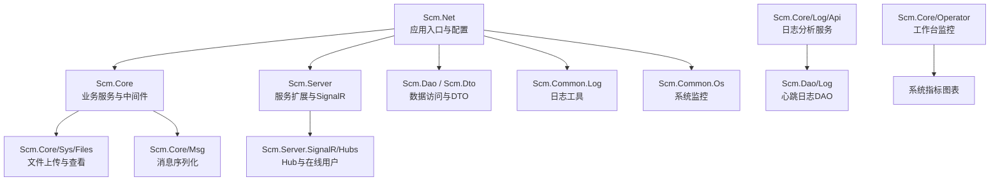
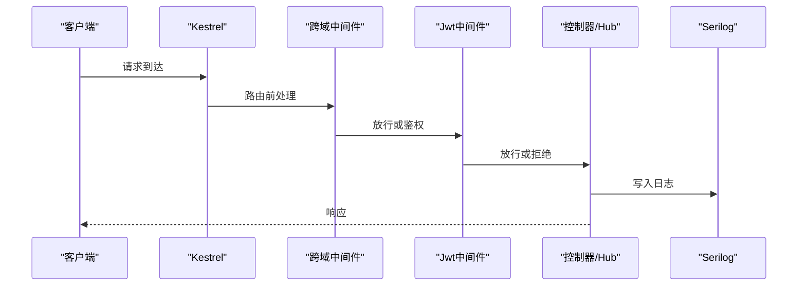
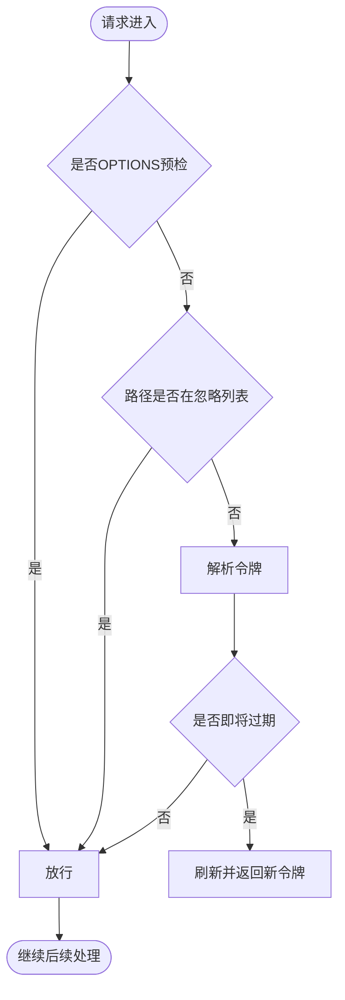
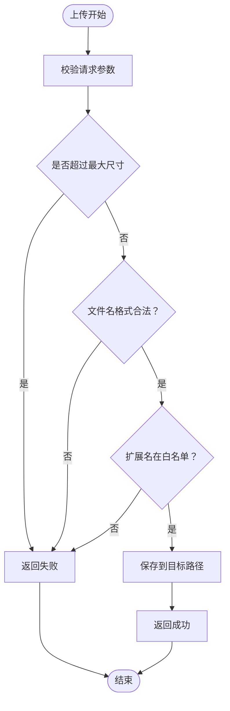
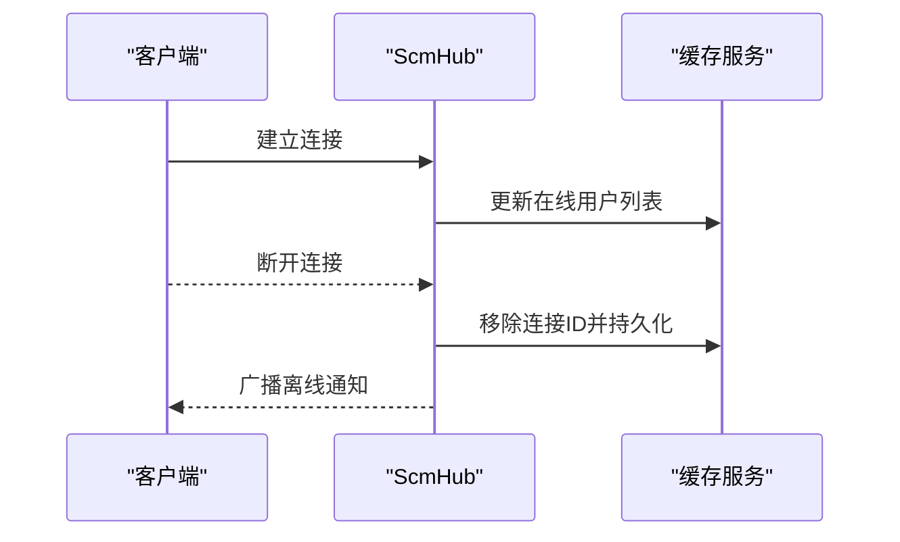
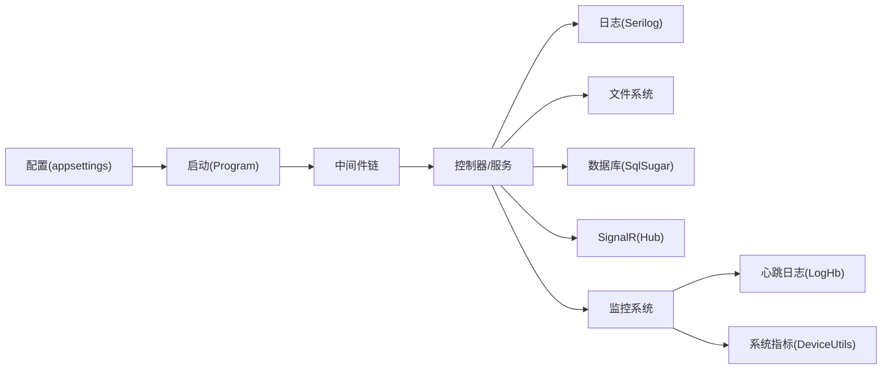

# 故障排除和常见问题

<cite>
**本文引用的文件**
- [Scm.Net/appsettings.json](file://Scm.Net/appsettings.json)
- [Scm.Net/appsettings.Development.json](file://Scm.Net/appsettings.Development.json)
- [Scm.Net/Program.cs](file://Scm.Net/Program.cs)
- [Scm.Net/readme.txt](file://Scm.Net/readme.txt)
- [Scm.Net/Controllers/UploadController.cs](file://Scm.Net/Controllers/UploadController.cs)
- [Scm.Net/Controllers/HbController.cs](file://Scm.Net/Controllers/HbController.cs)
- [Scm.Common.Log/Utils/LogUtils.cs](file://Scm.Common.Log/Utils/LogUtils.cs)
- [Scm.Core/Configure/Middleware/JwtMiddleware.cs](file://Scm.Core/Configure/Middleware/JwtMiddleware.cs)
- [Scm.Core/Configure/Middleware/ExceptionMiddleware.cs](file://Scm.Core/Configure/Middleware/ExceptionMiddleware.cs)
- [Scm.Core/Sys/Files/ScmSysFileService.cs](file://Scm.Core/Sys/Files/ScmSysFileService.cs)
- [Scm.Core/Msg/SignalRUtil.cs](file://Scm.Core/Msg/SignalRUtil.cs)
- [Scm.Server.SignalR/Hubs/ScmHub.cs](file://Scm.Server.SignalR/Hubs/ScmHub.cs)
- [Scm.Server.SignalR/Hubs/ClientUser.cs](file://Scm.Server.SignalR/Hubs/ClientUser.cs)
- [Nas.Server/Msg/ClientExample.md](file://Nas.Server/Msg/ClientExample.md)
- [Scm.Common.Os/DeviceUtils.cs](file://Scm.Common.Os/DeviceUtils.cs)
- [Scm.Common.Os/DeviceUse.cs](file://Scm.Common.Os/DeviceUse.cs)
- [Scm.Core/Dev/Sql/ScmDevSqlService.cs](file://Scm.Core/Dev/Sql/ScmDevSqlService.cs)
- [Nas.Dao/NasDbHelper.cs](file://Nas.Dao/NasDbHelper.cs)
- [Samples.Server/Book/Rnr/UploadResult.cs](file://Samples.Server/Book/Rnr/UploadResult.cs)
- [Scm.Core/Log/Api/ScmLogApiService.cs](file://Scm.Core/Log/Api/ScmLogApiService.cs)
- [Scm.Dao/Log/LogHbDao.cs](file://Scm.Dao/Log/LogHbDao.cs)
- [Scm.Dto/Log/LogHbDto.cs](file://Scm.Dto/Log/LogHbDto.cs)
- [Scm.Core/Operator/WorkbenchService.cs](file://Scm.Core/Operator/WorkbenchService.cs)
- [Scm.Server.Quartz/Jobs/ApiClientJob.cs](file://Scm.Server.Quartz/Jobs/ApiClientJob.cs)
</cite>

## 更新摘要
**所做更改**
- 新增了完整的故障排除和常见问题文档框架
- 扩展了日志分析和调试章节，包含系统日志图表和心跳监控
- 增加了性能监控和优化的详细指导
- 完善了紧急故障处理和数据备份策略
- 新增了系统监控、健康检查和故障预警的完整配置指南

## 目录
1. [简介](#简介)
2. [项目结构](#项目结构)
3. [核心组件](#核心组件)
4. [架构总览](#架构总览)
5. [详细组件分析](#详细组件分析)
6. [依赖关系分析](#依赖关系分析)
7. [性能注意事项](#性能注意事项)
8. [故障排查指南](#故障排查指南)
9. [结论](#结论)
10. [附录](#附录)

## 简介
本文件面向 Scm.Net 的运维与开发人员，提供系统性故障排除与常见问题解答，覆盖认证问题、文件上传问题、实时通信问题与性能问题的诊断与修复流程；同时给出日志分析方法、调试工具与性能监控技巧，以及系统监控、健康检查、故障预警与紧急恢复策略。

## 项目结构
Scm.Net 采用多项目分层组织，核心入口位于 Scm.Net，业务与服务分布在 Scm.Core、Scm.Server、Scm.Dao、Scm.Dto 等模块；日志、信号、上传、文件系统、OS 监控等能力通过独立组件提供。

**图示来源**
- [Scm.Net/Program.cs:1-366](file://Scm.Net/Program.cs#L1-L366)
- [Scm.Core/Sys/Files/ScmSysFileService.cs:82-307](file://Scm.Core/Sys/Files/ScmSysFileService.cs#L82-L307)
- [Scm.Core/Msg/SignalRUtil.cs:1-35](file://Scm.Core/Msg/SignalRUtil.cs#L1-L35)
- [Scm.Server.SignalR/Hubs/ScmHub.cs:74-111](file://Scm.Server.SignalR/Hubs/ScmHub.cs#L74-L111)
- [Scm.Core/Log/Api/ScmLogApiService.cs:70-122](file://Scm.Core/Log/Api/ScmLogApiService.cs#L70-L122)
- [Scm.Dao/Log/LogHbDao.cs:1-53](file://Scm.Dao/Log/LogHbDao.cs#L1-L53)
- [Scm.Core/Operator/WorkbenchService.cs:53-91](file://Scm.Core/Operator/WorkbenchService.cs#L53-L91)

**章节来源**
- [Scm.Net/Program.cs:1-366](file://Scm.Net/Program.cs#L1-L366)
- [Scm.Net/appsettings.json:1-127](file://Scm.Net/appsettings.json#L1-L127)
- [Scm.Net/appsettings.Development.json:1-162](file://Scm.Net/appsettings.Development.json#L1-L162)

## 核心组件
- 启动与配置：Program.cs 负责读取配置、注册服务、中间件、路由与 SignalR 映射。
- 日志：Serilog 在 appsettings 中集中配置，支持控制台与文件输出；LogUtils 提供按位置分类的日志写入。
- 认证与授权：JwtMiddleware 实现令牌解析、刷新与忽略列表；ExceptionMiddleware 统一异常响应。
- 文件上传：UploadController 与 ScmSysFileService 支持多种上传方式与白名单校验。
- 实时通信：SignalR Hub 与客户端示例，支持消息广播与在线用户管理。
- 系统监控：DeviceUtils/DeviceUse 提供 CPU、内存、磁盘、网络与运行时统计。
- 日志分析：ScmLogApiService 提供15日日志图表分析；心跳监控支持设备和服务状态跟踪。
- 性能监控：Quartz任务调度支持定时性能检查和系统健康监控。

**章节来源**
- [Scm.Net/Program.cs:35-258](file://Scm.Net/Program.cs#L35-L258)
- [Scm.Common.Log/Utils/LogUtils.cs:1-122](file://Scm.Common.Log/Utils/LogUtils.cs#L1-L122)
- [Scm.Core/Configure/Middleware/JwtMiddleware.cs:1-180](file://Scm.Core/Configure/Middleware/JwtMiddleware.cs#L1-L180)
- [Scm.Core/Configure/Middleware/ExceptionMiddleware.cs:1-41](file://Scm.Core/Configure/Middleware/ExceptionMiddleware.cs#L1-L41)
- [Scm.Net/Controllers/UploadController.cs:1-109](file://Scm.Net/Controllers/UploadController.cs#L1-L109)
- [Scm.Core/Sys/Files/ScmSysFileService.cs:82-307](file://Scm.Core/Sys/Files/ScmSysFileService.cs#L82-L307)
- [Scm.Core/Msg/SignalRUtil.cs:1-35](file://Scm.Core/Msg/SignalRUtil.cs#L1-L35)
- [Scm.Server.SignalR/Hubs/ScmHub.cs:74-111](file://Scm.Server.SignalR/Hubs/ScmHub.cs#L74-L111)
- [Scm.Common.Os/DeviceUtils.cs:180-275](file://Scm.Common.Os/DeviceUtils.cs#L180-L275)
- [Scm.Core/Log/Api/ScmLogApiService.cs:70-122](file://Scm.Core/Log/Api/ScmLogApiService.cs#L70-L122)
- [Scm.Dao/Log/LogHbDao.cs:1-53](file://Scm.Dao/Log/LogHbDao.cs#L1-L53)
- [Scm.Core/Operator/WorkbenchService.cs:53-91](file://Scm.Core/Operator/WorkbenchService.cs#L53-L91)

## 架构总览
系统启动后，通过中间件链路处理请求：静态文件、路由、跨域、认证、授权、异常处理、控制器与 SignalR。日志由 Serilog 输出到控制台与文件，便于定位问题。

**图示来源**
- [Scm.Net/Program.cs:174-258](file://Scm.Net/Program.cs#L174-L258)
- [Scm.Core/Configure/Middleware/JwtMiddleware.cs:42-97](file://Scm.Core/Configure/Middleware/JwtMiddleware.cs#L42-L97)
- [Scm.Core/Configure/Middleware/ExceptionMiddleware.cs:17-39](file://Scm.Core/Configure/Middleware/ExceptionMiddleware.cs#L17-L39)

## 详细组件分析

### 认证与授权问题
- 症状
  - 401/403 未授权
  - 令牌过期导致频繁刷新失败
  - 预检请求 OPTIONS 被错误拦截
- 诊断要点
  - 检查 JwtMiddleware 忽略列表是否包含目标路径
  - 确认请求头中携带正确的令牌键名
  - 观察 X-Refresh-Token 是否返回
- 修复建议
  - 在 JwtMiddleware 中调整忽略列表
  - 校验 JWT 配置（签发方、受众、密钥）
  - 确保前端正确传递与续期令牌

**图示来源**
- [Scm.Core/Configure/Middleware/JwtMiddleware.cs:25-97](file://Scm.Core/Configure/Middleware/JwtMiddleware.cs#L25-L97)

**章节来源**
- [Scm.Core/Configure/Middleware/JwtMiddleware.cs:1-180](file://Scm.Core/Configure/Middleware/JwtMiddleware.cs#L1-L180)
- [Scm.Net/appsettings.json:100-105](file://Scm.Net/appsettings.json#L100-L105)

### 文件上传问题
- 症状
  - 上传失败、文件名非法、内容过大、扩展名不被允许
  - 分片上传接口未实现或未启用
- 诊断要点
  - UploadController 对小文件上传有长度与命名校验
  - ScmSysFileService 支持多种上传类型与白名单校验
  - 检查上传目录权限与磁盘配额
- 修复建议
  - 使用受支持的扩展名与命名规则
  - 调整白名单配置或关闭校验（谨慎）
  - 确保目标目录存在且可写

**图示来源**
- [Scm.Net/Controllers/UploadController.cs:26-71](file://Scm.Net/Controllers/UploadController.cs#L26-L71)
- [Scm.Core/Sys/Files/ScmSysFileService.cs:84-300](file://Scm.Core/Sys/Files/ScmSysFileService.cs#L84-L300)

**章节来源**
- [Scm.Net/Controllers/UploadController.cs:1-109](file://Scm.Net/Controllers/UploadController.cs#L1-L109)
- [Scm.Core/Sys/Files/ScmSysFileService.cs:82-307](file://Scm.Core/Sys/Files/ScmSysFileService.cs#L82-L307)

### 实时通信（SignalR）问题
- 症状
  - 客户端无法连接 Hub
  - 断线后未清理在线用户
  - 消息序列化异常
- 诊断要点
  - 确认 Hub 路径映射与客户端一致
  - 检查客户端是否正确设置 AccessTokenProvider
  - 观察断开事件是否触发清理逻辑
  - 核对消息序列化选项
- 修复建议
  - 使用官方客户端示例进行对比
  - 确保连接字符串与令牌有效
  - 检查缓存与在线用户集合更新

**图示来源**
- [Scm.Server.SignalR/Hubs/ScmHub.cs:74-111](file://Scm.Server.SignalR/Hubs/ScmHub.cs#L74-L111)
- [Scm.Server.SignalR/Hubs/ClientUser.cs:1-38](file://Scm.Server.SignalR/Hubs/ClientUser.cs#L1-L38)
- [Scm.Core/Msg/SignalRUtil.cs:19-33](file://Scm.Core/Msg/SignalRUtil.cs#L19-L33)
- [Nas.Server/Msg/ClientExample.md:23-79](file://Nas.Server/Msg/ClientExample.md#L23-L79)

**章节来源**
- [Scm.Server.SignalR/Hubs/ScmHub.cs:74-111](file://Scm.Server.SignalR/Hubs/ScmHub.cs#L74-L111)
- [Scm.Server.SignalR/Hubs/ClientUser.cs:1-38](file://Scm.Server.SignalR/Hubs/ClientUser.cs#L1-L38)
- [Scm.Core/Msg/SignalRUtil.cs:1-35](file://Scm.Core/Msg/SignalRUtil.cs#L1-L35)
- [Nas.Server/Msg/ClientExample.md:1-79](file://Nas.Server/Msg/ClientExample.md#L1-L79)

### 性能问题
- 症状
  - 响应缓慢、CPU/内存/磁盘占用高、并发连接受限
- 诊断要点
  - 使用 DeviceUtils 获取系统指标
  - 检查 Kestrel 并发与请求体大小限制
  - 关注数据库 SQL 执行日志
- 修复建议
  - 调整 Kestrel Limits 参数
  - 优化查询与索引
  - 合理使用缓存与异步 I/O

**章节来源**
- [Scm.Common.Os/DeviceUtils.cs:180-275](file://Scm.Common.Os/DeviceUtils.cs#L180-L275)
- [Scm.Net/appsettings.json:26-38](file://Scm.Net/appsettings.json#L26-L38)
- [Scm.Net/Program.cs:326-336](file://Scm.Net/Program.cs#L326-L336)

### 日志分析与监控
- 症状
  - 日志缺失、日志级别不当、日志分析困难
- 诊断要点
  - 检查 Serilog 配置与输出级别
  - 分析15日日志图表趋势
  - 监控心跳日志以跟踪系统状态
- 修复建议
  - 调整日志级别与输出目标
  - 使用日志图表进行趋势分析
  - 设置心跳监控以跟踪设备和服务状态

**章节来源**
- [Scm.Core/Log/Api/ScmLogApiService.cs:70-122](file://Scm.Core/Log/Api/ScmLogApiService.cs#L70-L122)
- [Scm.Dao/Log/LogHbDao.cs:1-53](file://Scm.Dao/Log/LogHbDao.cs#L1-L53)
- [Scm.Dto/Log/LogHbDto.cs:1-33](file://Scm.Dto/Log/LogHbDto.cs#L1-L33)

## 依赖关系分析
- 启动阶段依赖配置与服务注册，随后加载中间件与路由
- 上传与文件服务依赖环境配置与安全白名单
- SignalR 依赖缓存与在线用户集合
- 日志依赖 Serilog 配置与位置分类
- 监控依赖系统指标采集与心跳日志

**图示来源**
- [Scm.Net/Program.cs:35-258](file://Scm.Net/Program.cs#L35-L258)
- [Scm.Net/appsettings.json:3-25](file://Scm.Net/appsettings.json#L3-L25)

**章节来源**
- [Scm.Net/Program.cs:35-258](file://Scm.Net/Program.cs#L35-L258)
- [Scm.Net/appsettings.json:1-127](file://Scm.Net/appsettings.json#L1-L127)

## 性能注意事项
- 合理设置 Kestrel 最大并发连接与请求体大小
- 使用异步 I/O 与流式处理减少内存峰值
- 控制日志级别，避免生产环境过度输出
- 对热点接口增加缓存与限流
- 定期清理临时文件与日志轮转
- 监控系统指标，及时发现性能瓶颈

## 故障排查指南

### 一、认证问题
- 症状
  - 401 未认证、403 禁止访问
  - 刷新令牌失败
- 步骤
  - 检查 JwtMiddleware 忽略列表与请求头键名
  - 核对 appsettings 中 JWT 配置
  - 查看异常中间件输出的错误信息
- 参考
  - [JwtMiddleware:1-180](file://Scm.Core/Configure/Middleware/JwtMiddleware.cs#L1-L180)
  - [ExceptionMiddleware:1-41](file://Scm.Core/Configure/Middleware/ExceptionMiddleware.cs#L1-L41)
  - [appsettings.json(JWT):100-105](file://Scm.Net/appsettings.json#L100-L105)

**章节来源**
- [Scm.Core/Configure/Middleware/JwtMiddleware.cs:1-180](file://Scm.Core/Configure/Middleware/JwtMiddleware.cs#L1-L180)
- [Scm.Core/Configure/Middleware/ExceptionMiddleware.cs:1-41](file://Scm.Core/Configure/Middleware/ExceptionMiddleware.cs#L1-L41)
- [Scm.Net/appsettings.json:100-105](file://Scm.Net/appsettings.json#L100-L105)

### 二、文件上传问题
- 症状
  - 文件名非法、扩展名不被允许、内容过大
- 步骤
  - 检查 UploadController 的校验逻辑
  - 核对 ScmSysFileService 的白名单与保存路径
  - 确认上传目录权限与磁盘空间
- 参考
  - [UploadController:26-71](file://Scm.Net/Controllers/UploadController.cs#L26-L71)
  - [ScmSysFileService:84-300](file://Scm.Core/Sys/Files/ScmSysFileService.cs#L84-L300)

**章节来源**
- [Scm.Net/Controllers/UploadController.cs:1-109](file://Scm.Net/Controllers/UploadController.cs#L1-L109)
- [Scm.Core/Sys/Files/ScmSysFileService.cs:82-307](file://Scm.Core/Sys/Files/ScmSysFileService.cs#L82-L307)

### 三、实时通信问题
- 症状
  - 客户端无法连接、断线未清理、消息序列化异常
- 步骤
  - 对照客户端示例检查连接与令牌
  - 观察 Hub 断开事件与在线用户集合更新
  - 校验消息序列化选项
- 参考
  - [ScmHub:74-111](file://Scm.Server.SignalR/Hubs/ScmHub.cs#L74-L111)
  - [ClientUser:1-38](file://Scm.Server.SignalR/Hubs/ClientUser.cs#L1-L38)
  - [SignalRUtil:1-35](file://Scm.Core/Msg/SignalRUtil.cs#L1-L35)
  - [ClientExample.md:1-79](file://Nas.Server/Msg/ClientExample.md#L1-L79)

**章节来源**
- [Scm.Server.SignalR/Hubs/ScmHub.cs:74-111](file://Scm.Server.SignalR/Hubs/ScmHub.cs#L74-L111)
- [Scm.Server.SignalR/Hubs/ClientUser.cs:1-38](file://Scm.Server.SignalR/Hubs/ClientUser.cs#L1-L38)
- [Scm.Core/Msg/SignalRUtil.cs:1-35](file://Scm.Core/Msg/SignalRUtil.cs#L1-L35)
- [Nas.Server/Msg/ClientExample.md:1-79](file://Nas.Server/Msg/ClientExample.md#L1-L79)

### 四、性能问题
- 症状
  - 响应慢、CPU/内存/磁盘占用高
- 步骤
  - 使用 DeviceUtils 获取系统指标
  - 检查 Kestrel 限制与数据库 SQL 执行日志
  - 优化查询、索引与缓存
- 参考
  - [DeviceUtils:180-275](file://Scm.Common.Os/DeviceUtils.cs#L180-L275)
  - [Program.SqlSetup:282-356](file://Scm.Net/Program.cs#L282-L356)

**章节来源**
- [Scm.Common.Os/DeviceUtils.cs:180-275](file://Scm.Common.Os/DeviceUtils.cs#L180-L275)
- [Scm.Net/Program.cs:282-356](file://Scm.Net/Program.cs#L282-L356)

### 五、日志分析指南
- 日志配置
  - Serilog 在 appsettings 中统一配置，支持控制台与文件输出
  - 开发环境最小日志级别为 Debug，生产为 Information
- 日志级别
  - 生产环境建议使用 Information 或更高
  - 本地调试可临时提升到 Debug
- 关键日志解读
  - 启动与服务注册日志
  - 认证与授权过程中的令牌解析与刷新
  - 文件上传的扩展名校验与保存结果
  - 异常中间件捕获的异常信息
  - 系统日志图表分析
  - 心跳日志监控
- 参考
  - [appsettings.json(Serilog):3-25](file://Scm.Net/appsettings.json#L3-L25)
  - [appsettings.Development.json(Serilog):3-25](file://Scm.Net/appsettings.Development.json#L3-L25)
  - [LogUtils:1-122](file://Scm.Common.Log/Utils/LogUtils.cs#L1-L122)
  - [Program 启动日志:42-42](file://Scm.Net/Program.cs#L42-L42)
  - [ScmLogApiService:70-122](file://Scm.Core/Log/Api/ScmLogApiService.cs#L70-L122)
  - [LogHbDao:1-53](file://Scm.Dao/Log/LogHbDao.cs#L1-L53)

**章节来源**
- [Scm.Net/appsettings.json:3-25](file://Scm.Net/appsettings.json#L3-L25)
- [Scm.Net/appsettings.Development.json:3-25](file://Scm.Net/appsettings.Development.json#L3-L25)
- [Scm.Common.Log/Utils/LogUtils.cs:1-122](file://Scm.Common.Log/Utils/LogUtils.cs#L1-L122)
- [Scm.Net/Program.cs:42-42](file://Scm.Net/Program.cs#L42-L42)
- [Scm.Core/Log/Api/ScmLogApiService.cs:70-122](file://Scm.Core/Log/Api/ScmLogApiService.cs#L70-L122)
- [Scm.Dao/Log/LogHbDao.cs:1-53](file://Scm.Dao/Log/LogHbDao.cs#L1-L53)

### 六、调试工具与性能监控
- 调试工具
  - 使用 Swagger（开发环境）查看接口与参数
  - 使用浏览器开发者工具观察网络与响应
- 性能监控
  - 使用 DeviceUtils 获取 CPU、内存、磁盘、网络与运行时
  - 结合 Kestrel 限制与数据库执行日志定位瓶颈
  - 监控系统指标图表进行趋势分析
- 参考
  - [Program.UseSwaggerSetup:178-181](file://Scm.Net/Program.cs#L178-L181)
  - [DeviceUtils:180-275](file://Scm.Common.Os/DeviceUtils.cs#L180-L275)
  - [DeviceUse:1-25](file://Scm.Common.Os/DeviceUse.cs#L1-L25)
  - [WorkbenchService:53-91](file://Scm.Core/Operator/WorkbenchService.cs#L53-L91)

**章节来源**
- [Scm.Net/Program.cs:178-181](file://Scm.Net/Program.cs#L178-L181)
- [Scm.Common.Os/DeviceUtils.cs:180-275](file://Scm.Common.Os/DeviceUtils.cs#L180-L275)
- [Scm.Common.Os/DeviceUse.cs:1-25](file://Scm.Common.Os/DeviceUse.cs#L1-L25)
- [Scm.Core/Operator/WorkbenchService.cs:53-91](file://Scm.Core/Operator/WorkbenchService.cs#L53-L91)

### 七、系统监控、健康检查与故障预警
- 健康检查
  - 可基于 Kestrel 与数据库连接状态进行简单健康检查
  - 使用心跳日志监控设备和服务状态
  - 监控系统指标图表识别异常趋势
- 故障预警
  - 监控 CPU/内存/磁盘使用率阈值
  - 监控并发连接与请求体大小上限
  - 设置日志级别阈值告警
- 参考
  - [DeviceUtils:180-275](file://Scm.Common.Os/DeviceUtils.cs#L180-L275)
  - [appsettings.json(Kestrel Limits):34-37](file://Scm.Net/appsettings.json#L34-L37)
  - [LogHbDao:1-53](file://Scm.Dao/Log/LogHbDao.cs#L1-L53)
  - [ScmLogApiService:70-122](file://Scm.Core/Log/Api/ScmLogApiService.cs#L70-L122)

**章节来源**
- [Scm.Common.Os/DeviceUtils.cs:180-275](file://Scm.Common.Os/DeviceUtils.cs#L180-L275)
- [Scm.Net/appsettings.json:34-37](file://Scm.Net/appsettings.json#L34-L37)
- [Scm.Dao/Log/LogHbDao.cs:1-53](file://Scm.Dao/Log/LogHbDao.cs#L1-L53)
- [Scm.Core/Log/Api/ScmLogApiService.cs:70-122](file://Scm.Core/Log/Api/ScmLogApiService.cs#L70-L122)

### 八、紧急恢复与数据备份
- 数据库与文件
  - 确保 data 目录下数据库与上传文件的备份
  - 启动前准备原始数据库与 UID 文件
- 恢复步骤
  - 备份现有数据
  - 恢复到最近可用快照
  - 重启服务并验证
- 参考
  - [readme.txt(启动说明):4-9](file://Scm.Net/readme.txt#L4-L9)
  - [NasDbHelper(初始化):24-51](file://Nas.Dao/NasDbHelper.cs#L24-L51)

**章节来源**
- [Scm.Net/readme.txt:4-9](file://Scm.Net/readme.txt#L4-L9)
- [Nas.Dao/NasDbHelper.cs:24-51](file://Nas.Dao/NasDbHelper.cs#L24-L51)

### 九、社区支持与问题反馈
- 反馈渠道
  - 通过项目内置反馈与问题上报机制提交问题
- 参考
  - [Scm.Core/Adm/Feedback](file://Scm.Core/Adm/Feedback/ScmAdmFeedbackService.cs)

**章节来源**
- [Scm.Core/Adm/Feedback/ScmAdmFeedbackService.cs](file://Scm.Core/Adm/Feedback/ScmAdmFeedbackService.cs)

## 结论
通过规范的日志配置、严格的认证授权策略、完善的文件上传校验与实时通信保障，以及持续的系统监控与性能优化，Scm.Net 能够稳定运行并快速定位与解决问题。建议在生产环境中严格控制日志级别、定期备份数据、监控系统指标并制定应急恢复预案。

## 附录

### A. 常见问题速查表
- 认证失败：检查忽略列表与令牌头键名；核对 JWT 配置
- 上传失败：确认扩展名与命名规则；检查白名单与目录权限
- 无法连接 SignalR：核对 Hub 路径与令牌；确保断线清理逻辑生效
- 性能下降：检查 Kestrel 限制与数据库执行日志；优化查询与缓存
- 日志分析困难：检查日志级别配置；使用图表分析工具
- 监控失效：检查心跳日志；验证系统指标采集

### B. 关键配置参考
- Serilog 输出与级别：[appsettings.json:3-25](file://Scm.Net/appsettings.json#L3-L25)
- Kestrel 端点与限制：[appsettings.json:26-38](file://Scm.Net/appsettings.json#L26-L38)
- JWT 配置：[appsettings.json:100-105](file://Scm.Net/appsettings.json#L100-L105)
- 开发环境配置差异：[appsettings.Development.json:3-25](file://Scm.Net/appsettings.Development.json#L3-L25)
- 心跳监控配置：[HbController:87-114](file://Scm.Net/Controllers/HbController.cs#L87-L114)
- 日志图表服务：[ScmLogApiService:70-122](file://Scm.Core/Log/Api/ScmLogApiService.cs#L70-L122)
- 系统监控服务：[WorkbenchService:53-91](file://Scm.Core/Operator/WorkbenchService.cs#L53-L91)
- 性能监控任务：[ApiClientJob:27-38](file://Scm.Server.Quartz/Jobs/ApiClientJob.cs#L27-L38)