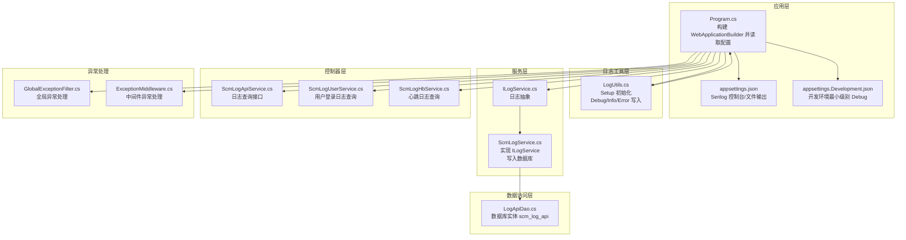
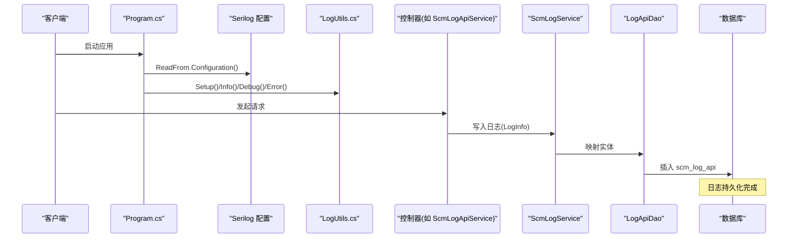
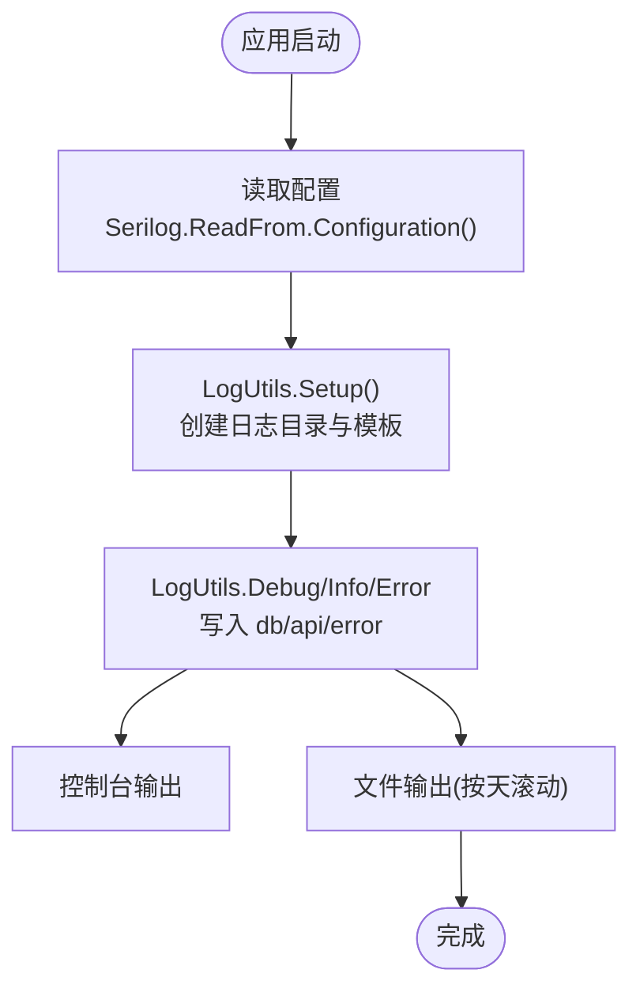
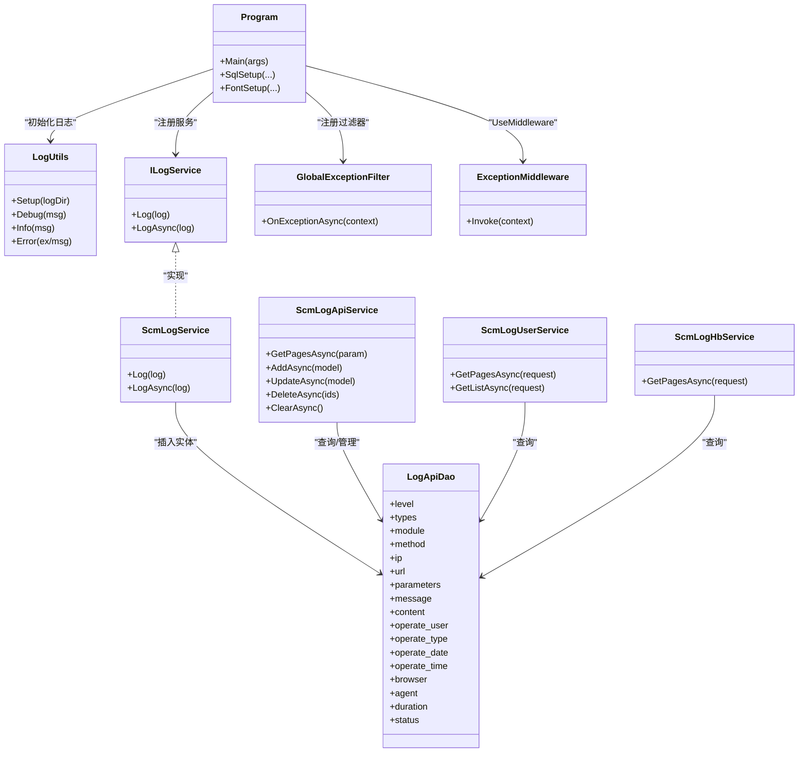

# 日志分析和调试

<cite>
**本文引用的文件**
- [Scm.Common.Log/Utils/LogUtils.cs](file://Scm.Common.Log/Utils/LogUtils.cs)
- [Scm.Net/appsettings.json](file://Scm.Net/appsettings.json)
- [Scm.Net/appsettings.Development.json](file://Scm.Net/appsettings.Development.json)
- [Scm.Net/Program.cs](file://Scm.Net/Program.cs)
- [Scm.Server/ILogService.cs](file://Scm.Server/ILogService.cs)
- [Scm.Server.Service/Service/ScmLogService.cs](file://Scm.Server.Service/Service/ScmLogService.cs)
- [Scm.Core/Configure/Filters/GlobalExceptionFilter.cs](file://Scm.Core/Configure/Filters/GlobalExceptionFilter.cs)
- [Scm.Core/Configure/Middleware/ExceptionMiddleware.cs](file://Scm.Core/Configure/Middleware/ExceptionMiddleware.cs)
- [Scm.Core/Log/Api/ScmLogApiService.cs](file://Scm.Core/Log/Api/ScmLogApiService.cs)
- [Scm.Core/Log/User/ScmLogUserService.cs](file://Scm.Core/Log/User/ScmLogUserService.cs)
- [Scm.Core/Log/Hb/ScmLogHbService.cs](file://Scm.Core/Log/Hb/ScmLogHbService.cs)
- [Scm.Dao/Log/LogApiDao.cs](file://Scm.Dao/Log/LogApiDao.cs)
- [Scm.Server/Config/LogConfig.cs](file://Scm.Server/Config/LogConfig.cs)
</cite>

## 目录
1. [简介](#简介)
2. [项目结构](#项目结构)
3. [核心组件](#核心组件)
4. [架构总览](#架构总览)
5. [详细组件分析](#详细组件分析)
6. [依赖关系分析](#依赖关系分析)
7. [性能考量](#性能考量)
8. [故障排查指南](#故障排查指南)
9. [结论](#结论)
10. [附录](#附录)

## 简介
本指南面向 Scm.Net 的日志系统，覆盖日志配置与使用、日志级别与输出格式、日志文件管理、关键日志信息的分析方法（异常、业务、系统）、日志查询与过滤技巧（时间范围、关键字、聚合），以及调试工具（Visual Studio、浏览器开发者工具、网络抓包）与性能分析、内存泄漏检测方法。文档以代码为依据，结合实际文件路径帮助读者快速定位问题并高效排障。

## 项目结构
Scm.Net 的日志体系由多层组成：
- 应用层配置：通过 appsettings.json 与 appsettings.Development.json 配置 Serilog 输出到控制台与文件，并设置最小日志级别。
- 工具层封装：LogUtils 封装了基于 Serilog 的日志写入，按“位置”属性分流至 db、api、error 三类日志文件。
- 服务层：ILogService 抽象日志写入，ScmLogService 实现将日志持久化到数据库表 scm_log_api。
- 控制器层：ScmLogApiService 提供日志查询接口；ScmLogUserService 提供用户登录日志查询；ScmLogHbService 提供心跳日志查询。
- 异常处理：全局异常过滤器与中间件负责捕获未处理异常并返回统一响应。

**图表来源**
- [Scm.Net/Program.cs:37-40](file://Scm.Net/Program.cs#L37-L40)
- [Scm.Net/appsettings.json:3-25](file://Scm.Net/appsettings.json#L3-L25)
- [Scm.Net/appsettings.Development.json:3-25](file://Scm.Net/appsettings.Development.json#L3-L25)
- [Scm.Common.Log/Utils/LogUtils.cs:19-46](file://Scm.Common.Log/Utils/LogUtils.cs#L19-L46)
- [Scm.Server/ILogService.cs:7-12](file://Scm.Server/ILogService.cs#L7-L12)
- [Scm.Server.Service/Service/ScmLogService.cs:7-26](file://Scm.Server.Service/Service/ScmLogService.cs#L7-L26)
- [Scm.Dao/Log/LogApiDao.cs:11-124](file://Scm.Dao/Log/LogApiDao.cs#L11-L124)
- [Scm.Core/Log/Api/ScmLogApiService.cs:14-160](file://Scm.Core/Log/Api/ScmLogApiService.cs#L14-L160)
- [Scm.Core/Log/User/ScmLogUserService.cs:14-120](file://Scm.Core/Log/User/ScmLogUserService.cs#L14-L120)
- [Scm.Core/Log/Hb/ScmLogHbService.cs:14-41](file://Scm.Core/Log/Hb/ScmLogHbService.cs#L14-L41)
- [Scm.Core/Configure/Filters/GlobalExceptionFilter.cs:17-42](file://Scm.Core/Configure/Filters/GlobalExceptionFilter.cs#L17-L42)
- [Scm.Core/Configure/Middleware/ExceptionMiddleware.cs:8-41](file://Scm.Core/Configure/Middleware/ExceptionMiddleware.cs#L8-L41)

**章节来源**
- [Scm.Net/Program.cs:37-40](file://Scm.Net/Program.cs#L37-L40)
- [Scm.Net/appsettings.json:3-25](file://Scm.Net/appsettings.json#L3-L25)
- [Scm.Net/appsettings.Development.json:3-25](file://Scm.Net/appsettings.Development.json#L3-L25)
- [Scm.Common.Log/Utils/LogUtils.cs:19-46](file://Scm.Common.Log/Utils/LogUtils.cs#L19-L46)

## 核心组件
- 日志初始化与输出
  - Program.cs 通过 Serilog 读取配置，初始化日志记录器。
  - appsettings.json 与 appsettings.Development.json 分别定义控制台输出模板与最小日志级别。
  - LogUtils.cs 提供 Setup 初始化，按“position”属性将日志写入 db、api、error 三类文件，支持 Console 输出。
- 日志服务与持久化
  - ILogService 定义日志抽象；ScmLogService 实现将日志写入数据库表 scm_log_api。
  - LogApiDao.cs 定义数据库实体字段，包含级别、类型、模块、请求方法、IP、URL、参数、消息、内容、耗时、状态等。
- 日志查询接口
  - ScmLogApiService 提供分页查询、新增、更新、删除、清空等接口。
  - ScmLogUserService 提供用户维度的日志查询与准备（字典映射）。
  - ScmLogHbService 提供心跳日志查询。
- 异常处理
  - GlobalExceptionFilter 与 ExceptionMiddleware 统一捕获异常并返回 JSON 响应，便于日志追踪。

**章节来源**
- [Scm.Net/Program.cs:37-40](file://Scm.Net/Program.cs#L37-L40)
- [Scm.Net/appsettings.json:3-25](file://Scm.Net/appsettings.json#L3-L25)
- [Scm.Net/appsettings.Development.json:3-25](file://Scm.Net/appsettings.Development.json#L3-L25)
- [Scm.Common.Log/Utils/LogUtils.cs:19-46](file://Scm.Common.Log/Utils/LogUtils.cs#L19-L46)
- [Scm.Server/ILogService.cs:7-12](file://Scm.Server/ILogService.cs#L7-L12)
- [Scm.Server.Service/Service/ScmLogService.cs:7-26](file://Scm.Server.Service/Service/ScmLogService.cs#L7-L26)
- [Scm.Dao/Log/LogApiDao.cs:11-124](file://Scm.Dao/Log/LogApiDao.cs#L11-L124)
- [Scm.Core/Log/Api/ScmLogApiService.cs:14-160](file://Scm.Core/Log/Api/ScmLogApiService.cs#L14-L160)
- [Scm.Core/Log/User/ScmLogUserService.cs:14-120](file://Scm.Core/Log/User/ScmLogUserService.cs#L14-L120)
- [Scm.Core/Log/Hb/ScmLogHbService.cs:14-41](file://Scm.Core/Log/Hb/ScmLogHbService.cs#L14-L41)
- [Scm.Core/Configure/Filters/GlobalExceptionFilter.cs:17-42](file://Scm.Core/Configure/Filters/GlobalExceptionFilter.cs#L17-L42)
- [Scm.Core/Configure/Middleware/ExceptionMiddleware.cs:8-41](file://Scm.Core/Configure/Middleware/ExceptionMiddleware.cs#L8-L41)

## 架构总览
下图展示从应用启动到日志落库与查询的整体流程，包括异常处理与中间件拦截。

**图表来源**
- [Scm.Net/Program.cs:37-40](file://Scm.Net/Program.cs#L37-L40)
- [Scm.Common.Log/Utils/LogUtils.cs:19-46](file://Scm.Common.Log/Utils/LogUtils.cs#L19-L46)
- [Scm.Server/ILogService.cs:7-12](file://Scm.Server/ILogService.cs#L7-L12)
- [Scm.Server.Service/Service/ScmLogService.cs:7-26](file://Scm.Server.Service/Service/ScmLogService.cs#L7-L26)
- [Scm.Dao/Log/LogApiDao.cs:11-124](file://Scm.Dao/Log/LogApiDao.cs#L11-L124)
- [Scm.Core/Log/Api/ScmLogApiService.cs:14-160](file://Scm.Core/Log/Api/ScmLogApiService.cs#L14-L160)

## 详细组件分析

### 日志配置与使用
- 配置来源
  - appsettings.json：定义 Serilog 的最小日志级别、控制台输出模板、文件输出路径与滚动策略。
  - appsettings.Development.json：开发环境最小级别为 Debug，便于本地调试。
  - Program.cs：在构建阶段读取配置并创建日志记录器。
- 输出目标
  - 控制台：输出模板包含时间戳与级别。
  - 文件：按天滚动，路径由配置指定。
- 工具封装
  - LogUtils.Setup：创建 db、api、error 三类子目录，按 position 属性分流输出。
  - LogUtils.Debug/Info/Error：统一调用入口，便于业务侧快速记录。

**图表来源**
- [Scm.Net/Program.cs:37-40](file://Scm.Net/Program.cs#L37-L40)
- [Scm.Net/appsettings.json:3-25](file://Scm.Net/appsettings.json#L3-L25)
- [Scm.Net/appsettings.Development.json:3-25](file://Scm.Net/appsettings.Development.json#L3-L25)
- [Scm.Common.Log/Utils/LogUtils.cs:19-46](file://Scm.Common.Log/Utils/LogUtils.cs#L19-L46)

**章节来源**
- [Scm.Net/appsettings.json:3-25](file://Scm.Net/appsettings.json#L3-L25)
- [Scm.Net/appsettings.Development.json:3-25](file://Scm.Net/appsettings.Development.json#L3-L25)
- [Scm.Net/Program.cs:37-40](file://Scm.Net/Program.cs#L37-L40)
- [Scm.Common.Log/Utils/LogUtils.cs:19-46](file://Scm.Common.Log/Utils/LogUtils.cs#L19-L46)

### 日志级别与输出格式
- 级别
  - 生产：MinimumLevel 为 Information。
  - 开发：MinimumLevel 为 Debug。
- 输出模板
  - 控制台：包含时间戳与级别。
  - 文件：自定义模板，包含时间、级别、消息、异常与分隔线。
- 位置分流
  - position=“db”、“api”、“error”，分别写入对应子目录下的 log.log。

**章节来源**
- [Scm.Net/appsettings.json:3-25](file://Scm.Net/appsettings.json#L3-L25)
- [Scm.Net/appsettings.Development.json:3-25](file://Scm.Net/appsettings.Development.json#L3-L25)
- [Scm.Common.Log/Utils/LogUtils.cs:31-45](file://Scm.Common.Log/Utils/LogUtils.cs#L31-L45)

### 日志文件管理
- 目录结构
  - logs/db、logs/api、logs/error 三个子目录，按天滚动。
- 路径与命名
  - GetLogFile 返回每个子目录下的 log.log 文件路径。
- 环境差异
  - 开发环境与生产环境的输出路径不同，需根据部署环境调整。

**章节来源**
- [Scm.Common.Log/Utils/LogUtils.cs:109-120](file://Scm.Common.Log/Utils/LogUtils.cs#L109-L120)
- [Scm.Net/appsettings.json:18-23](file://Scm.Net/appsettings.json#L18-L23)
- [Scm.Net/appsettings.Development.json:18-23](file://Scm.Net/appsettings.Development.json#L18-L23)

### 关键日志信息解读
- 异常日志
  - GlobalExceptionFilter 与 ExceptionMiddleware 统一捕获异常，便于定位错误来源与上下文。
  - 建议关注：异常类型、堆栈、请求路径、用户代理、IP、时间戳。
- 业务日志
  - ScmLogApiService 记录 API 调用的模块、方法、URL、参数、耗时、状态等，适合审计与性能分析。
  - ScmLogUserService 记录用户登录行为，便于安全审计。
  - ScmLogHbService 记录心跳日志，便于监控系统健康度。
- 系统日志
  - LogUtils.Info/Debug/Error 输出系统启动、配置、运行状态等信息，有助于排查启动与配置问题。

**章节来源**
- [Scm.Core/Configure/Filters/GlobalExceptionFilter.cs:17-42](file://Scm.Core/Configure/Filters/GlobalExceptionFilter.cs#L17-L42)
- [Scm.Core/Configure/Middleware/ExceptionMiddleware.cs:8-41](file://Scm.Core/Configure/Middleware/ExceptionMiddleware.cs#L8-L41)
- [Scm.Core/Log/Api/ScmLogApiService.cs:14-160](file://Scm.Core/Log/Api/ScmLogApiService.cs#L14-L160)
- [Scm.Core/Log/User/ScmLogUserService.cs:14-120](file://Scm.Core/Log/User/ScmLogUserService.cs#L14-L120)
- [Scm.Core/Log/Hb/ScmLogHbService.cs:14-41](file://Scm.Core/Log/Hb/ScmLogHbService.cs#L14-L41)
- [Scm.Common.Log/Utils/LogUtils.cs:53-107](file://Scm.Common.Log/Utils/LogUtils.cs#L53-L107)

### 日志查询与过滤技巧
- 时间范围筛选
  - ScmLogApiService 支持 times 参数拆分起止时间，转换为 Unix 时间戳进行过滤。
- 关键字搜索
  - 可在 ScmLogApiService 的查询中对 module、operate_user、message、content 等字段进行模糊匹配或精确匹配。
- 日志聚合分析
  - 可按模块、操作类型、状态、耗时等维度进行分组统计，辅助识别高频错误与慢接口。
- 用户维度查询
  - ScmLogUserService 仅返回当前用户的登录日志，便于个人审计。

**章节来源**
- [Scm.Core/Log/Api/ScmLogApiService.cs:33-44](file://Scm.Core/Log/Api/ScmLogApiService.cs#L33-L44)
- [Scm.Core/Log/User/ScmLogUserService.cs:39-72](file://Scm.Core/Log/User/ScmLogUserService.cs#L39-L72)

### 调试工具使用
- Visual Studio
  - 设置断点于异常处理过滤器与控制器方法，观察请求上下文、用户令牌、异常堆栈。
  - 在 Program.cs 中设置启动项，确保读取正确配置文件。
- 浏览器开发者工具
  - Network 面板查看请求与响应，结合后端日志定位前后端交互问题。
  - Console 面板查看前端错误信息。
- 网络抓包工具
  - 使用 Wireshark/Fiddler/Charles 抓取 HTTP/HTTPS 流量，核对请求头、参数与响应状态码。

**章节来源**
- [Scm.Net/Program.cs:174-258](file://Scm.Net/Program.cs#L174-L258)
- [Scm.Core/Configure/Filters/GlobalExceptionFilter.cs:32-42](file://Scm.Core/Configure/Filters/GlobalExceptionFilter.cs#L32-L42)
- [Scm.Core/Configure/Middleware/ExceptionMiddleware.cs:17-41](file://Scm.Core/Configure/Middleware/ExceptionMiddleware.cs#L17-L41)

### 性能分析与内存泄漏检测
- 性能分析
  - 利用 ScmLogApiService 的 duration 字段识别慢接口，结合 times 过滤时间段，定位性能瓶颈。
  - 结合浏览器性能面板与后端日志，分析请求链路耗时。
- 内存泄漏检测
  - 使用 .NET 内置诊断工具（dotnet-trace/dotnet-counters）采集 GC 与内存指标。
  - 观察长时间运行任务与缓存使用情况，避免大对象驻留与循环引用。

**章节来源**
- [Scm.Dao/Log/LogApiDao.cs:115-117](file://Scm.Dao/Log/LogApiDao.cs#L115-L117)
- [Scm.Core/Log/Api/ScmLogApiService.cs:14-160](file://Scm.Core/Log/Api/ScmLogApiService.cs#L14-L160)

## 依赖关系分析
- 组件耦合
  - Program.cs 依赖配置与 LogUtils；ILogService 与 ScmLogService 解耦日志写入与存储。
  - 控制器层依赖仓储与服务层，实现日志查询与管理。
- 外部依赖
  - Serilog 控制台与文件输出；SqlSugar 用于数据库访问；ASP.NET Core 中间件与过滤器。

**图表来源**
- [Scm.Net/Program.cs:135-153](file://Scm.Net/Program.cs#L135-L153)
- [Scm.Common.Log/Utils/LogUtils.cs:19-46](file://Scm.Common.Log/Utils/LogUtils.cs#L19-L46)
- [Scm.Server/ILogService.cs:7-12](file://Scm.Server/ILogService.cs#L7-L12)
- [Scm.Server.Service/Service/ScmLogService.cs:7-26](file://Scm.Server.Service/Service/ScmLogService.cs#L7-L26)
- [Scm.Dao/Log/LogApiDao.cs:11-124](file://Scm.Dao/Log/LogApiDao.cs#L11-L124)
- [Scm.Core/Log/Api/ScmLogApiService.cs:14-160](file://Scm.Core/Log/Api/ScmLogApiService.cs#L14-L160)
- [Scm.Core/Log/User/ScmLogUserService.cs:14-120](file://Scm.Core/Log/User/ScmLogUserService.cs#L14-L120)
- [Scm.Core/Log/Hb/ScmLogHbService.cs:14-41](file://Scm.Core/Log/Hb/ScmLogHbService.cs#L14-L41)
- [Scm.Core/Configure/Filters/GlobalExceptionFilter.cs:17-42](file://Scm.Core/Configure/Filters/GlobalExceptionFilter.cs#L17-L42)
- [Scm.Core/Configure/Middleware/ExceptionMiddleware.cs:8-41](file://Scm.Core/Configure/Middleware/ExceptionMiddleware.cs#L8-L41)

**章节来源**
- [Scm.Net/Program.cs:135-153](file://Scm.Net/Program.cs#L135-L153)
- [Scm.Server/ILogService.cs:7-12](file://Scm.Server/ILogService.cs#L7-L12)
- [Scm.Server.Service/Service/ScmLogService.cs:7-26](file://Scm.Server.Service/Service/ScmLogService.cs#L7-L26)
- [Scm.Dao/Log/LogApiDao.cs:11-124](file://Scm.Dao/Log/LogApiDao.cs#L11-L124)
- [Scm.Core/Log/Api/ScmLogApiService.cs:14-160](file://Scm.Core/Log/Api/ScmLogApiService.cs#L14-L160)
- [Scm.Core/Log/User/ScmLogUserService.cs:14-120](file://Scm.Core/Log/User/ScmLogUserService.cs#L14-L120)
- [Scm.Core/Log/Hb/ScmLogHbService.cs:14-41](file://Scm.Core/Log/Hb/ScmLogHbService.cs#L14-L41)
- [Scm.Core/Configure/Filters/GlobalExceptionFilter.cs:17-42](file://Scm.Core/Configure/Filters/GlobalExceptionFilter.cs#L17-L42)
- [Scm.Core/Configure/Middleware/ExceptionMiddleware.cs:8-41](file://Scm.Core/Configure/Middleware/ExceptionMiddleware.cs#L8-L41)

## 性能考量
- 日志级别
  - 生产环境建议使用 Information，避免 Debug 造成 IO 压力。
- 输出目标
  - 控制台输出适合开发调试；生产环境优先文件输出并开启异步写入。
- 查询性能
  - 对高频查询字段（如 operate_time、module、status）建立索引，优化 ScmLogApiService 的分页查询。
- 资源管理
  - 注意日志文件滚动策略与磁盘空间，定期清理过期日志。

[本节为通用指导，无需特定文件引用]

## 故障排查指南
- 启动失败
  - 检查 Program.cs 是否成功读取配置；确认 appsettings.json 与 appsettings.Development.json 路径正确。
- 日志不输出
  - 确认 MinimumLevel 设置是否过低；检查 Console/File 输出配置；验证 LogUtils.Setup 是否被调用。
- 查询不到日志
  - 核对 ScmLogApiService 的 times 参数格式与时区；确认数据库连接字符串与表 scm_log_api 是否存在。
- 异常未被捕获
  - 检查 GlobalExceptionFilter 与 ExceptionMiddleware 是否注册；确认控制器未提前结束响应。
- 性能问题
  - 使用 duration 字段定位慢接口；结合浏览器 Network 面板与后端日志分析链路耗时。

**章节来源**
- [Scm.Net/Program.cs:37-40](file://Scm.Net/Program.cs#L37-L40)
- [Scm.Net/appsettings.json:3-25](file://Scm.Net/appsettings.json#L3-L25)
- [Scm.Net/appsettings.Development.json:3-25](file://Scm.Net/appsettings.Development.json#L3-L25)
- [Scm.Common.Log/Utils/LogUtils.cs:19-46](file://Scm.Common.Log/Utils/LogUtils.cs#L19-L46)
- [Scm.Core/Log/Api/ScmLogApiService.cs:33-44](file://Scm.Core/Log/Api/ScmLogApiService.cs#L33-L44)
- [Scm.Core/Configure/Filters/GlobalExceptionFilter.cs:17-42](file://Scm.Core/Configure/Filters/GlobalExceptionFilter.cs#L17-L42)
- [Scm.Core/Configure/Middleware/ExceptionMiddleware.cs:17-41](file://Scm.Core/Configure/Middleware/ExceptionMiddleware.cs#L17-L41)

## 结论
Scm.Net 的日志体系通过配置驱动与工具封装实现了清晰的输出与持久化路径，配合服务层与控制器层的查询能力，能够满足异常定位、业务审计与性能分析的需求。建议在生产环境中合理设置日志级别与输出目标，结合查询接口与调试工具形成闭环的排障流程。

[本节为总结性内容，无需特定文件引用]

## 附录
- 配置键参考
  - Serilog：MinimumLevel、WriteTo.Console.Args.OutputTemplate、WriteTo.File.Args.path、WriteTo.File.Args.rollingInterval。
  - Env：logs 指定日志根目录。
  - LogConfig：日志配置名称常量。

**章节来源**
- [Scm.Net/appsettings.json:3-25](file://Scm.Net/appsettings.json#L3-L25)
- [Scm.Net/appsettings.Development.json:3-25](file://Scm.Net/appsettings.Development.json#L3-L25)
- [Scm.Server/Config/LogConfig.cs:3-7](file://Scm.Server/Config/LogConfig.cs#L3-L7)