# 紧急故障处理

<cite>
**本文引用的文件**
- [Program.cs](file://Scm.Net/Program.cs)
- [appsettings.json](file://Scm.Net/appsettings.json)
- [appsettings.Development.json](file://Scm.Net/appsettings.Development.json)
- [ExceptionMiddleware.cs](file://Scm.Core/Configure/Middleware/ExceptionMiddleware.cs)
- [GlobalExceptionFilter.cs](file://Scm.Core/Configure/Filters/GlobalExceptionFilter.cs)
- [AopActionFilter.cs](file://Scm.Core/Configure/Filters/AopActionFilter.cs)
- [JwtMiddleware.cs](file://Scm.Core/Configure/Middleware/JwtMiddleware.cs)
- [BusinessException.cs](file://Scm.Common/Exceptions/BusinessException.cs)
- [DbController.cs](file://Scm.Net/Controllers/DbController.cs)
- [HbController.cs](file://Scm.Net/Controllers/HbController.cs)
- [ScmHub.cs](file://Scm.Server.SignalR/Hubs/ScmHub.cs)
- [ClientUser.cs](file://Scm.Server.SignalR/Hubs/ClientUser.cs)
- [SignalRUtil.cs](file://Scm.Core/Msg/SignalRUtil.cs)
- [EnvConfig.cs](file://Scm.Server/Config/EnvConfig.cs)
- [LogUtils.cs](file://Scm.Common.Log/Utils/LogUtils.cs)
- [QuartzService.cs](file://Scm.Server.Quartz/QuartzService.cs)
- [QuartzExtension.cs](file://Scm.Server.Quartz/QuartzExtension.cs)
- [JobFactory.cs](file://Scm.Server.Quartz/JobFactory.cs)
- [NasWatchEnums.cs](file://Nas.Common/NasWatchEnums.cs)
- [NasManager.cs](file://Nas.Server/Res/NasManager.cs)
- [ClientExample.md](file://Nas.Server/Msg/ClientExample.md)
</cite>

## 目录
1. [简介](#简介)
2. [项目结构](#项目结构)
3. [核心组件](#核心组件)
4. [架构总览](#架构总览)
5. [详细组件分析](#详细组件分析)
6. [依赖关系分析](#依赖关系分析)
7. [性能考量](#性能考量)
8. [故障分级与响应流程](#故障分级与响应流程)
9. [紧急恢复流程](#紧急恢复流程)
10. [数据备份与灾难恢复](#数据备份与灾难恢复)
11. [故障预警与告警机制](#故障预警与告警机制)
12. [团队协作与沟通流程](#团队协作与沟通流程)
13. [结论](#结论)

## 简介
本指南面向 Scm.Net 的紧急故障处理与应急响应，结合现有代码库中的异常处理、日志记录、中间件、信号推送、定时任务与配置能力，制定从故障分级、影响评估、响应优先级，到系统重启、数据恢复与业务连续性保障的完整流程，并配套备份与灾难恢复策略、预警与告警机制配置、以及团队协作与沟通流程，确保在紧急情况下快速、有序地恢复系统稳定运行。

## 项目结构
Scm.Net 采用多模块分层架构，核心入口位于 Web 应用程序，通过中间件与全局过滤器统一处理异常与请求；服务层通过依赖注入注册各类服务；定时任务由 Quartz 管理；日志通过 Serilog 输出；SignalR 提供实时通信；NAS 模块提供文件与同步监控能力。

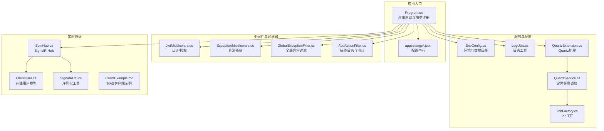

**图表来源**
- [Program.cs:1-366](file://Scm.Net/Program.cs#L1-L366)
- [appsettings.json:1-127](file://Scm.Net/appsettings.json#L1-L127)
- [appsettings.Development.json:1-162](file://Scm.Net/appsettings.Development.json#L1-L162)
- [JwtMiddleware.cs:1-180](file://Scm.Core/Configure/Middleware/JwtMiddleware.cs#L1-L180)
- [ExceptionMiddleware.cs:1-41](file://Scm.Core/Configure/Middleware/ExceptionMiddleware.cs#L1-L41)
- [GlobalExceptionFilter.cs:1-80](file://Scm.Core/Configure/Filters/GlobalExceptionFilter.cs#L1-L80)
- [AopActionFilter.cs:220-252](file://Scm.Core/Configure/Filters/AopActionFilter.cs#L220-L252)
- [EnvConfig.cs:1-280](file://Scm.Server/Config/EnvConfig.cs#L1-L280)
- [LogUtils.cs:1-122](file://Scm.Common.Log/Utils/LogUtils.cs#L1-L122)
- [QuartzService.cs:1-440](file://Scm.Server.Quartz/QuartzService.cs#L1-L440)
- [QuartzExtension.cs:1-39](file://Scm.Server.Quartz/QuartzExtension.cs#L1-L39)
- [JobFactory.cs:1-41](file://Scm.Server.Quartz/JobFactory.cs#L1-L41)
- [ScmHub.cs:1-111](file://Scm.Server.SignalR/Hubs/ScmHub.cs#L1-L111)
- [ClientUser.cs:1-38](file://Scm.Server.SignalR/Hubs/ClientUser.cs#L1-L38)
- [SignalRUtil.cs:1-35](file://Scm.Core/Msg/SignalRUtil.cs#L1-L35)
- [ClientExample.md:1-79](file://Nas.Server/Msg/ClientExample.md#L1-L79)

**章节来源**
- [Program.cs:1-366](file://Scm.Net/Program.cs#L1-L366)
- [appsettings.json:1-127](file://Scm.Net/appsettings.json#L1-L127)
- [appsettings.Development.json:1-162](file://Scm.Net/appsettings.Development.json#L1-L162)

## 核心组件
- 应用启动与服务注册：负责环境准备、配置加载、中间件与服务注册、路由与静态资源映射。
- 异常处理链：中间件与全局过滤器统一捕获异常，记录日志并返回标准化响应。
- 日志系统：基于 Serilog 的结构化日志输出，按位置分流至不同文件。
- 认证与授权：JWT 中间件处理令牌解析与刷新，支持忽略特定路径。
- 实时通信：SignalR Hub 维护在线用户列表，支持消息推送与断线处理。
- 定时任务：Quartz 扩展与服务封装，支持文件型与数据库型作业存储。
- 配置与数据目录：EnvConfig 统一管理数据目录、上传、日志、字体等路径。
- NAS 与监控：NAS Watch 枚举与管理器用于监控状态与日志记录。

**章节来源**
- [Program.cs:1-366](file://Scm.Net/Program.cs#L1-L366)
- [ExceptionMiddleware.cs:1-41](file://Scm.Core/Configure/Middleware/ExceptionMiddleware.cs#L1-L41)
- [GlobalExceptionFilter.cs:1-80](file://Scm.Core/Configure/Filters/GlobalExceptionFilter.cs#L1-L80)
- [AopActionFilter.cs:220-252](file://Scm.Core/Configure/Filters/AopActionFilter.cs#L220-L252)
- [JwtMiddleware.cs:1-180](file://Scm.Core/Configure/Middleware/JwtMiddleware.cs#L1-L180)
- [LogUtils.cs:1-122](file://Scm.Common.Log/Utils/LogUtils.cs#L1-L122)
- [QuartzService.cs:1-440](file://Scm.Server.Quartz/QuartzService.cs#L1-L440)
- [QuartzExtension.cs:1-39](file://Scm.Server.Quartz/QuartzExtension.cs#L1-L39)
- [EnvConfig.cs:1-280](file://Scm.Server/Config/EnvConfig.cs#L1-L280)
- [ScmHub.cs:1-111](file://Scm.Server.SignalR/Hubs/ScmHub.cs#L1-L111)
- [NasWatchEnums.cs:1-27](file://Nas.Common/NasWatchEnums.cs#L1-L27)
- [NasManager.cs:111-135](file://Nas.Server/Res/NasManager.cs#L111-L135)

## 架构总览
下图展示了从请求进入、异常处理、日志记录、实时通信到定时任务的整体交互关系。

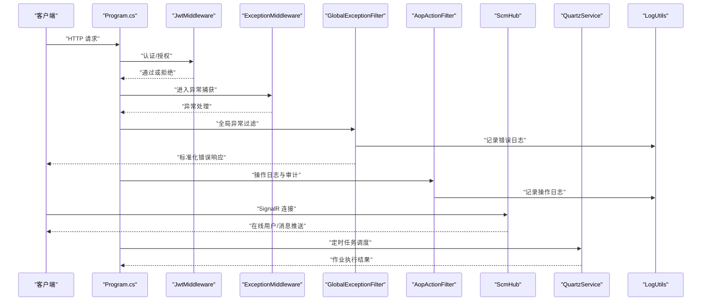

**图表来源**
- [Program.cs:1-366](file://Scm.Net/Program.cs#L1-L366)
- [JwtMiddleware.cs:1-180](file://Scm.Core/Configure/Middleware/JwtMiddleware.cs#L1-L180)
- [ExceptionMiddleware.cs:1-41](file://Scm.Core/Configure/Middleware/ExceptionMiddleware.cs#L1-L41)
- [GlobalExceptionFilter.cs:1-80](file://Scm.Core/Configure/Filters/GlobalExceptionFilter.cs#L1-L80)
- [AopActionFilter.cs:220-252](file://Scm.Core/Configure/Filters/AopActionFilter.cs#L220-L252)
- [ScmHub.cs:1-111](file://Scm.Server.SignalR/Hubs/ScmHub.cs#L1-L111)
- [QuartzService.cs:1-440](file://Scm.Server.Quartz/QuartzService.cs#L1-L440)
- [LogUtils.cs:1-122](file://Scm.Common.Log/Utils/LogUtils.cs#L1-L122)

## 详细组件分析

### 异常处理与日志
- 异常中间件：捕获未处理异常，返回标准化 JSON 响应。
- 全局异常过滤器：区分业务异常与系统异常，记录操作日志并返回相应状态码。
- AOP 行为过滤器：记录接口调用参数、耗时、用户信息等，支持审计与追踪。
- 日志工具：基于 Serilog 的结构化日志，按位置分流输出，便于问题定位。

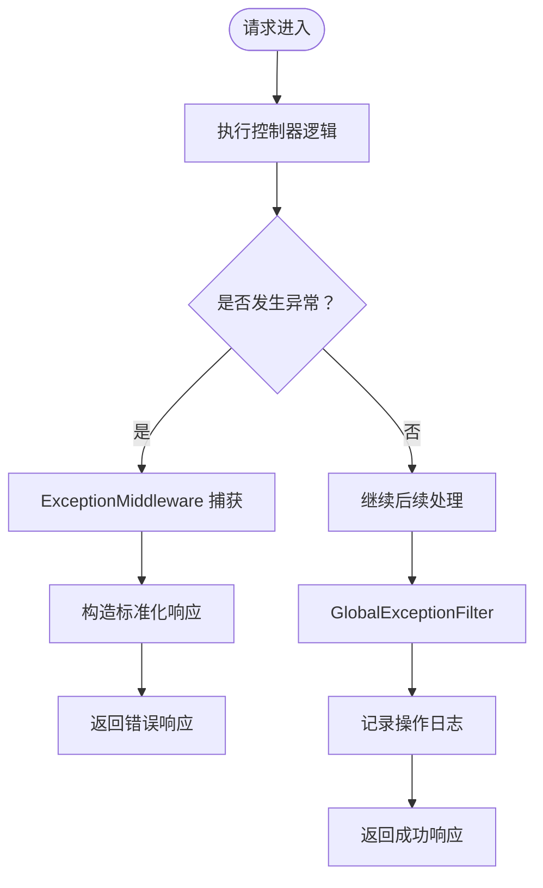

**图表来源**
- [ExceptionMiddleware.cs:1-41](file://Scm.Core/Configure/Middleware/ExceptionMiddleware.cs#L1-L41)
- [GlobalExceptionFilter.cs:1-80](file://Scm.Core/Configure/Filters/GlobalExceptionFilter.cs#L1-L80)
- [AopActionFilter.cs:220-252](file://Scm.Core/Configure/Filters/AopActionFilter.cs#L220-L252)
- [LogUtils.cs:1-122](file://Scm.Common.Log/Utils/LogUtils.cs#L1-L122)

**章节来源**
- [ExceptionMiddleware.cs:1-41](file://Scm.Core/Configure/Middleware/ExceptionMiddleware.cs#L1-L41)
- [GlobalExceptionFilter.cs:1-80](file://Scm.Core/Configure/Filters/GlobalExceptionFilter.cs#L1-L80)
- [AopActionFilter.cs:220-252](file://Scm.Core/Configure/Filters/AopActionFilter.cs#L220-L252)
- [LogUtils.cs:1-122](file://Scm.Common.Log/Utils/LogUtils.cs#L1-L122)

### 认证与授权
- JWT 中间件：识别忽略路径、解析应用令牌与 API 令牌，支持自动刷新与会话续期。
- 忽略列表：包含 Swagger、SignalR、上传等路径，避免对这些接口进行严格鉴权。

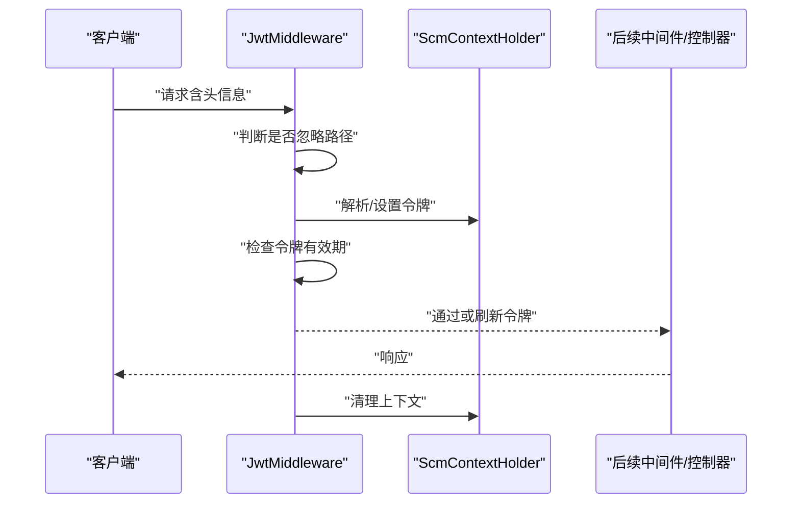

**图表来源**
- [JwtMiddleware.cs:1-180](file://Scm.Core/Configure/Middleware/JwtMiddleware.cs#L1-L180)

**章节来源**
- [JwtMiddleware.cs:1-180](file://Scm.Core/Configure/Middleware/JwtMiddleware.cs#L1-L180)

### 实时通信与业务连续性
- SignalR Hub：维护在线用户列表，断线时清理缓存；支持向指定用户或全部用户推送消息。
- 在线用户模型：包含用户标识、连接 ID、时间戳等字段，便于精准推送与踢出。
- 客户端示例：提供 .NET 与 JavaScript 客户端连接与消息订阅示例。

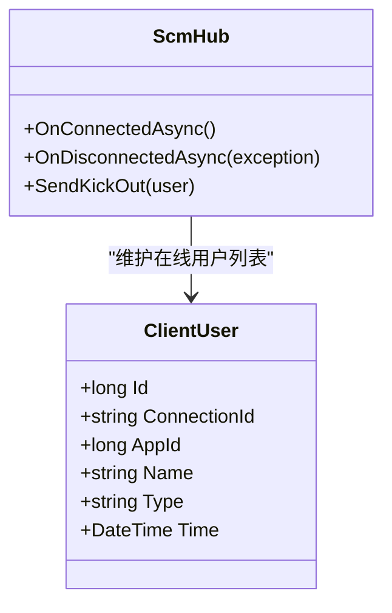

**图表来源**
- [ScmHub.cs:1-111](file://Scm.Server.SignalR/Hubs/ScmHub.cs#L1-L111)
- [ClientUser.cs:1-38](file://Scm.Server.SignalR/Hubs/ClientUser.cs#L1-L38)

**章节来源**
- [ScmHub.cs:1-111](file://Scm.Server.SignalR/Hubs/ScmHub.cs#L1-L111)
- [ClientUser.cs:1-38](file://Scm.Server.SignalR/Hubs/ClientUser.cs#L1-L38)
- [ClientExample.md:1-79](file://Nas.Server/Msg/ClientExample.md#L1-L79)

### 定时任务与监控
- Quartz 扩展：根据配置选择文件型或数据库型作业存储，注册调度器与 JobFactory。
- Quartz 服务：统一管理作业的查询、启动、停止与触发器配置。
- 作业工厂：基于 DI 创建作业实例并在完成后释放作用域。

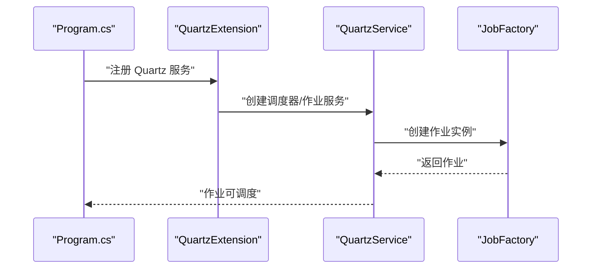

**图表来源**
- [QuartzExtension.cs:1-39](file://Scm.Server.Quartz/QuartzExtension.cs#L1-L39)
- [QuartzService.cs:1-440](file://Scm.Server.Quartz/QuartzService.cs#L1-L440)
- [JobFactory.cs:1-41](file://Scm.Server.Quartz/JobFactory.cs#L1-L41)

**章节来源**
- [QuartzExtension.cs:1-39](file://Scm.Server.Quartz/QuartzExtension.cs#L1-L39)
- [QuartzService.cs:1-440](file://Scm.Server.Quartz/QuartzService.cs#L1-L440)
- [JobFactory.cs:1-41](file://Scm.Server.Quartz/JobFactory.cs#L1-L41)

### 配置与数据目录
- EnvConfig：统一管理数据目录、上传、日志、字体等路径，提供组合与转换方法。
- 配置文件：appsettings.json 与 appsettings.Development.json 提供运行时配置，包括 Kestrel、Serilog、SQL、缓存、JWT、跨域等。

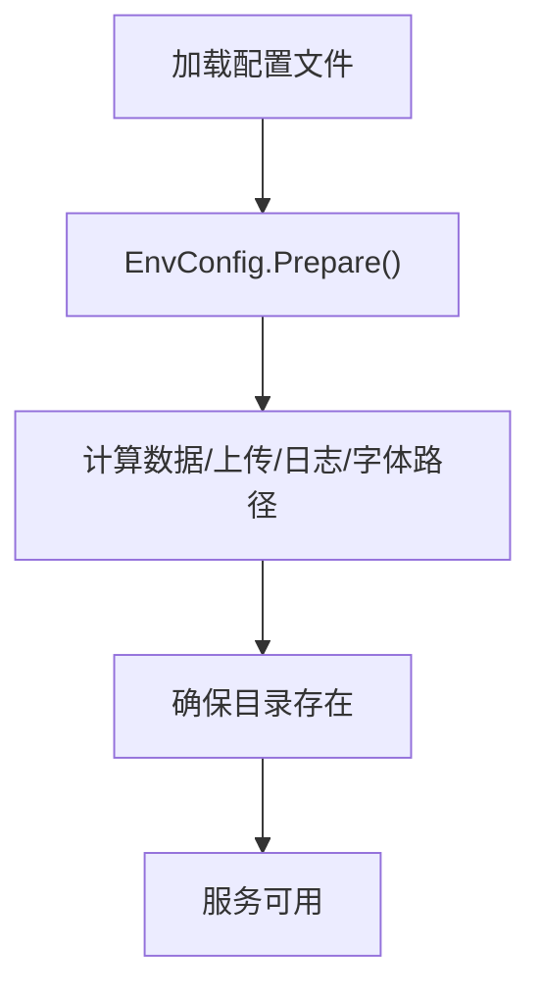

**图表来源**
- [EnvConfig.cs:1-280](file://Scm.Server/Config/EnvConfig.cs#L1-L280)
- [appsettings.json:1-127](file://Scm.Net/appsettings.json#L1-L127)
- [appsettings.Development.json:1-162](file://Scm.Net/appsettings.Development.json#L1-L162)

**章节来源**
- [EnvConfig.cs:1-280](file://Scm.Server/Config/EnvConfig.cs#L1-L280)
- [appsettings.json:1-127](file://Scm.Net/appsettings.json#L1-L127)
- [appsettings.Development.json:1-162](file://Scm.Net/appsettings.Development.json#L1-L162)

### 数据库初始化与恢复
- 数据库控制器：提供数据库初始化与删除接口，便于在紧急情况下重建数据库结构。
- 业务异常：当数据库连接失败时抛出业务异常，提示“无法建立连接”。

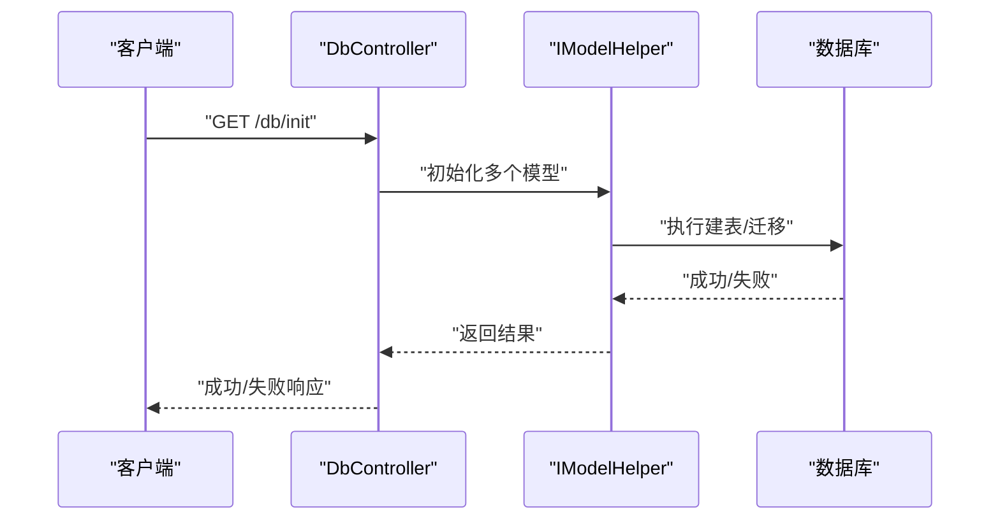

**图表来源**
- [DbController.cs:207-286](file://Scm.Net/Controllers/DbController.cs#L207-L286)
- [BusinessException.cs:1-22](file://Scm.Common/Exceptions/BusinessException.cs#L1-L22)

**章节来源**
- [DbController.cs:207-286](file://Scm.Net/Controllers/DbController.cs#L207-L286)
- [BusinessException.cs:1-22](file://Scm.Common/Exceptions/BusinessException.cs#L1-L22)

### 心跳与监控
- 心跳接口：记录客户端 IP、MAC、主机名、操作系统、版本、用户与时间戳，便于监控与审计。
- NAS 监控状态：提供监控状态枚举，支持 Running/Suspend/Stoped 状态管理。

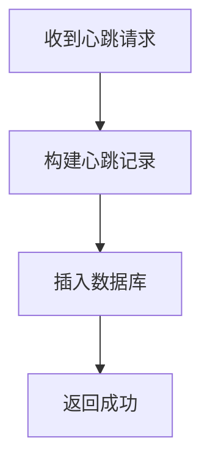

**图表来源**
- [HbController.cs:44-82](file://Scm.Net/Controllers/HbController.cs#L44-L82)
- [NasWatchEnums.cs:1-27](file://Nas.Common/NasWatchEnums.cs#L1-L27)

**章节来源**
- [HbController.cs:44-82](file://Scm.Net/Controllers/HbController.cs#L44-L82)
- [NasWatchEnums.cs:1-27](file://Nas.Common/NasWatchEnums.cs#L1-L27)

## 依赖关系分析
- 启动阶段：Program.cs 依赖 EnvConfig、Serilog、QuartzExtension、SignalR、中间件与过滤器。
- 异常链：ExceptionMiddleware 与 GlobalExceptionFilter 形成双层保护，AopActionFilter 提供额外审计。
- 通信链：ScmHub 依赖缓存服务与上下文访问器，SignalRUtil 提供序列化工具。
- 任务链：QuartzExtension 注入调度器与作业服务，JobFactory 负责作业生命周期管理。

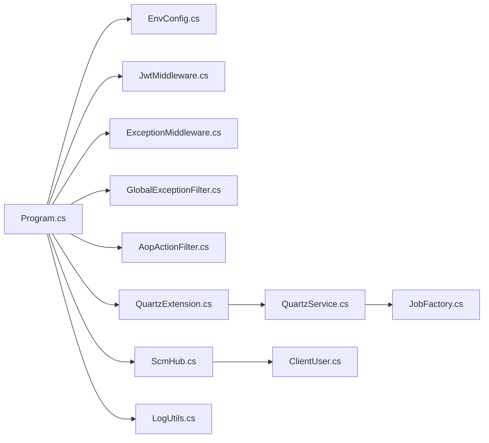

**图表来源**
- [Program.cs:1-366](file://Scm.Net/Program.cs#L1-L366)
- [EnvConfig.cs:1-280](file://Scm.Server/Config/EnvConfig.cs#L1-L280)
- [JwtMiddleware.cs:1-180](file://Scm.Core/Configure/Middleware/JwtMiddleware.cs#L1-L180)
- [ExceptionMiddleware.cs:1-41](file://Scm.Core/Configure/Middleware/ExceptionMiddleware.cs#L1-L41)
- [GlobalExceptionFilter.cs:1-80](file://Scm.Core/Configure/Filters/GlobalExceptionFilter.cs#L1-L80)
- [AopActionFilter.cs:220-252](file://Scm.Core/Configure/Filters/AopActionFilter.cs#L220-L252)
- [QuartzExtension.cs:1-39](file://Scm.Server.Quartz/QuartzExtension.cs#L1-L39)
- [QuartzService.cs:1-440](file://Scm.Server.Quartz/QuartzService.cs#L1-L440)
- [JobFactory.cs:1-41](file://Scm.Server.Quartz/JobFactory.cs#L1-L41)
- [ScmHub.cs:1-111](file://Scm.Server.SignalR/Hubs/ScmHub.cs#L1-L111)
- [ClientUser.cs:1-38](file://Scm.Server.SignalR/Hubs/ClientUser.cs#L1-L38)
- [LogUtils.cs:1-122](file://Scm.Common.Log/Utils/LogUtils.cs#L1-L122)

**章节来源**
- [Program.cs:1-366](file://Scm.Net/Program.cs#L1-L366)

## 性能考量
- 日志级别：生产环境建议最小日志级别为 Information，开发环境为 Debug，以平衡可观测性与性能。
- Kestrel 限制：合理设置最大并发连接数与请求体大小，避免资源耗尽。
- 缓存策略：Redis 缓存配置需与业务负载匹配，避免缓存穿透与雪崩。
- 定时任务：根据业务高峰与低谷调整触发频率，避免与数据库峰值冲突。

[本节为通用指导，无需具体文件分析]

## 故障分级与响应流程
- 分级标准
  - 一级故障：系统完全不可用、核心数据库不可达、大规模业务中断。
  - 二级故障：部分功能不可用、关键接口超时、缓存服务异常。
  - 三级故障：个别接口异常、日志写入异常、非关键定时任务失败。
- 影响评估
  - 业务影响范围：涉及用户数、交易量、数据一致性要求。
  - 技术影响范围：数据库、缓存、消息队列、外部依赖。
- 响应优先级
  - 一级：立即成立应急小组、启动灾难恢复预案、隔离故障区域。
  - 二级：快速定位与修复、回滚变更、启用备用节点。
  - 三级：记录并跟踪、定期复盘、优化监控阈值。

[本节为通用指导，无需具体文件分析]

## 紧急恢复流程
- 系统重启
  - 检查配置文件与环境变量，确认数据目录、日志目录、缓存连接正常。
  - 通过应用入口重新启动，观察启动日志与健康检查。
- 数据恢复
  - 使用数据库初始化接口重建结构，或从备份恢复数据。
  - 校验关键表完整性与索引状态。
- 业务连续性保障
  - 通过 SignalR 推送系统公告与维护通知，引导用户重试或切换备用入口。
  - 对于 NAS 同步，检查监控状态并重置为 Running。

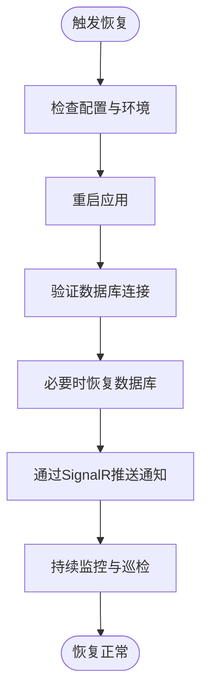

**图表来源**
- [Program.cs:1-366](file://Scm.Net/Program.cs#L1-L366)
- [DbController.cs:207-286](file://Scm.Net/Controllers/DbController.cs#L207-L286)
- [ScmHub.cs:1-111](file://Scm.Server.SignalR/Hubs/ScmHub.cs#L1-L111)
- [NasWatchEnums.cs:1-27](file://Nas.Common/NasWatchEnums.cs#L1-L27)

**章节来源**
- [Program.cs:1-366](file://Scm.Net/Program.cs#L1-L366)
- [DbController.cs:207-286](file://Scm.Net/Controllers/DbController.cs#L207-L286)
- [ScmHub.cs:1-111](file://Scm.Server.SignalR/Hubs/ScmHub.cs#L1-L111)
- [NasWatchEnums.cs:1-27](file://Nas.Common/NasWatchEnums.cs#L1-L27)

## 数据备份与灾难恢复
- 备份计划
  - 数据库：每日全量备份+每小时增量备份，保留最近 7 天全量与 24 小时增量。
  - 配置与日志：每日归档，保留 30 天。
  - 静态资源：上传目录与图片目录按周备份。
- 恢复测试
  - 定期进行恢复演练，验证备份文件完整性与可恢复性。
  - 验证应用启动后各模块功能正常。
- 数据一致性
  - 使用事务与幂等设计，确保恢复后数据一致。
  - 对比恢复前后关键指标（用户数、订单量、日志量）。

[本节为通用指导，无需具体文件分析]

## 故障预警与告警机制
- 监控阈值
  - 数据库连接失败率、慢查询比例、锁等待时间。
  - 缓存命中率、过期与淘汰率、内存占用。
  - API 响应时间、错误率、吞吐量。
- 通知渠道
  - 邮件、短信、企业微信机器人、钉钉机器人。
  - SignalR 推送系统公告，便于内部快速响应。
- 配置要点
  - appsettings.json 中的 Serilog、Kestrel、JWT、Cors 等配置需与监控系统联动。
  - 开发环境与生产环境的阈值与通知策略应差异化。

**章节来源**
- [appsettings.json:1-127](file://Scm.Net/appsettings.json#L1-L127)
- [appsettings.Development.json:1-162](file://Scm.Net/appsettings.Development.json#L1-L162)
- [LogUtils.cs:1-122](file://Scm.Common.Log/Utils/LogUtils.cs#L1-L122)
- [ScmHub.cs:1-111](file://Scm.Server.SignalR/Hubs/ScmHub.cs#L1-L111)

## 团队协作与沟通流程
- 应急小组
  - 组长：负责总体协调与决策。
  - 技术负责人：负责技术方案与实施。
  - 运维负责人：负责基础设施与监控。
  - 产品/运营：负责对外沟通与用户安抚。
- 沟通机制
  - Slack/钉钉/企业微信建立应急群组，明确职责与升级路径。
  - 每小时更新一次进展，重大节点即时通报。
- 文档与复盘
  - 记录故障现象、根因、处置过程与改进措施。
  - 每季度进行复盘，优化应急预案与流程。

[本节为通用指导，无需具体文件分析]

## 结论
通过现有代码库中的异常处理、日志记录、中间件、实时通信、定时任务与配置能力，Scm.Net 已具备完善的应急响应基础。结合本文制定的故障分级、恢复流程、备份策略、预警机制与团队协作流程，可在紧急情况下快速定位问题、降低影响范围并尽快恢复业务连续性。