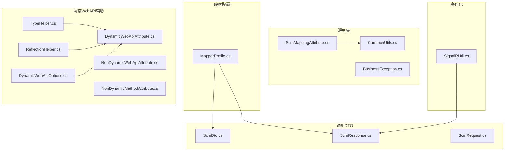
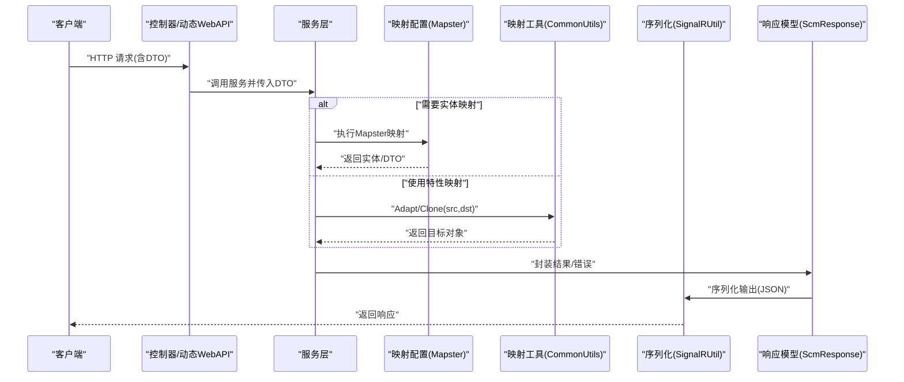
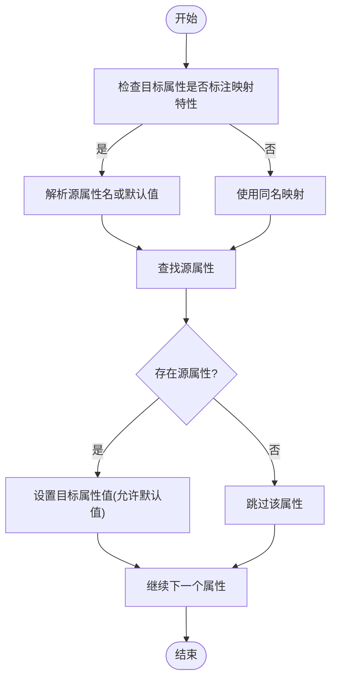
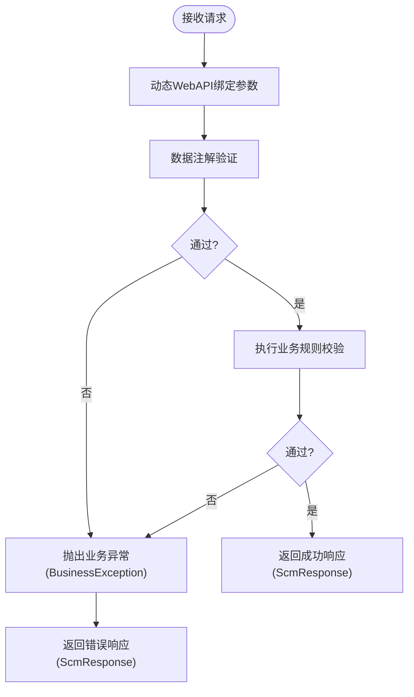
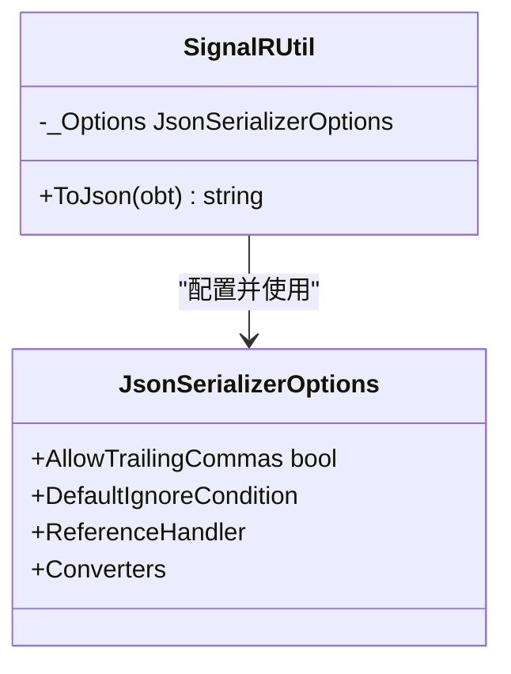
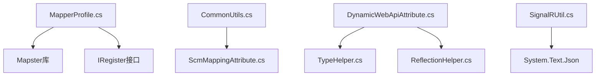

# DTO 映射与验证

<cite>
**本文引用的文件**
- [ScmMappingAttribute.cs](file://Scm.Common/Attributes/ScmMappingAttribute.cs)
- [CommonUtils.cs](file://Scm.Common/Utils/CommonUtils.cs)
- [MapperProfile.cs](file://Scm.Server/Mapper/MapperProfile.cs)
- [ScmDto.cs](file://Scm.Common.Dto/Dto/ScmDto.cs)
- [ScmResponse.cs](file://Scm.Common.Dto/Response/ScmResponse.cs)
- [ScmRequest.cs](file://Scm.Common.Dto/Request/ScmRequest.cs)
- [BusinessException.cs](file://Scm.Common/Exceptions/BusinessException.cs)
- [SignalRUtil.cs](file://Scm.Core/Msg/SignalRUtil.cs)
- [TypeHelper.cs](file://Scm.Server.Api/DynamicWebApi/Helpers/TypeHelper.cs)
- [ReflectionHelper.cs](file://Scm.Server.Api/DynamicWebApi/Helpers/ReflectionHelper.cs)
- [DynamicWebApiOptions.cs](file://Scm.Server.Api/DynamicWebApi/Options/DynamicWebApiOptions.cs)
- [DynamicWebApiAttribute.cs](file://Scm.Server.Api/DynamicWebApi/Attributes/DynamicWebApiAttribute.cs)
- [NonDynamicWebApiAttribute.cs](file://Scm.Server.Api/DynamicWebApi/Attributes/NonDynamicWebApiAttribute.cs)
- [NonDynamicMethodAttribute.cs](file://Scm.Server.Api/DynamicWebApi/Attributes/NonDynamicMethodAttribute.cs)
</cite>

## 目录
1. [简介](#简介)
2. [项目结构](#项目结构)
3. [核心组件](#核心组件)
4. [架构总览](#架构总览)
5. [组件详解](#组件详解)
6. [依赖关系分析](#依赖关系分析)
7. [性能考量](#性能考量)
8. [故障排查指南](#故障排查指南)
9. [结论](#结论)
10. [附录](#附录)

## 简介
本技术文档聚焦于 Scm.Net 中的 DTO 映射与验证体系，系统性阐述以下内容：
- DTO 与实体对象之间的映射机制与转换规则，涵盖基于 Mapster 的配置与使用，以及基于特性驱动的轻量映射工具。
- 数据验证规则的实现方式，包括数据注解验证、自定义验证器与业务规则验证。
- DTO 在不同层级（表现层、服务层、数据访问层）间的传递与转换流程。
- 数据序列化与反序列化的处理机制，含 JSON 序列化选项与转换器。
- 验证错误的处理与错误消息的本地化支持思路。
- DTO 映射与验证的最佳实践与性能优化策略。

## 项目结构
围绕 DTO 映射与验证的关键目录与文件如下：
- 映射与通用工具：Scm.Common/Attributes、Scm.Common/Utils
- 映射配置：Scm.Server/Mapper
- 通用 DTO 与响应模型：Scm.Common.Dto/Dto、Scm.Common.Dto/Response、Scm.Common.Dto/Request
- 业务异常：Scm.Common/Exceptions
- 序列化工具：Scm.Core/Msg
- 动态 WebAPI 辅助：Scm.Server.Api/DynamicWebApi/*



**图表来源**
- [ScmMappingAttribute.cs:1-19](file://Scm.Common/Attributes/ScmMappingAttribute.cs#L1-L19)
- [CommonUtils.cs:1-185](file://Scm.Common/Utils/CommonUtils.cs#L1-L185)
- [MapperProfile.cs:1-69](file://Scm.Server/Mapper/MapperProfile.cs#L1-L69)
- [ScmDto.cs:1-30](file://Scm.Common.Dto/Dto/ScmDto.cs#L1-L30)
- [ScmResponse.cs:1-109](file://Scm.Common.Dto/Response/ScmResponse.cs#L1-L109)
- [ScmRequest.cs:1-7](file://Scm.Common.Dto/Request/ScmRequest.cs#L1-L7)
- [SignalRUtil.cs:1-35](file://Scm.Core/Msg/SignalRUtil.cs#L1-L35)
- [TypeHelper.cs:1-53](file://Scm.Server.Api/DynamicWebApi/Helpers/TypeHelper.cs#L1-L53)
- [ReflectionHelper.cs:1-88](file://Scm.Server.Api/DynamicWebApi/Helpers/ReflectionHelper.cs#L1-L88)
- [DynamicWebApiAttribute.cs:1-38](file://Scm.Server.Api/DynamicWebApi/Attributes/DynamicWebApiAttribute.cs#L1-L38)
- [NonDynamicWebApiAttribute.cs:1-9](file://Scm.Server.Api/DynamicWebApi/Attributes/NonDynamicWebApiAttribute.cs#L1-L9)
- [NonDynamicMethodAttribute.cs:1-9](file://Scm.Server.Api/DynamicWebApi/Attributes/NonDynamicMethodAttribute.cs#L1-L9)
- [DynamicWebApiOptions.cs:68-116](file://Scm.Server.Api/DynamicWebApi/Options/DynamicWebApiOptions.cs#L68-L116)

**章节来源**
- [ScmMappingAttribute.cs:1-19](file://Scm.Common/Attributes/ScmMappingAttribute.cs#L1-L19)
- [CommonUtils.cs:1-185](file://Scm.Common/Utils/CommonUtils.cs#L1-L185)
- [MapperProfile.cs:1-69](file://Scm.Server/Mapper/MapperProfile.cs#L1-L69)
- [ScmDto.cs:1-30](file://Scm.Common.Dto/Dto/ScmDto.cs#L1-L30)
- [ScmResponse.cs:1-109](file://Scm.Common.Dto/Response/ScmResponse.cs#L1-L109)
- [ScmRequest.cs:1-7](file://Scm.Common.Dto/Request/ScmRequest.cs#L1-L7)
- [SignalRUtil.cs:1-35](file://Scm.Core/Msg/SignalRUtil.cs#L1-L35)
- [TypeHelper.cs:1-53](file://Scm.Server.Api/DynamicWebApi/Helpers/TypeHelper.cs#L1-L53)
- [ReflectionHelper.cs:1-88](file://Scm.Server.Api/DynamicWebApi/Helpers/ReflectionHelper.cs#L1-L88)
- [DynamicWebApiAttribute.cs:1-38](file://Scm.Server.Api/DynamicWebApi/Attributes/DynamicWebApiAttribute.cs#L1-L38)
- [NonDynamicWebApiAttribute.cs:1-9](file://Scm.Server.Api/DynamicWebApi/Attributes/NonDynamicWebApiAttribute.cs#L1-L9)
- [NonDynamicMethodAttribute.cs:1-9](file://Scm.Server.Api/DynamicWebApi/Attributes/NonDynamicMethodAttribute.cs#L1-L9)
- [DynamicWebApiOptions.cs:68-116](file://Scm.Server.Api/DynamicWebApi/Options/DynamicWebApiOptions.cs#L68-L116)

## 核心组件
- 特性驱动映射工具：通过 ScmMappingAttribute 与 CommonUtils.Adapt/Clone 提供基于属性特性的轻量映射能力，支持源属性名重定向与默认值注入。
- Mapster 映射配置：在 MapperProfile 中注册全局映射配置，启用名称匹配策略与引用保留，结合 IRegister 扩展实现模块化映射注册。
- 通用 DTO 与响应模型：ScmDto 提供统一标识；ScmResponse 提供标准化结果封装；ScmRequest 作为请求基类。
- 业务异常：BusinessException 统一封装业务异常消息，便于上层捕获与处理。
- 序列化工具：SignalRUtil 使用 System.Text.Json，配置忽略条件、循环引用处理与自定义转换器，确保序列化一致性。
- 动态 WebAPI 辅助：TypeHelper、ReflectionHelper、DynamicWebApiAttribute 及其相关选项与非动态标记，支撑动态 API 的类型识别与行为控制。

**章节来源**
- [ScmMappingAttribute.cs:1-19](file://Scm.Common/Attributes/ScmMappingAttribute.cs#L1-L19)
- [CommonUtils.cs:46-185](file://Scm.Common/Utils/CommonUtils.cs#L46-L185)
- [MapperProfile.cs:11-69](file://Scm.Server/Mapper/MapperProfile.cs#L11-L69)
- [ScmDto.cs:1-30](file://Scm.Common.Dto/Dto/ScmDto.cs#L1-L30)
- [ScmResponse.cs:1-109](file://Scm.Common.Dto/Response/ScmResponse.cs#L1-L109)
- [ScmRequest.cs:1-7](file://Scm.Common.Dto/Request/ScmRequest.cs#L1-L7)
- [BusinessException.cs:1-22](file://Scm.Common/Exceptions/BusinessException.cs#L1-L22)
- [SignalRUtil.cs:12-33](file://Scm.Core/Msg/SignalRUtil.cs#L12-L33)
- [TypeHelper.cs:1-53](file://Scm.Server.Api/DynamicWebApi/Helpers/TypeHelper.cs#L1-L53)
- [ReflectionHelper.cs:1-88](file://Scm.Server.Api/DynamicWebApi/Helpers/ReflectionHelper.cs#L1-L88)
- [DynamicWebApiAttribute.cs:1-38](file://Scm.Server.Api/DynamicWebApi/Attributes/DynamicWebApiAttribute.cs#L1-L38)
- [NonDynamicWebApiAttribute.cs:1-9](file://Scm.Server.Api/DynamicWebApi/Attributes/NonDynamicWebApiAttribute.cs#L1-L9)
- [NonDynamicMethodAttribute.cs:1-9](file://Scm.Server.Api/DynamicWebApi/Attributes/NonDynamicMethodAttribute.cs#L1-L9)
- [DynamicWebApiOptions.cs:68-116](file://Scm.Server.Api/DynamicWebApi/Options/DynamicWebApiOptions.cs#L68-L116)

## 架构总览
下图展示了从请求进入、DTO 转换、映射与验证、到响应输出的整体流程，以及与动态 WebAPI、序列化与异常处理的交互关系。



**图表来源**
- [MapperProfile.cs:48-66](file://Scm.Server/Mapper/MapperProfile.cs#L48-L66)
- [CommonUtils.cs:65-113](file://Scm.Common/Utils/CommonUtils.cs#L65-L113)
- [ScmResponse.cs:1-109](file://Scm.Common.Dto/Response/ScmResponse.cs#L1-L109)
- [SignalRUtil.cs:19-33](file://Scm.Core/Msg/SignalRUtil.cs#L19-L33)
- [DynamicWebApiAttribute.cs:1-38](file://Scm.Server.Api/DynamicWebApi/Attributes/DynamicWebApiAttribute.cs#L1-L38)

## 组件详解

### 映射机制与转换规则
- 特性驱动映射（CommonUtils.Adapt/Clone）
  - 支持通过 ScmMappingAttribute 指定源属性名或注入默认值，实现灵活的字段映射。
  - 对基础类型进行短路处理，避免无意义反射开销。
  - 支持声明式默认值注入，提升默认值场景下的可维护性。
- Mapster 全局映射
  - 在 MapperProfile 中注册全局 TypeAdapterConfig，启用名称匹配策略与引用保留。
  - 通过扫描 IRegister 实现模块化映射注册，便于按模块扩展。
  - 支持依赖注入容器集成，提供 IMapp er 服务。



**图表来源**
- [CommonUtils.cs:65-113](file://Scm.Common/Utils/CommonUtils.cs#L65-L113)
- [ScmMappingAttribute.cs:5-16](file://Scm.Common/Attributes/ScmMappingAttribute.cs#L5-L16)

**章节来源**
- [CommonUtils.cs:46-185](file://Scm.Common/Utils/CommonUtils.cs#L46-L185)
- [ScmMappingAttribute.cs:1-19](file://Scm.Common/Attributes/ScmMappingAttribute.cs#L1-L19)
- [MapperProfile.cs:11-69](file://Scm.Server/Mapper/MapperProfile.cs#L11-L69)

### 数据验证规则实现
- 数据注解验证
  - 通过数据注解（如长度、必填等）在实体或 DTO 层进行输入约束，配合动态 WebAPI 类型识别与绑定机制，确保请求参数符合约束。
- 自定义验证器
  - 利用 DynamicWebApiAttribute 与相关辅助类（TypeHelper、ReflectionHelper）对类型与成员进行特性扫描与行为控制，为自定义验证逻辑提供入口。
- 业务规则验证
  - 使用 BusinessException 封装业务异常消息，便于在服务层集中处理业务校验失败场景，并向上层返回标准化错误信息。



**图表来源**
- [DynamicWebApiAttribute.cs:1-38](file://Scm.Server.Api/DynamicWebApi/Attributes/DynamicWebApiAttribute.cs#L1-L38)
- [TypeHelper.cs:1-53](file://Scm.Server.Api/DynamicWebApi/Helpers/TypeHelper.cs#L1-L53)
- [ReflectionHelper.cs:1-88](file://Scm.Server.Api/DynamicWebApi/Helpers/ReflectionHelper.cs#L1-L88)
- [BusinessException.cs:1-22](file://Scm.Common/Exceptions/BusinessException.cs#L1-L22)
- [ScmResponse.cs:1-109](file://Scm.Common.Dto/Response/ScmResponse.cs#L1-L109)

**章节来源**
- [DynamicWebApiAttribute.cs:1-38](file://Scm.Server.Api/DynamicWebApi/Attributes/DynamicWebApiAttribute.cs#L1-L38)
- [TypeHelper.cs:1-53](file://Scm.Server.Api/DynamicWebApi/Helpers/TypeHelper.cs#L1-L53)
- [ReflectionHelper.cs:1-88](file://Scm.Server.Api/DynamicWebApi/Helpers/ReflectionHelper.cs#L1-L88)
- [BusinessException.cs:1-22](file://Scm.Common/Exceptions/BusinessException.cs#L1-L22)
- [ScmResponse.cs:1-109](file://Scm.Common.Dto/Response/ScmResponse.cs#L1-L109)

### DTO 在不同层级间的传递与转换
- 表现层（控制器/动态 WebAPI）
  - 使用 DynamicWebApiOptions 与 DynamicWebApiAttribute 控制 API 行为与前缀、动词等配置。
  - 参数绑定后进入服务层。
- 服务层
  - 可选择 Mapster 或 CommonUtils.Adapt 进行对象映射。
  - 对业务异常进行捕获与包装。
- 响应层
  - 使用 ScmResponse 统一封装结果与消息。
  - 通过 SignalRUtil 进行序列化输出。

```mermaid
sequenceDiagram
participant Ctrl as "动态WebAPI控制器"
participant Opt as "DynamicWebApiOptions"
participant Attr as "DynamicWebApiAttribute"
participant Svc as "服务层"
participant Map as "映射工具"
participant Resp as "ScmResponse"
participant Ser as "SignalRUtil"
Ctrl->>Opt : "读取API配置"
Ctrl->>Attr : "应用动态API特性"
Ctrl->>Svc : "传入DTO并调用服务"
Svc->>Map : "执行映射(Adapt/Mapster)"
Map-->>Svc : "返回实体/DTO"
Svc->>Resp : "封装响应"
Resp->>Ser : "序列化JSON"
Ser-->>Ctrl : "返回响应"
```

**图表来源**
- [DynamicWebApiOptions.cs:68-116](file://Scm.Server.Api/DynamicWebApi/Options/DynamicWebApiOptions.cs#L68-L116)
- [DynamicWebApiAttribute.cs:1-38](file://Scm.Server.Api/DynamicWebApi/Attributes/DynamicWebApiAttribute.cs#L1-L38)
- [CommonUtils.cs:65-113](file://Scm.Common/Utils/CommonUtils.cs#L65-L113)
- [MapperProfile.cs:48-66](file://Scm.Server/Mapper/MapperProfile.cs#L48-L66)
- [ScmResponse.cs:1-109](file://Scm.Common.Dto/Response/ScmResponse.cs#L1-L109)
- [SignalRUtil.cs:19-33](file://Scm.Core/Msg/SignalRUtil.cs#L19-L33)

**章节来源**
- [DynamicWebApiOptions.cs:68-116](file://Scm.Server.Api/DynamicWebApi/Options/DynamicWebApiOptions.cs#L68-L116)
- [DynamicWebApiAttribute.cs:1-38](file://Scm.Server.Api/DynamicWebApi/Attributes/DynamicWebApiAttribute.cs#L1-L38)
- [CommonUtils.cs:65-113](file://Scm.Common/Utils/CommonUtils.cs#L65-L113)
- [MapperProfile.cs:48-66](file://Scm.Server/Mapper/MapperProfile.cs#L48-L66)
- [ScmResponse.cs:1-109](file://Scm.Common.Dto/Response/ScmResponse.cs#L1-L109)
- [SignalRUtil.cs:19-33](file://Scm.Core/Msg/SignalRUtil.cs#L19-L33)

### 数据序列化与反序列化处理
- 使用 System.Text.Json 的 JsonSerializerOptions 进行序列化配置：
  - 忽略尾随逗号、忽略空值、循环引用处理。
  - 注册自定义转换器以保证日期、长整型、类型等格式一致。
- 适用于 SignalR 场景的消息序列化与传输。



**图表来源**
- [SignalRUtil.cs:12-33](file://Scm.Core/Msg/SignalRUtil.cs#L12-L33)

**章节来源**
- [SignalRUtil.cs:1-35](file://Scm.Core/Msg/SignalRUtil.cs#L1-L35)

### 验证错误处理与本地化支持
- 错误处理
  - 使用 BusinessException 封装业务异常消息，便于在服务层集中处理并向上层返回标准化错误。
  - 使用 ScmResponse 提供统一的成功/失败状态与消息封装。
- 本地化支持
  - 可在服务层根据区域设置选择本地化资源，结合 ScmResponse 返回对应语言的错误消息。
  - 建议在控制器或中间件层统一拦截异常并转换为本地化消息。

**章节来源**
- [BusinessException.cs:1-22](file://Scm.Common/Exceptions/BusinessException.cs#L1-L22)
- [ScmResponse.cs:1-109](file://Scm.Common.Dto/Response/ScmResponse.cs#L1-L109)

## 依赖关系分析
- 映射配置依赖 Mapster 与 IRegister 接口，通过 Assembly 扫描实现模块化注册。
- 特性映射依赖 ScmMappingAttribute 与反射 API，实现声明式映射。
- 动态 WebAPI 依赖 TypeHelper、ReflectionHelper 与 DynamicWebApiAttribute，控制 API 行为。
- 序列化依赖 System.Text.Json，通过 SignalRUtil 统一配置。



**图表来源**
- [MapperProfile.cs:1-69](file://Scm.Server/Mapper/MapperProfile.cs#L1-L69)
- [CommonUtils.cs:1-185](file://Scm.Common/Utils/CommonUtils.cs#L1-L185)
- [ScmMappingAttribute.cs:1-19](file://Scm.Common/Attributes/ScmMappingAttribute.cs#L1-L19)
- [DynamicWebApiAttribute.cs:1-38](file://Scm.Server.Api/DynamicWebApi/Attributes/DynamicWebApiAttribute.cs#L1-L38)
- [TypeHelper.cs:1-53](file://Scm.Server.Api/DynamicWebApi/Helpers/TypeHelper.cs#L1-L53)
- [ReflectionHelper.cs:1-88](file://Scm.Server.Api/DynamicWebApi/Helpers/ReflectionHelper.cs#L1-L88)
- [SignalRUtil.cs:1-35](file://Scm.Core/Msg/SignalRUtil.cs#L1-L35)

**章节来源**
- [MapperProfile.cs:1-69](file://Scm.Server/Mapper/MapperProfile.cs#L1-L69)
- [CommonUtils.cs:1-185](file://Scm.Common/Utils/CommonUtils.cs#L1-L185)
- [ScmMappingAttribute.cs:1-19](file://Scm.Common/Attributes/ScmMappingAttribute.cs#L1-L19)
- [DynamicWebApiAttribute.cs:1-38](file://Scm.Server.Api/DynamicWebApi/Attributes/DynamicWebApiAttribute.cs#L1-L38)
- [TypeHelper.cs:1-53](file://Scm.Server.Api/DynamicWebApi/Helpers/TypeHelper.cs#L1-L53)
- [ReflectionHelper.cs:1-88](file://Scm.Server.Api/DynamicWebApi/Helpers/ReflectionHelper.cs#L1-L88)
- [SignalRUtil.cs:1-35](file://Scm.Core/Msg/SignalRUtil.cs#L1-L35)

## 性能考量
- 映射性能
  - 特性映射对基础类型进行短路处理，减少不必要的反射开销。
  - Mapster 默认启用 PreserveReference，适合复杂对象图；若不需要引用保持，可在配置中关闭以降低内存占用。
  - 使用名称匹配策略时，建议在命名规范统一的前提下启用，避免过多的字符串匹配成本。
- 序列化性能
  - 通过忽略空值与循环引用处理，减少序列化体积与栈溢出风险。
  - 自定义转换器仅在必要时添加，避免额外的格式转换开销。
- 动态 WebAPI
  - 合理使用 DynamicWebApiAttribute 与 NonDynamic* 标记，避免对不参与动态 API 的类型进行扫描与处理。

[本节为通用性能建议，无需特定文件引用]

## 故障排查指南
- 映射失败
  - 检查目标属性是否标注 ScmMappingAttribute 且源属性名正确。
  - 确认 Mapster 配置已注册并启用名称匹配策略。
- 验证失败
  - 查看 DynamicWebApiAttribute 与相关选项配置，确认参数绑定与验证流程未被禁用。
  - 捕获 BusinessException 并检查消息内容，定位业务规则问题。
- 序列化异常
  - 检查 SignalRUtil 的 JsonSerializerOptions 配置，确认转换器与忽略条件设置合理。
- 响应不一致
  - 统一使用 ScmResponse 的 SetSuccess/SetFailure 方法，确保返回码与消息一致。

**章节来源**
- [CommonUtils.cs:65-113](file://Scm.Common/Utils/CommonUtils.cs#L65-L113)
- [MapperProfile.cs:48-66](file://Scm.Server/Mapper/MapperProfile.cs#L48-L66)
- [DynamicWebApiAttribute.cs:1-38](file://Scm.Server.Api/DynamicWebApi/Attributes/DynamicWebApiAttribute.cs#L1-L38)
- [BusinessException.cs:1-22](file://Scm.Common/Exceptions/BusinessException.cs#L1-L22)
- [SignalRUtil.cs:19-33](file://Scm.Core/Msg/SignalRUtil.cs#L19-L33)
- [ScmResponse.cs:76-106](file://Scm.Common.Dto/Response/ScmResponse.cs#L76-L106)

## 结论
Scm.Net 的 DTO 映射与验证体系通过特性驱动映射、Mapster 全局配置、动态 WebAPI 辅助与统一响应模型，实现了跨层级的一致性与可维护性。结合序列化工具与业务异常封装，能够高效地完成数据转换、验证与错误处理。遵循本文的最佳实践与性能优化建议，可进一步提升系统的稳定性与运行效率。

[本节为总结性内容，无需特定文件引用]

## 附录
- 最佳实践
  - 统一 DTO 命名规范，启用 Mapster 名称匹配策略。
  - 在服务层集中处理业务规则与异常，使用 BusinessException 与 ScmResponse 统一输出。
  - 合理使用特性映射与 Mapster，避免重复映射与过度反射。
  - 在序列化阶段统一配置 JsonSerializerOptions，确保一致性与性能。
- 性能优化
  - 关闭不必要的引用保持与深度映射。
  - 减少反射调用次数，优先使用 Mapster 的强类型映射。
  - 合理裁剪序列化内容，避免传输冗余数据。

[本节为通用建议，无需特定文件引用]