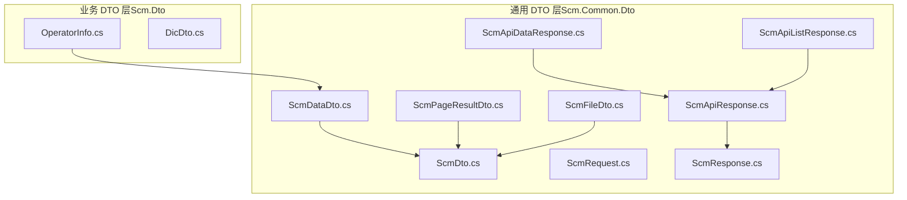
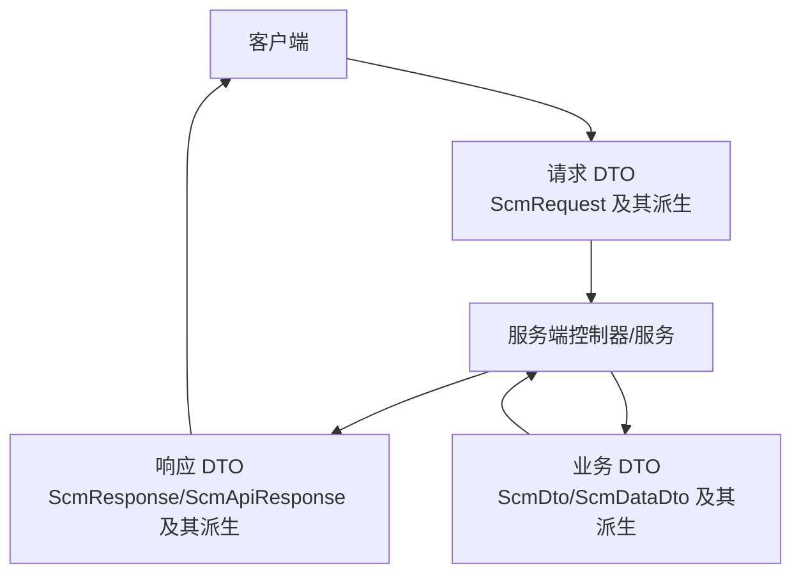
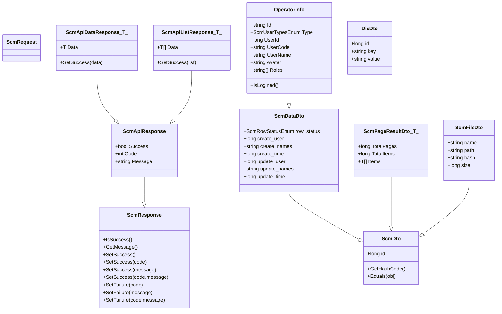
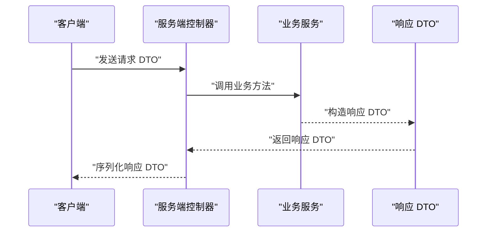
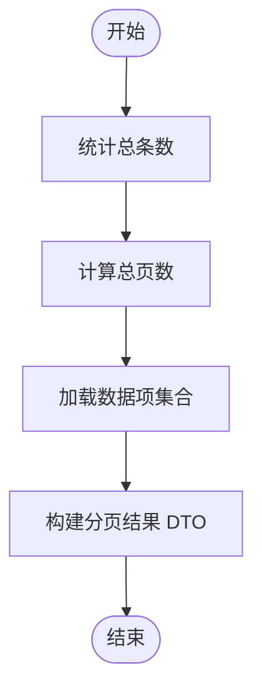
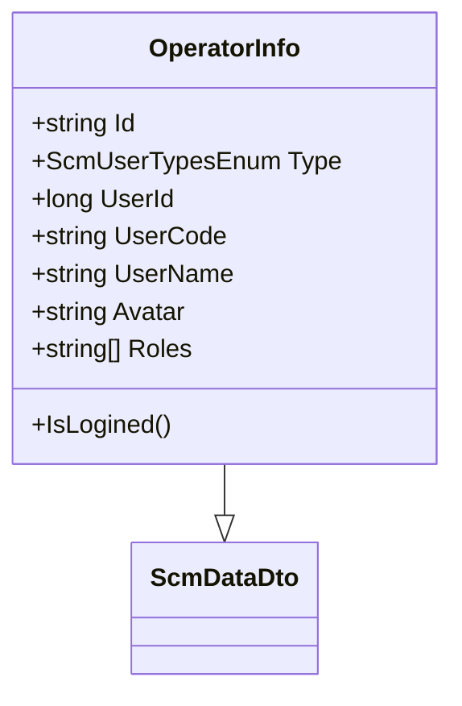
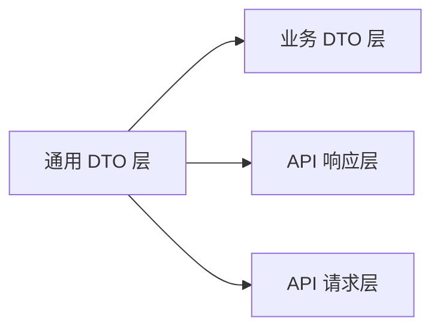

# DTO 架构设计

<cite>
**本文引用的文件**
- [ScmDto.cs](file://Scm.Common.Dto/Dto/ScmDto.cs)
- [ScmDataDto.cs](file://Scm.Common.Dto/Dto/ScmDataDto.cs)
- [ScmPageResultDto.cs](file://Scm.Common.Dto/Dto/ScmPageResultDto.cs)
- [ScmFileDto.cs](file://Scm.Common.Dto/Dto/ScmFileDto.cs)
- [ScmRequest.cs](file://Scm.Common.Dto/Request/ScmRequest.cs)
- [ScmResponse.cs](file://Scm.Common.Dto/Response/ScmResponse.cs)
- [ScmApiResponse.cs](file://Scm.Common.Dto/Response/ScmApiResponse.cs)
- [ScmApiDataResponse.cs](file://Scm.Common.Dto/Response/ScmApiDataResponse.cs)
- [ScmApiListResponse.cs](file://Scm.Common.Dto/Response/ScmApiListResponse.cs)
- [OperatorInfo.cs](file://Scm.Dto/Operator/OperatorInfo.cs)
- [DicDto.cs](file://Scm.Dto/Sys/DicDto.cs)
</cite>

## 目录
1. [引言](#引言)
2. [项目结构](#项目结构)
3. [核心组件](#核心组件)
4. [架构总览](#架构总览)
5. [详细组件分析](#详细组件分析)
6. [依赖分析](#依赖分析)
7. [性能考虑](#性能考虑)
8. [故障排查指南](#故障排查指南)
9. [结论](#结论)
10. [附录](#附录)

## 引言
本文件系统化梳理 Scm.Net 中 DTO 架构的设计理念与实现方式，重点覆盖以下方面：
- 数据传输模式与对象映射机制
- 分层架构中 DTO 的定位与职责
- 基类设计（ScmDto、ScmDataDto）与继承关系
- 请求/响应 DTO 的抽象层次（ScmRequest、ScmResponse）
- 跨层级传递与转换规则
- 最佳实践与设计模式应用
- 版本兼容性与向后兼容策略

## 项目结构
Scm.Net 的 DTO 架构主要分布在两个工程中：
- Scm.Common.Dto：通用 DTO 定义与基础抽象（请求/响应、基础数据对象）
- Scm.Dto：业务领域 DTO（如 OperatorInfo、DicDto 等）

下图展示与 DTO 架构相关的核心文件与模块关系：

图表来源
- [ScmDto.cs:1-30](file://Scm.Common.Dto/Dto/ScmDto.cs#L1-L30)
- [ScmDataDto.cs:1-19](file://Scm.Common.Dto/Dto/ScmDataDto.cs#L1-L19)
- [ScmPageResultDto.cs:1-23](file://Scm.Common.Dto/Dto/ScmPageResultDto.cs#L1-L23)
- [ScmFileDto.cs:1-14](file://Scm.Common.Dto/Dto/ScmFileDto.cs#L1-L14)
- [ScmRequest.cs:1-7](file://Scm.Common.Dto/Request/ScmRequest.cs#L1-L7)
- [ScmResponse.cs:1-109](file://Scm.Common.Dto/Response/ScmResponse.cs#L1-L109)
- [ScmApiResponse.cs:1-21](file://Scm.Common.Dto/Response/ScmApiResponse.cs#L1-L21)
- [ScmApiDataResponse.cs:1-19](file://Scm.Common.Dto/Response/ScmApiDataResponse.cs#L1-L19)
- [ScmApiListResponse.cs:1-20](file://Scm.Common.Dto/Response/ScmApiListResponse.cs#L1-L20)
- [OperatorInfo.cs:1-52](file://Scm.Dto/Operator/OperatorInfo.cs#L1-L52)
- [DicDto.cs:1-22](file://Scm.Dto/Sys/DicDto.cs#L1-L22)

章节来源
- [ScmDto.cs:1-30](file://Scm.Common.Dto/Dto/ScmDto.cs#L1-L30)
- [ScmDataDto.cs:1-19](file://Scm.Common.Dto/Dto/ScmDataDto.cs#L1-L19)
- [ScmPageResultDto.cs:1-23](file://Scm.Common.Dto/Dto/ScmPageResultDto.cs#L1-L23)
- [ScmFileDto.cs:1-14](file://Scm.Common.Dto/Dto/ScmFileDto.cs#L1-L14)
- [ScmRequest.cs:1-7](file://Scm.Common.Dto/Request/ScmRequest.cs#L1-L7)
- [ScmResponse.cs:1-109](file://Scm.Common.Dto/Response/ScmResponse.cs#L1-L109)
- [ScmApiResponse.cs:1-21](file://Scm.Common.Dto/Response/ScmApiResponse.cs#L1-L21)
- [ScmApiDataResponse.cs:1-19](file://Scm.Common.Dto/Response/ScmApiDataResponse.cs#L1-L19)
- [ScmApiListResponse.cs:1-20](file://Scm.Common.Dto/Response/ScmApiListResponse.cs#L1-L20)
- [OperatorInfo.cs:1-52](file://Scm.Dto/Operator/OperatorInfo.cs#L1-L52)
- [DicDto.cs:1-22](file://Scm.Dto/Sys/DicDto.cs#L1-L22)

## 核心组件
本节聚焦 DTO 架构的关键基类与抽象层，阐明其职责与协作关系。

- ScmDto：所有 DTO 的根基类，统一提供唯一标识 id 以及基于 id 的相等性与哈希逻辑，确保跨层传递时具备稳定的对象识别能力。
- ScmDataDto：在 ScmDto 基础上扩展“行状态”与“创建/更新”的审计字段，面向需要持久化或受控变更的数据对象。
- ScmPageResultDto<T>：分页结果容器，承载总条数、总页数与数据项集合，便于服务端分页查询的统一输出。
- ScmFileDto：文件元数据载体，包含文件名、路径、哈希与大小等关键属性，用于文件上传/下载场景。
- ScmRequest：请求抽象基类，作为所有请求 DTO 的父类，便于统一处理与扩展。
- ScmResponse：响应抽象基类，封装“是否成功”、“返回码”、“返回消息”，并提供多重重载的设置方法，保证前后端交互的一致性。
- ScmApiResponse：对 ScmResponse 的公开化包装，将内部保护字段暴露为公共属性，便于序列化与前端消费。
- ScmApiDataResponse<T>/ScmApiListResponse<T>：泛型响应容器，分别承载单对象与列表数据，简化成功响应的构造流程。

章节来源
- [ScmDto.cs:1-30](file://Scm.Common.Dto/Dto/ScmDto.cs#L1-L30)
- [ScmDataDto.cs:1-19](file://Scm.Common.Dto/Dto/ScmDataDto.cs#L1-L19)
- [ScmPageResultDto.cs:1-23](file://Scm.Common.Dto/Dto/ScmPageResultDto.cs#L1-L23)
- [ScmFileDto.cs:1-14](file://Scm.Common.Dto/Dto/ScmFileDto.cs#L1-L14)
- [ScmRequest.cs:1-7](file://Scm.Common.Dto/Request/ScmRequest.cs#L1-L7)
- [ScmResponse.cs:1-109](file://Scm.Common.Dto/Response/ScmResponse.cs#L1-L109)
- [ScmApiResponse.cs:1-21](file://Scm.Common.Dto/Response/ScmApiResponse.cs#L1-L21)
- [ScmApiDataResponse.cs:1-19](file://Scm.Common.Dto/Response/ScmApiDataResponse.cs#L1-L19)
- [ScmApiListResponse.cs:1-20](file://Scm.Common.Dto/Response/ScmApiListResponse.cs#L1-L20)

## 架构总览
下图展示了 DTO 在分层架构中的角色与流转方向：客户端通过请求 DTO 发起调用，服务端接收请求 DTO 并进行处理，最终以响应 DTO 返回结果；业务 DTO 则承载具体业务实体并在各层之间传递。

图表来源
- [ScmRequest.cs:1-7](file://Scm.Common.Dto/Request/ScmRequest.cs#L1-L7)
- [ScmResponse.cs:1-109](file://Scm.Common.Dto/Response/ScmResponse.cs#L1-L109)
- [ScmApiResponse.cs:1-21](file://Scm.Common.Dto/Response/ScmApiResponse.cs#L1-L21)
- [ScmDto.cs:1-30](file://Scm.Common.Dto/Dto/ScmDto.cs#L1-L30)
- [ScmDataDto.cs:1-19](file://Scm.Common.Dto/Dto/ScmDataDto.cs#L1-L19)

## 详细组件分析

### 基类与继承关系
- 继承链
  - ScmDto：唯一标识 id，相等性与哈希基于 id 实现
  - ScmDataDto：继承 ScmDto，增加行状态与审计字段
  - ScmPageResultDto<T>：继承 ScmDto，增加分页统计与数据集合
  - ScmFileDto：继承 ScmDto，增加文件元信息
  - ScmApiResponse：继承 ScmResponse，公开内部状态字段
  - ScmApiDataResponse<T>/ScmApiListResponse<T>：继承 ScmApiResponse，承载具体数据

图表来源
- [ScmDto.cs:1-30](file://Scm.Common.Dto/Dto/ScmDto.cs#L1-L30)
- [ScmDataDto.cs:1-19](file://Scm.Common.Dto/Dto/ScmDataDto.cs#L1-L19)
- [ScmPageResultDto.cs:1-23](file://Scm.Common.Dto/Dto/ScmPageResultDto.cs#L1-L23)
- [ScmFileDto.cs:1-14](file://Scm.Common.Dto/Dto/ScmFileDto.cs#L1-L14)
- [ScmRequest.cs:1-7](file://Scm.Common.Dto/Request/ScmRequest.cs#L1-L7)
- [ScmResponse.cs:1-109](file://Scm.Common.Dto/Response/ScmResponse.cs#L1-L109)
- [ScmApiResponse.cs:1-21](file://Scm.Common.Dto/Response/ScmApiResponse.cs#L1-L21)
- [ScmApiDataResponse.cs:1-19](file://Scm.Common.Dto/Response/ScmApiDataResponse.cs#L1-L19)
- [ScmApiListResponse.cs:1-20](file://Scm.Common.Dto/Response/ScmApiListResponse.cs#L1-L20)
- [OperatorInfo.cs:1-52](file://Scm.Dto/Operator/OperatorInfo.cs#L1-L52)
- [DicDto.cs:1-22](file://Scm.Dto/Sys/DicDto.cs#L1-L22)

章节来源
- [ScmDto.cs:1-30](file://Scm.Common.Dto/Dto/ScmDto.cs#L1-L30)
- [ScmDataDto.cs:1-19](file://Scm.Common.Dto/Dto/ScmDataDto.cs#L1-L19)
- [ScmPageResultDto.cs:1-23](file://Scm.Common.Dto/Dto/ScmPageResultDto.cs#L1-L23)
- [ScmFileDto.cs:1-14](file://Scm.Common.Dto/Dto/ScmFileDto.cs#L1-L14)
- [ScmRequest.cs:1-7](file://Scm.Common.Dto/Request/ScmRequest.cs#L1-L7)
- [ScmResponse.cs:1-109](file://Scm.Common.Dto/Response/ScmResponse.cs#L1-L109)
- [ScmApiResponse.cs:1-21](file://Scm.Common.Dto/Response/ScmApiResponse.cs#L1-L21)
- [ScmApiDataResponse.cs:1-19](file://Scm.Common.Dto/Response/ScmApiDataResponse.cs#L1-L19)
- [ScmApiListResponse.cs:1-20](file://Scm.Common.Dto/Response/ScmApiListResponse.cs#L1-L20)
- [OperatorInfo.cs:1-52](file://Scm.Dto/Operator/OperatorInfo.cs#L1-L52)
- [DicDto.cs:1-22](file://Scm.Dto/Sys/DicDto.cs#L1-L22)

### 请求/响应处理流程
下图描述一次典型请求-响应过程中的对象流转与状态变化：

图表来源
- [ScmRequest.cs:1-7](file://Scm.Common.Dto/Request/ScmRequest.cs#L1-L7)
- [ScmResponse.cs:1-109](file://Scm.Common.Dto/Response/ScmResponse.cs#L1-L109)
- [ScmApiResponse.cs:1-21](file://Scm.Common.Dto/Response/ScmApiResponse.cs#L1-L21)

章节来源
- [ScmRequest.cs:1-7](file://Scm.Common.Dto/Request/ScmRequest.cs#L1-L7)
- [ScmResponse.cs:1-109](file://Scm.Common.Dto/Response/ScmResponse.cs#L1-L109)
- [ScmApiResponse.cs:1-21](file://Scm.Common.Dto/Response/ScmApiResponse.cs#L1-L21)

### 复杂逻辑组件：分页结果构建
分页结果的生成通常涉及统计总数、计算页数与装载数据项。下图给出一个典型的分页处理流程：

图表来源
- [ScmPageResultDto.cs:1-23](file://Scm.Common.Dto/Dto/ScmPageResultDto.cs#L1-L23)

章节来源
- [ScmPageResultDto.cs:1-23](file://Scm.Common.Dto/Dto/ScmPageResultDto.cs#L1-L23)

### 业务 DTO 示例：OperatorInfo
OperatorInfo 继承自 ScmDataDto，体现了“审计字段 + 业务属性”的组合模式，适合在登录态、权限控制等场景中传递用户相关信息。

图表来源
- [OperatorInfo.cs:1-52](file://Scm.Dto/Operator/OperatorInfo.cs#L1-L52)
- [ScmDataDto.cs:1-19](file://Scm.Common.Dto/Dto/ScmDataDto.cs#L1-L19)

章节来源
- [OperatorInfo.cs:1-52](file://Scm.Dto/Operator/OperatorInfo.cs#L1-L52)
- [ScmDataDto.cs:1-19](file://Scm.Common.Dto/Dto/ScmDataDto.cs#L1-L19)

## 依赖分析
- 内聚性
  - 通用 DTO 层集中定义了跨域复用的抽象与容器，内聚度高，便于维护与扩展
- 耦合性
  - 业务 DTO 对通用 DTO 的依赖是单向且稳定的，耦合集中在基类与接口契约层面
- 扩展点
  - 通过继承 ScmDto/ScmDataDto/ScmRequest/ScmResponse 及其泛型派生，可快速扩展新的 DTO 类型
- 兼容性
  - 采用“新增字段不破坏旧结构”的策略，保持向后兼容

图表来源
- [ScmDto.cs:1-30](file://Scm.Common.Dto/Dto/ScmDto.cs#L1-L30)
- [ScmDataDto.cs:1-19](file://Scm.Common.Dto/Dto/ScmDataDto.cs#L1-L19)
- [ScmRequest.cs:1-7](file://Scm.Common.Dto/Request/ScmRequest.cs#L1-L7)
- [ScmResponse.cs:1-109](file://Scm.Common.Dto/Response/ScmResponse.cs#L1-L109)
- [ScmApiResponse.cs:1-21](file://Scm.Common.Dto/Response/ScmApiResponse.cs#L1-L21)
- [OperatorInfo.cs:1-52](file://Scm.Dto/Operator/OperatorInfo.cs#L1-L52)

章节来源
- [ScmDto.cs:1-30](file://Scm.Common.Dto/Dto/ScmDto.cs#L1-L30)
- [ScmDataDto.cs:1-19](file://Scm.Common.Dto/Dto/ScmDataDto.cs#L1-L19)
- [ScmRequest.cs:1-7](file://Scm.Common.Dto/Request/ScmRequest.cs#L1-L7)
- [ScmResponse.cs:1-109](file://Scm.Common.Dto/Response/ScmResponse.cs#L1-L109)
- [ScmApiResponse.cs:1-21](file://Scm.Common.Dto/Response/ScmApiResponse.cs#L1-L21)
- [OperatorInfo.cs:1-52](file://Scm.Dto/Operator/OperatorInfo.cs#L1-L52)

## 性能考虑
- 序列化开销
  - 响应 DTO 使用公开属性便于序列化，建议避免在 Data 字段中嵌套过深的对象图
- 分页优化
  - 分页结果 DTO 提供 TotalItems 与 TotalPages，建议结合数据库索引与投影查询减少不必要的数据装载
- 哈希与相等性
  - 基于 id 的相等性判断在集合去重与缓存键生成时效率较高，但需确保 id 的唯一性与稳定性

## 故障排查指南
- 响应状态判定
  - 使用 ScmResponse 的 IsSuccess()/GetMessage() 方法统一判定与读取消息，避免直接访问内部字段
- 成功/失败设置
  - 优先使用 SetSuccess/SetFailure 的重载方法，确保返回码与消息一致
- 泛型响应构造
  - 使用 ScmApiDataResponse<T>.SetSuccess 或 ScmApiListResponse<T>.SetSuccess 快速构造成功响应

章节来源
- [ScmResponse.cs:1-109](file://Scm.Common.Dto/Response/ScmResponse.cs#L1-L109)
- [ScmApiDataResponse.cs:1-19](file://Scm.Common.Dto/Response/ScmApiDataResponse.cs#L1-L19)
- [ScmApiListResponse.cs:1-20](file://Scm.Common.Dto/Response/ScmApiListResponse.cs#L1-L20)

## 结论
Scm.Net 的 DTO 架构以简洁的基类体系为核心，通过清晰的抽象与泛型容器实现跨层稳定的数据传输。该设计在保证一致性的同时，提供了良好的扩展性与兼容性，适用于复杂业务场景下的数据建模与交互。

## 附录
- 设计原则
  - 单一职责：每个 DTO 明确承载一类数据
  - 开闭原则：通过继承扩展新类型，不修改既有契约
  - 里氏替换：子类可无缝替代父类参与序列化与传递
- 最佳实践
  - 新增 DTO 时优先继承 ScmDataDto（若涉及审计字段），否则继承 ScmDto
  - 成功响应优先使用 ScmApiDataResponse<T>/ScmApiListResponse<T>.SetSuccess
  - 分页场景统一使用 ScmPageResultDto<T>
  - 避免在 DTO 中引入业务逻辑，保持纯数据载体特性
- 版本兼容与向后兼容
  - 新增字段时保持默认值与可选性，避免破坏现有序列化结构
  - 对外暴露的响应字段尽量采用公开属性，便于前端解析与升级