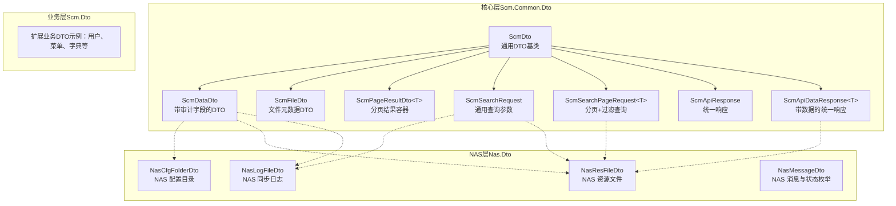
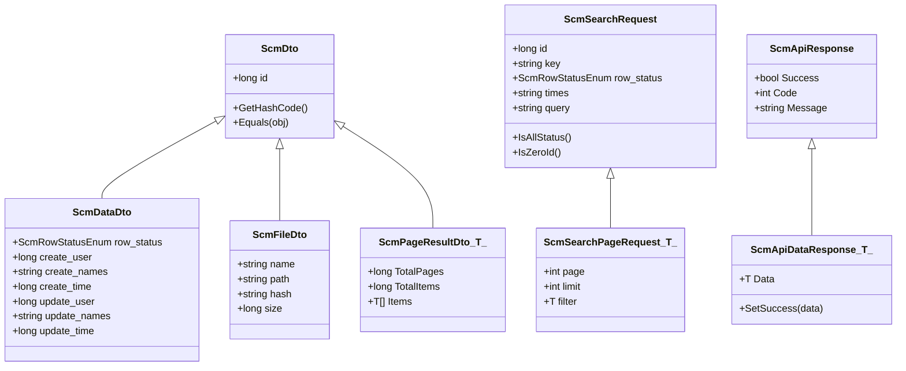
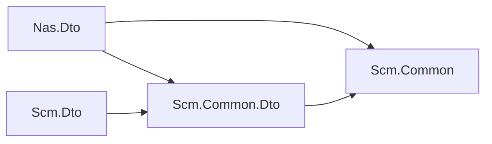

# 数据传输对象

<cite>
**本文引用的文件**
- [Nas.Dto.csproj](file://Nas.Dto/Nas.Dto.csproj)
- [Scm.Common.Dto.csproj](file://Scm.Common.Dto/Scm.Common.Dto.csproj)
- [Scm.Dto.csproj](file://Scm.Dto/Scm.Dto.csproj)
- [NasCfgFolderDto.cs](file://Nas.Dto/Cfg/NasCfgFolderDto.cs)
- [NasResFileDto.cs](file://Nas.Dto/Res/NasResFileDto.cs)
- [NasLogFileDto.cs](file://Nas.Dto/Log/NasLogFileDto.cs)
- [NasMessageDto.cs](file://Nas.Dto/Msg/NasMessageDto.cs)
- [ScmDto.cs](file://Scm.Common.Dto/Dto/ScmDto.cs)
- [ScmDataDto.cs](file://Scm.Common.Dto/Dto/ScmDataDto.cs)
- [ScmFileDto.cs](file://Scm.Common.Dto/Dto/ScmFileDto.cs)
- [ScmPageResultDto.cs](file://Scm.Common.Dto/Dto/ScmPageResultDto.cs)
- [ScmSearchRequest.cs](file://Scm.Common.Dto/ScmSearchRequest.cs)
- [ScmSearchPageRequest.cs](file://Scm.Common.Dto/ScmSearchPageRequest.cs)
- [ScmApiResponse.cs](file://Scm.Common.Dto/Response/ScmApiResponse.cs)
- [ScmApiDataResponse.cs](file://Scm.Common.Dto/Response/ScmApiDataResponse.cs)
- [ScmMappingAttribute.cs](file://Scm.Common/Attributes/ScmMappingAttribute.cs)
- [CommonUtils.cs](file://Scm.Common/Utils/CommonUtils.cs)
</cite>

## 目录
1. [简介](#简介)
2. [项目结构](#项目结构)
3. [核心组件](#核心组件)
4. [架构总览](#架构总览)
5. [详细组件分析](#详细组件分析)
6. [依赖分析](#依赖分析)
7. [性能考虑](#性能考虑)
8. [故障排查指南](#故障排查指南)
9. [结论](#结论)
10. [附录](#附录)

## 简介
本文件系统性阐述 Scm.Net 中“数据传输对象”（DTO）的架构设计与实现机制，覆盖数据传输模式、对象映射、数据验证、序列化与版本兼容、以及与实体对象的转换关系。重点解析以下 DTO 类型与用途：
- 用户信息相关 DTO（示例：用户登录、会话等）
- 文件信息相关 DTO（示例：NAS 文件、资源文件）
- 认证与消息相关 DTO（示例：NAS 消息、同步状态）
- 查询与分页 DTO（示例：搜索请求、分页请求）
- 响应 DTO（示例：统一响应、带数据的响应）

同时给出字段定义、数据类型、约束条件与业务规则，并提供映射、序列化、版本兼容与验证的最佳实践。

## 项目结构
Scm.Net 的 DTO 层由三层组成：
- 核心 DTO 基础层：位于 Scm.Common.Dto，提供通用 DTO 基类、分页容器、查询参数、响应封装等。
- 业务 DTO 扩展层：位于 Scm.Dto，扩展核心 DTO 并承载具体业务模型。
- NAS 专用 DTO 层：位于 Nas.Dto，面向 NAS 场景的配置、资源、日志与消息 DTO。

图表来源
- [ScmDto.cs:1-30](file://Scm.Common.Dto/Dto/ScmDto.cs#L1-L30)
- [ScmDataDto.cs:1-19](file://Scm.Common.Dto/Dto/ScmDataDto.cs#L1-L19)
- [ScmFileDto.cs:1-14](file://Scm.Common.Dto/Dto/ScmFileDto.cs#L1-L14)
- [ScmPageResultDto.cs:1-23](file://Scm.Common.Dto/Dto/ScmPageResultDto.cs#L1-L23)
- [ScmSearchRequest.cs:1-47](file://Scm.Common.Dto/ScmSearchRequest.cs#L1-L47)
- [ScmSearchPageRequest.cs:1-39](file://Scm.Common.Dto/ScmSearchPageRequest.cs#L1-L39)
- [ScmApiResponse.cs:1-21](file://Scm.Common.Dto/Response/ScmApiResponse.cs#L1-L21)
- [ScmApiDataResponse.cs:1-19](file://Scm.Common.Dto/Response/ScmApiDataResponse.cs#L1-L19)
- [NasCfgFolderDto.cs:1-40](file://Nas.Dto/Cfg/NasCfgFolderDto.cs#L1-L40)
- [NasResFileDto.cs:1-61](file://Nas.Dto/Res/NasResFileDto.cs#L1-L61)
- [NasLogFileDto.cs:1-92](file://Nas.Dto/Log/NasLogFileDto.cs#L1-L92)
- [NasMessageDto.cs:1-170](file://Nas.Dto/Msg/NasMessageDto.cs#L1-L170)

章节来源
- [Nas.Dto.csproj:1-17](file://Nas.Dto/Nas.Dto.csproj#L1-L17)
- [Scm.Common.Dto.csproj:1-18](file://Scm.Common.Dto/Scm.Common.Dto.csproj#L1-L18)
- [Scm.Dto.csproj:1-24](file://Scm.Dto/Scm.Dto.csproj#L1-L24)

## 核心组件
本节聚焦核心 DTO 基类与通用容器，它们是所有业务 DTO 的基石，提供统一的标识、审计、分页、查询与响应规范。

- ScmDto：通用 DTO 基类，提供唯一标识 id，并重写相等性与哈希逻辑，便于集合去重与比较。
- ScmDataDto：在 ScmDto 基础上增加行状态与审计字段（创建人、创建时间、更新人、更新时间），用于统一记录数据生命周期。
- ScmFileDto：文件元数据 DTO，包含文件名、路径、哈希与大小，用于跨模块复用。
- ScmPageResultDto<T>：分页结果容器，包含总页数、总记录数与数据项列表。
- ScmSearchRequest：通用查询参数，支持 id、关键字、状态、时间区间、高级查询 JSON 等。
- ScmSearchPageRequest<T>：在 ScmSearchRequest 基础上增加分页参数（当前页、每页条数）与泛型过滤器。
- ScmApiResponse：统一响应封装，包含成功标志、返回码与消息。
- ScmApiDataResponse<T>：带数据的统一响应封装，提供便捷设置成功状态的方法。

章节来源
- [ScmDto.cs:1-30](file://Scm.Common.Dto/Dto/ScmDto.cs#L1-L30)
- [ScmDataDto.cs:1-19](file://Scm.Common.Dto/Dto/ScmDataDto.cs#L1-L19)
- [ScmFileDto.cs:1-14](file://Scm.Common.Dto/Dto/ScmFileDto.cs#L1-L14)
- [ScmPageResultDto.cs:1-23](file://Scm.Common.Dto/Dto/ScmPageResultDto.cs#L1-L23)
- [ScmSearchRequest.cs:1-47](file://Scm.Common.Dto/ScmSearchRequest.cs#L1-L47)
- [ScmSearchPageRequest.cs:1-39](file://Scm.Common.Dto/ScmSearchPageRequest.cs#L1-L39)
- [ScmApiResponse.cs:1-21](file://Scm.Common.Dto/Response/ScmApiResponse.cs#L1-L21)
- [ScmApiDataResponse.cs:1-19](file://Scm.Common.Dto/Response/ScmApiDataResponse.cs#L1-L19)

## 架构总览
DTO 架构遵循“分层解耦、职责单一”的原则：
- 基础层提供可复用的 DTO 基类与通用容器，确保跨模块一致性。
- 业务层扩展核心 DTO，承载具体业务语义，避免直接暴露 DAO 实体。
- NAS 层针对 NAS 场景定制 DTO，如配置目录、资源文件、同步日志与消息。
- 映射层通过特性驱动的反射映射工具，实现 DTO 与实体之间的安全转换。

图表来源
- [ScmDto.cs:1-30](file://Scm.Common.Dto/Dto/ScmDto.cs#L1-L30)
- [ScmDataDto.cs:1-19](file://Scm.Common.Dto/Dto/ScmDataDto.cs#L1-L19)
- [ScmFileDto.cs:1-14](file://Scm.Common.Dto/Dto/ScmFileDto.cs#L1-L14)
- [ScmPageResultDto.cs:1-23](file://Scm.Common.Dto/Dto/ScmPageResultDto.cs#L1-L23)
- [ScmSearchRequest.cs:1-47](file://Scm.Common.Dto/ScmSearchRequest.cs#L1-L47)
- [ScmSearchPageRequest.cs:1-39](file://Scm.Common.Dto/ScmSearchPageRequest.cs#L1-L39)
- [ScmApiResponse.cs:1-21](file://Scm.Common.Dto/Response/ScmApiResponse.cs#L1-L21)
- [ScmApiDataResponse.cs:1-19](file://Scm.Common.Dto/Response/ScmApiDataResponse.cs#L1-L19)

## 详细组件分析

### NAS 配置目录 DTO：NasCfgFolderDto
用途：描述 NAS 配置目录的传输模型，常用于客户端与服务端之间传递配置信息。

字段与约束
- terminal_id：终端标识，必填。
- name：名称，必填且长度限制。
- node：远端节点枚举。
- path：远端路径，长度限制。
- res_id：记录标识。

验证规则
- 使用必填与字符串长度验证，确保关键字段完整性与长度合规。

章节来源
- [NasCfgFolderDto.cs:1-40](file://Nas.Dto/Cfg/NasCfgFolderDto.cs#L1-L40)

### NAS 资源文件 DTO：NasResFileDto
用途：描述 NAS 资源文件的传输模型，包含文件类型、子类型、目录、名称、路径、摘要、大小、修改时间与版本。

字段与约束
- type：主类型枚举。
- kind：子类型枚举。
- dir_id：目录标识，必填。
- name：名称，必填且长度限制。
- path：路径，长度限制。
- hash：文档摘要，长度限制。
- size：文档大小。
- modify_time：更新时间。
- ver：版本，必填。

验证规则
- 必填字段与长度限制，保证文件元数据的完整性与一致性。

章节来源
- [NasResFileDto.cs:1-61](file://Nas.Dto/Res/NasResFileDto.cs#L1-L61)

### NAS 同步日志 DTO：NasLogFileDto
用途：描述 NAS 同步过程中的日志传输模型，包含终端、驱动、记录、目录、文件信息、操作类型、同步方向与来源路径等。

字段与约束
- terminal_id：终端标识，必填。
- folder_id：驱动标识，必填。
- res_id：记录标识，必填。
- dir_id：目录标识。
- type：文件类型，必填。
- kind：文档分类。
- name：文件名称。
- path：路径，必填且长度限制。
- hash：文件摘要，长度限制。
- size：文件大小。
- modify_time：更新时间。
- opt：操作类型，必填。
- dir：同步方向，必填。
- src：来源文件，长度限制。

验证规则
- 关键字段必填与长度限制，确保日志记录的可追溯性与完整性。

章节来源
- [NasLogFileDto.cs:1-92](file://Nas.Dto/Log/NasLogFileDto.cs#L1-L92)

### NAS 消息与状态 DTO：NasMessageDto
用途：描述 NAS 消息类型、消息体、同步状态与文件夹变更事件等。

核心类型
- NasMessageType：系统通知、文件操作、同步状态、错误提示、警告。
- NasMessage：消息体，包含消息 ID、类型、标题、内容、相关路径、时间戳与是否需要确认。
- NasSyncStatus：同步状态（同步中、完成、失败、暂停）。
- NasSyncMessage：同步消息，包含文件路径、状态、状态消息与时间戳。
- NasFolderChangeType：文件夹变更类型（创建、修改、删除、重命名）。
- NasFolderMessage：文件夹消息，包含文件夹路径、变更类型与时间戳。

章节来源
- [NasMessageDto.cs:1-170](file://Nas.Dto/Msg/NasMessageDto.cs#L1-L170)

### 查询与分页 DTO：ScmSearchRequest 与 ScmSearchPageRequest
用途：提供通用查询参数与分页能力，支持按 id、关键字、状态、时间区间与高级查询 JSON 进行筛选。

字段与行为
- ScmSearchRequest：id、key、row_status、times、query；提供 IsAllStatus 与 IsZeroId 辅助判断。
- ScmSearchPageRequest<T>：在上述基础上增加 page、limit 与泛型 filter，便于强类型过滤。

章节来源
- [ScmSearchRequest.cs:1-47](file://Scm.Common.Dto/ScmSearchRequest.cs#L1-L47)
- [ScmSearchPageRequest.cs:1-39](file://Scm.Common.Dto/ScmSearchPageRequest.cs#L1-L39)

### 响应 DTO：ScmApiResponse 与 ScmApiDataResponse
用途：统一 API 响应格式，提升前端与客户端的一致性处理体验。

字段与行为
- ScmApiResponse：Success、Code、Message。
- ScmApiDataResponse<T>：Data 字段与 SetSuccess 方法，便于快速构造成功响应。

章节来源
- [ScmApiResponse.cs:1-21](file://Scm.Common.Dto/Response/ScmApiResponse.cs#L1-L21)
- [ScmApiDataResponse.cs:1-19](file://Scm.Common.Dto/Response/ScmApiDataResponse.cs#L1-L19)

### 对象映射机制与转换
映射机制
- 通过 ScmMappingAttribute 标注属性，支持目标属性名映射与静态默认值注入。
- 通过反射遍历目标类型属性，优先使用映射属性名或默认值，否则从源对象同名属性取值，最终赋值到目标对象。

图表来源
- [ScmMappingAttribute.cs:1-19](file://Scm.Common/Attributes/ScmMappingAttribute.cs#L1-L19)
- [CommonUtils.cs:150-185](file://Scm.Common/Utils/CommonUtils.cs#L150-L185)

章节来源
- [ScmMappingAttribute.cs:1-19](file://Scm.Common/Attributes/ScmMappingAttribute.cs#L1-L19)
- [CommonUtils.cs:150-185](file://Scm.Common/Utils/CommonUtils.cs#L150-L185)

### 序列化、反序列化与版本兼容
- 序列化策略：建议采用系统默认 JSON 序列化（System.Text.Json 或 Newtonsoft.Json），保持与 ASP.NET Core 默认一致。
- 字段命名：保持 PascalCase 与驼峰命名一致性，避免跨语言差异。
- 可空性与可选字段：对可选字段使用可空类型或提供默认值，避免反序列化失败。
- 版本兼容：新增字段建议标记为可选，旧客户端忽略未知字段；删除字段保留但标记为已弃用，避免破坏向后兼容。
- 枚举与状态：统一使用枚举类型，避免字符串硬编码；新增枚举值需谨慎评估兼容性。

[本节为通用最佳实践，无需特定文件引用]

## 依赖分析
- Nas.Dto 依赖 Scm.Common.Dto 与 Scm.Common，提供 NAS 场景的 DTO 与通用枚举。
- Scm.Dto 依赖 Scm.Common.Dto，扩展业务 DTO。
- Scm.Common.Dto 依赖 Scm.Common，提供通用工具与枚举。

图表来源
- [Nas.Dto.csproj:10-14](file://Nas.Dto/Nas.Dto.csproj#L10-L14)
- [Scm.Common.Dto.csproj:8-15](file://Scm.Common.Dto/Scm.Common.Dto.csproj#L8-L15)
- [Scm.Dto.csproj:10-12](file://Scm.Dto/Scm.Dto.csproj#L10-L12)

章节来源
- [Nas.Dto.csproj:1-17](file://Nas.Dto/Nas.Dto.csproj#L1-L17)
- [Scm.Common.Dto.csproj:1-18](file://Scm.Common.Dto/Scm.Common.Dto.csproj#L1-L18)
- [Scm.Dto.csproj:1-24](file://Scm.Dto/Scm.Dto.csproj#L1-L24)

## 性能考虑
- 映射性能：反射映射在大批量对象转换时可能成为瓶颈，建议在高频场景引入 AutoMapper 或手写映射以提升性能。
- 序列化性能：选择合适的序列化库与配置，避免不必要的装箱与字符串拼接。
- 分页查询：合理设置分页大小与索引，避免超大分页导致内存与网络压力。
- DTO 设计：尽量扁平化 DTO，减少嵌套层级，降低序列化与反序列化成本。

[本节为通用指导，无需特定文件引用]

## 故障排查指南
常见问题与处理
- 映射失败：检查目标属性是否存在映射或默认值，确认源对象是否包含对应属性。
- 验证失败：核对必填字段与长度限制，确保请求参数符合 DTO 定义。
- 响应异常：确认响应封装是否正确设置成功标志、返回码与消息。
- 版本不兼容：新增字段需向后兼容，旧客户端忽略未知字段；必要时提供版本协商机制。

章节来源
- [ScmMappingAttribute.cs:1-19](file://Scm.Common/Attributes/ScmMappingAttribute.cs#L1-L19)
- [CommonUtils.cs:150-185](file://Scm.Common/Utils/CommonUtils.cs#L150-L185)
- [ScmApiResponse.cs:1-21](file://Scm.Common.Dto/Response/ScmApiResponse.cs#L1-L21)
- [ScmApiDataResponse.cs:1-19](file://Scm.Common.Dto/Response/ScmApiDataResponse.cs#L1-L19)

## 结论
Scm.Net 的 DTO 架构通过清晰的分层与统一的基类设计，实现了跨模块的数据传输一致性与可维护性。结合特性驱动的映射机制与通用的查询、分页与响应封装，能够高效支撑复杂业务场景。建议在生产环境中进一步优化映射与序列化性能，并严格遵循版本兼容与验证规则，以获得更稳健的系统表现。

## 附录
- 字段命名规范：统一使用 PascalCase，避免下划线与特殊字符。
- 枚举与状态：集中管理枚举定义，避免散落的字符串常量。
- 文档与注释：为每个 DTO 字段添加中文注释，明确业务含义与约束条件。

[本节为通用指导，无需特定文件引用]