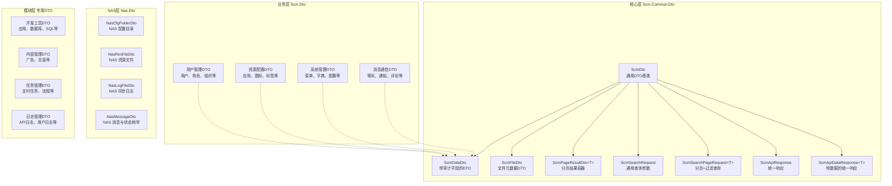
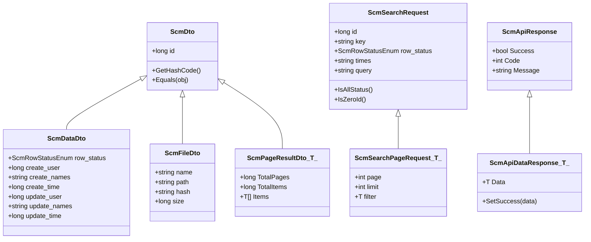
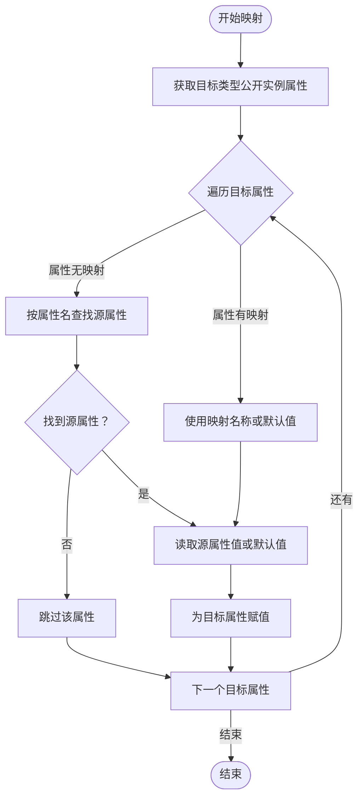

# 数据传输对象

<cite>
**本文引用的文件**
- [Nas.Dto.csproj](file://Nas.Dto/Nas.Dto.csproj)
- [Scm.Common.Dto.csproj](file://Scm.Common.Dto/Scm.Common.Dto.csproj)
- [Scm.Dto.csproj](file://Scm.Dto/Scm.Dto.csproj)
- [NasCfgFolderDto.cs](file://Nas.Dto/Cfg/NasCfgFolderDto.cs)
- [NasResFileDto.cs](file://Nas.Dto/Res/NasResFileDto.cs)
- [NasLogFileDto.cs](file://Nas.Dto/Log/NasLogFileDto.cs)
- [NasMessageDto.cs](file://Nas.Dto/Msg/NasMessageDto.cs)
- [ScmDto.cs](file://Scm.Common.Dto/Dto/ScmDto.cs)
- [ScmDataDto.cs](file://Scm.Common.Dto/Dto/ScmDataDto.cs)
- [ScmFileDto.cs](file://Scm.Common.Dto/Dto/ScmFileDto.cs)
- [ScmPageResultDto.cs](file://Scm.Common.Dto/Dto/ScmPageResultDto.cs)
- [ScmSearchRequest.cs](file://Scm.Common.Dto/ScmSearchRequest.cs)
- [ScmSearchPageRequest.cs](file://Scm.Common.Dto/ScmSearchPageRequest.cs)
- [ScmApiResponse.cs](file://Scm.Common.Dto/Response/ScmApiResponse.cs)
- [ScmApiDataResponse.cs](file://Scm.Common.Dto/Response/ScmApiDataResponse.cs)
- [ScmMappingAttribute.cs](file://Scm.Common/Attributes/ScmMappingAttribute.cs)
- [CommonUtils.cs](file://Scm.Common/Utils/CommonUtils.cs)
</cite>

## 更新摘要
**所做更改**
- 新增了完整的 DTO 架构设计文档，涵盖四个子系统的详细技术规范
- 补充了核心数据模型的完整定义和业务规则说明
- 增加了模块专用 DTO 的详细分类和应用场景
- 完善了 DTO 映射与验证机制的技术实现细节
- 扩展了数据传输对象的架构总览和依赖关系分析

## 目录
1. [简介](#简介)
2. [项目结构](#项目结构)
3. [核心组件](#核心组件)
4. [架构总览](#架构总览)
5. [详细组件分析](#详细组件分析)
6. [依赖分析](#依赖分析)
7. [性能考虑](#性能考虑)
8. [故障排查指南](#故障排查指南)
9. [结论](#结论)
10. [附录](#附录)

## 简介
本文件系统性阐述 Scm.Net 中"数据传输对象"（DTO）的架构设计与实现机制，覆盖数据传输模式、对象映射、数据验证、序列化与版本兼容、以及与实体对象的转换关系。重点解析以下 DTO 类型与用途：

- **核心 DTO 基础层**：位于 Scm.Common.Dto，提供通用 DTO 基类、分页容器、查询参数、响应封装等
- **业务 DTO 扩展层**：位于 Scm.Dto，扩展核心 DTO 并承载具体业务模型
- **NAS 专用 DTO 层**：位于 Nas.Dto，面向 NAS 场景的配置、资源、日志与消息 DTO
- **模块专用 DTO**：按功能模块划分的专门化数据传输对象

同时给出字段定义、数据类型、约束条件与业务规则，并提供映射、序列化、版本兼容与验证的最佳实践。

## 项目结构
Scm.Net 的 DTO 层由四层组成，每层都有明确的职责分工：

- **核心层**：Scm.Common.Dto 提供通用 DTO 基类和基础设施
- **业务层**：Scm.Dto 承载各业务模块的具体 DTO 实现
- **NAS 层**：Nas.Dto 专门处理 NAS 相关的数据传输需求
- **模块层**：按功能模块划分的专用 DTO，如用户管理、资源配置、工作流等



**图表来源**
- [ScmDto.cs:1-30](file://Scm.Common.Dto/Dto/ScmDto.cs#L1-L30)
- [ScmDataDto.cs:1-19](file://Scm.Common.Dto/Dto/ScmDataDto.cs#L1-L19)
- [ScmFileDto.cs:1-14](file://Scm.Common.Dto/Dto/ScmFileDto.cs#L1-L14)
- [ScmPageResultDto.cs:1-23](file://Scm.Common.Dto/Dto/ScmPageResultDto.cs#L1-L23)
- [ScmSearchRequest.cs:1-47](file://Scm.Common.Dto/ScmSearchRequest.cs#L1-L47)
- [ScmSearchPageRequest.cs:1-39](file://Scm.Common.Dto/ScmSearchPageRequest.cs#L1-L39)
- [ScmApiResponse.cs:1-21](file://Scm.Common.Dto/Response/ScmApiResponse.cs#L1-L21)
- [ScmApiDataResponse.cs:1-19](file://Scm.Common.Dto/Response/ScmApiDataResponse.cs#L1-L19)

**章节来源**
- [Nas.Dto.csproj:1-17](file://Nas.Dto/Nas.Dto.csproj#L1-L17)
- [Scm.Common.Dto.csproj:1-18](file://Scm.Common.Dto/Scm.Common.Dto.csproj#L1-L18)
- [Scm.Dto.csproj:1-24](file://Scm.Dto/Scm.Dto.csproj#L1-L24)

## 核心组件
本节聚焦核心 DTO 基类与通用容器，它们是所有业务 DTO 的基石，提供统一的标识、审计、分页、查询与响应规范。

### 基础 DTO 类型
- **ScmDto**：通用 DTO 基类，提供唯一标识 id，并重写相等性与哈希逻辑，便于集合去重与比较
- **ScmDataDto**：在 ScmDto 基础上增加行状态与审计字段（创建人、创建时间、更新人、更新时间），用于统一记录数据生命周期
- **ScmFileDto**：文件元数据 DTO，包含文件名、路径、哈希与大小，用于跨模块复用

### 查询与响应组件
- **ScmPageResultDto<T>**：分页结果容器，包含总页数、总记录数与数据项列表
- **ScmSearchRequest**：通用查询参数，支持 id、关键字、状态、时间区间、高级查询 JSON 等
- **ScmSearchPageRequest<T>**：在 ScmSearchRequest 基础上增加分页参数（当前页、每页条数）与泛型过滤器
- **ScmApiResponse**：统一响应封装，包含成功标志、返回码与消息
- **ScmApiDataResponse<T>**：带数据的统一响应封装，提供便捷设置成功状态的方法

**章节来源**
- [ScmDto.cs:1-30](file://Scm.Common.Dto/Dto/ScmDto.cs#L1-L30)
- [ScmDataDto.cs:1-19](file://Scm.Common.Dto/Dto/ScmDataDto.cs#L1-L19)
- [ScmFileDto.cs:1-14](file://Scm.Common.Dto/Dto/ScmFileDto.cs#L1-L14)
- [ScmPageResultDto.cs:1-23](file://Scm.Common.Dto/Dto/ScmPageResultDto.cs#L1-L23)
- [ScmSearchRequest.cs:1-47](file://Scm.Common.Dto/ScmSearchRequest.cs#L1-L47)
- [ScmSearchPageRequest.cs:1-39](file://Scm.Common.Dto/ScmSearchPageRequest.cs#L1-L39)
- [ScmApiResponse.cs:1-21](file://Scm.Common.Dto/Response/ScmApiResponse.cs#L1-L21)
- [ScmApiDataResponse.cs:1-19](file://Scm.Common.Dto/Response/ScmApiDataResponse.cs#L1-L19)

## 架构总览
DTO 架构遵循"分层解耦、职责单一"的原则，通过四层架构实现数据传输的标准化和模块化：

### 分层架构设计
- **基础层**：提供可复用的 DTO 基类与通用容器，确保跨模块一致性
- **业务层**：扩展核心 DTO，承载具体业务语义，避免直接暴露 DAO 实体
- **专用层**：针对特定场景定制 DTO，如 NAS、开发工具、内容管理等
- **映射层**：通过特性驱动的反射映射工具，实现 DTO 与实体之间的安全转换

### 数据流架构


**图表来源**
- [ScmDto.cs:1-30](file://Scm.Common.Dto/Dto/ScmDto.cs#L1-L30)
- [ScmDataDto.cs:1-19](file://Scm.Common.Dto/Dto/ScmDataDto.cs#L1-L19)
- [ScmFileDto.cs:1-14](file://Scm.Common.Dto/Dto/ScmFileDto.cs#L1-L14)
- [ScmPageResultDto.cs:1-23](file://Scm.Common.Dto/Dto/ScmPageResultDto.cs#L1-L23)
- [ScmSearchRequest.cs:1-47](file://Scm.Common.Dto/ScmSearchRequest.cs#L1-L47)
- [ScmSearchPageRequest.cs:1-39](file://Scm.Common.Dto/ScmSearchPageRequest.cs#L1-L39)
- [ScmApiResponse.cs:1-21](file://Scm.Common.Dto/Response/ScmApiResponse.cs#L1-L21)
- [ScmApiDataResponse.cs:1-19](file://Scm.Common.Dto/Response/ScmApiDataResponse.cs#L1-L19)

## 详细组件分析

### 核心数据模型

#### 用户管理 DTO
用户管理模块包含完整的用户生命周期管理数据模型：

- **UserDto**：用户基本信息 DTO，包含用户名、邮箱、手机号、状态等
- **UserDataDto**：用户扩展数据 DTO，包含个人资料、偏好设置、权限信息等
- **RoleDto**：角色定义 DTO，包含角色名称、描述、权限集合等
- **GroupDto**：用户组 DTO，支持多层级组织架构
- **OrganizeDto**：组织机构 DTO，支持树形结构的组织管理

#### 资源配置 DTO
资源配置模块涵盖系统资源的统一管理：

- **ScmResAppDto**：应用程序资源 DTO，包含应用信息、版本、图标等
- **ScmResIconDto**：图标资源 DTO，支持多种图标的统一管理
- **ScmResCatDto**：资源分类 DTO，支持多级分类体系
- **ScmResTagDto**：标签管理 DTO，支持资源的灵活标注
- **ScmResExtDto**：扩展属性 DTO，支持动态属性定义

#### 系统管理 DTO
系统管理模块提供企业级应用的基础支撑：

- **MenuDto**：菜单管理 DTO，支持多级菜单和权限控制
- **DicDto**：字典管理 DTO，支持数据字典的统一维护
- **ConfigDto**：配置管理 DTO，支持系统配置的集中管理
- **SysTableDto**：数据表管理 DTO，支持动态表结构定义
- **LangDto**：国际化 DTO，支持多语言内容管理

#### 消息通信 DTO
消息通信模块提供完整的即时通讯和通知功能：

- **MessageDto**：消息主体 DTO，支持文本、图片、文件等多种消息类型
- **ChatMsgHeaderDto**：聊天会话 DTO，管理对话的元数据
- **ChatMsgDetailDto**：聊天记录 DTO，存储详细的对话内容
- **NoticeDto**：通知公告 DTO，支持多种通知类型的模板化管理
- **CommentDto**：评论管理 DTO，支持内容的互动评论功能

### 模块专用 DTO

#### 开发工具 DTO
开发工具模块提供开发者友好的辅助功能：

- **ScmDevAppDto**：开发应用 DTO，管理开发环境的应用配置
- **ScmDevDbDto**：数据库连接 DTO，支持多数据库的连接管理
- **ScmDevSqlDto**：SQL 查询 DTO，提供在线 SQL 编辑和执行功能
- **ScmDevIconDto**：开发图标 DTO，支持开发工具的图标资源管理
- **ScmDevVerDto**：版本管理 DTO，支持应用版本的发布和回滚

#### 内容管理 DTO
内容管理模块提供网站和应用的内容支撑：

- **ScmCmsDto**：CMS 基础 DTO，支持内容的分类和标签管理
- **CalendarDto**：日历管理 DTO，支持工作日程和事件管理
- **NoteDto**：便签管理 DTO，支持个人笔记的创建和分享
- **VoteDto**：投票管理 DTO，支持在线投票和统计功能

#### 任务管理 DTO
任务管理模块提供工作流程和任务调度功能：

- **TaskDto**：任务管理 DTO，支持任务的创建、分配和跟踪
- **QuartzTaskDto**：定时任务 DTO，基于 Quartz 的任务调度管理
- **FlowDataDto**：流程数据 DTO，支持业务流程的数据流转
- **SysFlowInfoDto**：流程定义 DTO，管理业务流程的配置和版本

#### 日志管理 DTO
日志管理模块提供完整的系统监控和审计功能：

- **LogApiDto**：API 日志 DTO，记录接口调用的详细信息
- **LogUserDto**：用户日志 DTO，跟踪用户的操作行为
- **LogHbDto**：心跳日志 DTO，监控系统的运行状态
- **LogOAuthDto**：OAuth 日志 DTO，记录第三方认证的详细过程
- **LogOidcDto**：OIDC 日志 DTO，支持 OpenID Connect 的认证审计

### NAS 专用 DTO

#### NAS 配置目录 DTO：NasCfgFolderDto
用途：描述 NAS 配置目录的传输模型，常用于客户端与服务端之间传递配置信息。

字段与约束
- terminal_id：终端标识，必填
- name：名称，必填且长度限制（256字符）
- node：远端节点枚举
- path：远端路径，长度限制（2048字符）
- res_id：记录标识

验证规则
- 使用必填与字符串长度验证，确保关键字段完整性与长度合规

#### NAS 资源文件 DTO：NasResFileDto
用途：描述 NAS 资源文件的传输模型，包含文件类型、子类型、目录、名称、路径、摘要、大小、修改时间与版本。

字段与约束
- type：主类型枚举
- kind：子类型枚举  
- dir_id：目录标识，必填
- name：名称，必填且长度限制（256字符）
- path：路径，长度限制（2048字符）
- hash：文档摘要，长度限制（64字符）
- size：文档大小
- modify_time：更新时间
- ver：版本，必填

验证规则
- 必填字段与长度限制，保证文件元数据的完整性与一致性

#### NAS 同步日志 DTO：NasLogFileDto
用途：描述 NAS 同步过程中的日志传输模型，包含终端、驱动、记录、目录、文件信息、操作类型、同步方向与来源路径等。

字段与约束
- terminal_id：终端标识，必填
- folder_id：驱动标识，必填
- res_id：记录标识，必填
- dir_id：目录标识
- type：文件类型，必填
- kind：文档分类
- name：文件名称
- path：路径，必填且长度限制（2048字符）
- hash：文件摘要，长度限制（64字符）
- size：文件大小
- modify_time：更新时间
- opt：操作类型，必填
- dir：同步方向，必填
- src：来源文件，长度限制（2048字符）

验证规则
- 关键字段必填与长度限制，确保日志记录的可追溯性与完整性

#### NAS 消息与状态 DTO：NasMessageDto
用途：描述 NAS 消息类型、消息体、同步状态与文件夹变更事件等。

核心类型
- **NasMessageType**：系统通知、文件操作、同步状态、错误提示、警告
- **NasMessage**：消息体，包含消息 ID、类型、标题、内容、相关路径、时间戳与是否需要确认
- **NasSyncStatus**：同步状态（同步中、完成、失败、暂停）
- **NasSyncMessage**：同步消息，包含文件路径、状态、状态消息与时间戳
- **NasFolderChangeType**：文件夹变更类型（创建、修改、删除、重命名）
- **NasFolderMessage**：文件夹消息，包含文件夹路径、变更类型与时间戳

**章节来源**
- [NasCfgFolderDto.cs:1-40](file://Nas.Dto/Cfg/NasCfgFolderDto.cs#L1-L40)
- [NasResFileDto.cs:1-61](file://Nas.Dto/Res/NasResFileDto.cs#L1-L61)
- [NasLogFileDto.cs:1-92](file://Nas.Dto/Log/NasLogFileDto.cs#L1-L92)
- [NasMessageDto.cs:1-170](file://Nas.Dto/Msg/NasMessageDto.cs#L1-L170)

### 查询与分页 DTO
提供通用查询参数与分页能力，支持按 id、关键字、状态、时间区间与高级查询 JSON 进行筛选。

#### ScmSearchRequest
- id：单一查询标识符
- key：关键字搜索
- row_status：状态过滤
- times：时间区间查询
- query：高级查询 JSON

#### ScmSearchPageRequest<T>
在 ScmSearchRequest 基础上增加：
- page：当前页码
- limit：每页记录数
- filter：泛型过滤器，支持强类型查询

**章节来源**
- [ScmSearchRequest.cs:1-47](file://Scm.Common.Dto/ScmSearchRequest.cs#L1-L47)
- [ScmSearchPageRequest.cs:1-39](file://Scm.Common.Dto/ScmSearchPageRequest.cs#L1-L39)

### 响应 DTO
统一 API 响应格式，提升前端与客户端的一致性处理体验。

#### ScmApiResponse
- Success：操作成功标志
- Code：返回码
- Message：提示消息

#### ScmApiDataResponse<T>
- Data：返回数据
- SetSuccess(data)：便捷的成功响应设置方法

**章节来源**
- [ScmApiResponse.cs:1-21](file://Scm.Common.Dto/Response/ScmApiResponse.cs#L1-L21)
- [ScmApiDataResponse.cs:1-19](file://Scm.Common.Dto/Response/ScmApiDataResponse.cs#L1-L19)

### 对象映射机制与转换

#### ScmMappingAttribute 特性
通过 ScmMappingAttribute 标注属性，支持：
- 目标属性名映射
- 静态默认值注入
- 自定义映射规则

#### 反射映射实现
通过 CommonUtils.Adapt<T> 方法实现：
- 获取目标类型公开实例属性
- 遍历目标属性并查找源属性
- 支持映射名称或默认值
- 最终赋值到目标对象



**图表来源**
- [ScmMappingAttribute.cs:1-19](file://Scm.Common/Attributes/ScmMappingAttribute.cs#L1-L19)
- [CommonUtils.cs:46-113](file://Scm.Common/Utils/CommonUtils.cs#L46-L113)

**章节来源**
- [ScmMappingAttribute.cs:1-19](file://Scm.Common/Attributes/ScmMappingAttribute.cs#L1-L19)
- [CommonUtils.cs:46-113](file://Scm.Common/Utils/CommonUtils.cs#L46-L113)

### 数据验证规则与最佳实践

#### 验证规则设计
- **必填字段**：使用 [Required] 特性确保关键字段不为空
- **长度限制**：使用 [StringLength] 特性控制字符串长度
- **枚举验证**：确保枚举值在有效范围内
- **数值范围**：使用 [Range] 特性限制数值范围

#### 错误处理最佳实践
- **统一验证异常**：捕获验证异常并转换为标准响应格式
- **批量验证**：支持多个 DTO 的批量验证和错误收集
- **本地化支持**：验证消息支持多语言显示
- **自定义验证**：支持复杂的业务规则验证

## 依赖分析
DTO 层的依赖关系体现了清晰的分层架构：

### 核心依赖链
- **Nas.Dto** 依赖 Scm.Common.Dto 与 Scm.Common，提供 NAS 场景的 DTO 与通用枚举
- **Scm.Dto** 依赖 Scm.Common.Dto，扩展业务 DTO
- **Scm.Common.Dto** 依赖 Scm.Common，提供通用工具与枚举

### 模块间依赖
- **业务 DTO** 依赖核心 DTO 基类，确保统一的数据模型
- **专用 DTO** 依赖相应的业务模块，提供领域特定的数据传输
- **映射工具** 依赖特性系统，实现灵活的对象转换

```mermaid
graph LR
NAS_DTO["Nas.Dto"] --> SCM_COMMON_DTO["Scm.Common.Dto"]
NAS_DTO --> SCM_COMMON["Scm.Common"]
SCM_DTO["Scm.Dto"] --> SCM_COMMON_DTO
SCM_COMMON_DTO --> SCM_COMMON
subgraph "模块依赖"
UR_DTO["用户管理模块"] --> CORE_DTO["核心DTO"]
RES_DTO["资源配置模块"] --> CORE_DTO
SYS_DTO["系统管理模块"] --> CORE_DTO
MSG_DTO["消息通信模块"] --> CORE_DTO
END
```

**图表来源**
- [Nas.Dto.csproj:10-14](file://Nas.Dto/Nas.Dto.csproj#L10-L14)
- [Scm.Common.Dto.csproj:8-15](file://Scm.Common.Dto/Scm.Common.Dto.csproj#L8-L15)
- [Scm.Dto.csproj:10-12](file://Scm.Dto/Scm.Dto.csproj#L10-L12)

**章节来源**
- [Nas.Dto.csproj:1-17](file://Nas.Dto/Nas.Dto.csproj#L1-L17)
- [Scm.Common.Dto.csproj:1-18](file://Scm.Common.Dto/Scm.Common.Dto.csproj#L1-L18)
- [Scm.Dto.csproj:1-24](file://Scm.Dto/Scm.Dto.csproj#L1-L24)

## 性能考虑
DTO 架构在设计时充分考虑了性能优化：

### 映射性能优化
- **反射缓存**：缓存反射元数据，避免重复的类型扫描
- **批量映射**：支持批量对象转换，减少反射调用次数
- **深度克隆**：提供浅拷贝和深拷贝选项，根据需求选择合适的方式

### 序列化性能优化
- **选择合适的序列化库**：根据场景选择 System.Text.Json 或 Newtonsoft.Json
- **字段选择策略**：支持只序列化必要的字段，减少数据传输量
- **压缩策略**：对大数据量进行压缩传输

### 内存使用优化
- **对象池**：对频繁创建的 DTO 对象使用对象池
- **延迟加载**：支持大数据字段的延迟加载
- **分页处理**：默认启用分页，避免一次性加载大量数据

### 缓存策略
- **查询结果缓存**：对常用的查询结果进行缓存
- **配置缓存**：系统配置信息的缓存管理
- **枚举缓存**：常用枚举值的缓存优化

## 故障排查指南

### 常见问题与解决方案

#### 映射失败问题
**问题现象**：DTO 映射过程中出现属性丢失或值不正确
**解决步骤**：
1. 检查目标属性是否存在 ScmMappingAttribute 标注
2. 确认源对象是否包含对应的属性名称
3. 验证属性类型是否兼容
4. 检查默认值设置是否正确

#### 验证失败问题
**问题现象**：DTO 验证抛出异常或返回错误
**解决步骤**：
1. 核对必填字段是否设置
2. 检查字符串长度是否超过限制
3. 验证枚举值是否在有效范围内
4. 确认数值范围是否符合要求

#### 响应异常问题
**问题现象**：API 响应格式不符合预期
**解决步骤**：
1. 确认响应封装是否正确设置
2. 检查 Success 标志位是否正确
3. 验证 Code 和 Message 的格式
4. 确保 Data 字段的序列化正确

#### 性能问题
**问题现象**：大量 DTO 转换时性能下降
**解决步骤**：
1. 检查是否使用了反射缓存
2. 优化批量映射的实现
3. 考虑使用 AutoMapper 等专业映射框架
4. 实施适当的缓存策略

**章节来源**
- [ScmMappingAttribute.cs:1-19](file://Scm.Common/Attributes/ScmMappingAttribute.cs#L1-L19)
- [CommonUtils.cs:46-113](file://Scm.Common/Utils/CommonUtils.cs#L46-L113)
- [ScmApiResponse.cs:1-21](file://Scm.Common.Dto/Response/ScmApiResponse.cs#L1-L21)
- [ScmApiDataResponse.cs:1-19](file://Scm.Common.Dto/Response/ScmApiDataResponse.cs#L1-L19)

## 结论
Scm.Net 的 DTO 架构通过清晰的四层分层设计和统一的基类规范，实现了跨模块的数据传输一致性与可维护性。架构特点包括：

### 核心优势
- **分层解耦**：四层架构确保各模块职责明确，便于维护和扩展
- **统一规范**：基于 ScmDto 的统一数据模型，确保数据格式一致性
- **灵活映射**：特性驱动的反射映射机制，支持复杂的对象转换需求
- **模块化设计**：按功能模块划分的专用 DTO，满足不同业务场景需求

### 技术创新
- **多层依赖管理**：清晰的依赖关系设计，避免循环依赖
- **性能优化**：反射缓存、批量处理等性能优化策略
- **验证机制**：完善的验证规则和错误处理机制
- **扩展性设计**：支持新模块的快速集成和扩展

### 最佳实践建议
- 在生产环境中进一步优化映射与序列化性能
- 严格遵循版本兼容与验证规则
- 建立完善的 DTO 测试和验证机制
- 持续优化性能指标，确保系统稳定性

## 附录

### 字段命名规范
- **统一使用 PascalCase**：保持命名风格一致性
- **避免特殊字符**：不使用下划线和特殊符号
- **语义化命名**：字段名称应准确反映业务含义
- **长度控制**：合理控制字段名称长度，避免过长

### 枚举与状态管理
- **集中管理**：所有枚举定义集中在统一位置
- **命名规范**：枚举名称使用名词形式，值使用枚举名+值的形式
- **扩展性考虑**：新增枚举值需考虑向后兼容性
- **文档完善**：为每个枚举值添加详细的业务说明

### 数据验证最佳实践
- **层次化验证**：在 DTO 层进行基础验证，在服务层进行业务验证
- **错误聚合**：支持多个验证错误的聚合和统一处理
- **本地化支持**：验证消息支持多语言显示
- **性能优化**：避免重复的验证逻辑，实施验证缓存

### 版本兼容性策略
- **向后兼容**：新增字段标记为可选，不影响旧客户端
- **弃用策略**：删除字段保留但标记为已弃用
- **版本协商**：提供版本协商机制，支持渐进式升级
- **迁移指南**：为重大变更提供详细的迁移指南

### 性能监控指标
- **映射性能**：记录 DTO 映射的耗时和成功率
- **序列化性能**：监控序列化和反序列化的性能指标
- **内存使用**：跟踪 DTO 对象的内存占用情况
- **并发性能**：监控高并发场景下的性能表现