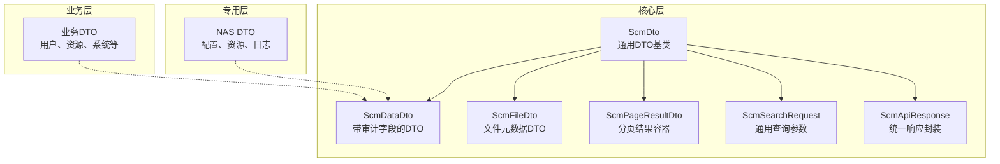
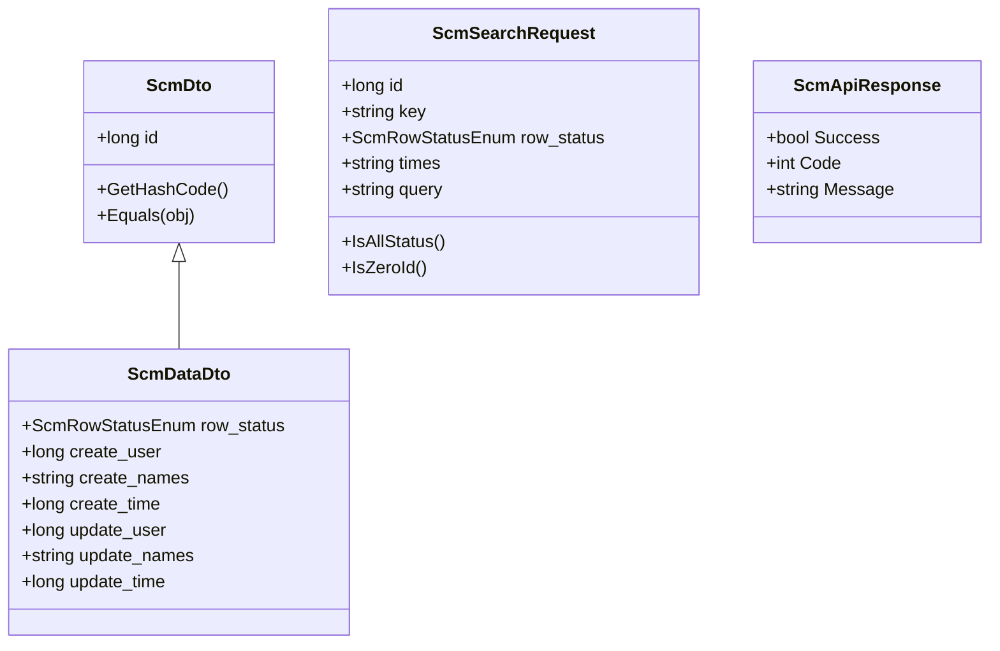
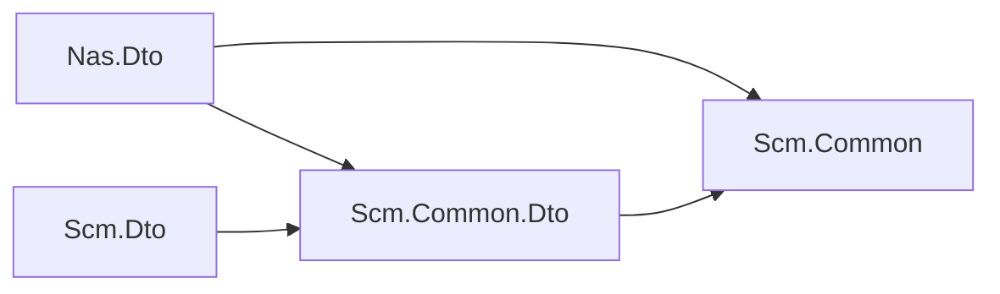

# 数据传输对象

<cite>
**本文引用的文件**
- [Nas.Dto.csproj](file://Nas.Dto/Nas.Dto.csproj)
- [Scm.Common.Dto.csproj](file://Scm.Common.Dto/Scm.Common.Dto.csproj)
- [Scm.Dto.csproj](file://Scm.Dto/Scm.Dto.csproj)
- [NasCfgFolderDto.cs](file://Nas.Dto/Cfg/NasCfgFolderDto.cs)
- [NasResFileDto.cs](file://Nas.Dto/Res/NasResFileDto.cs)
- [NasLogFileDto.cs](file://Nas.Dto/Log/NasLogFileDto.cs)
- [NasMessageDto.cs](file://Nas.Dto/Msg/NasMessageDto.cs)
- [ScmDto.cs](file://Scm.Common.Dto/Dto/ScmDto.cs)
- [ScmDataDto.cs](file://Scm.Common.Dto/Dto/ScmDataDto.cs)
- [ScmFileDto.cs](file://Scm.Common.Dto/Dto/ScmFileDto.cs)
- [ScmPageResultDto.cs](file://Scm.Common.Dto/Dto/ScmPageResultDto.cs)
- [ScmSearchRequest.cs](file://Scm.Common.Dto/ScmSearchRequest.cs)
- [ScmSearchPageRequest.cs](file://Scm.Common.Dto/ScmSearchPageRequest.cs)
- [ScmApiResponse.cs](file://Scm.Common.Dto/Response/ScmApiResponse.cs)
- [ScmApiDataResponse.cs](file://Scm.Common.Dto/Response/ScmApiDataResponse.cs)
- [ScmMappingAttribute.cs](file://Scm.Common/Attributes/ScmMappingAttribute.cs)
- [CommonUtils.cs](file://Scm.Common/Utils/CommonUtils.cs)
</cite>

## 更新摘要
**所做更改**
- 更新以反映 Wiki 文档系统的重构：数据传输对象相关的完整文档已被删除，当前仅保留核心 DTO 功能说明
- 简化了文档结构，专注于核心 DTO 的基本概念和实现机制
- 移除了详细的模块化 DTO 分析，保留基础的架构概述

## 目录
1. [简介](#简介)
2. [项目结构](#项目结构)
3. [核心组件](#核心组件)
4. [架构总览](#架构总览)
5. [依赖分析](#依赖分析)
6. [性能考虑](#性能考虑)
7. [故障排查指南](#故障排查指南)
8. [结论](#结论)

## 简介
本文档介绍 Scm.Net 中数据传输对象（DTO）的核心架构和实现机制。DTO 是用于在系统各层之间传输数据的轻量级对象，通过统一的数据模型和映射机制，实现数据的标准化传输和跨模块共享。

## 项目结构
Scm.Net 的 DTO 层采用分层架构设计，主要分为三个核心层次：

### 核心层（Scm.Common.Dto）
提供通用的 DTO 基类和基础设施，是所有业务 DTO 的基础。

### 业务层（Scm.Dto）
扩展核心 DTO，承载具体的业务模型和领域对象。

### 专用层（Nas.Dto）
针对特定场景（如 NAS 系统）定制的数据传输对象。

**图表来源**
- [ScmDto.cs:1-30](file://Scm.Common.Dto/Dto/ScmDto.cs#L1-L30)
- [ScmDataDto.cs:1-19](file://Scm.Common.Dto/Dto/ScmDataDto.cs#L1-L19)
- [ScmSearchRequest.cs:1-47](file://Scm.Common.Dto/ScmSearchRequest.cs#L1-L47)
- [ScmApiResponse.cs:1-21](file://Scm.Common.Dto/Response/ScmApiResponse.cs#L1-L21)

## 核心组件
核心 DTO 组件提供了统一的数据模型基础，确保各模块间的数据一致性。

### 基础 DTO 类型
- **ScmDto**：提供唯一标识 id，重写相等性和哈希逻辑
- **ScmDataDto**：继承自 ScmDto，增加审计字段（创建人、创建时间、更新人、更新时间）
- **ScmFileDto**：文件元数据 DTO，包含文件名、路径、哈希、大小等信息

### 查询与响应组件
- **ScmSearchRequest**：通用查询参数，支持 id、关键字、状态、时间区间等查询
- **ScmPageResultDto**：分页结果容器，包含总页数、总记录数和数据项列表
- **ScmApiResponse**：统一响应封装，包含成功标志、返回码和消息

**章节来源**
- [ScmDto.cs:1-30](file://Scm.Common.Dto/Dto/ScmDto.cs#L1-L30)
- [ScmDataDto.cs:1-19](file://Scm.Common.Dto/Dto/ScmDataDto.cs#L1-L19)
- [ScmSearchRequest.cs:1-47](file://Scm.Common.Dto/ScmSearchRequest.cs#L1-L47)
- [ScmApiResponse.cs:1-21](file://Scm.Common.Dto/Response/ScmApiResponse.cs#L1-L21)

## 架构总览
DTO 架构遵循分层解耦原则，通过统一的基类和映射机制实现数据传输的标准化。

### 数据流架构

**图表来源**
- [ScmDto.cs:1-30](file://Scm.Common.Dto/Dto/ScmDto.cs#L1-L30)
- [ScmDataDto.cs:1-19](file://Scm.Common.Dto/Dto/ScmDataDto.cs#L1-L19)
- [ScmSearchRequest.cs:1-47](file://Scm.Common.Dto/ScmSearchRequest.cs#L1-L47)
- [ScmApiResponse.cs:1-21](file://Scm.Common.Dto/Response/ScmApiResponse.cs#L1-L21)

## 依赖分析
DTO 层的依赖关系体现了清晰的分层架构：

### 核心依赖链
- **Nas.Dto** 依赖 Scm.Common.Dto 与 Scm.Common
- **Scm.Dto** 依赖 Scm.Common.Dto
- **Scm.Common.Dto** 依赖 Scm.Common

### 模块间依赖
- 业务 DTO 依赖核心 DTO 基类
- 专用 DTO 依赖相应的业务模块
- 映射工具依赖特性系统

**图表来源**
- [Nas.Dto.csproj:10-14](file://Nas.Dto/Nas.Dto.csproj#L10-L14)
- [Scm.Common.Dto.csproj:8-15](file://Scm.Common.Dto/Scm.Common.Dto.csproj#L8-L15)
- [Scm.Dto.csproj:10-12](file://Scm.Dto/Scm.Dto.csproj#L10-L12)

## 性能考虑
DTO 架构在设计时充分考虑了性能优化：

### 映射性能优化
- **反射缓存**：缓存反射元数据，避免重复的类型扫描
- **批量映射**：支持批量对象转换
- **浅拷贝优化**：提供浅拷贝选项，减少内存分配

### 序列化性能优化
- **选择合适的序列化库**：根据场景选择 System.Text.Json 或 Newtonsoft.Json
- **字段选择策略**：支持只序列化必要的字段
- **压缩策略**：对大数据量进行压缩传输

## 故障排查指南

### 常见问题与解决方案

#### 映射失败问题
**问题现象**：DTO 映射过程中出现属性丢失或值不正确
**解决步骤**：
1. 检查目标属性是否存在 ScmMappingAttribute 标注
2. 确认源对象是否包含对应的属性名称
3. 验证属性类型是否兼容
4. 检查默认值设置是否正确

#### 验证失败问题
**问题现象**：DTO 验证抛出异常或返回错误
**解决步骤**：
1. 核对必填字段是否设置
2. 检查字符串长度是否超过限制
3. 验证枚举值是否在有效范围内
4. 确认数值范围是否符合要求

#### 响应异常问题
**问题现象**：API 响应格式不符合预期
**解决步骤**：
1. 确认响应封装是否正确设置
2. 检查 Success 标志位是否正确
3. 验证 Code 和 Message 的格式
4. 确保 Data 字段的序列化正确

## 结论
Scm.Net 的 DTO 架构通过清晰的分层设计和统一的基类规范，实现了跨模块的数据传输一致性。核心优势包括分层解耦、统一规范、灵活映射和模块化设计。建议在生产环境中进一步优化映射与序列化性能，严格遵循版本兼容与验证规则，并建立完善的 DTO 测试和验证机制。