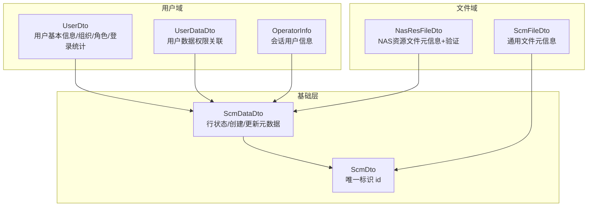
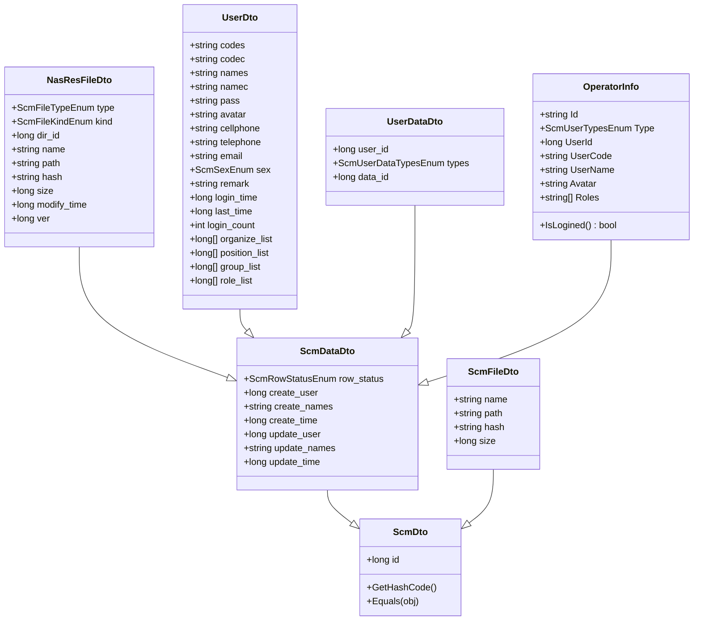
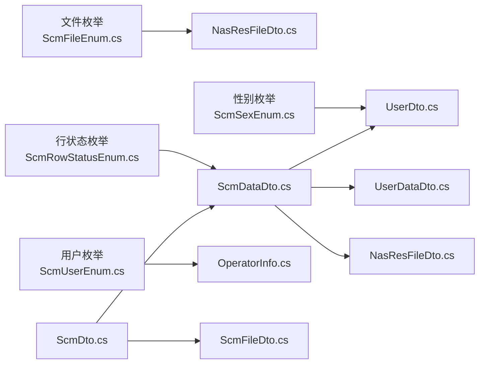

# 核心数据模型

<cite>
**本文引用的文件**
- [ScmDto.cs](file://Scm.Common.Dto/Dto/ScmDto.cs)
- [ScmDataDto.cs](file://Scm.Common.Dto/Dto/ScmDataDto.cs)
- [ScmFileDto.cs](file://Scm.Common.Dto/Dto/ScmFileDto.cs)
- [OperatorInfo.cs](file://Scm.Dto/Operator/OperatorInfo.cs)
- [UserDto.cs](file://Scm.Dto/Ur/UserDto.cs)
- [UserDataDto.cs](file://Scm.Dto/Ur/UserDataDto.cs)
- [NasResFileDto.cs](file://Nas.Dto/Res/NasResFileDto.cs)
- [ScmUserEnum.cs](file://Scm.Common/Enums/ScmUserEnum.cs)
- [ScmFileEnum.cs](file://Scm.Common/Enums/ScmFileEnum.cs)
- [ScmSexEnum.cs](file://Scm.Common/Enums/ScmSexEnum.cs)
- [ScmRowStatusEnum.cs](file://Scm.Common/Enums/ScmRowStatusEnum.cs)
</cite>

## 目录
1. [简介](#简介)
2. [项目结构](#项目结构)
3. [核心组件](#核心组件)
4. [架构总览](#架构总览)
5. [详细组件分析](#详细组件分析)
6. [依赖关系分析](#依赖关系分析)
7. [性能考量](#性能考量)
8. [故障排查指南](#故障排查指南)
9. [结论](#结论)
10. [附录](#附录)

## 简介
本文件聚焦 Scm.Net 的核心数据模型，系统性梳理并解释以下关键 DTO 的定义、字段、约束与业务含义：
- 用户信息相关：UserDto、UserDataDto
- 文件信息相关：ScmFileDto、NasResFileDto
- 操作员信息相关：OperatorInfo

同时给出数据模型之间的关系图、依赖关系、数据验证与业务规则，并提供在实际业务场景中的使用示例与最佳实践建议。

## 项目结构
围绕核心 DTO 的主要文件分布如下：
- 基类层：ScmDto、ScmDataDto
- 文件类：ScmFileDto、NasResFileDto
- 用户类：UserDto、UserDataDto
- 操作员类：OperatorInfo
- 枚举层：用户类型、文件类型、性别、行状态等

图表来源
- [ScmDto.cs:1-30](file://Scm.Common.Dto/Dto/ScmDto.cs#L1-L30)
- [ScmDataDto.cs:1-19](file://Scm.Common.Dto/Dto/ScmDataDto.cs#L1-L19)
- [UserDto.cs:1-103](file://Scm.Dto/Ur/UserDto.cs#L1-L103)
- [UserDataDto.cs:1-22](file://Scm.Dto/Ur/UserDataDto.cs#L1-L22)
- [OperatorInfo.cs:1-52](file://Scm.Dto/Operator/OperatorInfo.cs#L1-L52)
- [ScmFileDto.cs:1-14](file://Scm.Common.Dto/Dto/ScmFileDto.cs#L1-L14)
- [NasResFileDto.cs:1-61](file://Nas.Dto/Res/NasResFileDto.cs#L1-L61)

章节来源
- [ScmDto.cs:1-30](file://Scm.Common.Dto/Dto/ScmDto.cs#L1-L30)
- [ScmDataDto.cs:1-19](file://Scm.Common.Dto/Dto/ScmDataDto.cs#L1-L19)
- [ScmFileDto.cs:1-14](file://Scm.Common.Dto/Dto/ScmFileDto.cs#L1-L14)
- [OperatorInfo.cs:1-52](file://Scm.Dto/Operator/OperatorInfo.cs#L1-L52)
- [UserDto.cs:1-103](file://Scm.Dto/Ur/UserDto.cs#L1-L103)
- [UserDataDto.cs:1-22](file://Scm.Dto/Ur/UserDataDto.cs#L1-L22)
- [NasResFileDto.cs:1-61](file://Nas.Dto/Res/NasResFileDto.cs#L1-L61)

## 核心组件
本节对每个核心 DTO 进行字段定义、数据类型、约束条件与业务含义的说明。

- ScmDto
  - 唯一标识 id：long 类型，作为相等性与哈希比较的基础
  - 作用：所有 DTO 的基类，统一标识与相等性判断
  - 参考路径：[ScmDto.cs:1-30](file://Scm.Common.Dto/Dto/ScmDto.cs#L1-L30)

- ScmDataDto
  - 行状态 row_status：ScmRowStatusEnum，记录启用/禁用/正常等状态
  - 创建者 create_user、create_names、create_time：记录创建人与时间
  - 更新者 update_user、update_names、update_time：记录更新人与时间
  - 作用：为业务实体提供通用的审计元数据
  - 参考路径：[ScmDataDto.cs:1-19](file://Scm.Common.Dto/Dto/ScmDataDto.cs#L1-L19)，[ScmRowStatusEnum.cs:1-28](file://Scm.Common/Enums/ScmRowStatusEnum.cs#L1-L28)

- ScmFileDto
  - 字段：name、path、hash、size
  - 数据类型：字符串/长整型
  - 作用：通用文件元信息载体，用于上传/下载/列表等场景
  - 参考路径：[ScmFileDto.cs:1-14](file://Scm.Common.Dto/Dto/ScmFileDto.cs#L1-L14)

- NasResFileDto
  - 字段：type（ScmFileTypeEnum）、kind（ScmFileKindEnum）、dir_id、name、path、hash、size、modify_time、ver
  - 约束：name/path/hash/ver 使用字符串长度或必填校验；dir_id 必填
  - 作用：NAS 资源文件的强约束模型，适用于目录树与版本控制
  - 参考路径：[NasResFileDto.cs:1-61](file://Nas.Dto/Res/NasResFileDto.cs#L1-L61)，[ScmFileEnum.cs:1-79](file://Scm.Common/Enums/ScmFileEnum.cs#L1-L79)

- UserDto
  - 关键字段：codes/codec/names/namec/pass/avatar/cellphone/telephone/email/sex/remark/login_time/last_time/login_count/organize_list/position_list/group_list/role_list
  - 数据类型：字符串/长整型/整型/枚举/列表
  - 作用：用户主数据，承载登录凭据、联系信息、组织/角色/岗位等多维信息
  - 参考路径：[UserDto.cs:1-103](file://Scm.Dto/Ur/UserDto.cs#L1-L103)，[ScmSexEnum.cs:1-19](file://Scm.Common/Enums/ScmSexEnum.cs#L1-L19)，[ScmUserEnum.cs:1-97](file://Scm.Common/Enums/ScmUserEnum.cs#L1-L97)

- UserDataDto
  - 字段：user_id、types（ScmUserDataTypesEnum）、data_id
  - 作用：用户数据权限/范围的关联模型，用于限定数据可见性
  - 参考路径：[UserDataDto.cs:1-22](file://Scm.Dto/Ur/UserDataDto.cs#L1-L22)，[ScmUserEnum.cs:46-61](file://Scm.Common/Enums/ScmUserEnum.cs#L46-L61)

- OperatorInfo
  - 字段：Id、Type（ScmUserTypesEnum）、UserId、UserCode、UserName、Avatar、Roles、IsLogined()
  - 作用：会话态用户信息，用于登录态校验与前端展示
  - 参考路径：[OperatorInfo.cs:1-52](file://Scm.Dto/Operator/OperatorInfo.cs#L1-L52)，[ScmUserEnum.cs:8-11](file://Scm.Common/Enums/ScmUserEnum.cs#L8-L11)

章节来源
- [ScmDto.cs:1-30](file://Scm.Common.Dto/Dto/ScmDto.cs#L1-L30)
- [ScmDataDto.cs:1-19](file://Scm.Common.Dto/Dto/ScmDataDto.cs#L1-L19)
- [ScmFileDto.cs:1-14](file://Scm.Common.Dto/Dto/ScmFileDto.cs#L1-L14)
- [NasResFileDto.cs:1-61](file://Nas.Dto/Res/NasResFileDto.cs#L1-L61)
- [UserDto.cs:1-103](file://Scm.Dto/Ur/UserDto.cs#L1-L103)
- [UserDataDto.cs:1-22](file://Scm.Dto/Ur/UserDataDto.cs#L1-L22)
- [OperatorInfo.cs:1-52](file://Scm.Dto/Operator/OperatorInfo.cs#L1-L52)
- [ScmUserEnum.cs:1-97](file://Scm.Common/Enums/ScmUserEnum.cs#L1-L97)
- [ScmFileEnum.cs:1-79](file://Scm.Common/Enums/ScmFileEnum.cs#L1-L79)
- [ScmSexEnum.cs:1-19](file://Scm.Common/Enums/ScmSexEnum.cs#L1-L19)
- [ScmRowStatusEnum.cs:1-28](file://Scm.Common/Enums/ScmRowStatusEnum.cs#L1-L28)

## 架构总览
核心 DTO 的继承与组合关系如下：

图表来源
- [ScmDto.cs:1-30](file://Scm.Common.Dto/Dto/ScmDto.cs#L1-L30)
- [ScmDataDto.cs:1-19](file://Scm.Common.Dto/Dto/ScmDataDto.cs#L1-L19)
- [ScmFileDto.cs:1-14](file://Scm.Common.Dto/Dto/ScmFileDto.cs#L1-L14)
- [NasResFileDto.cs:1-61](file://Nas.Dto/Res/NasResFileDto.cs#L1-L61)
- [UserDto.cs:1-103](file://Scm.Dto/Ur/UserDto.cs#L1-L103)
- [UserDataDto.cs:1-22](file://Scm.Dto/Ur/UserDataDto.cs#L1-L22)
- [OperatorInfo.cs:1-52](file://Scm.Dto/Operator/OperatorInfo.cs#L1-L52)

## 详细组件分析

### ScmDto 与 ScmDataDto：统一标识与审计元数据
- ScmDto 提供 id 作为唯一标识，并重写相等性与哈希逻辑，便于集合去重与键值匹配
- ScmDataDto 在此基础上扩展行状态与创建/更新元数据，形成“带审计”的数据基类
- 适用场景：所有需要统一标识与审计信息的 DTO

章节来源
- [ScmDto.cs:1-30](file://Scm.Common.Dto/Dto/ScmDto.cs#L1-L30)
- [ScmDataDto.cs:1-19](file://Scm.Common.Dto/Dto/ScmDataDto.cs#L1-L19)

### ScmFileDto：通用文件元信息
- 字段覆盖文件名、路径、哈希、大小
- 适合跨模块的文件描述与传输，无需引入业务域约束
- 与 ScmDataDto 无直接继承关系，但可按需组合

章节来源
- [ScmFileDto.cs:1-14](file://Scm.Common.Dto/Dto/ScmFileDto.cs#L1-L14)

### NasResFileDto：NAS 资源文件模型
- 强约束字段：dir_id（必填）、name（必填，长度限制）、path（长度限制）、hash（长度限制）、ver（必填）
- 语义字段：type/kind 描述文件类型与子类型；size/modify_time/ver 支持版本化与变更追踪
- 与 ScmDataDto 继承，具备审计元数据能力

章节来源
- [NasResFileDto.cs:1-61](file://Nas.Dto/Res/NasResFileDto.cs#L1-L61)
- [ScmFileEnum.cs:1-79](file://Scm.Common/Enums/ScmFileEnum.cs#L1-L79)

### UserDto：用户主数据
- 登录凭据：names（登录账号）、pass（登录密码）
- 基本信息：namec（展示姓名）、avatar（头像）、cellphone/telephone/email、sex
- 行为统计：login_time/last_time/login_count
- 组织与权限：organize_list/position_list/group_list/role_list
- 常量：SYS_ID/ROBOT_ID 用于系统保留与机器人账户标识

章节来源
- [UserDto.cs:1-103](file://Scm.Dto/Ur/UserDto.cs#L1-L103)
- [ScmSexEnum.cs:1-19](file://Scm.Common/Enums/ScmSexEnum.cs#L1-L19)
- [ScmUserEnum.cs:1-97](file://Scm.Common/Enums/ScmUserEnum.cs#L1-L97)

### UserDataDto：用户数据权限关联
- user_id：用户标识
- types：数据类型（机构/用户/部门/岗位/群组/其它）
- data_id：具体数据项标识
- 用于限定用户可见/可操作的数据范围

章节来源
- [UserDataDto.cs:1-22](file://Scm.Dto/Ur/UserDataDto.cs#L1-L22)
- [ScmUserEnum.cs:46-61](file://Scm.Common/Enums/ScmUserEnum.cs#L46-L61)

### OperatorInfo：会话用户信息
- 会话标识：Id
- 用户标识：UserId/UserCode/UserName
- 展示信息：Avatar、Roles
- 辅助方法：IsLogined() 基于 UserId 判断是否已登录
- 与 ScmDataDto 继承，具备审计元数据能力

章节来源
- [OperatorInfo.cs:1-52](file://Scm.Dto/Operator/OperatorInfo.cs#L1-L52)
- [ScmUserEnum.cs:8-11](file://Scm.Common/Enums/ScmUserEnum.cs#L8-L11)

## 依赖关系分析
- 继承关系
  - ScmDataDto 继承 ScmDto
  - NasResFileDto、UserDto、UserDataDto、OperatorInfo 继承 ScmDataDto
  - ScmFileDto 继承 ScmDto
- 枚举依赖
  - NasResFileDto 使用 ScmFileTypeEnum、ScmFileKindEnum
  - UserDto 使用 ScmSexEnum
  - ScmDataDto 使用 ScmRowStatusEnum
  - OperatorInfo 使用 ScmUserTypesEnum

图表来源
- [ScmFileEnum.cs:1-79](file://Scm.Common/Enums/ScmFileEnum.cs#L1-L79)
- [ScmSexEnum.cs:1-19](file://Scm.Common/Enums/ScmSexEnum.cs#L1-L19)
- [ScmRowStatusEnum.cs:1-28](file://Scm.Common/Enums/ScmRowStatusEnum.cs#L1-L28)
- [ScmUserEnum.cs:1-97](file://Scm.Common/Enums/ScmUserEnum.cs#L1-L97)
- [ScmDataDto.cs:1-19](file://Scm.Common.Dto/Dto/ScmDataDto.cs#L1-L19)
- [UserDto.cs:1-103](file://Scm.Dto/Ur/UserDto.cs#L1-L103)
- [UserDataDto.cs:1-22](file://Scm.Dto/Ur/UserDataDto.cs#L1-L22)
- [NasResFileDto.cs:1-61](file://Nas.Dto/Res/NasResFileDto.cs#L1-L61)
- [ScmDto.cs:1-30](file://Scm.Common.Dto/Dto/ScmDto.cs#L1-L30)
- [ScmFileDto.cs:1-14](file://Scm.Common.Dto/Dto/ScmFileDto.cs#L1-L14)
- [OperatorInfo.cs:1-52](file://Scm.Dto/Operator/OperatorInfo.cs#L1-L52)

## 性能考量
- 标识与相等性
  - ScmDto 对 id 的哈希与相等性优化，有利于在大数据量集合中进行快速定位与去重
- 审计字段
  - ScmDataDto 的创建/更新元数据在批量操作时应避免冗余写入，建议仅在必要时更新
- 文件元信息
  - ScmFileDto 与 NasResFileDto 的字段尽量按需传输，避免不必要的网络开销
- 枚举与字符串长度
  - 使用枚举替代字符串常量，减少存储与传输成本；合理设置字符串长度上限，降低索引与查询压力

## 故障排查指南
- 常见验证问题
  - NasResFileDto.name/path/hash/ver 缺失或超长：检查客户端传参与服务端验证器配置
  - NasResFileDto.dir_id 为空：确认目录选择与权限
- 登录态问题
  - OperatorInfo.IsLogined() 返回 false：检查 UserId 是否为默认值
- 数据一致性
  - ScmDataDto.row_status 与业务状态不一致：核对状态转换流程与持久化策略

章节来源
- [NasResFileDto.cs:22-58](file://Nas.Dto/Res/NasResFileDto.cs#L22-L58)
- [OperatorInfo.cs:46-49](file://Scm.Dto/Operator/OperatorInfo.cs#L46-L49)

## 结论
本文系统梳理了 Scm.Net 的核心数据模型，明确了各 DTO 的职责边界、字段定义、约束与依赖关系。通过统一的基类与枚举体系，实现了跨模块的一致性与可维护性。在实际应用中，建议遵循最小暴露原则与按需传输原则，结合验证与业务规则，确保数据质量与性能表现。

## 附录
- 使用示例与最佳实践
  - 用户登录：使用 UserDto 传递登录账号与密码，OperatorInfo 保存会话态用户信息
  - 文件上传：使用 ScmFileDto 或 NasResFileDto 描述文件元信息，结合 dir_id 与 ver 管理版本
  - 数据权限：通过 UserDataDto 的 types 与 data_id 控制用户可见数据范围
  - 审计追踪：利用 ScmDataDto 的创建/更新元数据，建立完整的变更轨迹