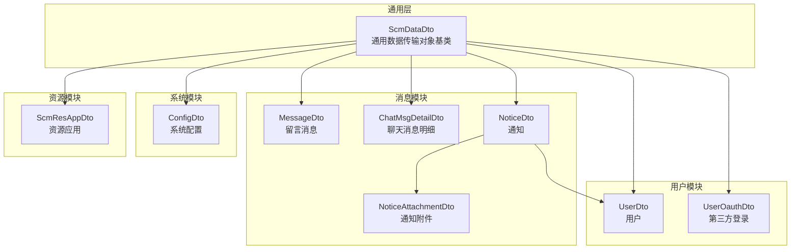
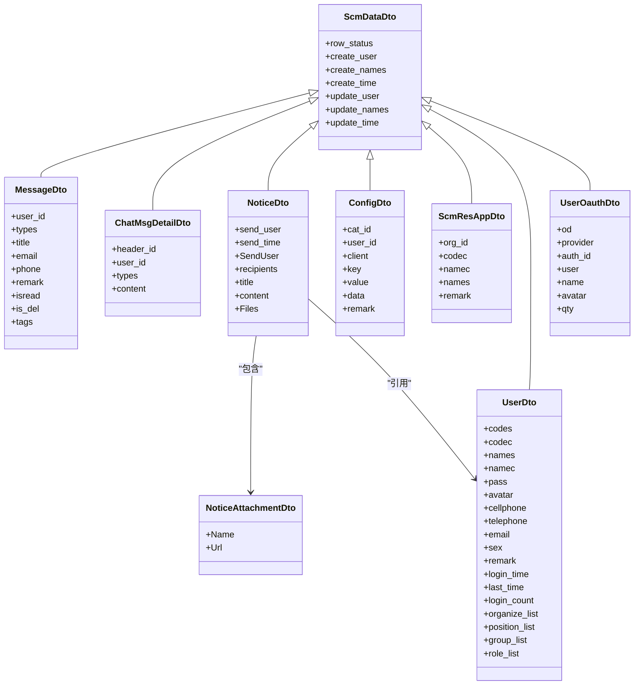
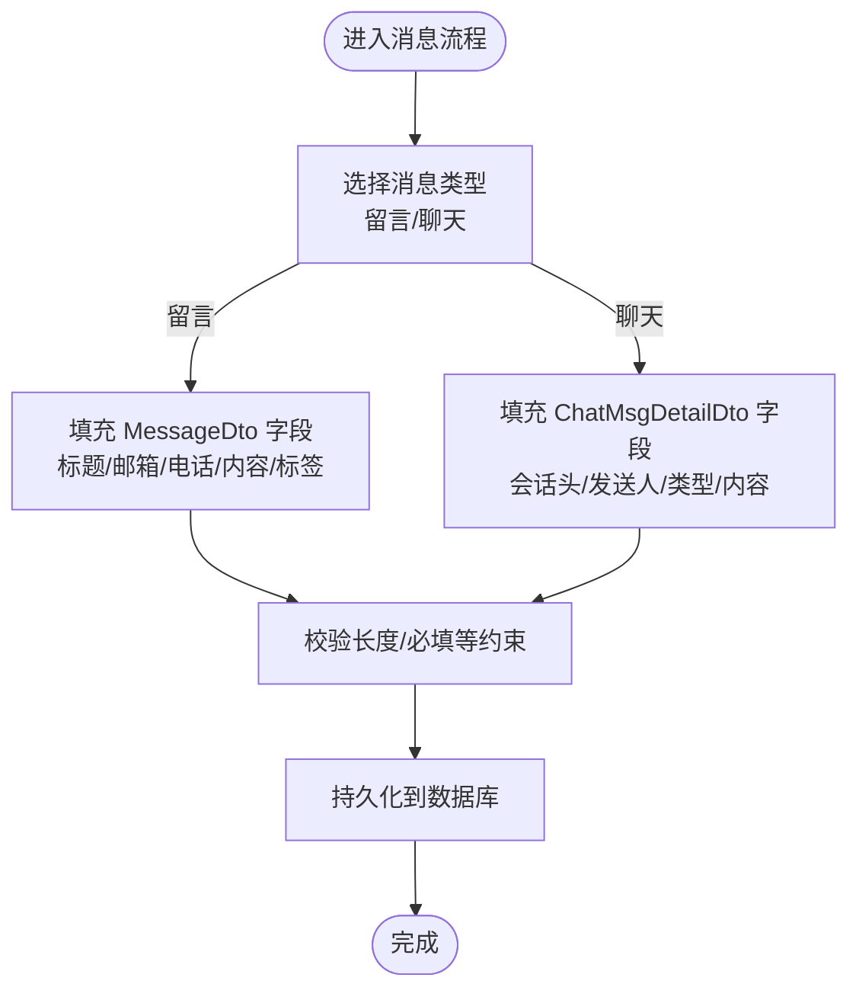
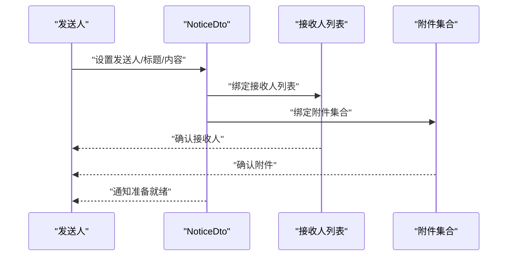
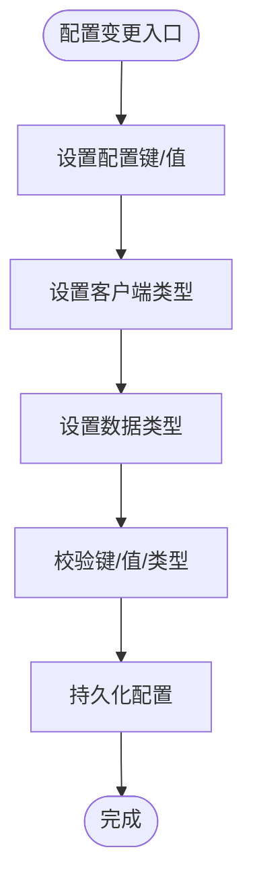
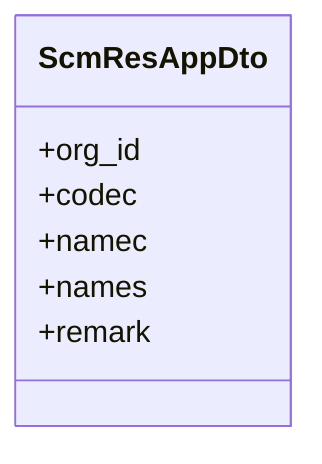
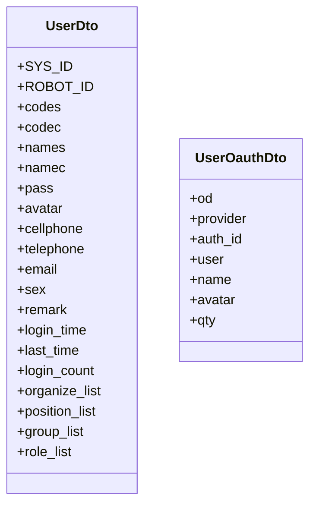
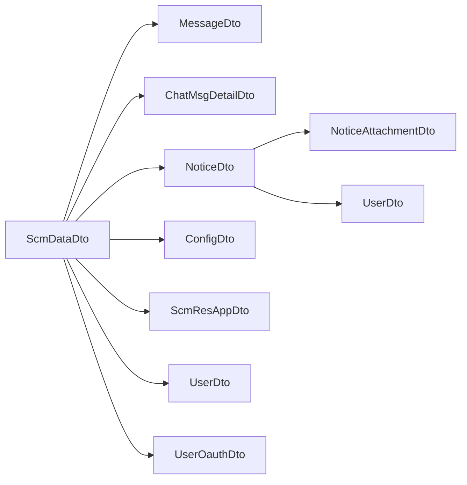

# 模块专用 DTO

<cite>
**本文引用的文件**
- [Scm.Dto/Msg/Message/MessageDto.cs](file://Scm.Dto/Msg/Message/MessageDto.cs)
- [Scm.Dto/Msg/Chat/ChatMsgDetailDto.cs](file://Scm.Dto/Msg/Chat/ChatMsgDetailDto.cs)
- [Scm.Dto/Msg/Notice/NoticeDto.cs](file://Scm.Dto/Msg/Notice/NoticeDto.cs)
- [Scm.Dto/Sys/Config/ConfigDto.cs](file://Scm.Dto/Sys/Config/ConfigDto.cs)
- [Scm.Dto/Res/App/ScmResAppDto.cs](file://Scm.Dto/Res/App/ScmResAppDto.cs)
- [Scm.Dto/Ur/UserOauthDto.cs](file://Scm.Dto/Ur/UserOauthDto.cs)
- [Scm.Dto/Ur/UserDto.cs](file://Scm.Dto/Ur/UserDto.cs)
- [Scm.Dto/Msg/Notice/NoticeAttachmentDto.cs](file://Scm.Dto/Msg/Notice/NoticeAttachmentDto.cs)
- [Scm.Common.Dto/Dto/ScmDataDto.cs](file://Scm.Common.Dto/Dto/ScmDataDto.cs)
</cite>

## 目录
1. [简介](#简介)
2. [项目结构](#项目结构)
3. [核心组件](#核心组件)
4. [架构总览](#架构总览)
5. [详细组件分析](#详细组件分析)
6. [依赖分析](#依赖分析)
7. [性能考虑](#性能考虑)
8. [故障排查指南](#故障排查指南)
9. [结论](#结论)
10. [附录](#附录)

## 简介
本文件聚焦 Scm.Net 中“模块专用 DTO”的设计与使用，围绕消息、通知、系统配置、资源应用、用户认证等业务域的 DTO 类型进行系统化梳理。文档从职责边界、字段语义、业务场景、模块间交互、扩展机制与性能优化等方面展开，帮助开发者在不直接阅读源码的情况下快速理解各模块 DTO 的用途与最佳实践。

## 项目结构
Scm.Net 将通用 DTO 基类与各业务模块 DTO 分层组织：
- 通用基类：ScmDataDto 提供统一的行状态、创建/更新元数据等通用属性，所有业务 DTO 均继承该基类以保证一致的生命周期与审计信息。
- 业务 DTO：按模块划分目录，如消息模块（Message、Chat）、通知模块（Notice）、系统配置（Config）、资源应用（Res.App）、用户认证（Ur.UserOauth）等。

图表来源
- [Scm.Common.Dto/Dto/ScmDataDto.cs:1-19](file://Scm.Common.Dto/Dto/ScmDataDto.cs#L1-L19)
- [Scm.Dto/Msg/Message/MessageDto.cs:1-60](file://Scm.Dto/Msg/Message/MessageDto.cs#L1-L60)
- [Scm.Dto/Msg/Chat/ChatMsgDetailDto.cs:1-33](file://Scm.Dto/Msg/Chat/ChatMsgDetailDto.cs#L1-L33)
- [Scm.Dto/Msg/Notice/NoticeDto.cs:1-48](file://Scm.Dto/Msg/Notice/NoticeDto.cs#L1-L48)
- [Scm.Dto/Msg/Notice/NoticeAttachmentDto.cs:1-19](file://Scm.Dto/Msg/Notice/NoticeAttachmentDto.cs#L1-L19)
- [Scm.Dto/Sys/Config/ConfigDto.cs:1-41](file://Scm.Dto/Sys/Config/ConfigDto.cs#L1-L41)
- [Scm.Dto/Res/App/ScmResAppDto.cs:1-40](file://Scm.Dto/Res/App/ScmResAppDto.cs#L1-L40)
- [Scm.Dto/Ur/UserDto.cs:1-103](file://Scm.Dto/Ur/UserDto.cs#L1-L103)
- [Scm.Dto/Ur/UserOauthDto.cs:1-45](file://Scm.Dto/Ur/UserOauthDto.cs#L1-L45)

章节来源
- [Scm.Common.Dto/Dto/ScmDataDto.cs:1-19](file://Scm.Common.Dto/Dto/ScmDataDto.cs#L1-L19)

## 核心组件
- ScmDataDto：所有业务 DTO 的基类，统一提供行状态、创建者/时间、更新者/时间等字段，便于跨模块统一审计与状态管理。
- 各模块 DTO：在继承 ScmDataDto 的基础上，补充各自业务所需的字段与约束，确保数据契约清晰且可演进。

章节来源
- [Scm.Common.Dto/Dto/ScmDataDto.cs:1-19](file://Scm.Common.Dto/Dto/ScmDataDto.cs#L1-L19)

## 架构总览
模块专用 DTO 的设计遵循“分而治之”的原则：每个模块拥有独立的 DTO 家族，既保证了领域内的一致性，又避免了跨模块的耦合。通用基类 ScmDataDto 作为横切关注点的承载者，贯穿所有业务 DTO。

图表来源
- [Scm.Common.Dto/Dto/ScmDataDto.cs:1-19](file://Scm.Common.Dto/Dto/ScmDataDto.cs#L1-L19)
- [Scm.Dto/Msg/Message/MessageDto.cs:1-60](file://Scm.Dto/Msg/Message/MessageDto.cs#L1-L60)
- [Scm.Dto/Msg/Chat/ChatMsgDetailDto.cs:1-33](file://Scm.Dto/Msg/Chat/ChatMsgDetailDto.cs#L1-L33)
- [Scm.Dto/Msg/Notice/NoticeDto.cs:1-48](file://Scm.Dto/Msg/Notice/NoticeDto.cs#L1-L48)
- [Scm.Dto/Msg/Notice/NoticeAttachmentDto.cs:1-19](file://Scm.Dto/Msg/Notice/NoticeAttachmentDto.cs#L1-L19)
- [Scm.Dto/Sys/Config/ConfigDto.cs:1-41](file://Scm.Dto/Sys/Config/ConfigDto.cs#L1-L41)
- [Scm.Dto/Res/App/ScmResAppDto.cs:1-40](file://Scm.Dto/Res/App/ScmResAppDto.cs#L1-L40)
- [Scm.Dto/Ur/UserDto.cs:1-103](file://Scm.Dto/Ur/UserDto.cs#L1-L103)
- [Scm.Dto/Ur/UserOauthDto.cs:1-45](file://Scm.Dto/Ur/UserOauthDto.cs#L1-L45)

## 详细组件分析

### 消息模块 DTO
- MessageDto：用于“留言消息”场景，包含用户标识、消息类型、标题、邮箱、电话、内容、是否已读、是否删除、标签集合等字段。适用于前台留言收集、后台审核与归档。
- ChatMsgDetailDto：用于“聊天消息明细”，包含会话头标识、发送人、消息类型（文本/图片/音频/文件）、消息内容等。适用于即时通讯的消息存储与检索。

图表来源
- [Scm.Dto/Msg/Message/MessageDto.cs:1-60](file://Scm.Dto/Msg/Message/MessageDto.cs#L1-L60)
- [Scm.Dto/Msg/Chat/ChatMsgDetailDto.cs:1-33](file://Scm.Dto/Msg/Chat/ChatMsgDetailDto.cs#L1-L33)

章节来源
- [Scm.Dto/Msg/Message/MessageDto.cs:1-60](file://Scm.Dto/Msg/Message/MessageDto.cs#L1-L60)
- [Scm.Dto/Msg/Chat/ChatMsgDetailDto.cs:1-33](file://Scm.Dto/Msg/Chat/ChatMsgDetailDto.cs#L1-L33)

### 通知模块 DTO
- NoticeDto：用于“通知”场景，包含发送人、发送时间、发送人信息、接收人列表、标题、内容、附件集合等。支持多接收人与多附件，满足内部公告、任务提醒等场景。
- NoticeAttachmentDto：通知附件的轻量描述，包含文件名与访问路径，便于前端渲染与下载。

图表来源
- [Scm.Dto/Msg/Notice/NoticeDto.cs:1-48](file://Scm.Dto/Msg/Notice/NoticeDto.cs#L1-L48)
- [Scm.Dto/Msg/Notice/NoticeAttachmentDto.cs:1-19](file://Scm.Dto/Msg/Notice/NoticeAttachmentDto.cs#L1-L19)
- [Scm.Dto/Ur/UserDto.cs:1-103](file://Scm.Dto/Ur/UserDto.cs#L1-L103)

章节来源
- [Scm.Dto/Msg/Notice/NoticeDto.cs:1-48](file://Scm.Dto/Msg/Notice/NoticeDto.cs#L1-L48)
- [Scm.Dto/Msg/Notice/NoticeAttachmentDto.cs:1-19](file://Scm.Dto/Msg/Notice/NoticeAttachmentDto.cs#L1-L19)
- [Scm.Dto/Ur/UserDto.cs:1-103](file://Scm.Dto/Ur/UserDto.cs#L1-L103)

### 系统配置模块 DTO
- ConfigDto：用于“系统配置”场景，包含分类标识、用户标识、客户端类型、键、值、数据类型、备注等。适用于前端/移动端配置下发、动态参数管理等。

图表来源
- [Scm.Dto/Sys/Config/ConfigDto.cs:1-41](file://Scm.Dto/Sys/Config/ConfigDto.cs#L1-L41)

章节来源
- [Scm.Dto/Sys/Config/ConfigDto.cs:1-41](file://Scm.Dto/Sys/Config/ConfigDto.cs#L1-L41)

### 资源模块 DTO
- ScmResAppDto：用于“资源应用”场景，包含组织标识、应用代码、中英文名称、说明等。适用于应用注册、权限控制、资源目录管理等。

图表来源
- [Scm.Dto/Res/App/ScmResAppDto.cs:1-40](file://Scm.Dto/Res/App/ScmResAppDto.cs#L1-L40)

章节来源
- [Scm.Dto/Res/App/ScmResAppDto.cs:1-40](file://Scm.Dto/Res/App/ScmResAppDto.cs#L1-L40)

### 用户模块 DTO
- UserDto：用于“用户”场景，包含系统/机器人标识常量、编码/名称、登录账号/密码、头像、手机/固话/邮箱、性别、备注、登录时间/次数、组织/岗位/群组/角色列表等。支撑登录、权限、工作台等核心功能。
- UserOauthDto：用于“第三方登录”场景，包含显示排序、外部应用、授权ID、用户标识、昵称、头像、登录次数等。支撑微信、钉钉、飞书等第三方登录集成。

图表来源
- [Scm.Dto/Ur/UserDto.cs:1-103](file://Scm.Dto/Ur/UserDto.cs#L1-L103)
- [Scm.Dto/Ur/UserOauthDto.cs:1-45](file://Scm.Dto/Ur/UserOauthDto.cs#L1-L45)

章节来源
- [Scm.Dto/Ur/UserDto.cs:1-103](file://Scm.Dto/Ur/UserDto.cs#L1-L103)
- [Scm.Dto/Ur/UserOauthDto.cs:1-45](file://Scm.Dto/Ur/UserOauthDto.cs#L1-L45)

## 依赖分析
- 继承关系：所有业务 DTO 均继承 ScmDataDto，获得统一的行状态与审计字段，降低重复代码与不一致风险。
- 关联关系：NoticeDto 引用 UserDto 与 NoticeAttachmentDto，体现通知与用户、附件的组合关系；其他模块 DTO 相对独立，减少跨模块耦合。
- 外部枚举：部分 DTO 使用 ScmMessageTypeEnum、ScmChatMessageTypesEnums、ScmClientTypeEnum、ScmDataTypeEnum、ScmSexEnum 等枚举，确保字段取值的规范性与可维护性。

图表来源
- [Scm.Common.Dto/Dto/ScmDataDto.cs:1-19](file://Scm.Common.Dto/Dto/ScmDataDto.cs#L1-L19)
- [Scm.Dto/Msg/Message/MessageDto.cs:1-60](file://Scm.Dto/Msg/Message/MessageDto.cs#L1-L60)
- [Scm.Dto/Msg/Chat/ChatMsgDetailDto.cs:1-33](file://Scm.Dto/Msg/Chat/ChatMsgDetailDto.cs#L1-L33)
- [Scm.Dto/Msg/Notice/NoticeDto.cs:1-48](file://Scm.Dto/Msg/Notice/NoticeDto.cs#L1-L48)
- [Scm.Dto/Msg/Notice/NoticeAttachmentDto.cs:1-19](file://Scm.Dto/Msg/Notice/NoticeAttachmentDto.cs#L1-L19)
- [Scm.Dto/Sys/Config/ConfigDto.cs:1-41](file://Scm.Dto/Sys/Config/ConfigDto.cs#L1-L41)
- [Scm.Dto/Res/App/ScmResAppDto.cs:1-40](file://Scm.Dto/Res/App/ScmResAppDto.cs#L1-L40)
- [Scm.Dto/Ur/UserDto.cs:1-103](file://Scm.Dto/Ur/UserDto.cs#L1-L103)
- [Scm.Dto/Ur/UserOauthDto.cs:1-45](file://Scm.Dto/Ur/UserOauthDto.cs#L1-L45)

章节来源
- [Scm.Common.Dto/Dto/ScmDataDto.cs:1-19](file://Scm.Common.Dto/Dto/ScmDataDto.cs#L1-L19)
- [Scm.Dto/Msg/Notice/NoticeDto.cs:1-48](file://Scm.Dto/Msg/Notice/NoticeDto.cs#L1-L48)

## 性能考虑
- 字段长度与索引：对高频查询字段（如标题、键、名称）设置合理长度限制，有助于数据库索引效率与存储成本控制。
- 列表字段拆分：通知附件与标签等列表字段应按需加载，避免一次性拉取大量附件导致网络与内存压力。
- 枚举约束：通过枚举限定取值范围，减少无效数据与后续转换开销。
- 审计字段复用：统一的创建/更新元数据由 ScmDataDto 提供，避免重复序列化与传输，提升接口一致性与性能。

## 故障排查指南
- 必填与长度校验失败：检查 DTO 上的字符串长度与 Required 标记，确保请求体符合约束。
- 枚举值非法：确认传入的枚举值是否在允许范围内，避免运行时异常。
- 附件路径错误：核对 NoticeAttachmentDto 的 Url 是否为可访问的相对或绝对路径。
- 用户信息缺失：NoticeDto 的 SendUser 与 recipients 需要完整的 UserDto 结构，确保关键字段（如名称、头像）可用。

章节来源
- [Scm.Dto/Msg/Message/MessageDto.cs:1-60](file://Scm.Dto/Msg/Message/MessageDto.cs#L1-L60)
- [Scm.Dto/Msg/Notice/NoticeDto.cs:1-48](file://Scm.Dto/Msg/Notice/NoticeDto.cs#L1-L48)
- [Scm.Dto/Msg/Notice/NoticeAttachmentDto.cs:1-19](file://Scm.Dto/Msg/Notice/NoticeAttachmentDto.cs#L1-L19)
- [Scm.Dto/Ur/UserDto.cs:1-103](file://Scm.Dto/Ur/UserDto.cs#L1-L103)

## 结论
模块专用 DTO 在 Scm.Net 中承担着“领域建模与契约稳定”的关键角色。通过统一的 ScmDataDto 基类与模块化的 DTO 设计，系统实现了高内聚、低耦合的数据传输对象体系。遵循本文的使用建议与最佳实践，可在保证数据一致性的同时，提升开发效率与系统性能。

## 附录
- 扩展机制与自定义字段处理
  - 新增字段：在现有 DTO 基础上新增字段时，优先考虑是否属于当前模块的职责范围；若跨模块需求强烈，建议通过 ScmDataDto 的扩展或引入新的 DTO 来隔离变化。
  - 自定义字段：如需承载非结构化数据，可通过字符串字段承载 JSON 或其他序列化格式，并在服务端进行显式解析与校验，避免在 DTO 中过度泛化。
  - 版本兼容：当 DTO 需要向后兼容时，建议保留旧字段并在新版本中标记为过时，同时提供迁移策略与降级逻辑。
- 模块间数据交互示例（概念性）
  - 通知发送：调用方构造 NoticeDto，填充发送人、接收人、标题与内容，并附加若干 NoticeAttachmentDto；服务端在持久化前进行用户权限与附件有效性校验，再触发下游通知推送。
  - 配置下发：客户端请求 ConfigDto 的查询接口，服务端根据客户端类型与键返回对应值；客户端缓存配置并按需刷新，避免频繁请求。