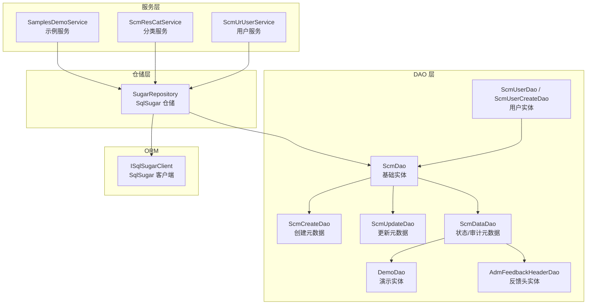
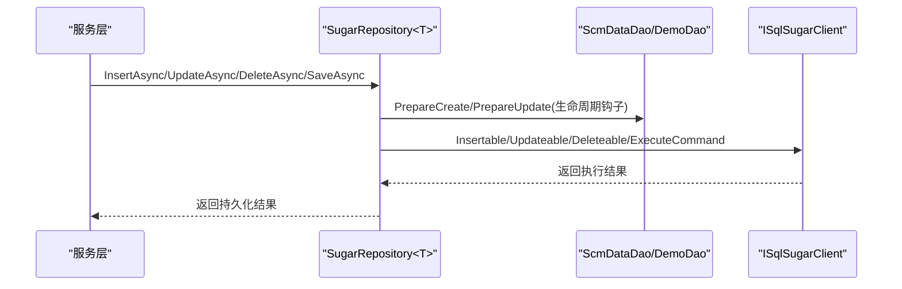
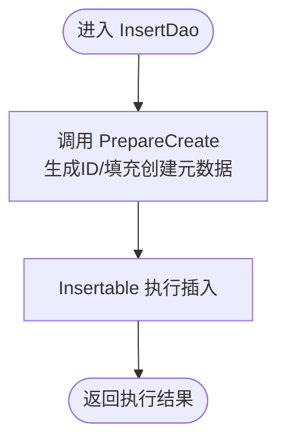
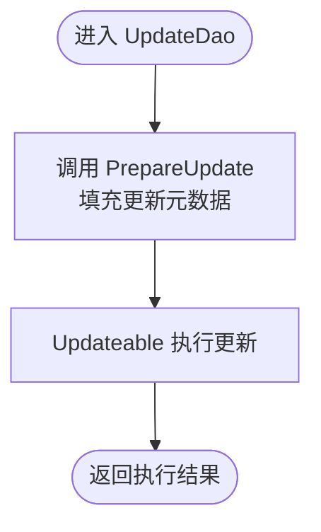
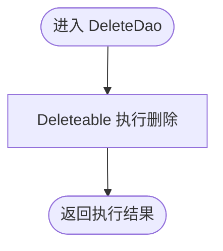
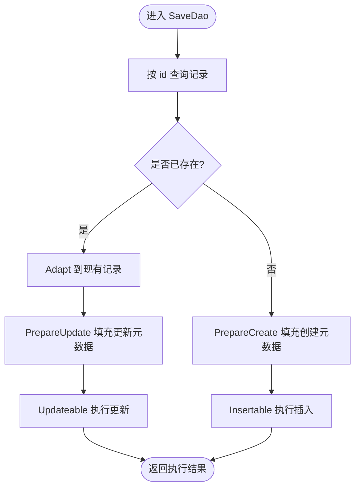
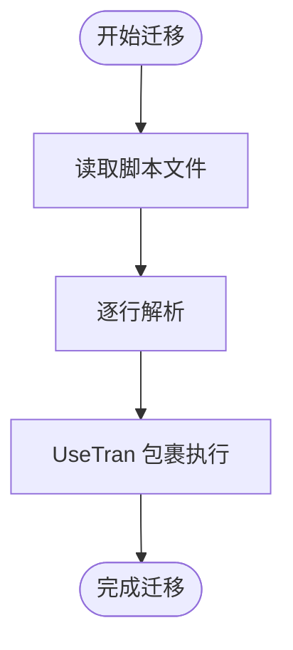
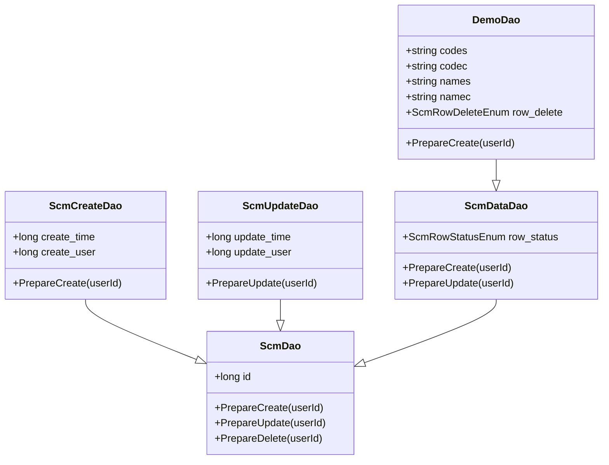
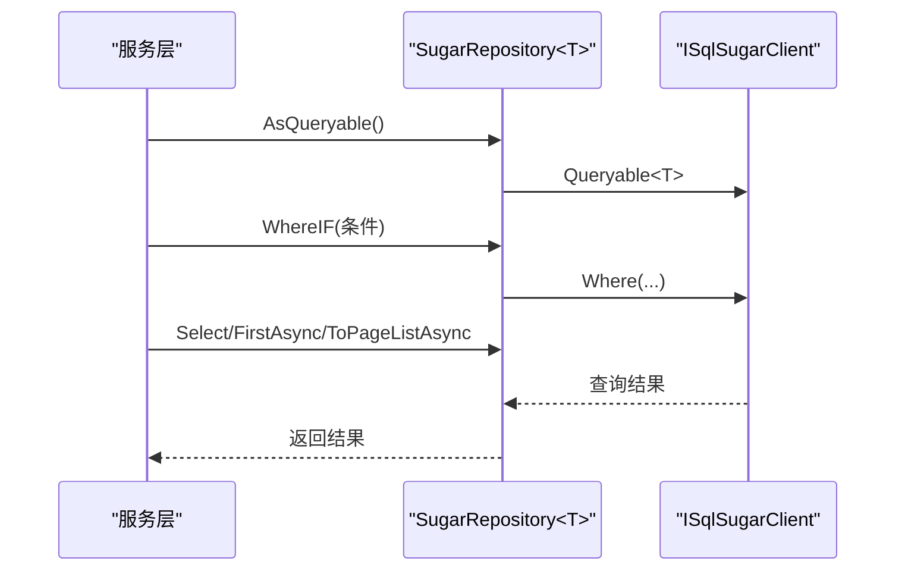
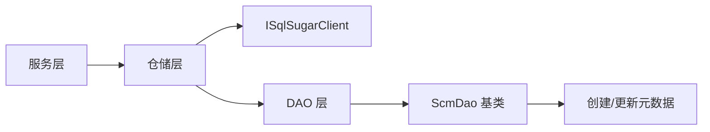

# CRUD 操作实现

<cite>
**本文档引用的文件**
- [ScmDbHelper.cs](file://Scm.Dao/ScmDbHelper.cs)
- [ScmDao.cs](file://Scm.Server.Dao/Dao/ScmDao.cs)
- [ScmCreateDao.cs](file://Scm.Server.Dao/Dao/ScmCreateDao.cs)
- [ScmUpdateDao.cs](file://Scm.Server.Dao/Dao/ScmUpdateDao.cs)
- [ScmDataDao.cs](file://Scm.Server.Dao/Dao/ScmDataDao.cs)
- [ICreateDao.cs](file://Scm.Server.Dao/Dao/ICreateDao.cs)
- [IUpdateDao.cs](file://Scm.Server.Dao/Dao/IUpdateDao.cs)
- [IDeleteDao.cs](file://Scm.Server.Dao/Dao/IDeleteDao.cs)
- [DemoDao.cs](file://Samples.Server.Dao/Demo/DemoDao.cs)
- [AdmFeedbackHeaderDao.cs](file://Scm.Core/Adm/Feedback/Dao/AdmFeedbackHeaderDao.cs)
- [SamplesDemoService.cs](file://Samples.Server/Demo/SamplesDemoService.cs)
- [ScmResCatService.cs](file://Scm.Server.Service/Service/ScmResCatService.cs)
- [ScmUrUserService.cs](file://Scm.Core/Ur/User/ScmUrUserService.cs)
- [SugarRepository.cs](file://Scm.Dsa.Dba.Sugar/SugarRepository.cs)
- [SqlSugarExts.cs](file://Scm.Dsa.Dba.Sugar/Utils/SqlSugarExts.cs)
- [ScmUserDao.cs](file://Scm.Server.Dao/Dao/User/ScmUserDao.cs)
- [ScmUserCreateDao.cs](file://Scm.Server.Dao/Dao/User/ScmUserCreateDao.cs)
</cite>

## 目录
1. [简介](#简介)
2. [项目结构](#项目结构)
3. [核心组件](#核心组件)
4. [架构总览](#架构总览)
5. [详细组件分析](#详细组件分析)
6. [依赖关系分析](#依赖关系分析)
7. [性能考虑](#性能考虑)
8. [故障排查指南](#故障排查指南)
9. [结论](#结论)
10. [附录](#附录)

## 简介
本文件面向 Scm.Net 项目中基于 SqlSugar ORM 的 CRUD 操作实现，重点解析 InsertDao、UpdateDao、DeleteDao、SaveDao 的具体实现与使用模式，并覆盖数据持久化流程（实体准备、字段映射、事务处理）、批量操作、条件查询、复杂查询、数据验证、错误处理与性能优化，以及软删除、状态管理与审计日志的实现机制。

## 项目结构
围绕 CRUD 的核心层次如下：
- DAO 层：定义实体模型与基础行为（主键、准备方法、状态/删除标记）
- 仓储层：封装 SqlSugar 访问，提供查询、插入、更新、删除、保存等通用能力
- 服务层：组合仓储与 DTO 映射，暴露业务接口并处理批量、状态变更、审计日志等

图表来源
- [ScmDbHelper.cs:125-170](file://Scm.Dao/ScmDbHelper.cs#L125-L170)
- [ScmDao.cs:6-28](file://Scm.Server.Dao/Dao/ScmDao.cs#L6-L28)
- [ScmCreateDao.cs:5-24](file://Scm.Server.Dao/Dao/ScmCreateDao.cs#L5-L24)
- [ScmUpdateDao.cs:5-24](file://Scm.Server.Dao/Dao/ScmUpdateDao.cs#L5-L24)
- [ScmDataDao.cs:7-54](file://Scm.Server.Dao/Dao/ScmDataDao.cs#L7-L54)
- [DemoDao.cs:12-87](file://Samples.Server.Dao/Demo/DemoDao.cs#L12-L87)
- [AdmFeedbackHeaderDao.cs:11-61](file://Scm.Core/Adm/Feedback/Dao/AdmFeedbackHeaderDao.cs#L11-L61)
- [ScmUserDao.cs:3-21](file://Scm.Server.Dao/Dao/User/ScmUserDao.cs#L3-L21)
- [ScmUserCreateDao.cs:5-24](file://Scm.Server.Dao/Dao/User/ScmUserCreateDao.cs#L5-L24)

章节来源
- [ScmDbHelper.cs:125-170](file://Scm.Dao/ScmDbHelper.cs#L125-L170)
- [ScmDao.cs:6-68](file://Scm.Server.Dao/Dao/ScmDao.cs#L6-L68)

## 核心组件
- ScmDao：所有实体的基础类，提供主键 id、PrepareCreate/Update/Delete 生命周期钩子、批量 DML 扩展点
- ScmCreateDao / ScmUpdateDao：注入创建/更新元数据（创建人、创建时间、更新人、更新时间）
- ScmDataDao：在创建/更新元数据基础上增加 row_status 状态字段，统一状态管理
- ICreateDao / IUpdateDao / IDeleteDao：接口契约，约束字段与行为
- DemoDao / AdmFeedbackHeaderDao：具体业务实体，继承 ScmDataDao 并扩展业务字段
- ScmDbHelper：提供 InsertDao、UpdateDao、DeleteDao、SaveDao 等持久化方法
- SugarRepository<T>：基于 SqlSugar 的泛型仓储，提供查询、插入、更新、删除、保存等能力

章节来源
- [ScmDao.cs:6-68](file://Scm.Server.Dao/Dao/ScmDao.cs#L6-L68)
- [ScmCreateDao.cs:5-24](file://Scm.Server.Dao/Dao/ScmCreateDao.cs#L5-L24)
- [ScmUpdateDao.cs:5-24](file://Scm.Server.Dao/Dao/ScmUpdateDao.cs#L5-L24)
- [ScmDataDao.cs:7-65](file://Scm.Server.Dao/Dao/ScmDataDao.cs#L7-L65)
- [ICreateDao.cs:3-8](file://Scm.Server.Dao/Dao/ICreateDao.cs#L3-L8)
- [IUpdateDao.cs:3-6](file://Scm.Server.Dao/Dao/IUpdateDao.cs#L3-L6)
- [IDeleteDao.cs:6-12](file://Scm.Server.Dao/Dao/IDeleteDao.cs#L6-L12)
- [DemoDao.cs:12-87](file://Samples.Server.Dao/Demo/DemoDao.cs#L12-L87)
- [AdmFeedbackHeaderDao.cs:11-61](file://Scm.Core/Adm/Feedback/Dao/AdmFeedbackHeaderDao.cs#L11-L61)
- [ScmDbHelper.cs:125-170](file://Scm.Dao/ScmDbHelper.cs#L125-L170)
- [SugarRepository.cs:13-36](file://Scm.Dsa.Dba.Sugar/SugarRepository.cs#L13-L36)

## 架构总览
下图展示从服务层到仓储层再到 DAO 层与 ORM 的调用链路，以及状态/删除标记在不同实体中的体现。

图表来源
- [ScmDbHelper.cs:125-170](file://Scm.Dao/ScmDbHelper.cs#L125-L170)
- [ScmDataDao.cs:35-54](file://Scm.Server.Dao/Dao/ScmDataDao.cs#L35-L54)
- [DemoDao.cs:73-87](file://Samples.Server.Dao/Demo/DemoDao.cs#L73-L87)
- [SugarRepository.cs:18-24](file://Scm.Dsa.Dba.Sugar/SugarRepository.cs#L18-L24)

## 详细组件分析

### InsertDao 插入流程
- 流程要点
  - 调用 PrepareCreate 注入主键与创建元数据
  - 使用 Insertable 执行插入
- 适用场景
  - 新增记录，自动填充 row_status、创建人/时间等
- 示例路径
  - [插入入口:125-129](file://Scm.Dao/ScmDbHelper.cs#L125-L129)

图表来源
- [ScmDbHelper.cs:125-129](file://Scm.Dao/ScmDbHelper.cs#L125-L129)
- [ScmDao.cs:14-20](file://Scm.Server.Dao/Dao/ScmDao.cs#L14-L20)
- [ScmCreateDao.cs:17-23](file://Scm.Server.Dao/Dao/ScmCreateDao.cs#L17-L23)

章节来源
- [ScmDbHelper.cs:125-129](file://Scm.Dao/ScmDbHelper.cs#L125-L129)
- [ScmDao.cs:14-20](file://Scm.Server.Dao/Dao/ScmDao.cs#L14-L20)
- [ScmCreateDao.cs:17-23](file://Scm.Server.Dao/Dao/ScmCreateDao.cs#L17-L23)

### UpdateDao 更新流程
- 流程要点
  - 调用 PrepareUpdate 注入更新元数据
  - 使用 Updateable 执行更新
- 适用场景
  - 单条记录更新，自动填充更新人/时间
- 示例路径
  - [更新入口:136-140](file://Scm.Dao/ScmDbHelper.cs#L136-L140)

图表来源
- [ScmDbHelper.cs:136-140](file://Scm.Dao/ScmDbHelper.cs#L136-L140)
- [ScmUpdateDao.cs:17-23](file://Scm.Server.Dao/Dao/ScmUpdateDao.cs#L17-L23)

章节来源
- [ScmDbHelper.cs:136-140](file://Scm.Dao/ScmDbHelper.cs#L136-L140)
- [ScmUpdateDao.cs:17-23](file://Scm.Server.Dao/Dao/ScmUpdateDao.cs#L17-L23)

### DeleteDao 删除流程
- 流程要点
  - 使用 Deleteable 执行删除
- 适用场景
  - 物理删除或配合软删除策略（见后文）
- 示例路径
  - [删除入口:147-150](file://Scm.Dao/ScmDbHelper.cs#L147-L150)

图表来源
- [ScmDbHelper.cs:147-150](file://Scm.Dao/ScmDbHelper.cs#L147-L150)

章节来源
- [ScmDbHelper.cs:147-150](file://Scm.Dao/ScmDbHelper.cs#L147-L150)

### SaveDao 保存流程（插入/更新一体化）
- 流程要点
  - 先按 id 查询是否存在
  - 存在则 Adapt 后 PrepareUpdate 再 Updateable 更新
  - 不存在则 PrepareCreate 后 Insertable 插入
- 适用场景
  - 保存/编辑一体化，避免重复逻辑
- 示例路径
  - [保存入口:157-170](file://Scm.Dao/ScmDbHelper.cs#L157-L170)

图表来源
- [ScmDbHelper.cs:157-170](file://Scm.Dao/ScmDbHelper.cs#L157-L170)
- [ScmDataDao.cs:35-54](file://Scm.Server.Dao/Dao/ScmDataDao.cs#L35-L54)

章节来源
- [ScmDbHelper.cs:157-170](file://Scm.Dao/ScmDbHelper.cs#L157-L170)
- [ScmDataDao.cs:35-54](file://Scm.Server.Dao/Dao/ScmDataDao.cs#L35-L54)

### 事务处理与脚本执行
- 事务
  - 使用 _SqlClient.Ado.UseTran 包裹批量 DDL/DML，确保一致性
- 脚本版本控制
  - 通过注释中的版本标记判断是否执行某段 SQL
- 示例路径
  - [事务与脚本执行:224-262](file://Scm.Dao/ScmDbHelper.cs#L224-L262)
  - [脚本版本解析:269-287](file://Scm.Dao/ScmDbHelper.cs#L269-L287)

图表来源
- [ScmDbHelper.cs:224-262](file://Scm.Dao/ScmDbHelper.cs#L224-L262)
- [ScmDbHelper.cs:269-287](file://Scm.Dao/ScmDbHelper.cs#L269-L287)

章节来源
- [ScmDbHelper.cs:224-262](file://Scm.Dao/ScmDbHelper.cs#L224-L262)
- [ScmDbHelper.cs:269-287](file://Scm.Dao/ScmDbHelper.cs#L269-L287)

### 软删除、状态管理与审计日志
- 软删除
  - IDeleteDao 引入 row_delete 标记；部分服务通过 AsUpdateable 将 row_delete 设为“已删除”实现软删除
  - 示例路径：[软删除服务调用:500-502](file://Scm.Core/Ur/User/ScmUrUserService.cs#L500-L502)
- 状态管理
  - ScmDataDao 统一维护 row_status；DemoDao 等实体继承后可扩展业务状态
  - 示例路径：[状态字段定义:12-13](file://Scm.Server.Dao/Dao/ScmDataDao.cs#L12-L13)，[实体继承:12-13](file://Samples.Server.Dao/Demo/DemoDao.cs#L12-L13)
- 审计日志
  - 通过创建/更新元数据（create_user/update_user/create_time/update_time）实现基本审计
  - 示例路径：[创建元数据:10-22](file://Scm.Server.Dao/Dao/ScmCreateDao.cs#L10-L22)，[更新元数据:10-22](file://Scm.Server.Dao/Dao/ScmUpdateDao.cs#L10-L22)

图表来源
- [ScmDao.cs:6-28](file://Scm.Server.Dao/Dao/ScmDao.cs#L6-L28)
- [ScmCreateDao.cs:5-24](file://Scm.Server.Dao/Dao/ScmCreateDao.cs#L5-L24)
- [ScmUpdateDao.cs:5-24](file://Scm.Server.Dao/Dao/ScmUpdateDao.cs#L5-L24)
- [ScmDataDao.cs:7-54](file://Scm.Server.Dao/Dao/ScmDataDao.cs#L7-L54)
- [DemoDao.cs:12-87](file://Samples.Server.Dao/Demo/DemoDao.cs#L12-L87)

章节来源
- [ScmDataDao.cs:12-13](file://Scm.Server.Dao/Dao/ScmDataDao.cs#L12-L13)
- [DemoDao.cs:64-71](file://Samples.Server.Dao/Demo/DemoDao.cs#L64-L71)
- [ScmCreateDao.cs:10-22](file://Scm.Server.Dao/Dao/ScmCreateDao.cs#L10-L22)
- [ScmUpdateDao.cs:10-22](file://Scm.Server.Dao/Dao/ScmUpdateDao.cs#L10-L22)
- [ScmUrUserService.cs:500-502](file://Scm.Core/Ur/User/ScmUrUserService.cs#L500-L502)

### 批量操作与条件查询
- 批量操作
  - 通过 AsUpdateable().SetColumns().Where() 实现批量状态变更或字段更新
  - 示例路径：[批量状态更新:480-483](file://Scm.Core/Ur/User/ScmUrUserService.cs#L480-L483)，[批量删除:500-502](file://Scm.Core/Ur/User/ScmUrUserService.cs#L500-L502)
- 条件查询
  - 服务层使用 AsQueryable().WhereIF(...) 等组合条件，支持状态过滤、名称匹配等
  - 示例路径：[分页查询示例:15-33](file://Scm.Server.Service/Service/ScmResCatService.cs#L15-L33)，[示例服务查询:106-114](file://Samples.Server/Demo/SamplesDemoService.cs#L106-L114)
- 复杂查询
  - 结合动态表达式与 WhereIF，实现多条件、排序、分页
  - 示例路径：[仓储过滤器初始化:29-36](file://Scm.Dsa.Dba.Sugar/SugarRepository.cs#L29-L36)

图表来源
- [ScmResCatService.cs:15-33](file://Scm.Server.Service/Service/ScmResCatService.cs#L15-L33)
- [SamplesDemoService.cs:106-114](file://Samples.Server/Demo/SamplesDemoService.cs#L106-L114)
- [SugarRepository.cs:29-36](file://Scm.Dsa.Dba.Sugar/SugarRepository.cs#L29-L36)

章节来源
- [ScmUrUserService.cs:480-502](file://Scm.Core/Ur/User/ScmUrUserService.cs#L480-L502)
- [ScmResCatService.cs:15-33](file://Scm.Server.Service/Service/ScmResCatService.cs#L15-L33)
- [SamplesDemoService.cs:106-114](file://Samples.Server/Demo/SamplesDemoService.cs#L106-L114)
- [SugarRepository.cs:29-36](file://Scm.Dsa.Dba.Sugar/SugarRepository.cs#L29-L36)

### 数据验证与错误处理
- 数据验证
  - 实体字段使用 [Required]、[StringLength]、[SugarColumn] 等特性进行约束
  - 示例路径：[DemoDao 字段约束:23-59](file://Samples.Server.Dao/Demo/DemoDao.cs#L23-L59)
- 错误处理
  - 服务层通过异常捕获与业务异常（BusinessException）抛出，结合全局过滤器处理
  - 示例路径：[全局异常过滤器](file://Scm.Core/Configure/Filters/GlobalExceptionFilter.cs)

章节来源
- [DemoDao.cs:23-59](file://Samples.Server.Dao/Demo/DemoDao.cs#L23-L59)

### 使用模式与最佳实践
- 插入/更新/删除/保存
  - 优先使用 SaveDao 进行保存/编辑一体化
  - 需要精确控制时分别使用 InsertDao、UpdateDao、DeleteDao
- 状态与软删除
  - 对需要保留审计痕迹的数据采用软删除（row_delete），对无需保留的数据直接物理删除
- 审计日志
  - 通过创建/更新元数据实现基本审计；必要时扩展审计表
- 性能优化
  - 使用 AsUpdateable().SetColumns() 批量更新，减少往返
  - 合理使用 WhereIF 与索引列，避免全表扫描
  - 使用事务包裹批量 DDL/DML，保证一致性

章节来源
- [ScmDbHelper.cs:125-170](file://Scm.Dao/ScmDbHelper.cs#L125-L170)
- [ScmUrUserService.cs:500-502](file://Scm.Core/Ur/User/ScmUrUserService.cs#L500-L502)

## 依赖关系分析
- 组件耦合
  - 服务层依赖仓储层，仓储层依赖 SqlSugar 客户端
  - DAO 层通过继承关系形成清晰的职责边界
- 外部依赖
  - SqlSugar 作为 ORM 提供者
  - 项目内通用工具（UidUtils、TimeUtils）用于 ID 生成与时间戳

图表来源
- [ScmDbHelper.cs:125-170](file://Scm.Dao/ScmDbHelper.cs#L125-L170)
- [ScmDao.cs:6-28](file://Scm.Server.Dao/Dao/ScmDao.cs#L6-L28)
- [ScmCreateDao.cs:5-24](file://Scm.Server.Dao/Dao/ScmCreateDao.cs#L5-L24)
- [ScmUpdateDao.cs:5-24](file://Scm.Server.Dao/Dao/ScmUpdateDao.cs#L5-L24)

章节来源
- [ScmDbHelper.cs:125-170](file://Scm.Dao/ScmDbHelper.cs#L125-L170)
- [ScmDao.cs:6-28](file://Scm.Server.Dao/Dao/ScmDao.cs#L6-L28)

## 性能考虑
- 批量更新
  - 使用 AsUpdateable().SetColumns() 批量更新字段，减少网络往返
- 事务批处理
  - 使用 UseTran 包裹批量 DDL/DML，提升一致性与吞吐
- 查询优化
  - 合理使用 WhereIF 与索引列，避免不必要的全表扫描
- 实体准备
  - 在 PrepareCreate/PrepareUpdate 中一次性填充元数据，减少后续更新成本

章节来源
- [ScmDbHelper.cs:224-262](file://Scm.Dao/ScmDbHelper.cs#L224-L262)
- [ScmUrUserService.cs:500-502](file://Scm.Core/Ur/User/ScmUrUserService.cs#L500-L502)

## 故障排查指南
- 插入失败
  - 检查实体字段约束（Required、StringLength、SugarColumn）
  - 确认 PrepareCreate 是否正确生成主键与元数据
- 更新失败
  - 检查 PrepareUpdate 是否被调用
  - 确认目标记录是否存在（SaveDao 会先查询）
- 删除异常
  - 若需软删除，请确认实体是否实现 IDeleteDao 或服务层是否使用 AsUpdateable 设置 row_delete
- 事务回滚
  - 检查 UseTran 包裹范围与异常传播

章节来源
- [DemoDao.cs:23-59](file://Samples.Server.Dao/Demo/DemoDao.cs#L23-L59)
- [ScmDbHelper.cs:125-170](file://Scm.Dao/ScmDbHelper.cs#L125-L170)
- [ScmUrUserService.cs:500-502](file://Scm.Core/Ur/User/ScmUrUserService.cs#L500-L502)

## 结论
Scm.Net 基于 SqlSugar 的 CRUD 实现通过 DAO 基类与生命周期钩子，统一了实体准备、状态与审计管理；通过仓储层抽象，提供了灵活的查询与批量操作能力；结合软删除与事务处理，满足生产环境的一致性与可审计性需求。遵循本文的使用模式与最佳实践，可在保证性能的同时提升开发效率与系统稳定性。

## 附录
- 示例服务与 DAO 的对应关系
  - 示例服务与 DemoDao 的 CRUD 调用：[示例服务:116-134](file://Samples.Server/Demo/SamplesDemoService.cs#L116-L134)
  - 分类服务的查询与获取：[分类服务:15-33](file://Scm.Server.Service/Service/ScmResCatService.cs#L15-L33)
  - 用户服务的批量状态与删除：[用户服务:480-502](file://Scm.Core/Ur/User/ScmUrUserService.cs#L480-L502)
- 租户过滤与动态查询
  - 仓储层根据接口类型动态添加查询过滤器，实现租户隔离：[仓储过滤器:29-36](file://Scm.Dsa.Dba.Sugar/SugarRepository.cs#L29-L36)
- 用户实体示例
  - 用户实体与创建元数据：[用户实体:3-21](file://Scm.Server.Dao/Dao/User/ScmUserDao.cs#L3-L21)，[用户创建元数据:5-24](file://Scm.Server.Dao/Dao/User/ScmUserCreateDao.cs#L5-L24)