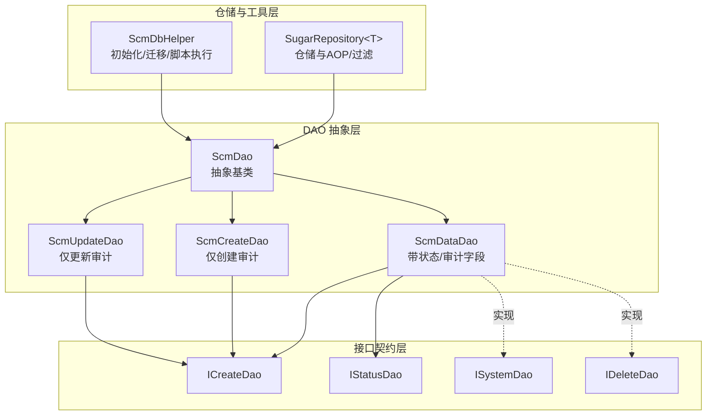
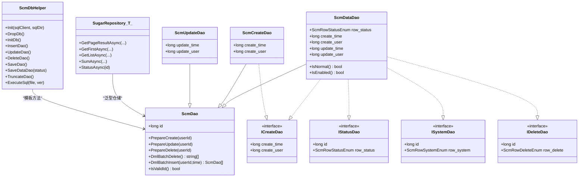
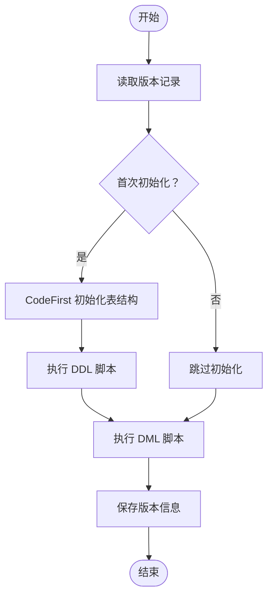
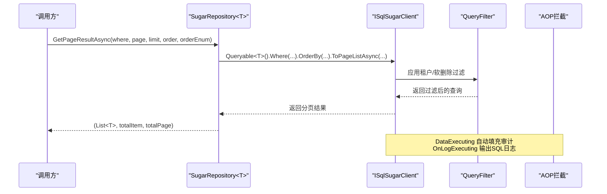
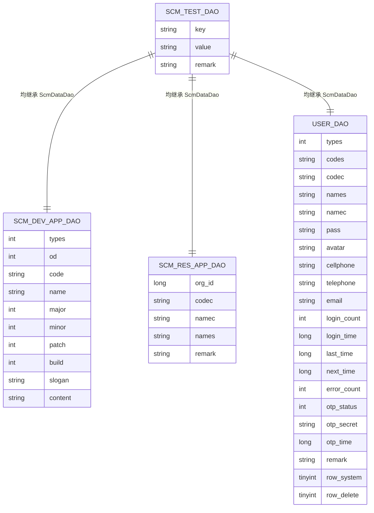
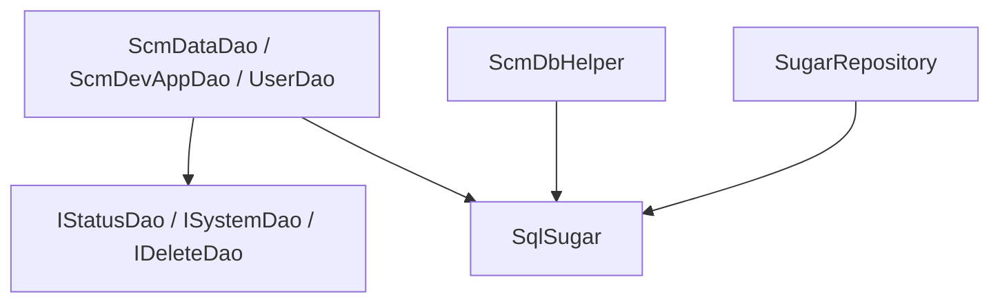

# DAO 架构设计

<cite>
**本文引用的文件**
- [ScmDbHelper.cs](file://Scm.Dao/ScmDbHelper.cs)
- [ScmDao.cs](file://Scm.Server.Dao/Dao/ScmDao.cs)
- [ScmDataDao.cs](file://Scm.Server.Dao/Dao/ScmDataDao.cs)
- [ScmCreateDao.cs](file://Scm.Server.Dao/Dao/ScmCreateDao.cs)
- [ScmUpdateDao.cs](file://Scm.Server.Dao/Dao/ScmUpdateDao.cs)
- [ISystemDao.cs](file://Scm.Server.Dao/Dao/ISystemDao.cs)
- [IStatusDao.cs](file://Scm.Server.Dao/Dao/IStatusDao.cs)
- [ICreateDao.cs](file://Scm.Server.Dao/Dao/ICreateDao.cs)
- [IDeleteDao.cs](file://Scm.Server.Dao/Dao/IDeleteDao.cs)
- [SugarRepository.cs](file://Scm.Dsa.Dba.Sugar/SugarRepository.cs)
- [ScmTestDao.cs](file://Scm.Dao/ScmTestDao.cs)
- [ScmVerDao.cs](file://Scm.Server.Dao/ScmVerDao.cs)
- [ScmDevAppDao.cs](file://Scm.Dao/Dev/ScmDevAppDao.cs)
- [UserDao.cs](file://Scm.Dao/Ur/UserDao.cs)
- [ScmResAppDao.cs](file://Scm.Dao/Res/App/ScmResAppDao.cs)
</cite>

## 目录
1. [引言](#引言)
2. [项目结构](#项目结构)
3. [核心组件](#核心组件)
4. [架构总览](#架构总览)
5. [详细组件分析](#详细组件分析)
6. [依赖分析](#依赖分析)
7. [性能考虑](#性能考虑)
8. [故障排查指南](#故障排查指南)
9. [结论](#结论)
10. [附录](#附录)

## 引言
本文件面向 Scm.Net 的数据访问层（DAO）架构，系统性阐述基于 SqlSugar ORM 的数据访问层设计与实现，重点覆盖以下内容：
- ScmDbHelper 基础类的设计理念与数据库初始化/迁移策略
- ScmDao 抽象基类的实现模式与生命周期钩子
- SugarRepository 仓储模式在查询、分页、过滤与 AOP 中的应用
- DAO 层的继承体系、接口设计与泛型约束机制
- 数据访问层的分层架构：基础 DAO、数据 DAO、业务 DAO 的职责划分
- DAO 类型层次结构图与继承关系说明
- 数据模型映射、实体关系设计与数据库表结构对应关系
- DAO 层扩展机制与自定义 DAO 的开发指南

## 项目结构
Scm.Net 的 DAO 架构由三层组成：
- 基础抽象层：ScmDao 及其派生类（如 ScmDataDao、ScmCreateDao、ScmUpdateDao）
- 接口契约层：ICreateDao、IStatusDao、ISystemDao、IDeleteDao 等
- 仓储与工具层：SugarRepository 仓储类与 ScmDbHelper 数据库初始化/迁移工具

下图展示了 DAO 层在项目中的位置与主要文件：

**图表来源**
- [ScmDao.cs:6-68](file://Scm.Server.Dao/Dao/ScmDao.cs#L6-L68)
- [ScmDataDao.cs:7-65](file://Scm.Server.Dao/Dao/ScmDataDao.cs#L7-L65)
- [ScmCreateDao.cs:5-24](file://Scm.Server.Dao/Dao/ScmCreateDao.cs#L5-L24)
- [ScmUpdateDao.cs:5-24](file://Scm.Server.Dao/Dao/ScmUpdateDao.cs#L5-L24)
- [ISystemDao.cs:6-12](file://Scm.Server.Dao/Dao/ISystemDao.cs#L6-L12)
- [IStatusDao.cs:6-12](file://Scm.Server.Dao/Dao/IStatusDao.cs#L6-L12)
- [ICreateDao.cs:3-8](file://Scm.Server.Dao/Dao/ICreateDao.cs#L3-L8)
- [IDeleteDao.cs:6-12](file://Scm.Server.Dao/Dao/IDeleteDao.cs#L6-L12)
- [SugarRepository.cs:13-82](file://Scm.Dsa.Dba.Sugar/SugarRepository.cs#L13-L82)
- [ScmDbHelper.cs:16-118](file://Scm.Dao/ScmDbHelper.cs#L16-L118)

**章节来源**
- [ScmDao.cs:6-68](file://Scm.Server.Dao/Dao/ScmDao.cs#L6-L68)
- [ScmDataDao.cs:7-65](file://Scm.Server.Dao/Dao/ScmDataDao.cs#L7-L65)
- [ScmCreateDao.cs:5-24](file://Scm.Server.Dao/Dao/ScmCreateDao.cs#L5-L24)
- [ScmUpdateDao.cs:5-24](file://Scm.Server.Dao/Dao/ScmUpdateDao.cs#L5-L24)
- [ISystemDao.cs:6-12](file://Scm.Server.Dao/Dao/ISystemDao.cs#L6-L12)
- [IStatusDao.cs:6-12](file://Scm.Server.Dao/Dao/IStatusDao.cs#L6-L12)
- [ICreateDao.cs:3-8](file://Scm.Server.Dao/Dao/ICreateDao.cs#L3-L8)
- [IDeleteDao.cs:6-12](file://Scm.Server.Dao/Dao/IDeleteDao.cs#L6-L12)
- [SugarRepository.cs:13-82](file://Scm.Dsa.Dba.Sugar/SugarRepository.cs#L13-L82)
- [ScmDbHelper.cs:16-118](file://Scm.Dao/ScmDbHelper.cs#L16-L118)

## 核心组件
本节聚焦 DAO 层的核心构件及其职责。

- ScmDao 抽象基类
  - 提供主键 id 与通用生命周期方法（PrepareCreate/PrepareUpdate/PrepareDelete）
  - 支持批量 DML 钩子（DmlBatchDelete/DmlBatchInsert）
  - 提供 IsValidId 判定与对象相等性/哈希逻辑

- ScmDataDao
  - 在 ScmDao 基础上增加 row_status、create/update 时间与用户字段
  - 自动填充状态、创建/更新审计信息

- ScmCreateDao / ScmUpdateDao
  - 分别提供仅创建/仅更新的审计字段与 Prepare* 钩子

- 接口契约
  - ICreateDao：统一创建审计字段
  - IStatusDao：统一状态字段
  - ISystemDao：系统级标记字段
  - IDeleteDao：软删除标记字段

- SugarRepository 仓储
  - 泛型仓储封装，内置租户过滤、软删除过滤
  - AOP 注入：自动填充创建/更新审计、SQL 日志输出
  - 提供分页查询、列表查询、求和、状态切换等常用方法

- ScmDbHelper 数据库工具
  - 初始化/重建数据库、版本记录、DDL/DML 脚本执行
  - 表结构初始化、清空、Truncate
  - 通用 Insert/Update/Delete/Save/SaveDataDao 模板方法

**章节来源**
- [ScmDao.cs:6-68](file://Scm.Server.Dao/Dao/ScmDao.cs#L6-L68)
- [ScmDataDao.cs:7-65](file://Scm.Server.Dao/Dao/ScmDataDao.cs#L7-L65)
- [ScmCreateDao.cs:5-24](file://Scm.Server.Dao/Dao/ScmCreateDao.cs#L5-L24)
- [ScmUpdateDao.cs:5-24](file://Scm.Server.Dao/Dao/ScmUpdateDao.cs#L5-L24)
- [ICreateDao.cs:3-8](file://Scm.Server.Dao/Dao/ICreateDao.cs#L3-L8)
- [IStatusDao.cs:6-12](file://Scm.Server.Dao/Dao/IStatusDao.cs#L6-L12)
- [ISystemDao.cs:6-12](file://Scm.Server.Dao/Dao/ISystemDao.cs#L6-L12)
- [IDeleteDao.cs:6-12](file://Scm.Server.Dao/Dao/IDeleteDao.cs#L6-L12)
- [SugarRepository.cs:13-82](file://Scm.Dsa.Dba.Sugar/SugarRepository.cs#L13-L82)
- [ScmDbHelper.cs:16-118](file://Scm.Dao/ScmDbHelper.cs#L16-L118)

## 架构总览
下图展示了 DAO 层的整体架构与交互关系，包括实体映射、仓储与数据库工具之间的协作。

**图表来源**
- [ScmDao.cs:6-68](file://Scm.Server.Dao/Dao/ScmDao.cs#L6-L68)
- [ScmDataDao.cs:7-65](file://Scm.Server.Dao/Dao/ScmDataDao.cs#L7-L65)
- [ScmCreateDao.cs:5-24](file://Scm.Server.Dao/Dao/ScmCreateDao.cs#L5-L24)
- [ScmUpdateDao.cs:5-24](file://Scm.Server.Dao/Dao/ScmUpdateDao.cs#L5-L24)
- [ICreateDao.cs:3-8](file://Scm.Server.Dao/Dao/ICreateDao.cs#L3-L8)
- [IStatusDao.cs:6-12](file://Scm.Server.Dao/Dao/IStatusDao.cs#L6-L12)
- [ISystemDao.cs:6-12](file://Scm.Server.Dao/Dao/ISystemDao.cs#L6-L12)
- [IDeleteDao.cs:6-12](file://Scm.Server.Dao/Dao/IDeleteDao.cs#L6-L12)
- [SugarRepository.cs:13-82](file://Scm.Dsa.Dba.Sugar/SugarRepository.cs#L13-L82)
- [ScmDbHelper.cs:16-118](file://Scm.Dao/ScmDbHelper.cs#L16-L118)

## 详细组件分析

### ScmDbHelper：数据库初始化与迁移工具
- 设计理念
  - 通过反射扫描所有以 Dao 结尾且实现 ScmDao 的类型，进行 CodeFirst 初始化
  - 支持按版本执行 DDL/DML 脚本，保证数据库结构与数据的演进一致性
  - 提供通用的 Insert/Update/Delete/Save/Truncate 模板方法，简化 DAO 操作

- 关键流程
  - 版本读取与保存：维护 scm_ver 记录，记录当前版本与更新时间
  - 表结构初始化：遍历 DAO 类型，提取 SugarTable 标注，调用 CodeFirst 初始化
  - 脚本执行：解析脚本注释中的版本号，按需执行 SQL

- 使用场景
  - 应用启动时初始化数据库
  - 迁移脚本执行与版本控制
  - 开发环境下的表清空与数据重置

**图表来源**
- [ScmDbHelper.cs:50-82](file://Scm.Dao/ScmDbHelper.cs#L50-L82)
- [ScmVerDao.cs:7-41](file://Scm.Server.Dao/ScmVerDao.cs#L7-L41)

**章节来源**
- [ScmDbHelper.cs:16-118](file://Scm.Dao/ScmDbHelper.cs#L16-L118)
- [ScmVerDao.cs:7-41](file://Scm.Server.Dao/ScmVerDao.cs#L7-L41)

### ScmDao 抽象基类：生命周期与批量 DML
- 主键与标识
  - id 字段作为主键，支持 IsValidId 判定有效标识范围
- 生命周期钩子
  - PrepareCreate/PrepareUpdate/PrepareDelete：派生类可覆盖以注入审计信息
- 批量 DML
  - DmlBatchDelete/DmlBatchInsert：为批量导入/导出提供扩展点

**章节来源**
- [ScmDao.cs:6-68](file://Scm.Server.Dao/Dao/ScmDao.cs#L6-L68)

### ScmDataDao：状态与审计字段
- 字段设计
  - row_status：统一状态字段，支持 Normal/Enabled 等状态判断
  - create_time/create_user/update_time/update_user：统一审计字段
- PrepareCreate/PrepareUpdate
  - 自动填充 row_status、创建/更新时间与用户

**章节来源**
- [ScmDataDao.cs:7-65](file://Scm.Server.Dao/Dao/ScmDataDao.cs#L7-L65)

### ScmCreateDao / ScmUpdateDao：最小化审计
- ScmCreateDao：仅包含创建审计字段与 PrepareCreate
- ScmUpdateDao：仅包含更新审计字段与 PrepareUpdate

**章节来源**
- [ScmCreateDao.cs:5-24](file://Scm.Server.Dao/Dao/ScmCreateDao.cs#L5-L24)
- [ScmUpdateDao.cs:5-24](file://Scm.Server.Dao/Dao/ScmUpdateDao.cs#L5-L24)

### 接口契约层：统一字段与行为
- ICreateDao：统一创建审计字段
- IStatusDao：统一状态字段
- ISystemDao：系统级标记字段
- IDeleteDao：软删除标记字段

这些接口与 ScmDataDao 的组合，形成“状态+审计”的标准数据实体模式。

**章节来源**
- [ICreateDao.cs:3-8](file://Scm.Server.Dao/Dao/ICreateDao.cs#L3-L8)
- [IStatusDao.cs:6-12](file://Scm.Server.Dao/Dao/IStatusDao.cs#L6-L12)
- [ISystemDao.cs:6-12](file://Scm.Server.Dao/Dao/ISystemDao.cs#L6-L12)
- [IDeleteDao.cs:6-12](file://Scm.Server.Dao/Dao/IDeleteDao.cs#L6-L12)

### SugarRepository 仓储：查询、分页与过滤
- 租户过滤与软删除过滤
  - 通过动态表达式解析器构建过滤 Lambda，并注册到 QueryFilter
- AOP 注入
  - DataExecuting：自动调用 PrepareCreate/PrepareUpdate 填充审计
  - OnLogExecuting：格式化 SQL 输出日志
- 查询能力
  - 分页查询（GetPageResultAsync）
  - 条件查询（GetListAsync/GetFirstAsync）
  - 动态排序与字符串条件 WhereIF
  - 求和与状态切换

**图表来源**
- [SugarRepository.cs:13-82](file://Scm.Dsa.Dba.Sugar/SugarRepository.cs#L13-L82)
- [SugarRepository.cs:93-124](file://Scm.Dsa.Dba.Sugar/SugarRepository.cs#L93-L124)
- [SugarRepository.cs:133-139](file://Scm.Dsa.Dba.Sugar/SugarRepository.cs#L133-L139)
- [SugarRepository.cs:148-168](file://Scm.Dsa.Dba.Sugar/SugarRepository.cs#L148-L168)
- [SugarRepository.cs:176-188](file://Scm.Dsa.Dba.Sugar/SugarRepository.cs#L176-L188)

**章节来源**
- [SugarRepository.cs:13-190](file://Scm.Dsa.Dba.Sugar/SugarRepository.cs#L13-L190)

### 数据模型映射与实体关系
- 基础映射
  - ScmTestDao：演示 SugarTable 映射与字段长度/必填约束
  - ScmDevAppDao：继承 ScmDataDao，映射到 scm_sys_app
  - ScmResAppDao：继承 ScmDataDao，映射到 scm_res_app
  - UserDao：继承 ScmDataDao 并实现 ISystemDao、IDeleteDao、IResDao，映射到 scm_ur_user
- 关系设计
  - 多数实体继承 ScmDataDao，统一状态与审计
  - 业务实体通过接口契约实现系统级/软删除等能力

**图表来源**
- [ScmTestDao.cs:7-24](file://Scm.Dao/ScmTestDao.cs#L7-L24)
- [ScmDevAppDao.cs:10-74](file://Scm.Dao/Dev/ScmDevAppDao.cs#L10-L74)
- [ScmResAppDao.cs:10-79](file://Scm.Dao/Res/App/ScmResAppDao.cs#L10-L79)
- [UserDao.cs:13-274](file://Scm.Dao/Ur/UserDao.cs#L13-L274)

**章节来源**
- [ScmTestDao.cs:7-24](file://Scm.Dao/ScmTestDao.cs#L7-L24)
- [ScmDevAppDao.cs:10-74](file://Scm.Dao/Dev/ScmDevAppDao.cs#L10-L74)
- [ScmResAppDao.cs:10-79](file://Scm.Dao/Res/App/ScmResAppDao.cs#L10-L79)
- [UserDao.cs:13-274](file://Scm.Dao/Ur/UserDao.cs#L13-L274)

### 分层架构：基础 DAO、数据 DAO、业务 DAO
- 基础 DAO（ScmDao）
  - 提供主键与生命周期钩子
- 数据 DAO（ScmDataDao、ScmCreateDao、ScmUpdateDao）
  - 提供状态与审计字段，或最小化审计
- 业务 DAO（如 ScmDevAppDao、ScmResAppDao、UserDao）
  - 继承数据 DAO，结合接口契约实现业务特性（系统级、软删除、资源等）

职责划分：
- 基础 DAO：统一标识与生命周期
- 数据 DAO：统一状态与审计
- 业务 DAO：业务字段与行为，复用审计与状态能力

**章节来源**
- [ScmDao.cs:6-68](file://Scm.Server.Dao/Dao/ScmDao.cs#L6-L68)
- [ScmDataDao.cs:7-65](file://Scm.Server.Dao/Dao/ScmDataDao.cs#L7-L65)
- [ScmCreateDao.cs:5-24](file://Scm.Server.Dao/Dao/ScmCreateDao.cs#L5-L24)
- [ScmUpdateDao.cs:5-24](file://Scm.Server.Dao/Dao/ScmUpdateDao.cs#L5-L24)
- [ScmDevAppDao.cs:10-74](file://Scm.Dao/Dev/ScmDevAppDao.cs#L10-L74)
- [ScmResAppDao.cs:10-79](file://Scm.Dao/Res/App/ScmResAppDao.cs#L10-L79)
- [UserDao.cs:13-274](file://Scm.Dao/Ur/UserDao.cs#L13-L274)

### 扩展机制与自定义 DAO 开发指南
- 继承策略
  - 若需要状态与审计：继承 ScmDataDao
  - 若仅需创建审计：继承 ScmCreateDao
  - 若仅需更新审计：继承 ScmUpdateDao
- 接口契约
  - 如需系统级标记：实现 ISystemDao
  - 如需软删除：实现 IDeleteDao
- 映射与约束
  - 使用 SugarTable 标注表名
  - 使用 SugarColumn/Required/StringLength 等标注字段长度与非空
- 仓储使用
  - 通过 SugarRepository<T> 获取分页/查询能力
  - 依赖 AOP 自动填充审计字段
- 数据库初始化
  - 使用 ScmDbHelper.InitDb 完成表结构与脚本初始化
  - 通过 ScmDbHelper.ReadDbVer/SaveDbVer 管理版本

**章节来源**
- [ScmDbHelper.cs:16-118](file://Scm.Dao/ScmDbHelper.cs#L16-L118)
- [SugarRepository.cs:13-82](file://Scm.Dsa.Dba.Sugar/SugarRepository.cs#L13-L82)
- [ScmTestDao.cs:7-24](file://Scm.Dao/ScmTestDao.cs#L7-L24)
- [ScmDevAppDao.cs:10-74](file://Scm.Dao/Dev/ScmDevAppDao.cs#L10-L74)
- [ScmResAppDao.cs:10-79](file://Scm.Dao/Res/App/ScmResAppDao.cs#L10-L79)
- [UserDao.cs:13-274](file://Scm.Dao/Ur/UserDao.cs#L13-L274)

## 依赖分析
- 组件耦合
  - ScmDataDao 与接口契约（IStatusDao、ISystemDao、IDeleteDao）松耦合
  - SugarRepository 与具体 DAO 解耦，通过泛型约束与 SqlSugar 运行时绑定
  - ScmDbHelper 通过反射扫描 DAO 类型，降低对具体实体的编译期依赖
- 外部依赖
  - SqlSugar ORM：提供 CodeFirst、查询、事务、AOP、过滤等能力
  - System.ComponentModel.DataAnnotations：字段验证与长度约束
  - System.Linq.Dynamic.Core：动态表达式解析，用于租户/软删除过滤与排序

**图表来源**
- [ScmDataDao.cs:7-65](file://Scm.Server.Dao/Dao/ScmDataDao.cs#L7-L65)
- [ScmDevAppDao.cs:10-74](file://Scm.Dao/Dev/ScmDevAppDao.cs#L10-L74)
- [UserDao.cs:13-274](file://Scm.Dao/Ur/UserDao.cs#L13-L274)
- [IStatusDao.cs:6-12](file://Scm.Server.Dao/Dao/IStatusDao.cs#L6-L12)
- [ISystemDao.cs:6-12](file://Scm.Server.Dao/Dao/ISystemDao.cs#L6-L12)
- [IDeleteDao.cs:6-12](file://Scm.Server.Dao/Dao/IDeleteDao.cs#L6-L12)
- [SugarRepository.cs:13-82](file://Scm.Dsa.Dba.Sugar/SugarRepository.cs#L13-L82)
- [ScmDbHelper.cs:16-118](file://Scm.Dao/ScmDbHelper.cs#L16-L118)

**章节来源**
- [ScmDataDao.cs:7-65](file://Scm.Server.Dao/Dao/ScmDataDao.cs#L7-L65)
- [ScmDevAppDao.cs:10-74](file://Scm.Dao/Dev/ScmDevAppDao.cs#L10-L74)
- [UserDao.cs:13-274](file://Scm.Dao/Ur/UserDao.cs#L13-L274)
- [IStatusDao.cs:6-12](file://Scm.Server.Dao/Dao/IStatusDao.cs#L6-L12)
- [ISystemDao.cs:6-12](file://Scm.Server.Dao/Dao/ISystemDao.cs#L6-L12)
- [IDeleteDao.cs:6-12](file://Scm.Server.Dao/Dao/IDeleteDao.cs#L6-L12)
- [SugarRepository.cs:13-82](file://Scm.Dsa.Dba.Sugar/SugarRepository.cs#L13-L82)
- [ScmDbHelper.cs:16-118](file://Scm.Dao/ScmDbHelper.cs#L16-L118)

## 性能考虑
- 查询优化
  - 合理使用索引字段参与 Where/OrderBy 条件
  - 分页查询避免一次性加载大结果集
- 过滤与 AOP
  - 租户与软删除过滤在查询阶段生效，减少无效数据传输
  - SQL 日志仅在调试环境开启，避免生产环境性能损耗
- 批量操作
  - 使用 Insertable/Updateable/TruncateTable 等批量 API
  - 脚本执行采用事务包裹，确保一致性与原子性

## 故障排查指南
- 版本不一致导致初始化失败
  - 检查 scm_ver 记录与脚本注释中的版本号匹配
  - 使用 ScmDbHelper.InitDb 重新初始化数据库
- 查询结果异常
  - 确认租户过滤与软删除过滤是否正确注册
  - 检查 AOP 是否正常注入审计字段
- SQL 性能问题
  - 查看 OnLogExecuting 输出的 SQL，定位慢查询
  - 为高频查询字段添加索引

**章节来源**
- [ScmDbHelper.cs:50-82](file://Scm.Dao/ScmDbHelper.cs#L50-L82)
- [ScmDbHelper.cs:224-262](file://Scm.Dao/ScmDbHelper.cs#L224-L262)
- [SugarRepository.cs:44-81](file://Scm.Dsa.Dba.Sugar/SugarRepository.cs#L44-L81)

## 结论
Scm.Net 的 DAO 架构以 ScmDao 为核心抽象，通过 ScmDataDao 与接口契约统一状态与审计，借助 SugarRepository 提供泛型仓储与 AOP 能力，配合 ScmDbHelper 实现数据库初始化与版本化迁移。该架构具备良好的扩展性与可维护性，适合在中后台管理系统中快速落地与迭代。

## 附录
- 常用 DAO 开发清单
  - 继承选择：ScmDataDao / ScmCreateDao / ScmUpdateDao
  - 接口实现：IStatusDao / ISystemDao / IDeleteDao
  - 映射标注：SugarTable / SugarColumn / Required / StringLength
  - 仓储使用：GetPageResultAsync / GetListAsync / GetFirstAsync
  - 数据库初始化：ScmDbHelper.InitDb / ReadDbVer / SaveDbVer