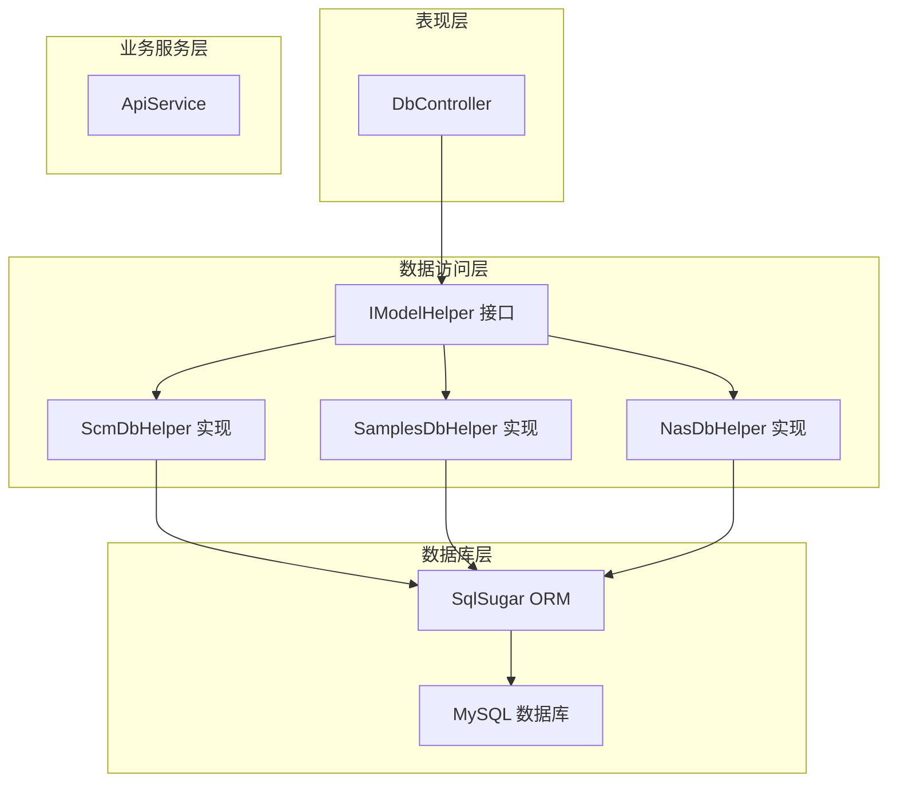
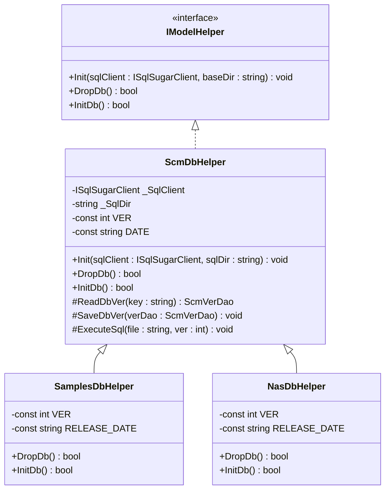
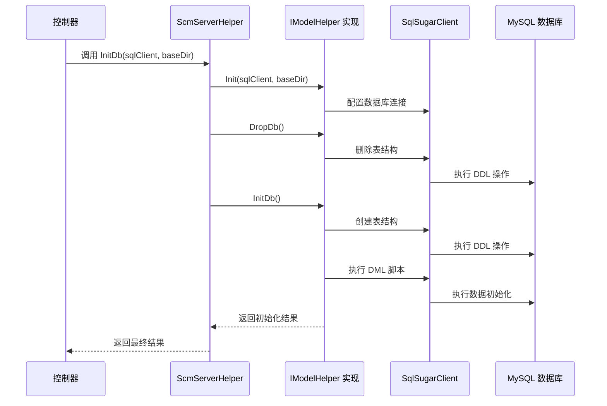
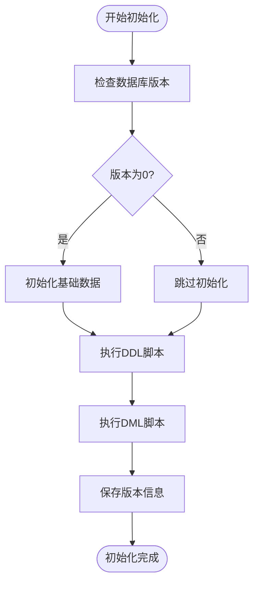
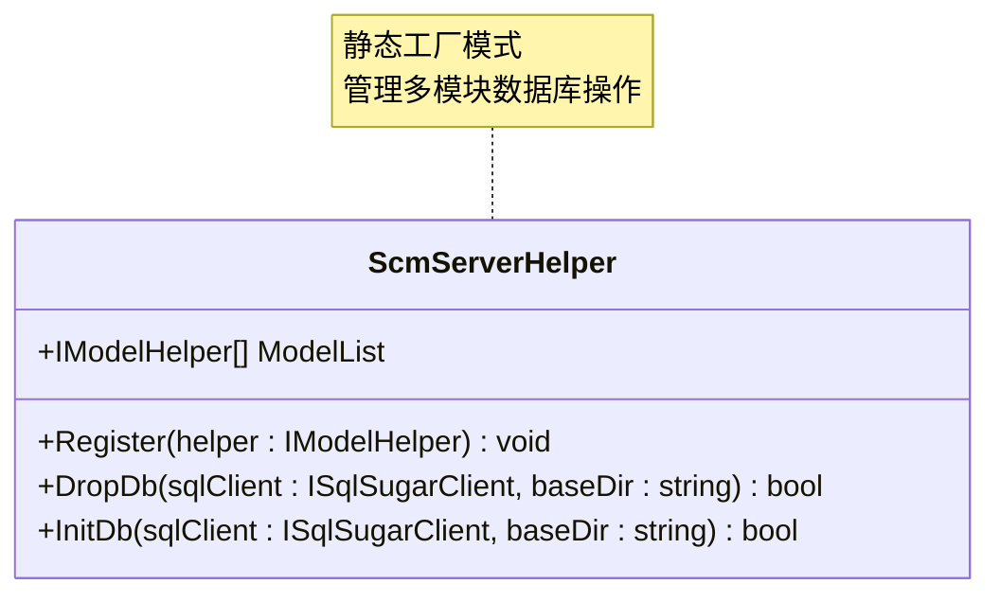
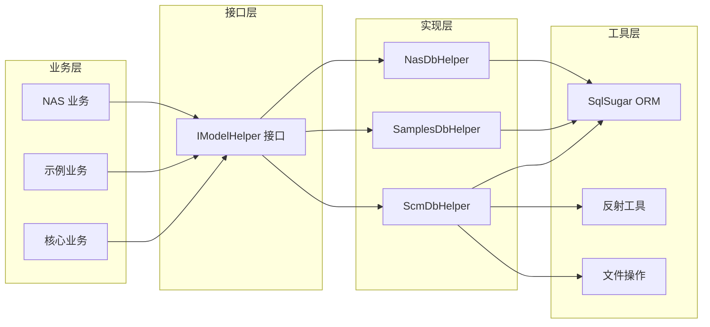
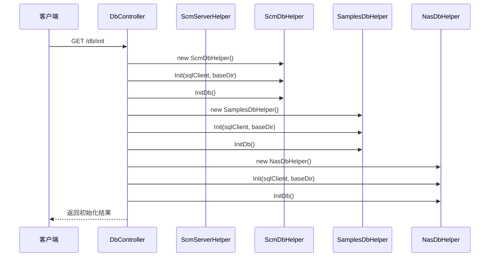

# IModelHelper 接口设计

<cite>
**本文档引用的文件**
- [ScmModelHelper.cs](file://Scm.Server.Dao/ScmModelHelper.cs)
- [ScmDbHelper.cs](file://Scm.Dao/ScmDbHelper.cs)
- [SamplesDbHelper.cs](file://Samples.Server.Dao/SamplesDbHelper.cs)
- [NasDbHelper.cs](file://Nas.Dao/NasDbHelper.cs)
- [ScmServerHelper.cs](file://Scm.Server.Dao/ScmServerHelper.cs)
- [DbController.cs](file://Scm.Net/Controllers/DbController.cs)
</cite>

## 目录
1. [简介](#简介)
2. [项目结构](#项目结构)
3. [核心组件](#核心组件)
4. [架构概览](#架构概览)
5. [详细组件分析](#详细组件分析)
6. [依赖关系分析](#依赖关系分析)
7. [性能考虑](#性能考虑)
8. [故障排除指南](#故障排除指南)
9. [结论](#结论)

## 简介

IModelHelper 接口是 Scm.Net 数据访问层的核心抽象，负责统一管理不同模块的数据库初始化和清理操作。该接口的设计体现了面向对象编程中的开闭原则和依赖倒置原则，通过接口抽象实现了松耦合的数据访问层架构。

在 Scm.Net 项目中，IModelHelper 接口承担着以下关键职责：
- 统一数据库初始化流程
- 提供标准化的数据库清理机制
- 支持多模块数据库管理
- 实现版本化数据库迁移

## 项目结构

Scm.Net 项目采用分层架构设计，IModelHelper 接口位于数据访问层（DAO 层），与业务服务层和控制器层形成清晰的分层关系：

**图表来源**
- [ScmModelHelper.cs:5-12](file://Scm.Server.Dao/ScmModelHelper.cs#L5-L12)
- [ScmDbHelper.cs:16-34](file://Scm.Dao/ScmDbHelper.cs#L16-L34)
- [SamplesDbHelper.cs:6-14](file://Samples.Server.Dao/SamplesDbHelper.cs#L6-L14)
- [NasDbHelper.cs:9-17](file://Nas.Dao/NasDbHelper.cs#L9-L17)

**章节来源**
- [ScmModelHelper.cs:1-14](file://Scm.Server.Dao/ScmModelHelper.cs#L1-L14)
- [ScmDbHelper.cs:1-779](file://Scm.Dao/ScmDbHelper.cs#L1-L779)

## 核心组件

### IModelHelper 接口定义

IModelHelper 接口是 Scm.Net 数据访问层的统一抽象，定义了数据库管理的标准契约：

**图表来源**
- [ScmModelHelper.cs:5-12](file://Scm.Server.Dao/ScmModelHelper.cs#L5-L12)
- [ScmDbHelper.cs:16-83](file://Scm.Dao/ScmDbHelper.cs#L16-L83)
- [SamplesDbHelper.cs:6-51](file://Samples.Server.Dao/SamplesDbHelper.cs#L6-L51)
- [NasDbHelper.cs:9-51](file://Nas.Dao/NasDbHelper.cs#L9-L51)

### 接口方法职责划分

#### Init 方法
- **职责**: 初始化数据库客户端连接和 SQL 目录路径
- **参数**: 
  - `sqlClient`: SqlSugar 客户端实例
  - `baseDir`: SQL 脚本基础目录路径
- **实现要求**: 必须正确设置内部状态，确保后续操作可用

#### DropDb 方法
- **职责**: 清理数据库，删除所有相关表结构
- **返回值**: 操作是否成功的布尔标志
- **实现要求**: 需要处理异常情况，确保幂等性

#### InitDb 方法
- **职责**: 初始化数据库，创建表结构并执行数据迁移
- **返回值**: 操作是否成功的布尔标志
- **实现要求**: 包含版本控制和事务处理

**章节来源**
- [ScmModelHelper.cs:5-12](file://Scm.Server.Dao/ScmModelHelper.cs#L5-L12)
- [ScmDbHelper.cs:30-83](file://Scm.Dao/ScmDbHelper.cs#L30-L83)

## 架构概览

IModelHelper 接口的设计遵循了 SOLID 原则，特别是依赖倒置原则和接口隔离原则：

**图表来源**
- [ScmServerHelper.cs:18-49](file://Scm.Server.Dao/ScmServerHelper.cs#L18-L49)
- [DbController.cs:247-274](file://Scm.Net/Controllers/DbController.cs#L247-L274)

## 详细组件分析

### ScmDbHelper 实现

ScmDbHelper 是 IModelHelper 接口的主要实现，负责核心业务模块的数据库管理：

#### 核心功能特性

1. **版本化管理**: 通过常量 `VER` 和 `DATE` 实现数据库版本控制
2. **脚本执行**: 支持 DDL 和 DML 脚本的条件执行
3. **事务保证**: 使用 SqlSugar 的事务包装确保数据一致性
4. **反射扫描**: 自动扫描并初始化 DAO 类型

#### 数据库初始化流程

**图表来源**
- [ScmDbHelper.cs:51-83](file://Scm.Dao/ScmDbHelper.cs#L51-L83)

#### 核心方法实现要点

**DropDb 方法**: 
- 使用反射扫描所有以 "Dao" 结尾的类
- 检查类是否实现 `ScmDao` 接口
- 获取 SugarTable 特性的表名
- 条件删除已存在的表

**InitDb 方法**:
- 读取或创建版本记录
- 初始化所有 DAO 表结构
- 条件执行 DDL 和 DML 脚本
- 更新版本信息到数据库

**章节来源**
- [ScmDbHelper.cs:16-83](file://Scm.Dao/ScmDbHelper.cs#L16-L83)

### 模块化实现策略

#### SamplesDbHelper 实现
- 继承自 ScmDbHelper，重写版本常量
- 提供示例数据的 UID 初始化
- 支持独立的数据库脚本执行

#### NasDbHelper 实现
- 继承自 ScmDbHelper，专门处理 NAS 模块
- 使用独立的版本控制和脚本文件
- 支持模块化的数据库管理

**章节来源**
- [SamplesDbHelper.cs:6-51](file://Samples.Server.Dao/SamplesDbHelper.cs#L6-L51)
- [NasDbHelper.cs:9-51](file://Nas.Dao/NasDbHelper.cs#L9-L51)

### 服务器辅助类

ScmServerHelper 提供了静态方法来管理多个 IModelHelper 实例：

**图表来源**
- [ScmServerHelper.cs:5-51](file://Scm.Server.Dao/ScmServerHelper.cs#L5-L51)

**章节来源**
- [ScmServerHelper.cs:1-53](file://Scm.Server.Dao/ScmServerHelper.cs#L1-L53)

## 依赖关系分析

IModelHelper 接口的设计实现了良好的依赖解耦：

**图表来源**
- [ScmModelHelper.cs:1-14](file://Scm.Server.Dao/ScmModelHelper.cs#L1-L14)
- [ScmDbHelper.cs:1-12](file://Scm.Dao/ScmDbHelper.cs#L1-L12)

### 控制器集成

DbController 展示了 IModelHelper 接口在实际应用中的使用方式：

**图表来源**
- [DbController.cs:247-274](file://Scm.Net/Controllers/DbController.cs#L247-L274)

**章节来源**
- [DbController.cs:215-287](file://Scm.Net/Controllers/DbController.cs#L215-L287)

## 性能考虑

### 优化策略

1. **连接池管理**: 使用 SqlSugar 的连接池配置，避免频繁创建连接
2. **批量操作**: 在初始化过程中使用批量插入和更新操作
3. **事务边界**: 合理使用事务包装，减少数据库往返次数
4. **缓存机制**: 利用 ScmServerHelper 的静态列表缓存 IModelHelper 实例

### 内存管理

- 避免在循环中重复创建 IModelHelper 实例
- 及时释放 SqlSugarClient 连接
- 使用 `using` 语句确保资源正确释放

## 故障排除指南

### 常见问题及解决方案

#### 数据库连接失败
- 检查连接字符串配置
- 验证数据库服务状态
- 确认网络连接可用性

#### 权限不足
- 验证数据库用户权限
- 检查 DDL 操作权限
- 确认脚本执行权限

#### 版本冲突
- 检查现有数据库版本
- 验证脚本兼容性
- 手动清理后重新初始化

**章节来源**
- [DbController.cs:199-212](file://Scm.Net/Controllers/DbController.cs#L199-L212)

## 结论

IModelHelper 接口设计充分体现了现代软件架构的最佳实践：

### 设计优势

1. **松耦合**: 通过接口抽象实现了模块间的低耦合
2. **可扩展性**: 支持新增模块的无缝集成
3. **可维护性**: 统一的数据库管理接口便于维护
4. **可测试性**: 接口抽象便于单元测试和模拟

### 最佳实践建议

1. **接口设计**: 保持接口简洁，职责单一
2. **实现分离**: 不同模块实现独立，避免相互依赖
3. **错误处理**: 完善的异常处理和回滚机制
4. **性能优化**: 合理的连接管理和事务控制
5. **安全性**: 输入验证和权限控制

IModelHelper 接口的成功设计为 Scm.Net 项目的可持续发展奠定了坚实的基础，其架构模式可以作为其他类似项目的参考模板。