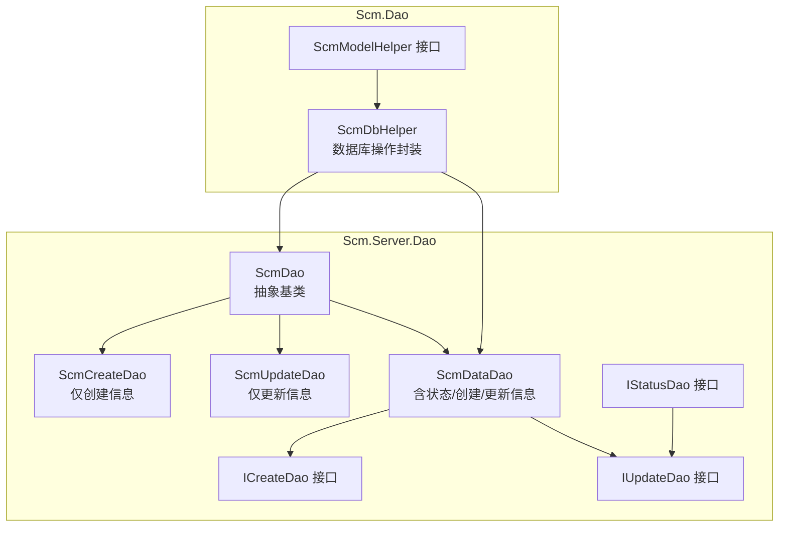
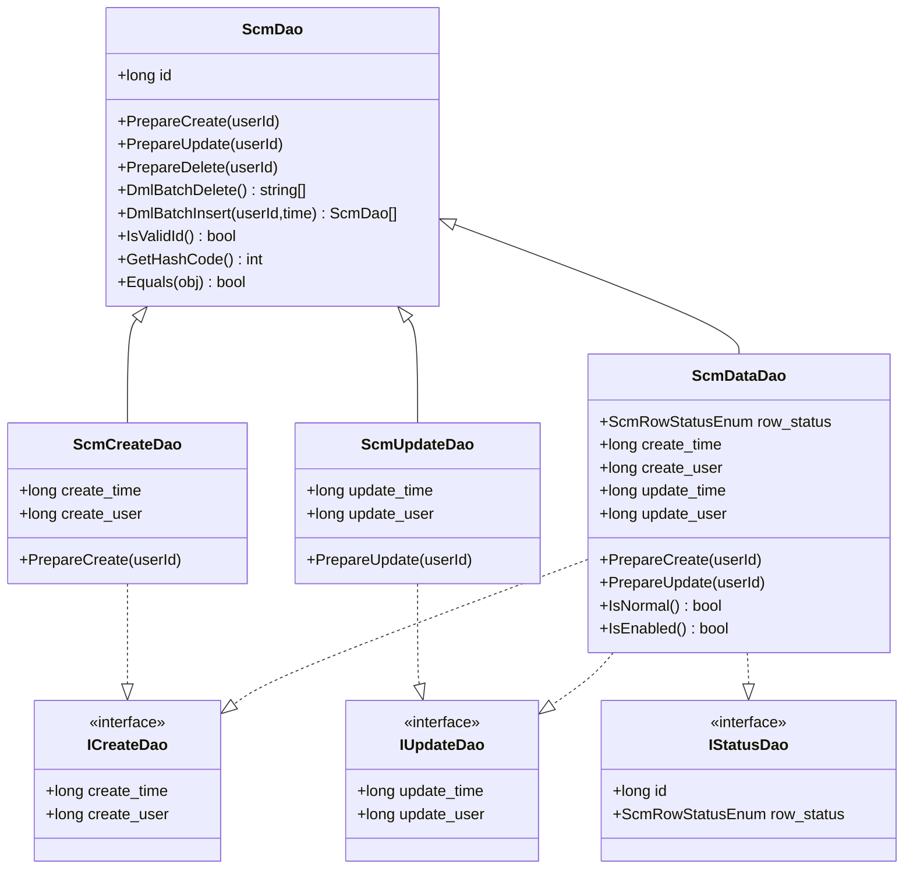
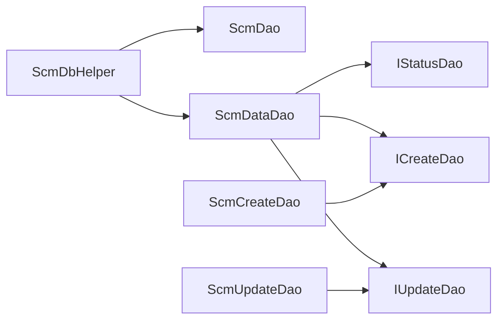
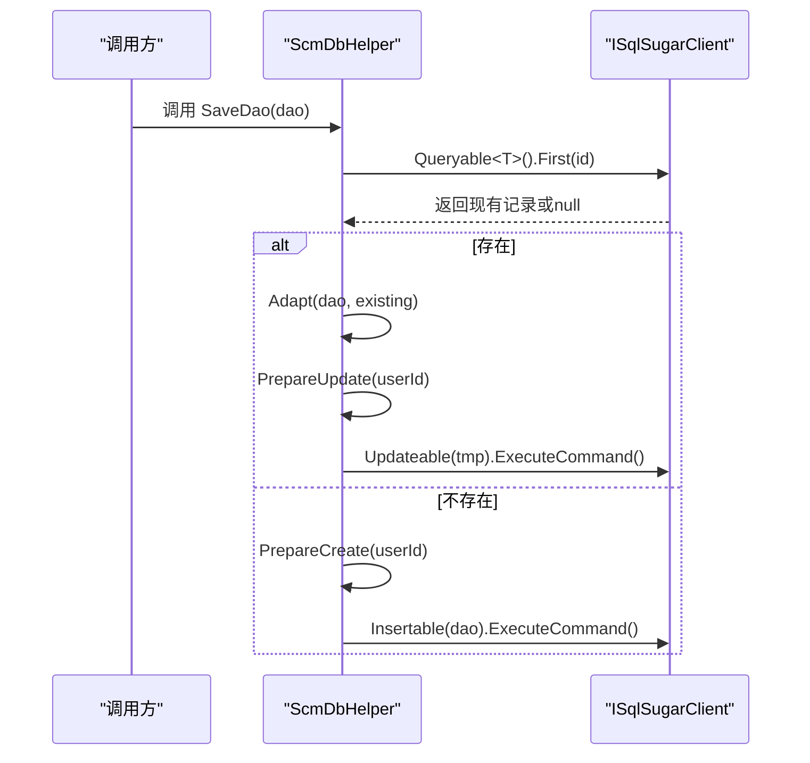
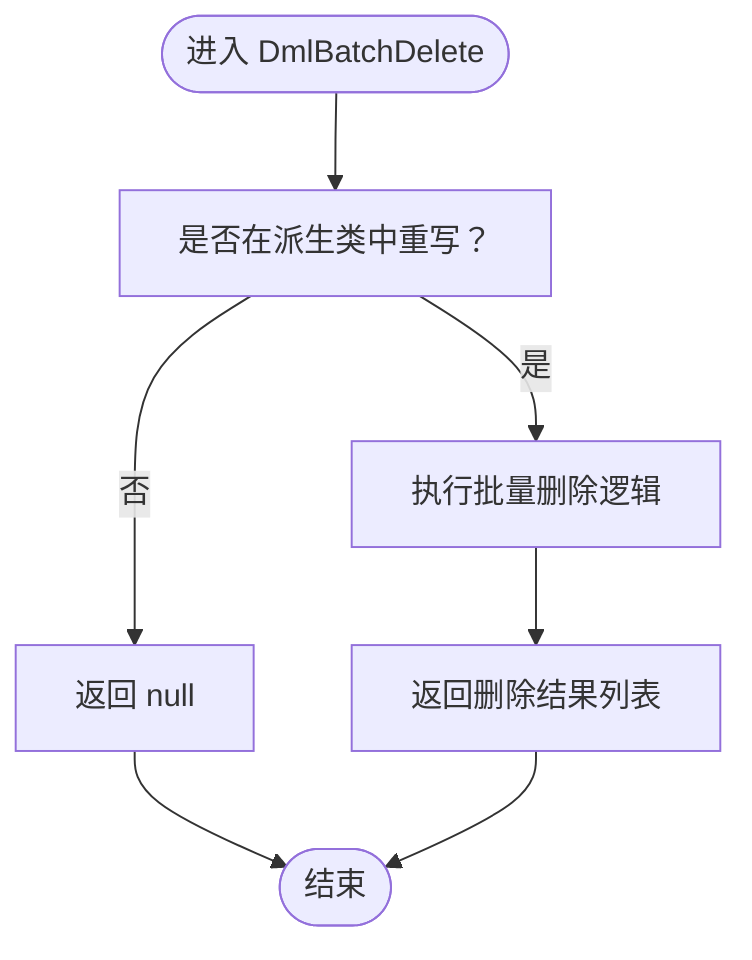

# ScmDao 继承体系

<cite>
**本文引用的文件**
- [ScmDao.cs](file://Scm.Server.Dao/Dao/ScmDao.cs)
- [ScmDataDao.cs](file://Scm.Server.Dao/Dao/ScmDataDao.cs)
- [ScmCreateDao.cs](file://Scm.Server.Dao/Dao/ScmCreateDao.cs)
- [ScmUpdateDao.cs](file://Scm.Server.Dao/Dao/ScmUpdateDao.cs)
- [ICreateDao.cs](file://Scm.Server.Dao/Dao/ICreateDao.cs)
- [IUpdateDao.cs](file://Scm.Server.Dao/Dao/IUpdateDao.cs)
- [IStatusDao.cs](file://Scm.Server.Dao/Dao/IStatusDao.cs)
- [ScmDbHelper.cs](file://Scm.Dao/ScmDbHelper.cs)
- [ScmModelHelper.cs](file://Scm.Server.Dao/ScmModelHelper.cs)
</cite>

## 目录
1. [简介](#简介)
2. [项目结构](#项目结构)
3. [核心组件](#核心组件)
4. [架构总览](#架构总览)
5. [详细组件分析](#详细组件分析)
6. [依赖分析](#依赖分析)
7. [性能考虑](#性能考虑)
8. [故障排查指南](#故障排查指南)
9. [结论](#结论)
10. [附录](#附录)

## 简介
本文件系统性梳理 ScmDao 继承体系，围绕抽象基类 ScmDao 及其派生类 ScmDataDao、ScmCreateDao、ScmUpdateDao 的设计模式、职责划分、泛型约束与类型安全、数据模型映射与数据库表结构对应关系展开，并给出完整类继承层次图、关键流程时序图与算法流程图，帮助开发者正确使用与扩展该 DAO 基础设施。

## 项目结构
ScmDao 位于 Scm.Server.Dao 模块下，作为所有业务 DAO 的统一基类；同时在 Scm.Dao 中提供通用数据库操作封装 ScmDbHelper，负责插入、更新、删除、保存、批量操作等基础设施能力。接口层 ICreateDao、IUpdateDao、IStatusDao 定义了创建、更新与状态相关的行为契约。

图表来源
- [ScmDao.cs:6-68](file://Scm.Server.Dao/Dao/ScmDao.cs#L6-L68)
- [ScmCreateDao.cs:5-25](file://Scm.Server.Dao/Dao/ScmCreateDao.cs#L5-L25)
- [ScmUpdateDao.cs:5-25](file://Scm.Server.Dao/Dao/ScmUpdateDao.cs#L5-L25)
- [ScmDataDao.cs:7-66](file://Scm.Server.Dao/Dao/ScmDataDao.cs#L7-L66)
- [ICreateDao.cs:3-8](file://Scm.Server.Dao/Dao/ICreateDao.cs#L3-L8)
- [IUpdateDao.cs:3-7](file://Scm.Server.Dao/Dao/IUpdateDao.cs#L3-L7)
- [IStatusDao.cs:6-12](file://Scm.Server.Dao/Dao/IStatusDao.cs#L6-L12)
- [ScmDbHelper.cs:16-187](file://Scm.Dao/ScmDbHelper.cs#L16-L187)
- [ScmModelHelper.cs:5-13](file://Scm.Server.Dao/ScmModelHelper.cs#L5-L13)

章节来源
- [ScmDao.cs:6-68](file://Scm.Server.Dao/Dao/ScmDao.cs#L6-L68)
- [ScmDataDao.cs:7-66](file://Scm.Server.Dao/Dao/ScmDataDao.cs#L7-L66)
- [ScmCreateDao.cs:5-25](file://Scm.Server.Dao/Dao/ScmCreateDao.cs#L5-L25)
- [ScmUpdateDao.cs:5-25](file://Scm.Server.Dao/Dao/ScmUpdateDao.cs#L5-L25)
- [ICreateDao.cs:3-8](file://Scm.Server.Dao/Dao/ICreateDao.cs#L3-L8)
- [IUpdateDao.cs:3-7](file://Scm.Server.Dao/Dao/IUpdateDao.cs#L3-L7)
- [IStatusDao.cs:6-12](file://Scm.Server.Dao/Dao/IStatusDao.cs#L6-L12)
- [ScmDbHelper.cs:16-187](file://Scm.Dao/ScmDbHelper.cs#L16-L187)
- [ScmModelHelper.cs:5-13](file://Scm.Server.Dao/ScmModelHelper.cs#L5-L13)

## 核心组件
- ScmDao：提供唯一标识 id、基础生命周期准备（PrepareCreate/PrepareUpdate/PrepareDelete）、批量 DML（DmlBatchDelete/DmlBatchInsert）以及对象相等性与哈希逻辑。
- ScmCreateDao：继承 ScmDao 并实现 ICreateDao，负责创建时间与创建人字段的自动填充。
- ScmUpdateDao：继承 ScmDao 并实现 IUpdateDao，负责更新时间与更新人的自动填充。
- ScmDataDao：继承 ScmDao 并实现 IStatusDao、ICreateDao，额外包含行状态 row_status 与完整的创建/更新审计字段，提供 IsNormal/IsEnabled 等便捷判断。
- 接口契约：ICreateDao/IUpdateDao/IStatusDao 明确了创建、更新与状态字段的约定，便于按需组合。
- ScmDbHelper：提供泛型 InsertDao/UpdateDao/DeleteDao/SaveDao/SaveDataDao 等方法，均通过 where T : ScmDao,new() 或 where T : ScmDataDao,new() 确保类型安全与可实例化能力。

章节来源
- [ScmDao.cs:6-68](file://Scm.Server.Dao/Dao/ScmDao.cs#L6-L68)
- [ScmCreateDao.cs:5-25](file://Scm.Server.Dao/Dao/ScmCreateDao.cs#L5-L25)
- [ScmUpdateDao.cs:5-25](file://Scm.Server.Dao/Dao/ScmUpdateDao.cs#L5-L25)
- [ScmDataDao.cs:7-66](file://Scm.Server.Dao/Dao/ScmDataDao.cs#L7-L66)
- [ICreateDao.cs:3-8](file://Scm.Server.Dao/Dao/ICreateDao.cs#L3-L8)
- [IUpdateDao.cs:3-7](file://Scm.Server.Dao/Dao/IUpdateDao.cs#L3-L7)
- [IStatusDao.cs:6-12](file://Scm.Server.Dao/Dao/IStatusDao.cs#L6-L12)
- [ScmDbHelper.cs:125-187](file://Scm.Dao/ScmDbHelper.cs#L125-L187)

## 架构总览
ScmDao 体系采用“抽象基类 + 接口契约 + 泛型约束”的设计，确保：
- 统一的数据模型与生命周期管理；
- 按需组合的审计字段（创建/更新/状态）；
- 编译期类型安全与运行期可实例化的约束；
- 与 SqlSugar ORM 的无缝集成与可扩展的仓储封装。

图表来源
- [ScmDao.cs:6-68](file://Scm.Server.Dao/Dao/ScmDao.cs#L6-L68)
- [ScmCreateDao.cs:5-25](file://Scm.Server.Dao/Dao/ScmCreateDao.cs#L5-L25)
- [ScmUpdateDao.cs:5-25](file://Scm.Server.Dao/Dao/ScmUpdateDao.cs#L5-L25)
- [ScmDataDao.cs:7-66](file://Scm.Server.Dao/Dao/ScmDataDao.cs#L7-L66)
- [ICreateDao.cs:3-8](file://Scm.Server.Dao/Dao/ICreateDao.cs#L3-L8)
- [IUpdateDao.cs:3-7](file://Scm.Server.Dao/Dao/IUpdateDao.cs#L3-L7)
- [IStatusDao.cs:6-12](file://Scm.Server.Dao/Dao/IStatusDao.cs#L6-L12)

## 详细组件分析

### ScmDao 抽象基类
- 设计要点
  - 唯一标识 id 使用 SugarColumn 标注为主键；
  - 提供 PrepareCreate/PrepareUpdate/PrepareDelete 生命周期钩子，允许派生类覆盖以注入业务逻辑；
  - 提供 DmlBatchDelete/DmlBatchInsert 扩展点，支持批量删除与批量插入；
  - 重写 Equals/GetHashCode 基于 id，保证集合去重与字典键值稳定性。
- 适用场景
  - 作为所有业务实体的最小公共父类，统一主键与相等性语义；
  - 为需要批量 DML 的实体提供扩展点。

章节来源
- [ScmDao.cs:6-68](file://Scm.Server.Dao/Dao/ScmDao.cs#L6-L68)

### ScmCreateDao（仅创建信息）
- 设计要点
  - 继承 ScmDao，实现 ICreateDao；
  - 在 PrepareCreate 中自动填充创建人与创建时间；
  - 适合无需状态控制、仅需审计创建信息的实体。
- 适用场景
  - 日志、消息、临时数据等不需要状态流转的实体。

章节来源
- [ScmCreateDao.cs:5-25](file://Scm.Server.Dao/Dao/ScmCreateDao.cs#L5-L25)
- [ICreateDao.cs:3-8](file://Scm.Server.Dao/Dao/ICreateDao.cs#L3-L8)

### ScmUpdateDao（仅更新信息）
- 设计要点
  - 继承 ScmDao，实现 IUpdateDao；
  - 在 PrepareUpdate 中自动填充更新人与更新时间；
  - 适合无需状态控制、仅需审计更新信息的实体。
- 适用场景
  - 访问统计、心跳日志等仅记录变更时间与操作人的实体。

章节来源
- [ScmUpdateDao.cs:5-25](file://Scm.Server.Dao/Dao/ScmUpdateDao.cs#L5-L25)
- [IUpdateDao.cs:3-7](file://Scm.Server.Dao/Dao/IUpdateDao.cs#L3-L7)

### ScmDataDao（数据实体：状态+创建+更新）
- 设计要点
  - 继承 ScmDao，实现 IStatusDao、ICreateDao、IUpdateDao；
  - 额外字段：row_status（默认启用）、create_time/create_user、update_time/update_user；
  - 在 PrepareCreate/PrepareUpdate 自动填充审计字段；
  - 提供 IsNormal/IsEnabled 等便捷判断，便于业务状态控制。
- 适用场景
  - 需要启用/禁用、正常/异常等状态管理的实体，如配置项、字典、菜单、角色等。

章节来源
- [ScmDataDao.cs:7-66](file://Scm.Server.Dao/Dao/ScmDataDao.cs#L7-L66)
- [IStatusDao.cs:6-12](file://Scm.Server.Dao/Dao/IStatusDao.cs#L6-L12)
- [ICreateDao.cs:3-8](file://Scm.Server.Dao/Dao/ICreateDao.cs#L3-L8)
- [IUpdateDao.cs:3-7](file://Scm.Server.Dao/Dao/IUpdateDao.cs#L3-L7)

### 泛型约束与类型安全
- 关键方法与约束
  - InsertDao<T>(...) where T : ScmDao, new()
  - UpdateDao<T>(...) where T : ScmDao, new()
  - DeleteDao<T>(...) where T : ScmDao, new()
  - SaveDao<T>(...) where T : ScmDao, new()
  - SaveDataDao<T>(...) where T : ScmDataDao, new()
- 设计意图
  - 确保传入的 DAO 类型必须继承自 ScmDao（或 ScmDataDao），且具备无参构造函数，从而保证 ORM 映射与可实例化；
  - 通过接口 IStatusDao/IUpdateDao/ICreateDao 的组合，按需注入审计与状态能力；
  - 为仓储层提供统一的 CRUD 与保存逻辑，避免重复代码。

章节来源
- [ScmDbHelper.cs:125-187](file://Scm.Dao/ScmDbHelper.cs#L125-L187)

### 数据模型映射与数据库表结构
- 映射关系
  - ScmDao.id 对应数据库主键；
  - ScmDataDao.row_status 使用 SugarColumn 指定列类型与非空约束；
  - ScmCreateDao/ScmUpdateDao/ScmDataDao 的审计字段映射到对应的列名与类型；
- 表结构建议
  - 所有 DAO 类型均通过 SqlSugar 的 CodeFirst 初始化表结构；
  - 未标注 SugarTable 的类型不会被扫描初始化；
  - 建议为每个实体添加 SugarTable 标注以纳入初始化范围。

章节来源
- [ScmDao.cs:11-12](file://Scm.Server.Dao/Dao/ScmDao.cs#L11-L12)
- [ScmDataDao.cs:12-13](file://Scm.Server.Dao/Dao/ScmDataDao.cs#L12-L13)
- [ScmDbHelper.cs:293-338](file://Scm.Dao/ScmDbHelper.cs#L293-L338)

### 继承体系中的重写方法与扩展点
- ScmDao
  - PrepareCreate/PrepareUpdate/PrepareDelete：生命周期钩子，派生类可覆盖以注入业务逻辑；
  - DmlBatchDelete/DmlBatchInsert：批量操作扩展点；
  - Equals/GetHashCode：基于 id 的相等性判断。
- ScmCreateDao/ScmUpdateDao/ScmDataDao
  - 覆盖 PrepareCreate/PrepareUpdate，自动填充审计字段；
  - ScmDataDao 额外提供 IsNormal/IsEnabled 状态判断。

章节来源
- [ScmDao.cs:14-67](file://Scm.Server.Dao/Dao/ScmDao.cs#L14-L67)
- [ScmCreateDao.cs:17-23](file://Scm.Server.Dao/Dao/ScmCreateDao.cs#L17-L23)
- [ScmUpdateDao.cs:17-23](file://Scm.Server.Dao/Dao/ScmUpdateDao.cs#L17-L23)
- [ScmDataDao.cs:35-64](file://Scm.Server.Dao/Dao/ScmDataDao.cs#L35-L64)

### 使用方法与最佳实践
- 插入/更新/删除/保存
  - 使用 ScmDbHelper 的 InsertDao/UpdateDao/DeleteDao/SaveDao；
  - 对于带状态的实体，使用 SaveDataDao 并指定目标状态；
- 自定义 DAO 开发
  - 若仅需创建/更新审计：继承 ScmCreateDao 或 ScmUpdateDao；
  - 若需要状态控制：继承 ScmDataDao；
  - 若需要完全自定义：直接继承 ScmDao 并自行实现接口契约；
- 泛型调用
  - 通过 where T : ScmDao,new() 或 where T : ScmDataDao,new() 约束，确保类型安全与可实例化。

章节来源
- [ScmDbHelper.cs:125-187](file://Scm.Dao/ScmDbHelper.cs#L125-L187)
- [ScmDataDao.cs:7-66](file://Scm.Server.Dao/Dao/ScmDataDao.cs#L7-L66)
- [ScmCreateDao.cs:5-25](file://Scm.Server.Dao/Dao/ScmCreateDao.cs#L5-L25)
- [ScmUpdateDao.cs:5-25](file://Scm.Server.Dao/Dao/ScmUpdateDao.cs#L5-L25)

## 依赖分析
- 组件耦合
  - ScmDbHelper 依赖 ScmDao 及其派生类，通过泛型约束实现统一操作；
  - ScmDataDao 同时实现 IStatusDao、ICreateDao、IUpdateDao，形成“状态+创建+更新”的复合能力；
  - 接口 ICreateDao/IUpdateDao/IStatusDao 降低具体实现的耦合度，便于按需组合。
- 外部依赖
  - SqlSugar ORM：用于 CodeFirst 初始化表结构、查询、插入、更新、删除与事务执行；
  - ScmEnv/TimeUtils/UidUtils：提供默认用户 ID、时间戳与唯一 ID 生成。

图表来源
- [ScmDbHelper.cs:125-187](file://Scm.Dao/ScmDbHelper.cs#L125-L187)
- [ScmDao.cs:6-68](file://Scm.Server.Dao/Dao/ScmDao.cs#L6-L68)
- [ScmDataDao.cs:7-66](file://Scm.Server.Dao/Dao/ScmDataDao.cs#L7-L66)
- [ICreateDao.cs:3-8](file://Scm.Server.Dao/Dao/ICreateDao.cs#L3-L8)
- [IUpdateDao.cs:3-7](file://Scm.Server.Dao/Dao/IUpdateDao.cs#L3-L7)
- [IStatusDao.cs:6-12](file://Scm.Server.Dao/Dao/IStatusDao.cs#L6-L12)

章节来源
- [ScmDbHelper.cs:125-187](file://Scm.Dao/ScmDbHelper.cs#L125-L187)
- [ScmDao.cs:6-68](file://Scm.Server.Dao/Dao/ScmDao.cs#L6-L68)
- [ScmDataDao.cs:7-66](file://Scm.Server.Dao/Dao/ScmDataDao.cs#L7-L66)
- [ICreateDao.cs:3-8](file://Scm.Server.Dao/Dao/ICreateDao.cs#L3-L8)
- [IUpdateDao.cs:3-7](file://Scm.Server.Dao/Dao/IUpdateDao.cs#L3-L7)
- [IStatusDao.cs:6-12](file://Scm.Server.Dao/Dao/IStatusDao.cs#L6-L12)

## 性能考虑
- 批量操作
  - DmlBatchDelete/DmlBatchInsert 提供批量扩展点，可在派生类中实现高效批量处理；
- 查询与更新
  - SaveDao 通过 First 查询存在性再 Adapt 合并，减少不必要的字段更新；
- 表结构初始化
  - CodeFirst 扫描所有以 Dao 结尾且实现 ScmDao 的类型，按 SugarTable 注解初始化表；
- 事务与脚本
  - 支持事务包裹的 SQL 脚本执行，便于批量初始化与迁移。

章节来源
- [ScmDao.cs:34-46](file://Scm.Server.Dao/Dao/ScmDao.cs#L34-L46)
- [ScmDbHelper.cs:157-170](file://Scm.Dao/ScmDbHelper.cs#L157-L170)
- [ScmDbHelper.cs:293-338](file://Scm.Dao/ScmDbHelper.cs#L293-L338)
- [ScmDbHelper.cs:224-262](file://Scm.Dao/ScmDbHelper.cs#L224-L262)

## 故障排查指南
- 无法初始化表
  - 检查 DAO 类是否以 Dao 结尾且实现 ScmDao；
  - 确认类上是否标注 SugarTable；
  - 查看 CodeFirst 初始化日志与异常堆栈。
- 保存失败或字段未更新
  - 确认 SaveDao/SaveDataDao 是否正确传入泛型类型；
  - 检查 PrepareCreate/PrepareUpdate 是否被正确覆盖；
  - 核对审计字段是否为空导致更新失败。
- 批量操作未生效
  - 检查 DmlBatchDelete/DmlBatchInsert 的返回值与实现；
  - 确认批量操作是否在事务中执行。

章节来源
- [ScmDbHelper.cs:293-338](file://Scm.Dao/ScmDbHelper.cs#L293-L338)
- [ScmDbHelper.cs:157-170](file://Scm.Dao/ScmDbHelper.cs#L157-L170)
- [ScmDao.cs:34-46](file://Scm.Server.Dao/Dao/ScmDao.cs#L34-L46)

## 结论
ScmDao 继承体系通过抽象基类与接口契约的组合，实现了“最小可用 + 按需扩展”的设计目标。借助泛型约束与 SqlSugar 的 CodeFirst 能力，既保证了类型安全与可维护性，又提供了灵活的批量与状态管理能力。推荐在新业务实体中优先选择 ScmDataDao 作为基类，以获得完整的状态与审计能力；对于仅需创建/更新审计的实体，可分别选择 ScmCreateDao/ScmUpdateDao；对于高度定制的实体，可直接继承 ScmDao 并按需实现接口。

## 附录

### 适用场景速查
- 仅创建审计：ScmCreateDao
- 仅更新审计：ScmUpdateDao
- 需要状态控制：ScmDataDao
- 自定义扩展：ScmDao + 接口组合

### 关键流程时序图：保存流程（SaveDao）

图表来源
- [ScmDbHelper.cs:157-170](file://Scm.Dao/ScmDbHelper.cs#L157-L170)

### 算法流程图：批量删除（DmlBatchDelete）

图表来源
- [ScmDao.cs:34-37](file://Scm.Server.Dao/Dao/ScmDao.cs#L34-L37)